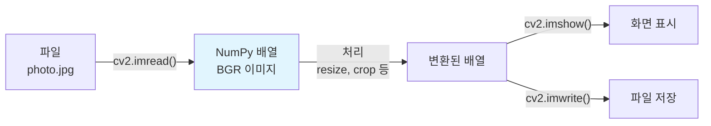
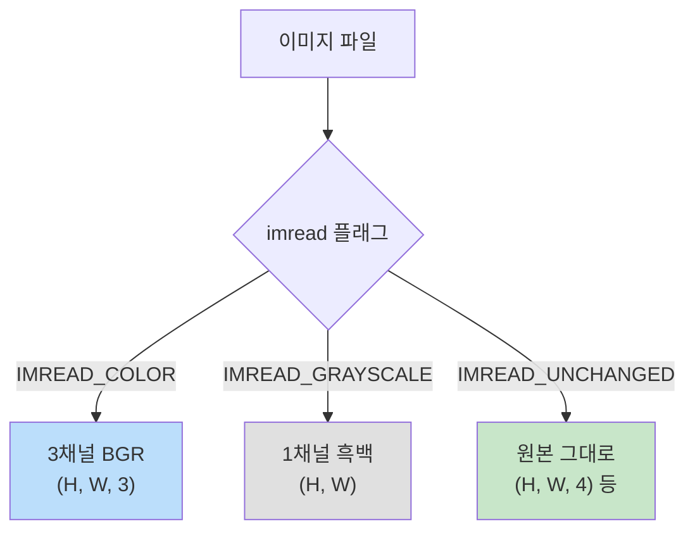

# OpenCV 시작하기

> OpenCV 설치와 기본 이미지 입출력

## 개요

이론을 배웠으니 이제 코드로 이미지를 직접 다뤄볼 차례입니다. **OpenCV**는 컴퓨터 비전 분야에서 가장 널리 사용되는 오픈소스 라이브러리로, 전 세계 연구자와 개발자가 매일 사용합니다. 이 섹션에서는 설치부터 이미지를 읽고, 보고, 저장하는 기본 작업까지 익힙니다.

**선수 지식**: [이미지란 무엇인가](../01-foundations/01-what-is-image.md) — 픽셀, NumPy 배열 / [색상 공간의 이해](../01-foundations/02-color-spaces.md) — BGR, RGB
**학습 목표**:
- OpenCV를 설치하고 버전을 확인할 수 있다
- 이미지를 읽고(`imread`), 표시하고(`imshow`), 저장(`imwrite`)할 수 있다
- 이미지 크기 조절, 자르기, 회전 등 기본 조작을 할 수 있다

## 왜 알아야 할까?

OpenCV는 **C++로 작성되어 빠르고**, **Python으로 쉽게 쓸 수 있으며**, 2,500개 이상의 최적화된 알고리즘을 제공합니다. 필터링, 에지 검출, 객체 추적, 얼굴 인식 등 전통적 CV 작업은 물론, 딥러닝 전처리에서도 빠지지 않는 필수 도구입니다.

> 💡 **비유**: OpenCV는 컴퓨터 비전의 **맥가이버 칼**입니다. 이미지와 관련된 거의 모든 작업을 하나의 라이브러리로 해결할 수 있습니다.

> 📊 **그림 1**: OpenCV 기본 워크플로우 — 읽기, 처리, 출력의 3단계




## 핵심 개념

### 1. 설치

```python
# pip으로 설치 (가장 간단)
# pip install opencv-python

# GUI 기능 없는 서버/도커 환경용
# pip install opencv-python-headless

# 추가 모듈 포함 (SIFT 등)
# pip install opencv-contrib-python
```

설치 후 확인:

```python
import cv2
print(cv2.__version__)  # 예: 4.10.0
```

> **패키지 이름 주의**: 설치는 `opencv-python`, 임포트는 `cv2`입니다. 이름이 다르므로 헷갈리지 마세요!

### 2. 이미지 읽기 — `cv2.imread()`

> 💡 **비유**: `imread`는 **파일 캐비닛에서 사진을 꺼내** 책상(메모리) 위에 올려놓는 것입니다. 꺼내야 비로소 사진을 들여다볼 수 있습니다.

```python
import cv2

# 컬러로 읽기 (기본값)
img = cv2.imread("photo.jpg")

# 흑백으로 읽기
gray = cv2.imread("photo.jpg", cv2.IMREAD_GRAYSCALE)

# 알파 채널(투명도) 포함 읽기
rgba = cv2.imread("logo.png", cv2.IMREAD_UNCHANGED)

# 읽기 실패 확인 (경로 오류 시 None 반환)
if img is None:
    print("이미지를 찾을 수 없습니다!")
```

**읽기 플래그 정리:**

| 플래그 | 값 | 결과 |
|--------|---|------|
| `cv2.IMREAD_COLOR` | 1 | 컬러(BGR) 3채널 (기본값) |
| `cv2.IMREAD_GRAYSCALE` | 0 | 흑백 1채널 |
| `cv2.IMREAD_UNCHANGED` | -1 | 알파 채널 포함 원본 그대로 |

> 📊 **그림 2**: imread 플래그에 따른 채널 구조 변화




### 3. 이미지 정보 확인

```python
import cv2

img = cv2.imread("photo.jpg")

print(f"형태(shape): {img.shape}")     # (높이, 너비, 채널) 예: (1080, 1920, 3)
print(f"데이터 타입: {img.dtype}")      # uint8
print(f"총 픽셀 수: {img.size}")        # 높이 × 너비 × 채널

height, width, channels = img.shape
print(f"해상도: {width}×{height}, {channels}채널")
```

### 4. 이미지 표시 — `cv2.imshow()`

```python
import cv2

img = cv2.imread("photo.jpg")

cv2.imshow("My Image", img)   # 창 이름, 이미지
cv2.waitKey(0)                 # 키 입력까지 대기 (0 = 무한 대기)
cv2.destroyAllWindows()        # 모든 창 닫기
```

> **Jupyter Notebook 사용 시**: `cv2.imshow()`는 노트북에서 잘 작동하지 않습니다. 대신 Matplotlib을 사용하세요.

```python
import cv2
import matplotlib.pyplot as plt

img = cv2.imread("photo.jpg")
img_rgb = cv2.cvtColor(img, cv2.COLOR_BGR2RGB)  # BGR → RGB 변환 필수!

plt.imshow(img_rgb)
plt.axis("off")
plt.show()
```

### 5. 이미지 저장 — `cv2.imwrite()`

```python
import cv2

img = cv2.imread("photo.jpg")

# PNG로 저장 (무손실)
cv2.imwrite("output.png", img)

# JPEG 품질 지정하여 저장 (0~100)
cv2.imwrite("output.jpg", img, [cv2.IMWRITE_JPEG_QUALITY, 90])

# 저장 성공 여부 확인
success = cv2.imwrite("output.webp", img)
print(f"저장 성공: {success}")  # True 또는 False
```

### 6. 기본 이미지 조작

```python
import cv2

img = cv2.imread("photo.jpg")
height, width = img.shape[:2]

# === 크기 조절 ===
# 절반 크기로 줄이기
small = cv2.resize(img, (width // 2, height // 2))

# 원하는 크기로 조절 (너비, 높이 순서!)
resized = cv2.resize(img, (640, 480))

# 비율 유지하며 조절
scaled = cv2.resize(img, None, fx=0.5, fy=0.5)

print(f"원본: {img.shape}, 축소: {small.shape}")
```

```python
import cv2

img = cv2.imread("photo.jpg")

# === 자르기 (Crop) — NumPy 슬라이싱 ===
# img[y시작:y끝, x시작:x끝]
cropped = img[100:400, 200:500]  # y:100~400, x:200~500 영역

print(f"원본: {img.shape}, 잘라낸 부분: {cropped.shape}")
```

```python
import cv2

img = cv2.imread("photo.jpg")
height, width = img.shape[:2]

# === 회전 ===
# 중심점 기준 45도 회전, 크기 유지
center = (width // 2, height // 2)
matrix = cv2.getRotationMatrix2D(center, 45, 1.0)  # (중심, 각도, 스케일)
rotated = cv2.warpAffine(img, matrix, (width, height))

# === 뒤집기 ===
flipped_h = cv2.flip(img, 1)   # 좌우 반전
flipped_v = cv2.flip(img, 0)   # 상하 반전
flipped_both = cv2.flip(img, -1)  # 상하좌우 반전
```

## 실습: 직접 해보기

### 이미지 정보 요약 함수 만들기

```python
import cv2
import os

def image_info(filepath):
    """이미지 파일의 모든 기본 정보를 출력합니다."""
    # 파일 크기
    file_size = os.path.getsize(filepath)

    # 이미지 읽기
    img = cv2.imread(filepath)
    if img is None:
        print(f"❌ '{filepath}'를 읽을 수 없습니다.")
        return

    h, w = img.shape[:2]
    channels = img.shape[2] if len(img.shape) == 3 else 1

    print(f"📁 파일: {filepath}")
    print(f"📐 해상도: {w}×{h} ({w*h:,}픽셀)")
    print(f"🎨 채널 수: {channels}")
    print(f"📊 데이터 타입: {img.dtype}")
    print(f"💾 파일 크기: {file_size/1024:.1f} KB")
    print(f"🔢 메모리 크기: {img.nbytes/1024:.1f} KB")
    print(f"📈 픽셀 값 범위: {img.min()} ~ {img.max()}")

# 사용 예시
image_info("photo.jpg")
```

## 더 깊이 알아보기

> 💡 **알고 계셨나요?**: OpenCV는 1999년 **인텔 연구소(Intel Research)**에서 Gary Bradski가 시작한 프로젝트입니다. 원래 목적은 CPU 집약적인 비전 연산을 통해 인텔 프로세서의 활용도를 높이는 것이었는데요, 오픈소스로 공개되면서 전 세계 CV 커뮤니티의 표준 도구가 되었습니다. 2000년 첫 알파 버전이 공개된 이후, 현재는 인텔을 넘어 독립 재단(OpenCV.org)이 관리하고 있죠.

**왜 BGR 순서일까?**

OpenCV를 처음 쓸 때 누구나 의아해하는 부분이 바로 "왜 RGB가 아니라 BGR인가?"입니다. 이건 역사적인 이유가 있거든요. Windows 초기에 사용된 `COLORREF` 데이터 타입이 `0x00bbggrr` 순서로 색상을 저장했습니다. OpenCV가 Windows 환경에서 처음 개발되었기 때문에 이 관례를 그대로 따르게 된 것이죠. 20년이 넘은 지금도 호환성을 위해 BGR을 기본으로 유지하고 있습니다.

**`cv2`라는 이름의 비밀**

`import cv2`에서 '2'는 OpenCV **버전 2.0의 Python API**라는 뜻입니다. OpenCV 1.x 시절에는 C 스타일의 `cv` 모듈을 사용했는데, 2.0에서 객체지향적인 새 API가 도입되면서 `cv2`라는 이름이 붙었습니다. 현재 OpenCV 4.x를 사용하고 있지만, Python 모듈 이름은 여전히 `cv2`인 거죠. 가끔 "cv4는 언제 나오나요?"라고 묻는 분이 있는데, `cv2`는 버전이 아니라 API 세대를 의미하는 것이니 혼동하지 마세요!

## 흔한 오해와 팁

> ⚠️ **흔한 오해**: "OpenCV는 Python 라이브러리다" — 사실 OpenCV의 **핵심은 C++로 작성**되어 있습니다. 우리가 쓰는 `cv2`는 C++ 라이브러리 위에 Python 바인딩을 씌운 것이에요. 그래서 Python임에도 불구하고 이미지 처리 속도가 빠른 거죠. NumPy 배열을 그대로 C++ 코드에 넘겨서 처리하기 때문에, 순수 Python 루프로 픽셀을 하나씩 조작하는 것보다 수십~수백 배 빠릅니다.

> 💡 **알고 계셨나요?**: `cv2`의 '2'는 OpenCV 2.0에서 도입된 새로운 Python API라는 뜻입니다. 현재 OpenCV 4.x 버전을 사용하고 있는데도 `import cv2`를 쓰는 이유가 바로 이것이에요. "cv4 모듈은 왜 없나요?"라는 질문을 가끔 보는데, `cv2`는 버전 번호가 아니라 API 세대를 나타내는 것이랍니다.

> 🔥 **실무 팁**: 이미지 색상이 이상하게 보인다면, **BGR/RGB 변환을 가장 먼저 확인**하세요. 초보자 디버깅 시간의 상당 부분이 여기서 소모됩니다. OpenCV로 읽은 이미지를 Matplotlib으로 표시할 때, PIL로 읽은 이미지를 OpenCV 함수에 넣을 때 — 이런 라이브러리 간 전환 시점에서 BGR/RGB 문제가 거의 반드시 발생하거든요. 의심이 되면 `cv2.cvtColor(img, cv2.COLOR_BGR2RGB)`를 넣어보세요.

## 핵심 정리

| 함수 | 용도 | 핵심 주의사항 |
|------|------|-------------|
| `cv2.imread()` | 이미지 읽기 | BGR 순서! 실패 시 None 반환 |
| `cv2.imshow()` | 이미지 표시 | `waitKey()` 필수, 노트북에선 Matplotlib 사용 |
| `cv2.imwrite()` | 이미지 저장 | 확장자로 형식 자동 결정 |
| `cv2.resize()` | 크기 조절 | `(너비, 높이)` 순서 주의 |
| `cv2.cvtColor()` | 색상 변환 | BGR↔RGB, BGR↔GRAY 등 |
| NumPy 슬라이싱 | 이미지 자르기 | `img[y:y, x:x]` 순서 |

> **자주 하는 실수 TOP 3:**
> 1. BGR을 RGB로 안 바꾸고 Matplotlib에 표시 → 색이 이상해짐
> 2. `resize()`에서 (높이, 너비) 순서로 넣음 → 가로세로가 뒤바뀜
> 3. `imread()` 실패 시 None 체크 안 함 → 이후 코드에서 에러 발생

## 다음 섹션 미리보기

이미지를 읽고 저장하는 법을 배웠으니, 이제 이미지에 **변환을 가하는 방법**을 알아볼 차례입니다. 다음 섹션 **[필터와 커널](./02-filters-kernels.md)**에서는 블러, 샤프닝 등 이미지 필터가 어떻게 동작하는지 배웁니다.

## 참고 자료

- [OpenCV 공식 튜토리얼 - Getting Started with Images](https://docs.opencv.org/4.x/db/deb/tutorial_display_image.html) - imread, imshow, imwrite 공식 가이드
- [OpenCV 공식 블로그 - Read, Display and Write an Image](https://opencv.org/blog/read-display-and-write-an-image-using-opencv/) - C++/Python 비교와 함께 설명
- [LearnOpenCV - Read, Display and Write an Image](https://learnopencv.com/read-display-and-write-an-image-using-opencv/) - 단계별 상세 설명
- [OpenCV 설치 가이드 (pip)](https://docs.opencv.org/4.x/db/dd1/tutorial_py_pip_install.html) - 공식 설치 문서
- [GeeksforGeeks - OpenCV Python Tutorial](https://www.geeksforgeeks.org/python/opencv-python-tutorial/) - OpenCV 전체 기능 개요
