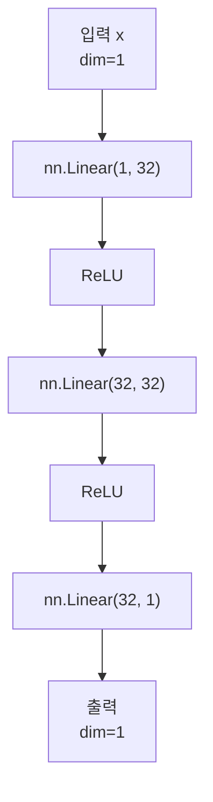
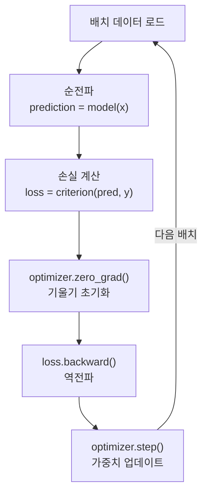
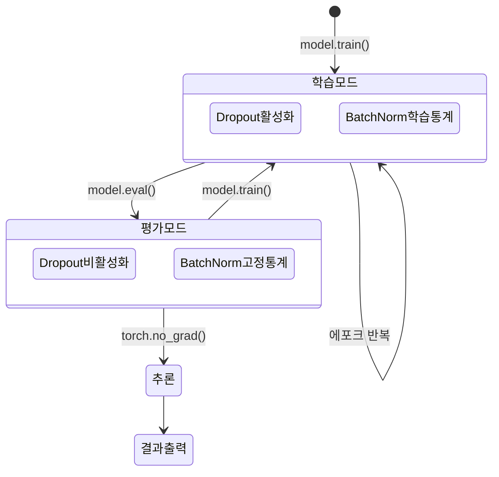

# PyTorch 기초

> 텐서, 자동미분, 모델 구축

## 개요

지금까지 신경망의 이론(뉴런, 활성화 함수, 역전파, 손실/옵티마이저)을 배웠습니다. 이 섹션에서는 이 모든 것을 **PyTorch로 실전 구현**하는 방법을 체계적으로 정리합니다. 텐서 연산부터 학습 루프까지, 앞으로 모든 딥러닝 실습의 기반이 됩니다.

**선수 지식**: Chapter 03의 이전 4개 섹션 (신경망, 활성화, 역전파, 손실/옵티마이저)
**학습 목표**:
- 텐서(Tensor)를 생성하고 조작할 수 있다
- Dataset과 DataLoader를 사용해 데이터를 준비할 수 있다
- 완전한 학습 루프를 작성할 수 있다

## 왜 알아야 할까?

PyTorch는 메타(Meta), OpenAI, 대부분의 학술 연구에서 사용하는 **딥러닝의 사실상 표준 프레임워크**입니다. 이 섹션에서 익히는 패턴은 CNN, Transformer, Diffusion 모델 등 앞으로 배울 **모든 모델에서 동일하게** 사용됩니다.

## 핵심 개념

### 1. 텐서(Tensor) — PyTorch의 기본 단위

> 💡 **비유**: NumPy의 ndarray에 **GPU 가속**과 **자동 미분** 기능을 달아준 것입니다. 사용법도 NumPy와 거의 같습니다.

```python
import torch

# === 텐서 생성 ===
# 직접 값 지정
a = torch.tensor([1.0, 2.0, 3.0])
print(f"1D 텐서: {a}, shape: {a.shape}")

# 0으로 채운 텐서
zeros = torch.zeros(3, 4)
print(f"영 텐서: shape = {zeros.shape}")

# 1로 채운 텐서
ones = torch.ones(2, 3)

# 랜덤 텐서
rand = torch.randn(2, 3)  # 정규분포

# NumPy에서 변환
import numpy as np
np_array = np.array([1, 2, 3])
tensor_from_np = torch.from_numpy(np_array)
```

```python
import torch

# === 텐서 연산 ===
x = torch.tensor([1.0, 2.0, 3.0])
y = torch.tensor([4.0, 5.0, 6.0])

print(f"덧셈: {x + y}")           # [5, 7, 9]
print(f"곱셈: {x * y}")           # [4, 10, 18] (원소별)
print(f"행렬곱: {x @ y}")         # 32.0 (내적)

# shape 변경
a = torch.randn(2, 3, 4)
b = a.view(2, 12)       # 형태 변경 (메모리 연속일 때)
c = a.reshape(6, 4)     # 형태 변경 (항상 동작)
print(f"원본: {a.shape} → view: {b.shape}, reshape: {c.shape}")

# 차원 추가/제거
x = torch.randn(3, 4)
x_unsqueeze = x.unsqueeze(0)     # [1, 3, 4] — 배치 차원 추가
x_squeeze = x_unsqueeze.squeeze(0)  # [3, 4] — 크기 1인 차원 제거
```

```python
import torch

# === GPU 사용 ===
device = torch.device("cuda" if torch.cuda.is_available() else "cpu")
print(f"사용 장치: {device}")

x = torch.randn(3, 3).to(device)  # GPU로 이동
print(f"텐서 장치: {x.device}")
```

### 2. Dataset과 DataLoader — 데이터 파이프라인

> 📊 **그림 1**: Dataset과 DataLoader의 데이터 공급 흐름


> 💡 **비유**: Dataset은 **재료 창고**이고, DataLoader는 **배달 트럭**입니다. 창고에서 재료(데이터)를 꺼내고, 트럭이 일정량(배치)씩 주방(모델)에 배달합니다.

```python
import torch
from torch.utils.data import Dataset, DataLoader

class SimpleDataset(Dataset):
    """커스텀 데이터셋 — 3개 메서드만 구현하면 됩니다."""

    def __init__(self, num_samples=1000):
        # y = 2x + 1 + 노이즈
        self.x = torch.randn(num_samples, 1)
        self.y = 2 * self.x + 1 + torch.randn(num_samples, 1) * 0.1

    def __len__(self):
        """데이터셋의 총 샘플 수"""
        return len(self.x)

    def __getitem__(self, idx):
        """인덱스로 하나의 샘플 반환"""
        return self.x[idx], self.y[idx]

# Dataset 생성
dataset = SimpleDataset(1000)
print(f"데이터셋 크기: {len(dataset)}")
print(f"첫 번째 샘플: x={dataset[0][0].item():.3f}, y={dataset[0][1].item():.3f}")

# DataLoader 생성 — 배치 단위로 데이터 공급
dataloader = DataLoader(dataset, batch_size=32, shuffle=True)

# 한 배치 확인
batch_x, batch_y = next(iter(dataloader))
print(f"배치 shape: x={batch_x.shape}, y={batch_y.shape}")  # [32, 1]
```

### 3. 모델 정의 — `nn.Module`

> 📊 **그림 2**: MyModel의 nn.Sequential 레이어 구조




```python
import torch
import torch.nn as nn

class MyModel(nn.Module):
    def __init__(self, input_dim, hidden_dim, output_dim):
        super().__init__()
        self.net = nn.Sequential(
            nn.Linear(input_dim, hidden_dim),
            nn.ReLU(),
            nn.Linear(hidden_dim, hidden_dim),
            nn.ReLU(),
            nn.Linear(hidden_dim, output_dim),
        )

    def forward(self, x):
        return self.net(x)

# 모델 생성
model = MyModel(input_dim=1, hidden_dim=32, output_dim=1)
print(model)

# 파라미터 수 확인
total = sum(p.numel() for p in model.parameters())
trainable = sum(p.numel() for p in model.parameters() if p.requires_grad)
print(f"총 파라미터: {total:,}, 학습 가능: {trainable:,}")
```

### 4. 완전한 학습 루프

이것이 PyTorch의 **핵심 패턴**입니다. 이후 CNN, Transformer, 어떤 모델이든 이 구조를 따릅니다.

> 📊 **그림 3**: PyTorch 학습 루프의 핵심 흐름 (매 배치 반복)




```python
import torch
import torch.nn as nn
from torch.utils.data import DataLoader

# ===== 1. 준비 =====
device = torch.device("cuda" if torch.cuda.is_available() else "cpu")

# 데이터
train_dataset = SimpleDataset(1000)  # 위에서 정의한 클래스
train_loader = DataLoader(train_dataset, batch_size=32, shuffle=True)

# 모델
model = MyModel(input_dim=1, hidden_dim=32, output_dim=1).to(device)

# 손실 함수 & 옵티마이저
criterion = nn.MSELoss()
optimizer = torch.optim.Adam(model.parameters(), lr=0.001)

# ===== 2. 학습 =====
num_epochs = 50

for epoch in range(num_epochs):
    model.train()  # 학습 모드
    total_loss = 0

    for batch_x, batch_y in train_loader:
        batch_x = batch_x.to(device)
        batch_y = batch_y.to(device)

        # 순전파
        prediction = model(batch_x)
        loss = criterion(prediction, batch_y)

        # 역전파 + 업데이트
        optimizer.zero_grad()
        loss.backward()
        optimizer.step()

        total_loss += loss.item()

    avg_loss = total_loss / len(train_loader)
    if (epoch + 1) % 10 == 0:
        print(f"Epoch [{epoch+1}/{num_epochs}] 평균 손실: {avg_loss:.4f}")

# ===== 3. 평가 =====
model.eval()  # 평가 모드
with torch.no_grad():  # 기울기 계산 비활성화 (메모리 절약)
    test_x = torch.tensor([[1.0], [2.0], [3.0]]).to(device)
    test_pred = model(test_x)
    print(f"\n예측 결과:")
    for x, pred in zip(test_x, test_pred):
        print(f"  x={x.item():.1f} → 예측={pred.item():.3f} (정답≈{2*x.item()+1:.1f})")
```

### 5. 학습 vs 평가 모드

> 📊 **그림 4**: 학습 모드와 평가 모드의 전환 흐름




| 구분 | 코드 | 효과 |
|------|------|------|
| **학습 모드** | `model.train()` | Dropout 활성화, BatchNorm 학습 통계 사용 |
| **평가 모드** | `model.eval()` | Dropout 비활성화, BatchNorm 고정 통계 사용 |
| **기울기 비활성화** | `with torch.no_grad()` | 메모리 절약, 추론 속도 향상 |

> ⚠️ **흔한 실수**: 평가 시 `model.eval()`과 `torch.no_grad()`를 빼먹으면 결과가 달라지거나 메모리가 낭비됩니다.

### 6. 모델 저장과 불러오기

```python
import torch

# 저장 (가중치만)
torch.save(model.state_dict(), "model_weights.pth")

# 불러오기
model = MyModel(input_dim=1, hidden_dim=32, output_dim=1)
model.load_state_dict(torch.load("model_weights.pth"))
model.eval()

# 체크포인트 저장 (학습 재개용)
torch.save({
    "epoch": epoch,
    "model_state": model.state_dict(),
    "optimizer_state": optimizer.state_dict(),
    "loss": avg_loss,
}, "checkpoint.pth")
```

## 더 깊이 알아보기

### PyTorch의 탄생 이야기 — "우리가 쓰려고 만든 도구"

> 💡 **알고 계셨나요?**: PyTorch를 만든 수미스 친탈라(Soumith Chintala)는 미국 대학원 12곳에 모두 떨어진 경험이 있습니다.

인도 출신의 친탈라는 미국 대학원 입시에서 12곳 모두 불합격이라는 좌절을 겪었지만, 결국 NYU에서 얀 르쿤(Yann LeCun)의 연구실에 합류하게 됩니다. 이후 Meta(당시 Facebook)의 AI 연구소 FAIR에서 PyTorch를 개발했죠. 그가 남긴 유명한 말이 있습니다: **"We built it for ourselves."** (우리가 쓰려고 만든 거예요.)

**TensorFlow와의 전쟁**: 2016년 PyTorch가 등장했을 때, Google의 TensorFlow가 시장을 지배하고 있었습니다. TensorFlow는 **정적 계산 그래프(Static Graph)**를 사용했는데, 이는 먼저 전체 계산 과정을 정의한 뒤 실행하는 방식이었습니다. PyTorch는 반대로 **동적 계산 그래프(Dynamic Graph, Eager Execution)**를 채택했어요. 코드를 한 줄씩 실행하면서 바로 결과를 확인할 수 있고, `print()`로 중간값을 찍어볼 수 있고, Python 디버거(pdb)로 디버깅할 수 있었죠. 연구자들에게 이것은 혁명적이었습니다.

**TensorFlow의 변심**: PyTorch의 인기가 폭발적으로 늘어나자, 결국 TensorFlow 2.0(2019)은 **Eager Execution을 기본 모드로 채택**했습니다. 경쟁자의 핵심 설계 철학을 받아들인 것이죠. 이는 PyTorch의 접근법이 옳았다는 것을 사실상 인정한 셈입니다.

**Torch에서 PyTorch로**: PyTorch의 전신은 Lua 언어 기반의 **Torch**였습니다. 하지만 Python 생태계의 압도적인 편의성 앞에 2018년 Lua Torch는 개발이 중단되었고, PyTorch가 완전히 자리를 잡았습니다. 현재 학술 논문의 약 80% 이상이 PyTorch를 사용하고 있을 정도로, 딥러닝 연구의 사실상 표준이 되었습니다.

## 흔한 오해와 팁

> ⚠️ **흔한 오해**: "PyTorch는 연구용, TensorFlow는 배포(프로덕션)용"
>
> 2019~2020년까지는 어느 정도 맞는 말이었지만, 지금은 아닙니다. PyTorch도 **TorchScript**, **ONNX 변환**, **torch.compile** (PyTorch 2.0), **TorchServe** 등을 통해 프로덕션 배포가 충분히 가능합니다. Tesla의 자율주행, Meta의 추천 시스템 등 대규모 프로덕션 환경에서도 PyTorch가 사용되고 있어요.

> ⚠️ **흔한 오해**: "`model.eval()`은 선택사항이다"
>
> **절대 선택이 아닙니다!** `model.eval()`을 호출하지 않으면 Dropout이 계속 활성화되어 추론할 때마다 결과가 달라지고, BatchNorm이 미니배치 통계를 사용하여 배치 크기에 따라 결과가 변합니다. 학습 시에는 `model.train()`, 평가/추론 시에는 반드시 `model.eval()`을 호출하세요. 이것을 빼먹는 것은 PyTorch 초보자가 가장 많이 하는 실수 중 하나입니다.

> 🔥 **실무 팁**: `torch.no_grad()`는 단순 최적화가 아닌 필수
>
> "메모리를 좀 아끼는 정도겠지"라고 생각할 수 있지만, `torch.no_grad()` 없이 추론하면 PyTorch가 모든 연산의 **계산 그래프를 계속 쌓습니다.** 대량의 데이터를 추론할 때 메모리 사용량이 기하급수적으로 늘어나 **Out of Memory 에러**가 발생할 수 있어요. 추론/평가 코드에서는 항상 `with torch.no_grad():` 블록 안에서 실행하세요.

## 핵심 정리

| 개념 | 설명 |
|------|------|
| **Tensor** | GPU 가속 + 자동미분 지원하는 다차원 배열. NumPy와 유사 |
| **Dataset** | `__len__`, `__getitem__` 구현. 데이터 하나를 반환하는 창고 |
| **DataLoader** | 배치 단위로 섞어서 공급하는 배달 트럭 |
| **nn.Module** | 모델 정의의 기본 클래스. `__init__`과 `forward` 구현 |
| **학습 루프** | 순전파 → 손실 → zero_grad → backward → step |
| **model.eval()** | 평가 시 반드시 호출. Dropout/BatchNorm 동작 변경 |

## 다음 섹션 미리보기

이것으로 **Chapter 03: 딥러닝 기초**가 완료됩니다! 신경망의 이론부터 PyTorch 실전까지 모두 익혔습니다. 다음 챕터 **[CNN 핵심 개념](../04-cnn-fundamentals/01-convolution.md)**에서는 드디어 이미지에 특화된 **합성곱 신경망(CNN)**의 세계에 들어갑니다. 앞서 배운 "필터"가 신경망과 만나면 어떤 마법이 일어나는지 확인하세요!

## 참고 자료

- [PyTorch 공식 - Quickstart Tutorial](https://docs.pytorch.org/tutorials/beginner/basics/quickstart_tutorial.html) - 60분 만에 PyTorch 핵심 파악
- [PyTorch 공식 - Datasets & DataLoaders](https://docs.pytorch.org/tutorials/beginner/basics/data_tutorial.html) - Dataset/DataLoader 공식 가이드
- [PyTorch 공식 - Training with PyTorch](https://docs.pytorch.org/tutorials/beginner/introyt/trainingyt.html) - 학습 루프 단계별 설명
- [Sebastian Raschka - PyTorch in One Hour](https://sebastianraschka.com/teaching/pytorch-1h/) - 텐서부터 멀티 GPU까지 1시간 속성 가이드
- [Machine Learning Mastery - Training with DataLoader](https://machinelearningmastery.com/training-a-pytorch-model-with-dataloader-and-dataset/) - 실용적 학습 예제
