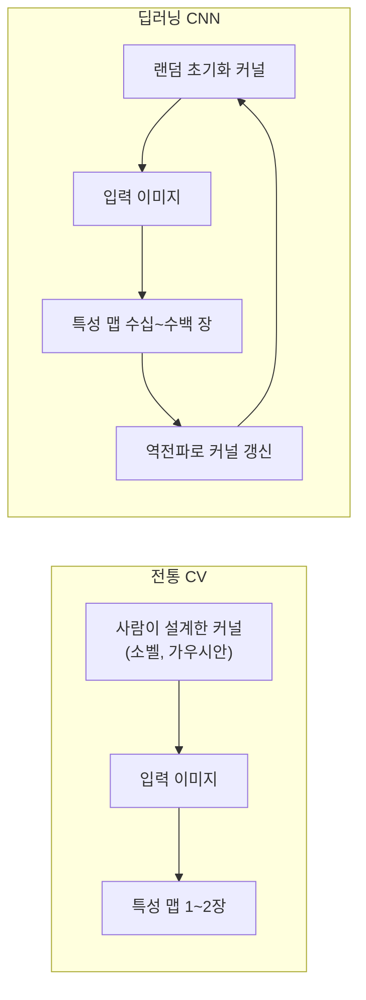
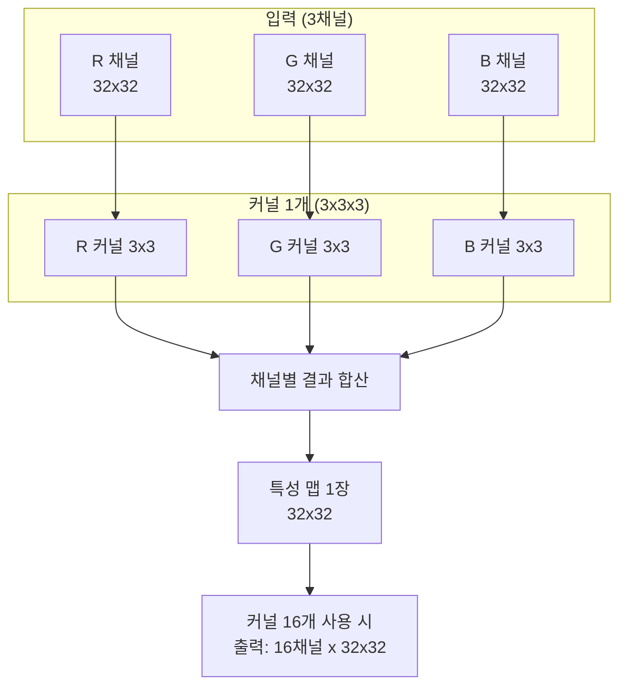
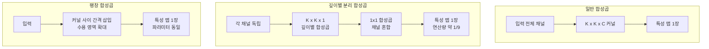
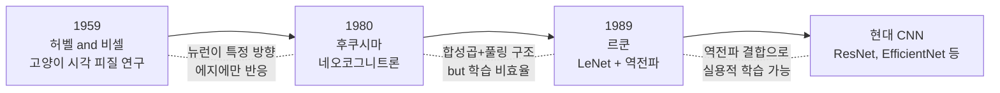

# 합성곱 연산

> 커널, 스트라이드, 패딩의 이해

## 개요

[필터와 커널](../02-classical-cv/02-filters-kernels.md)에서 이미지 위를 작은 숫자 격자(커널)가 슬라이딩하며 새로운 값을 만드는 것을 배웠습니다. 이 섹션에서는 딥러닝에서의 합성곱이 전통적 필터링과 어떻게 다르고, **스트라이드**, **패딩** 등의 핵심 파라미터가 출력에 어떤 영향을 주는지 체계적으로 다룹니다.

**선수 지식**: [필터와 커널](../02-classical-cv/02-filters-kernels.md), [PyTorch 기초](../03-deep-learning-basics/05-pytorch-fundamentals.md)
**학습 목표**:
- 합성곱 연산의 원리와 출력 크기 공식을 이해한다
- 스트라이드와 패딩이 출력에 미치는 영향을 설명할 수 있다
- PyTorch의 `nn.Conv2d`를 자유롭게 사용할 수 있다

## 왜 알아야 할까?

CNN(합성곱 신경망)은 이미지 인식, 객체 탐지, 생성 모델 등 거의 모든 비전 AI의 기반입니다. 그 핵심이 바로 **합성곱 레이어**인데요, 이 레이어의 동작을 정확히 이해하지 못하면 모델 설계 시 "왜 출력 크기가 안 맞지?", "왜 성능이 안 나오지?" 같은 문제에 계속 부딪히게 됩니다. 합성곱을 제대로 이해하면 CNN 아키텍처 전체가 눈에 들어옵니다.

## 핵심 개념

### 1. 합성곱(Convolution) — 전통 필터에서 딥러닝으로

> 📊 **그림 1**: 전통 CV vs 딥러닝 CNN의 합성곱 비교




> 💡 **비유**: 전통적 CV에서는 사람이 "이런 패턴을 찾아라"라고 **커널 값을 직접 설계**했습니다. 마치 선생님이 시험 답안지를 만드는 것처럼요. CNN에서는 네트워크가 수천 장의 이미지를 보면서 **스스로 최적의 커널을 학습**합니다. 학생이 기출문제를 풀며 패턴을 스스로 터득하는 것과 같죠.

[필터와 커널](../02-classical-cv/02-filters-kernels.md)에서 이미 합성곱 연산 자체는 배웠습니다. 핵심을 빠르게 복습하면:

- **커널**(필터): 3×3, 5×5 같은 작은 가중치 행렬
- **슬라이딩**: 입력 이미지 위를 이동하며 겹치는 영역과 원소별 곱 → 합산
- **결과**: 특정 패턴(에지, 텍스처 등)이 강조된 **특성 맵(Feature Map)**

전통 CV와 딥러닝의 결정적 차이를 정리하면 이렇습니다:

| 구분 | 전통 CV | 딥러닝 CNN |
|------|---------|-----------|
| 커널 값 | 사람이 설계 (소벨, 가우시안 등) | 학습으로 자동 결정 |
| 커널 수 | 보통 1~2개 | 수십~수백 개 |
| 다채널 처리 | 채널별로 따로 적용 | 모든 채널을 동시에 처리 |
| 깊이 | 1~2단계 | 수십~수백 층 |

### 2. 다채널 합성곱 — 실제로 이렇게 동작합니다

> 📊 **그림 2**: 다채널 합성곱의 동작 흐름 (RGB → 특성 맵)




흑백 이미지라면 커널도 2D이지만, 컬러(RGB) 이미지는 **3개 채널**이 있죠. 이때 커널은 어떻게 동작할까요?

> 💡 **비유**: RGB 이미지를 3층짜리 아파트라고 생각해보세요. 합성곱 커널은 이 **3층을 한꺼번에 관통하는 탐지기**입니다. 각 층(채널)에서 패턴을 읽은 뒤 결과를 하나로 합쳐 **1장의 특성 맵**을 만듭니다.

구체적으로 입력이 $C_{in}$ 채널이면:
- 커널 1개의 크기: $C_{in} \times K \times K$ (채널 × 높이 × 너비)
- 각 채널별로 2D 합성곱 → $C_{in}$개의 결과를 **모두 더함** → 스칼라 1개
- 이것을 슬라이딩하면 **특성 맵 1장**이 나옴
- 커널을 $C_{out}$개 사용하면 → 출력 채널이 $C_{out}$개

> **입력** (3채널, 32×32) → **커널** (3×3, 16개) → **출력** (16채널, 32×32)

이 과정이 처음엔 복잡해 보이지만, PyTorch에서는 `nn.Conv2d` 한 줄로 끝납니다.

### 3. 패딩(Padding) — 가장자리를 지키는 방법

합성곱을 적용하면 출력이 입력보다 작아집니다. 3×3 커널을 5×5 입력에 적용하면 출력은 3×3이 되죠. 레이어를 쌓을수록 이미지가 점점 줄어드는 문제가 생깁니다.

> 💡 **비유**: 액자에 사진을 넣을 때 **여백(마진)**을 두는 것과 같습니다. 사진 주변에 여백을 추가하면 액자 크기(출력)가 원본 사진 크기(입력)와 같아지죠.

**제로 패딩(Zero Padding)**: 입력 가장자리에 0을 채워 넣는 방법입니다.

| 패딩 종류 | 설명 | 효과 |
|-----------|------|------|
| Valid (패딩 없음) | 커널이 입력 안에서만 이동 | 출력 크기 감소 |
| Same (동일 패딩) | 출력 크기 = 입력 크기가 되도록 패딩 | 크기 유지 |
| Full | 커널이 1픽셀만 겹쳐도 계산 | 출력이 입력보다 커짐 |

실무에서는 **Same 패딩**을 가장 많이 사용합니다. 3×3 커널이면 `padding=1`, 5×5 커널이면 `padding=2`로 설정하면 크기가 유지됩니다.

### 4. 스트라이드(Stride) — 커널의 이동 보폭

기본적으로 커널은 한 칸씩 이동하지만, **스트라이드**를 2 이상으로 설정하면 칸을 건너뛰며 이동합니다.

> 💡 **비유**: 책을 읽을 때 한 줄씩 읽으면 스트라이드 1, 두 줄씩 건너뛰며 읽으면 스트라이드 2입니다. 당연히 스트라이드가 커지면 읽는(출력) 양이 줄어들죠.

| 스트라이드 | 커널 이동 | 출력 크기 | 주 용도 |
|-----------|----------|----------|--------|
| 1 | 한 칸씩 | 크기 유지 (패딩과 함께) | 일반 합성곱 |
| 2 | 두 칸씩 | 약 1/2로 축소 | **다운샘플링** (풀링 대체) |

스트라이드 2의 합성곱은 풀링과 비슷한 다운샘플링 효과를 내면서도 학습 가능한 파라미터를 가지기 때문에, 최신 아키텍처에서는 풀링 대신 **스트라이드 2 합성곱**을 사용하는 경우가 많습니다.

### 5. 출력 크기 공식 — 외울 필요 없이 이해하기

> 📊 **그림 3**: 출력 크기 공식의 직관적 이해


합성곱의 출력 크기를 계산하는 공식은 다음과 같습니다:

$$O = \frac{W - K + 2P}{S} + 1$$

- $W$: 입력 크기 (너비 또는 높이)
- $K$: 커널 크기
- $P$: 패딩
- $S$: 스트라이드
- $O$: 출력 크기

이 공식이 의미하는 바를 직관적으로 풀어보면:
1. 패딩을 추가한 입력 크기: $W + 2P$
2. 커널이 차지하는 공간을 빼면: $W + 2P - K$
3. 스트라이드로 나누면 이동 횟수: $\frac{W + 2P - K}{S}$
4. 첫 위치를 더하면: $+1$

**자주 쓰는 조합을 암기하면 편합니다:**

| 설정 | 입력 32×32 | 출력 |
|------|-----------|------|
| K=3, P=1, S=1 | (32-3+2)/1+1 | **32×32** (크기 유지) |
| K=3, P=1, S=2 | (32-3+2)/2+1 | **16×16** (절반 축소) |
| K=5, P=2, S=1 | (32-5+4)/1+1 | **32×32** (크기 유지) |
| K=1, P=0, S=1 | (32-1+0)/1+1 | **32×32** (채널만 변경) |

> ⚠️ **흔한 오해**: "커널 크기가 크면 무조건 성능이 좋다" — 사실은 3×3 커널을 여러 층 쌓는 것이 5×5나 7×7 하나보다 **파라미터도 적고 표현력도 높습니다**. VGGNet이 이를 증명했고, 이후 대부분의 아키텍처가 3×3을 표준으로 사용합니다.

## 실습: PyTorch로 합성곱 다루기

### 기본 사용법

```python
import torch
import torch.nn as nn

# === 기본 합성곱 레이어 ===
# in_channels: 입력 채널 수 (RGB면 3)
# out_channels: 출력 채널 수 (커널 개수)
# kernel_size: 커널 크기
conv = nn.Conv2d(in_channels=3, out_channels=16, kernel_size=3, padding=1, stride=1)

# 배치 1, RGB 3채널, 32×32 이미지
x = torch.randn(1, 3, 32, 32)
output = conv(x)

print(f"입력 크기:  {x.shape}")       # [1, 3, 32, 32]
print(f"출력 크기:  {output.shape}")   # [1, 16, 32, 32]
print(f"커널 크기:  {conv.weight.shape}")  # [16, 3, 3, 3] → (출력채널, 입력채널, H, W)
print(f"파라미터 수: {conv.weight.numel() + conv.bias.numel()}")  # 16*3*3*3 + 16 = 448
```

### 스트라이드와 패딩 실험

```python
import torch
import torch.nn as nn

x = torch.randn(1, 3, 32, 32)

# 다양한 설정 비교
configs = [
    {"kernel_size": 3, "padding": 1, "stride": 1},  # 크기 유지
    {"kernel_size": 3, "padding": 1, "stride": 2},  # 절반 축소
    {"kernel_size": 5, "padding": 2, "stride": 1},  # 크기 유지 (큰 커널)
    {"kernel_size": 1, "padding": 0, "stride": 1},  # 1x1 합성곱
]

for cfg in configs:
    conv = nn.Conv2d(3, 16, **cfg)
    out = conv(x)
    print(f"K={cfg['kernel_size']}, P={cfg['padding']}, S={cfg['stride']} → {out.shape}")

# 출력:
# K=3, P=1, S=1 → torch.Size([1, 16, 32, 32])
# K=3, P=1, S=2 → torch.Size([1, 16, 16, 16])
# K=5, P=2, S=1 → torch.Size([1, 16, 32, 32])
# K=1, P=0, S=1 → torch.Size([1, 16, 32, 32])
```

### 학습되는 커널 시각화

```python
import torch
import torch.nn as nn

# 간단한 2-레이어 CNN
model = nn.Sequential(
    nn.Conv2d(1, 8, kernel_size=3, padding=1),   # 흑백 → 8채널
    nn.ReLU(),
    nn.Conv2d(8, 16, kernel_size=3, padding=1),  # 8채널 → 16채널
    nn.ReLU(),
)

# 학습 전 커널 값 확인 (랜덤 초기화)
first_layer = model[0]
print(f"첫 레이어 커널 shape: {first_layer.weight.shape}")  # [8, 1, 3, 3]
print(f"커널 값 범위: {first_layer.weight.min():.3f} ~ {first_layer.weight.max():.3f}")

# 전체 파라미터 수 계산
total_params = sum(p.numel() for p in model.parameters())
print(f"전체 파라미터 수: {total_params:,}")
# 8*1*3*3 + 8 + 16*8*3*3 + 16 = 72 + 8 + 1152 + 16 = 1,248
```

## 더 깊이 알아보기

### 다양한 합성곱 변형

> 📊 **그림 4**: 합성곱 변형 비교 — 일반 vs 깊이별 분리 vs 팽창




기본 합성곱 외에도 특수 목적의 변형들이 있습니다:

**1×1 합성곱 (Pointwise Convolution)**
- 공간 크기는 유지하면서 **채널 수만 변경**
- GoogLeNet의 Inception 모듈에서 처음 활용되어, 연산량을 크게 줄이는 핵심 기법이 되었습니다
- 채널 간 정보를 섞는 역할도 합니다

**깊이별 분리 합성곱 (Depthwise Separable Convolution)**
- 일반 합성곱을 **깊이별 합성곱** + **1×1 합성곱**으로 분리
- 연산량이 약 1/8~1/9로 줄어듦
- MobileNet, EfficientNet 등 경량 모델의 핵심

**팽창 합성곱 (Dilated/Atrous Convolution)**
- 커널 원소 사이에 간격을 두어 **수용 영역(Receptive Field)을 넓힘**
- 파라미터 증가 없이 더 넓은 맥락을 볼 수 있음
- 시맨틱 세그멘테이션에서 많이 사용

> 이 변형들은 [CNN 아키텍처의 진화](../05-cnn-architectures/01-lenet-alexnet.md)에서 더 자세히 다룹니다.

### CNN의 탄생 — 고양이 실험에서 딥러닝까지

> 📊 **그림 5**: CNN의 탄생 — 고양이 뇌에서 딥러닝까지




CNN의 역사는 **고양이의 뇌**에서 시작됩니다. 1959년, 신경과학자 **데이비드 허벨(David Hubel)**과 **토르스텐 비셀(Torsten Wiesel)**은 고양이의 시각 피질을 연구하다가 놀라운 사실을 발견했습니다. 뇌의 뉴런들이 시야의 **특정 방향 에지에만 반응**한다는 것이었죠. 이 발견으로 두 사람은 1981년 노벨 생리의학상을 수상합니다.

이 발견에서 영감을 받은 일본의 컴퓨터 과학자 **후쿠시마 쿠니히코(Kunihiko Fukushima)**는 1980년, 최초의 합성곱 신경망이라 할 수 있는 **네오코그니트론(Neocognitron)**을 발표합니다. 뇌의 단순 세포와 복합 세포를 모방한 다층 구조였지만, 학습 방법이 비효율적이라는 한계가 있었습니다.

그리고 1989년, **얀 르쿤(Yann LeCun)**이 AT&T 벨 연구소에서 후쿠시마의 아키텍처에 **역전파 알고리즘**을 결합한 **LeNet**을 발표합니다. 이것이 현대 CNN의 직접적인 조상이며, 미국 전역의 수표 인식 시스템에 상용 배포되었습니다. 고양이 실험 → 네오코그니트론 → LeNet으로 이어진 이 흐름이 오늘날 비전 AI의 시작점입니다.

> 💡 **알고 계셨나요?**: 후쿠시마의 네오코그니트론에는 이미 합성곱, 풀링의 개념이 모두 들어있었습니다. 르쿤의 천재성은 여기에 역전파를 결합해 **실용적으로 학습 가능한 시스템**을 만든 데 있습니다.

## 흔한 오해와 팁

> ⚠️ **흔한 오해**: "합성곱은 수학의 Convolution과 같다" — 엄밀히 말하면 딥러닝의 합성곱은 수학적으로는 **상호상관(Cross-correlation)**입니다. 진짜 합성곱은 커널을 뒤집어야 하는데, CNN에서는 커널이 학습되므로 뒤집든 안 뒤집든 결과적으로 같은 커널을 학습하게 됩니다. 그래서 관례적으로 "합성곱"이라 부릅니다.

> 🔥 **실무 팁**: `nn.Conv2d`에서 `bias=False`를 자주 보게 될 텐데요, 이는 합성곱 뒤에 배치 정규화(BatchNorm)가 오면 bias가 의미 없어지기 때문입니다. BatchNorm이 평균을 빼주므로 bias는 상쇄됩니다. 이 내용은 [배치 정규화](./03-batch-normalization.md)에서 더 자세히 다룹니다.

> 🔥 **실무 팁**: 커널 크기는 **홀수**를 사용하세요. 홀수여야 중심 픽셀이 명확하고, 패딩을 대칭으로 적용해 출력 크기를 깔끔하게 유지할 수 있습니다. 3×3이 사실상 표준이고, 첫 번째 레이어에만 7×7을 쓰는 경우가 있습니다 (ResNet 등).

## 핵심 정리

| 개념 | 설명 |
|------|------|
| 합성곱 | 커널을 슬라이딩하며 입력과 원소별 곱 → 합산하는 연산 |
| 커널(필터) | 학습 가능한 가중치 행렬. CNN에서는 자동으로 최적값을 학습 |
| 패딩 | 입력 가장자리에 0을 채워 출력 크기를 유지하는 기법 |
| 스트라이드 | 커널의 이동 보폭. 2 이상이면 다운샘플링 효과 |
| 출력 공식 | $O = (W - K + 2P) / S + 1$ |
| 다채널 합성곱 | 모든 입력 채널에 대해 동시에 합성곱 후 합산 |
| 1×1 합성곱 | 공간 크기 유지, 채널 수만 변경하는 특수 합성곱 |

## 다음 섹션 미리보기

합성곱으로 특성 맵을 만들었는데, 크기가 너무 크면 연산 부담이 커지고 과적합 위험도 있습니다. [풀링 레이어](./02-pooling.md)에서는 특성 맵의 크기를 효율적으로 줄이면서 핵심 정보를 보존하는 방법을 배웁니다.

## 참고 자료

- [Dive into Deep Learning - Padding and Stride](https://d2l.ai/chapter_convolutional-neural-networks/padding-and-strides.html) - 패딩과 스트라이드를 인터랙티브하게 설명하는 교과서
- [CS231n: Convolutional Neural Networks](https://cs231n.github.io/convolutional-networks/) - 스탠포드 CNN 강의, 합성곱의 수학적 직관을 잘 설명
- [A Comprehensive Survey of Convolutions in Deep Learning](https://arxiv.org/html/2402.15490v2) - 2024년 합성곱 변형 전체를 아우르는 서베이 논문
- [Who Really Invented CNNs?](https://ponderwall.com/index.php/2025/12/07/convolutional-neural-networks/) - 후쿠시마부터 르쿤까지 CNN 역사 정리
