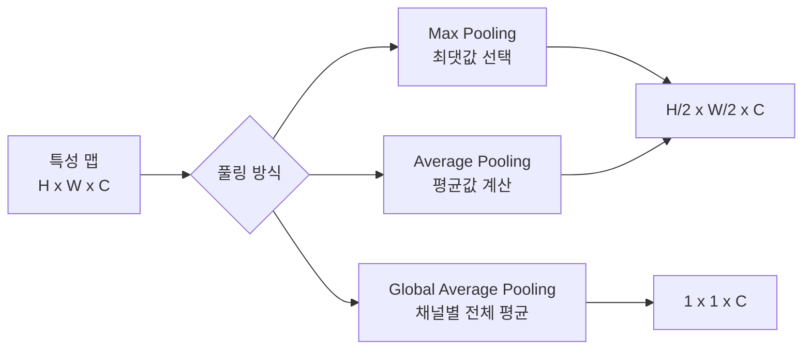
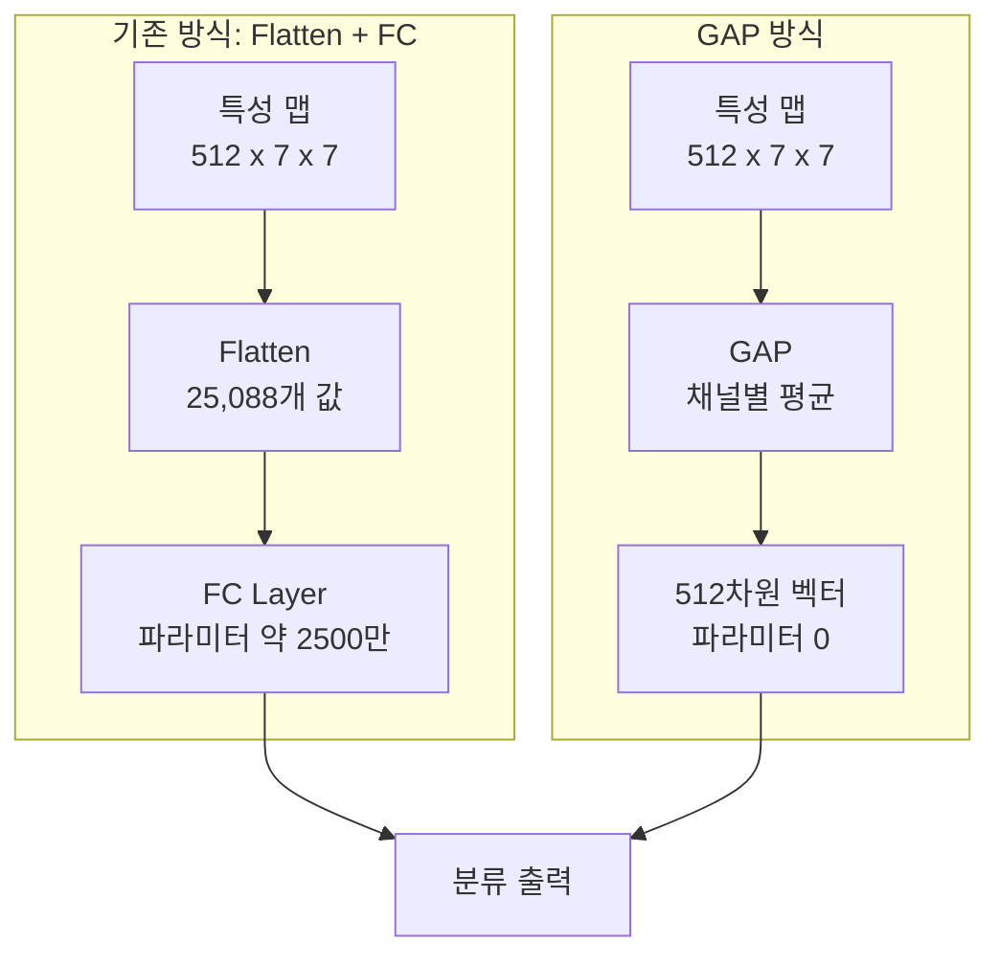
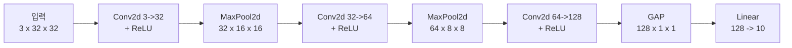

# 풀링 레이어

> Max Pooling, Average Pooling, Global Pooling

## 개요

[합성곱 연산](./01-convolution.md)에서 커널이 이미지를 훑으며 특성 맵을 만드는 방법을 배웠습니다. 그런데 특성 맵의 크기가 크면 연산량이 폭발하고, 미세한 위치 변화에도 민감해집니다. 이 섹션에서는 특성 맵의 크기를 줄이면서 핵심 정보를 보존하는 **풀링(Pooling)** 기법을 배웁니다.

**선수 지식**: [합성곱 연산](./01-convolution.md) — 커널, 스트라이드, 패딩, 출력 크기 공식
**학습 목표**:
- Max Pooling과 Average Pooling의 차이를 설명할 수 있다
- Global Average Pooling의 역할과 장점을 이해한다
- 풀링 vs 스트라이드 합성곱의 트레이드오프를 판단할 수 있다

## 왜 알아야 할까?

32×32 이미지에 합성곱을 적용하면 특성 맵도 32×32입니다. 이 상태로 레이어를 쌓으면 연산량이 엄청나겠죠? 풀링은 **공간 크기를 줄여 연산 효율을 높이면서**, 동시에 **위치 변화에 강건한(robust) 특성**을 만들어줍니다. 거의 모든 CNN 아키텍처에 풀링이 포함되어 있으니, 이해하지 않으면 아키텍처 해석 자체가 어렵습니다.

## 핵심 개념

### 1. 풀링이란? — 핵심만 남기는 요약 기술

> 📊 **그림 1**: 풀링의 종류와 역할 — CNN에서의 다운샘플링 전략




> 💡 **비유**: 100페이지짜리 보고서를 10페이지 요약본으로 만드는 것과 같습니다. 중요한 내용(최댓값)만 뽑거나, 전체 평균을 내거나, 방법은 달라도 목적은 같습니다 — **핵심은 유지하면서 크기를 줄이는 것**이죠.

풀링은 합성곱과 비슷하게 윈도우를 슬라이딩하지만, **학습할 파라미터가 없습니다**. 정해진 규칙(최대, 평균 등)에 따라 값을 하나로 축약할 뿐이죠.

| 특성 | 합성곱 | 풀링 |
|------|--------|------|
| 파라미터 | 학습 가능한 커널 | **없음** |
| 채널 변화 | 변경 가능 | **유지** |
| 공간 크기 | 설정에 따라 | 보통 **축소** |
| 주 목적 | 특성 추출 | **다운샘플링** |

### 2. Max Pooling — 가장 강한 신호만 남긴다

> 💡 **비유**: 반 친구 4명의 시험 점수 중 **최고 점수만** 대표로 뽑는 것입니다. "이 영역에서 가장 강하게 반응한 특성이 있었다"는 정보만 남기는 거죠.

2×2 Max Pooling (스트라이드 2)의 동작:

| 입력 (4×4) | | | | | 출력 (2×2) | |
|:---:|:---:|:---:|:---:|---|:---:|:---:|
| 1 | 3 | 2 | 1 | | **5** | **6** |
| **5** | 2 | **6** | 4 | | **8** | **7** |
| 3 | **8** | 1 | 2 | | | |
| 4 | 2 | **7** | 3 | | | |

> 각 2×2 영역에서 최댓값(굵은 숫자)만 뽑아 출력합니다. 4×4 → 2×2로 크기가 **절반**이 됩니다.

**Max Pooling의 장점:**
- 가장 강한 활성화만 보존 → 에지, 텍스처 등 **강한 특성에 유리**
- 작은 위치 변화에 둔감 → **이동 불변성(Translation Invariance)** 부여
- 파라미터 없음 → 연산 매우 빠름

### 3. Average Pooling — 전체 맥락을 고르게

> 💡 **비유**: 4명의 시험 점수 **평균**을 내는 것입니다. 한 명의 극단적인 점수보다 전체적인 수준을 파악하는 데 적합하죠.

같은 입력에 Average Pooling을 적용하면:

| 입력 영역 | 계산 | 결과 |
|-----------|------|------|
| 1, 3, 5, 2 | (1+3+5+2)/4 | **2.75** |
| 2, 1, 6, 4 | (2+1+6+4)/4 | **3.25** |
| 3, 8, 4, 2 | (3+8+4+2)/4 | **4.25** |
| 1, 2, 7, 3 | (1+2+7+3)/4 | **3.25** |

**Max vs Average — 언제 뭘 써야 할까?**

| 상황 | 추천 풀링 | 이유 |
|------|----------|------|
| 에지·텍스처 검출 | Max Pooling | 강한 특성이 중요 |
| 전체적인 톤·색상 | Average Pooling | 부드러운 특성이 중요 |
| 분류 마지막 단계 | Global Average Pooling | 공간 정보를 채널별로 압축 |

실무에서는 **중간 레이어에 Max Pooling**, **마지막에 Global Average Pooling**을 쓰는 조합이 가장 흔합니다.

### 4. Global Average Pooling — FC 레이어를 대체하다

> 📊 **그림 2**: 기존 FC 방식 vs GAP 방식 — 파라미터 수의 극적 차이




> 💡 **비유**: 각 특성 맵(채널) 전체의 **평균 온도**를 재는 것과 같습니다. 7×7 크기의 특성 맵이 512개 있다면, 각 맵의 평균을 구해 **512개의 숫자**로 만드는 거죠.

Global Average Pooling(GAP)은 각 채널의 **전체 공간을 하나의 값으로 압축**합니다:

> **입력**: 512채널 × 7×7 → **GAP** → **출력**: 512채널 × 1×1 (= 512차원 벡터)

이게 왜 혁신적이냐면, 기존 CNN은 마지막에 특성 맵을 1차원으로 펼친(Flatten) 뒤 **거대한 FC(완전 연결) 레이어**를 달았습니다. 예를 들어 512×7×7 = 25,088개의 값을 FC에 연결하면 파라미터가 수천만 개가 됩니다. GAP은 이를 512개로 줄여 **파라미터 수를 극적으로 감소**시킵니다.

**Global Average Pooling의 장점:**
- FC 레이어 대비 파라미터 **수백~수천 배 감소**
- 과적합(overfitting) 위험 대폭 감소
- 입력 이미지 크기에 대한 제약이 사라짐 (어떤 크기든 고정 벡터로 변환)

### 5. 풀링 vs 스트라이드 합성곱 — 현대적 논쟁

[합성곱 연산](./01-convolution.md)에서 스트라이드 2 합성곱도 다운샘플링 효과가 있다고 했죠? 그렇다면 풀링이 꼭 필요할까요?

| 비교 항목 | Max Pooling | 스트라이드 2 합성곱 |
|-----------|-------------|-------------------|
| 학습 파라미터 | 없음 | 있음 (커널 학습) |
| 연산 비용 | 매우 가벼움 | 상대적으로 무거움 |
| 정보 보존 | 최대/평균만 | 학습된 방식으로 |
| 이동 불변성 | 강함 | 상대적으로 약함 |

**최근 추세**: ResNet, VGG 같은 클래식 모델은 Max Pooling을 사용하지만, 최신 아키텍처(ConvNeXt 등)에서는 **스트라이드 합성곱으로 풀링을 대체**하는 경향이 있습니다. 학습 가능한 다운샘플링이 더 많은 정보를 보존할 수 있기 때문이죠. 하지만 가벼운 모델이나 특정 태스크에서는 여전히 풀링이 효과적입니다.

> ⚠️ **흔한 오해**: "풀링은 정보를 버리니까 나쁘다" — 적절한 정보 손실은 오히려 **일반화 성능을 높여줍니다**. 모든 픽셀 정보를 보존하면 오히려 노이즈나 미세한 위치 차이에 과적합될 수 있습니다. 풀링의 정보 손실은 버그가 아니라 **기능(feature)**입니다.

## 실습: PyTorch로 풀링 비교하기

### 기본 사용법

```python
import torch
import torch.nn as nn

# 1채널 4×4 입력 생성
x = torch.tensor([[
    [[1.0, 3.0, 2.0, 1.0],
     [5.0, 2.0, 6.0, 4.0],
     [3.0, 8.0, 1.0, 2.0],
     [4.0, 2.0, 7.0, 3.0]]
]])
print(f"입력 크기: {x.shape}")  # [1, 1, 4, 4]

# Max Pooling
max_pool = nn.MaxPool2d(kernel_size=2, stride=2)
out_max = max_pool(x)
print(f"Max Pooling 결과:\n{out_max}")
# tensor([[[[5., 6.],
#           [8., 7.]]]])

# Average Pooling
avg_pool = nn.AvgPool2d(kernel_size=2, stride=2)
out_avg = avg_pool(x)
print(f"Average Pooling 결과:\n{out_avg}")
# tensor([[[[2.7500, 3.2500],
#           [4.2500, 3.2500]]]])
```

### Global Average Pooling

```python
import torch
import torch.nn as nn

# 512채널 7×7 특성 맵 (실제 ResNet 마지막 출력과 동일)
feature_map = torch.randn(1, 512, 7, 7)
print(f"특성 맵 크기: {feature_map.shape}")  # [1, 512, 7, 7]

# 방법 1: nn.AdaptiveAvgPool2d (가장 많이 사용)
gap = nn.AdaptiveAvgPool2d(1)  # 출력을 1×1로 만듦
out = gap(feature_map)
print(f"GAP 결과 크기: {out.shape}")  # [1, 512, 1, 1]

# 방법 2: squeeze로 차원 정리 → 분류 레이어 연결
out_flat = out.squeeze(-1).squeeze(-1)  # [1, 512]
classifier = nn.Linear(512, 10)  # 10 클래스 분류
logits = classifier(out_flat)
print(f"분류 출력: {logits.shape}")  # [1, 10]
```

### 풀링 포함 간단한 CNN

> 📊 **그림 3**: SimpleCNN 아키텍처 — 각 레이어별 텐서 크기 변화




```python
import torch
import torch.nn as nn

class SimpleCNN(nn.Module):
    def __init__(self, num_classes=10):
        super().__init__()
        self.features = nn.Sequential(
            # 블록 1: 합성곱 → ReLU → Max Pool
            nn.Conv2d(3, 32, kernel_size=3, padding=1),   # [B, 32, 32, 32]
            nn.ReLU(),
            nn.MaxPool2d(2),                                # [B, 32, 16, 16]

            # 블록 2: 합성곱 → ReLU → Max Pool
            nn.Conv2d(32, 64, kernel_size=3, padding=1),   # [B, 64, 16, 16]
            nn.ReLU(),
            nn.MaxPool2d(2),                                # [B, 64, 8, 8]

            # 블록 3: 합성곱 → ReLU → GAP
            nn.Conv2d(64, 128, kernel_size=3, padding=1),  # [B, 128, 8, 8]
            nn.ReLU(),
            nn.AdaptiveAvgPool2d(1),                        # [B, 128, 1, 1]
        )
        self.classifier = nn.Linear(128, num_classes)

    def forward(self, x):
        x = self.features(x)
        x = x.view(x.size(0), -1)  # Flatten: [B, 128]
        return self.classifier(x)

# 모델 테스트
model = SimpleCNN()
x = torch.randn(2, 3, 32, 32)  # 배치 2, RGB, 32×32
output = model(x)
print(f"출력 크기: {output.shape}")  # [2, 10]

# 파라미터 수 확인
total = sum(p.numel() for p in model.parameters())
print(f"전체 파라미터: {total:,}")  # GAP 덕분에 매우 적음
```

## 더 깊이 알아보기

### GAP의 혁명 — Network in Network (2013)

Global Average Pooling은 2013년 **민 린(Min Lin)**이 발표한 **"Network in Network" (NiN)** 논문에서 처음 제안되었습니다. 당시 CNN의 마지막 단계에는 수천만 개의 파라미터를 가진 FC 레이어가 자리 잡고 있었는데, NiN은 이를 GAP 하나로 대체해도 성능이 떨어지지 않는다는 것을 보여주었습니다.

이 아이디어는 이후 **GoogLeNet(2014)**에서 적극 채택되어 큰 성공을 거두었고, 이후 ResNet, EfficientNet 등 사실상 모든 현대 아키텍처가 GAP을 표준으로 사용하게 됩니다. NiN 논문은 또한 1×1 합성곱의 활용도 제안했는데, 이 두 가지 아이디어가 CNN 설계를 근본적으로 바꿔놓았습니다.

> 💡 **알고 계셨나요?**: GoogLeNet은 FC 레이어를 GAP으로 대체함으로써 AlexNet 대비 파라미터 수를 **12배** 줄이면서도 정확도는 오히려 향상시켰습니다. "적은 파라미터 = 낮은 성능"이라는 통념을 깨뜨린 사례입니다.

## 흔한 오해와 팁

> ⚠️ **흔한 오해**: "풀링 크기를 크게 하면 더 효율적이다" — 풀링 크기를 너무 크게 하면 중요한 공간 정보가 급격히 손실됩니다. 2×2 스트라이드 2가 표준이며, 3×3이나 그 이상은 특수한 경우에만 사용합니다.

> 🔥 **실무 팁**: `nn.AdaptiveAvgPool2d(1)`은 입력 크기에 상관없이 출력을 1×1로 만들어줍니다. 덕분에 학습 시 224×224로 훈련한 모델을 추론 시 384×384 이미지에도 그대로 적용할 수 있습니다. 이것이 가능한 이유가 바로 GAP입니다.

> 🔥 **실무 팁**: Max Pooling에는 `return_indices=True` 옵션이 있습니다. 최댓값의 위치를 기억해두었다가, 나중에 `MaxUnpool2d`로 업샘플링할 때 사용합니다. 이 기법은 [시맨틱 세그멘테이션](../08-segmentation/01-semantic-segmentation.md)의 인코더-디코더 구조에서 활용됩니다.

## 핵심 정리

| 개념 | 설명 |
|------|------|
| Max Pooling | 영역 내 최댓값을 선택. 강한 특성 보존에 유리 |
| Average Pooling | 영역 내 평균값 계산. 부드러운 특성에 유리 |
| Global Average Pooling | 채널 전체를 하나의 값으로 압축. FC 레이어 대체 |
| 이동 불변성 | 풀링이 부여하는 핵심 특성. 작은 위치 변화에 둔감 |
| 스트라이드 합성곱 | 학습 가능한 다운샘플링. 최신 모델에서 풀링 대체 추세 |
| AdaptiveAvgPool2d | 출력 크기를 지정하면 입력에 맞게 자동으로 풀링 |

## 다음 섹션 미리보기

합성곱과 풀링으로 CNN의 뼈대를 세웠습니다. 그런데 레이어를 깊이 쌓으면 학습이 불안정해지는 문제가 생깁니다. [배치 정규화](./03-batch-normalization.md)에서는 각 레이어의 출력을 정규화하여 학습을 안정적이고 빠르게 만드는 핵심 기법을 배웁니다.

## 참고 자료

- [Dive into Deep Learning - Pooling](https://d2l.ai/chapter_convolutional-neural-networks/pooling.html) - 풀링의 수학적 설명과 코드 예제
- [Network In Network (Lin et al., 2013)](https://arxiv.org/abs/1312.4400) - GAP과 1×1 합성곱을 제안한 원조 논문
- [A Guide to Global Pooling in Neural Networks](https://www.digitalocean.com/community/tutorials/global-pooling-in-convolutional-neural-networks) - GAP의 동작과 장점을 시각적으로 설명
- [CNN Pooling Layers - KDnuggets](https://www.kdnuggets.com/diving-into-the-pool-unraveling-the-magic-of-cnn-pooling-layers) - 다양한 풀링 기법 비교 정리
