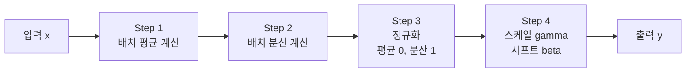
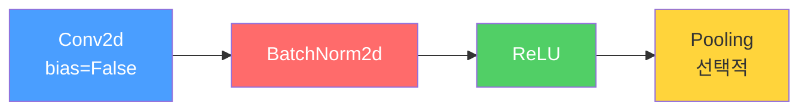
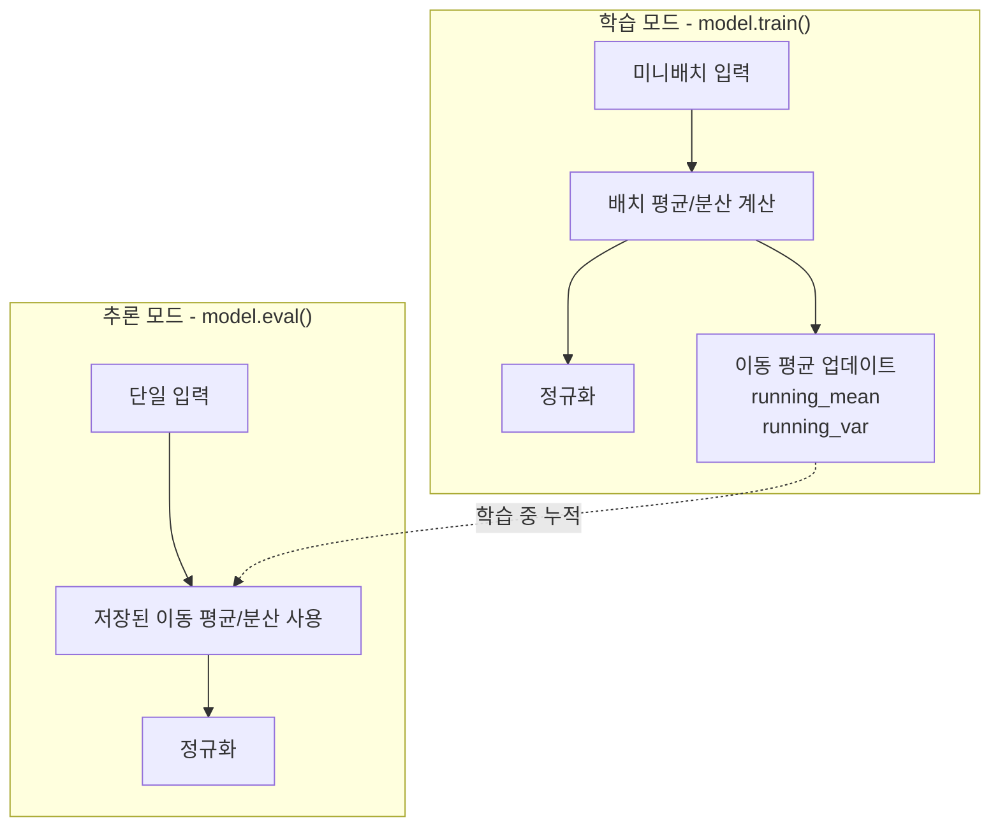
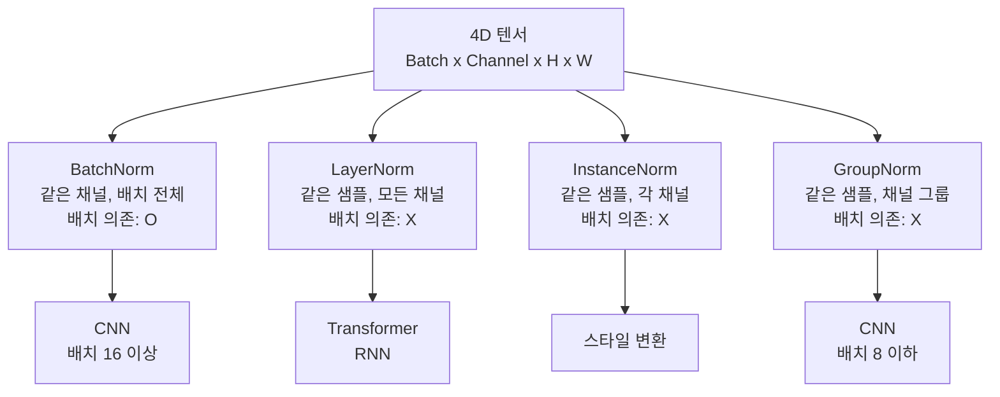

# 배치 정규화

> BatchNorm, LayerNorm, GroupNorm

## 개요

[합성곱](./01-convolution.md)과 [풀링](./02-pooling.md)으로 CNN의 뼈대를 세웠지만, 레이어를 깊게 쌓으면 학습이 불안정해지거나 느려지는 문제가 생깁니다. 이 섹션에서는 각 레이어의 출력 분포를 안정적으로 유지시키는 **정규화(Normalization)** 기법을 배웁니다. BatchNorm부터 LayerNorm, GroupNorm까지, 어떤 상황에서 어떤 것을 써야 하는지 정리합니다.

**선수 지식**: [합성곱 연산](./01-convolution.md), [역전파 알고리즘](../03-deep-learning-basics/03-backpropagation.md)
**학습 목표**:
- 배치 정규화가 학습을 안정화시키는 원리를 이해한다
- BatchNorm, LayerNorm, GroupNorm의 차이를 설명할 수 있다
- PyTorch에서 정규화 레이어를 올바르게 사용할 수 있다

## 왜 알아야 할까?

딥러닝 모델을 학습시키다 보면 "로스가 발산한다", "학습이 너무 느리다", "학습률(learning rate)을 조금만 올려도 터진다" 같은 문제를 겪게 됩니다. 배치 정규화는 이런 문제를 **한방에 완화**해주는 기법으로, 2015년에 등장한 이후 사실상 **모든 CNN에 기본 탑재**되어 있습니다. 이것을 이해하지 않으면 현대 딥러닝 아키텍처를 읽을 수 없습니다.

## 핵심 개념

### 1. 문제의 시작 — 왜 깊은 네트워크는 학습이 어려울까?

> 💡 **비유**: 10명이 줄을 서서 전화 메시지를 전달하는 게임을 생각해보세요. 첫 번째 사람이 "사과"라고 했는데, 3번째쯤 가면 "사고"로, 10번째에는 "사탕"으로 바뀔 수 있죠. 각 사람(레이어)이 받는 입력의 분포가 계속 변하면, 안정적으로 메시지를 전달하기 어렵습니다.

딥러닝에서도 비슷한 문제가 발생합니다. 앞쪽 레이어의 가중치가 업데이트되면, 그 다음 레이어가 받는 입력의 **분포(distribution)**가 매번 달라집니다. 레이어가 깊어질수록 이 변화가 누적되어 학습이 불안정해지죠. 이 현상을 원래 논문에서는 **내부 공변량 변화(Internal Covariate Shift)**라고 불렀습니다.

해결 아이디어는 단순합니다: **각 레이어의 출력을 일정한 분포로 맞춰주자!**

### 2. 배치 정규화(Batch Normalization) — 핵심 메커니즘

> 💡 **비유**: 학생들의 시험 점수를 **평균 0, 표준편차 1로 표준화**하는 것과 같습니다. 반마다 시험 난이도가 달라도, 표준화하면 공정하게 비교할 수 있죠. 배치 정규화는 각 레이어의 출력에 이 표준화를 적용하는 것입니다.

구체적인 동작은 4단계입니다:

> 📊 **그림 1**: 배치 정규화의 4단계 처리 흐름




**Step 1: 미니배치 평균 계산**

$$\mu_B = \frac{1}{m} \sum_{i=1}^{m} x_i$$

**Step 2: 미니배치 분산 계산**

$$\sigma_B^2 = \frac{1}{m} \sum_{i=1}^{m} (x_i - \mu_B)^2$$

**Step 3: 정규화 (평균 0, 분산 1로 변환)**

$$\hat{x}_i = \frac{x_i - \mu_B}{\sqrt{\sigma_B^2 + \epsilon}}$$

**Step 4: 스케일과 시프트 (학습 가능한 파라미터)**

$$y_i = \gamma \hat{x}_i + \beta$$

- $\mu_B$, $\sigma_B^2$: 미니배치의 평균과 분산
- $\epsilon$: 0으로 나누는 것을 방지하는 작은 값 (보통 1e-5)
- $\gamma$ (스케일), $\beta$ (시프트): **학습 가능한 파라미터**

왜 Step 4가 필요할까요? 만약 항상 평균 0, 분산 1로만 고정하면 네트워크의 표현력이 제한됩니다. $\gamma$와 $\beta$를 통해 "정규화하되, 필요하다면 원래 분포로 되돌릴 수도 있다"는 유연성을 부여하는 거죠.

### 3. BatchNorm의 위치 — Conv 뒤, 활성화 전

> 📊 **그림 2**: CNN 표준 빌딩 블록 순서




CNN에서 BatchNorm의 표준 위치:

> **Conv2d** → **BatchNorm2d** → **ReLU** → (풀링)

이 순서가 사실상 표준입니다. 참고로 BatchNorm은 이미 bias 역할을 하기 때문에, 앞의 Conv2d에서 `bias=False`로 설정하는 것이 일반적입니다 ([합성곱 연산](./01-convolution.md)의 실무 팁에서 언급한 바로 그 이유입니다).

### 4. 학습 vs 추론 — 동작이 다릅니다!

> 📊 **그림 3**: BatchNorm의 학습 모드와 추론 모드 동작 비교




이건 초보자가 가장 많이 놓치는 부분인데요, BatchNorm은 **학습 모드와 추론 모드에서 다르게 동작**합니다.

| 모드 | 평균/분산 계산 방식 | PyTorch 설정 |
|------|-------------------|-------------|
| 학습 (Training) | **미니배치**의 평균/분산 사용 | `model.train()` |
| 추론 (Inference) | 학습 중 누적된 **이동 평균** 사용 | `model.eval()` |

추론 시에는 미니배치가 없을 수도 있고(이미지 1장 추론), 배치 구성에 따라 결과가 달라지면 안 되기 때문입니다. 그래서 학습 중에 평균과 분산의 이동 평균(running mean/variance)을 계속 업데이트하고, 추론 시에는 이 값을 사용합니다.

> ⚠️ **흔한 오해**: "추론할 때 `model.eval()`을 빼먹어도 괜찮다" — **절대 아닙니다!** `model.eval()`을 빼먹으면 BatchNorm이 현재 입력의 통계를 사용하게 되어, 배치 크기와 구성에 따라 결과가 달라집니다. 모델 성능이 갑자기 나빠지는 가장 흔한 원인 중 하나입니다.

### 5. 다른 정규화 기법들

> 📊 **그림 4**: 4D 텐서(B x C x H x W)에서 각 정규화 기법의 연산 범위




BatchNorm은 강력하지만 한계가 있습니다. 배치 크기가 작으면 통계가 불안정하고, RNN 같은 시퀀스 모델에는 적용하기 어렵죠. 이를 해결하기 위해 다양한 변형이 등장했습니다.

**정규화 축 비교** (4D 텐서: Batch × Channel × Height × Width 기준)

| 기법 | 정규화 대상 | 배치 의존 | 주 사용처 |
|------|-----------|----------|----------|
| **BatchNorm** | 같은 채널, 배치 전체 | ✅ 예 | CNN (배치 큰 경우) |
| **LayerNorm** | 같은 샘플, 모든 채널 | ❌ 아니오 | Transformer, RNN |
| **InstanceNorm** | 같은 샘플의 각 채널 | ❌ 아니오 | 스타일 변환 |
| **GroupNorm** | 같은 샘플, 채널 그룹 | ❌ 아니오 | CNN (배치 작은 경우) |

직관적으로 표현하면:
- **BatchNorm**: "이 채널의 값이 **전체 배치에서** 어떤 분포인지" 정규화
- **LayerNorm**: "이 샘플 **하나 안에서** 모든 채널의 분포" 정규화
- **GroupNorm**: "이 샘플의 **채널을 그룹으로 나눠서** 각 그룹 내 분포" 정규화

> 🔥 **실무 팁**: "어떤 Norm을 써야 할지 모르겠다면?" — CNN에서 배치 크기가 16 이상이면 **BatchNorm**, 8 이하이면 **GroupNorm**, Transformer나 RNN이면 **LayerNorm**을 쓰세요. 이 규칙만으로 대부분의 상황을 커버할 수 있습니다.

## 실습: PyTorch 정규화 레이어 비교

### BatchNorm 기본 사용

```python
import torch
import torch.nn as nn

# BatchNorm2d: CNN용 (4D 텐서)
bn = nn.BatchNorm2d(num_features=16)  # 채널 수 지정

# 배치 4, 16채널, 8×8 특성 맵
x = torch.randn(4, 16, 8, 8)
output = bn(x)

print(f"입력 크기: {x.shape}")      # [4, 16, 8, 8]
print(f"출력 크기: {output.shape}")  # [4, 16, 8, 8] — 크기 불변
print(f"학습 파라미터: gamma={bn.weight.shape}, beta={bn.bias.shape}")  # 각 [16]
print(f"이동 평균: {bn.running_mean.shape}")  # [16]
```

### Conv + BatchNorm + ReLU 패턴

```python
import torch
import torch.nn as nn

# 실무에서 가장 많이 보는 패턴
block = nn.Sequential(
    nn.Conv2d(3, 64, kernel_size=3, padding=1, bias=False),  # bias=False!
    nn.BatchNorm2d(64),
    nn.ReLU(inplace=True),
)

x = torch.randn(8, 3, 32, 32)
out = block(x)
print(f"출력 크기: {out.shape}")  # [8, 64, 32, 32]

# 파라미터 확인
for name, param in block.named_parameters():
    print(f"{name}: {param.shape}")
# 0.weight: [64, 3, 3, 3]  — Conv 가중치 (bias 없음!)
# 1.weight: [64]            — BatchNorm gamma
# 1.bias: [64]              — BatchNorm beta
```

### 세 가지 Norm 비교 실험

```python
import torch
import torch.nn as nn

# 동일 입력으로 세 가지 Norm 비교
x = torch.randn(2, 32, 8, 8)  # 배치 2, 32채널, 8×8

# BatchNorm: 같은 채널을 배치 전체에서 정규화
batch_norm = nn.BatchNorm2d(32)
out_bn = batch_norm(x)

# LayerNorm: 각 샘플 내에서 모든 값을 정규화
layer_norm = nn.LayerNorm([32, 8, 8])
out_ln = layer_norm(x)

# GroupNorm: 32채널을 8개 그룹(그룹당 4채널)으로 나눠 정규화
group_norm = nn.GroupNorm(num_groups=8, num_channels=32)
out_gn = group_norm(x)

print(f"BatchNorm 출력: mean={out_bn.mean():.4f}, std={out_bn.std():.4f}")
print(f"LayerNorm 출력: mean={out_ln.mean():.4f}, std={out_ln.std():.4f}")
print(f"GroupNorm 출력: mean={out_gn.mean():.4f}, std={out_gn.std():.4f}")
# 모두 평균 ≈ 0, 표준편차 ≈ 1에 가까움
```

### 학습 vs 추론 모드 차이

```python
import torch
import torch.nn as nn

bn = nn.BatchNorm2d(16)

# === 학습 모드 ===
bn.train()
x1 = torch.randn(4, 16, 8, 8) * 3 + 5  # 평균 5, 표준편차 3
out1 = bn(x1)
print(f"[학습] running_mean 일부: {bn.running_mean[:4].tolist()}")

# === 추론 모드 ===
bn.eval()
# 같은 입력이라도 이동 평균/분산 사용
out2 = bn(x1)
print(f"[추론] 학습 모드와 출력 동일? {torch.allclose(out1, out2)}")  # False!
print("→ 학습과 추론에서 출력이 다름을 확인!")
```

## 더 깊이 알아보기

### BatchNorm의 탄생 — 그리고 여전히 풀리지 않은 미스터리

2015년, 구글의 **세르게이 이오페(Sergey Ioffe)**와 **크리스찬 세게디(Christian Szegedy)**는 "Batch Normalization: Accelerating Deep Network Training by Reducing Internal Covariate Shift"라는 논문을 발표합니다. 이 논문의 핵심 주장은 "각 레이어의 입력 분포가 계속 변하는 **내부 공변량 변화**가 학습을 어렵게 만드므로, 이를 정규화로 해결하자"는 것이었습니다.

결과는 놀라웠습니다. BatchNorm을 적용한 모델은 학습률을 10배 이상 높여도 안정적으로 학습되었고, 학습 속도도 **14배 빨라졌습니다**. 이 논문은 순식간에 딥러닝의 필수 기법으로 자리잡았죠.

그런데 흥미로운 반전이 있습니다. 2018년, MIT의 연구진이 "How Does Batch Normalization Help Optimization?"이라는 논문에서 원래의 설명에 의문을 제기했습니다. 실험 결과, BatchNorm이 내부 공변량 변화를 줄이지 않아도 성능이 향상된다는 것을 보여주었거든요. 현재 학계의 주류 견해는 BatchNorm이 **손실 함수의 지형(landscape)을 매끄럽게 만들어** 최적화를 쉽게 한다는 쪽입니다.

즉, BatchNorm은 **왜 효과적인지 아직 완전히 밝혀지지 않았지만**, 효과 자체는 너무나 확실해서 모든 곳에 사용되는 독특한 기법입니다.

> 💡 **알고 계셨나요?**: BatchNorm 논문은 현재 **5만 회 이상 인용**된 딥러닝 역사상 가장 영향력 있는 논문 중 하나입니다. "왜 작동하는지 정확히 모르지만 항상 쓴다"는 점에서 딥러닝의 경험적(empirical) 성격을 잘 보여주는 사례이기도 합니다.

## 흔한 오해와 팁

> ⚠️ **흔한 오해**: "BatchNorm을 쓰면 Dropout이 필요 없다" — 원래 논문에서는 BatchNorm 자체가 정규화 효과가 있어 Dropout을 뺄 수 있다고 했지만, 실무에서는 태스크에 따라 둘 다 쓰는 경우도 많습니다. 다만 BatchNorm과 Dropout을 **동시에** 사용할 때는 주의가 필요합니다 — Dropout이 학습 시 통계를 왜곡할 수 있기 때문입니다.

> 🔥 **실무 팁**: 배치 크기가 매우 작은(1~2) 경우에는 BatchNorm 대신 **GroupNorm**이나 **InstanceNorm**을 사용하세요. 배치 크기 1에서는 배치 통계를 낼 수 없어 BatchNorm이 제대로 동작하지 않습니다. 객체 탐지나 세그멘테이션처럼 이미지 크기가 커서 배치를 작게 잡아야 하는 경우 특히 중요합니다.

> 🔥 **실무 팁**: 사전 학습된 모델을 파인튜닝할 때, BatchNorm의 이동 평균은 **원래 데이터셋**의 통계를 담고 있습니다. 새로운 데이터셋이 분포가 많이 다르다면 `bn.reset_running_stats()`로 초기화하거나, 처음 몇 에포크 동안 이동 평균이 새 데이터에 적응할 시간을 주세요.

## 핵심 정리

| 개념 | 설명 |
|------|------|
| 배치 정규화 | 미니배치의 평균/분산으로 정규화 → 학습 안정화, 속도 향상 |
| gamma, beta | 정규화 후 스케일/시프트하는 학습 가능 파라미터 |
| 학습 vs 추론 | 학습: 배치 통계, 추론: 이동 평균 → `model.eval()` 필수 |
| LayerNorm | 샘플 내 모든 값을 정규화. Transformer에서 표준 |
| GroupNorm | 채널을 그룹으로 나눠 정규화. 작은 배치에 효과적 |
| Conv-BN-ReLU | CNN의 표준 빌딩 블록. Conv에서 bias=False 설정 |

## 다음 섹션 미리보기

배치 정규화가 학습의 안정성을 높여준다면, 다음에 배울 [정규화 기법](./04-regularization.md)은 모델이 **과적합(overfitting)하지 않도록 제어**하는 기법들입니다. Dropout, Weight Decay, Data Augmentation 등 모델의 일반화 성능을 높이는 핵심 전략을 다룹니다.

## 참고 자료

- [Batch Normalization (Ioffe & Szegedy, 2015)](https://arxiv.org/abs/1502.03167) - BatchNorm 원조 논문. 내부 공변량 변화 개념을 제안
- [Dive into Deep Learning - Batch Normalization](https://d2l.ai/chapter_convolutional-modern/batch-norm.html) - BatchNorm의 수학과 코드를 명쾌하게 설명
- [Normalization Strategies Comparison](https://isaac-the-man.dev/posts/normalization-strategies/) - BN, LN, IN, GN을 시각적으로 비교한 블로그
- [Batch vs Layer Normalization - Pinecone](https://www.pinecone.io/learn/batch-layer-normalization/) - 언제 어떤 Norm을 쓸지 실무 가이드
