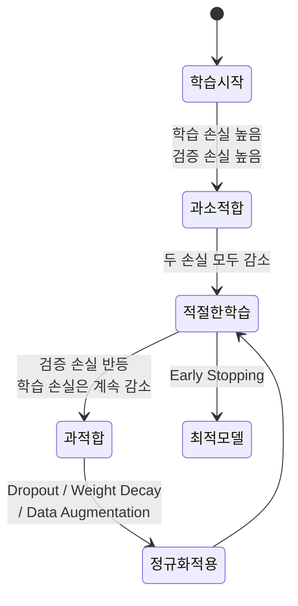
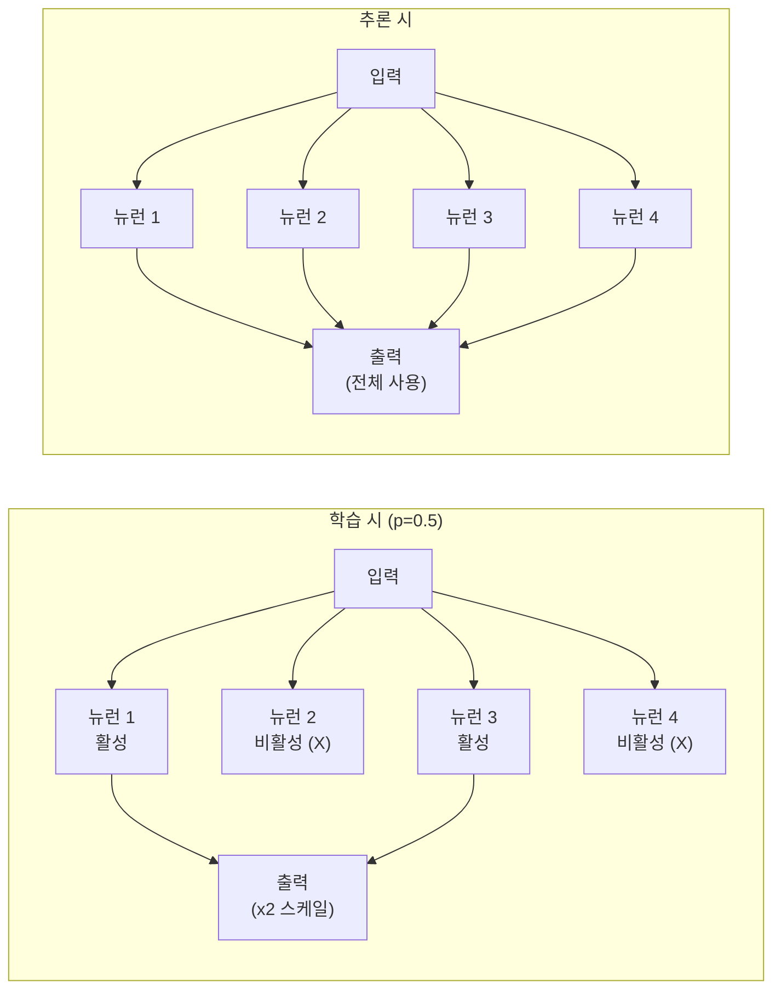
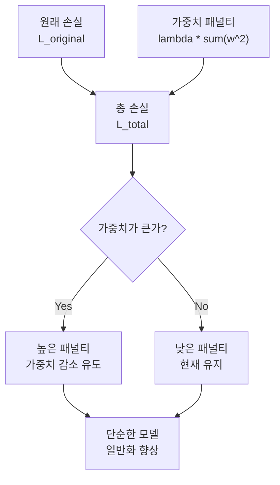
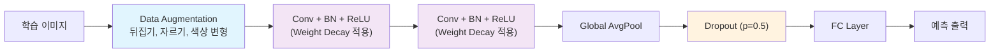

# 정규화 기법

> Dropout, Weight Decay, Data Augmentation

## 개요

[배치 정규화](./03-batch-normalization.md)에서 학습의 **안정성**을 높이는 방법을 배웠습니다. 이 섹션에서는 모델이 학습 데이터에 **과적합(Overfitting)**하지 않도록 제어하는 기법들을 다룹니다. Dropout, Weight Decay, Data Augmentation — 이 세 가지가 딥러닝에서 가장 널리 쓰이는 정규화(Regularization) 전략입니다.

**선수 지식**: [손실 함수와 옵티마이저](../03-deep-learning-basics/04-loss-optimizer.md), [배치 정규화](./03-batch-normalization.md)
**학습 목표**:
- 과적합이 왜 발생하는지 이해하고 감지할 수 있다
- Dropout, Weight Decay, Data Augmentation의 원리와 사용법을 익힌다
- 상황에 맞는 정규화 전략을 선택할 수 있다

## 왜 알아야 할까?

딥러닝 모델은 파라미터가 수백만~수억 개에 달하기 때문에, 학습 데이터를 **통째로 외워버리는** 능력이 있습니다. 학습 데이터에서는 정확도 99%인데 새로운 데이터에서는 60%? 이게 바로 과적합입니다. 정규화 기법을 모르면 "학습은 잘 되는데 실전에서 안 된다"는 문제를 해결할 수 없습니다.

## 핵심 개념

### 1. 과적합(Overfitting) — 문제를 정확히 이해하기

> 💡 **비유**: 시험 공부를 할 때 **기출 문제의 답만 달달 외우는 것**과 같습니다. 기출과 똑같은 문제가 나오면 100점이지만, 살짝 변형된 문제가 나오면 손을 못 쓰죠. 진짜 실력(일반화)을 기르려면 "왜 그런지" 원리를 이해해야 합니다.

과적합을 감지하는 가장 확실한 방법은 **학습 손실과 검증 손실의 추이**를 비교하는 것입니다:

| 상태 | 학습 손실 | 검증 손실 | 진단 |
|------|----------|----------|------|
| **과소적합** | 높음 | 높음 | 모델이 데이터를 충분히 학습하지 못함 |
| **적절한 학습** | 낮음 | 낮음 (학습과 비슷) | 이상적인 상태 |
| **과적합** | 매우 낮음 | 높음 (학습과 괴리) | 학습 데이터를 외워버림 |

검증 손실이 학습 손실과 벌어지기 시작하는 지점이 과적합의 시작입니다. 정규화 기법은 이 괴리를 줄여줍니다.

> 📊 **그림 1**: 학습 단계별 과적합 진단 흐름




### 2. Dropout — 뉴런을 무작위로 끄기

> 💡 **비유**: 축구팀 연습 시 매번 **무작위로 몇 명을 빠지게** 하는 것과 같습니다. 특정 선수에게 의존하지 않고, 모든 선수가 골고루 실력을 쌓아야 하죠. 누가 빠져도 팀이 동작하도록 만드는 겁니다.

Dropout은 학습 중 각 뉴런을 **확률 $p$로 랜덤하게 비활성화**하는 기법입니다:

- **학습 시**: 각 뉴런이 $p$ 확률로 출력 0 (보통 $p = 0.5$)
- **추론 시**: 모든 뉴런을 활성화하되, 출력에 $(1-p)$를 곱해 스케일 맞춤

왜 효과가 있을까요? Dropout은 매 학습 단계마다 **다른 서브 네트워크**를 학습하는 것과 같습니다. 수천 개의 서로 다른 모델을 **앙상블(ensemble)**하는 효과가 생기는 거죠. 뉴런들이 서로에게 과도하게 의존하는 **공동 적응(co-adaptation)**을 방지합니다.

> 📊 **그림 2**: Dropout의 학습 vs 추론 동작 비교




> ⚠️ **흔한 오해**: "Dropout 비율이 높을수록 정규화가 강하다" — 맞지만, 너무 높으면 네트워크가 충분히 학습하지 못합니다. FC 레이어에서는 0.5, 합성곱 레이어에서는 0.1~0.3이 일반적입니다. 최근 CNN에서는 합성곱 레이어에 Dropout을 잘 쓰지 않고, 주로 FC 레이어나 특정 위치에만 적용합니다.

### 3. Weight Decay (L2 정규화) — 가중치를 작게 유지하기

> 💡 **비유**: "답안지를 쓸 때 너무 복잡한 답은 감점"이라는 규칙과 같습니다. 모델에게 "가중치를 크게 만들면 벌점을 줄 거야"라고 하면, 모델은 자연스럽게 **단순한 해(solution)**를 찾게 됩니다.

수학적으로는 손실 함수에 가중치의 제곱합을 더합니다:

$$L_{total} = L_{original} + \lambda \sum w_i^2$$

- $L_{original}$: 원래 손실 함수 (CrossEntropy 등)
- $\lambda$: 정규화 강도 (보통 1e-4 ~ 1e-2)
- $\sum w_i^2$: 모든 가중치의 제곱합

$\lambda$가 크면 가중치가 0에 가깝게 유지되어 정규화 효과가 강하고, 작으면 원래 학습에 가깝습니다.

**Weight Decay가 작동하는 직관:**
- 큰 가중치 = 특정 입력에 강하게 반응 = 학습 데이터에 과적합 경향
- 작은 가중치 = 다양한 입력에 고르게 반응 = 일반화 성능 향상

PyTorch에서는 옵티마이저에 `weight_decay` 파라미터로 간단히 적용합니다.

> 📊 **그림 3**: Weight Decay가 손실 함수에 미치는 영향




### 4. Data Augmentation — 데이터를 뻥튀기하기

> 💡 **비유**: 한 사람의 사진으로 여권 사진, 졸업 사진, 캐주얼 셀카 등 **다양한 변형**을 만드는 것입니다. 같은 대상의 다양한 모습을 보여주면, 모델이 본질적 특성(얼굴)과 비본질적 변화(조명, 각도)를 구분하게 됩니다.

Data Augmentation은 학습 이미지에 **무작위 변형**을 적용해 데이터를 인위적으로 늘리는 기법입니다:

| 변형 종류 | 설명 | 효과 |
|-----------|------|------|
| 수평 뒤집기 (HFlip) | 좌우 반전 | 좌우 대칭 불변성 |
| 무작위 자르기 (RandomCrop) | 위치를 살짝 변경 | 위치 불변성 |
| 색상 지터 (ColorJitter) | 밝기, 대비, 채도 변경 | 조명 변화에 강건 |
| 무작위 회전 (Rotation) | 일정 각도 회전 | 회전 불변성 |
| RandAugment | 여러 변형을 랜덤 조합 | 종합적 강건성 |

Data Augmentation의 장점:
- **추가 데이터 수집 없이** 학습 데이터를 효과적으로 늘림
- 모델이 **본질적 특성**에 집중하도록 유도
- 거의 **부작용이 없고** 거의 항상 성능을 향상시킴

> 🔥 **실무 팁**: Data Augmentation은 **학습 시에만** 적용합니다. 검증/테스트 시에는 원본 이미지를 그대로 사용하세요. 검증 데이터까지 증강하면 공정한 성능 평가가 불가능합니다.

### 5. 세 기법의 조합 전략

실무에서는 이 세 가지를 **함께 사용**하는 것이 일반적입니다:

| 기법 | 적용 위치 | 효과 | 일반적 설정 |
|------|----------|------|-----------|
| Dropout | FC 레이어 (마지막) | 공동 적응 방지 | p=0.5 |
| Weight Decay | 옵티마이저 전역 | 가중치 크기 제한 | λ=1e-4 |
| Data Augmentation | 데이터 전처리 | 데이터 다양성 증가 | 태스크별 설정 |

**현대적 추세**: 최신 연구에서는 강력한 Data Augmentation(RandAugment, MixUp, CutMix 등)만으로도 Dropout과 Weight Decay의 효과를 상당 부분 대체할 수 있다는 결과가 나오고 있습니다. 그래도 Weight Decay는 거의 항상 사용하며, Dropout은 선택적으로 적용합니다.

> 📊 **그림 4**: CNN에서 세 가지 정규화 기법의 적용 위치




## 실습: PyTorch로 정규화 적용하기

### Dropout 사용법

```python
import torch
import torch.nn as nn

# Dropout 레이어 (50% 확률로 비활성화)
dropout = nn.Dropout(p=0.5)

x = torch.ones(1, 10)  # 모두 1인 벡터

# 학습 모드
dropout.train()
out_train = dropout(x)
print(f"학습 시 (일부가 0): {out_train}")
# 예: tensor([[0., 2., 0., 2., 2., 0., 0., 2., 2., 0.]])
# 살아남은 값이 2배 → 기댓값 유지!

# 추론 모드
dropout.eval()
out_eval = dropout(x)
print(f"추론 시 (모두 유지): {out_eval}")
# tensor([[1., 1., 1., 1., 1., 1., 1., 1., 1., 1.]])
```

### Weight Decay 적용

```python
import torch
import torch.nn as nn

model = nn.Linear(100, 10)

# AdamW에서 weight_decay 설정 (L2 정규화)
optimizer = torch.optim.AdamW(
    model.parameters(),
    lr=1e-3,
    weight_decay=1e-4  # 이 한 줄로 적용 끝!
)

# SGD에서도 동일하게 사용 가능
optimizer_sgd = torch.optim.SGD(
    model.parameters(),
    lr=0.01,
    momentum=0.9,
    weight_decay=5e-4  # ResNet 학습에서 자주 쓰이는 값
)
```

### Data Augmentation 파이프라인

```python
from torchvision import transforms

# === 학습용 변환 (증강 포함) ===
train_transform = transforms.Compose([
    transforms.RandomResizedCrop(224),            # 무작위 크기/위치 자르기
    transforms.RandomHorizontalFlip(p=0.5),       # 50% 확률 좌우 반전
    transforms.ColorJitter(                        # 색상 변형
        brightness=0.2, contrast=0.2,
        saturation=0.2, hue=0.1
    ),
    transforms.RandomRotation(degrees=15),         # ±15도 회전
    transforms.ToTensor(),                         # 텐서 변환
    transforms.Normalize(                          # ImageNet 통계로 정규화
        mean=[0.485, 0.456, 0.406],
        std=[0.229, 0.224, 0.225]
    ),
])

# === 검증/테스트용 변환 (증강 없음!) ===
val_transform = transforms.Compose([
    transforms.Resize(256),                        # 크기 조정
    transforms.CenterCrop(224),                    # 중앙 자르기
    transforms.ToTensor(),
    transforms.Normalize(
        mean=[0.485, 0.456, 0.406],
        std=[0.229, 0.224, 0.225]
    ),
])
```

### 전체 조합: 정규화가 적용된 CNN

```python
import torch
import torch.nn as nn

class RegularizedCNN(nn.Module):
    def __init__(self, num_classes=10):
        super().__init__()
        self.features = nn.Sequential(
            # 블록 1
            nn.Conv2d(3, 32, 3, padding=1, bias=False),
            nn.BatchNorm2d(32),
            nn.ReLU(inplace=True),
            nn.MaxPool2d(2),

            # 블록 2
            nn.Conv2d(32, 64, 3, padding=1, bias=False),
            nn.BatchNorm2d(64),
            nn.ReLU(inplace=True),
            nn.MaxPool2d(2),

            # 블록 3
            nn.Conv2d(64, 128, 3, padding=1, bias=False),
            nn.BatchNorm2d(128),
            nn.ReLU(inplace=True),
            nn.AdaptiveAvgPool2d(1),
        )
        self.classifier = nn.Sequential(
            nn.Dropout(0.5),           # FC 앞에 Dropout
            nn.Linear(128, num_classes),
        )

    def forward(self, x):
        x = self.features(x)
        x = x.view(x.size(0), -1)
        return self.classifier(x)

# 모델 + Weight Decay 옵티마이저
model = RegularizedCNN()
optimizer = torch.optim.AdamW(model.parameters(), lr=1e-3, weight_decay=1e-4)

# 테스트
x = torch.randn(4, 3, 32, 32)
output = model(x)
print(f"출력: {output.shape}")  # [4, 10]

# 정규화 요소 정리
print(f"Dropout: 0.5 (FC 레이어)")
print(f"Weight Decay: 1e-4 (AdamW)")
print(f"BatchNorm: 3개 (각 Conv 뒤)")
print(f"Data Augmentation: train_transform에 포함 (별도)")
```

## 더 깊이 알아보기

### Dropout의 탄생 — 은행에서 떠오른 아이디어

Dropout의 공동 저자이자 딥러닝의 대부 **제프리 힌튼(Geoffrey Hinton)**은 이 아이디어가 **두 가지 영감**에서 왔다고 밝혔습니다.

첫 번째는 은행 창구였습니다. 힌튼이 은행에 갔을 때, 직원들이 수시로 다른 창구로 배치되는 것을 보았습니다. 은행은 이를 통해 직원들 간의 **공모(conspiracy)를 방지**하고 있었죠. 각 직원이 다른 동료와 일하게 되니, 특정 조합에 의존하는 부정행위가 불가능해진 겁니다.

두 번째 영감은 **유성 생식(Sexual Reproduction)**이었습니다. 무성 생식과 달리 유성 생식은 유전자를 무작위로 섞습니다. 진화 생물학에서는 이 때문에 각 유전자가 **다른 유전자와 협력할 수 있는 범용적 능력**을 발달시켜야 했다고 설명합니다. 특정 유전자 조합에만 의존하는 전략은 도태되었죠.

이 두 통찰을 합친 결과가 Dropout입니다 — 뉴런들이 특정 파트너에 의존하지 않고 **독립적으로 유용한 특성**을 학습하도록 만드는 것. 2014년에 발표된 이 논문은 현재 약 **5만 회 이상** 인용되었습니다.

> 💡 **알고 계셨나요?**: 힌튼은 2024년에 AI의 위험성에 대한 경고 활동으로 **노벨 물리학상**을 수상했습니다. Dropout처럼 단순하지만 강력한 아이디어를 떠올리는 능력이 그를 "딥러닝의 대부"로 만든 원동력이었죠.

## 흔한 오해와 팁

> ⚠️ **흔한 오해**: "정규화를 강하게 걸수록 좋다" — 정규화가 너무 강하면 모델이 학습 데이터조차 제대로 학습하지 못하는 **과소적합(Underfitting)**이 발생합니다. 학습 손실도 검증 손실도 높은 상태죠. 정규화는 과적합과 과소적합 사이의 **균형점**을 찾는 것입니다.

> 🔥 **실무 팁**: 과적합이 의심될 때의 점검 순서 — (1) 먼저 **Data Augmentation**을 추가하거나 강화 (가장 부작용이 적음) → (2) **Weight Decay** 값을 조절 (1e-4 → 1e-3) → (3) **Dropout** 추가 또는 비율 증가. 이 순서가 가장 안전합니다.

> 🔥 **실무 팁**: `nn.Dropout`과 `nn.Dropout2d`의 차이를 아시나요? `Dropout`은 개별 값을 끄지만, `Dropout2d`는 **채널 전체**를 끕니다. CNN의 합성곱 출력에는 `Dropout2d`가 더 적합합니다. 같은 채널의 인접 픽셀은 상관관계가 높기 때문에, 개별 값을 끄는 것은 효과가 미미하거든요.

## 핵심 정리

| 개념 | 설명 |
|------|------|
| 과적합 | 학습 데이터를 외워버려 새 데이터에서 성능이 떨어지는 현상 |
| Dropout | 학습 시 뉴런을 랜덤 비활성화. 앙상블 효과로 일반화 향상 |
| Weight Decay | 손실에 가중치 크기 패널티 추가. 단순한 해를 유도 |
| Data Augmentation | 이미지에 무작위 변형 적용. 데이터 다양성 증가 |
| 과소적합 vs 과적합 | 정규화의 핵심은 두 극단 사이의 균형 찾기 |
| 현대적 추세 | 강력한 증강(RandAugment, CutMix)이 기존 정규화 대체 추세 |

## 다음 섹션 미리보기

지금까지 Chapter 04에서 CNN의 핵심 빌딩 블록을 모두 배웠습니다 — 합성곱, 풀링, 배치 정규화, 정규화 기법. 다음 [CNN 아키텍처의 진화](../05-cnn-architectures/01-lenet-alexnet.md)에서는 이 블록들이 실제로 어떻게 조합되어 LeNet, AlexNet, VGG, ResNet 등 역사적인 아키텍처들을 만들어냈는지 배웁니다. 지금까지 배운 부품으로 실제 자동차를 조립하는 과정이라고 할 수 있죠!

## 참고 자료

- [Dropout 원조 논문 (Srivastava et al., 2014)](https://jmlr.org/papers/v15/srivastava14a.html) - Dropout의 이론적 배경과 실험 결과를 상세히 다룬 원논문
- [Dive into Deep Learning - Dropout](https://d2l.ai/chapter_multilayer-perceptrons/dropout.html) - Dropout의 수학과 구현을 인터랙티브하게 설명
- [Dropout vs Weight Decay - GeeksforGeeks](https://www.geeksforgeeks.org/data-science/dropout-vs-weight-decay/) - 두 기법의 차이를 명쾌하게 비교
- [Regularization Tips for ML Models 2024](https://www.numberanalytics.com/blog/regularization-tips-robust-ml-models-2024) - 2024년 기준 정규화 실전 가이드
