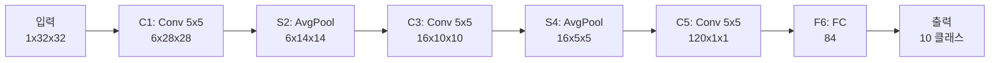
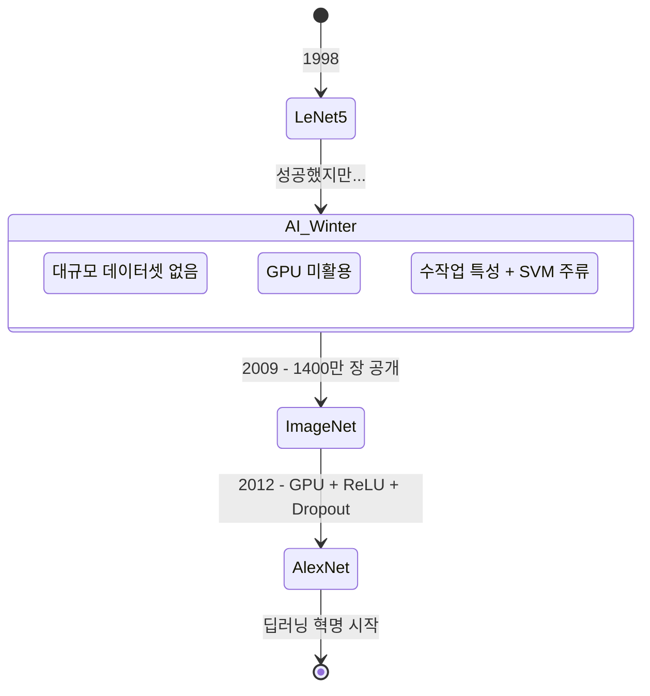
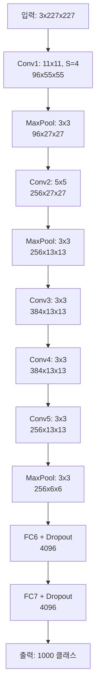
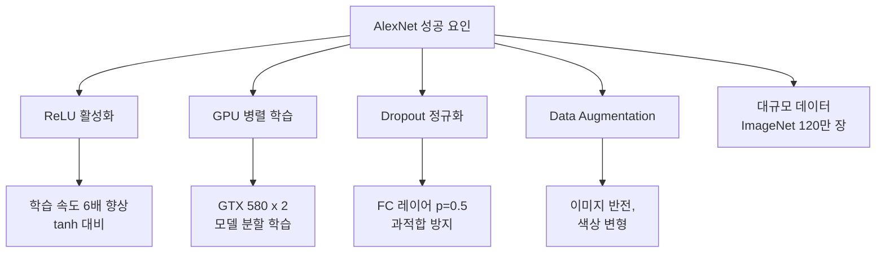

# LeNet과 AlexNet

> CNN의 탄생과 딥러닝 혁명의 시작

## 개요

[합성곱](../04-cnn-fundamentals/01-convolution.md), [풀링](../04-cnn-fundamentals/02-pooling.md), [배치 정규화](../04-cnn-fundamentals/03-batch-normalization.md), [정규화 기법](../04-cnn-fundamentals/04-regularization.md) — Chapter 04에서 배운 CNN의 부품들이 실제로 어떻게 조립되어 역사를 만들었는지 이 섹션에서 확인합니다. 1998년 수표를 읽던 **LeNet**부터, 2012년 세상을 뒤흔든 **AlexNet**까지, CNN 아키텍처의 출발점을 살펴봅니다.

**선수 지식**: [Chapter 04 - CNN 핵심 개념](../04-cnn-fundamentals/01-convolution.md) 전체
**학습 목표**:
- LeNet-5의 구조를 이해하고 현대 CNN과의 차이를 설명할 수 있다
- AlexNet이 딥러닝 혁명을 촉발한 핵심 혁신을 설명할 수 있다
- PyTorch로 두 아키텍처를 직접 구현할 수 있다

## 왜 알아야 할까?

최신 모델을 이해하려면 그 뿌리를 알아야 합니다. ResNet도, EfficientNet도, 결국은 LeNet에서 시작된 아이디어의 진화입니다. 특히 AlexNet은 "딥러닝이 정말 동작한다"는 것을 세상에 증명한 모델로, **현대 AI 붐의 기폭제**였습니다. 이 두 모델을 이해하면 CNN 아키텍처의 발전 흐름 전체가 자연스럽게 이어집니다.

## 핵심 개념

### 1. LeNet-5 (1998) — 최초의 실용적 CNN

> 📊 **그림 1**: LeNet-5 아키텍처 데이터 흐름




> 💡 **비유**: LeNet은 CNN 세계의 **라이트 형제 비행기**와 같습니다. 지금 보면 소박하지만, "이 방식이 진짜 날 수 있다"는 것을 처음으로 증명했습니다.

LeNet-5는 **얀 르쿤(Yann LeCun)**이 AT&T 벨 연구소에서 개발한 CNN으로, 28×28 크기의 손글씨 숫자(MNIST)를 인식하기 위해 설계되었습니다.

**LeNet-5 아키텍처:**

| 레이어 | 타입 | 출력 크기 | 설명 |
|--------|------|----------|------|
| 입력 | - | 1×32×32 | 흑백 이미지 |
| C1 | Conv 5×5 | 6×28×28 | 6개 커널로 특성 추출 |
| S2 | AvgPool 2×2 | 6×14×14 | 서브샘플링 |
| C3 | Conv 5×5 | 16×10×10 | 더 복잡한 특성 추출 |
| S4 | AvgPool 2×2 | 16×5×5 | 서브샘플링 |
| C5 | Conv 5×5 | 120×1×1 | 합성곱 (사실상 FC) |
| F6 | FC | 84 | 완전 연결 |
| 출력 | FC | 10 | 숫자 0~9 분류 |

오늘날의 관점에서 LeNet-5의 특징:
- **파라미터 약 6만 개** — 현대 모델(수백만~수억)에 비해 극도로 작음
- **활성화 함수**: tanh (ReLU 이전 시대)
- **풀링**: Average Pooling (Max Pooling 이전)
- **손실 함수**: MSE 기반 (CrossEntropy 이전)

> 💡 **알고 계셨나요?**: LeNet-5 기반 시스템은 미국 전역 ATM에서 수표를 읽는 데 사용되었습니다. 2001년 기준으로 **하루 약 2천만 장의 수표**(미국 전체 수표의 약 10%)를 처리했다고 합니다. CNN이 학문적 호기심이 아닌 **실용적 기술**이었음을 보여주는 사례입니다.

### 2. AI의 겨울 — LeNet 이후의 침체기

> 📊 **그림 2**: CNN 역사 — LeNet에서 AlexNet까지의 여정




LeNet의 성공에도 불구하고, 1990년대 후반~2000년대 중반까지 CNN은 주류가 되지 못했습니다. 왜일까요?

- **데이터 부족**: 대규모 레이블된 이미지 데이터셋이 없었음
- **컴퓨팅 한계**: GPU 가속이 없던 시절, 큰 네트워크를 학습시키기 어려웠음
- **SVM의 부상**: 수학적으로 깔끔한 Support Vector Machine이 더 인기였음

이 시기에 대부분의 연구자들은 "특성(feature)은 사람이 설계하고, 분류만 기계에 맡긴다"는 접근법을 사용했습니다. SIFT, HOG 같은 **수작업 특성(hand-crafted features)** + SVM 조합이 주류였죠.

그러다 2009년, 스탠포드의 **페이페이 리(Fei-Fei Li)** 교수팀이 **ImageNet** 데이터셋(1,400만 장, 1,000개 카테고리)을 공개합니다. 이 거대한 데이터셋이 딥러닝 혁명의 연료가 됩니다.

### 3. AlexNet (2012) — "딥러닝의 빅뱅"

> 📊 **그림 3**: AlexNet 아키텍처 데이터 흐름




> 💡 **비유**: AlexNet은 CNN 세계의 **아이폰 모멘트**와 같습니다. 스마트폰이 전에도 있었지만 아이폰이 대중의 인식을 바꿨듯, CNN도 전에 있었지만 AlexNet이 세상을 바꿨습니다.

2012년, 토론토 대학의 **알렉스 크리제프스키(Alex Krizhevsky)**, **일리아 서츠케버(Ilya Sutskever)**, 그리고 **제프리 힌튼(Geoffrey Hinton)**이 ImageNet 대회(ILSVRC 2012)에서 **압도적인 1위**를 차지합니다.

| 년도 | 우승 모델 | Top-5 에러율 | 방법 |
|------|----------|------------|------|
| 2011 | XRCE | 25.8% | 수작업 특성 + SVM |
| **2012** | **AlexNet** | **15.3%** | **딥러닝 (CNN)** |

2위(26.2%)와의 격차가 **10% 이상**이었습니다. 이것은 단순한 개선이 아니라, 패러다임의 전환이었습니다.

**AlexNet 아키텍처:**

| 레이어 | 타입 | 출력 크기 | 핵심 특징 |
|--------|------|----------|----------|
| 입력 | - | 3×227×227 | 컬러(RGB) 이미지 |
| Conv1 | Conv 11×11, S=4 | 96×55×55 | 큰 커널로 저수준 특성 추출 |
| Pool1 | MaxPool 3×3, S=2 | 96×27×27 | 다운샘플링 |
| Conv2 | Conv 5×5, P=2 | 256×27×27 | 중수준 특성 |
| Pool2 | MaxPool 3×3, S=2 | 256×13×13 | 다운샘플링 |
| Conv3 | Conv 3×3, P=1 | 384×13×13 | 고수준 특성 |
| Conv4 | Conv 3×3, P=1 | 384×13×13 | 고수준 특성 |
| Conv5 | Conv 3×3, P=1 | 256×13×13 | 고수준 특성 |
| Pool5 | MaxPool 3×3, S=2 | 256×6×6 | 다운샘플링 |
| FC6 | FC + Dropout | 4096 | 완전 연결 |
| FC7 | FC + Dropout | 4096 | 완전 연결 |
| FC8 | FC | 1000 | 1000 클래스 분류 |

### 4. AlexNet의 핵심 혁신들

> 📊 **그림 4**: AlexNet을 가능하게 한 핵심 혁신 요소




**ReLU 활성화 함수**: tanh 대신 ReLU를 사용하여 학습 속도를 **6배** 향상시켰습니다. [활성화 함수](../03-deep-learning-basics/02-activation-functions.md)에서 배운 ReLU의 장점이 여기서 빛을 발했죠.

**GPU 학습**: 당시 단일 GPU로는 메모리가 부족해서, **2개의 NVIDIA GTX 580 GPU**에 모델을 나누어 병렬 학습했습니다. GPU를 딥러닝에 활용한 선구적 사례입니다.

**Dropout**: FC 레이어에 Dropout(p=0.5)을 적용하여 과적합을 효과적으로 방지했습니다. [정규화 기법](../04-cnn-fundamentals/04-regularization.md)에서 배운 바로 그 기법입니다.

**Data Augmentation**: 이미지 반전, 색상 변형 등을 적용하여 학습 데이터를 효과적으로 늘렸습니다.

**Local Response Normalization**: 인접 채널 간 정규화(현재는 BatchNorm으로 대체됨)

### 5. LeNet vs AlexNet — 14년의 진화

| 비교 항목 | LeNet-5 (1998) | AlexNet (2012) |
|-----------|---------------|----------------|
| 입력 크기 | 32×32 (흑백) | 227×227 (컬러) |
| 깊이 | 5개 학습 레이어 | 8개 학습 레이어 |
| 파라미터 | ~6만 | ~6,000만 |
| 활성화 | tanh | **ReLU** |
| 풀링 | Average | **Max** |
| 정규화 | 없음 | **Dropout** |
| 학습 하드웨어 | CPU | **GPU 2개** |
| 데이터셋 | MNIST (6만 장) | ImageNet (120만 장) |

핵심 구조(Conv → Pool → FC)는 동일하지만, **데이터 × 컴퓨팅 × 기법 혁신**의 조합이 성능을 극적으로 끌어올렸습니다.

## 실습: PyTorch로 구현하기

### LeNet-5

```python
import torch
import torch.nn as nn

class LeNet5(nn.Module):
    """LeNet-5: 최초의 실용적 CNN (1998)"""
    def __init__(self, num_classes=10):
        super().__init__()
        self.features = nn.Sequential(
            # C1: 1채널 → 6채널, 5×5 커널
            nn.Conv2d(1, 6, kernel_size=5),
            nn.Tanh(),
            nn.AvgPool2d(kernel_size=2, stride=2),

            # C3: 6채널 → 16채널, 5×5 커널
            nn.Conv2d(6, 16, kernel_size=5),
            nn.Tanh(),
            nn.AvgPool2d(kernel_size=2, stride=2),
        )
        self.classifier = nn.Sequential(
            nn.Linear(16 * 5 * 5, 120),
            nn.Tanh(),
            nn.Linear(120, 84),
            nn.Tanh(),
            nn.Linear(84, num_classes),
        )

    def forward(self, x):
        x = self.features(x)
        x = x.view(x.size(0), -1)  # Flatten
        return self.classifier(x)

# 테스트 (MNIST 스타일: 1채널 32×32)
model = LeNet5()
x = torch.randn(1, 1, 32, 32)
print(f"LeNet-5 출력: {model(x).shape}")  # [1, 10]
print(f"파라미터 수: {sum(p.numel() for p in model.parameters()):,}")  # ~61,706
```

### AlexNet (간략화 버전)

```python
import torch
import torch.nn as nn

class AlexNet(nn.Module):
    """AlexNet: 딥러닝 혁명의 시작 (2012)"""
    def __init__(self, num_classes=1000):
        super().__init__()
        self.features = nn.Sequential(
            # Conv1: 큰 커널(11×11)로 저수준 특성 추출
            nn.Conv2d(3, 96, kernel_size=11, stride=4, padding=2),
            nn.ReLU(inplace=True),
            nn.MaxPool2d(kernel_size=3, stride=2),

            # Conv2: 5×5 커널
            nn.Conv2d(96, 256, kernel_size=5, padding=2),
            nn.ReLU(inplace=True),
            nn.MaxPool2d(kernel_size=3, stride=2),

            # Conv3, 4, 5: 3×3 커널 연속
            nn.Conv2d(256, 384, kernel_size=3, padding=1),
            nn.ReLU(inplace=True),
            nn.Conv2d(384, 384, kernel_size=3, padding=1),
            nn.ReLU(inplace=True),
            nn.Conv2d(384, 256, kernel_size=3, padding=1),
            nn.ReLU(inplace=True),
            nn.MaxPool2d(kernel_size=3, stride=2),
        )
        self.classifier = nn.Sequential(
            nn.Dropout(0.5),
            nn.Linear(256 * 6 * 6, 4096),
            nn.ReLU(inplace=True),
            nn.Dropout(0.5),
            nn.Linear(4096, 4096),
            nn.ReLU(inplace=True),
            nn.Linear(4096, num_classes),
        )

    def forward(self, x):
        x = self.features(x)
        x = x.view(x.size(0), -1)
        return self.classifier(x)

# 테스트 (ImageNet 스타일: 3채널 227×227)
model = AlexNet()
x = torch.randn(1, 3, 227, 227)
print(f"AlexNet 출력: {model(x).shape}")  # [1, 1000]
print(f"파라미터 수: {sum(p.numel() for p in model.parameters()):,}")  # ~62,378,344
```

### torchvision으로 사전 학습 모델 불러오기

```python
import torchvision.models as models

# ImageNet으로 사전 학습된 AlexNet
alexnet = models.alexnet(weights='IMAGENET1K_V1')
print(alexnet)

# 10 클래스로 파인튜닝하기
alexnet.classifier[6] = nn.Linear(4096, 10)
print(f"수정된 마지막 레이어: {alexnet.classifier[6]}")
```

## 더 깊이 알아보기

### AlexNet의 비밀 — 침실에서 세상을 바꾸다

AlexNet에는 잘 알려지지 않은 뒷이야기가 있습니다. 알렉스 크리제프스키는 모델을 **부모님 집 침실**에서 2개의 GTX 580 GPU로 학습시켰습니다. 당시 대학 연구실에는 제대로 된 GPU 서버가 없었기 때문이죠.

이 연구의 세 저자 — 크리제프스키, 서츠케버, 힌튼 — 모두 나중에 AI 역사에 큰 발자국을 남깁니다. 서츠케버는 OpenAI의 공동 창립자이자 최고 과학자가 되었고, 힌튼은 구글에서 AI 연구를 이끌다가 2024년 노벨 물리학상을 수상했습니다. AlexNet은 단지 한 논문이 아니라, **현대 AI 산업의 기폭제**였던 셈입니다.

또 하나 흥미로운 점은, 얀 르쿤은 AlexNet을 보고 "이건 사실상 더 큰 LeNet이다"라고 평했다는 것입니다. 핵심 아이디어(Conv → Pool → FC)는 14년 전과 동일했고, 바뀐 것은 데이터 규모, 컴퓨팅 파워, 그리고 ReLU·Dropout 같은 기법뿐이었죠. 때로는 **같은 아이디어가 시대를 만나면** 전혀 다른 결과를 낸다는 교훈을 줍니다.

## 흔한 오해와 팁

> ⚠️ **흔한 오해**: "AlexNet의 11×11 큰 커널이 성능의 핵심이다" — 사실 큰 커널은 이후 거의 사라졌습니다. [VGG](./02-vgg-googlenet.md)에서 보겠지만, 3×3 커널을 여러 층 쌓는 것이 더 효율적이고 성능도 좋습니다. AlexNet의 큰 커널은 당시 GPU 메모리 한계 때문에 빨리 공간을 줄이려는 실용적 선택이었습니다.

> 🔥 **실무 팁**: 오늘날 LeNet이나 AlexNet을 실무에 직접 쓰는 경우는 거의 없습니다. 하지만 **교육용과 디버깅용**으로는 여전히 유용합니다. 새로운 데이터셋이나 파이프라인을 테스트할 때, 가벼운 LeNet으로 먼저 "학습이 제대로 되는지" 확인한 뒤 큰 모델로 넘어가는 전략이 시간을 절약해줍니다.

> 💡 **알고 계셨나요?**: ImageNet 대회(ILSVRC)는 AlexNet 이후 매년 CNN 아키텍처의 경연장이 되었습니다. 2012년 AlexNet → 2014년 VGG/GoogLeNet → 2015년 ResNet으로 이어지는 이 흐름이 바로 이 Chapter 05에서 다루는 내용입니다.

## 핵심 정리

| 개념 | 설명 |
|------|------|
| LeNet-5 | 최초의 실용적 CNN (1998). Conv-Pool-FC 구조의 원형 |
| AlexNet | 2012 ImageNet 우승. 딥러닝 혁명의 시작 |
| ReLU | tanh를 대체하여 학습 속도 6배 향상 |
| GPU 학습 | 2개의 GPU 병렬 학습. AI에서 GPU 활용의 시작 |
| Dropout | FC 레이어의 과적합 방지 (p=0.5) |
| AI 겨울 → 부활 | 데이터(ImageNet) + GPU + 기법 혁신의 삼박자 |

## 다음 섹션 미리보기

AlexNet이 "딥러닝이 동작한다"를 증명했다면, 다음 질문은 "얼마나 깊게 만들 수 있을까?"입니다. [VGG와 GoogLeNet](./02-vgg-googlenet.md)에서는 네트워크를 더 깊이, 더 효율적으로 만드는 두 가지 접근법을 배웁니다.

## 참고 자료

- [Gradient-Based Learning Applied to Document Recognition (LeCun et al., 1998)](http://yann.lecun.com/exdb/lenet/) - LeNet 원조 논문과 데모
- [ImageNet Classification with Deep CNNs (Krizhevsky et al., 2012)](https://papers.nips.cc/paper/4824-imagenet-classification-with-deep-convolutional-neural-networks) - AlexNet 원조 논문
- [How AlexNet Transformed AI Forever - IEEE Spectrum](https://spectrum.ieee.org/alexnet-source-code) - AlexNet의 역사적 의의와 소스 코드 공개 스토리
- [CHM Releases AlexNet Source Code](https://computerhistory.org/blog/chm-releases-alexnet-source-code/) - 컴퓨터 역사 박물관의 AlexNet 소스 코드 보존 프로젝트
