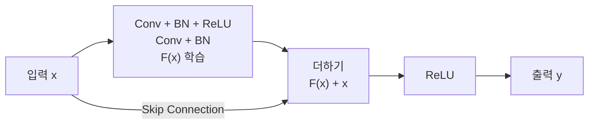
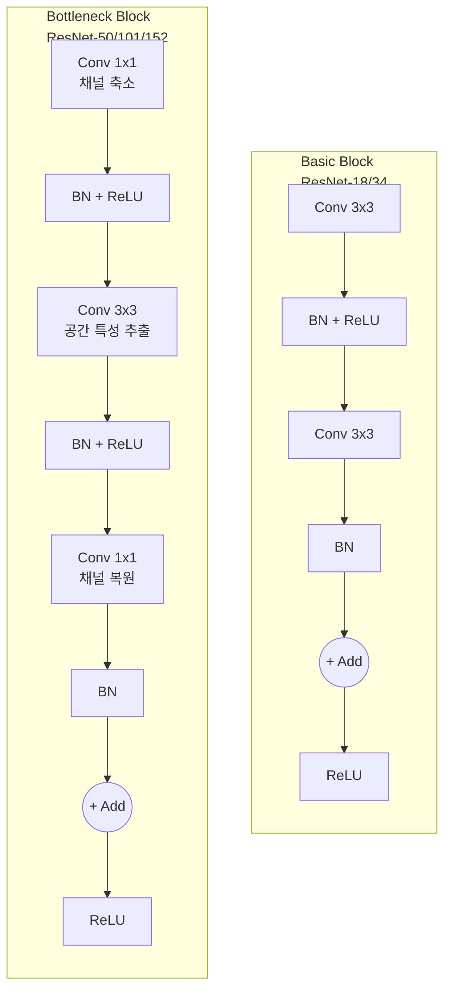
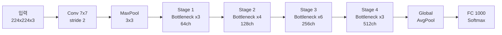
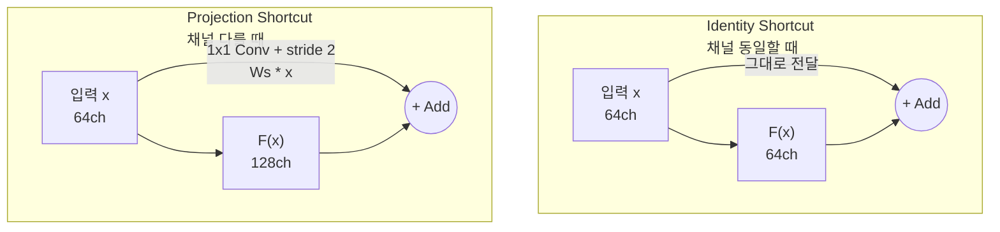

# ResNet과 Skip Connection

> 잔차 학습으로 깊은 네트워크 훈련

## 개요

[VGG](./02-vgg-googlenet.md)에서 "깊이가 깊을수록 좋다"고 했지만, 20층을 넘어가면 오히려 성능이 **떨어지는** 현상이 발견되었습니다. 이 난제를 단 하나의 아이디어 — **Skip Connection(잔차 연결)** — 로 해결한 것이 **ResNet**입니다. 2015년 등장 이후 사실상 모든 딥러닝 아키텍처의 기본 요소가 된, 역대 가장 영향력 있는 CNN 논문을 다룹니다.

**선수 지식**: [VGG와 GoogLeNet](./02-vgg-googlenet.md), [역전파 알고리즘](../03-deep-learning-basics/03-backpropagation.md)
**학습 목표**:
- 성능 저하(Degradation) 문제가 무엇인지 설명할 수 있다
- 잔차 학습(Residual Learning)의 원리와 효과를 이해한다
- Basic Block과 Bottleneck Block의 차이를 구현할 수 있다

## 왜 알아야 할까?

ResNet은 단순히 "좋은 모델 하나"가 아닙니다. Skip Connection이라는 개념은 이후 DenseNet, Transformer, U-Net, Diffusion 모델 등 거의 **모든 현대 아키텍처**에 스며들어 있습니다. ResNet을 이해하면 현대 딥러닝의 핵심 설계 원리를 이해하는 것입니다.

## 핵심 개념

### 1. 성능 저하(Degradation) 문제 — 깊으면 좋지 않나요?

직관적으로 생각하면, 20층 네트워크가 잘 동작한다면 56층 네트워크는 더 잘 동작해야 합니다. 최소한 추가 레이어가 항등 함수(아무것도 안 함)만 학습해도 20층과 같은 성능은 나와야 하니까요.

그런데 실제로는 **56층이 20층보다 성능이 나빴습니다**. 그것도 과적합이 아니라, **학습 데이터에서도** 성능이 낮았습니다.

> 💡 **비유**: 10명이 릴레이로 그림을 따라 그리는 게임에서, 사람이 많을수록 원본과 달라지는 것과 같습니다. 각 사람(레이어)이 "원본을 그대로 전달"하는 것조차 어렵기 때문이죠.

이것이 **성능 저하 문제**입니다. 기울기 소실과도 관련 있지만, 핵심은 깊은 네트워크가 **항등 함수조차 학습하기 어렵다**는 것입니다.

> 📊 **그림 1**: 잔차 학습의 핵심 — Skip Connection을 통한 잔차 블록 구조




### 2. 잔차 학습(Residual Learning) — 핵심 아이디어

카이밍 허(Kaiming He)의 통찰은 이렇습니다:

> "원래 함수 $H(x)$를 직접 학습하는 대신, **잔차(residual)** $F(x) = H(x) - x$를 학습하자"

수식으로 표현하면:

$$y = F(x) + x$$

- $x$: 입력 (Skip Connection으로 그대로 전달)
- $F(x)$: 레이어가 학습하는 잔차 함수
- $y$: 출력

> 💡 **비유**: 사진을 보정할 때, 처음부터 완성본을 그리는 것(원래 방식)보다 **원본에 수정 사항만 추가**하는 것(잔차 학습)이 훨씬 쉽죠? "원본 + 약간의 보정 = 결과"가 핵심입니다.

**왜 효과적일까요?**
- 추가 레이어가 학습할 게 없으면, $F(x) = 0$만 학습하면 됩니다 → **항등 함수가 자동으로 보장**
- 기울기가 Skip Connection을 통해 직접 전달 → **기울기 소실 완화**
- 네트워크가 "변화량"에 집중 → 학습이 더 쉬움

### 3. Residual Block의 두 가지 형태

> 📊 **그림 2**: Basic Block vs Bottleneck Block 비교




**Basic Block (ResNet-18/34)**

| 순서 | 레이어 | 설명 |
|------|--------|------|
| 1 | Conv 3×3 | 특성 추출 |
| 2 | BatchNorm + ReLU | 정규화 + 활성화 |
| 3 | Conv 3×3 | 특성 추출 |
| 4 | BatchNorm | 정규화 |
| + | **Skip Connection** | 입력을 더함 |
| 5 | ReLU | 활성화 |

**Bottleneck Block (ResNet-50/101/152)**

더 깊은 모델에서는 연산량을 줄이기 위해 **병목 구조**를 사용합니다:

| 순서 | 레이어 | 채널 변화 | 역할 |
|------|--------|----------|------|
| 1 | Conv 1×1 | 256 → 64 | 채널 축소 (병목) |
| 2 | BatchNorm + ReLU | | |
| 3 | Conv 3×3 | 64 → 64 | 공간 특성 추출 |
| 4 | BatchNorm + ReLU | | |
| 5 | Conv 1×1 | 64 → 256 | 채널 복원 |
| 6 | BatchNorm | | |
| + | **Skip Connection** | | 입력을 더함 |
| 7 | ReLU | | |

1×1로 채널을 줄인 뒤(64) 3×3 합성곱을 수행하고, 다시 1×1로 복원(256)하는 구조입니다. [1×1 합성곱](./02-vgg-googlenet.md)의 채널 축소 효과를 활용한 것이죠.

### 4. ResNet 아키텍처 패밀리

| 모델 | 블록 타입 | 레이어 수 | 파라미터 | Top-5 에러 |
|------|----------|----------|---------|-----------|
| ResNet-18 | Basic | 18 | 11.7M | 10.9% |
| ResNet-34 | Basic | 34 | 21.8M | 8.6% |
| **ResNet-50** | Bottleneck | 50 | **25.6M** | **6.7%** |
| ResNet-101 | Bottleneck | 101 | 44.5M | 6.0% |
| ResNet-152 | Bottleneck | 152 | 60.2M | 5.7% |

**ResNet-50**이 실무에서 가장 많이 사용됩니다. 파라미터 대비 성능의 균형이 가장 좋기 때문이죠.

> 📊 **그림 4**: ResNet-50 전체 아키텍처 흐름




### 5. Projection Shortcut — 크기가 다를 때

> 📊 **그림 3**: Identity Shortcut vs Projection Shortcut




Skip Connection에서 입력 $x$와 출력 $F(x)$의 크기가 다르면 어떻게 할까요? 예를 들어 채널이 64 → 128로 바뀌는 경우:

**해결: 1×1 합성곱으로 차원 맞추기 (Projection Shortcut)**

$$y = F(x) + W_s \cdot x$$

$W_s$는 1×1 합성곱으로, 입력의 채널 수를 출력과 맞춰줍니다. 동시에 스트라이드 2를 적용해 공간 크기도 맞춥니다.

## 실습: PyTorch로 ResNet 블록 구현하기

### Basic Block

```python
import torch
import torch.nn as nn

class BasicBlock(nn.Module):
    """ResNet-18/34의 기본 블록"""
    def __init__(self, in_channels, out_channels, stride=1):
        super().__init__()
        # 메인 경로
        self.conv1 = nn.Conv2d(in_channels, out_channels, 3,
                               stride=stride, padding=1, bias=False)
        self.bn1 = nn.BatchNorm2d(out_channels)
        self.conv2 = nn.Conv2d(out_channels, out_channels, 3,
                               padding=1, bias=False)
        self.bn2 = nn.BatchNorm2d(out_channels)
        self.relu = nn.ReLU(inplace=True)

        # Skip Connection (차원이 다르면 projection)
        self.shortcut = nn.Sequential()
        if stride != 1 or in_channels != out_channels:
            self.shortcut = nn.Sequential(
                nn.Conv2d(in_channels, out_channels, 1,
                          stride=stride, bias=False),
                nn.BatchNorm2d(out_channels),
            )

    def forward(self, x):
        identity = self.shortcut(x)       # Skip Connection
        out = self.relu(self.bn1(self.conv1(x)))
        out = self.bn2(self.conv2(out))
        out += identity                    # 잔차 연결!
        return self.relu(out)

# 테스트
block = BasicBlock(64, 128, stride=2)  # 다운샘플링
x = torch.randn(1, 64, 32, 32)
print(f"입력: {x.shape} → 출력: {block(x).shape}")
# [1, 64, 32, 32] → [1, 128, 16, 16]
```

### Bottleneck Block

```python
import torch
import torch.nn as nn

class BottleneckBlock(nn.Module):
    """ResNet-50/101/152의 병목 블록"""
    expansion = 4  # 출력 채널 = 중간 채널 × 4

    def __init__(self, in_channels, mid_channels, stride=1):
        super().__init__()
        out_channels = mid_channels * self.expansion

        # 1×1 → 3×3 → 1×1 병목 구조
        self.conv1 = nn.Conv2d(in_channels, mid_channels, 1, bias=False)
        self.bn1 = nn.BatchNorm2d(mid_channels)
        self.conv2 = nn.Conv2d(mid_channels, mid_channels, 3,
                               stride=stride, padding=1, bias=False)
        self.bn2 = nn.BatchNorm2d(mid_channels)
        self.conv3 = nn.Conv2d(mid_channels, out_channels, 1, bias=False)
        self.bn3 = nn.BatchNorm2d(out_channels)
        self.relu = nn.ReLU(inplace=True)

        # Projection Shortcut
        self.shortcut = nn.Sequential()
        if stride != 1 or in_channels != out_channels:
            self.shortcut = nn.Sequential(
                nn.Conv2d(in_channels, out_channels, 1,
                          stride=stride, bias=False),
                nn.BatchNorm2d(out_channels),
            )

    def forward(self, x):
        identity = self.shortcut(x)
        out = self.relu(self.bn1(self.conv1(x)))  # 1×1: 채널 축소
        out = self.relu(self.bn2(self.conv2(out)))  # 3×3: 공간 특성
        out = self.bn3(self.conv3(out))             # 1×1: 채널 복원
        out += identity
        return self.relu(out)

# 테스트: 256 → 64(병목) → 256
block = BottleneckBlock(256, 64)
x = torch.randn(1, 256, 14, 14)
print(f"입력: {x.shape} → 출력: {block(x).shape}")
# [1, 256, 14, 14] → [1, 256, 14, 14]
```

### torchvision의 사전 학습 ResNet-50

```python
import torch
import torchvision.models as models

# ImageNet 사전 학습 ResNet-50
resnet50 = models.resnet50(weights='IMAGENET1K_V2')

# 구조 확인
print(f"파라미터 수: {sum(p.numel() for p in resnet50.parameters()):,}")
# ~25,557,032

# 10 클래스 파인튜닝
resnet50.fc = torch.nn.Linear(2048, 10)

# 추론 테스트
resnet50.eval()
x = torch.randn(1, 3, 224, 224)
with torch.no_grad():
    output = resnet50(x)
print(f"출력: {output.shape}")  # [1, 10]
```

## 더 깊이 알아보기

### ResNet의 탄생 — "이건 말이 안 돼"에서 시작된 혁명

2015년, 마이크로소프트 리서치 아시아(MSRA)의 **카이밍 허(Kaiming He)**는 깊은 네트워크의 성능 저하 실험 결과를 보고 의아해했습니다. 56층 네트워크가 20층보다 **학습 데이터에서조차** 성능이 낮다니, 이론적으로 불가능한 일이었죠.

핵심 통찰은 놀랍도록 단순했습니다: "레이어에게 전체 함수를 처음부터 학습하라고 하지 말고, **입력 대비 변화량(잔차)**만 학습하라고 하면 어떨까?" 이 아이디어를 구현하는 방법은 그저 **입력을 출력에 더하는 연결선 하나**를 추가하는 것뿐이었습니다.

결과는 압도적이었습니다. 152층 ResNet이 2015년 ImageNet에서 **3.57% 에러율**(인간 수준인 5.1%를 상회!)을 달성하며 1위를 차지했습니다. 카이밍 허는 이후 Faster R-CNN, Mask R-CNN 등도 개발하며 컴퓨터 비전 분야에서 가장 영향력 있는 연구자 중 한 명이 되었습니다.

> 💡 **알고 계셨나요?**: ResNet 논문은 2025년 기준 **20만 회 이상 인용**되어, 딥러닝 분야 역대 최다 인용 논문 중 하나입니다. Skip Connection의 아이디어는 이후 Transformer의 잔차 연결, U-Net의 스킵 연결, DenseNet의 밀집 연결 등 무수한 변형을 낳았습니다.

### Pre-Activation ResNet

원래 ResNet 블록은 Conv → BN → ReLU 순서에 Skip Connection을 더하는 구조였지만, 카이밍 허는 2016년 후속 논문에서 BN → ReLU → Conv 순서(Pre-Activation)가 **매우 깊은 네트워크에서 더 좋다**는 것을 발견했습니다. 그래디언트가 활성화 함수에 방해받지 않고 Skip Connection을 통해 순수하게 흐를 수 있기 때문입니다.

## 흔한 오해와 팁

> ⚠️ **흔한 오해**: "ResNet의 Skip Connection은 기울기 소실을 해결한다" — 맞는 말이지만 불완전합니다. 원래 논문의 핵심은 기울기 소실이 아니라 **성능 저하(degradation)** 문제입니다. 기울기가 잘 흐르는 것은 성능 저하 해결의 **결과**이지 직접적 목표는 아니었습니다.

> 🔥 **실무 팁**: 실무에서 가장 많이 쓰이는 모델은 **ResNet-50**입니다. ResNet-101/152는 파라미터 대비 성능 향상이 크지 않아, 비용 효율이 떨어집니다. "일단 ResNet-50으로 시작"이 거의 모든 비전 태스크의 안전한 시작점입니다.

> 🔥 **실무 팁**: `torchvision.models.resnet50(weights='IMAGENET1K_V2')`의 `V2` 가중치는 최신 학습 기법(더 긴 학습, 강한 증강)으로 재학습된 것으로, 기존 `V1`보다 약 1~2% 정확도가 높습니다. 특별한 이유가 없다면 V2를 사용하세요.

## 핵심 정리

| 개념 | 설명 |
|------|------|
| 성능 저하 문제 | 깊은 네트워크가 얕은 것보다 성능이 나쁜 역설적 현상 |
| Skip Connection | 입력을 출력에 직접 더하는 지름길 연결 |
| 잔차 학습 | $y = F(x) + x$, 변화량만 학습하는 패러다임 |
| Basic Block | 3×3 Conv 2개 + Skip. ResNet-18/34 사용 |
| Bottleneck Block | 1×1 → 3×3 → 1×1 + Skip. ResNet-50+ 사용 |
| Projection Shortcut | 차원이 다를 때 1×1 Conv로 맞추는 기법 |
| ResNet-50 | 실무 표준. 25.6M 파라미터, 뛰어난 성능 대비 효율 |

## 다음 섹션 미리보기

ResNet이 "입력을 출력에 더한다"면, "모든 이전 레이어를 연결한다"면 어떨까요? [DenseNet과 SENet](./04-densenet-senet.md)에서는 더 극단적인 연결 전략과, 채널에 "주의(attention)"를 기울이는 새로운 패러다임을 만납니다.

## 참고 자료

- [Deep Residual Learning for Image Recognition (He et al., 2015)](https://arxiv.org/abs/1512.03385) - ResNet 원조 논문. 역대 최다 인용 딥러닝 논문 중 하나
- [Identity Mappings in Deep Residual Networks (He et al., 2016)](https://arxiv.org/pdf/1603.05027) - Pre-Activation ResNet 논문
- [Dive into Deep Learning - ResNet](https://d2l.ai/chapter_convolutional-modern/resnet.html) - ResNet의 동기부터 구현까지 체계적 설명
- [ResNet: Revolutionizing Deep Learning - viso.ai](https://viso.ai/deep-learning/resnet-residual-neural-network/) - ResNet의 변형과 응용을 폭넓게 정리
