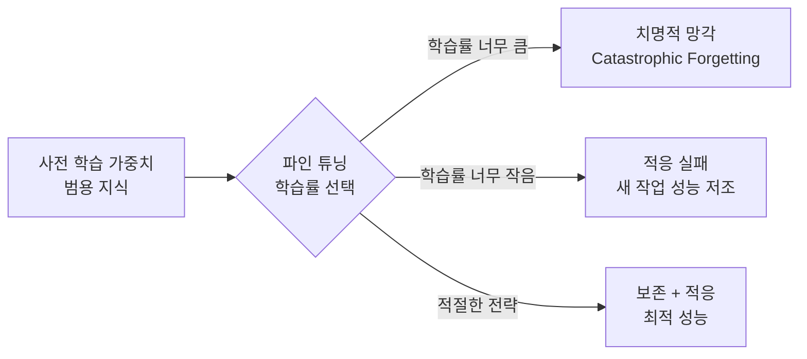
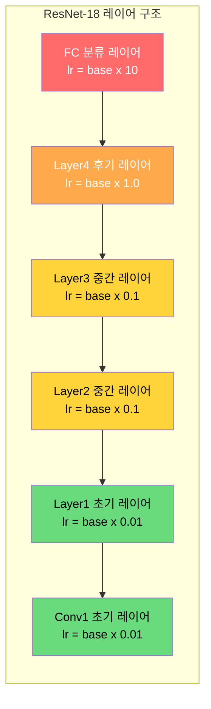
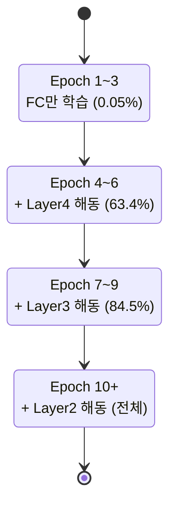
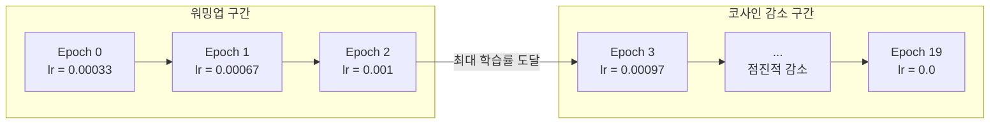

# 파인 튜닝 전략

> 효과적인 모델 미세 조정

## 개요

[전이 학습](./03-transfer-learning.md)에서 사전 학습 모델을 새 작업에 적용하는 두 가지 방식(특징 추출 vs 파인 튜닝)을 배웠습니다. 이번 섹션에서는 파인 튜닝을 **제대로** 하는 방법에 집중합니다. 레이어별 학습률 차등 적용, 점진적 해동(Gradual Unfreezing), 학습률 워밍업 등 **파인 튜닝의 성능을 극대화하는 고급 테크닉**을 다룹니다.

**선수 지식**: [전이 학습](./03-transfer-learning.md), [손실 함수와 옵티마이저](../03-deep-learning-basics/04-loss-optimizer.md)
**학습 목표**:
- 파인 튜닝 시 학습률 설정 전략을 이해하고 적용할 수 있다
- 점진적 해동(Gradual Unfreezing)의 원리와 효과를 설명할 수 있다
- 레이어별 차등 학습률(Discriminative Learning Rate)을 구현할 수 있다

## 왜 알아야 할까?

파인 튜닝은 단순히 `requires_grad = True`로 설정하고 학습하면 끝나는 게 아닙니다. 사전 학습된 가중치에는 수백만 장의 이미지에서 얻은 귀중한 지식이 담겨 있는데, 너무 큰 학습률로 학습하면 이 지식이 **파괴**됩니다. 반대로 너무 조심스럽게 하면 새 데이터에 **적응하지 못하죠**.

파인 튜닝은 "보존"과 "적응" 사이의 균형을 맞추는 기술입니다. 이 균형을 잘 잡느냐에 따라 같은 모델, 같은 데이터에서도 **정확도가 2~5%** 달라질 수 있습니다.

## 핵심 개념

### 1. 파인 튜닝의 핵심 딜레마 — 보존 vs 적응

> 💡 **비유**: 외국어를 잘하는 통역사(사전 학습 모델)에게 특정 분야의 전문 용어를 가르치는 상황을 생각해보세요. 너무 빡세게 주입하면 기본 언어 실력이 흐트러지고(catastrophic forgetting), 너무 살살 가르치면 전문 용어를 제대로 못 익힙니다. **기본기는 유지하면서 전문성을 추가하는** 절묘한 균형이 필요하죠.

이 딜레마를 **치명적 망각(Catastrophic Forgetting)**이라고 합니다. 새 작업을 학습하면서 이전에 배운 지식을 잊어버리는 현상이죠. 파인 튜닝의 모든 테크닉은 이 문제를 해결하기 위해 존재합니다.

> 📊 **그림 1**: 파인 튜닝의 핵심 딜레마 — 보존과 적응의 균형




### 2. 전략 1: 작은 학습률 사용

가장 기본적이면서도 중요한 전략입니다. 사전 학습 모델을 파인 튜닝할 때는 **처음부터 학습할 때보다 10~100배 작은 학습률**을 사용합니다.

| 학습 방식 | 일반적인 학습률 |
|-----------|---------------|
| 처음부터 학습 (SGD) | 0.1 |
| 파인 튜닝 (SGD) | 0.001 ~ 0.01 |
| 처음부터 학습 (Adam) | 0.001 |
| 파인 튜닝 (Adam) | 0.00001 ~ 0.0001 |

왜 작은 학습률이 필요할까요? 사전 학습된 가중치는 이미 **좋은 지점** 근처에 있습니다. 큰 학습률로 업데이트하면 이 좋은 지점에서 **멀리 튕겨나갈** 수 있기 때문입니다.

### 3. 전략 2: 레이어별 차등 학습률 (Discriminative Learning Rate)

CNN의 각 레이어는 서로 다른 수준의 특징을 학습합니다. 초기 레이어(가장자리, 질감)는 범용적이므로 거의 건드리지 않고, 후기 레이어(객체 부분, 조합)는 새 데이터에 맞게 더 많이 조정하는 것이 합리적입니다.

> 💡 **비유**: 집을 리모델링할 때, 기초 공사(초기 레이어)는 그대로 두고, 인테리어(중간 레이어)는 약간 손보고, 가구와 소품(후기 레이어)은 완전히 바꾸는 것과 같습니다. 모든 것을 동일한 강도로 바꿀 필요가 없죠.

구체적으로는 레이어 그룹별로 **다른 학습률**을 적용합니다:

> 📊 **그림 2**: 레이어별 차등 학습률 구조 — 깊을수록 작은 학습률




| 레이어 그룹 | 학습률 | 이유 |
|------------|--------|------|
| 초기 레이어 (conv1, layer1) | base_lr × 0.01 | 범용 특징 보존 |
| 중간 레이어 (layer2, layer3) | base_lr × 0.1 | 약간의 조정 |
| 후기 레이어 (layer4) | base_lr × 1.0 | 적극적 적응 |
| 새 분류 레이어 (fc) | base_lr × 10.0 | 처음부터 학습 |

```python
import torch.optim as optim
from torchvision import models
from torchvision.models import ResNet18_Weights
import torch.nn as nn

# 사전 학습 ResNet-18 로드
model = models.resnet18(weights=ResNet18_Weights.IMAGENET1K_V1)
model.fc = nn.Linear(model.fc.in_features, 10)  # 10클래스로 교체

# === 레이어별 차등 학습률 설정 ===
base_lr = 1e-3

param_groups = [
    # 초기 레이어: 매우 작은 학습률 (범용 특징 보존)
    {'params': list(model.conv1.parameters()) +
               list(model.bn1.parameters()) +
               list(model.layer1.parameters()),
     'lr': base_lr * 0.01},

    # 중간 레이어: 작은 학습률
    {'params': list(model.layer2.parameters()) +
               list(model.layer3.parameters()),
     'lr': base_lr * 0.1},

    # 후기 레이어: 기본 학습률
    {'params': model.layer4.parameters(),
     'lr': base_lr},

    # 새 분류 레이어: 가장 큰 학습률 (처음부터 학습)
    {'params': model.fc.parameters(),
     'lr': base_lr * 10},
]

optimizer = optim.Adam(param_groups, weight_decay=1e-4)

# 각 그룹의 학습률 확인
for i, group in enumerate(optimizer.param_groups):
    num_params = sum(p.numel() for p in group['params'])
    print(f"그룹 {i}: lr={group['lr']:.6f}, 파라미터 수={num_params:,}")

# 그룹 0: lr=0.000010, 파라미터 수=296,896   (초기)
# 그룹 1: lr=0.000100, 파라미터 수=3,408,384  (중간)
# 그룹 2: lr=0.001000, 파라미터 수=7,079,424  (후기)
# 그룹 3: lr=0.010000, 파라미터 수=5,130      (분류기)
```

### 4. 전략 3: 점진적 해동 (Gradual Unfreezing)

처음에는 분류 레이어만 학습하고, 일정 에포크마다 **아래쪽 레이어를 하나씩 해동**하는 방법입니다. 2018년 제레미 하워드(Jeremy Howard)와 세바스찬 루더(Sebastian Ruder)가 **ULMFiT** 논문에서 제안한 기법으로, NLP에서 먼저 성공을 거뒀지만 비전에서도 효과적입니다.

> 💡 **비유**: 새 팀에 합류한 신입사원(새 분류 레이어)이 먼저 업무에 적응하고, 그 다음 기존 팀원들(후기 레이어)이 조금씩 작업 방식을 조정하고, 마지막으로 팀 전체(전체 모델)가 새 프로젝트에 맞춰가는 과정과 같습니다.

> 📊 **그림 3**: 점진적 해동 과정 — 에포크에 따라 레이어를 순차적으로 해동




```python
import torch
import torch.nn as nn
from torchvision import models
from torchvision.models import ResNet18_Weights

DEVICE = torch.device('cuda' if torch.cuda.is_available() else 'cpu')

def gradual_unfreeze_demo():
    """점진적 해동 전략 구현"""
    model = models.resnet18(weights=ResNet18_Weights.IMAGENET1K_V1)
    model.fc = nn.Linear(model.fc.in_features, 10)
    model = model.to(DEVICE)

    # Step 1: 모든 레이어 고정
    for param in model.parameters():
        param.requires_grad = False

    # Step 2: 분류 레이어만 해동
    for param in model.fc.parameters():
        param.requires_grad = True

    # 레이어 그룹 정의 (아래에서 위로 해동할 순서)
    layer_groups = [
        ('fc', model.fc),
        ('layer4', model.layer4),
        ('layer3', model.layer3),
        ('layer2', model.layer2),
        ('layer1', model.layer1),
    ]

    def unfreeze_group(group_name, group_module):
        """특정 레이어 그룹의 학습을 활성화"""
        for param in group_module.parameters():
            param.requires_grad = True
        count = sum(p.numel() for p in group_module.parameters() if p.requires_grad)
        print(f"  [{group_name}] 해동 완료 — {count:,}개 파라미터 학습 가능")

    def count_trainable():
        return sum(p.numel() for p in model.parameters() if p.requires_grad)

    # === 점진적 해동 스케줄 ===
    EPOCHS = 15

    for epoch in range(1, EPOCHS + 1):
        # 에포크에 따라 레이어 해동
        if epoch == 1:
            print(f"\n[Epoch {epoch}] 분류 레이어만 학습")
            # fc는 이미 해동됨
        elif epoch == 4:
            print(f"\n[Epoch {epoch}] layer4 해동")
            unfreeze_group('layer4', model.layer4)
        elif epoch == 7:
            print(f"\n[Epoch {epoch}] layer3 해동")
            unfreeze_group('layer3', model.layer3)
        elif epoch == 10:
            print(f"\n[Epoch {epoch}] layer2 해동")
            unfreeze_group('layer2', model.layer2)

        trainable = count_trainable()
        total = sum(p.numel() for p in model.parameters())
        # 여기서 실제 학습 루프 실행
        # train_one_epoch(model, train_loader, criterion, optimizer, DEVICE)
        print(f"  Epoch {epoch}: 학습 가능 {trainable:,}/{total:,} "
              f"({100*trainable/total:.1f}%)")

gradual_unfreeze_demo()

# 출력:
# [Epoch 1] 분류 레이어만 학습
#   Epoch 1: 학습 가능 5,130/11,181,642 (0.0%)
#   ...
# [Epoch 4] layer4 해동
#   [layer4] 해동 완료 — 7,079,424개 파라미터 학습 가능
#   Epoch 4: 학습 가능 7,084,554/11,181,642 (63.4%)
#   ...
# [Epoch 7] layer3 해동
#   [layer3] 해동 완료 — 2,359,808개 파라미터 학습 가능
#   Epoch 7: 학습 가능 9,444,362/11,181,642 (84.5%)
```

### 5. 전략 4: 학습률 워밍업 (Learning Rate Warmup)

파인 튜닝 시작 시 **매우 작은 학습률에서 시작해서 서서히 올리는** 기법입니다. 초기에 큰 학습률로 시작하면 사전 학습 가중치가 급격히 변해서 좋은 특징을 잃을 수 있거든요.

> 📊 **그림 4**: 학습률 워밍업 + 코사인 감소 스케줄




```python
import torch.optim as optim

# 워밍업 + 코사인 감소 스케줄러 조합
def create_warmup_cosine_scheduler(optimizer, warmup_epochs, total_epochs):
    """워밍업 후 코사인 감소하는 스케줄러"""
    def lr_lambda(epoch):
        if epoch < warmup_epochs:
            # 워밍업: 0에서 1까지 선형 증가
            return (epoch + 1) / warmup_epochs
        else:
            # 코사인 감소: 1에서 0까지
            import math
            progress = (epoch - warmup_epochs) / (total_epochs - warmup_epochs)
            return 0.5 * (1 + math.cos(math.pi * progress))
    return optim.lr_scheduler.LambdaLR(optimizer, lr_lambda)

# 사용 예시
optimizer = optim.Adam(model.parameters(), lr=1e-3)
scheduler = create_warmup_cosine_scheduler(optimizer,
                                            warmup_epochs=3,
                                            total_epochs=20)

# 학습률 변화 확인
for epoch in range(20):
    lr = optimizer.param_groups[0]['lr']
    if epoch < 5 or epoch >= 17:  # 처음과 끝 몇 개만 출력
        print(f"Epoch {epoch:2d}: lr = {lr:.6f}")
    scheduler.step()

# Epoch  0: lr = 0.000333  (워밍업 1/3)
# Epoch  1: lr = 0.000667  (워밍업 2/3)
# Epoch  2: lr = 0.001000  (워밍업 완료, 최대 학습률)
# Epoch  3: lr = 0.000972  (코사인 감소 시작)
# Epoch  4: lr = 0.000890
# ...
# Epoch 17: lr = 0.000110
# Epoch 18: lr = 0.000028
# Epoch 19: lr = 0.000000
```

학습률이 워밍업 3 에포크 동안 0에서 최대값까지 올라간 뒤, 코사인 곡선을 따라 부드럽게 감소합니다.

### 6. 전략 종합 — 실전 파인 튜닝 레시피

지금까지 배운 전략을 조합한 **실전 파인 튜닝 코드**입니다:

```python
import torch
import torch.nn as nn
import torch.optim as optim
from torch.utils.data import DataLoader
from torchvision import datasets, transforms, models
from torchvision.models import ResNet18_Weights
import math

DEVICE = torch.device('cuda' if torch.cuda.is_available() else 'cpu')
BATCH_SIZE = 64
EPOCHS = 20
WARMUP_EPOCHS = 3
BASE_LR = 1e-3

# === 데이터 준비 (ImageNet 전처리) ===
train_transform = transforms.Compose([
    transforms.Resize(224),
    transforms.RandomCrop(224, padding=8),
    transforms.RandomHorizontalFlip(),
    transforms.ToTensor(),
    transforms.Normalize([0.485, 0.456, 0.406], [0.229, 0.224, 0.225]),
])
test_transform = transforms.Compose([
    transforms.Resize(224),
    transforms.ToTensor(),
    transforms.Normalize([0.485, 0.456, 0.406], [0.229, 0.224, 0.225]),
])

train_dataset = datasets.CIFAR10('./data', train=True, download=True,
                                  transform=train_transform)
test_dataset = datasets.CIFAR10('./data', train=False, download=True,
                                 transform=test_transform)
train_loader = DataLoader(train_dataset, batch_size=BATCH_SIZE,
                          shuffle=True, num_workers=2)
test_loader = DataLoader(test_dataset, batch_size=BATCH_SIZE,
                         shuffle=False, num_workers=2)

# === 모델 + 차등 학습률 ===
model = models.resnet18(weights=ResNet18_Weights.IMAGENET1K_V1)
model.fc = nn.Linear(model.fc.in_features, 10)
model = model.to(DEVICE)

param_groups = [
    {'params': list(model.conv1.parameters()) +
               list(model.bn1.parameters()) +
               list(model.layer1.parameters()),
     'lr': BASE_LR * 0.01, 'name': 'early'},
    {'params': list(model.layer2.parameters()) +
               list(model.layer3.parameters()),
     'lr': BASE_LR * 0.1, 'name': 'middle'},
    {'params': model.layer4.parameters(),
     'lr': BASE_LR, 'name': 'late'},
    {'params': model.fc.parameters(),
     'lr': BASE_LR * 10, 'name': 'head'},
]

optimizer = optim.AdamW(param_groups, weight_decay=1e-2)

# === 워밍업 + 코사인 스케줄러 ===
def lr_lambda(epoch):
    if epoch < WARMUP_EPOCHS:
        return (epoch + 1) / WARMUP_EPOCHS
    progress = (epoch - WARMUP_EPOCHS) / (EPOCHS - WARMUP_EPOCHS)
    return 0.5 * (1 + math.cos(math.pi * progress))

scheduler = optim.lr_scheduler.LambdaLR(optimizer, lr_lambda)
criterion = nn.CrossEntropyLoss()

# === 학습 및 평가 함수 ===
def train_one_epoch(model, loader, criterion, optimizer, device):
    model.train()
    total_loss, correct, total = 0, 0, 0
    for images, labels in loader:
        images, labels = images.to(device), labels.to(device)
        optimizer.zero_grad()
        outputs = model(images)
        loss = criterion(outputs, labels)
        loss.backward()
        optimizer.step()
        total_loss += loss.item() * images.size(0)
        _, predicted = outputs.max(1)
        correct += predicted.eq(labels).sum().item()
        total += labels.size(0)
    return total_loss / total, 100. * correct / total

def evaluate(model, loader, criterion, device):
    model.eval()
    total_loss, correct, total = 0, 0, 0
    with torch.no_grad():
        for images, labels in loader:
            images, labels = images.to(device), labels.to(device)
            outputs = model(images)
            loss = criterion(outputs, labels)
            total_loss += loss.item() * images.size(0)
            _, predicted = outputs.max(1)
            correct += predicted.eq(labels).sum().item()
            total += labels.size(0)
    return total_loss / total, 100. * correct / total

# === 학습 실행 ===
best_acc = 0
for epoch in range(1, EPOCHS + 1):
    train_loss, train_acc = train_one_epoch(
        model, train_loader, criterion, optimizer, DEVICE)
    test_loss, test_acc = evaluate(model, test_loader, criterion, DEVICE)
    scheduler.step()

    if test_acc > best_acc:
        best_acc = test_acc
        torch.save(model.state_dict(), 'best_finetuned.pth')

    if epoch % 5 == 0 or epoch == 1:
        lrs = [f"{g['name']}={g['lr']*lr_lambda(epoch-1):.6f}"
               for g in param_groups]
        print(f"Epoch {epoch:2d} | Train: {train_acc:.1f}% | "
              f"Test: {test_acc:.1f}% | LR: {', '.join(lrs)}")

print(f"\n최고 테스트 정확도: {best_acc:.2f}%")

# 예상 출력:
# Epoch  1 | Train: 85.2% | Test: 88.4% | LR: early=0.000003, ...
# Epoch  5 | Train: 95.1% | Test: 94.3% | LR: early=0.000009, ...
# Epoch 10 | Train: 97.8% | Test: 95.2% | LR: early=0.000005, ...
# Epoch 15 | Train: 98.9% | Test: 95.6% | LR: early=0.000002, ...
# Epoch 20 | Train: 99.3% | Test: 95.8% | LR: early=0.000000, ...
# 최고 테스트 정확도: 95.80%
```

## 더 깊이 알아보기

### ULMFiT — 파인 튜닝 전략의 혁명

현대 파인 튜닝 전략의 많은 부분은 2018년 **제레미 하워드(Jeremy Howard)**와 **세바스찬 루더(Sebastian Ruder)**의 **ULMFiT(Universal Language Model Fine-tuning)** 논문에서 비롯되었습니다. 이 논문은 NLP를 대상으로 했지만, 제안된 세 가지 핵심 기법 — 차등 학습률, 점진적 해동, 삼각 학습률(Slanted Triangular LR) — 은 컴퓨터 비전에서도 그대로 적용됩니다.

흥미로운 점은, 하워드가 이 연구를 할 때 대형 연구소가 아닌 **fast.ai**라는 작은 교육 조직에서 진행했다는 것입니다. 거대 자본이 아닌 **영리한 전략**으로 성능을 끌어올린 사례이죠. 이 논문은 이후 BERT, GPT 시대의 "사전 학습 → 파인 튜닝" 패러다임에 큰 영향을 미쳤습니다.

> 💡 **알고 계셨나요?**: fast.ai 라이브러리에서는 `learn.fine_tune(epochs)` 한 줄로 점진적 해동 + 차등 학습률 + 워밍업이 자동 적용됩니다. 하워드가 논문에서 제안한 전략을 기본값으로 내장한 것이죠. 이 "합리적인 기본값(sensible defaults)" 철학은 실무자들 사이에서 큰 호응을 받았습니다.

### 파인 튜닝 체크리스트

실무에서 파인 튜닝을 할 때 순서대로 따라가면 좋은 체크리스트입니다:

1. **사전 학습 모델 선택**: ResNet-50이 범용적 출발점
2. **분류 레이어 교체**: `model.fc = nn.Linear(in_features, num_classes)`
3. **ImageNet 전처리 적용**: mean, std, 입력 크기(224)
4. **작은 학습률 사용**: 처음부터 학습의 1/10 ~ 1/100
5. **차등 학습률 적용**: 초기 레이어 < 후기 레이어 < 새 레이어
6. **워밍업 사용**: 3~5 에포크 워밍업으로 안정적 시작
7. **Weight Decay 적용**: AdamW + weight_decay=1e-2
8. **모니터링**: Train-Test 갭이 벌어지면 정규화 강화

## 흔한 오해와 팁

> ⚠️ **흔한 오해**: "파인 튜닝은 무조건 전체 레이어를 학습해야 한다" — 오히려 데이터가 적을 때 전체를 파인 튜닝하면 과적합이 심해집니다. 후기 레이어 몇 개만 파인 튜닝하는 것이 더 나은 경우가 많습니다.

> ⚠️ **흔한 오해**: "파인 튜닝 학습률은 고정해야 한다" — 워밍업과 스케줄링을 적용하면 같은 에포크에서도 성능이 크게 향상됩니다. 특히 워밍업은 초기 학습 불안정성을 크게 줄여줍니다.

> 🔥 **실무 팁**: 파인 튜닝 시 **AdamW**를 사용하세요. 일반 Adam의 weight decay는 가중치 정규화가 제대로 동작하지 않는 반면, AdamW는 이를 올바르게 구현합니다. 이 차이가 테스트 정확도에서 0.5~1% 차이를 만들 수 있습니다.

> 🔥 **실무 팁**: 파인 튜닝이 잘 안 되면, **먼저 특징 추출기로 5 에포크 → 그 다음 점진적 해동**으로 전환해보세요. 분류 레이어가 어느 정도 수렴한 후에 하위 레이어를 건드리는 것이 안정적입니다.

## 핵심 정리

| 전략 | 설명 | 효과 |
|------|------|------|
| 작은 학습률 | 처음부터 학습의 1/10~1/100 사용 | 사전 학습 지식 보존 |
| 차등 학습률 | 초기 레이어 < 후기 레이어 < 새 레이어 | 레이어별 최적 적응 |
| 점진적 해동 | 분류기부터 시작, 점차 하위 레이어 해동 | 안정적 학습, 망각 방지 |
| 학습률 워밍업 | 작은 값에서 시작해 서서히 증가 | 초기 학습 안정화 |
| AdamW | weight decay를 올바르게 적용하는 옵티마이저 | 더 나은 일반화 |
| 치명적 망각 | 새 학습이 이전 지식을 파괴하는 현상 | 파인 튜닝의 핵심 도전 과제 |

## 다음 섹션 미리보기

파인 튜닝으로 모델을 최적화하는 방법을 배웠습니다. 하지만 모델만큼 중요한 것이 **데이터**입니다. [데이터 증강](./05-data-augmentation.md)에서는 기존 데이터를 변형하여 학습 데이터의 다양성을 높이는 다양한 기법 — Albumentations, RandAugment, MixUp, CutMix 등 — 을 다루며, 이 기법들이 모델 성능에 어떤 영향을 미치는지 실험합니다.

## 참고 자료

- [PyTorch 공식 전이 학습 튜토리얼](https://docs.pytorch.org/tutorials/beginner/transfer_learning_tutorial.html) - 특징 추출 vs 파인 튜닝 실습 가이드
- [ULMFiT: Universal Language Model Fine-tuning (Howard & Ruder, 2018)](https://arxiv.org/abs/1801.06146) - 차등 학습률과 점진적 해동을 제안한 핵심 논문
- [Ultimate Guide to Fine-Tuning in PyTorch](https://rumn.medium.com/part-1-ultimate-guide-to-fine-tuning-in-pytorch-pre-trained-model-and-its-configuration-8990194b71e) - 실전 파인 튜닝 종합 가이드
- [Discriminative Fine-Tuning: A Comprehensive Guide](https://www.shadecoder.com/topics/discriminative-fine-tuning-a-comprehensive-guide-for-2025) - 차등 학습률의 이론과 실전
- [Advanced Techniques for Fine-tuning Transformers](https://towardsdatascience.com/advanced-techniques-for-fine-tuning-transformers-82e4e61e16e/) - Transformer 시대의 파인 튜닝 고급 기법
