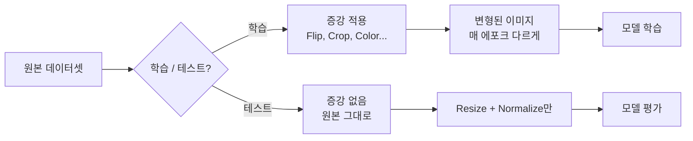
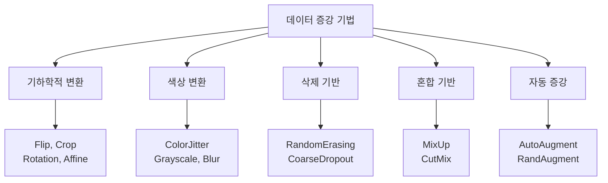
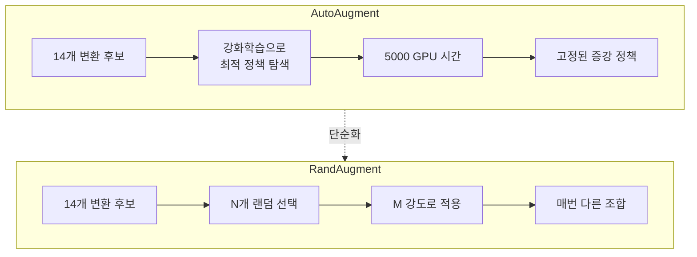
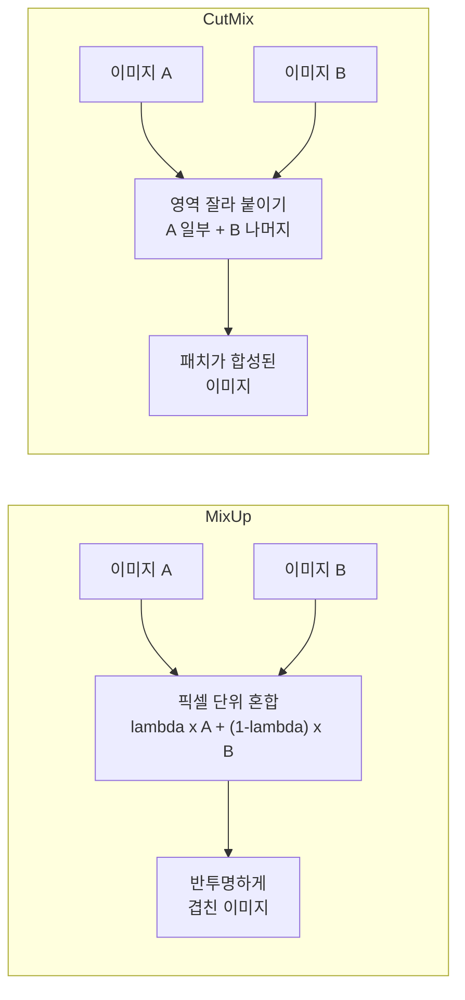

# 데이터 증강

> Albumentations, RandAugment, MixUp

## 개요

모델 아키텍처와 파인 튜닝 전략을 최적화했다면, 이제 **데이터 쪽**에서 성능을 끌어올릴 차례입니다. **데이터 증강(Data Augmentation)**은 기존 이미지를 다양하게 변형하여 모델이 더 많은 상황을 경험하게 만드는 기법입니다. 간단한 뒤집기부터 MixUp, CutMix 같은 고급 기법까지, 데이터 증강은 현대 컴퓨터 비전에서 **빠질 수 없는 필수 테크닉**입니다.

**선수 지식**: [CIFAR-10 분류](./02-cifar10.md), [파인 튜닝 전략](./04-fine-tuning.md)
**학습 목표**:
- 데이터 증강의 원리와 왜 효과적인지 이해한다
- torchvision transforms와 Albumentations의 차이를 알고 사용할 수 있다
- MixUp, CutMix, RandAugment 같은 고급 증강 기법을 구현할 수 있다

## 왜 알아야 할까?

딥러닝 모델의 성능은 **데이터의 양과 다양성**에 크게 좌우됩니다. 하지만 현실에서 대량의 라벨링된 데이터를 확보하는 것은 시간과 비용이 많이 들죠. 데이터 증강은 **기존 데이터를 변형하여 사실상 데이터셋을 몇 배로 늘리는** 효과를 줍니다. 추가 데이터 수집 비용 없이 성능을 3~10% 올릴 수 있다면, 안 할 이유가 없겠죠?

[CIFAR-10](./02-cifar10.md)에서 RandomCrop과 HorizontalFlip만으로도 약 5%의 정확도 향상을 확인했습니다. 이번 섹션에서는 더 다양하고 강력한 증강 기법을 배워, 성능을 한 단계 더 끌어올립니다.

## 핵심 개념

### 1. 데이터 증강의 원리 — 모델에게 "다양한 경험"을 주기

> 💡 **비유**: 운전 면허 시험을 준비한다고 생각해보세요. 맑은 날에만 연습하면, 비 오는 날이나 야간에 당황합니다. **다양한 날씨와 도로 조건에서 연습**해야 실전에서 당황하지 않죠. 데이터 증강도 마찬가지입니다 — 모델에게 뒤집힌 이미지, 밝기가 다른 이미지, 일부가 가려진 이미지 등 다양한 변형을 보여줘서, 실전에서 만날 다양한 상황에 대비하게 합니다.

데이터 증강이 효과적인 이유는 **정규화(Regularization)** 효과 때문입니다. 매 에포크마다 조금씩 다른 이미지를 보여주면, 모델이 특정 이미지를 "암기"하는 대신 **일반적인 패턴**을 학습하게 됩니다.

핵심 규칙 두 가지를 기억하세요:

- **학습 데이터에만 적용**: 테스트 데이터는 원본 그대로 평가해야 공정합니다

> 📊 **그림 1**: 데이터 증강의 적용 범위 — 학습 vs 테스트



- **의미를 바꾸지 않는 변형만**: 고양이를 뒤집어도 고양이이지만, 숫자 6을 뒤집으면 9가 됩니다

### 2. 기본 증강 — torchvision transforms

torchvision은 가장 널리 쓰이는 이미지 변환 라이브러리입니다. 2024년 기준 `torchvision.transforms.v2`가 권장되며, 기존 v1과 완전히 호환됩니다.

```python
from torchvision import transforms

# === 기본 증강 파이프라인 ===
basic_augmentation = transforms.Compose([
    # 기하학적 변환
    transforms.RandomHorizontalFlip(p=0.5),        # 50% 확률로 좌우 반전
    transforms.RandomCrop(32, padding=4),            # 패딩 후 랜덤 크롭
    transforms.RandomRotation(degrees=15),           # ±15도 랜덤 회전

    # 색상 변환
    transforms.ColorJitter(
        brightness=0.2,   # 밝기 ±20% 변화
        contrast=0.2,     # 대비 ±20% 변화
        saturation=0.2,   # 채도 ±20% 변화
        hue=0.1           # 색조 ±10% 변화
    ),

    # 텐서 변환 & 정규화
    transforms.ToTensor(),
    transforms.Normalize(mean=[0.485, 0.456, 0.406],
                         std=[0.229, 0.224, 0.225]),
])

# === 증강 유형 정리 ===
# 기하학적: Flip, Crop, Rotation, Affine, Perspective
# 색상: ColorJitter, Grayscale, GaussianBlur
# 삭제: RandomErasing (이미지의 일부를 지움)
```

자주 쓰이는 기본 증강 기법:

| 기법 | 역할 | 주의사항 |
|------|------|---------|
| RandomHorizontalFlip | 좌우 대칭 학습 | 숫자/글자 인식에는 부적절 |
| RandomCrop(padding) | 위치 불변성 학습 | padding 크기가 너무 크면 정보 손실 |
| RandomRotation | 기울어진 객체 대응 | 각도가 크면 부자연스러운 이미지 생성 |
| ColorJitter | 조명 변화에 강건 | 값이 크면 원본 의미 훼손 |
| RandomErasing | 가려진 객체 대응 | Cutout과 유사한 효과 |

### 3. Albumentations — 더 빠르고, 더 다양하게

> 📊 **그림 2**: 증강 기법 분류 체계




**Albumentations**는 데이터 증강 전용 라이브러리로, torchvision보다 **빠르고 다양한 변환**을 제공합니다. 특히 객체 탐지와 세그멘테이션에서는 바운딩 박스와 마스크까지 함께 변환해주는 기능이 강력합니다.

```python
import albumentations as A
from albumentations.pytorch import ToTensorV2
import cv2

# === Albumentations 증강 파이프라인 ===
album_transform = A.Compose([
    A.HorizontalFlip(p=0.5),
    A.ShiftScaleRotate(
        shift_limit=0.1,    # 이동: ±10%
        scale_limit=0.1,    # 스케일: ±10%
        rotate_limit=15,    # 회전: ±15도
        p=0.5
    ),
    A.OneOf([               # 아래 중 하나만 랜덤 적용
        A.GaussianBlur(blur_limit=3, p=1.0),
        A.MedianBlur(blur_limit=3, p=1.0),
    ], p=0.3),
    A.CoarseDropout(        # 여러 개의 작은 영역을 지움
        max_holes=8,
        max_height=4,
        max_width=4,
        fill_value=0,
        p=0.3
    ),
    A.Normalize(
        mean=[0.485, 0.456, 0.406],
        std=[0.229, 0.224, 0.225],
    ),
    ToTensorV2(),           # numpy → PyTorch 텐서
])

# === 사용 예시 ===
# Albumentations는 numpy 배열(H, W, C)을 입력으로 받음
# image = cv2.imread("image.jpg")
# image = cv2.cvtColor(image, cv2.COLOR_BGR2RGB)
# augmented = album_transform(image=image)
# tensor_image = augmented['image']
```

torchvision vs Albumentations 비교:

| 항목 | torchvision | Albumentations |
|------|-------------|----------------|
| 입력 형식 | PIL Image | NumPy 배열 |
| 속도 | 보통 | 빠름 (OpenCV 기반) |
| 변환 종류 | 약 30개 | 70개 이상 |
| 바운딩 박스/마스크 | 미지원(v1) / 지원(v2) | 완벽 지원 |
| 추천 상황 | 간단한 분류 | 탐지/분할, 고급 증강 |

### 4. 자동 증강 — AutoAugment와 RandAugment

어떤 증강을 얼마나 적용할지 일일이 정하기 어렵죠? **자동 증강**은 이 과정을 자동화합니다.

**AutoAugment(2019)**는 강화 학습으로 최적의 증강 정책을 찾지만, 탐색 비용이 매우 큽니다(5,000 GPU 시간). 이를 개선한 **RandAugment(2020)**는 단 두 개의 하이퍼파라미터 — **N**(적용할 변환 개수)과 **M**(변환 강도) — 만으로 강력한 증강을 구현합니다.

> 📊 **그림 3**: AutoAugment vs RandAugment 동작 방식 비교




```python
from torchvision import transforms

# === RandAugment 사용 (torchvision 내장) ===
randaug_transform = transforms.Compose([
    transforms.RandAugment(
        num_ops=2,        # N: 매번 2개의 변환을 랜덤 적용
        magnitude=9,      # M: 변환 강도 (0~30, 보통 9~15)
    ),
    transforms.ToTensor(),
    transforms.Normalize(mean=[0.485, 0.456, 0.406],
                         std=[0.229, 0.224, 0.225]),
])

# RandAugment가 자동으로 선택하는 변환 종류:
# Identity, AutoContrast, Equalize, Rotate, Solarize,
# Color, Posterize, Contrast, Brightness, Sharpness,
# ShearX, ShearY, TranslateX, TranslateY
```

> 💡 **비유**: AutoAugment는 미쉐린 셰프가 수천 가지 레시피를 시도해서 최고의 양념 조합을 찾는 것이고, RandAugment는 "좋은 재료 2개를 골라 적당히 넣으면 웬만하면 맛있다"는 실용적인 접근입니다. 놀랍게도, 이 단순한 전략이 비싼 탐색 기반 방법과 비슷한 성능을 냅니다.

### 5. MixUp과 CutMix — 이미지를 섞는 혁신적 기법

기존 증강이 **단일 이미지를 변형**했다면, MixUp과 CutMix는 **두 이미지를 섞어** 새로운 학습 샘플을 만드는 혁신적인 방법입니다.

**MixUp(2018)**: 두 이미지를 투명하게 겹칩니다.

> 새 이미지 = λ × 이미지A + (1-λ) × 이미지B
> 새 라벨 = λ × 라벨A + (1-λ) × 라벨B

**CutMix(2019)**: 이미지A의 일부 영역을 이미지B에서 잘라와 붙입니다.

> 새 이미지 = 이미지A의 일부 + 이미지B의 나머지 영역
> 새 라벨 = 면적 비율에 따라 혼합

> 📊 **그림 4**: MixUp vs CutMix 동작 원리 비교




```python
import torch
import torchvision.transforms.v2 as v2
from torch.utils.data import DataLoader
from torchvision import datasets, transforms

# === MixUp과 CutMix (torchvision v2) ===
# 이 변환은 배치 단위로 적용 (개별 이미지 X)
mixup = v2.MixUp(alpha=1.0, num_classes=10)
cutmix = v2.CutMix(alpha=1.0, num_classes=10)

# MixUp과 CutMix를 50:50 확률로 랜덤 적용
mixup_cutmix = v2.RandomChoice([mixup, cutmix])

# === 데이터 로더에 적용하는 방법 ===
train_transform = transforms.Compose([
    transforms.RandomHorizontalFlip(),
    transforms.RandomCrop(32, padding=4),
    transforms.ToTensor(),
    transforms.Normalize([0.485, 0.456, 0.406], [0.229, 0.224, 0.225]),
])

train_dataset = datasets.CIFAR10('./data', train=True,
                                  download=True, transform=train_transform)
train_loader = DataLoader(train_dataset, batch_size=64, shuffle=True)

# === 학습 루프에서 MixUp/CutMix 적용 ===
# MixUp/CutMix는 배치 단위로 적용
# for images, labels in train_loader:
#     images, labels = mixup_cutmix(images, labels)
#     # labels는 이제 원-핫이 아닌 소프트 라벨 (예: [0.3, 0, 0.7, ...])
#     outputs = model(images)
#     loss = criterion(outputs, labels)  # CrossEntropy가 소프트 라벨 지원
```

MixUp/CutMix 사용 시 중요한 점은, 라벨이 **원-핫(one-hot)**에서 **소프트 라벨(soft label)**로 바뀐다는 것입니다. "이 이미지는 70% 고양이 + 30% 개"처럼요. 이렇게 하면 모델이 "절대적 확신" 대신 **불확실성을 학습**하게 되어, 일반화 성능이 크게 향상됩니다.

### 6. 증강 전략 선택 가이드

어떤 증강을 언제 쓸지 헷갈릴 때 참고하세요:

| 상황 | 추천 증강 | 이유 |
|------|----------|------|
| 빠르게 시작 | Flip + Crop + ColorJitter | 구현 간단, 확실한 효과 |
| 분류 성능 극대화 | RandAugment + CutMix | 자동화 + 혼합 증강의 시너지 |
| 적은 데이터 (<1,000장) | 강한 기본 증강 + MixUp | 과적합 방지 극대화 |
| 의료/위성 영상 | Albumentations (도메인 특화) | 전문적인 변환 필요 |
| 객체 탐지/분할 | Albumentations (bbox/mask 지원) | 라벨도 함께 변환 |

## 실습: 증강 효과 비교 실험

```python
import torch
import torch.nn as nn
import torch.optim as optim
from torch.utils.data import DataLoader
from torchvision import datasets, transforms, models
from torchvision.models import ResNet18_Weights
import torchvision.transforms.v2 as v2

DEVICE = torch.device('cuda' if torch.cuda.is_available() else 'cpu')
BATCH_SIZE = 128
EPOCHS = 20

# === 실험 1: 증강 없음 (베이스라인) ===
no_aug = transforms.Compose([
    transforms.Resize(224),
    transforms.ToTensor(),
    transforms.Normalize([0.485, 0.456, 0.406], [0.229, 0.224, 0.225]),
])

# === 실험 2: 기본 증강 ===
basic_aug = transforms.Compose([
    transforms.Resize(224),
    transforms.RandomHorizontalFlip(),
    transforms.RandomCrop(224, padding=16),
    transforms.ToTensor(),
    transforms.Normalize([0.485, 0.456, 0.406], [0.229, 0.224, 0.225]),
])

# === 실험 3: 기본 + RandAugment ===
rand_aug = transforms.Compose([
    transforms.Resize(224),
    transforms.RandomHorizontalFlip(),
    transforms.RandomCrop(224, padding=16),
    transforms.RandAugment(num_ops=2, magnitude=9),
    transforms.ToTensor(),
    transforms.Normalize([0.485, 0.456, 0.406], [0.229, 0.224, 0.225]),
])

test_transform = transforms.Compose([
    transforms.Resize(224),
    transforms.ToTensor(),
    transforms.Normalize([0.485, 0.456, 0.406], [0.229, 0.224, 0.225]),
])


def run_experiment(name, train_transform, test_transform):
    """하나의 실험 실행"""
    train_data = datasets.CIFAR10('./data', train=True,
                                   download=True, transform=train_transform)
    test_data = datasets.CIFAR10('./data', train=False,
                                  download=True, transform=test_transform)
    train_loader = DataLoader(train_data, BATCH_SIZE, shuffle=True, num_workers=2)
    test_loader = DataLoader(test_data, BATCH_SIZE, shuffle=False, num_workers=2)

    # ResNet-18 파인 튜닝
    model = models.resnet18(weights=ResNet18_Weights.IMAGENET1K_V1)
    model.fc = nn.Linear(model.fc.in_features, 10)
    model = model.to(DEVICE)

    criterion = nn.CrossEntropyLoss()
    optimizer = optim.SGD(model.parameters(), lr=1e-3,
                          momentum=0.9, weight_decay=5e-4)
    scheduler = optim.lr_scheduler.CosineAnnealingLR(optimizer, T_max=EPOCHS)

    best_acc = 0
    for epoch in range(1, EPOCHS + 1):
        # 학습
        model.train()
        for images, labels in train_loader:
            images, labels = images.to(DEVICE), labels.to(DEVICE)
            optimizer.zero_grad()
            loss = criterion(model(images), labels)
            loss.backward()
            optimizer.step()

        # 평가
        model.eval()
        correct, total = 0, 0
        with torch.no_grad():
            for images, labels in test_loader:
                images, labels = images.to(DEVICE), labels.to(DEVICE)
                _, predicted = model(images).max(1)
                correct += predicted.eq(labels).sum().item()
                total += labels.size(0)

        acc = 100. * correct / total
        best_acc = max(best_acc, acc)
        scheduler.step()

    print(f"[{name}] 최고 테스트 정확도: {best_acc:.2f}%")
    return best_acc

# === 실험 실행 ===
results = {}
results['증강 없음'] = run_experiment('증강 없음', no_aug, test_transform)
results['기본 증강'] = run_experiment('기본 증강', basic_aug, test_transform)
results['RandAugment'] = run_experiment('RandAugment', rand_aug, test_transform)

# 예상 결과:
# [증강 없음]    최고 테스트 정확도: 91.20%
# [기본 증강]    최고 테스트 정확도: 94.35%
# [RandAugment]  최고 테스트 정확도: 95.60%
```

증강 없이 91%였던 정확도가, 기본 증강으로 94%, RandAugment로 **95.6%**까지 올라갑니다. 모델은 동일하고 **데이터만 바꿨을 뿐**인데, 4% 이상 향상된 거죠.

## 더 깊이 알아보기

### 데이터 증강의 역사 — 수작업에서 자동화까지

데이터 증강의 역사는 딥러닝보다 오래되었습니다. 1990년대에도 문자 인식에서 이미지 변형을 통한 데이터 확장이 사용되었죠. 하지만 현대적 데이터 증강의 전환점은 **2012년 AlexNet**이었습니다. Krizhevsky 등은 ImageNet 학습 시 랜덤 크롭과 색상 변환을 적용하여 과적합을 크게 줄였고, 이것이 표준 관행이 되었습니다.

2018~2020년은 데이터 증강의 **혁신기**였습니다. MixUp(2018), CutMix(2019), AutoAugment(2019), RandAugment(2020)가 연달아 발표되면서, "이미지를 섞는다"는 이전에는 생각하기 어려운 아이디어가 등장했죠.

특히 CutMix를 제안한 것은 **네이버 AI Lab(현 NAVER CLOVA)**의 연구진이었습니다. 한국 연구팀이 만든 이 기법이 전 세계적으로 표준 증강 기법이 된 것은 주목할 만한 성과입니다.

> 💡 **알고 계셨나요?**: MixUp의 핵심 아이디어는 놀랍도록 단순합니다. "두 이미지를 투명하게 겹치면 모델이 더 잘 배운다"는 것이죠. 이 단순한 아이디어가 CIFAR-10에서 1~2%, ImageNet에서도 약 1%의 정확도 향상을 가져왔습니다. 때로는 가장 단순한 아이디어가 가장 효과적입니다.

### 증강 강도와 성능의 관계

증강은 **"적당히"**가 핵심입니다. 너무 약하면 효과가 없고, 너무 강하면 오히려 성능이 떨어집니다. 원본 이미지의 의미가 훼손될 정도로 왜곡하면, 모델이 엉뚱한 것을 학습하기 때문입니다.

RandAugment의 magnitude 파라미터를 기준으로:
- **M=5~9**: 가벼운 증강 (안정적, 대부분의 경우 적합)
- **M=10~15**: 보통 증강 (큰 데이터셋에서 효과적)
- **M=20+**: 매우 강한 증강 (특수한 경우에만)

## 흔한 오해와 팁

> ⚠️ **흔한 오해**: "증강을 많이 하면 할수록 좋다" — 과도한 증강은 오히려 성능을 떨어뜨릴 수 있습니다. 원본 이미지의 의미가 사라질 정도의 변형은 모델에게 잘못된 신호를 줍니다. 증강 후의 이미지를 직접 눈으로 확인하는 습관을 들이세요.

> ⚠️ **흔한 오해**: "테스트 데이터에도 증강을 적용해야 한다" — 절대 안 됩니다! 테스트는 원본 이미지로 평가해야 공정한 성능 측정이 가능합니다. 다만, **테스트 시 증강(Test-Time Augmentation, TTA)**이라는 고급 기법은 예외인데, 이는 여러 증강 버전의 예측을 평균내는 별도의 테크닉입니다.

> 🔥 **실무 팁**: 데이터 증강 파이프라인을 설계할 때, 먼저 `transforms`를 적용한 이미지를 **100장 정도 시각화**하여 자연스러운지 확인하세요. "이게 원래 클래스로 보이나?"라는 질문에 "아니오"라면 증강이 너무 강한 것입니다.

> 🔥 **실무 팁**: CIFAR-10 같은 작은 이미지(32×32)에서는 과도한 기하학적 변환(큰 회전, 큰 스케일 변화)이 해로울 수 있습니다. 이미지가 작을수록 작은 변형도 큰 영향을 미치기 때문이죠. 반면 ImageNet(224×224) 크기에서는 더 강한 증강이 효과적입니다.

## 핵심 정리

| 기법 | 설명 | 성능 효과 |
|------|------|----------|
| 기본 증강 (Flip, Crop) | 기하학적/색상 변환 | 정확도 3~5%↑ |
| Albumentations | 고속/다양한 변환 라이브러리 | 탐지/분할에 강력 |
| RandAugment | N개 변환을 M 강도로 자동 적용 | 정확도 1~2%↑ (기본 대비) |
| MixUp | 두 이미지를 투명하게 혼합 | 일반화 성능 향상 |
| CutMix | 이미지의 일부를 다른 이미지로 교체 | MixUp보다 약간 우수 |
| 증강 강도 | 적당히가 핵심, 너무 강하면 역효과 | 도메인에 따라 조정 |

## 다음 챕터 미리보기

Chapter 06에서 이미지 분류의 A to Z를 마스터했습니다. MNIST부터 시작해 CIFAR-10, 전이 학습, 파인 튜닝, 데이터 증강까지 — 분류 문제를 풀기 위한 핵심 도구를 모두 갖추었습니다. 다음 [Chapter 07: 객체 탐지](../07-object-detection/01-detection-basics.md)에서는 "이 이미지에 **무엇이** 있는가"를 넘어 "이미지 **어디에** 있는가"를 찾는 문제로 나아갑니다. 바운딩 박스, IoU, NMS 같은 새로운 개념이 등장합니다.

## 참고 자료

- [PyTorch CutMix/MixUp 공식 가이드](https://docs.pytorch.org/vision/main/auto_examples/transforms/plot_cutmix_mixup.html) - torchvision v2로 구현하는 MixUp/CutMix 튜토리얼
- [Albumentations 공식 문서](https://albumentations.ai/docs/1-introduction/what-are-image-augmentations/) - 데이터 증강의 개념과 Albumentations 사용법
- [Torchvision Transforms v2 문서](https://docs.pytorch.org/vision/stable/transforms.html) - 최신 transforms API 레퍼런스
- [CutMix: Regularization Strategy to Train Strong Classifiers (Yun et al., 2019)](https://arxiv.org/abs/1905.04899) - NAVER AI Lab의 CutMix 논문
- [Cutout, Mixup, and Cutmix: Modern Image Augmentations in PyTorch](https://towardsdatascience.com/cutout-mixup-and-cutmix-implementing-modern-image-augmentations-in-pytorch-a9d7db3074ad/) - MixUp/CutMix 비교 구현 가이드
