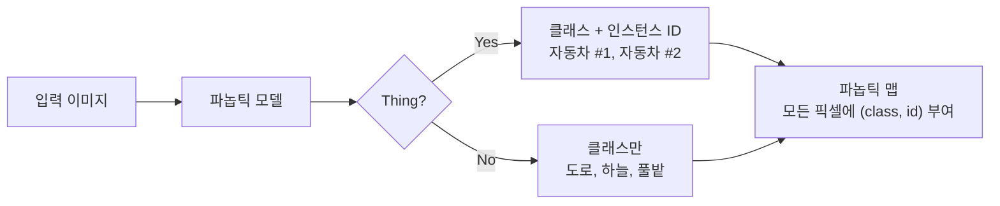
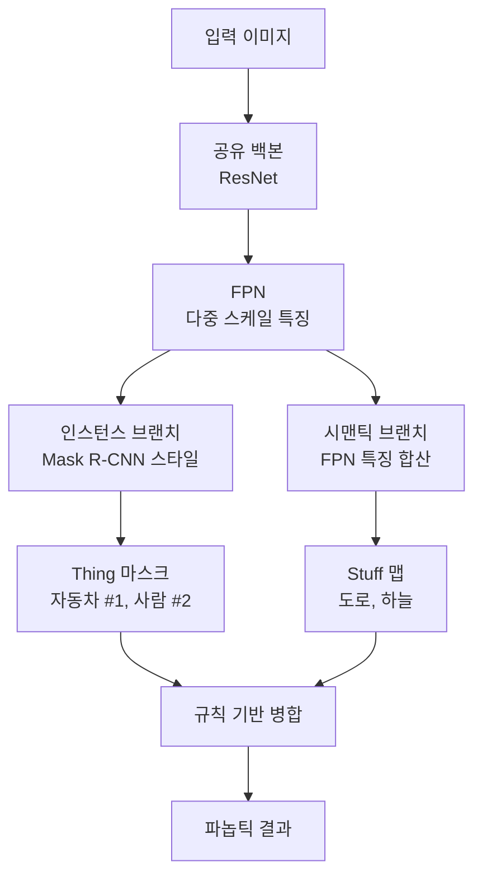
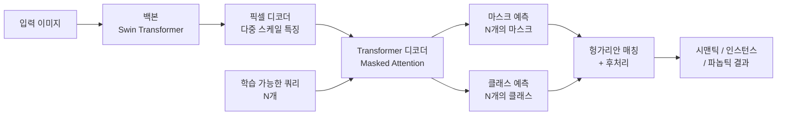
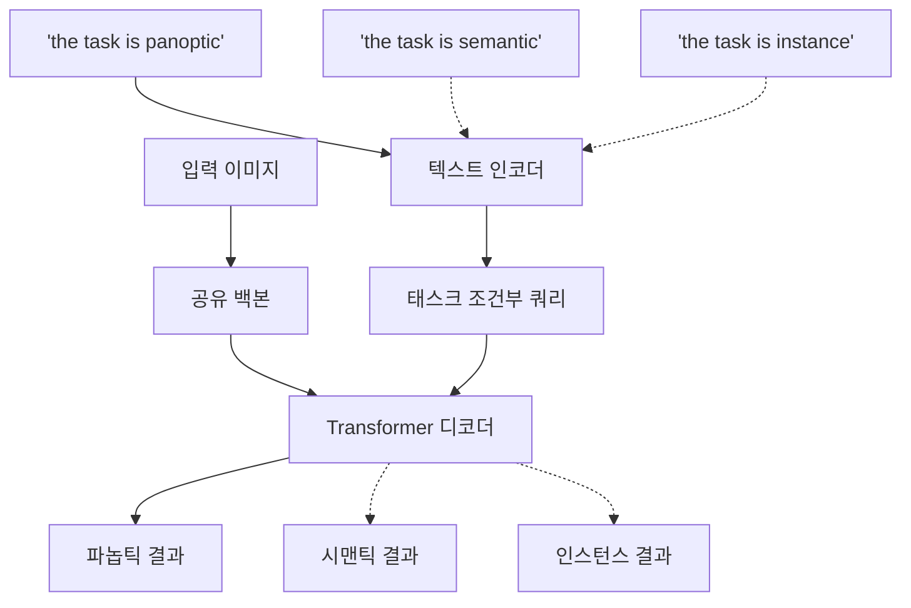
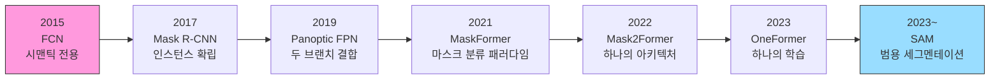

# 파놉틱 세그멘테이션

> 시맨틱과 인스턴스의 통합

## 개요

앞서 우리는 [시맨틱 세그멘테이션](./01-semantic-segmentation.md)(모든 픽셀에 클래스 부여)과 [인스턴스 세그멘테이션](./02-instance-segmentation.md)(개별 객체 구분 + 마스크)을 따로 배웠습니다. 하지만 현실 장면을 완벽히 이해하려면 **두 가지가 모두 필요**하죠. 자율주행차는 도로(stuff)의 영역도 알아야 하고, 그 위의 자동차 3대(thing)도 각각 구분해야 합니다. **파놉틱 세그멘테이션(Panoptic Segmentation)**은 이 두 세계를 하나로 통합합니다.

**선수 지식**: [시맨틱 세그멘테이션](./01-semantic-segmentation.md), [인스턴스 세그멘테이션](./02-instance-segmentation.md)
**학습 목표**:
- Thing과 Stuff의 차이를 이해하고, 파놉틱 세그멘테이션의 필요성을 설명할 수 있다
- Panoptic FPN, Mask2Former, OneFormer의 핵심 아이디어를 이해한다
- 세그멘테이션 태스크의 통합 흐름을 파악한다

## 왜 알아야 할까?

시맨틱 세그멘테이션과 인스턴스 세그멘테이션은 각각 **반쪽짜리 이해**만 제공합니다:

| 태스크 | Thing (사물) | Stuff (재료) | 한계 |
|--------|-------------|-------------|------|
| **시맨틱** | 클래스만 구분 (개체 ×) | ✅ 구분 | 같은 클래스 객체 구분 불가 |
| **인스턴스** | ✅ 개체별 구분 | ❌ 무시 | 배경/재료 정보 없음 |
| **파놉틱** | ✅ 개체별 구분 | ✅ 구분 | **완전한 장면 이해** |

파놉틱 세그멘테이션은 이미지의 **모든 픽셀에 대해, 빈틈없이** 라벨을 부여합니다. 자율주행, 로봇 내비게이션, 증강현실 등 **장면 전체를 이해**해야 하는 응용 분야에서 필수적인 기술입니다.

## 핵심 개념

### 1. Thing vs Stuff — 세상을 나누는 두 가지 방법

> 📊 **그림 1**: 파놉틱 세그멘테이션의 출력 구조 — Thing과 Stuff를 동시에 처리




> 💡 **비유**: 방 안을 설명한다고 생각해보세요. "의자 2개, 컵 3개, 고양이 1마리"는 **셀 수 있는 물건(Thing)**입니다. 반면 "바닥은 나무, 벽은 흰색, 천장은 회색"은 **셀 수 없는 재료(Stuff)**입니다. 파놉틱 세그멘테이션은 이 **둘 다** 처리합니다.

컴퓨터 비전에서는 시각적 요소를 두 가지로 구분합니다:

- **Thing (사물)**: 셀 수 있고, 개별 인스턴스가 있는 객체 → 사람, 자동차, 고양이, 의자
- **Stuff (재료)**: 셀 수 없고, 불특정 영역을 차지하는 배경 요소 → 하늘, 도로, 풀밭, 물

**파놉틱 세그멘테이션의 출력**:

이미지의 모든 픽셀 $p$에 대해 $(c_p, z_p)$ 쌍을 부여합니다:
- $c_p$: 해당 픽셀의 **클래스** (도로, 자동차, 사람 등)
- $z_p$: 해당 픽셀이 속한 **인스턴스 ID** (Thing은 고유 ID, Stuff는 동일 ID)

> ⚠️ **흔한 오해**: "파놉틱 = 시맨틱 + 인스턴스를 따로 돌리고 합치면 된다" — 초기에는 실제로 그렇게 했지만, 두 모델의 결과가 충돌하는 문제(같은 픽셀에 다른 라벨)가 발생합니다. 최신 접근법은 **하나의 통합 모델**로 두 태스크를 동시에 처리합니다.

### 2. 파놉틱 세그멘테이션의 탄생

"Panoptic"이라는 단어는 그리스어로 **"모든 것을 보는(seeing everything)"**이라는 뜻입니다. 2019년 Alexander Kirillov(FAIR)가 발표한 논문 "Panoptic Segmentation"에서 공식적으로 정의된 태스크입니다.

이 논문은 그동안 분리되어 연구되던 시맨틱과 인스턴스 세그멘테이션을 **하나의 통합된 태스크**로 정의하고, 새로운 평가 지표인 **PQ(Panoptic Quality)**를 제안했습니다.

**Panoptic Quality (PQ)** — 파놉틱 세그멘테이션의 대표 지표:

$$\text{PQ} = \underbrace{\frac{\sum_{(p,g) \in TP} \text{IoU}(p,g)}{|TP|}}_{\text{SQ (Segmentation Quality)}} \times \underbrace{\frac{|TP|}{|TP| + \frac{1}{2}|FP| + \frac{1}{2}|FN|}}_{\text{RQ (Recognition Quality)}}$$

- **SQ(Segmentation Quality)**: 매칭된 세그먼트의 평균 IoU → 마스크가 얼마나 정확한지
- **RQ(Recognition Quality)**: F1 스코어와 유사 → 세그먼트를 얼마나 잘 찾았는지
- **PQ = SQ × RQ**: 두 품질의 곱

> 💡 **알고 계셨나요?**: "Panoptic Segmentation"이라는 용어를 만든 Alexander Kirillov는 나중에 Meta의 **SAM(Segment Anything Model)** 프로젝트의 핵심 멤버가 됩니다. 세그멘테이션 태스크의 통합에서 시작해, 결국 **범용 세그멘테이션**까지 이어지는 여정인 셈이죠.

### 3. 초기 접근법 — Panoptic FPN

> 📊 **그림 2**: Panoptic FPN의 두 브랜치 구조




초기의 파놉틱 세그멘테이션은 기존 모델을 결합하는 방식이었습니다. **Panoptic FPN(2019)**은 이 접근법의 대표적인 예입니다.

**Panoptic FPN의 구조**:

1. **공유 백본 + FPN**: 하나의 백본(ResNet)과 [FPN(Feature Pyramid Network)](../07-object-detection/02-rcnn-family.md)으로 다중 스케일 특징 추출 — Faster R-CNN에서 배운 그 FPN입니다!
2. **인스턴스 브랜치**: [Mask R-CNN](./02-instance-segmentation.md) 스타일로 Thing 객체 탐지 + 마스크 예측
3. **시맨틱 브랜치**: FPN 특징을 합쳐서 Stuff 영역의 시맨틱 맵 예측
4. **병합 모듈**: 두 브랜치의 결과를 규칙 기반으로 합침

이 방식의 문제점은 **두 브랜치가 독립적**이라 결과가 충돌할 수 있고, 병합 과정에서 휴리스틱이 필요하다는 것이었습니다.

### 4. Mask2Former — 하나의 아키텍처로 모든 세그멘테이션을

> 💡 **비유**: 예전에는 세그멘테이션 종류마다 전문 요리사가 따로 있었습니다 — 시맨틱 셰프, 인스턴스 셰프, 파놉틱 셰프. **Mask2Former**는 **만능 셰프** 한 명이 모든 요리를 다 하는 것과 같습니다. 같은 주방(아키텍처)에서 주문(태스크)에 따라 다른 요리를 만들어냅니다.

2022년 CVPR에서 **Bowen Cheng**(Meta/FAIR)이 발표한 **Mask2Former**는 세그멘테이션 분야의 패러다임을 바꾼 모델입니다. 핵심 아이디어는 "**모든 세그멘테이션을 마스크 분류(Mask Classification)** 문제로 통합하자"는 것입니다.

**마스크 분류란?**

기존 시맨틱 세그멘테이션은 "각 픽셀의 클래스를 예측"했습니다. Mask2Former는 관점을 뒤집어서, "**N개의 마스크 후보를 생성하고, 각 마스크의 클래스를 분류**"합니다.

- 기존: H×W 픽셀 각각에 대해 클래스 예측 → 픽셀 분류
- Mask2Former: N개의 (마스크, 클래스) 쌍을 예측 → 마스크 분류

이 관점의 전환 덕분에 시맨틱, 인스턴스, 파놉틱 세그멘테이션을 **동일한 아키텍처**로 처리할 수 있게 되었습니다.

> 📊 **그림 3**: Mask2Former 아키텍처 — 쿼리 기반 마스크 분류




**Mask2Former의 핵심 구조**:

1. **백본 + 픽셀 디코더**: 다중 스케일 특징 맵 추출 (1/32, 1/16, 1/8)
2. **Transformer 디코더**: **학습 가능한 쿼리(Learnable Queries)** N개가 특징 맵과 교차 어텐션 — [DETR의 Object Query](../07-object-detection/05-detr.md)와 같은 아이디어입니다!
3. **Masked Attention**: 예측된 마스크 영역에만 어텐션을 집중 → 수렴 속도 ↑
4. **출력**: N개의 (마스크 예측 + 클래스 예측) 쌍

**Masked Attention — Mask2Former의 비밀 무기**:

일반적인 Transformer의 교차 어텐션은 이미지의 **모든 위치**에 대해 어텐션을 계산합니다. 하지만 Mask2Former의 Masked Attention은 **이전 레이어에서 예측한 마스크 영역에만** 어텐션을 제한합니다. 마치 돋보기로 관심 영역만 확대해서 보는 것처럼요. 이 덕분에 수렴이 빨라지고 성능도 올라갑니다.

```python
import torch
import torch.nn as nn

class SimpleMaskedAttention(nn.Module):
    """Mask2Former의 Masked Attention 핵심 아이디어 (간소화)"""
    def __init__(self, d_model=256, nhead=8):
        super().__init__()
        self.multihead_attn = nn.MultiheadAttention(d_model, nhead)
        self.norm = nn.LayerNorm(d_model)

    def forward(self, queries, features, prev_mask=None):
        """
        queries: [N, B, D] — N개의 학습 가능한 쿼리
        features: [HW, B, D] — 이미지 특징 (평탄화)
        prev_mask: [B, N, H, W] — 이전 레이어의 마스크 예측 (선택)
        """
        if prev_mask is not None:
            # 마스크를 어텐션 마스크로 변환
            # 마스크가 0인 영역(관심 밖)에 -inf를 넣어 어텐션 차단
            B, N, H, W = prev_mask.shape
            attn_mask = (prev_mask.flatten(2) < 0.5)  # [B, N, HW]
            # 배치와 헤드 차원 확장 (간소화)
            attn_mask = attn_mask.float().masked_fill(attn_mask, float('-inf'))
        else:
            attn_mask = None

        # 마스크가 적용된 교차 어텐션
        attended, _ = self.multihead_attn(
            query=queries, key=features, value=features,
            # 실제 구현에서는 attn_mask를 여기에 전달
        )
        return self.norm(queries + attended)

# 개념적 동작 확인
d_model = 256
model = SimpleMaskedAttention(d_model=d_model)
queries = torch.randn(100, 1, d_model)   # 100개 쿼리
features = torch.randn(1024, 1, d_model)  # 32×32 = 1024 위치의 특징
output = model(queries, features)
print(f"쿼리 입력: {queries.shape}")        # [100, 1, 256]
print(f"어텐션 출력: {output.shape}")       # [100, 1, 256]
```

Mask2Former의 학습에도 [DETR에서 배운 헝가리안 매칭](../07-object-detection/05-detr.md)이 사용됩니다. N개의 예측 마스크와 정답 마스크 사이의 최적 1:1 매칭을 찾아, 중복 없이 깔끔한 세그멘테이션 결과를 만들어내는 거죠.

**Mask2Former의 성능** — 하나의 모델로 3가지 태스크 모두 SOTA:

| 태스크 | 데이터셋 | Mask2Former | 이전 SOTA |
|--------|---------|-------------|----------|
| 파놉틱 | COCO | 57.8 PQ | 55.2 PQ |
| 인스턴스 | COCO | 50.1 AP | 48.9 AP |
| 시맨틱 | ADE20K | 57.7 mIoU | 56.3 mIoU |

### 5. OneFormer — 하나의 모델, 하나의 학습으로 모든 것을

> 📊 **그림 4**: OneFormer의 태스크 조건부 학습 — 텍스트 프롬프트로 태스크 전환




Mask2Former가 같은 아키텍처를 사용하더라도, 각 태스크별로 **따로 학습**해야 했습니다. 2023년 CVPR에서 발표된 **OneFormer**는 이 마지막 장벽마저 허물었습니다.

**OneFormer의 핵심 아이디어**:

- **태스크 조건부 학습(Task-Conditioned Joint Training)**: "the task is {panoptic/semantic/instance}"라는 텍스트 프롬프트를 모델에 입력하여, **어떤 태스크를 수행할지** 모델에게 알려줌
- **하나의 데이터셋, 하나의 학습**: 파놉틱 어노테이션에서 시맨틱/인스턴스 라벨을 자동으로 유도
- **쿼리-텍스트 대조 손실**: 쿼리와 텍스트 간의 대조 학습으로 태스크/클래스 간 구분 강화

결과적으로 OneFormer는 **단일 모델, 단일 학습**으로 Mask2Former(태스크별로 따로 학습)를 능가하는 성능을 달성했습니다.

> 🔥 **실무 팁**: 새 프로젝트에서 세그멘테이션 모델을 선택해야 한다면, **Mask2Former 또는 OneFormer**를 기본으로 고려하세요. HuggingFace Transformers에서 사전학습 모델을 바로 사용할 수 있고, 시맨틱/인스턴스/파놉틱 모든 태스크에 대응 가능합니다.

## 실습: Mask2Former로 파놉틱 세그멘테이션

HuggingFace의 Transformers 라이브러리로 Mask2Former를 사용해봅시다.

```python
# pip install transformers 필요
from transformers import Mask2FormerForUniversalSegmentation, Mask2FormerImageProcessor
import torch

# 사전학습된 Mask2Former 로드 (COCO 파놉틱)
processor = Mask2FormerImageProcessor.from_pretrained(
    "facebook/mask2former-swin-base-coco-panoptic"
)
model = Mask2FormerForUniversalSegmentation.from_pretrained(
    "facebook/mask2former-swin-base-coco-panoptic"
)
model.eval()

# 임의 이미지로 추론 (실제로는 PIL Image 사용)
from PIL import Image
import numpy as np

# 더미 이미지 생성 (실제 사용 시 Image.open("photo.jpg"))
dummy_image = Image.fromarray(np.random.randint(0, 255, (480, 640, 3), dtype=np.uint8))

# 전처리 + 추론
inputs = processor(images=dummy_image, return_tensors="pt")
with torch.no_grad():
    outputs = model(**inputs)

# 파놉틱 세그멘테이션 결과 후처리
result = processor.post_process_panoptic_segmentation(
    outputs, target_sizes=[(480, 640)]
)[0]

# 결과 구조
print(f"세그멘테이션 맵 크기: {result['segmentation'].shape}")
print(f"검출된 세그먼트 수: {len(result['segments_info'])}")

# 각 세그먼트 정보 확인
for seg in result['segments_info'][:5]:
    print(f"  ID: {seg['id']}, 클래스: {seg['label_id']}, "
          f"Thing: {seg['isthing']}, 점수: {seg.get('score', 'N/A')}")
```

## 더 깊이 알아보기

### 세그멘테이션 태스크의 통합 역사

> 📊 **그림 5**: 세그멘테이션 태스크의 통합 흐름 — 분리에서 범용화까지




세그멘테이션 분야는 흥미로운 통합의 역사를 가지고 있습니다:

- **2015**: FCN(시맨틱), Mask R-CNN 이전(인스턴스는 아직 별개)
- **2017**: Mask R-CNN 등장 → 인스턴스 세그멘테이션 확립
- **2019**: 파놉틱 세그멘테이션 정의 → "세 가지를 합쳐야 한다" 인식
- **2020**: [DETR](../07-object-detection/05-detr.md) 등장 → Transformer + 집합 예측의 가능성 입증
- **2021**: MaskFormer → DETR의 쿼리 기반 접근을 세그멘테이션에 적용, "모든 세그멘테이션은 마스크 분류다" 패러다임 전환
- **2022**: Mask2Former → 하나의 아키텍처로 세 태스크 모두 SOTA
- **2023**: OneFormer → 하나의 학습으로 세 태스크 모두 해결
- **2023~**: SAM → 태스크 자체를 초월하는 범용 세그멘테이션

결국 분리 → 결합 → 통합 → 범용화의 흐름이 명확하게 보이죠. 이런 **태스크 통합**의 트렌드는 컴퓨터 비전 전반에서 계속되고 있습니다.

## 흔한 오해와 팁

> ⚠️ **흔한 오해**: "파놉틱 세그멘테이션은 항상 시맨틱 + 인스턴스보다 좋다" — 꼭 그렇진 않습니다. 만약 배경을 구분할 필요가 없고 **특정 객체만 찾으면** 되는 태스크라면, Mask R-CNN 같은 인스턴스 전용 모델이 더 효율적일 수 있습니다. 태스크에 맞는 모델을 선택하세요.

> 💡 **알고 계셨나요?**: OneFormer라는 이름은 영화 반지의 제왕 "One Ring to Rule Them All"에서 영감을 받아, **"One Transformer to Rule Universal Image Segmentation"**이라는 부제를 달았습니다. 하나의 모델로 모든 세그멘테이션을 지배하겠다는 야심찬 이름이죠!

> 🔥 **실무 팁**: 파놉틱 세그멘테이션 데이터 준비 시, **파놉틱 어노테이션 하나만 있으면** 시맨틱과 인스턴스 라벨을 자동으로 유도할 수 있습니다. 파놉틱 어노테이션은 가장 풍부한 정보를 담고 있어서, 라벨링 작업을 한 번만 하면 세 가지 태스크에 모두 활용 가능합니다.

## 핵심 정리

| 개념 | 설명 |
|------|------|
| 파놉틱 세그멘테이션 | Thing(개별 객체) + Stuff(배경 영역) 모두를 픽셀 단위로 분할 |
| Thing vs Stuff | Thing: 셀 수 있는 객체, Stuff: 불특정 영역 (하늘, 도로 등) |
| PQ (Panoptic Quality) | SQ(세그먼트 품질) × RQ(인식 품질) — 파놉틱 전용 평가 지표 |
| Mask2Former | Masked Attention + 마스크 분류로 3가지 태스크 통합 |
| OneFormer | 태스크 프롬프트로 단일 모델/단일 학습에서 모든 세그멘테이션 처리 |
| 마스크 분류 | 픽셀 분류 대신 N개의 마스크를 생성하고 분류하는 패러다임 |

## 다음 섹션 미리보기

지금까지 배운 모든 세그멘테이션 모델에는 공통된 한계가 있습니다 — **학습 데이터에 있는 클래스만** 세그멘테이션할 수 있다는 점이죠. 학습 때 "기린"을 본 적이 없다면 기린을 분할할 수 없습니다. 다음 섹션 [Segment Anything Model](./04-sam.md)에서는 이 한계를 깨뜨린 Meta의 혁명적인 모델 — **프롬프트 하나로 세상의 모든 것을 분할**하는 SAM을 살펴봅니다.

## 참고 자료

- [Panoptic Segmentation (Kirillov et al., 2019)](https://arxiv.org/abs/1801.00868) - 파놉틱 세그멘테이션을 공식 정의한 논문
- [Mask2Former (Cheng et al., 2022)](https://arxiv.org/abs/2112.01527) - CVPR 2022, 통합 세그멘테이션 아키텍처
- [OneFormer (Jain et al., 2023)](https://arxiv.org/abs/2211.06220) - CVPR 2023, 단일 모델로 모든 세그멘테이션
- [HuggingFace Mask2Former 문서](https://huggingface.co/docs/transformers/en/model_doc/mask2former) - 사전학습 모델 사용 가이드
- [What is Mask2Former? (Roboflow)](https://blog.roboflow.com/what-is-mask2former/) - Mask2Former 시각적 해설
