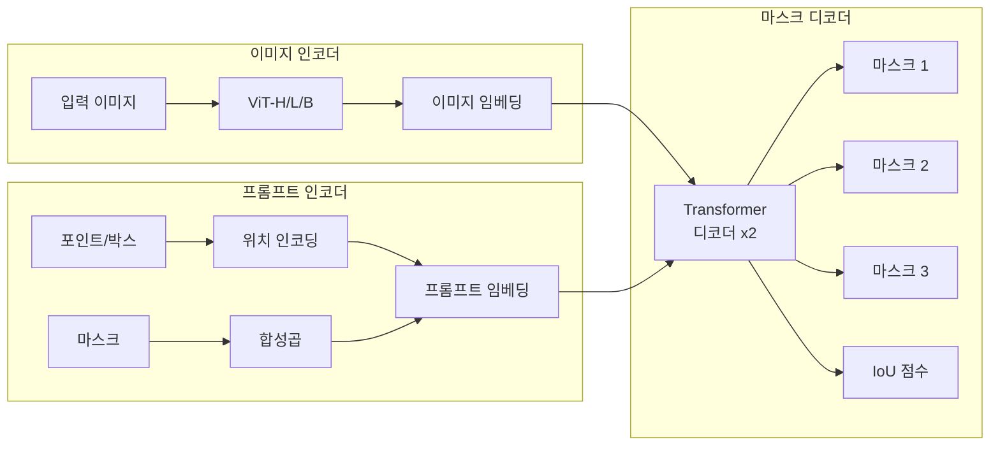
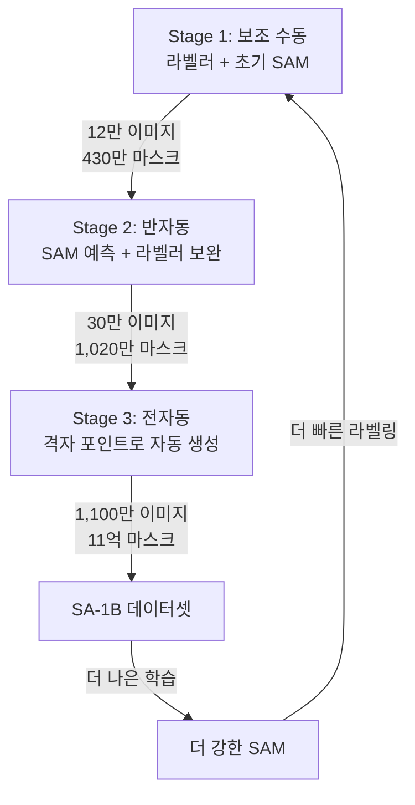
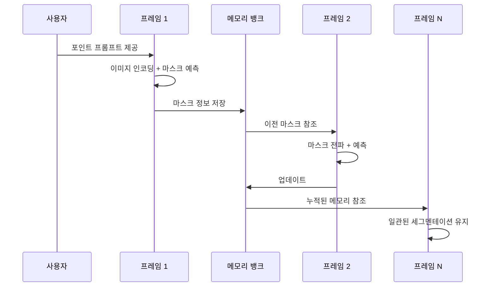
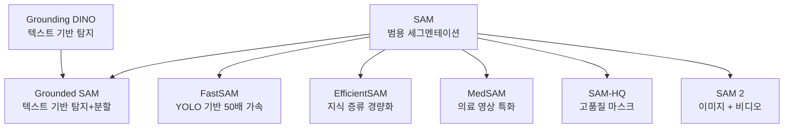

# Segment Anything Model

> 프롬프트 기반 범용 분할 모델

## 개요

지금까지 배운 세그멘테이션 모델들은 모두 **정해진 클래스에 대해서만** 동작했습니다. Pascal VOC는 21개, COCO는 133개 — 학습 때 본 적 없는 객체는 분할할 수 없었죠. 2023년 Meta AI가 공개한 **SAM(Segment Anything Model)**은 이 패러다임을 완전히 뒤집었습니다. 점 하나, 박스 하나, 텍스트 한 줄 — **어떤 프롬프트든** 주면, 세상의 **무엇이든** 분할할 수 있는 **파운데이션 모델**입니다.

**선수 지식**: [시맨틱 세그멘테이션](./01-semantic-segmentation.md), [인스턴스 세그멘테이션](./02-instance-segmentation.md)
**학습 목표**:
- SAM의 아키텍처(Image Encoder, Prompt Encoder, Mask Decoder)를 이해한다
- 프롬프트 기반 세그멘테이션의 작동 원리를 설명할 수 있다
- SAM과 SAM 2의 차이를 이해하고 실제로 사용할 수 있다

## 왜 알아야 할까?

SAM의 등장은 세그멘테이션 분야에서 **GPT 모멘트**라고 불렸습니다. NLP에서 GPT가 "어떤 텍스트 태스크든 프롬프트로 해결"하는 패러다임을 열었듯이, SAM은 "어떤 세그멘테이션 태스크든 프롬프트로 해결"하는 시대를 열었습니다.

**SAM 이전과 이후의 차이**:

| 항목 | SAM 이전 | SAM 이후 |
|------|---------|---------|
| 클래스 | 학습 데이터의 클래스만 | **어떤 객체든** |
| 프롬프트 | 없음 (자동) | 점, 박스, 마스크, 텍스트 |
| 학습 데이터 | 수만~수십만 이미지 | **1,100만 이미지, 11억 마스크** |
| 활용 | 태스크별 모델 필요 | **하나의 모델로 범용 사용** |

SAM은 연구자뿐 아니라, 데이터 라벨링 자동화, 의료 영상 분석, 증강현실, 사진 편집 등 **실무 전반에 즉시 영향**을 미친 모델입니다.

## 핵심 개념

### 1. SAM이란? — "여기 이것 좀 분할해줘"

> 💡 **비유**: 기존 세그멘테이션 모델이 **전문 통역사**(영어→한국어만 가능)였다면, SAM은 **만능 통역사**(어떤 언어든, 어떤 주제든, 지시만 하면 통역)입니다. "이 점이 가리키는 물체를 분할해줘", "이 박스 안의 것을 분할해줘" — 프롬프트만 주면 어떤 객체든 분할합니다.

SAM의 3가지 혁신:

1. **프롬프트 기반(Promptable)**: 점, 박스, 마스크, 텍스트 등 다양한 프롬프트로 분할 대상 지정
2. **제로샷 전이(Zero-shot Transfer)**: 학습 때 본 적 없는 객체도 분할 가능
3. **대규모 데이터(SA-1B)**: 1,100만 이미지에서 11억 개 마스크로 학습

**프롬프트 유형**:

| 프롬프트 | 설명 | 예시 |
|---------|------|------|
| **포인트** | 분할할 객체 위의 점 (전경/배경) | 고양이 위에 점 하나 클릭 |
| **바운딩 박스** | 분할 영역을 포함하는 사각형 — [객체 탐지](../07-object-detection/01-detection-basics.md)의 그 박스! | 객체를 대략 감싸는 박스 |
| **마스크** | 대략적인 마스크 (이전 결과 정제용) | 이전 예측을 입력으로 재사용 |
| **텍스트** | 분할 대상 설명 (SAM 2에서 개선) | "빨간 자동차" |

### 2. SAM의 아키텍처 — 세 부분의 협업

> 📊 **그림 1**: SAM의 3대 구성 요소와 처리 흐름




SAM은 세 개의 구성 요소로 이루어져 있습니다:

**1) Image Encoder (이미지 인코더)**

- **ViT(Vision Transformer)** 기반 — ViT-H(가장 큰 버전), ViT-L, ViT-B 제공
- 이미지를 한 번만 인코딩 → **임베딩 재사용** (같은 이미지에 여러 프롬프트 가능)
- 가장 계산이 무거운 부분이지만, **한 번만** 실행하면 됨

**2) Prompt Encoder (프롬프트 인코더)**

- 포인트, 박스 → 위치 인코딩(Positional Encoding) + 학습된 임베딩
- 마스크 → 합성곱으로 다운샘플링
- 텍스트 → CLIP 텍스트 인코더 활용 (선택적)
- 매우 가벼운 모듈 (실시간으로 다양한 프롬프트 처리 가능)

**3) Mask Decoder (마스크 디코더)**

- 변형된 **Transformer 디코더** — [DETR](../07-object-detection/05-detr.md)과 유사한 교차 어텐션 구조이지만, 단 2개 레이어로 매우 가벼움!
- 이미지 임베딩 + 프롬프트 임베딩을 받아 **마스크 3개** 동시 예측
- 왜 3개? → 프롬프트가 모호할 때 대비 (예: 점 하나가 부분/전체/더 큰 객체를 가리킬 수 있음)
- 각 마스크에 대한 **신뢰도 점수**도 함께 출력

> ⚠️ **흔한 오해**: "SAM은 객체가 무엇인지(클래스)도 알려준다" — 아닙니다! SAM은 **마스크만** 예측합니다. "이것은 고양이"라는 분류는 하지 않습니다. 클래스 정보가 필요하면 SAM의 마스크에 별도의 분류 모델을 결합해야 합니다. 최근의 Grounded SAM은 텍스트 기반 탐지 모델(Grounding DINO)과 SAM을 결합하여 이 문제를 해결합니다.

```python
import torch
import torch.nn as nn

class SimpleSAMDecoder(nn.Module):
    """SAM 마스크 디코더의 핵심 아이디어 (간소화)"""
    def __init__(self, d_model=256, num_masks=3):
        super().__init__()
        self.num_masks = num_masks

        # 마스크 토큰: 출력할 마스크 수만큼의 학습 가능한 토큰
        self.mask_tokens = nn.Embedding(num_masks, d_model)

        # Transformer 디코더 레이어 (SAM은 단 2개!)
        decoder_layer = nn.TransformerDecoderLayer(d_model, nhead=8, batch_first=True)
        self.transformer = nn.TransformerDecoder(decoder_layer, num_layers=2)

        # 마스크 예측 MLP
        self.mask_mlp = nn.Sequential(
            nn.Linear(d_model, d_model),
            nn.GELU(),
            nn.Linear(d_model, d_model // 4),  # 임베딩 차원 축소
        )
        # IoU 예측 헤드 (각 마스크의 품질 점수)
        self.iou_head = nn.Sequential(
            nn.Linear(d_model, d_model),
            nn.GELU(),
            nn.Linear(d_model, num_masks),
        )

    def forward(self, image_embedding, prompt_embedding):
        """
        image_embedding: [B, HW, D] — 이미지 인코더 출력
        prompt_embedding: [B, N_prompt, D] — 프롬프트 인코더 출력
        """
        B = image_embedding.shape[0]

        # 마스크 토큰을 프롬프트에 추가
        mask_tokens = self.mask_tokens.weight.unsqueeze(0).expand(B, -1, -1)
        tokens = torch.cat([mask_tokens, prompt_embedding], dim=1)

        # Transformer 디코더로 이미지-프롬프트 상호작용
        decoded = self.transformer(tokens, image_embedding)

        # 마스크 토큰 부분만 추출
        mask_embeds = decoded[:, :self.num_masks]  # [B, num_masks, D]

        # IoU 점수 예측 (각 마스크의 품질)
        iou_scores = self.iou_head(mask_embeds)  # [B, num_masks]

        return mask_embeds, iou_scores

# 개념적 동작 확인
decoder = SimpleSAMDecoder(d_model=256, num_masks=3)
img_emb = torch.randn(1, 64*64, 256)   # 64×64 이미지 임베딩
prompt_emb = torch.randn(1, 2, 256)     # 2개 포인트 프롬프트
mask_embeds, iou_scores = decoder(img_emb, prompt_emb)
print(f"마스크 임베딩: {mask_embeds.shape}")  # [1, 3, 256]
print(f"IoU 점수: {iou_scores.shape}")        # [1, 3] — 3개 마스크의 품질 점수
```

### 3. SA-1B 데이터 — SAM을 만든 11억 개의 마스크

SAM의 성능을 가능하게 한 것은 아키텍처만이 아닙니다. **SA-1B(Segment Anything 1-Billion)** 데이터셋이 핵심이었습니다.

**데이터 엔진(Data Engine) — 3단계 부트스트래핑**:

> 📊 **그림 2**: SA-1B 데이터 엔진의 3단계 부트스트래핑 과정




1. **Stage 1 — 보조 수동 (Assisted Manual)**: 전문 라벨러가 초기 SAM의 도움을 받아 수동 라벨링. 12만 이미지에서 430만 마스크 생성. 라벨러가 한 이미지에서 30초 이상 걸리면 다음으로 넘어가는 규칙 적용
2. **Stage 2 — 반자동 (Semi-Automatic)**: SAM이 먼저 예측한 뒤, 라벨러는 놓친 객체만 추가. 30만 이미지에서 1,020만 마스크 생성
3. **Stage 3 — 전자동 (Fully Automatic)**: SAM이 정규 격자의 포인트 프롬프트로 자동 생성. 1,100만 이미지에서 **11억 마스크** 생성

이 과정에서 마스크당 어노테이션 시간이 **34초 → 14초**로 줄었고, 이미지당 평균 마스크 수는 **20개 → 100개**로 늘어났습니다. SAM이 발전할수록 데이터가 빨라지고, 데이터가 늘수록 SAM이 발전하는 **선순환 구조**입니다.

> 💡 **알고 계셨나요?**: SA-1B는 발표 당시 기존 최대 오픈소스 데이터셋(OpenImages v5)보다 **6배** 큰 규모였습니다. 이미지당 평균 약 100개의 마스크가 포함되어 있으며, Meta는 이를 Apache 2.0 라이선스로 공개했습니다. 또한 다양한 문화권, 국가, 대륙의 이미지를 포함하여 편향을 줄이려는 노력도 기울였습니다.

### 4. SAM 2 — 이미지에서 비디오로

2024년 Meta는 SAM의 후속작인 **SAM 2**를 발표하며, 세그멘테이션의 영역을 **비디오**로 확장했습니다.

**SAM 2의 핵심 차이**:

| 항목 | SAM (2023) | SAM 2 (2024) |
|------|-----------|-------------|
| 대상 | 이미지 | **이미지 + 비디오** |
| 구조 | ViT + Prompt Enc + Mask Dec | + **메모리 어텐션 모듈** |
| 비디오 | 프레임별 독립 처리 | **시간축 일관성 유지** |
| 데이터 | SA-1B (11억 마스크) | + SA-V (5.1만 비디오, 3,550만 마스크) |
| 이미지 성능 | 기준선 | **6배 빠르면서 더 정확** |

SAM 2가 비디오에서 일관된 세그멘테이션을 유지하는 비결은 **메모리 뱅크(Memory Bank)**입니다. 이전 프레임에서 예측한 마스크 정보를 저장해두고, 현재 프레임 처리 시 참조합니다. 마치 영화를 볼 때 "아까 그 캐릭터"를 기억하며 추적하는 것과 같죠.

> 📊 **그림 3**: SAM 2의 비디오 세그멘테이션 — 메모리 뱅크 메커니즘




```python
# SAM 2 사용 예시 (개념적 코드)
# pip install sam2 필요
# 실제 사용 시에는 체크포인트 다운로드 필요

# === 이미지 모드 (SAM과 동일) ===
# from sam2.build_sam import build_sam2
# from sam2.sam2_image_predictor import SAM2ImagePredictor
#
# sam2_model = build_sam2("sam2_hiera_large.yaml", "sam2_hiera_large.pt")
# predictor = SAM2ImagePredictor(sam2_model)
#
# predictor.set_image(image)  # 이미지 인코딩 (한 번만)
#
# # 포인트 프롬프트로 세그멘테이션
# masks, scores, _ = predictor.predict(
#     point_coords=np.array([[500, 375]]),   # 클릭한 점 좌표
#     point_labels=np.array([1]),              # 1=전경, 0=배경
#     multimask_output=True                    # 3개 마스크 후보 반환
# )
# print(f"마스크 3개: {masks.shape}")           # [3, H, W]
# print(f"신뢰도: {scores}")                     # 각 마스크의 품질 점수

# === 비디오 모드 (SAM 2의 새 기능) ===
# from sam2.sam2_video_predictor import SAM2VideoPredictor
#
# video_predictor = SAM2VideoPredictor(sam2_model)
#
# # 비디오 초기화
# state = video_predictor.init_state(video_path="video.mp4")
#
# # 첫 프레임에서 프롬프트 제공
# video_predictor.add_new_points(
#     state, frame_idx=0,
#     obj_id=1,                                 # 추적할 객체 ID
#     points=np.array([[500, 375]]),
#     labels=np.array([1])
# )
#
# # 전체 비디오에 대해 세그멘테이션 전파
# for frame_idx, masks in video_predictor.propagate_in_video(state):
#     print(f"프레임 {frame_idx}: 마스크 {masks[1].shape}")
```

### 5. SAM 생태계의 확장

SAM의 공개 이후 다양한 파생 프로젝트들이 등장했습니다:

> 📊 **그림 4**: SAM 생태계 — 파생 프로젝트 관계도




- **Grounded SAM**: [DETR 계열](../07-object-detection/05-detr.md)인 Grounding DINO(텍스트 기반 탐지) + SAM → "빨간 자동차"라고 말하면 탐지+분할을 한 번에
- **FastSAM**: YOLO 기반으로 SAM을 50배 빠르게 근사
- **EfficientSAM**: 지식 증류(Knowledge Distillation)로 SAM을 경량화
- **MedSAM**: 의료 영상 특화 SAM — 100만 장 이상의 의료 이미지로 파인 튜닝
- **SAM-HQ**: 고품질 마스크 생성 — 복잡한 경계에서의 정확도 개선

> 🔥 **실무 팁**: 데이터 라벨링에 SAM을 활용하면 **라벨링 시간을 5~10배 단축**할 수 있습니다. Label Studio, CVAT, Roboflow 등 주요 라벨링 도구들이 이미 SAM을 내장하고 있으니, 새 프로젝트를 시작할 때 꼭 활용해보세요.

## 실습: SAM으로 인터랙티브 세그멘테이션

Hugging Face의 transformers로 SAM을 간단히 사용해봅시다.

```python
# pip install transformers 필요
from transformers import SamModel, SamProcessor
import torch
import numpy as np

# SAM 모델 로드 (ViT-Base — 가장 가벼운 버전)
processor = SamProcessor.from_pretrained("facebook/sam-vit-base")
model = SamModel.from_pretrained("facebook/sam-vit-base")
model.eval()

# 더미 이미지 (실제로는 PIL Image 사용)
from PIL import Image
dummy_image = Image.fromarray(
    np.random.randint(0, 255, (480, 640, 3), dtype=np.uint8)
)

# === 포인트 프롬프트로 세그멘테이션 ===
input_points = [[[320, 240]]]  # 이미지 중앙 점 하나
inputs = processor(
    dummy_image,
    input_points=input_points,
    return_tensors="pt"
)

with torch.no_grad():
    outputs = model(**inputs)

# 마스크 후처리
masks = processor.image_processor.post_process_masks(
    outputs.pred_masks,
    inputs["original_sizes"],
    inputs["reshaped_input_sizes"]
)

# 결과 확인
pred_masks = masks[0]  # 첫 번째 이미지의 마스크
print(f"예측 마스크: {pred_masks.shape}")  # [1, 3, H, W] — 3개 후보
iou_scores = outputs.iou_scores[0, 0]
print(f"IoU 점수: {iou_scores.tolist()}")   # 각 마스크의 품질 점수

# 가장 좋은 마스크 선택
best_mask_idx = iou_scores.argmax().item()
best_mask = pred_masks[0, best_mask_idx]
print(f"최적 마스크 (idx={best_mask_idx}): {best_mask.shape}")  # [H, W]

# === 박스 프롬프트로 세그멘테이션 ===
input_boxes = [[[100, 100, 400, 350]]]  # [x1, y1, x2, y2]
inputs = processor(
    dummy_image,
    input_boxes=input_boxes,
    return_tensors="pt"
)
with torch.no_grad():
    outputs = model(**inputs)
print(f"박스 프롬프트 마스크: {outputs.pred_masks.shape}")
```

## 더 깊이 알아보기

### SAM의 탄생 배경

SAM 프로젝트의 핵심 인물 중 한 명인 Alexander Kirillov는 앞서 [파놉틱 세그멘테이션](./03-panoptic-segmentation.md)에서 소개한 "Panoptic Segmentation" 논문의 1저자이기도 합니다. 파놉틱 세그멘테이션으로 태스크를 통합한 후, **"클래스에 구애받지 않는 범용 세그멘테이션은 가능한가?"**라는 질문에서 SAM이 시작되었습니다.

NLP에서 GPT-3가 "적은 예시만으로 다양한 태스크를 수행"하는 모습을 보고, 비전에서도 **프롬프트 기반의 범용 모델**이 가능하리라는 직관에서 출발했다고 합니다. 이것이 바로 "Segment Anything"이라는 이름의 유래입니다 — 말 그대로 **무엇이든 분할**하겠다는 야심찬 목표죠.

### Ambiguity-Aware 디자인

SAM이 하나의 프롬프트에 대해 3개의 마스크를 출력하는 이유는 **모호성(Ambiguity)** 때문입니다. 예를 들어 셔츠 위의 로고를 점으로 찍으면, 사용자가 원하는 것이 (1) 로고만인지, (2) 셔츠 전체인지, (3) 그 셔츠를 입은 사람 전체인지 알 수 없습니다. SAM은 이 세 가지 수준의 마스크를 모두 제안하고, IoU 점수로 각각의 품질을 알려줍니다.

## 흔한 오해와 팁

> ⚠️ **흔한 오해**: "SAM이 있으면 다른 세그멘테이션 모델은 필요 없다" — SAM은 **클래스 라벨을 예측하지 않습니다**. "여기에 무언가가 있다"는 알지만 "이것이 고양이다"라고는 말하지 못합니다. 시맨틱 레이블이 필요한 자율주행이나 의료 진단에서는 여전히 전용 모델이 필요합니다.

> 🔥 **실무 팁**: SAM을 API로 빠르게 써보고 싶다면, Meta의 [SAM 2 데모 페이지](https://sam2.metademolab.com/)에서 이미지/비디오를 업로드해 바로 테스트할 수 있습니다. 로컬에서 사용할 때는 `sam2` 패키지를 설치하고, GPU 메모리가 부족하면 ViT-B 또는 ViT-S(SAM 2) 모델을 선택하세요.

> 💡 **알고 계셨나요?**: SAM의 이미지 인코더(ViT-H)는 한 번 실행에 ~0.15초가 걸리지만, 프롬프트 인코더 + 마스크 디코더는 **~0.006초**(약 6ms)밖에 걸리지 않습니다. 이미지를 한 번 인코딩하면 수백 개의 프롬프트에 대해 실시간으로 응답할 수 있다는 뜻입니다. 인터랙티브 라벨링 도구에서 SAM이 빠르게 느껴지는 이유가 바로 이 설계 덕분입니다.

## 핵심 정리

| 개념 | 설명 |
|------|------|
| SAM | 프롬프트 기반 범용 세그멘테이션 파운데이션 모델 (Meta, 2023) |
| 프롬프트 | 포인트, 박스, 마스크, 텍스트 — 분할 대상을 지정하는 방식 |
| Image Encoder | ViT 기반, 이미지를 한 번만 인코딩 (재사용 가능) |
| Mask Decoder | 가벼운 Transformer 디코더, 3개 마스크 + IoU 점수 출력 |
| SA-1B | 1,100만 이미지, 11억 마스크 — 3단계 데이터 엔진으로 구축 |
| SAM 2 | SAM의 비디오 확장 — 메모리 뱅크로 시간적 일관성 유지 |
| Grounded SAM | 텍스트 기반 탐지(Grounding DINO) + SAM = 텍스트로 세그멘테이션 |

## 다음 섹션 미리보기

Chapter 08에서 세그멘테이션의 모든 스펙트럼 — 시맨틱, 인스턴스, 파놉틱, 그리고 범용 세그멘테이션까지 살펴보았습니다. 이 모든 발전의 배경에는 **Transformer 아키텍처**가 있었죠 (SAM, Mask2Former, OneFormer 모두 Transformer 기반!). 다음 챕터 [Vision Transformer](../09-vision-transformer/01-attention-mechanism.md)에서는 이 혁명적인 아키텍처의 **기초부터** 차근차근 배워봅니다.

## 참고 자료

- [Segment Anything (Kirillov et al., 2023)](https://arxiv.org/abs/2304.02643) - SAM 원본 논문
- [SAM 2: Segment Anything in Images and Videos (Ravi et al., 2024)](https://arxiv.org/abs/2408.00714) - SAM 2 논문
- [Meta SAM 2 공식 GitHub](https://github.com/facebookresearch/sam2) - 코드 및 모델 체크포인트
- [HuggingFace SAM 문서](https://huggingface.co/docs/transformers/en/model_doc/sam) - Transformers 라이브러리 통합
- [Grounded SAM 2 (IDEA-Research)](https://github.com/IDEA-Research/Grounded-SAM-2) - 텍스트 기반 세그멘테이션 파이프라인
