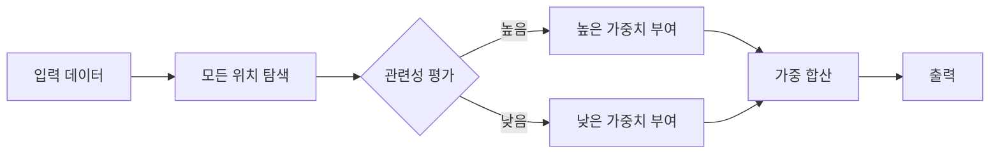
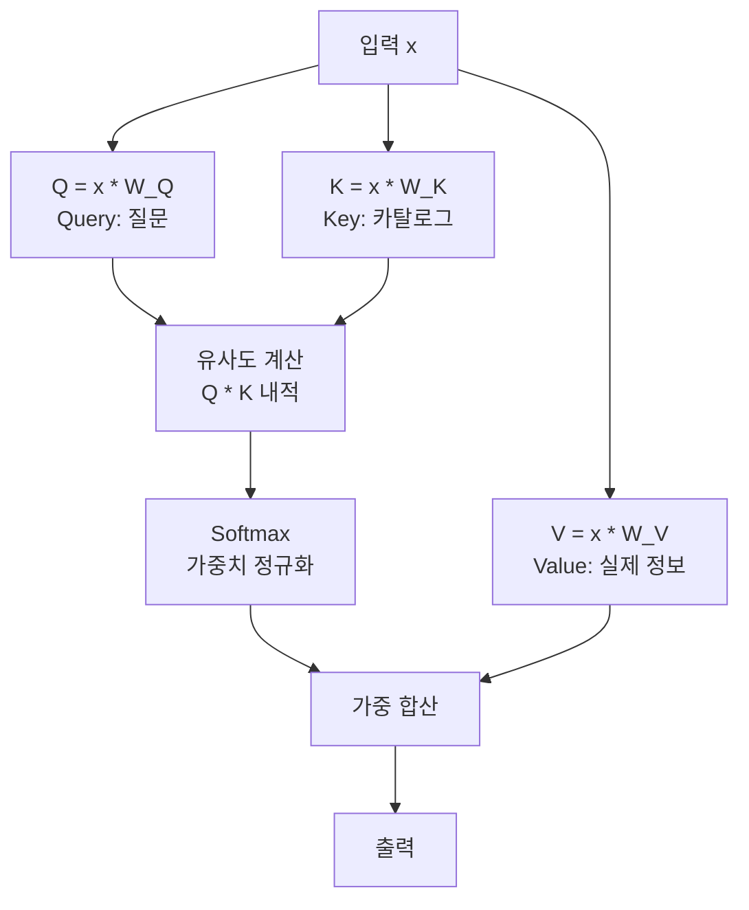
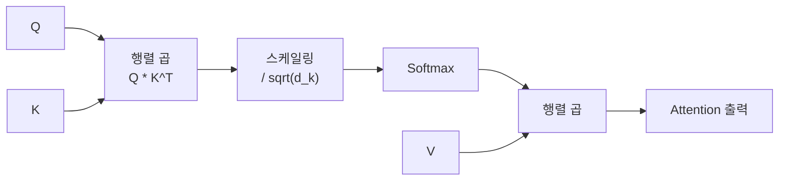
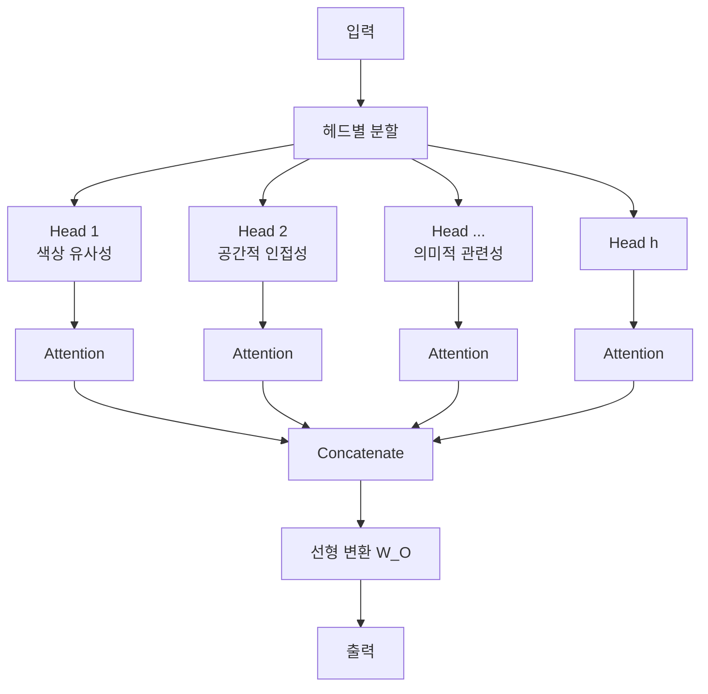
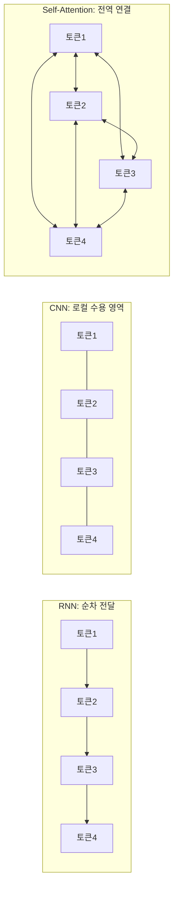

# 어텐션 메커니즘

> Self-Attention과 Multi-Head Attention

## 개요

이미지를 이해할 때, 우리 눈은 모든 픽셀을 균등하게 보지 않습니다. 중요한 부분에 시선이 집중되죠. 이 섹션에서는 딥러닝 모델이 "어디에 집중할지"를 스스로 학습하는 **어텐션 메커니즘(Attention Mechanism)**을 배웁니다. 특히 Transformer의 핵심인 **Self-Attention**과 **Multi-Head Attention**을 비유부터 수식, 코드까지 완전히 이해해 봅시다.

**선수 지식**: [CNN 핵심 개념](../04-cnn-fundamentals/01-convolution.md)에서 배운 합성곱 연산, [배치 정규화](../04-cnn-fundamentals/03-batch-normalization.md)에서 배운 LayerNorm 개념
**학습 목표**:
- 어텐션이 무엇이고 왜 필요한지 직관적으로 이해하기
- Query, Key, Value의 역할을 비유로 완벽히 파악하기
- Scaled Dot-Product Attention의 수식과 코드 구현
- Multi-Head Attention이 왜 "여러 개의 눈"인지 이해하기

## 왜 알아야 할까?

[CNN 아키텍처](../05-cnn-architectures/01-lenet-alexnet.md)에서 배웠듯이, CNN은 이미지 처리의 왕좌를 오랫동안 지켜왔습니다. 그런데 CNN에는 근본적인 한계가 있었어요. **로컬 수용 영역(local receptive field)**이라는 특성 때문에, 이미지의 먼 곳에 있는 정보를 한 번에 연결하기 어려웠거든요.

예를 들어볼까요? 사진 속에서 하늘에 있는 비행기와 땅 위의 그림자를 동시에 파악하려면, CNN은 여러 레이어를 거쳐야 합니다. 하지만 어텐션 메커니즘은 **단 한 번의 연산으로** 이미지의 어느 위치든 연결할 수 있죠. 이것이 바로 2020년대에 Vision Transformer가 CNN을 대체하기 시작한 핵심 이유입니다.

오늘날 ChatGPT, DALL-E, Stable Diffusion, Sora 등 우리가 아는 거의 모든 최신 AI의 심장에는 어텐션 메커니즘이 뛰고 있습니다. 컴퓨터 비전만 봐도, [DETR](../07-object-detection/05-detr.md)은 어텐션으로 NMS 없이 객체를 탐지하고, [Mask2Former](../08-segmentation/03-panoptic-segmentation.md)는 어텐션으로 모든 세그멘테이션 태스크를 통합했으며, [SAM](../08-segmentation/04-sam.md)은 어텐션으로 세상의 모든 것을 분할합니다.

## 핵심 개념

### 개념 1: 어텐션이란? — "시험 문제의 형광펜"

> 📊 **그림 1**: 어텐션의 핵심 아이디어 — 중요한 부분에 집중하기




> 💡 **비유**: 시험 공부를 할 때를 떠올려 보세요. 교과서의 모든 문장을 똑같은 비중으로 읽지 않죠? 중요한 부분에 **형광펜**을 치고, 그 부분에 집중합니다. 어텐션도 똑같습니다. 입력 데이터의 모든 부분 중에서 **지금 중요한 부분에 더 높은 가중치**를 부여하는 메커니즘이에요.

어텐션(Attention)의 핵심 아이디어는 단순합니다:

- **입력의 모든 위치를 살펴보되**
- **현재 작업에 관련된 부분에 더 많은 "주의"를 기울이고**
- **관련 없는 부분은 무시한다**

사실 어텐션 개념은 Transformer보다 먼저 등장했습니다. 2014년 Bahdanau가 기계 번역에서 처음 제안했는데요, 긴 문장을 번역할 때 모든 단어를 하나의 벡터로 압축하면 정보가 손실되니, 원문의 각 단어에 "주의"를 기울이자는 아이디어였죠.

### 개념 2: Query, Key, Value — "도서관 검색 시스템"

> 💡 **비유**: 도서관에서 책을 찾는 과정을 상상해 보세요.
> - **Query(질문)**: 당신이 사서에게 하는 질문 — "우주에 관한 책 찾아주세요"
> - **Key(카탈로그)**: 도서관의 카탈로그에 적힌 각 책의 키워드 — "물리학", "우주론", "요리"...
> - **Value(실제 책)**: 카탈로그에 매칭된 실제 책의 내용
>
> 당신의 질문(Query)과 카탈로그(Key)를 비교해서, 가장 관련 있는 책(Value)을 가져오는 겁니다!

이것을 수학적으로 표현하면:

1. **유사도 계산**: Query와 모든 Key 사이의 유사도(내적)를 구합니다
2. **가중치 정규화**: Softmax로 유사도를 확률로 변환합니다
3. **가중 합산**: 확률을 가중치로 삼아 Value들의 가중 합을 구합니다

여기서 중요한 점은, Q, K, V 모두 **같은 입력에서 파생**된다는 것입니다. 입력 벡터 $x$에 서로 다른 가중치 행렬 $W_Q$, $W_K$, $W_V$를 곱해서 만들죠.

$$Q = xW_Q, \quad K = xW_K, \quad V = xW_V$$

- $x$: 입력 시퀀스 (이미지 패치나 단어 임베딩)
- $W_Q, W_K, W_V$: 학습 가능한 가중치 행렬
- $Q, K, V$: 각각 질문, 카탈로그, 실제 정보 역할

> 📊 **그림 2**: Self-Attention의 Q, K, V 생성 과정




> ⚠️ **흔한 오해**: "Q, K, V가 서로 다른 데이터에서 나온다"고 생각하기 쉬운데요, **Self-Attention**에서는 Q, K, V 모두 **같은 입력**에서 만들어집니다. "Self"라는 이름이 붙은 이유가 바로 이것이에요. 자기 자신의 다른 위치들과의 관계를 파악하는 거죠.

### 개념 3: Scaled Dot-Product Attention — "볼륨 조절이 필요한 이유"

Self-Attention의 핵심 수식은 놀라울 정도로 간결합니다:

$$\text{Attention}(Q, K, V) = \text{softmax}\left(\frac{QK^T}{\sqrt{d_k}}\right)V$$

- $QK^T$: Query와 Key의 내적 → 유사도 점수
- $\sqrt{d_k}$: Key 벡터의 차원 수의 제곱근 → **스케일링 팩터**
- $\text{softmax}$: 유사도를 0~1 확률로 정규화
- $V$: 최종 가중 합산에 사용할 Value

> 💡 **비유**: $\sqrt{d_k}$로 나누는 이유가 뭘까요? 마이크 볼륨에 비유하면 이해가 쉽습니다. 차원 수가 커지면 내적 값도 커지는데, 이 값이 너무 커지면 Softmax가 극단적인 값(거의 0 또는 1)을 출력해 버립니다. 마이크 볼륨이 너무 크면 소리가 찢어지는 것처럼요. $\sqrt{d_k}$로 나눠서 **적절한 볼륨**을 유지하는 겁니다.

단계별로 따라가 봅시다:

| 단계 | 연산 | 의미 |
|------|------|------|
| 1단계 | $QK^T$ | 모든 Query-Key 쌍의 유사도 점수 계산 |
| 2단계 | $\div \sqrt{d_k}$ | 값이 너무 커지지 않게 스케일링 |
| 3단계 | Softmax | 점수를 확률(가중치)로 변환 |
| 4단계 | $\times V$ | 가중치로 Value를 합산하여 출력 |

> 📊 **그림 3**: Scaled Dot-Product Attention 연산 흐름




### 개념 4: Multi-Head Attention — "여러 개의 눈으로 동시에 보기"

> 💡 **비유**: 미술관에서 그림 한 점을 감상한다고 해보세요. 미술 평론가 한 명은 **색채**에 주목하고, 다른 한 명은 **구도**를, 또 다른 한 명은 **붓터치**를 봅니다. 각자 다른 관점에서 같은 그림을 보고, 이 의견들을 종합하면 더 풍부한 해석이 나오겠죠? Multi-Head Attention이 바로 이것입니다!

하나의 어텐션 헤드는 하나의 관점만 학습할 수 있습니다. 하지만 실제 데이터에는 다양한 종류의 관계가 공존하죠:

- 한 헤드는 **색상 유사성**에 주목
- 다른 헤드는 **공간적 인접성**에 주목
- 또 다른 헤드는 **의미적 관련성**에 주목

Multi-Head Attention은 이렇게 동작합니다:

1. **분할**: Q, K, V를 $h$개의 헤드로 나눕니다 (차원을 $h$등분)
2. **병렬 어텐션**: 각 헤드가 독립적으로 Scaled Dot-Product Attention 수행
3. **병합**: 모든 헤드의 출력을 이어 붙입니다(Concatenate)
4. **선형 변환**: 최종 가중치 행렬로 원래 차원으로 변환

$$\text{MultiHead}(Q, K, V) = \text{Concat}(\text{head}_1, \ldots, \text{head}_h)W^O$$

$$\text{where} \quad \text{head}_i = \text{Attention}(QW_i^Q, KW_i^K, VW_i^V)$$

- $h$: 헤드 수 (보통 8 또는 12)
- $W_i^Q, W_i^K, W_i^V$: 각 헤드별 프로젝션 가중치
- $W^O$: 출력 프로젝션 가중치

> 📊 **그림 4**: Multi-Head Attention 구조 — 여러 관점의 병렬 처리




핵심은 **총 계산량이 단일 헤드와 거의 같다**는 점입니다! 차원을 $h$등분해서 각 헤드에 배분하니까요. 예를 들어 512차원을 8개 헤드로 나누면, 각 헤드는 64차원만 처리합니다.

## 실습: 직접 해보기

### Scaled Dot-Product Attention 구현

```python
import torch
import torch.nn as nn
import torch.nn.functional as F
import math

def scaled_dot_product_attention(query, key, value, mask=None):
    """
    Scaled Dot-Product Attention 구현

    Args:
        query: (batch, seq_len, d_k) - 질문 벡터
        key:   (batch, seq_len, d_k) - 카탈로그 벡터
        value: (batch, seq_len, d_v) - 실제 정보 벡터
        mask:  어텐션 마스크 (선택사항)
    """
    d_k = query.size(-1)  # Key 벡터의 차원

    # 1단계: Query와 Key의 내적으로 유사도 계산
    scores = torch.matmul(query, key.transpose(-2, -1))  # (batch, seq_len, seq_len)

    # 2단계: √d_k로 스케일링 (볼륨 조절!)
    scores = scores / math.sqrt(d_k)

    # 마스크 적용 (필요 시)
    if mask is not None:
        scores = scores.masked_fill(mask == 0, float('-inf'))

    # 3단계: Softmax로 가중치 변환
    attention_weights = F.softmax(scores, dim=-1)

    # 4단계: 가중치로 Value 합산
    output = torch.matmul(attention_weights, value)

    return output, attention_weights

# 테스트: 4개 토큰(또는 이미지 패치), 64차원
batch_size = 1
seq_len = 4  # 예: 이미지 패치 4개
d_k = 64     # 임베딩 차원

# 임의의 Q, K, V 생성
Q = torch.randn(batch_size, seq_len, d_k)
K = torch.randn(batch_size, seq_len, d_k)
V = torch.randn(batch_size, seq_len, d_k)

output, weights = scaled_dot_product_attention(Q, K, V)

print(f"입력 Q 크기: {Q.shape}")           # [1, 4, 64]
print(f"어텐션 가중치 크기: {weights.shape}")  # [1, 4, 4] — 4x4 관계 맵!
print(f"출력 크기: {output.shape}")          # [1, 4, 64]
print(f"\n어텐션 가중치 (각 행의 합 = 1):")
print(weights[0])
```

### Multi-Head Attention 구현

```python
class MultiHeadAttention(nn.Module):
    """
    Multi-Head Attention 구현
    여러 관점에서 동시에 어텐션을 수행합니다
    """
    def __init__(self, d_model=512, num_heads=8):
        super().__init__()
        assert d_model % num_heads == 0, "d_model은 num_heads로 나눠져야 합니다"

        self.d_model = d_model       # 전체 모델 차원 (예: 512)
        self.num_heads = num_heads   # 헤드 수 (예: 8)
        self.d_k = d_model // num_heads  # 헤드당 차원 (예: 64)

        # Q, K, V 프로젝션 레이어 (한 번에 모든 헤드용)
        self.W_q = nn.Linear(d_model, d_model)
        self.W_k = nn.Linear(d_model, d_model)
        self.W_v = nn.Linear(d_model, d_model)

        # 출력 프로젝션
        self.W_o = nn.Linear(d_model, d_model)

    def forward(self, x, mask=None):
        batch_size, seq_len, _ = x.shape

        # 1) Q, K, V 생성 후 헤드별로 분할
        Q = self.W_q(x).view(batch_size, seq_len, self.num_heads, self.d_k).transpose(1, 2)
        K = self.W_k(x).view(batch_size, seq_len, self.num_heads, self.d_k).transpose(1, 2)
        V = self.W_v(x).view(batch_size, seq_len, self.num_heads, self.d_k).transpose(1, 2)
        # 결과 크기: (batch, num_heads, seq_len, d_k)

        # 2) 각 헤드에서 Scaled Dot-Product Attention 수행
        attn_output, attn_weights = scaled_dot_product_attention(Q, K, V, mask)
        # attn_output: (batch, num_heads, seq_len, d_k)

        # 3) 헤드 출력 병합 (Concatenate)
        attn_output = attn_output.transpose(1, 2).contiguous().view(
            batch_size, seq_len, self.d_model
        )

        # 4) 최종 선형 변환
        output = self.W_o(attn_output)

        return output, attn_weights

# 테스트
d_model = 512
num_heads = 8
seq_len = 16    # 예: 4x4 이미지 패치
batch_size = 2

mha = MultiHeadAttention(d_model=d_model, num_heads=num_heads)
x = torch.randn(batch_size, seq_len, d_model)

output, weights = mha(x)
print(f"입력 크기: {x.shape}")            # [2, 16, 512]
print(f"출력 크기: {output.shape}")        # [2, 16, 512] — 입력과 동일!
print(f"어텐션 가중치: {weights.shape}")    # [2, 8, 16, 16] — 8개 헤드의 관계 맵
print(f"학습 파라미터 수: {sum(p.numel() for p in mha.parameters()):,}")
```

### 어텐션 가중치 시각화

```python
import matplotlib.pyplot as plt

# 어텐션 가중치 시각화 (4개 패치 간의 관계)
Q = torch.randn(1, 4, 64)
K = torch.randn(1, 4, 64)
V = torch.randn(1, 4, 64)

_, weights = scaled_dot_product_attention(Q, K, V)

# 어텐션 맵 시각화
fig, ax = plt.subplots(figsize=(6, 5))
im = ax.imshow(weights[0].detach().numpy(), cmap='Blues', vmin=0, vmax=1)

# 패치 라벨 설정
labels = ['패치1', '패치2', '패치3', '패치4']
ax.set_xticks(range(4))
ax.set_yticks(range(4))
ax.set_xticklabels(labels)
ax.set_yticklabels(labels)
ax.set_xlabel('Key (참조 대상)')
ax.set_ylabel('Query (질문자)')
ax.set_title('Self-Attention 가중치 맵')

# 각 셀에 값 표시
for i in range(4):
    for j in range(4):
        ax.text(j, i, f'{weights[0][i][j]:.2f}', ha='center', va='center')

plt.colorbar(im)
plt.tight_layout()
plt.show()
```

## 더 깊이 알아보기

### "Attention Is All You Need" — AI 역사를 바꾼 한 편의 논문

2017년, Google Brain의 연구원 8명이 발표한 논문 *"Attention Is All You Need"*는 AI 역사의 전환점이 됩니다. 이 논문은 당시 지배적이었던 RNN(순환 신경망)과 CNN 없이, **오직 어텐션 메커니즘만으로** 시퀀스를 처리할 수 있다는 파격적인 주장을 했죠.

놀라운 것은 이 논문의 영향력입니다. 2025년 기준 **17만 회 이상 인용**되어, 21세기 가장 많이 인용된 논문 중 하나가 되었습니다. 2024년 NVIDIA GTC 컨퍼런스에서 젠슨 황 CEO는 8명의 공동 저자를 무대에 초대하며 **"여러분이 세계를 변혁했다(You Transformed the World)"**라고 말했는데, 이 말에는 "Transformer"라는 모델 이름과 "변혁(transform)"이라는 이중 의미가 담겨 있었습니다.

흥미로운 점은 8명의 저자 대부분이 이후 구글을 떠나 각자 AI 스타트업을 창업했다는 것입니다. Aidan Gomez는 Cohere를, Noam Shazeer는 Character.AI를 만들었죠.

### Self-Attention의 시간 복잡도

> 📊 **그림 5**: RNN vs CNN vs Self-Attention 장거리 연결 비교




Self-Attention의 시간 복잡도는 $O(n^2 \cdot d)$입니다. 여기서 $n$은 시퀀스 길이, $d$는 차원 수입니다. 이것은 모든 위치 쌍의 관계를 계산하기 때문인데요, 시퀀스가 길어지면 **계산량이 제곱으로 늘어나는** 것이 주요 단점입니다.

| 방식 | 시간 복잡도 | 장거리 의존성 | 병렬화 |
|------|-----------|-------------|--------|
| RNN | $O(n \cdot d^2)$ | 어려움 | 불가능 |
| CNN | $O(k \cdot n \cdot d^2)$ | 레이어 수에 비례 | 가능 |
| Self-Attention | $O(n^2 \cdot d)$ | **단일 레이어** | **가능** |

이 $O(n^2)$ 문제를 해결하려는 노력이 이후 [Swin Transformer](./04-swin-transformer.md)의 윈도우 어텐션 등으로 이어집니다.

## 흔한 오해와 팁

> ⚠️ **흔한 오해**: "어텐션 가중치가 높으면 그 부분이 중요하다"고 해석하기 쉽지만, 실제로 어텐션 가중치는 **상관관계(correlation)**를 나타내지 **인과관계(causation)**를 의미하지 않습니다. 어텐션 가중치만으로 모델의 "이유"를 설명하는 것은 주의가 필요합니다.

> 💡 **알고 계셨나요?**: "Attention Is All You Need"라는 논문 제목은 Beatles의 "All You Need Is Love"를 패러디한 것이라는 설이 있습니다. 저자들의 유머 감각이 역사적 논문 제목에 녹아든 셈이죠.

> 🔥 **실무 팁**: PyTorch 2.0+에서는 `torch.nn.functional.scaled_dot_product_attention()`이 내장되어 있어, Flash Attention 등 최적화된 구현을 자동으로 활용합니다. 직접 구현보다 이것을 쓰는 게 실무에서는 훨씬 빠릅니다.

> ⚠️ **흔한 오해**: "Multi-Head Attention은 계산량이 헤드 수만큼 늘어난다"고 생각하기 쉽지만, 차원을 헤드 수로 나누기 때문에 **총 계산량은 단일 헤드와 거의 동일**합니다. 8개 헤드 = 8배 비용이 아니에요!

## 핵심 정리

| 개념 | 설명 |
|------|------|
| Attention | 입력의 중요한 부분에 선택적으로 집중하는 메커니즘 |
| Query (Q) | "무엇을 찾고 있는지" — 질문 벡터 |
| Key (K) | "무엇이 있는지" — 매칭용 카탈로그 벡터 |
| Value (V) | "실제 정보" — 가중 합산될 값 벡터 |
| Scaled Dot-Product | $\text{softmax}(QK^T / \sqrt{d_k})V$ — 핵심 어텐션 연산 |
| $\sqrt{d_k}$ 스케일링 | 내적 값이 너무 커져 Softmax가 극단화되는 것을 방지 |
| Self-Attention | Q, K, V가 모두 같은 입력에서 파생 — 자기 참조 |
| Multi-Head Attention | 여러 관점에서 동시에 어텐션 수행, 총 비용은 거의 동일 |
| 시간 복잡도 | $O(n^2 \cdot d)$ — 시퀀스 길이에 제곱 비례 |

## 다음 섹션 미리보기

어텐션 메커니즘의 원리를 이해했다면, 이제 이것이 어떻게 하나의 완전한 아키텍처로 조립되는지 볼 차례입니다. 다음 [Transformer 아키텍처](./02-transformer-basics.md)에서는 Multi-Head Attention을 기반으로 Encoder-Decoder 구조가 어떻게 만들어지고, Positional Encoding은 왜 필요한지 배워봅니다.

## 참고 자료

- [Attention Is All You Need (Vaswani et al., 2017)](https://arxiv.org/abs/1706.03762) - Transformer의 시작점, 모든 것의 원전
- [Understanding and Coding Self-Attention (Sebastian Raschka, 2023)](https://sebastianraschka.com/blog/2023/self-attention-from-scratch.html) - Self-Attention을 처음부터 코딩하는 훌륭한 튜토리얼
- [The Illustrated Transformer (Jay Alammar)](https://jalammar.github.io/illustrated-transformer/) - 시각적으로 가장 잘 설명된 Transformer 해설
- [Multi-Head Attention - Dive into Deep Learning](https://d2l.ai/chapter_attention-mechanisms-and-transformers/multihead-attention.html) - 수식과 코드의 균형이 좋은 교재
- [An Intuition for Attention (Jay Mody)](https://jaykmody.com/blog/attention-intuition/) - Q, K, V의 직관을 깊이 있게 설명
