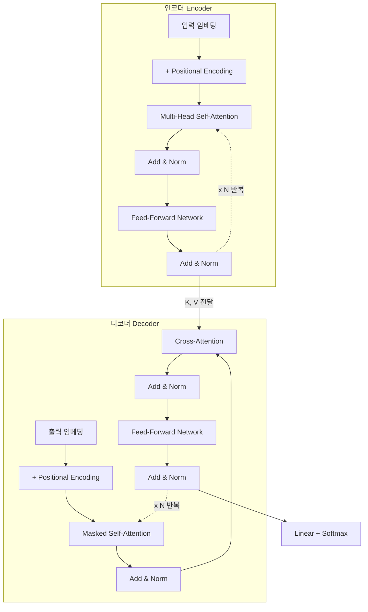
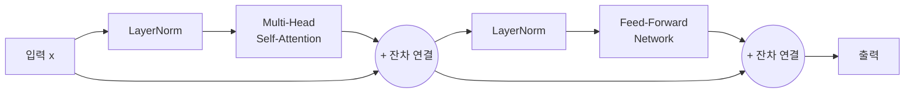
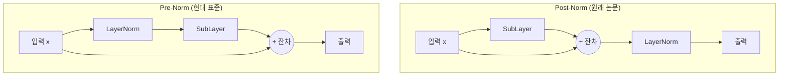
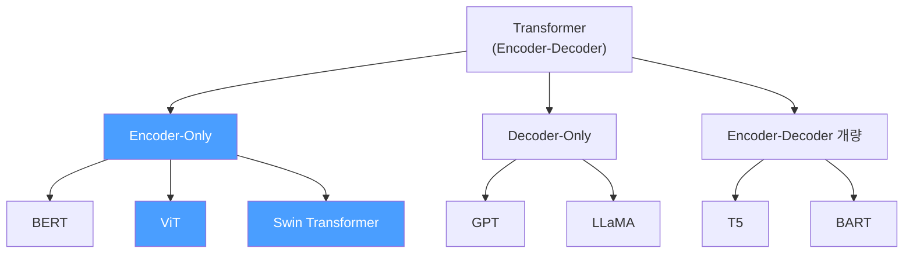
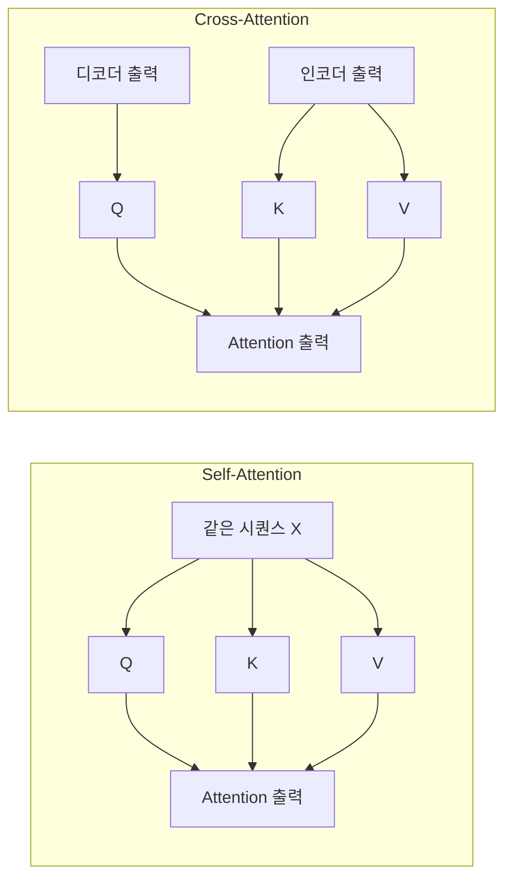

# Transformer 아키텍처

> Encoder-Decoder 구조의 이해

## 개요

앞서 [어텐션 메커니즘](./01-attention-mechanism.md)에서 Self-Attention과 Multi-Head Attention의 원리를 배웠습니다. 이제 이 부품들이 어떻게 조립되어 하나의 완전한 아키텍처가 되는지 살펴볼 차례입니다. 이 섹션에서는 **Transformer**의 전체 구조 — Encoder, Decoder, Positional Encoding, Feed-Forward Network — 를 빠짐없이 다룹니다.

**선수 지식**: [어텐션 메커니즘](./01-attention-mechanism.md)의 Scaled Dot-Product Attention과 Multi-Head Attention
**학습 목표**:
- Transformer의 Encoder-Decoder 구조를 전체적으로 파악하기
- Positional Encoding이 왜 필요하고 어떻게 작동하는지 이해하기
- Feed-Forward Network, Residual Connection, Layer Norm의 역할 알기
- Encoder-Only, Decoder-Only 등 현대 변형을 구분하기

## 왜 알아야 할까?

Transformer는 2017년에 등장한 이후, 현대 AI의 **사실상 표준 아키텍처**가 되었습니다. GPT, BERT, ViT, DALL-E, Stable Diffusion, Sora — 이 모든 모델의 뼈대가 Transformer이죠. 컴퓨터 비전에서도 [Vision Transformer](./03-vit.md)가 CNN을 대체하기 시작하면서, Transformer 아키텍처를 이해하는 것은 선택이 아닌 **필수**가 되었습니다.

Transformer를 이해하면 이후에 배울 ViT, Swin Transformer, DETR 같은 비전 모델이 왜 그런 구조를 가지는지 자연스럽게 이해할 수 있습니다.

## 핵심 개념

### 개념 1: 전체 구조 — "통역사 두 명의 협업"

> 💡 **비유**: 한국어를 영어로 번역하는 통역 팀을 상상해 보세요. **인코더(Encoder)**는 한국어 문장을 듣고 "의미"를 머릿속에 정리하는 첫 번째 통역사입니다. **디코더(Decoder)**는 그 정리된 의미를 받아서 영어 문장으로 한 단어씩 풀어내는 두 번째 통역사이고요. 둘 사이를 연결하는 것이 **Cross-Attention**입니다.

Transformer의 전체 구조를 한눈에 정리하면 이렇습니다:

**Encoder (인코더)**
- 입력 → 임베딩 + Positional Encoding
- N개의 인코더 레이어 반복:
  - Multi-Head Self-Attention
  - Add & Norm (잔차 연결 + 정규화)
  - Feed-Forward Network
  - Add & Norm

**Decoder (디코더)**
- 출력(시프트) → 임베딩 + Positional Encoding
- N개의 디코더 레이어 반복:
  - Masked Multi-Head Self-Attention
  - Add & Norm
  - Multi-Head **Cross**-Attention (인코더 출력 참조!)
  - Add & Norm
  - Feed-Forward Network
  - Add & Norm

원래 논문에서는 인코더와 디코더 각각 **N=6개 레이어**를 쌓았습니다.

> 📊 **그림 1**: Transformer의 전체 Encoder-Decoder 구조




> ⚠️ **흔한 오해**: "Transformer는 항상 Encoder + Decoder를 함께 사용한다"고 생각하기 쉽지만, 실제로 현대 모델 대부분은 **한쪽만** 사용합니다. BERT는 Encoder만, GPT는 Decoder만 사용하죠. 원래의 Encoder-Decoder 구조는 번역처럼 입력과 출력 형태가 다른 작업에 적합합니다.

### 개념 2: Positional Encoding — "시계의 시침, 분침, 초침"

Transformer의 Self-Attention은 모든 위치를 동시에 봅니다. 이것은 강력한 장점이지만, 한 가지 치명적인 문제가 있어요. **순서 정보가 사라집니다!**

"고양이가 쥐를 잡았다"와 "쥐가 고양이를 잡았다"가 같은 입력으로 처리될 수 있다는 뜻이죠. RNN은 단어를 순서대로 처리하니까 자연스럽게 순서가 보존되지만, Transformer는 모든 단어를 한 번에 보기 때문에 **위치 정보를 별도로 주입**해야 합니다.

> 💡 **비유**: 시계를 생각해 보세요. 시침(느린 주파수)은 대략적인 시간대를, 분침(중간 주파수)은 분 단위를, 초침(빠른 주파수)은 초 단위를 나타냅니다. 세 바늘의 조합으로 하루 중 **어떤 순간이든 고유하게** 표현할 수 있죠. Positional Encoding도 똑같은 원리입니다!

원래 논문에서는 사인(sine)과 코사인(cosine) 함수를 사용합니다:

$$PE_{(pos, 2i)} = \sin\left(\frac{pos}{10000^{2i/d_{model}}}\right)$$

$$PE_{(pos, 2i+1)} = \cos\left(\frac{pos}{10000^{2i/d_{model}}}\right)$$

- $pos$: 시퀀스에서의 위치 (0, 1, 2, ...)
- $i$: 차원 인덱스
- $d_{model}$: 모델의 차원 수

핵심 아이디어는 **서로 다른 주파수의 sin/cos 파동**을 조합한다는 것입니다:

| 차원 | 주파수 | 역할 |
|------|--------|------|
| 낮은 차원 (i 작음) | 고주파 (빠른 변화) | 인접 위치 세밀하게 구분 |
| 높은 차원 (i 큼) | 저주파 (느린 변화) | 먼 거리의 위치 관계 포착 |

이 방식의 수학적인 아름다움은, 임의의 고정 오프셋 $k$에 대해 $PE(pos+k)$가 $PE(pos)$의 **선형 변환**으로 표현된다는 점입니다. 덕분에 모델이 "3칸 떨어진 위치"같은 **상대적 위치**를 쉽게 학습할 수 있어요.

### 개념 3: Feed-Forward Network — "정보 가공 공장"

> 📊 **그림 2**: Encoder 블록 하나의 내부 흐름 (Pre-Norm 방식)




> 💡 **비유**: Self-Attention이 "회의실에서 모든 사람의 의견을 듣는 과정"이라면, Feed-Forward Network(FFN)은 "회의 내용을 정리해서 결론을 내리는 과정"입니다. 어텐션은 **어디에서 정보를 가져올지** 결정하고, FFN은 가져온 정보로 **무엇을 할지** 결정합니다.

FFN의 구조는 의외로 단순합니다. 두 개의 선형 변환 사이에 활성화 함수를 끼운 것이 전부예요:

$$\text{FFN}(x) = \text{ReLU}(xW_1 + b_1)W_2 + b_2$$

- $W_1$: $(d_{model}, d_{ff})$ — 차원을 확장 (보통 $d_{ff} = 4 \times d_{model}$)
- $W_2$: $(d_{ff}, d_{model})$ — 다시 원래 차원으로 축소

왜 4배로 확장했다가 다시 줄일까요? 이것은 **정보 병목(information bottleneck)** 패턴입니다. 한 번 넓은 공간에서 비선형 변환을 거친 후 다시 압축하면, 더 풍부한 표현이 가능해집니다.

> 💡 **알고 계셨나요?**: 최근 연구에서 FFN은 사실 **거대한 메모리**처럼 작동한다는 것이 밝혀졌습니다. FFN의 Key-Value 구조가 사실상 학습된 "사실(fact)"을 저장하는 역할을 하는 것이죠. "파리는 프랑스의 수도다" 같은 지식이 FFN에 저장된다는 뜻입니다.

### 개념 4: Residual Connection과 Layer Norm — "안전망과 온도 조절"

Transformer는 레이어를 깊게 쌓습니다. 깊어질수록 **기울기 소실(vanishing gradient)** 문제가 심해지는데, 이를 해결하는 두 가지 핵심 장치가 있습니다.

**Residual Connection (잔차 연결)**

> 💡 **비유**: 고속도로의 지름길(bypass)이에요. 복잡한 시내 도로(레이어)를 거치지 않고 목적지로 바로 갈 수 있는 길을 만들어 둔 겁니다. [ResNet](../05-cnn-architectures/03-resnet.md)에서 배운 Skip Connection과 완전히 같은 개념이에요!

$$\text{output} = x + \text{SubLayer}(x)$$

레이어가 아무것도 학습하지 못하더라도 최소한 입력을 그대로 통과시킬 수 있으니, 깊은 네트워크도 안정적으로 학습됩니다.

**Layer Normalization**

[배치 정규화](../04-cnn-fundamentals/03-batch-normalization.md)에서 BatchNorm을 배웠죠? Transformer에서는 **Layer Norm**을 사용합니다. 배치 차원이 아니라 **특성 차원**을 따라 정규화하기 때문에, 배치 크기에 의존하지 않는다는 장점이 있습니다.

$$\text{LayerNorm}(x) = \gamma \cdot \frac{x - \mu}{\sqrt{\sigma^2 + \epsilon}} + \beta$$

이 두 장치를 결합한 **"Add & Norm"** 패턴이 Transformer 곳곳에 반복됩니다.

**Post-Norm vs Pre-Norm — 현대의 선택**

원래 논문은 **Post-Norm** 방식을 사용했습니다:

> Post-Norm: $\text{LayerNorm}(x + \text{SubLayer}(x))$ — 서브레이어 이후 정규화

하지만 현대 대부분의 모델(GPT-3, LLaMA, PaLM 등)은 **Pre-Norm**을 사용합니다:

> Pre-Norm: $x + \text{SubLayer}(\text{LayerNorm}(x))$ — 서브레이어 이전에 정규화

Pre-Norm이 학습 초기 안정성이 훨씬 좋아서, 수십~수백 레이어를 쌓는 대규모 모델에서는 거의 필수가 되었습니다.

> 📊 **그림 3**: Post-Norm vs Pre-Norm 비교




### 개념 5: 현대 Transformer 변형들

원래의 Encoder-Decoder 구조에서 발전한 세 가지 주요 변형이 있습니다:

| 구조 | 대표 모델 | 용도 | 비전 적용 |
|------|----------|------|----------|
| **Encoder-Only** | BERT, ViT | 분류, 임베딩 | 이미지 분류, 특징 추출 |
| **Decoder-Only** | GPT, LLaMA | 생성 | 이미지 생성 (일부) |
| **Encoder-Decoder** | T5, BART | 번역, 요약 | 캡셔닝, VQA |

컴퓨터 비전에서는 주로 **Encoder-Only** 구조를 사용합니다. 다음 섹션에서 배울 [Vision Transformer (ViT)](./03-vit.md)가 바로 Encoder-Only Transformer입니다.

> 📊 **그림 5**: 현대 Transformer 변형 계보




## 실습: 직접 해보기

### Positional Encoding 구현과 시각화

```python
import torch
import torch.nn as nn
import math
import matplotlib.pyplot as plt

class PositionalEncoding(nn.Module):
    """
    사인/코사인 기반 Positional Encoding
    시퀀스의 위치 정보를 벡터로 변환합니다
    """
    def __init__(self, d_model, max_len=5000):
        super().__init__()

        # (max_len, d_model) 크기의 PE 테이블 미리 계산
        pe = torch.zeros(max_len, d_model)
        position = torch.arange(0, max_len, dtype=torch.float).unsqueeze(1)

        # 주파수 계산: 10000^(2i/d_model)
        div_term = torch.exp(
            torch.arange(0, d_model, 2).float() * (-math.log(10000.0) / d_model)
        )

        # 짝수 차원은 sin, 홀수 차원은 cos
        pe[:, 0::2] = torch.sin(position * div_term)
        pe[:, 1::2] = torch.cos(position * div_term)

        pe = pe.unsqueeze(0)  # 배치 차원 추가: (1, max_len, d_model)
        self.register_buffer('pe', pe)

    def forward(self, x):
        # 입력에 위치 정보 더하기
        return x + self.pe[:, :x.size(1)]

# PE 시각화
d_model = 128
pe_layer = PositionalEncoding(d_model)
pe_values = pe_layer.pe[0, :100, :].numpy()  # 처음 100개 위치

fig, axes = plt.subplots(1, 2, figsize=(14, 5))

# 전체 PE 히트맵
im = axes[0].imshow(pe_values.T, cmap='RdBu', aspect='auto')
axes[0].set_xlabel('위치 (Position)')
axes[0].set_ylabel('차원 (Dimension)')
axes[0].set_title('Positional Encoding 히트맵')
plt.colorbar(im, ax=axes[0])

# 특정 차원의 파형 비교
for dim in [0, 10, 50, 100]:
    axes[1].plot(pe_values[:, dim], label=f'dim {dim}')
axes[1].set_xlabel('위치 (Position)')
axes[1].set_ylabel('값')
axes[1].set_title('차원별 PE 파형 (주파수 차이)')
axes[1].legend()

plt.tight_layout()
plt.show()
```

### Transformer Encoder 블록 구현

```python
import torch
import torch.nn as nn
import torch.nn.functional as F
import math

class TransformerEncoderBlock(nn.Module):
    """
    Transformer Encoder 한 블록 (Pre-Norm 방식)
    = LayerNorm → Multi-Head Attention → 잔차연결
    → LayerNorm → FFN → 잔차연결
    """
    def __init__(self, d_model=512, num_heads=8, d_ff=2048, dropout=0.1):
        super().__init__()

        # Multi-Head Attention
        self.attention = nn.MultiheadAttention(
            embed_dim=d_model,
            num_heads=num_heads,
            dropout=dropout,
            batch_first=True  # (batch, seq, dim) 형태 사용
        )

        # Feed-Forward Network
        self.ffn = nn.Sequential(
            nn.Linear(d_model, d_ff),     # 차원 확장 (512 → 2048)
            nn.GELU(),                     # 활성화 함수 (현대적 선택)
            nn.Dropout(dropout),
            nn.Linear(d_ff, d_model),      # 차원 복원 (2048 → 512)
            nn.Dropout(dropout),
        )

        # Layer Normalization (Pre-Norm 방식)
        self.norm1 = nn.LayerNorm(d_model)
        self.norm2 = nn.LayerNorm(d_model)

    def forward(self, x, mask=None):
        # Pre-Norm + Self-Attention + Residual
        normed = self.norm1(x)
        attn_output, attn_weights = self.attention(normed, normed, normed, attn_mask=mask)
        x = x + attn_output  # 잔차 연결

        # Pre-Norm + FFN + Residual
        normed = self.norm2(x)
        ffn_output = self.ffn(normed)
        x = x + ffn_output  # 잔차 연결

        return x, attn_weights

# 테스트: 인코더 블록 하나 통과
d_model = 512
batch_size = 2
seq_len = 16  # 예: 4x4 이미지 패치

encoder_block = TransformerEncoderBlock(d_model=d_model, num_heads=8)
x = torch.randn(batch_size, seq_len, d_model)

output, weights = encoder_block(x)
print(f"입력 크기: {x.shape}")       # [2, 16, 512]
print(f"출력 크기: {output.shape}")   # [2, 16, 512] — 입력과 동일!
print(f"어텐션 맵: {weights.shape}")  # [2, 16, 16]
```

### N개 레이어를 쌓은 완전한 Encoder

```python
class TransformerEncoder(nn.Module):
    """
    N개의 Encoder 블록을 쌓은 완전한 Transformer Encoder
    """
    def __init__(self, d_model=512, num_heads=8, d_ff=2048,
                 num_layers=6, max_len=5000, dropout=0.1):
        super().__init__()

        # Positional Encoding
        self.pos_encoding = PositionalEncoding(d_model, max_len)
        self.dropout = nn.Dropout(dropout)

        # N개의 Encoder 블록
        self.layers = nn.ModuleList([
            TransformerEncoderBlock(d_model, num_heads, d_ff, dropout)
            for _ in range(num_layers)
        ])

        # 최종 Layer Norm (Pre-Norm 방식에서 필요)
        self.final_norm = nn.LayerNorm(d_model)

    def forward(self, x, mask=None):
        # 위치 정보 주입
        x = self.pos_encoding(x)
        x = self.dropout(x)

        # N개 레이어 순차 통과
        all_weights = []
        for layer in self.layers:
            x, weights = layer(x, mask)
            all_weights.append(weights)

        # 최종 정규화
        x = self.final_norm(x)

        return x, all_weights

# 완전한 Encoder 테스트
encoder = TransformerEncoder(
    d_model=256,
    num_heads=8,
    d_ff=1024,
    num_layers=6,
    dropout=0.1
)

x = torch.randn(2, 16, 256)  # 배치 2, 패치 16개, 256차원
output, all_weights = encoder(x)

print(f"입력: {x.shape}")                  # [2, 16, 256]
print(f"출력: {output.shape}")              # [2, 16, 256]
print(f"레이어 수: {len(all_weights)}")      # 6
print(f"총 파라미터: {sum(p.numel() for p in encoder.parameters()):,}")
```

## 더 깊이 알아보기

### Transformer 이름의 유래

"Transformer"라는 이름은 논문 저자들이 이 모델이 입력 시퀀스를 출력 시퀀스로 **변환(transform)**한다는 의미에서 붙였습니다. 하지만 재미있는 뒷이야기가 있는데요, 논문 제출 당시 "Attention Is All You Need"라는 도발적인 제목이 리뷰어들 사이에서 논란이 되었다고 합니다. "기존 연구를 너무 무시하는 것 아니냐"는 의견이 있었지만, 결과적으로 이 대담한 제목이 예언처럼 맞아떨어졌죠.

더 흥미로운 것은, 논문의 8명 공저자 중 대부분이 이후 Google을 떠나 각자 AI 스타트업을 창업했다는 사실입니다. Noam Shazeer는 Character.AI를, Aidan Gomez는 Cohere를, Llion Jones는 Sakana AI를 만들었고, 이들의 스타트업은 모두 수조 원대 가치로 평가받고 있습니다.

### Cross-Attention: 두 세계를 잇는 다리

디코더에만 있는 특별한 레이어가 **Cross-Attention**입니다. Self-Attention과의 차이는 간단합니다:

- **Self-Attention**: Q, K, V 모두 같은 출처 → 자기 자신의 관계 파악
- **Cross-Attention**: Q는 디코더에서, K와 V는 인코더에서 → 두 시퀀스 간 관계 파악

> 📊 **그림 4**: Self-Attention vs Cross-Attention 데이터 흐름




이 패턴은 컴퓨터 비전에서도 중요하게 쓰입니다. [DETR](../07-object-detection/05-detr.md)에서 Object Query가 이미지 특징과 교차 어텐션하여 객체를 탐지하고, [Mask2Former](../08-segmentation/03-panoptic-segmentation.md)에서 마스크 쿼리가 특징 맵과 교차 어텐션하여 세그멘테이션을 수행하며, [SAM](../08-segmentation/04-sam.md)에서 프롬프트 임베딩이 이미지 임베딩과 교차 어텐션하여 마스크를 예측합니다. Stable Diffusion의 텍스트-이미지 생성에서도 Cross-Attention이 핵심 역할을 하죠.

## 흔한 오해와 팁

> ⚠️ **흔한 오해**: "Transformer는 그냥 어텐션 덩어리다"라고 생각하기 쉽지만, FFN이 전체 파라미터의 약 **2/3**를 차지합니다. 어텐션은 "어디를 볼지" 결정하고, FFN이 "무엇을 할지" 결정하는 동등하게 중요한 구성 요소입니다.

> 💡 **알고 계셨나요?**: Positional Encoding의 sin/cos 방식은 원래 논문의 선택일 뿐, 유일한 방법은 아닙니다. 최근에는 **학습 가능한 위치 임베딩(Learnable PE)**이나 **Rotary Position Embedding(RoPE)**이 더 널리 쓰입니다. ViT는 학습 가능한 PE를, LLaMA는 RoPE를 사용하죠.

> 🔥 **실무 팁**: Pre-Norm과 Post-Norm 중 고민된다면, 무조건 **Pre-Norm**을 선택하세요. 2024년 기준 GPT-3, LLaMA, PaLM, Falcon, Mistral 등 거의 모든 대규모 모델이 Pre-Norm을 채택하고 있습니다. 학습 안정성이 압도적으로 좋습니다.

> ⚠️ **흔한 오해**: "인코더와 디코더를 항상 함께 써야 한다"고 생각할 수 있지만, 현대 비전 모델의 대부분은 **Encoder-Only** 구조입니다. ViT, Swin Transformer, DeiT 등이 모두 Encoder만 사용합니다.

## 핵심 정리

| 개념 | 설명 |
|------|------|
| Encoder | 입력 시퀀스를 고차원 표현으로 변환하는 모듈 |
| Decoder | 인코더 출력을 참조하여 출력 시퀀스를 생성하는 모듈 |
| Positional Encoding | 순서 정보가 없는 Transformer에 위치 정보를 주입하는 방법 |
| Feed-Forward Network | 어텐션이 모은 정보를 처리하는 2층 MLP, 파라미터의 2/3 차지 |
| Residual Connection | $x + \text{SubLayer}(x)$ — 기울기 흐름을 위한 지름길 |
| Layer Normalization | 특성 차원 기준 정규화, 학습 안정성 확보 |
| Pre-Norm | 현대 표준 — 서브레이어 **이전에** 정규화 적용 |
| Cross-Attention | Q는 디코더, K/V는 인코더 — 두 시퀀스 간 연결 다리 |
| Encoder-Only | ViT, BERT — 비전과 분류에 주로 사용 |

## 다음 섹션 미리보기

Transformer의 전체 구조를 이해했으니, 이제 드디어 이것을 **이미지에 적용**할 차례입니다! 다음 [Vision Transformer (ViT)](./03-vit.md)에서는 이미지를 패치로 잘라 Transformer에 넣는 기발한 아이디어가 어떻게 CNN의 왕좌를 위협했는지 알아봅니다.

## 참고 자료

- [Attention Is All You Need (Vaswani et al., 2017)](https://arxiv.org/abs/1706.03762) - Transformer 원본 논문
- [The Illustrated Transformer (Jay Alammar)](https://jalammar.github.io/illustrated-transformer/) - 가장 유명한 시각적 Transformer 해설
- [Transformer Architecture: The Positional Encoding (Amirhossein Kazemnejad)](https://kazemnejad.com/blog/transformer_architecture_positional_encoding/) - Positional Encoding의 수학적 직관 설명
- [Why Pre-Norm Became the Default in Transformers (2024)](https://medium.com/@ashutoshs81127/why-pre-norm-became-the-default-in-transformers-4229047e2620) - Pre-Norm vs Post-Norm 비교
- [Transformer Explainer (Georgia Tech)](https://poloclub.github.io/transformer-explainer/) - 인터랙티브 Transformer 시각화 도구
