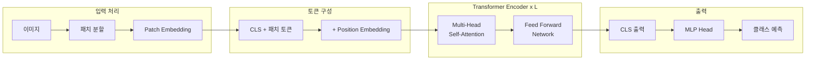
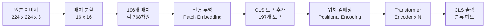
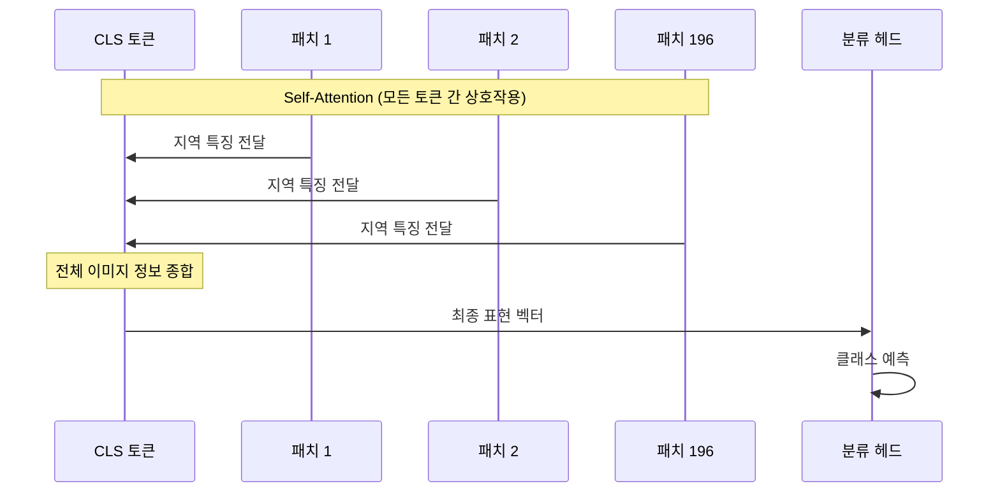
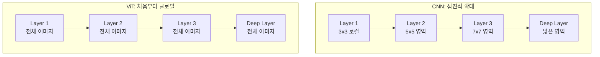
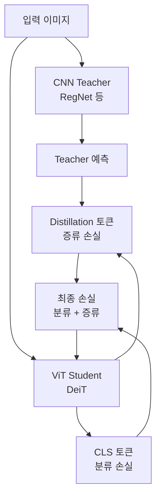

# Vision Transformer (ViT)

> 이미지를 패치로 분할하여 처리

## 개요

> 📊 **그림 5**: ViT 전체 아키텍처 개관




"이미지 하나는 16x16 단어의 가치가 있다" — 2020년 Google Brain 팀이 던진 이 한 마디가 컴퓨터 비전의 패러다임을 바꿨습니다. 이 섹션에서는 **Vision Transformer(ViT)**가 이미지를 어떻게 "단어처럼" 처리하는지, 왜 CNN의 왕좌를 위협할 수 있었는지를 배웁니다.

**선수 지식**: [어텐션 메커니즘](./01-attention-mechanism.md)의 Self-Attention, [Transformer 아키텍처](./02-transformer-basics.md)의 Encoder 구조와 Positional Encoding
**학습 목표**:
- 이미지를 패치로 나눠 시퀀스로 변환하는 과정 이해하기
- [CLS] 토큰과 Positional Embedding의 역할 파악하기
- ViT가 CNN 대비 가진 장단점 비교하기
- DeiT의 데이터 효율적 학습 전략 이해하기

## 왜 알아야 할까?

2020년까지 컴퓨터 비전은 **CNN의 세상**이었습니다. [LeNet부터 EfficientNet까지](../05-cnn-architectures/01-lenet-alexnet.md) 합성곱 연산은 이미지 처리에 필수불가결한 것처럼 보였죠. 그런데 Google Brain 팀이 대담한 질문을 던졌습니다. *"정말 합성곱이 꼭 필요할까?"*

놀랍게도 답은 **"아니오"**였습니다. NLP에서 성공한 Transformer를 이미지에 **거의 변형 없이** 적용했더니, 충분한 데이터만 있으면 CNN을 능가하는 성능이 나온 것입니다. 이후 ViT는 이미지 분류를 넘어 비전 전반으로 확산되었습니다. [DETR](../07-object-detection/05-detr.md)은 ViT의 등장 이전부터 Transformer를 탐지에 적용했고, [SAM](../08-segmentation/04-sam.md)은 ViT-Huge를 이미지 인코더로 사용하며, [Mask2Former](../08-segmentation/03-panoptic-segmentation.md)는 Swin Transformer 백본 위에서 모든 세그멘테이션을 통합했습니다. 오늘날 대부분의 최신 비전 모델의 기반이 ViT입니다.

## 핵심 개념

### 개념 1: 이미지를 시퀀스로 — "퍼즐 조각 만들기"

> 📊 **그림 1**: ViT의 이미지-시퀀스 변환 파이프라인




> 💡 **비유**: 큰 사진을 작은 퍼즐 조각으로 잘라서 한 줄로 나열한다고 상상해 보세요. 각 조각을 순서대로 읽으면 원래 사진의 내용을 파악할 수 있겠죠? ViT가 하는 일이 정확히 이겁니다. 이미지를 일정 크기의 **패치(patch)**로 잘라서, Transformer가 이해할 수 있는 **시퀀스(sequence)**로 변환하는 것이죠.

구체적인 과정을 따라가 봅시다:

**1단계: 패치 분할**
- 224×224 이미지를 16×16 크기의 패치로 분할
- 총 패치 수: $(224 \div 16) \times (224 \div 16) = 14 \times 14 = 196$개
- 각 패치: 16×16×3(RGB) = **768** 차원의 벡터

**2단계: 선형 투영 (Patch Embedding)**
- 각 패치를 평탄화(flatten)하여 768차원 벡터로 만듦
- 선형 레이어로 원하는 임베딩 차원 $D$로 변환
- 사실 이 과정은 `stride=16, kernel_size=16`인 **합성곱 연산**과 수학적으로 동일합니다!

**3단계: [CLS] 토큰 추가**
- 196개 패치 앞에 학습 가능한 특별한 토큰 1개를 추가
- 총 토큰 수: 196 + 1 = **197**개
- [CLS] 토큰이 모든 패치의 정보를 종합하여 최종 분류에 사용

**4단계: Positional Embedding 추가**
- 197개 토큰에 학습 가능한 위치 임베딩을 더함
- 패치의 공간적 위치 정보를 보존

> ⚠️ **흔한 오해**: "ViT는 합성곱을 전혀 사용하지 않는다"고 생각하기 쉽지만, Patch Embedding 단계는 큰 커널의 합성곱과 동일합니다. 순수하게 "합성곱 없음"이라고 하기엔 미묘한 부분이 있어요. 다만 **CNN처럼 여러 층을 쌓아 점진적으로 특징을 추출하지 않는다**는 점이 핵심 차이입니다.

전체 과정을 정리하면:

| 단계 | 입력 | 출력 | 설명 |
|------|------|------|------|
| 원본 이미지 | - | (224, 224, 3) | RGB 이미지 |
| 패치 분할 | (224, 224, 3) | (196, 768) | 16×16 패치 196개 |
| 선형 투영 | (196, 768) | (196, D) | 임베딩 차원으로 변환 |
| [CLS] 추가 | (196, D) | (197, D) | 분류 토큰 1개 추가 |
| 위치 임베딩 | (197, D) | (197, D) | 위치 정보 더하기 |
| Transformer | (197, D) | (197, D) | N개 인코더 레이어 |
| 분류 | (1, D) | (1, C) | [CLS] 토큰으로 분류 |

### 개념 2: [CLS] 토큰 — "반장의 역할"

> 📊 **그림 2**: CLS 토큰이 Self-Attention으로 패치 정보를 종합하는 과정




> 💡 **비유**: 학급 회의를 생각해 보세요. 모든 학생(패치)이 각자 의견을 내놓으면, **반장([CLS] 토큰)**이 모든 의견을 종합하여 최종 결론을 대표합니다. 반장은 처음에는 아무 정보도 없지만, Self-Attention을 통해 **모든 학생의 의견을 들으면서** 점점 전체를 대변하는 존재가 됩니다.

[CLS] 토큰은 BERT에서 가져온 아이디어입니다:
- 학습 가능한 파라미터로 초기화 (처음에는 무작위)
- Self-Attention을 통해 모든 패치의 정보를 흡수
- Transformer를 다 통과한 후, [CLS] 토큰의 출력만 뽑아서 분류 헤드에 입력

### 개념 3: ViT vs CNN — 무엇이 다를까?

> 📊 **그림 3**: CNN과 ViT의 수용 영역(Receptive Field) 차이




| 특성 | CNN | ViT |
|------|-----|-----|
| **기본 연산** | 합성곱 (로컬) | Self-Attention (글로벌) |
| **수용 영역** | 작음 → 점진적 확대 | **처음부터 전체** |
| **귀납적 편향** | 이동 불변성, 지역성 | 거의 없음 |
| **소규모 데이터** | 강함 (편향이 도움) | 약함 (과적합 위험) |
| **대규모 데이터** | 포화 | **계속 성능 향상** |
| **형상 인식** | 텍스처 편향 | **형상 편향** (인간과 유사) |
| **계산 복잡도** | $O(k^2 \cdot C^2 \cdot H \cdot W)$ | $O(n^2 \cdot D)$ |

여기서 핵심은 **귀납적 편향(inductive bias)**입니다. CNN은 "가까운 픽셀이 관련 있다(지역성)"와 "같은 패턴이 위치에 상관없이 나타난다(이동 불변성)"라는 가정이 내장되어 있어요. 이 가정 덕분에 적은 데이터에서도 잘 학습되지만, 반대로 이 가정에 **갇힐** 수도 있습니다.

ViT는 이런 가정 없이 **데이터에서 모든 것을 학습**합니다. 데이터가 적으면 불리하지만, 데이터가 충분하면 CNN의 한계를 넘어설 수 있죠.

> 🔥 **실무 팁**: "ViT vs CNN 중 뭘 쓸까?" 고민된다면 간단한 기준이 있습니다. 학습 데이터가 **10만 장 이하**면 CNN(또는 CNN 사전학습 모델), **100만 장 이상**이면 ViT를 고려하세요. 그 사이라면? DeiT 같은 데이터 효율적 방법을 사용하면 됩니다.

### 개념 4: 데이터 부족 문제와 DeiT — "좋은 선생님이 필요해"

> 📊 **그림 4**: DeiT의 지식 증류 구조




ViT의 가장 큰 약점은 **데이터 식욕**이었습니다. 원래 논문에서는 JFT-300M(3억 장!)이라는 비공개 데이터셋으로 사전학습해야 좋은 성능이 나왔거든요. ImageNet 120만 장으로는 CNN에 밀렸습니다.

이 문제를 해결한 것이 Facebook AI(현 Meta)의 **DeiT(Data-efficient Image Transformers, 2020)**입니다.

> 💡 **비유**: 교과서만으로 공부하는 학생(ViT)은 엄청난 양의 교재가 필요합니다. 하지만 **경험 많은 과외 선생님(CNN Teacher)**이 옆에서 "이 문제는 이렇게 풀어"라고 알려주면, 훨씬 적은 교재로도 잘 배울 수 있죠. 이것이 **지식 증류(Knowledge Distillation)**입니다.

DeiT의 핵심 전략:

1. **지식 증류**: 잘 훈련된 CNN(RegNet 등)을 "선생님"으로, ViT를 "학생"으로 설정
2. **증류 토큰**: [CLS] 토큰 외에 **[Distillation] 토큰**을 하나 더 추가하여 선생님의 지식을 전달받음
3. **강력한 데이터 증강**: RandAugment, MixUp, CutMix 등 공격적인 증강 기법 적용
4. **결과**: ImageNet-1K(120만 장)만으로 **85.2% 정확도** 달성 — CNN 수준!

흥미로운 발견은, Transformer 선생님보다 **CNN 선생님이 더 효과적**이었다는 점입니다. CNN의 귀납적 편향이 ViT에게는 부족한 지역적 특징 이해를 보완해주기 때문이죠.

## 실습: 직접 해보기

### ViT를 처음부터 구현하기

```python
import torch
import torch.nn as nn

class PatchEmbedding(nn.Module):
    """
    이미지를 패치로 나누고 임베딩하는 모듈
    Conv2d를 사용하여 효율적으로 구현합니다
    """
    def __init__(self, img_size=224, patch_size=16, in_channels=3, embed_dim=768):
        super().__init__()
        self.num_patches = (img_size // patch_size) ** 2  # 196

        # 패치 분할 + 선형 투영을 하나의 Conv2d로!
        # kernel_size=stride=patch_size → 겹치지 않는 패치 추출
        self.projection = nn.Conv2d(
            in_channels, embed_dim,
            kernel_size=patch_size, stride=patch_size
        )

    def forward(self, x):
        # x: (batch, 3, 224, 224)
        x = self.projection(x)    # (batch, 768, 14, 14)
        x = x.flatten(2)          # (batch, 768, 196)
        x = x.transpose(1, 2)     # (batch, 196, 768)
        return x

class ViT(nn.Module):
    """
    Vision Transformer (ViT) 구현
    이미지를 패치로 나누어 Transformer Encoder에 통과시킵니다
    """
    def __init__(
        self,
        img_size=224,
        patch_size=16,
        in_channels=3,
        num_classes=1000,
        embed_dim=768,
        num_layers=12,
        num_heads=12,
        mlp_dim=3072,
        dropout=0.1,
    ):
        super().__init__()

        # 1) 패치 임베딩
        self.patch_embed = PatchEmbedding(img_size, patch_size, in_channels, embed_dim)
        num_patches = self.patch_embed.num_patches

        # 2) [CLS] 토큰 — 학습 가능한 파라미터
        self.cls_token = nn.Parameter(torch.randn(1, 1, embed_dim))

        # 3) 위치 임베딩 — (패치 196개 + CLS 1개) = 197개
        self.pos_embed = nn.Parameter(torch.randn(1, num_patches + 1, embed_dim))
        self.dropout = nn.Dropout(dropout)

        # 4) Transformer Encoder 블록들
        encoder_layer = nn.TransformerEncoderLayer(
            d_model=embed_dim,
            nhead=num_heads,
            dim_feedforward=mlp_dim,
            dropout=dropout,
            activation='gelu',
            batch_first=True,
            norm_first=True,  # Pre-Norm 방식!
        )
        self.transformer = nn.TransformerEncoder(
            encoder_layer, num_layers=num_layers
        )

        # 5) 최종 분류 헤드
        self.norm = nn.LayerNorm(embed_dim)
        self.classifier = nn.Linear(embed_dim, num_classes)

    def forward(self, x):
        batch_size = x.shape[0]

        # 패치 임베딩: (batch, 196, 768)
        x = self.patch_embed(x)

        # [CLS] 토큰 추가: (batch, 197, 768)
        cls_tokens = self.cls_token.expand(batch_size, -1, -1)
        x = torch.cat([cls_tokens, x], dim=1)

        # 위치 임베딩 추가
        x = x + self.pos_embed
        x = self.dropout(x)

        # Transformer Encoder 통과
        x = self.transformer(x)

        # [CLS] 토큰의 출력만 추출하여 분류
        cls_output = x[:, 0]  # 첫 번째 토큰 = [CLS]
        cls_output = self.norm(cls_output)
        logits = self.classifier(cls_output)

        return logits

# ViT-Base 모델 생성 및 테스트
model = ViT(
    img_size=224,
    patch_size=16,
    num_classes=10,       # CIFAR-10 등
    embed_dim=768,
    num_layers=12,
    num_heads=12,
    mlp_dim=3072,
)

# 테스트 입력
images = torch.randn(4, 3, 224, 224)  # 배치 4장
logits = model(images)

print(f"입력 이미지: {images.shape}")     # [4, 3, 224, 224]
print(f"출력 로짓: {logits.shape}")       # [4, 10]
print(f"총 파라미터: {sum(p.numel() for p in model.parameters()):,}")
# 약 86M (ViT-Base 수준)
```

### 사전학습 ViT로 이미지 분류하기

```python
import torch
from torchvision import transforms, models

# torchvision의 사전학습된 ViT-B/16 모델 로드
weights = models.ViT_B_16_Weights.IMAGENET1K_V1
model = models.vit_b_16(weights=weights)
model.eval()

# 전처리 파이프라인 (사전학습 설정에 맞춤)
preprocess = weights.transforms()

# 임의의 이미지로 테스트 (실제로는 PIL Image를 넣으세요)
dummy_image = torch.randn(3, 224, 224)  # 가상 이미지
input_tensor = preprocess(dummy_image).unsqueeze(0)

# 추론
with torch.no_grad():
    output = model(input_tensor)
    probabilities = torch.softmax(output, dim=1)
    top5_prob, top5_idx = probabilities.topk(5)

print("Top-5 예측:")
categories = weights.meta["categories"]
for prob, idx in zip(top5_prob[0], top5_idx[0]):
    print(f"  {categories[idx]:30s} — {prob:.2%}")
```

## 더 깊이 알아보기

### "합성곱 없이도 된다" — 패러다임 전환의 순간

ViT 논문이 2020년 arXiv에 처음 공개되었을 때, 커뮤니티의 반응은 반신반의였습니다. "이미지에 합성곱 없이 Transformer만으로 좋은 성능이 나올 리 없다"는 것이 당시 상식이었거든요. 실제로 ImageNet만으로 학습하면 CNN에 밀렸습니다.

하지만 JFT-300M(3억 장)으로 사전학습한 ViT-Huge가 **ImageNet에서 88.55%**라는 당시 최고 성능을 달성하자, 분위기가 바뀌었습니다. 핵심 발견은 이것이었습니다: *"충분한 데이터가 있으면, 학습 자체가 귀납적 편향을 대체한다(With enough data, learning trumps inductive bias)."*

이후 DeiT(2020), Swin Transformer(2021), DINOv2(2023)가 연달아 등장하면서 ViT 기반 모델이 비전의 주류가 되었고, 2025년 현재 DINOv3는 **70억 파라미터**, **17억 장** 이미지로 학습되는 수준까지 발전했습니다.

### ViT 모델 크기 비교

| 모델 | 레이어 | 은닉 차원 | 헤드 수 | 파라미터 |
|------|--------|----------|---------|---------|
| ViT-Small | 12 | 384 | 6 | ~22M |
| ViT-Base | 12 | 768 | 12 | ~86M |
| ViT-Large | 24 | 1024 | 16 | ~300M |
| ViT-Huge | 32 | 1280 | 16 | ~600M |
| ViT-Giant (DINOv2) | 40 | 1536 | 24 | ~1B |

패치 크기도 성능에 큰 영향을 미칩니다. 패치가 작을수록(예: 14×14) 더 세밀한 특징을 잡지만, 토큰 수가 늘어나 계산량이 급증합니다.

## 흔한 오해와 팁

> ⚠️ **흔한 오해**: "ViT는 항상 CNN보다 낫다" — 소규모 데이터셋(10만 장 이하)에서는 CNN이 여전히 더 강합니다. ViT의 진가는 대규모 데이터에서 발휘됩니다.

> 💡 **알고 계셨나요?**: ViT의 Positional Embedding을 학습 후 시각화하면, 놀랍게도 **2D 공간 구조**가 자동으로 나타납니다. 1D 위치 정보만 줬는데 모델이 스스로 2D 이미지의 공간 관계를 학습한 것이죠! 이것이 바로 "학습이 편향을 대체한다"의 증거입니다.

> 🔥 **실무 팁**: ViT를 파인튜닝할 때는 사전학습보다 **높은 해상도**를 사용하면 성능이 올라갑니다. 예를 들어 224×224로 사전학습한 모델을 384×384로 파인튜닝하는 것이죠. 이때 Positional Embedding은 **2D 보간(interpolation)**으로 크기를 조절합니다.

> ⚠️ **흔한 오해**: "ViT는 로컬 특징을 못 본다" — Self-Attention 가중치를 분석해보면, 초기 레이어에서는 **주변 패치에 집중하는 로컬 패턴**이 나타나고, 깊은 레이어로 갈수록 글로벌 패턴이 나타납니다. CNN처럼 명시적이진 않지만, 로컬 특징도 학습합니다.

## 핵심 정리

| 개념 | 설명 |
|------|------|
| Patch Embedding | 이미지를 16×16 패치로 나누어 벡터로 변환 |
| [CLS] Token | 모든 패치 정보를 종합하는 분류용 특별 토큰 |
| Positional Embedding | 학습 가능한 위치 정보 (1D이지만 2D 구조 학습) |
| 귀납적 편향 | CNN은 강함(지역성, 이동불변) → ViT는 약함 |
| 데이터 요구량 | ViT는 대규모 데이터 필요, CNN은 소규모 OK |
| DeiT | 지식 증류로 ViT의 데이터 효율성 문제 해결 |
| ViT-Base | 12레이어, 768차원, 12헤드, 약 86M 파라미터 |
| 패치 크기 | 작을수록 세밀하지만 계산량 급증 (14 or 16 표준) |

## 다음 섹션 미리보기

ViT는 강력하지만, $O(n^2)$ 복잡도 때문에 고해상도 이미지에서 한계가 있습니다. 다음 [Swin Transformer](./04-swin-transformer.md)에서는 이 문제를 **윈도우 기반 어텐션**으로 해결하면서도, CNN처럼 **계층적 특징 맵**을 만들어내는 획기적인 아키텍처를 배웁니다.

## 참고 자료

- [An Image is Worth 16x16 Words (Dosovitskiy et al., 2021)](https://arxiv.org/abs/2010.11929) - ViT 원본 논문, ICLR 2021 구두 발표
- [Training data-efficient image transformers (Touvron et al., 2021)](https://arxiv.org/abs/2012.12877) - DeiT 논문, 데이터 효율적 ViT 학습법
- [lucidrains/vit-pytorch](https://github.com/lucidrains/vit-pytorch) - 깔끔한 ViT PyTorch 구현 모음
- [PyTorch Vision Transformer 공식 문서](https://docs.pytorch.org/vision/stable/models/vision_transformer.html) - torchvision의 ViT 모델 사용법
- [CNN vs Vision Transformer: Which Wins in 2025?](https://hiya31.medium.com/cnn-vs-vision-transformer-vit-which-wins-in-2025-e1cb2dfcb903) - 2025년 기준 CNN vs ViT 실전 비교
- [DINOv2: Learning Robust Visual Features without Supervision (2023)](https://arxiv.org/abs/2304.07193) - 자기지도 학습 기반 최신 ViT 모델
