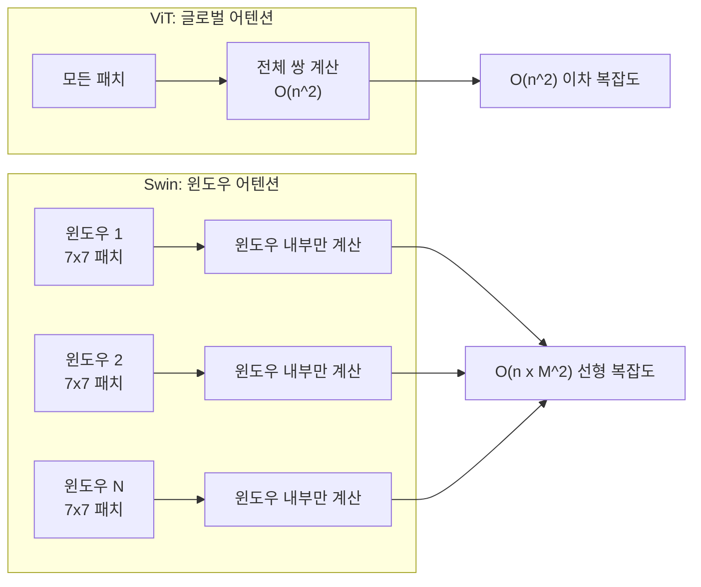
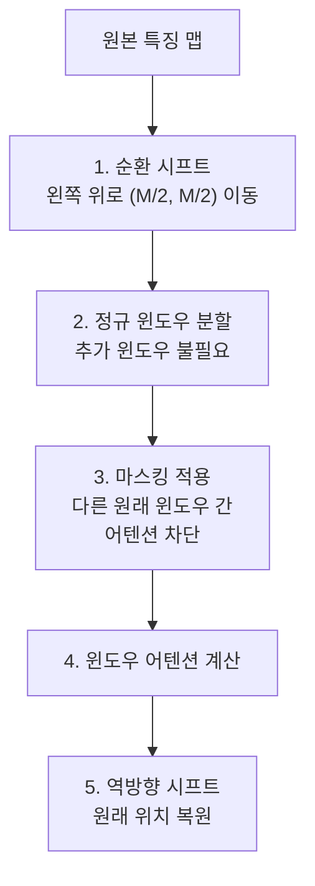
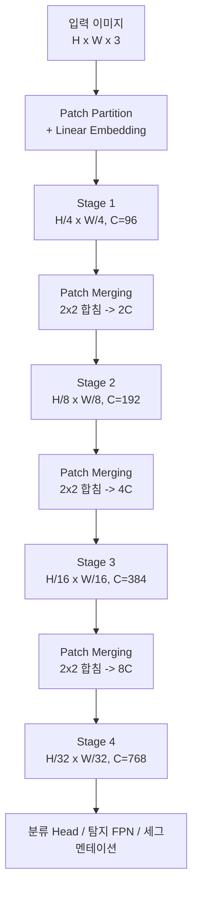

# Swin Transformer

> 계층적 윈도우 기반 어텐션

## 개요

[Vision Transformer(ViT)](./03-vit.md)는 이미지에 Transformer를 적용할 수 있음을 증명했지만, $O(n^2)$ 복잡도라는 숙제를 남겼습니다. 이 섹션에서는 이 문제를 **윈도우 기반 어텐션**으로 우아하게 해결하면서, CNN처럼 **계층적 특징 맵**까지 만들어내는 **Swin Transformer**를 배웁니다.

**선수 지식**: [ViT](./03-vit.md)의 패치 임베딩과 Self-Attention, [ResNet](../05-cnn-architectures/03-resnet.md)의 계층적 특징 추출
**학습 목표**:
- 윈도우 기반 Self-Attention이 왜 효율적인지 이해하기
- Shifted Window가 어떻게 윈도우 간 소통을 만드는지 파악하기
- Patch Merging으로 계층적 특징 맵을 생성하는 원리 알기
- ViT 대비 Swin Transformer의 강점을 실무 관점에서 비교하기

## 왜 알아야 할까?

ViT는 한 가지 치명적 한계가 있었습니다. 224×224 이미지를 16×16 패치로 나누면 196개 토큰이 생기는데, 모든 토큰 쌍의 관계를 계산하니 $196^2 = 38,416$번의 연산이 필요합니다. 해상도를 두 배로 올리면? 토큰이 4배, 연산량은 **16배**로 폭발합니다. 객체 탐지나 세그멘테이션처럼 고해상도가 필요한 작업에는 사실상 사용이 어려웠죠.

Swin Transformer는 이 문제를 해결하면서 **ICCV 2021 최우수 논문상(Marr Prize)**을 수상했습니다. 이후 객체 탐지, 세그멘테이션, 영상 분석 등에서 ResNet을 대체하는 **사실상의 표준 백본(backbone)**이 되었습니다.

## 핵심 개념

### 개념 1: 윈도우 기반 Self-Attention — "방 안에서만 대화하기"

> 📊 **그림 1**: ViT 글로벌 어텐션 vs Swin 윈도우 어텐션 비교




> 💡 **비유**: 학교 전교생 500명이 한 강당에서 토론하면 혼란스럽겠죠?(ViT의 글로벌 어텐션) 대신 30명씩 **교실(윈도우)**로 나누어 토론하면 훨씬 효율적입니다. 각 교실 안에서만 대화하니까요. 이것이 **Window-based Self-Attention(W-MSA)**의 아이디어입니다.

Swin Transformer는 이미지를 겹치지 않는 **고정 크기 윈도우**로 나눕니다:

- 윈도우 크기 $M = 7$ (7×7 패치 = 49개 토큰)
- 각 윈도우 안에서만 Self-Attention 계산
- 윈도우 수: $(H/M) \times (W/M)$개

계산량 비교가 핵심입니다:

| 방식 | 어텐션 범위 | 복잡도 | 56×56 패치 기준 |
|------|-----------|--------|----------------|
| ViT (글로벌) | 전체 패치 | $O(n^2)$ | $3136^2 ≈$ **1000만** |
| Swin (윈도우) | 윈도우 내 | $O(n \cdot M^2)$ | $3136 \times 49 ≈$ **15만** |

같은 해상도에서 **약 60배** 효율적입니다! 윈도우 크기 $M$은 상수이므로, 이미지 해상도가 커져도 복잡도가 **선형으로만** 증가합니다.

### 개념 2: Shifted Window — "교실 벽을 옮기는 마법"

윈도우 기반 어텐션에는 명확한 한계가 있습니다. 각 윈도우가 **고립된 섬**이 되어, 윈도우 경계를 넘는 정보 교환이 불가능하다는 점이죠.

> 💡 **비유**: 교실 벽 위치를 다음 수업 때 **절반만큼 옮겨보세요**. 아까 1반과 2반에 나뉘어 있던 학생들이 이제 같은 교실에 모이게 됩니다! 이것이 **Shifted Window Self-Attention(SW-MSA)**입니다.

동작 방식은 이렇습니다:

1. **L번째 레이어**: 정규 윈도우 분할로 W-MSA 수행
2. **L+1번째 레이어**: 윈도우를 $(M/2, M/2)$만큼 이동시켜 SW-MSA 수행
3. 이 두 레이어를 **번갈아** 반복

> 📊 **그림 2**: W-MSA와 SW-MSA의 교대 실행 흐름


시프트 후에는 원래 인접했지만 다른 윈도우에 속했던 패치들이 **같은 윈도우에 모이게** 됩니다. 이 방법으로 글로벌 어텐션 없이도 **전체 이미지에 걸친 정보 흐름**이 가능해집니다.

효율적 구현의 핵심은 **순환 시프트(cyclic shift)**입니다:

1. 이미지 특징 맵을 왼쪽 위로 $(M/2, M/2)$만큼 순환 이동
2. 일반 윈도우 분할 적용 (추가 윈도우 생성 불필요!)
3. **마스킹**으로 서로 다른 원래 윈도우의 패치끼리 어텐션되지 않도록 차단
4. 계산 후 역방향으로 이동하여 원래 위치 복원

이 트릭 덕분에 윈도우 수가 늘어나지 않아 **배치 연산 효율**이 유지됩니다.

> 📊 **그림 3**: 순환 시프트(Cyclic Shift) 구현 과정




### 개념 3: 계층적 구조와 Patch Merging — "피라미드 쌓기"

> 📊 **그림 4**: Swin Transformer 4단계 계층 구조와 Patch Merging




> 💡 **비유**: CNN의 풀링(Pooling)을 기억하시나요? 이미지를 점점 작게 줄이면서 더 넓은 영역의 특징을 잡아내는 것이었죠. Swin Transformer의 **Patch Merging**이 동일한 역할을 합니다. 4개의 이웃 패치를 하나로 합치면서, 채널 수를 늘려 더 풍부한 정보를 담습니다.

Swin Transformer는 **4단계(Stage)**의 계층적 구조를 가집니다:

| Stage | 해상도 | 채널 수 | Swin-T 레이어 수 |
|-------|--------|---------|----------------|
| Stage 1 | H/4 × W/4 | C (96) | 2 |
| Stage 2 | H/8 × W/8 | 2C (192) | 2 |
| Stage 3 | H/16 × W/16 | 4C (384) | 6 |
| Stage 4 | H/32 × W/32 | 8C (768) | 2 |

Stage 사이의 **Patch Merging** 과정:
1. 2×2 이웃 패치를 하나로 묶음 (4개 → 1개)
2. 채널을 이어 붙임: $C \rightarrow 4C$
3. 선형 레이어로 $4C \rightarrow 2C$로 축소

이 계층적 구조 덕분에 Swin Transformer는 CNN과 동일한 형태의 **피라미드 특징 맵**을 생성합니다. 이것이 왜 중요하냐면, [객체 탐지의 FPN](../07-object-detection/02-rcnn-family.md)이나 [세그멘테이션의 U-Net](../08-segmentation/01-semantic-segmentation.md) 같은 기존 프레임워크에 **그대로 끼워 넣을 수 있기** 때문입니다. 실제로 Swin Transformer는 [Mask2Former](../08-segmentation/03-panoptic-segmentation.md)의 기본 백본으로 채택되었고, [DETR 계열](../07-object-detection/05-detr.md)의 Deformable DETR에서도 백본으로 사용됩니다. ViT는 단일 스케일 출력이라 이런 통합이 어려웠죠.

### 개념 4: ViT vs Swin — 언제 뭘 쓸까?

| 특성 | ViT | Swin Transformer |
|------|-----|------------------|
| **복잡도** | $O(n^2)$ 이차 | $O(n)$ 선형 |
| **특징 스케일** | 단일 스케일 | 다중 스케일 (피라미드) |
| **어텐션 범위** | 전역 (모든 패치) | 지역 (윈도우) + 시프트 |
| **최적 용도** | 분류 (대규모 데이터) | [탐지](../07-object-detection/01-detection-basics.md), [세그멘테이션](../08-segmentation/01-semantic-segmentation.md), 범용 백본 |
| **고해상도** | 비효율적 | **효율적** |
| **기존 프레임워크 호환** | 어려움 | **ResNet 대체 가능** |

> 🔥 **실무 팁**: "어떤 비전 Transformer를 쓸까?" 고민된다면, **분류만** 할 때는 ViT 계열(DeiT, DINOv2)이, **탐지/세그멘테이션 등 다양한 다운스트림 작업**을 할 때는 Swin Transformer가 더 나은 선택입니다. 특히 기존 Detectron2, MMDetection 같은 프레임워크에서는 백본을 ResNet → Swin으로 바꾸기만 하면 됩니다.

## 실습: 직접 해보기

### 윈도우 분할과 Shifted Window 구현

```python
import torch
import torch.nn as nn

def window_partition(x, window_size):
    """
    특징 맵을 겹치지 않는 윈도우들로 분할합니다

    Args:
        x: (B, H, W, C) 형태의 특징 맵
        window_size: 윈도우 크기 M (예: 7)
    Returns:
        windows: (num_windows*B, M, M, C) 형태
    """
    B, H, W, C = x.shape
    x = x.view(B, H // window_size, window_size,
                   W // window_size, window_size, C)
    # (B, H//M, M, W//M, M, C) → (B, H//M, W//M, M, M, C) → (B*nW, M, M, C)
    windows = x.permute(0, 1, 3, 2, 4, 5).contiguous()
    windows = windows.view(-1, window_size, window_size, C)
    return windows

def window_reverse(windows, window_size, H, W):
    """
    윈도우들을 다시 원래 특징 맵으로 복원합니다
    """
    B = int(windows.shape[0] / (H * W / window_size / window_size))
    x = windows.view(B, H // window_size, W // window_size,
                     window_size, window_size, -1)
    x = x.permute(0, 1, 3, 2, 4, 5).contiguous()
    x = x.view(B, H, W, -1)
    return x

# 테스트: 14×14 특징 맵을 7×7 윈도우로 분할
B, H, W, C = 2, 14, 14, 96
x = torch.randn(B, H, W, C)
window_size = 7

windows = window_partition(x, window_size)
print(f"원본: {x.shape}")          # [2, 14, 14, 96]
print(f"윈도우: {windows.shape}")   # [8, 7, 7, 96] — 2배치 × 4윈도우 = 8

# 복원
restored = window_reverse(windows, window_size, H, W)
print(f"복원: {restored.shape}")    # [2, 14, 14, 96]
print(f"복원 일치: {torch.allclose(x, restored)}")  # True
```

### Swin Transformer Block 구현

```python
class WindowAttention(nn.Module):
    """
    윈도우 기반 Multi-Head Self-Attention
    윈도우 안의 패치들만 서로 어텐션합니다
    """
    def __init__(self, dim, window_size, num_heads):
        super().__init__()
        self.dim = dim
        self.window_size = window_size
        self.num_heads = num_heads
        head_dim = dim // num_heads
        self.scale = head_dim ** -0.5

        # 상대적 위치 편향 (Relative Position Bias)
        self.relative_position_bias_table = nn.Parameter(
            torch.zeros((2 * window_size - 1) * (2 * window_size - 1), num_heads)
        )
        nn.init.trunc_normal_(self.relative_position_bias_table, std=0.02)

        # 상대 위치 인덱스 계산
        coords = torch.stack(torch.meshgrid(
            torch.arange(window_size), torch.arange(window_size), indexing='ij'
        ))
        coords_flatten = torch.flatten(coords, 1)
        relative_coords = coords_flatten[:, :, None] - coords_flatten[:, None, :]
        relative_coords = relative_coords.permute(1, 2, 0).contiguous()
        relative_coords[:, :, 0] += window_size - 1
        relative_coords[:, :, 1] += window_size - 1
        relative_coords[:, :, 0] *= 2 * window_size - 1
        relative_position_index = relative_coords.sum(-1)
        self.register_buffer("relative_position_index", relative_position_index)

        self.qkv = nn.Linear(dim, dim * 3)
        self.proj = nn.Linear(dim, dim)

    def forward(self, x, mask=None):
        B_, N, C = x.shape  # B_: batch*num_windows, N: M*M, C: dim
        qkv = self.qkv(x).reshape(B_, N, 3, self.num_heads, C // self.num_heads)
        qkv = qkv.permute(2, 0, 3, 1, 4)
        q, k, v = qkv.unbind(0)

        # Scaled Dot-Product Attention
        attn = (q @ k.transpose(-2, -1)) * self.scale

        # 상대적 위치 편향 추가
        relative_position_bias = self.relative_position_bias_table[
            self.relative_position_index.view(-1)
        ].view(N, N, -1).permute(2, 0, 1).contiguous()
        attn = attn + relative_position_bias.unsqueeze(0)

        # 시프트 마스크 적용 (필요 시)
        if mask is not None:
            attn = attn + mask.unsqueeze(1)

        attn = attn.softmax(dim=-1)
        x = (attn @ v).transpose(1, 2).reshape(B_, N, C)
        x = self.proj(x)
        return x

class SwinTransformerBlock(nn.Module):
    """
    Swin Transformer Block 하나
    W-MSA 또는 SW-MSA + FFN으로 구성
    """
    def __init__(self, dim, num_heads, window_size=7, shift_size=0, mlp_ratio=4.0):
        super().__init__()
        self.dim = dim
        self.window_size = window_size
        self.shift_size = shift_size

        self.norm1 = nn.LayerNorm(dim)
        self.attn = WindowAttention(dim, window_size, num_heads)
        self.norm2 = nn.LayerNorm(dim)

        mlp_hidden = int(dim * mlp_ratio)
        self.mlp = nn.Sequential(
            nn.Linear(dim, mlp_hidden),
            nn.GELU(),
            nn.Linear(mlp_hidden, dim),
        )

    def forward(self, x, H, W):
        B, L, C = x.shape
        shortcut = x

        x = self.norm1(x)
        x = x.view(B, H, W, C)

        # Shifted Window: 순환 시프트 적용
        if self.shift_size > 0:
            shifted_x = torch.roll(x, shifts=(-self.shift_size, -self.shift_size), dims=(1, 2))
        else:
            shifted_x = x

        # 윈도우 분할 → 어텐션 → 윈도우 복원
        windows = window_partition(shifted_x, self.window_size)
        windows = windows.view(-1, self.window_size * self.window_size, C)
        attn_windows = self.attn(windows)
        attn_windows = attn_windows.view(-1, self.window_size, self.window_size, C)
        shifted_x = window_reverse(attn_windows, self.window_size, H, W)

        # 시프트 복원
        if self.shift_size > 0:
            x = torch.roll(shifted_x, shifts=(self.shift_size, self.shift_size), dims=(1, 2))
        else:
            x = shifted_x

        x = x.view(B, H * W, C)

        # 잔차 연결 + FFN
        x = shortcut + x
        x = x + self.mlp(self.norm2(x))

        return x

# 테스트
dim = 96
block_regular = SwinTransformerBlock(dim=dim, num_heads=3, window_size=7, shift_size=0)
block_shifted = SwinTransformerBlock(dim=dim, num_heads=3, window_size=7, shift_size=3)

x = torch.randn(2, 56 * 56, dim)  # Stage 1: 56×56 해상도
out1 = block_regular(x, H=56, W=56)
out2 = block_shifted(out1, H=56, W=56)
print(f"입력: {x.shape}")          # [2, 3136, 96]
print(f"W-MSA 후: {out1.shape}")    # [2, 3136, 96]
print(f"SW-MSA 후: {out2.shape}")   # [2, 3136, 96]
```

### 사전학습 Swin 모델 사용하기

```python
import torch
from torchvision import models

# torchvision의 사전학습된 Swin-T 모델 로드
weights = models.Swin_T_Weights.IMAGENET1K_V1
model = models.swin_t(weights=weights)
model.eval()

# 테스트 이미지 추론
dummy = torch.randn(1, 3, 224, 224)
with torch.no_grad():
    output = model(dummy)

print(f"Swin-T 출력: {output.shape}")  # [1, 1000] — ImageNet 1000 클래스
print(f"파라미터 수: {sum(p.numel() for p in model.parameters()):,}")  # ~28M
```

## 더 깊이 알아보기

### ICCV 2021 최우수 논문상 — Marr Prize

Swin Transformer는 2021년 ICCV(International Conference on Computer Vision)에서 **최우수 논문상(Marr Prize)**을 수상했습니다. 이 상은 컴퓨터 비전 분야에서 가장 권위 있는 상 중 하나인데요, Microsoft Research Asia의 Ze Liu 등이 저자입니다.

수상 이유는 명확했습니다. ViT가 "합성곱 없이도 된다"는 것을 보여줬다면, Swin은 "Transformer로 CNN이 하는 **모든 것**을 대체할 수 있다"는 것을 증명했기 때문입니다. 분류뿐 아니라 탐지, 세그멘테이션, 비디오 분석까지, Swin은 거의 모든 벤치마크에서 기존 CNN 백본을 능가했습니다. [COCO 객체 탐지](../07-object-detection/01-detection-basics.md), [ADE20K 세그멘테이션](../08-segmentation/01-semantic-segmentation.md) 등에서 새로운 기록을 세웠죠.

### Swin Transformer V2 (2022)

V2에서는 대규모 모델을 위한 중요한 개선이 이뤄졌습니다:

- **스케일업**: 최대 **30억 파라미터**까지 확장
- **고해상도**: **1536×1536** 이미지 학습 가능
- **Cosine Attention**: 기존 내적 대신 코사인 유사도로 학습 안정성 확보
- **Log-CPB**: 서로 다른 해상도 간 위치 편향 전이 가능

## 흔한 오해와 팁

> ⚠️ **흔한 오해**: "Shifted Window는 슬라이딩 윈도우다" — 슬라이딩 윈도우는 겹치는 영역이 있어 계산량이 늘어나지만, Shifted Window는 순환 시프트 + 마스킹으로 **추가 계산 없이** 윈도우 간 소통을 구현합니다. 근본적으로 다른 메커니즘입니다.

> 💡 **알고 계셨나요?**: Swin Transformer의 "Swin"은 **S**hifted **Win**dow의 약자입니다. 이 간단한 아이디어가 어텐션의 이차 복잡도를 선형으로 줄인 것이 핵심 기여입니다.

> 🔥 **실무 팁**: 기존에 ResNet-50 백본을 쓰던 객체 탐지 파이프라인이 있다면, 백본만 Swin-T로 교체해 보세요. 파라미터 수는 비슷(ResNet-50: 25M, Swin-T: 29M)하면서 COCO에서 **+3.6 AP** 향상을 기대할 수 있습니다.

> ⚠️ **흔한 오해**: "Swin은 항상 ViT보다 낫다" — 순수 이미지 분류 + 대규모 데이터 조건에서는 ViT의 글로벌 어텐션이 더 유리할 수 있습니다. Swin의 강점은 **고해상도 + 다운스트림 작업 다양성**입니다.

## 핵심 정리

| 개념 | 설명 |
|------|------|
| Window Attention | 고정 크기 윈도우(7×7) 내에서만 어텐션 → $O(n)$ 복잡도 |
| Shifted Window | 윈도우를 절반씩 이동하여 인접 윈도우 간 정보 교환 |
| 순환 시프트 | 효율적 구현 — 추가 윈도우 생성 없이 배치 연산 유지 |
| Patch Merging | 2×2 패치를 합쳐 해상도↓ 채널↑ — CNN 풀링과 유사 |
| 4단계 피라미드 | H/4 → H/8 → H/16 → H/32 계층적 특징 맵 생성 |
| 상대적 위치 편향 | 절대 위치 대신 패치 간 상대적 거리 기반 편향 사용 |
| Swin-T | 29M 파라미터, ResNet-50 대체 가능한 효율적 모델 |

## 다음 섹션 미리보기

ViT와 Swin Transformer로 "순수 Transformer" 비전 모델을 배웠습니다. 하지만 CNN과 Transformer를 **함께** 쓰면 어떨까요? 다음 [하이브리드 모델들](./05-hybrid-models.md)에서는 CNN의 로컬 특징 추출 능력과 Transformer의 글로벌 관계 파악 능력을 결합한 모델들을 살펴봅니다.

## 참고 자료

- [Swin Transformer: Hierarchical Vision Transformer using Shifted Windows (Liu et al., 2021)](https://arxiv.org/abs/2103.14030) - 원본 논문, ICCV 2021 최우수 논문
- [Swin Transformer V2 (Liu et al., 2022)](https://arxiv.org/abs/2111.09883) - 30억 파라미터 확장과 해상도 전이
- [Microsoft Swin Transformer GitHub](https://github.com/microsoft/Swin-Transformer) - 공식 코드와 사전학습 모델
- [Lightly AI - Swin Transformer Explained (2024)](https://www.lightly.ai/blog/swin-transformer) - 윈도우 메커니즘의 시각적 설명
- [Hugging Face - Swin Transformer 코스](https://huggingface.co/learn/computer-vision-course/en/unit3/vision-transformers/swin-transformer) - 단계별 해설
- [Swin vs ViT 비교 (Alta3)](https://blog.alta3.com/topics/ai-engineers/swin-vs-vit/index.html) - 두 모델의 실전 비교
