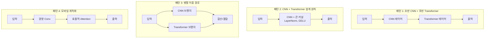
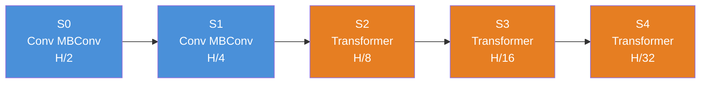
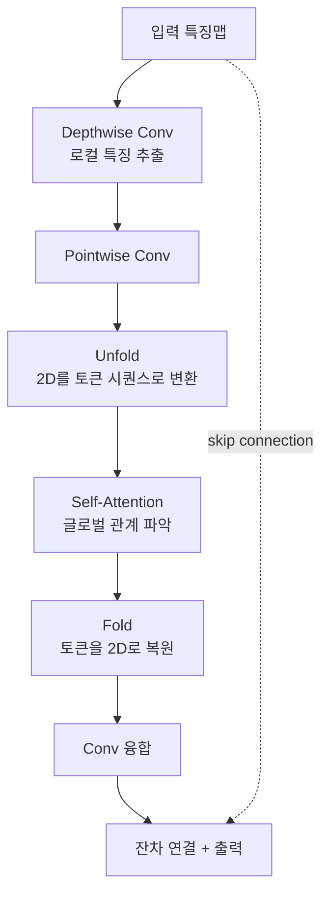
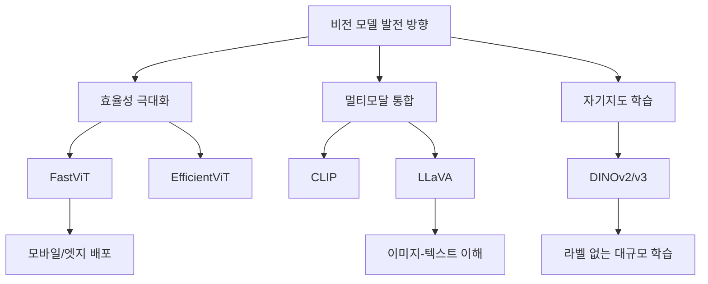

# 하이브리드 모델들

> CNN과 Transformer의 결합

## 개요

지금까지 CNN의 세계([LeNet부터 ConvNeXt](../05-cnn-architectures/01-lenet-alexnet.md))와 Transformer의 세계([ViT](./03-vit.md), [Swin](./04-swin-transformer.md))를 따로 배웠습니다. 그런데 꼭 하나만 골라야 할까요? 이 섹션에서는 CNN의 **로컬 특징 추출 능력**과 Transformer의 **글로벌 관계 파악 능력**을 동시에 활용하는 **하이브리드 모델**들을 살펴봅니다.

**선수 지식**: [CNN 아키텍처의 진화](../05-cnn-architectures/01-lenet-alexnet.md), [ViT](./03-vit.md)의 패치 임베딩, [Swin Transformer](./04-swin-transformer.md)의 윈도우 어텐션
**학습 목표**:
- CNN과 Transformer를 결합하는 주요 설계 패턴 이해하기
- CoAtNet, ConvNeXt, MobileViT 등 대표 하이브리드 모델 파악하기
- 실무에서 모델을 선택하는 기준 세우기
- 2025년 비전 모델의 발전 방향 전망하기

## 왜 알아야 할까?

"CNN이 좋을까, Transformer가 좋을까?"는 2020년대 컴퓨터 비전의 가장 뜨거운 논쟁이었습니다. 하지만 2025년 현재, 정답은 의외로 **"둘 다"**에 가깝습니다.

실무에서는 순수 ViT나 순수 CNN보다 **두 가지를 적절히 조합한 모델**이 더 좋은 성능-효율 균형을 보여주는 경우가 많거든요. 모바일 앱을 만든다면 MobileViT나 FastViT가, 서버에서 최고 성능을 원한다면 CoAtNet이, "Transformer 못지않은 CNN"을 원한다면 ConvNeXt가 답이 될 수 있습니다.

어떤 모델을 **언제, 왜** 선택해야 하는지 아는 것이 실전에서 가장 중요한 능력입니다.

## 핵심 개념

### 개념 1: 하이브리드의 설계 철학 — "각자 잘하는 걸 하자"

> 💡 **비유**: 축구 팀을 만들 때 수비수만 11명 뽑거나 공격수만 11명 뽑지 않죠. 수비수(CNN)가 튼튼하게 방어하고, 미드필더(하이브리드 레이어)가 연결하고, 공격수(Transformer)가 골을 넣는 것처럼, 각 위치에 최적화된 선수를 배치하는 것이 가장 효과적입니다.

CNN과 Transformer는 상반된 특성을 가지고 있습니다:

| 특성 | CNN | Transformer |
|------|-----|-------------|
| 수용 영역 | 좁음 (로컬) | 넓음 (글로벌) |
| 귀납적 편향 | 강함 (이동불변성, 지역성) | 약함 |
| 저수준 특징 | **강함** | 약함 |
| 고수준 관계 | 약함 | **강함** |
| 계산 효율 | 높음 | 낮음 ($O(n^2)$) |
| 데이터 효율 | **높음** (적은 데이터 OK) | 낮음 (대규모 필요) |

이 특성을 조합하는 대표적인 패턴 4가지가 있습니다:

> 📊 **그림 1**: 하이브리드 모델의 4가지 설계 패턴




**패턴 1: 초반 CNN + 후반 Transformer**
- 초기 레이어에서 CNN으로 로컬 특징 추출
- 깊은 레이어에서 Transformer로 글로벌 관계 파악
- 대표: **CoAtNet**, **LeViT**

**패턴 2: CNN에 Transformer 설계 원칙 적용**
- 합성곱은 유지하되, Transformer의 훈련 기법과 구조를 차용
- 대표: **ConvNeXt**

**패턴 3: 병렬 이중 경로**
- CNN 브랜치와 Transformer 브랜치가 병렬로 처리
- 대표: 일부 의료 영상 모델

**패턴 4: 모바일 최적화 설계**
- 효율적 어텐션 메커니즘 + 경량 합성곱 결합
- 대표: **MobileViT**, **EfficientFormer**, **FastViT**

### 개념 2: ConvNeXt — "Transformer 시대의 순수 CNN"

> 💡 **비유**: "Transformer가 인기라고? CNN도 얼마든지 할 수 있어!" — ConvNeXt는 이런 반골 정신에서 탄생했습니다. 합성곱 연산은 그대로 두되, Transformer에서 효과적이었던 **훈련 기법과 설계 원칙**만 가져온 것이죠.

[ConvNeXt](../05-cnn-architectures/06-convnext.md)는 Ch05에서 이미 배웠지만, 하이브리드 관점에서 다시 살펴볼 가치가 있습니다.

ResNet에서 시작하여 Swin Transformer의 설계 요소를 하나씩 적용한 결과:

> 📊 **그림 4**: ConvNeXt의 진화 — ResNet에서 Transformer 설계 원칙 적용


1. **Patchify Stem**: 4×4 비겹침 합성곱으로 시작 (ViT의 패치 분할과 동일)
2. **큰 커널**: 3×3 → **7×7** Depthwise Convolution (Swin의 7×7 윈도우에 대응)
3. **Inverted Bottleneck**: 채널을 4배 확장 후 축소 (Transformer FFN과 동일)
4. **LayerNorm**: BatchNorm 대신 LayerNorm 사용
5. **GELU 활성화**: ReLU 대신 GELU
6. **적은 정규화**: Transformer처럼 블록당 하나의 정규화만

결과적으로 ConvNeXt는 **어텐션 메커니즘 없이도** Swin Transformer와 동등하거나 더 나은 성능을 달성했습니다.

| 모델 | ImageNet Top-1 | 파라미터 | 처리량 |
|------|---------------|---------|--------|
| Swin-B (384²) | 86.4% | 88M | 기준 |
| ConvNeXt-B (384²) | **87.0%** | 89M | 12.5% 빠름 |

> 💡 **알고 계셨나요?**: ConvNeXt 논문 "A ConvNet for the 2020s"는 제목부터 도발적이었습니다. "Transformer 시대에 CNN도 충분히 경쟁력 있다"는 메시지를 담은 것이죠. 이 논문은 "CNN vs Transformer" 논쟁이 기술 자체가 아니라 **설계 선택의 문제**임을 보여줬습니다.

### 개념 3: CoAtNet — "합성곱과 어텐션의 결혼"

> 💡 **비유**: 마라톤에서 전반부는 페이스메이커(CNN)가 안정적으로 이끌고, 후반부에서 에이스 선수(Transformer)가 스퍼트를 올리는 전략이에요.

CoAtNet(Coatnet = **Co**nvolution + **At**tention + **Net**work)은 Google Research에서 2021년에 발표한 모델로, 합성곱과 어텐션을 **수직적으로 쌓는** 방식을 체계적으로 연구했습니다.

핵심 발견:
- **초반 레이어**: 합성곱이 훨씬 효과적 (로컬 패턴 추출에 강점)
- **후반 레이어**: 어텐션이 더 효과적 (글로벌 관계 파악에 강점)
- **점진적 전환**: Conv → Conv → Attention → Attention 순서가 최적

CoAtNet의 구조:

| Stage | 해상도 | 연산 | 역할 |
|-------|--------|------|------|
| S0 | H/2 | Conv (MBConv) | 저수준 특징 추출 |
| S1 | H/4 | Conv (MBConv) | 로컬 패턴 인식 |
| S2 | H/8 | Transformer | 중간 수준 관계 학습 |
| S3 | H/16 | Transformer | 고수준 글로벌 이해 |
| S4 | H/32 | Transformer | 최종 표현 |

> 📊 **그림 2**: CoAtNet의 단계별 구조 — Conv에서 Transformer로 점진적 전환




### 개념 4: 모바일 하이브리드 — "스마트폰에서도 Transformer를"

모바일 기기에서 ViT를 실행하는 것은 현실적으로 어렵습니다. 하지만 하이브리드 설계로 효율성을 극대화한 모델들이 있습니다.

**MobileViT (Apple, 2022)**

> 💡 **비유**: 돋보기(합성곱)로 가까운 곳을 자세히 본 다음, 망원경(어텐션)으로 멀리까지 한 번 살핀 뒤, 다시 돋보기로 세부 사항을 확인하는 과정을 반복합니다.

- 합성곱으로 로컬 특징 추출 → Transformer로 글로벌 관계 파악

> 📊 **그림 3**: MobileViT 블록의 처리 흐름



- **6M 파라미터**로 ImageNet 78.4% 달성
- MobileNetV3보다 3.2% 높은 정확도

**FastViT (Apple, 2023)**

- **RepMixer**: 학습 시에는 복잡한 구조, 추론 시에는 단순화(Reparameterization)
- ConvNeXt보다 **1.9배**, EfficientNet보다 **4.9배** 빠른 모바일 추론
- 정확도는 유지하면서 지연시간 대폭 감소

**EfficientFormer (Snap Research, 2022)**

- "Transformer가 MobileNet만큼 빠를 수 있을까?"라는 질문에서 출발
- MobileNetV2 대비 유사한 지연시간으로 **+4% 정확도**

### 개념 5: 모델 선택 가이드 — "나에게 맞는 모델은?"

2025년 기준, 상황별 추천 모델을 정리합니다:

| 상황 | 추천 모델 | 이유 |
|------|----------|------|
| **최고 정확도** (서버, 대규모 데이터) | ViT-L/H, CoAtNet | 글로벌 어텐션의 압도적 성능 |
| **[탐지](../07-object-detection/01-detection-basics.md)/[세그멘테이션](../08-segmentation/01-semantic-segmentation.md) 백본** | Swin-T/B | 계층적 특징, [FPN](../07-object-detection/02-rcnn-family.md) 호환 |
| **범용 (균형잡힌 선택)** | ConvNeXt-B | 높은 정확도 + 빠른 속도 + 쉬운 파인튜닝 |
| **모바일 앱** | MobileViT, FastViT | 경량 + 합리적 정확도 |
| **실시간 엣지 추론** | EfficientFormer, EdgeViT | 최소 지연시간 |
| **소규모 데이터** | ConvNeXt, EfficientNet | CNN 편향이 과적합 방지 |
| **자기지도 학습** | DINOv2 (ViT) | 라벨 없이 강력한 특징 학습 |

> 🔥 **실무 팁**: 모델 선택에 고민된다면 **ConvNeXt-Base**부터 시작해 보세요. Transformer급 성능에 CNN의 친숙한 구조를 가지고 있어 디버깅과 파인튜닝이 쉽고, torchvision이나 timm 라이브러리에서 바로 사용할 수 있습니다.

## 실습: 직접 해보기

### 다양한 모델 성능 비교하기

```python
import torch
import time
from torchvision import models

def benchmark_model(model, input_size=(1, 3, 224, 224), num_runs=50):
    """모델의 추론 속도와 파라미터 수를 측정합니다"""
    model.eval()
    x = torch.randn(*input_size)

    # 파라미터 수
    params = sum(p.numel() for p in model.parameters()) / 1e6

    # 워밍업
    with torch.no_grad():
        for _ in range(10):
            _ = model(x)

    # 속도 측정
    times = []
    with torch.no_grad():
        for _ in range(num_runs):
            start = time.time()
            _ = model(x)
            times.append(time.time() - start)

    avg_time = sum(times) / len(times) * 1000  # ms로 변환
    return params, avg_time

# 여러 모델 비교
model_configs = {
    "ResNet-50": models.resnet50(weights=None),
    "ConvNeXt-T": models.convnext_tiny(weights=None),
    "Swin-T": models.swin_t(weights=None),
    "ViT-B/16": models.vit_b_16(weights=None),
    "EfficientNet-B0": models.efficientnet_b0(weights=None),
}

print(f"{'모델':20s} | {'파라미터(M)':>12s} | {'추론 시간(ms)':>14s}")
print("-" * 55)

for name, model in model_configs.items():
    params, latency = benchmark_model(model)
    print(f"{name:20s} | {params:>10.1f}M | {latency:>12.1f}ms")
```

### ConvNeXt로 이미지 분류 파인튜닝

```python
import torch
import torch.nn as nn
from torchvision import models

# 사전학습된 ConvNeXt-Tiny 로드
weights = models.ConvNeXt_Tiny_Weights.IMAGENET1K_V1
model = models.convnext_tiny(weights=weights)

# 분류 헤드를 커스텀 클래스 수로 교체 (예: 10 클래스)
num_classes = 10
model.classifier[2] = nn.Linear(model.classifier[2].in_features, num_classes)

# 파인튜닝 전략: 백본 동결 → 분류 헤드만 학습
for param in model.features.parameters():
    param.requires_grad = False  # 백본 동결

# 학습 가능한 파라미터만 확인
trainable = sum(p.numel() for p in model.parameters() if p.requires_grad)
total = sum(p.numel() for p in model.parameters())
print(f"전체 파라미터: {total:,}")
print(f"학습 가능: {trainable:,} ({trainable/total*100:.1f}%)")

# 옵티마이저 설정 (학습 가능한 파라미터만)
optimizer = torch.optim.AdamW(
    filter(lambda p: p.requires_grad, model.parameters()),
    lr=1e-3,
    weight_decay=0.05
)

# 테스트 추론
model.eval()
dummy = torch.randn(1, 3, 224, 224)
with torch.no_grad():
    output = model(dummy)
    print(f"출력 크기: {output.shape}")  # [1, 10]
    print(f"예측 클래스: {output.argmax(dim=1).item()}")
```

### MobileViT 스타일의 경량 하이브리드 구현

```python
import torch
import torch.nn as nn

class MobileViTBlock(nn.Module):
    """
    간소화된 MobileViT 블록
    로컬 처리(Conv) → 글로벌 처리(Attention) → 로컬 융합(Conv)
    """
    def __init__(self, dim, num_heads=4, kernel_size=3):
        super().__init__()

        # 1) 로컬 특징 추출 (Depthwise Conv)
        self.local_rep = nn.Sequential(
            nn.Conv2d(dim, dim, kernel_size, padding=kernel_size // 2, groups=dim),
            nn.BatchNorm2d(dim),
            nn.SiLU(),
            nn.Conv2d(dim, dim, 1),  # Pointwise Conv
        )

        # 2) 글로벌 관계 파악 (Self-Attention)
        self.norm = nn.LayerNorm(dim)
        self.attention = nn.MultiheadAttention(
            embed_dim=dim, num_heads=num_heads, batch_first=True
        )

        # 3) 로컬 융합 (Conv로 마무리)
        self.fusion = nn.Sequential(
            nn.Conv2d(dim, dim, 1),
            nn.BatchNorm2d(dim),
        )

    def forward(self, x):
        B, C, H, W = x.shape

        # 로컬 처리
        local_out = self.local_rep(x)

        # 글로벌 처리: (B, C, H, W) → (B, H*W, C)로 변환
        tokens = local_out.flatten(2).transpose(1, 2)
        tokens = self.norm(tokens)
        attn_out, _ = self.attention(tokens, tokens, tokens)

        # 다시 2D로 변환: (B, H*W, C) → (B, C, H, W)
        global_out = attn_out.transpose(1, 2).view(B, C, H, W)

        # 융합 + 잔차 연결
        out = self.fusion(global_out) + x
        return out

# 테스트
block = MobileViTBlock(dim=64, num_heads=4)
x = torch.randn(2, 64, 14, 14)
out = block(x)
print(f"입력: {x.shape}")    # [2, 64, 14, 14]
print(f"출력: {out.shape}")   # [2, 64, 14, 14]
print(f"파라미터: {sum(p.numel() for p in block.parameters()):,}")
```

## 더 깊이 알아보기

### CNN vs Transformer 논쟁의 결말

2020년 ViT가 등장했을 때, 많은 연구자들이 "CNN의 시대는 끝났다"고 예측했습니다. 하지만 2022년 ConvNeXt가 등장하면서 상황이 역전되었죠. 순수 CNN도 Transformer의 설계 원칙을 빌려오면 동등한 성능을 낼 수 있다는 것이 증명된 겁니다.

그 이후 분야의 합의는 이렇게 정리되고 있습니다:

1. **"무엇"보다 "어떻게"가 중요**: 합성곱이냐 어텐션이냐보다, 훈련 기법과 설계 원칙이 성능을 더 크게 좌우한다
2. **귀납적 편향은 양면의 검**: 적은 데이터에서는 도움이 되지만, 충분한 데이터에서는 오히려 제한이 될 수 있다
3. **하이브리드가 실용적**: 실무에서는 순수 모델보다 장점만 취한 하이브리드가 더 유용한 경우가 많다

### 2025년의 방향: 그 너머로

> 📊 **그림 5**: 2025년 비전 모델 발전의 세 가지 방향




현재 비전 모델의 발전 방향은 크게 세 가지입니다:

- **효율성 극대화**: 모바일/엣지 기기를 위한 경량 하이브리드 모델 (FastViT, EfficientViT)
- **멀티모달 통합**: 이미지-텍스트 통합 모델의 주류화 (CLIP, LLaVA) → [Ch10 Vision-Language](../10-vision-language/01-multimodal-learning.md)에서 다룹니다
- **자기지도 학습**: 라벨 없이 대규모 데이터로 학습 (DINOv2/v3)

## 흔한 오해와 팁

> ⚠️ **흔한 오해**: "Transformer가 항상 CNN보다 낫다" — ConvNeXt가 보여줬듯이, 적절한 설계 원칙만 적용하면 CNN도 Transformer와 동등한 성능을 냅니다. 핵심은 아키텍처 자체가 아니라 **설계 선택**입니다.

> 💡 **알고 계셨나요?**: Apple은 MobileViT와 FastViT를 자체 개발하여 iPhone에서의 온디바이스 AI에 활용하고 있습니다. "Transformer를 모바일에서 돌릴 수 있을까?"라는 질문에 Apple이 먼저 답을 내놓은 셈이죠.

> 🔥 **실무 팁**: 새 프로젝트를 시작할 때 모델 선택 순서는 이렇습니다. 먼저 **torchvision이나 timm의 사전학습 모델**로 빠르게 베이스라인을 잡고, 성능이 부족하면 더 큰 모델로, 속도가 부족하면 경량 모델로 전환하세요. 처음부터 SOTA 모델을 구현하는 것은 비효율적입니다.

> ⚠️ **흔한 오해**: "하이브리드 모델은 CNN보다 무조건 느리다" — FastViT는 EfficientNet보다 4.9배, ConvNeXt보다 1.9배 빠르면서 비슷한 정확도를 냅니다. 설계에 따라 순수 CNN보다 빠른 하이브리드도 충분히 가능합니다.

## 핵심 정리

| 개념 | 설명 |
|------|------|
| 하이브리드 모델 | CNN의 로컬 강점 + Transformer의 글로벌 강점을 결합 |
| 초반 Conv + 후반 Attention | 가장 일반적인 하이브리드 패턴 (CoAtNet 등) |
| ConvNeXt | Transformer 설계 원칙을 차용한 순수 CNN — Swin과 동등 성능 |
| CoAtNet | Conv와 Attention을 수직으로 쌓아 최적 조합 탐색 |
| MobileViT | Apple의 모바일 하이브리드 — 6M 파라미터로 78.4% |
| FastViT | RepMixer로 추론 최적화 — 모바일에서 EfficientNet의 4.9배 속도 |
| EfficientFormer | MobileNet급 속도 + Transformer급 정확도 |
| 모델 선택 핵심 | "어떤 연산"보다 "어떻게 조합하느냐"가 성능을 결정 |

## 다음 단계 미리보기

Chapter 9 Vision Transformer를 완주했습니다! 어텐션 메커니즘부터 하이브리드 모델까지, 현대 비전 모델의 핵심을 모두 다뤘습니다. 다음 [Chapter 10: Vision-Language 모델](../10-vision-language/01-multimodal-learning.md)에서는 이미지와 텍스트를 **동시에 이해**하는 멀티모달 모델의 세계로 들어갑니다. Transformer가 비전과 언어를 어떻게 연결하는지, CLIP과 LLaVA가 어떻게 작동하는지 알아봅시다.

## 참고 자료

- [CoAtNet: Marrying Convolution and Attention (Dai et al., 2021)](https://arxiv.org/abs/2106.04803) - Conv+Attention 최적 조합을 체계적으로 연구한 논문
- [A ConvNet for the 2020s (Liu et al., 2022)](https://arxiv.org/abs/2201.03545) - ConvNeXt 논문, CNN의 반격
- [MobileViT: Light-weight Vision Transformer (Mehta et al., 2022)](https://arxiv.org/abs/2110.02178) - Apple의 모바일 하이브리드 모델
- [FastViT: A Fast Hybrid Vision Transformer (Apple, 2023)](https://machinelearning.apple.com/research/fastvit) - Apple의 초고속 하이브리드
- [EfficientViT: Multi-Scale Linear Attention (MIT Han Lab)](https://github.com/mit-han-lab/efficientvit) - MIT의 효율적 비전 Transformer
- [Vision Transformers vs CNNs: Who Leads Vision in 2025?](https://aicompetence.org/vision-transformers-vs-cnns/) - 2025년 기준 비전 모델 비교 분석
