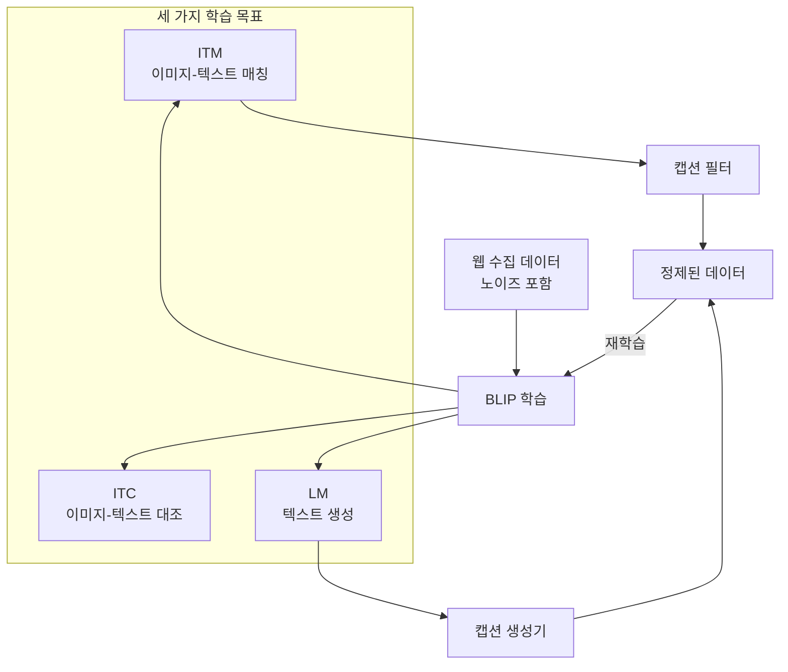
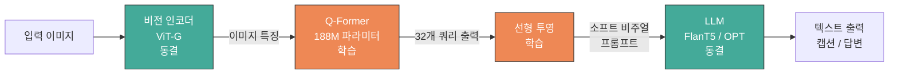
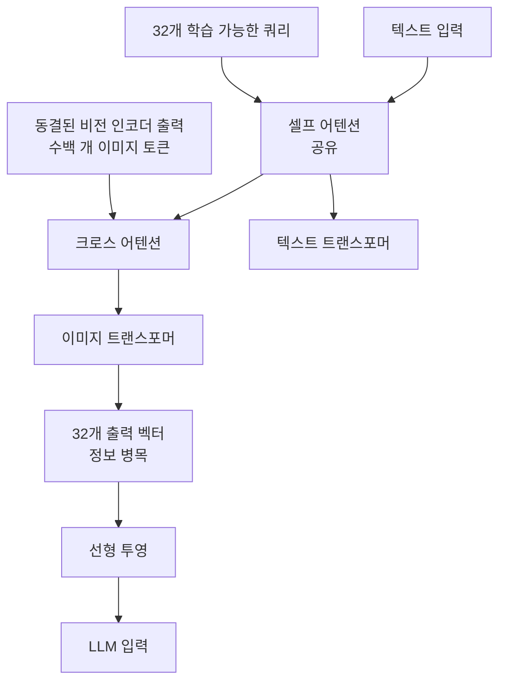
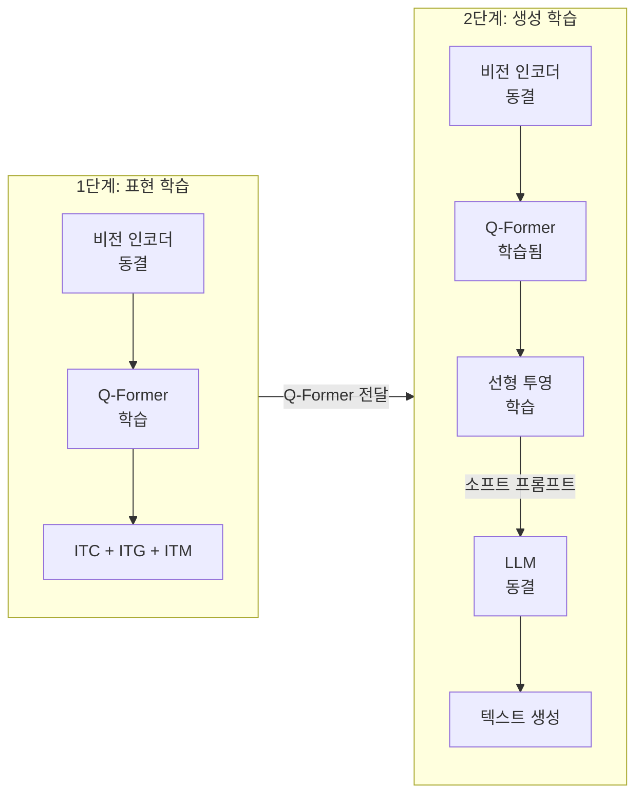
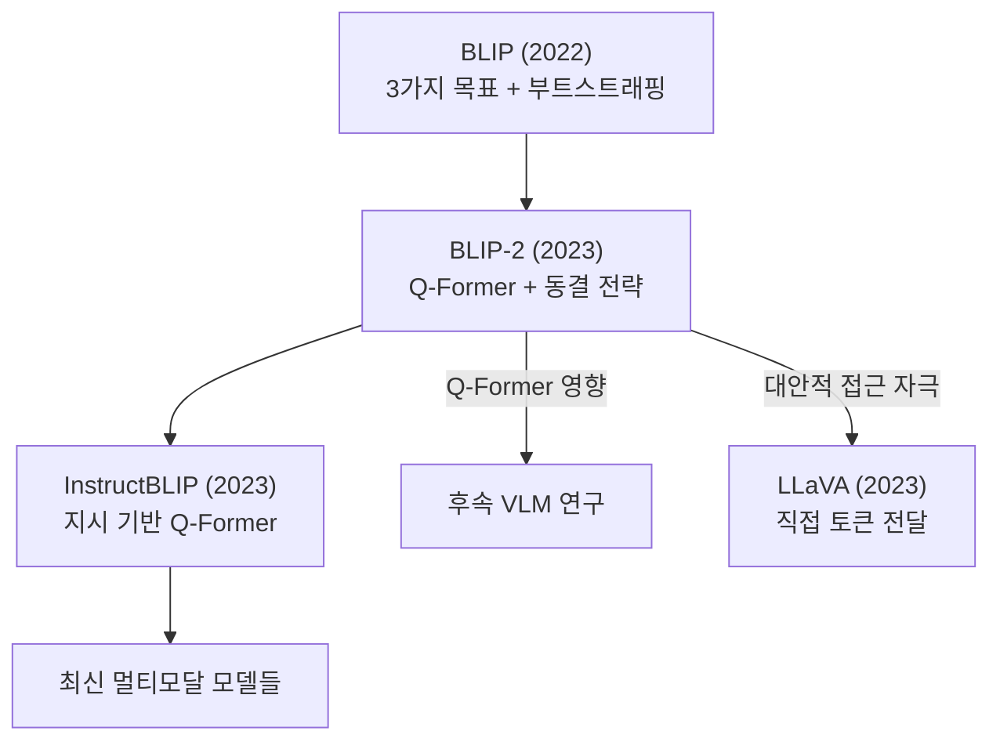

# BLIP과 BLIP-2

> 부트스트래핑 기반 사전학습

## 개요

이 섹션에서는 이미지를 **이해하면서 동시에 설명까지 생성**할 수 있는 BLIP과 BLIP-2를 다룹니다. 앞서 배운 CLIP이 "이미지와 텍스트를 매칭"하는 데 뛰어났다면, BLIP 시리즈는 여기에 캡셔닝(이미지 설명 생성), VQA(시각적 질의응답) 같은 **생성 능력**까지 더한 모델입니다.

**선수 지식**: [CLIP](./02-clip.md)의 대조 학습 원리, [어텐션 메커니즘](09-vision-transformer/01-attention-mechanism.md)의 크로스 어텐션
**학습 목표**:
- BLIP의 세 가지 학습 목표(대조, 매칭, 생성)를 이해한다
- BLIP-2의 Q-Former가 어떤 문제를 해결하는지 설명할 수 있다
- 2단계 부트스트래핑 학습 전략의 의미를 파악한다
- BLIP-2로 이미지 캡셔닝과 VQA를 코드로 수행할 수 있다

## 왜 알아야 할까?

CLIP은 사진을 보고 "이건 고양이 사진과 90% 비슷해"라고 말할 수 있지만, "소파 위에 주황색 고양이가 낮잠을 자고 있다"라는 **자연스러운 문장을 생성**하지는 못합니다. 또한 "이 고양이는 무슨 색이야?"라는 질문에 답하지도 못하죠.

BLIP과 BLIP-2는 이 한계를 돌파합니다. 특히 BLIP-2는 **이미 학습된 거대 모델들을 동결(freeze)한 채로** 가벼운 연결 모듈(Q-Former)만 학습하여, 적은 비용으로 강력한 멀티모달 능력을 달성했습니다. 188M 파라미터만 학습하고도 540배 큰 Flamingo 80B를 능가한 것은 AI 분야에서 큰 화제가 되었습니다.

## 핵심 개념

### 개념 1: BLIP — 세 마리 토끼를 잡다

> 📊 **그림 1**: BLIP의 세 가지 학습 목표와 부트스트래핑 데이터 정제 흐름




> 💡 **비유**: CLIP이 "사진과 설명을 매칭하는 퀴즈쇼 참가자"라면, BLIP은 "사진을 보고 설명도 쓰고, 질문에도 답하고, 매칭도 하는 만능 예능인"입니다.

BLIP(Bootstrapping Language-Image Pre-training, 2022, Salesforce)의 핵심은 하나의 모델로 **세 가지 과제**를 동시에 학습한다는 점입니다:

| 학습 목표 | 하는 일 | CLIP과의 비교 |
|----------|--------|-------------|
| **ITC** (Image-Text Contrastive) | 이미지-텍스트 쌍의 유사도 학습 | CLIP과 동일한 원리 |
| **ITM** (Image-Text Matching) | 이미지-텍스트가 진짜 쌍인지 이진 분류 | CLIP에는 없음 |
| **LM** (Language Modeling) | 이미지를 보고 텍스트 생성 (캡셔닝) | CLIP에는 없음 |

여기서 BLIP의 독특한 점은 **부트스트래핑(Bootstrapping)** 전략입니다. 인터넷에서 수집한 이미지-텍스트 쌍은 노이즈가 많습니다(이미지와 관련 없는 캡션 등). BLIP은 자신이 학습한 모델로 기존 캡션의 품질을 평가하고(필터), 새로운 캡션을 생성하여(생성기) 데이터를 정제합니다. 즉, **스스로 학습 데이터를 개선**하는 거죠.

> 💡 **비유**: 노이즈가 많은 데이터로 공부한 뒤, 스스로 "이 참고서는 틀린 내용이 있네?"하고 걸러내고, "더 정확한 요약 노트"를 직접 만들어서 다시 공부하는 것과 같습니다. 한 번 더 공부하니 실력이 훨씬 좋아지겠죠?

### 개념 2: BLIP-2 — 거인의 어깨 위에 서다

> 📊 **그림 2**: BLIP-2 전체 아키텍처 — 동결된 거인들 사이의 가벼운 브릿지




> 💡 **비유**: 이미 실력이 뛰어난 **화가**(비전 인코더)와 **작가**(LLM)가 있다고 합시다. 둘 다 재교육하기엔 비용이 너무 크죠. BLIP-2의 전략은 이 둘 사이에 유능한 **통역사**(Q-Former)를 한 명 배치하는 것입니다. 화가가 그린 그림을 통역사가 작가에게 전달하면, 작가가 멋진 글을 써냅니다.

BLIP-2(2023, Salesforce)의 핵심 아이디어는 간단하면서도 강력합니다:

1. **비전 인코더**(예: ViT-G)를 **동결** — 이미 이미지를 잘 이해함
2. **LLM**(예: FlanT5, OPT)을 **동결** — 이미 텍스트를 잘 생성함
3. 그 사이에 가벼운 **Q-Former**만 학습 — 둘을 연결하는 브릿지

전체 파라미터 중 학습이 필요한 부분은 **2% 미만**(188M)에 불과합니다. 이것이 바로 "부트스트래핑"의 의미입니다. 기존의 강력한 모델을 발판 삼아 적은 비용으로 새로운 능력을 얻는 것이죠.

### 개념 3: Q-Former 해부하기

> 📊 **그림 3**: Q-Former 내부 구조 — 학습 가능한 쿼리가 이미지 정보를 추출하는 과정




Q-Former(Querying Transformer)는 BLIP-2의 핵심이자 가장 독특한 구성 요소입니다.

> 💡 **비유**: Q-Former는 마치 **기자회견의 기자단**과 같습니다. 32명의 기자(learnable query)가 화가(비전 인코더)에게 질문을 던져 핵심 정보를 뽑아내고, 그 내용을 작가(LLM)가 이해할 수 있는 형태로 정리해서 전달합니다.

Q-Former의 구조를 좀 더 자세히 살펴보면:

| 구성 요소 | 설명 |
|----------|------|
| **학습 가능한 쿼리** | 32개의 학습 가능한 벡터, 이미지에서 핵심 정보를 추출하는 역할 |
| **이미지 트랜스포머** | 동결된 비전 인코더의 출력과 크로스 어텐션으로 상호작용 |
| **텍스트 트랜스포머** | 인코더 또는 디코더로 작동, 이미지 트랜스포머와 셀프 어텐션 공유 |

흥미롭게도 Q-Former의 "학습 가능한 쿼리"는 [DETR의 Object Query](../07-object-detection/05-detr.md)나 [Mask2Former의 마스크 쿼리](../08-segmentation/03-panoptic-segmentation.md)와 같은 맥락의 아이디어입니다. Transformer 디코더에 학습 가능한 쿼리를 넣어 원하는 정보를 추출하는 패턴이 탐지, 세그멘테이션, VLM 등 비전 전반에 걸쳐 핵심 설계 원리로 자리 잡은 거죠.

핵심 포인트는 **정보 병목(Information Bottleneck)** 역할입니다. 비전 인코더가 출력하는 수백 개의 이미지 토큰을 32개의 쿼리 벡터로 압축합니다. LLM에게 "이 이미지의 핵심만 32개 토큰으로 요약해서 전달"하는 셈이죠. 이 압축 덕분에 LLM의 입력 길이 부담이 줄어들고, 가장 중요한 시각 정보만 전달됩니다.

### 개념 4: 2단계 학습 전략

> 📊 **그림 4**: BLIP-2의 2단계 학습 전략




BLIP-2의 학습은 두 단계로 나뉩니다:

**1단계: 비전-언어 표현 학습 (Vision-Language Representation Learning)**

비전 인코더(동결)와 Q-Former만 사용합니다. 세 가지 목표를 동시에 학습합니다:
- ITC: 이미지-텍스트 대조 학습
- ITG: 이미지 기반 텍스트 생성
- ITM: 이미지-텍스트 매칭

이 단계에서 Q-Former는 "이미지에서 텍스트와 관련된 핵심 정보를 추출하는 법"을 배웁니다.

**2단계: 비전-언어 생성 학습 (Vision-to-Language Generative Learning)**

1단계에서 학습된 Q-Former의 출력을 선형 레이어로 LLM의 입력 차원에 맞추고, LLM(동결)의 앞에 **소프트 비주얼 프롬프트**로 삽입합니다. LLM은 이 시각 정보를 바탕으로 텍스트를 생성하는 법을 배웁니다.

> ⚠️ **흔한 오해**: "BLIP-2는 LLM을 미세 조정한다" — 아닙니다! LLM은 완전히 동결된 상태입니다. 학습되는 것은 Q-Former와 선형 투영 레이어뿐입니다. 이것이 BLIP-2가 효율적인 이유입니다.

## 실습: 직접 해보기

### 이미지 캡셔닝

```python
from transformers import Blip2Processor, Blip2ForConditionalGeneration
from PIL import Image
import torch

# BLIP-2 모델 로드 (FlanT5-xl 기반)
processor = Blip2Processor.from_pretrained("Salesforce/blip2-flan-t5-xl")
model = Blip2ForConditionalGeneration.from_pretrained(
    "Salesforce/blip2-flan-t5-xl",
    torch_dtype=torch.float16,  # 메모리 절약을 위해 FP16 사용
    device_map="auto"           # GPU가 있으면 자동으로 활용
)

# 이미지 로드
image = Image.open("example.jpg").convert("RGB")

# 1) 기본 캡셔닝 - 프롬프트 없이
inputs = processor(images=image, return_tensors="pt").to(model.device, torch.float16)
generated_ids = model.generate(**inputs, max_new_tokens=50)
caption = processor.batch_decode(generated_ids, skip_special_tokens=True)[0]
print(f"캡션: {caption}")
# 예시 출력: "a cat sleeping on a red couch in the living room"

# 2) 프롬프트 기반 캡셔닝 - 원하는 스타일 지정
inputs = processor(
    images=image,
    text="Describe this image in detail:",
    return_tensors="pt"
).to(model.device, torch.float16)
generated_ids = model.generate(**inputs, max_new_tokens=100)
detailed_caption = processor.batch_decode(generated_ids, skip_special_tokens=True)[0]
print(f"상세 캡션: {detailed_caption}")
```

### 시각적 질의응답 (VQA)

```python
from transformers import Blip2Processor, Blip2ForConditionalGeneration
from PIL import Image
import torch

# 모델 로드
processor = Blip2Processor.from_pretrained("Salesforce/blip2-flan-t5-xl")
model = Blip2ForConditionalGeneration.from_pretrained(
    "Salesforce/blip2-flan-t5-xl",
    torch_dtype=torch.float16,
    device_map="auto"
)

image = Image.open("example.jpg").convert("RGB")

# 다양한 질문으로 VQA 수행
questions = [
    "What color is the cat?",
    "How many animals are in this image?",
    "What is the cat doing?",
    "Where is the cat sitting?",
]

for question in questions:
    inputs = processor(
        images=image,
        text=f"Question: {question} Answer:",
        return_tensors="pt"
    ).to(model.device, torch.float16)

    generated_ids = model.generate(**inputs, max_new_tokens=30)
    answer = processor.batch_decode(generated_ids, skip_special_tokens=True)[0]
    print(f"Q: {question}")
    print(f"A: {answer}\n")
# 예시 출력:
# Q: What color is the cat? → A: orange
# Q: How many animals are in this image? → A: one
# Q: What is the cat doing? → A: sleeping
# Q: Where is the cat sitting? → A: on a couch
```

## 더 깊이 알아보기

### BLIP 탄생의 배경

BLIP과 BLIP-2는 Salesforce Research의 **Junnan Li** 연구원이 주도한 프로젝트입니다. 흥미로운 점은 Salesforce가 CRM(고객 관계 관리) 소프트웨어 회사라는 것인데요, AI 연구에 적극 투자하면서 Vision-Language 분야에서 세계적인 성과를 냈습니다.

BLIP-2 논문이 특히 큰 반향을 일으킨 이유는 "효율성"이었습니다. 당시 DeepMind의 Flamingo는 80B 파라미터를 전부 학습했는데, BLIP-2는 188M(0.188B)만 학습하고도 더 높은 성능을 달성한 것입니다. 이는 "거대한 모델을 처음부터 학습하는 것보다, 이미 학습된 모델을 잘 연결하는 것이 더 효과적일 수 있다"는 메시지를 AI 커뮤니티에 던졌습니다.

### BLIP-2의 영향: InstructBLIP과 그 이후

> 📊 **그림 5**: BLIP 시리즈의 발전과 후속 모델로의 영향




BLIP-2의 Q-Former 아이디어는 이후 **InstructBLIP**(2023)으로 발전합니다. InstructBLIP은 Q-Former에 "지시(instruction)"를 추가로 입력하여, "이 이미지를 한 문장으로 요약해줘" vs "이 이미지의 감정을 분석해줘" 같은 다양한 태스크를 하나의 모델로 수행할 수 있게 만들었습니다. 이 아이디어는 이후 LLaVA 등의 모델에도 큰 영향을 주었습니다.

## 흔한 오해와 팁

> ⚠️ **흔한 오해**: "Q-Former는 이미지의 모든 정보를 보존한다" — 32개의 쿼리로 압축하기 때문에 세밀한 공간 정보(작은 글자, 미세한 디테일)는 손실될 수 있습니다. 이것이 후속 모델들(LLaVA 등)이 더 많은 시각 토큰을 직접 전달하는 방향으로 진화한 이유입니다.

> 🔥 **실무 팁**: BLIP-2 추론 시 메모리가 부족하다면 `torch_dtype=torch.float16`과 `device_map="auto"`를 반드시 설정하세요. FlanT5-xl 기반 모델은 약 12GB, OPT-6.7b 기반은 약 16GB의 GPU 메모리가 필요합니다. CPU에서도 실행 가능하지만 속도가 매우 느립니다.

> 💡 **알고 계셨나요?**: "부트스트래핑(Bootstrapping)"이라는 용어는 원래 "자기 신발 끈을 잡고 스스로를 들어올린다"는 영어 관용구에서 유래했습니다. BLIP이 자신의 모델로 데이터를 정제하고, BLIP-2가 기존 모델을 발판 삼아 새 능력을 얻는 것 모두 이 "자력 갱생"의 의미를 담고 있죠.

## 핵심 정리

| 개념 | 설명 |
|------|------|
| BLIP | 대조 학습 + 매칭 + 생성을 동시에 학습, 자체 데이터 정제(부트스트래핑) |
| BLIP-2 | 동결된 비전 인코더와 LLM을 Q-Former로 연결, 2% 미만 파라미터만 학습 |
| Q-Former | 32개 학습 가능 쿼리로 이미지 핵심 정보를 추출하는 가벼운 Transformer |
| 정보 병목 | 수백 개의 시각 토큰을 32개로 압축하여 LLM에 전달 |
| 2단계 학습 | 1단계: 비전-언어 표현 학습 → 2단계: 비전-언어 생성 학습 |
| 소프트 비주얼 프롬프트 | Q-Former 출력을 LLM 입력 앞에 삽입하여 시각 조건 부여 |

## 다음 섹션 미리보기

BLIP-2의 Q-Former가 "정보 병목"으로 시각 정보를 압축하는 접근이었다면, [LLaVA](./04-llava.md)는 정반대 철학을 택합니다. 비전 인코더의 출력을 **직접** LLM에 전달하되, **시각적 지시 튜닝(Visual Instruction Tuning)**이라는 새로운 학습 방법으로 놀라운 대화 능력을 달성합니다.

## 참고 자료

- [BLIP-2: Bootstrapping Language-Image Pre-training (Li et al., 2023)](https://arxiv.org/abs/2301.12597) - BLIP-2 원본 논문, Q-Former 아키텍처의 상세한 설명
- [BLIP-2 (Salesforce Blog)](https://www.salesforce.com/blog/blip-2/) - Salesforce의 공식 BLIP-2 해설
- [BLIP-2 Hugging Face Documentation](https://huggingface.co/docs/transformers/en/model_doc/blip-2) - Hugging Face에서의 사용법과 예제 코드
- [Zero-shot Image-to-Text Generation with BLIP-2 (Hugging Face Blog)](https://huggingface.co/blog/blip-2) - 실용적인 BLIP-2 활용 가이드
- [BLIP: Bootstrapping Language-Image Pre-training (GitHub)](https://github.com/salesforce/BLIP) - BLIP/BLIP-2 공식 코드 저장소
