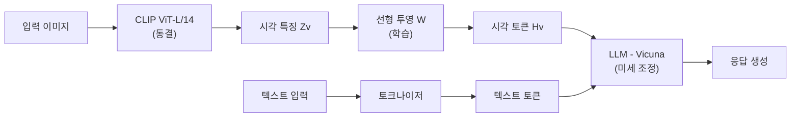
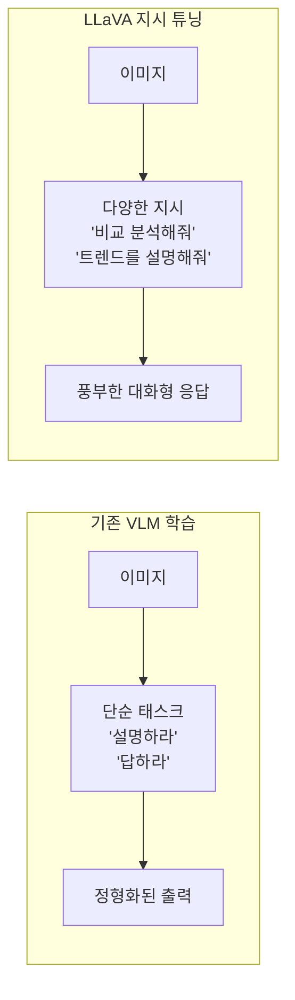
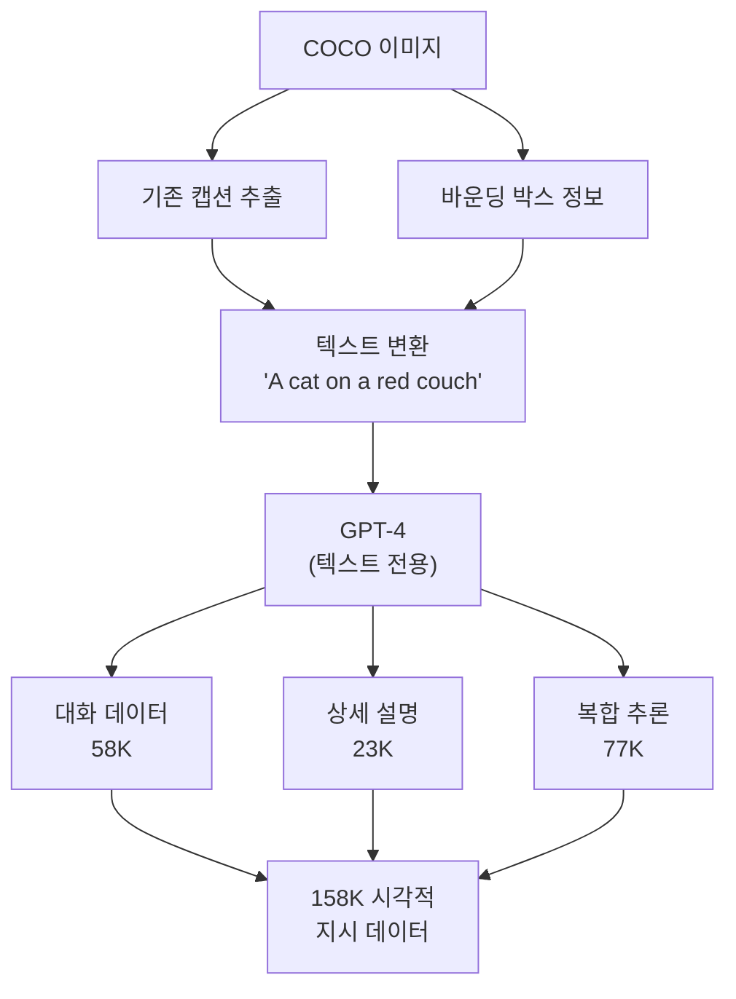
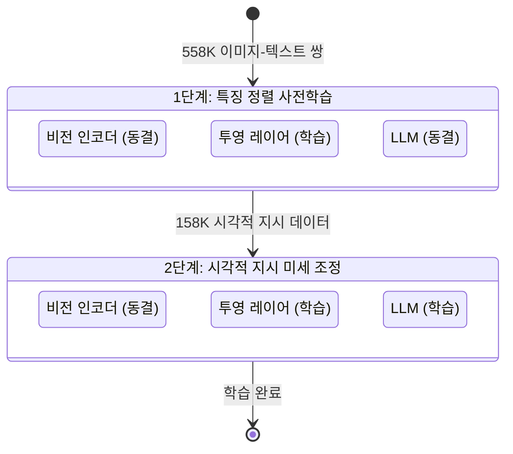

# LLaVA

> 시각적 지시 튜닝

## 개요

이 섹션에서는 오픈소스 멀티모달 AI의 대표 주자인 **LLaVA(Large Language-and-Vision Assistant)**를 다룹니다. LLaVA는 놀랍도록 단순한 구조로 GPT-4V에 근접한 시각적 대화 능력을 달성하여, "심플함이 곧 강력함"임을 증명한 모델입니다.

**선수 지식**: [CLIP](./02-clip.md)의 비전 인코더, [BLIP-2](./03-blip.md)의 비전-언어 연결 개념
**학습 목표**:
- 시각적 지시 튜닝(Visual Instruction Tuning)의 개념을 이해한다
- LLaVA의 아키텍처가 BLIP-2와 어떻게 다른지 설명할 수 있다
- GPT-4를 활용한 학습 데이터 자동 생성 방법을 파악한다
- LLaVA-1.5, LLaVA-NeXT의 발전 과정을 이해한다

## 왜 알아야 할까?

BLIP-2의 Q-Former는 영리한 해결책이었지만, 32개 쿼리로 이미지를 압축하다 보니 세밀한 정보가 손실되는 문제가 있었습니다. "사진 속 표지판에 뭐라고 쓰여 있어?"같은 질문에는 취약했죠.

LLaVA는 발상을 뒤집었습니다. 복잡한 브릿지 모듈 대신 **단순한 선형 레이어** 하나로 비전 인코더와 LLM을 연결하고, 대신 **학습 데이터의 질**을 극적으로 높인 것입니다. GPT-4를 "선생님"으로 삼아 고품질 시각적 대화 데이터를 자동 생성하는 이 접근법은 이후 수많은 VLM의 표준이 되었습니다.

## 핵심 개념

### 개념 1: 극도로 단순한 아키텍처

> 📊 **그림 1**: LLaVA의 아키텍처 — 비전 인코더에서 LLM까지의 데이터 흐름




> 💡 **비유**: BLIP-2가 "화가와 작가 사이에 전문 통역사(Q-Former)를 배치"했다면, LLaVA는 "화가의 그림을 바로 스캔해서 작가에게 이메일로 보내는" 방식입니다. 중간 통역 없이 직접 전달하되, 작가(LLM)가 그림을 잘 이해하도록 훈련시킨 거죠.

LLaVA의 아키텍처는 세 줄로 요약됩니다:

| 구성 요소 | LLaVA | 비교: BLIP-2 |
|----------|-------|-------------|
| **비전 인코더** | CLIP ViT-L/14 (동결) | ViT-G (동결) |
| **브릿지 모듈** | 선형 레이어 1개 (또는 MLP) | Q-Former (수백만 파라미터) |
| **언어 모델** | Vicuna-7B/13B (미세 조정) | FlanT5/OPT (동결) |

핵심 차이점이 보이시나요? BLIP-2는 LLM을 동결하고 Q-Former를 학습한 반면, LLaVA는 브릿지를 극도로 단순화하고 **LLM 자체를 미세 조정**합니다. 비전 인코더가 출력하는 시각 토큰을 선형 레이어로 차원만 맞춰서 LLM에 직접 전달하는 것이죠.

수식으로 표현하면:

$$H_v = W \cdot Z_v$$

- $Z_v$: CLIP 비전 인코더의 출력 (시각 특징 벡터)
- $W$: 학습 가능한 투영 행렬
- $H_v$: LLM의 워드 임베딩 공간에 매핑된 시각 토큰

이 시각 토큰 $H_v$는 텍스트 토큰과 함께 LLM에 입력됩니다. LLM 입장에서는 시각 정보가 마치 "특별한 단어들"처럼 들어오는 셈입니다.

### 개념 2: 시각적 지시 튜닝 (Visual Instruction Tuning)

> 💡 **비유**: 학생에게 외국어를 가르칠 때, 단순히 단어장을 외우게 하는 것보다 원어민과 대화를 시키는 것이 훨씬 효과적이죠? LLaVA의 시각적 지시 튜닝은 마치 "GPT-4라는 원어민 선생님이 만든 대화 교재"로 공부하는 것과 같습니다.

기존 VLM들은 "이 이미지를 설명하라", "이 질문에 답하라" 같은 단순한 태스크로 학습했습니다. LLaVA는 **지시 따르기(Instruction Following)** 패러다임을 시각 영역에 도입합니다:

- "이 이미지에서 일어나고 있는 상황을 자세히 묘사해 주세요"
- "이 차트에서 가장 높은 수치는 얼마인가요? 그 의미는 무엇인가요?"
- "이 두 이미지의 차이점을 비교 분석해 주세요"

이런 다양하고 복잡한 지시를 따르는 능력을 학습하기 때문에, LLaVA는 단순 캡셔닝을 넘어 **풍부한 시각적 대화**가 가능해집니다.

> 📊 **그림 4**: 기존 VLM vs LLaVA의 학습 패러다임 비교




### 개념 3: GPT-4로 학습 데이터 자동 생성

> 📊 **그림 2**: GPT-4를 활용한 시각적 지시 데이터 자동 생성 파이프라인




LLaVA의 가장 창의적인 기여 중 하나는 **학습 데이터 생성 방법**입니다. 당시 GPT-4는 이미지를 직접 볼 수 없었지만(텍스트 전용), 연구팀은 기존 COCO 데이터셋의 **캡션과 바운딩 박스 정보를 텍스트로 변환**하여 GPT-4에 입력했습니다.

생성 과정을 순서대로 보면:

1. COCO 이미지의 기존 캡션 수집: "A cat sitting on a red couch"
2. [바운딩 박스](../07-object-detection/01-detection-basics.md) 정보 텍스트화: "cat [0.2, 0.3, 0.6, 0.8], couch [0.0, 0.2, 1.0, 1.0]"
3. 이 텍스트 정보를 GPT-4에 입력하며 "이 이미지에 대한 대화/상세 설명/추론 질문을 만들어줘" 요청
4. GPT-4가 고품질 대화 데이터 생성

이 방법으로 총 **158K개**의 시각적 지시 데이터를 생성했습니다:
- 대화(Conversation): 58K — 이미지에 대한 자연스러운 대화
- 상세 설명(Detailed Description): 23K — 이미지의 꼼꼼한 묘사
- 복합 추론(Complex Reasoning): 77K — 이미지 기반 논리적 추론

> ⚠️ **흔한 오해**: "LLaVA는 수억 개의 데이터로 학습했다" — 아닙니다! 사전학습에 558K, 미세 조정에 158K만 사용했습니다. CLIP의 4억 쌍이나 Flamingo의 수십억 쌍에 비하면 극소량이죠. **데이터의 양보다 질**이 중요하다는 것을 보여준 사례입니다.

### 개념 4: 2단계 학습

> 📊 **그림 3**: LLaVA 2단계 학습 — 각 단계별 학습/동결 상태




LLaVA의 학습도 두 단계로 나뉘는데, BLIP-2와는 목적이 다릅니다:

**1단계: 특징 정렬 사전학습 (Feature Alignment Pre-training)**

- 비전 인코더: 동결
- **투영 레이어만 학습** (LLM도 동결)
- 558K 이미지-텍스트 쌍으로 학습
- 목적: 투영 레이어가 시각 특징을 LLM의 언어 공간에 매핑하는 법을 학습

**2단계: 시각적 지시 미세 조정 (Visual Instruction Fine-tuning)**

- 비전 인코더: 동결
- **투영 레이어 + LLM 함께 미세 조정**
- 158K 시각적 지시 데이터로 학습
- 목적: LLM이 시각 정보를 활용한 복잡한 지시 따르기 학습

> 💡 **비유**: 1단계는 "통역기의 언어 설정"이고, 2단계는 "실전 대화 연습"입니다. 1단계에서 비전과 언어의 기본 번역법을 배우고, 2단계에서 실제 대화 상황에 맞게 응용력을 키우는 거죠.

### 개념 5: LLaVA의 진화

LLaVA는 빠르게 발전하며 여러 버전이 나왔습니다:

| 모델 | 시기 | 주요 개선 |
|------|------|----------|
| **LLaVA** | 2023.04 | 최초 버전, 선형 레이어 브릿지, Vicuna-13B |
| **LLaVA-1.5** | 2023.10 | MLP 브릿지로 업그레이드, 학술 벤치마크 SOTA 달성, 8-A100으로 1일 학습 |
| **LLaVA-NeXT** | 2024.01 | 입력 해상도 4배 증가(672×672), 다양한 종횡비 지원, OCR·추론 능력 대폭 향상 |
| **LLaVA-OneVision** | 2024.08 | 이미지+비디오+다중 이미지 통합, 단일 모델로 다양한 시나리오 대응 |

특히 LLaVA-1.5는 "간단한 개선만으로 SOTA를 달성할 수 있다"는 것을 보여준 인상적인 연구입니다. 선형 레이어를 2층 MLP로 바꾸고, 학습 데이터를 정리하고, 입력 해상도를 높인 것뿐인데 11개 벤치마크에서 최고 성능을 기록했거든요.

## 실습: 직접 해보기

```python
from transformers import LlavaNextProcessor, LlavaNextForConditionalGeneration
from PIL import Image
import torch

# LLaVA-NeXT 모델 로드 (Mistral-7B 기반)
processor = LlavaNextProcessor.from_pretrained("llava-hf/llava-v1.6-mistral-7b-hf")
model = LlavaNextForConditionalGeneration.from_pretrained(
    "llava-hf/llava-v1.6-mistral-7b-hf",
    torch_dtype=torch.float16,
    device_map="auto"
)

# 이미지 로드
image = Image.open("example.jpg")

# 대화 형식으로 질문 구성
conversation = [
    {
        "role": "user",
        "content": [
            {"type": "image"},  # 이미지 위치 표시
            {"type": "text", "text": "이 이미지를 자세히 설명해 주세요."},
        ],
    },
]

# 프롬프트 생성 및 추론
prompt = processor.apply_chat_template(conversation, add_generation_prompt=True)
inputs = processor(images=image, text=prompt, return_tensors="pt").to(model.device)

output = model.generate(**inputs, max_new_tokens=300)
response = processor.decode(output[0], skip_special_tokens=True)
print(response)
```

### 다중 턴 대화 시뮬레이션

```python
from transformers import LlavaNextProcessor, LlavaNextForConditionalGeneration
from PIL import Image
import torch

processor = LlavaNextProcessor.from_pretrained("llava-hf/llava-v1.6-mistral-7b-hf")
model = LlavaNextForConditionalGeneration.from_pretrained(
    "llava-hf/llava-v1.6-mistral-7b-hf",
    torch_dtype=torch.float16,
    device_map="auto"
)

image = Image.open("chart.png")

# 여러 질문을 순차적으로 던지기
questions = [
    "이 차트에서 보여주는 데이터는 무엇인가요?",
    "가장 높은 수치는 얼마이고, 어떤 항목인가요?",
    "이 데이터에서 어떤 트렌드를 발견할 수 있나요?",
]

for q in questions:
    conversation = [
        {
            "role": "user",
            "content": [
                {"type": "image"},
                {"type": "text", "text": q},
            ],
        },
    ]
    prompt = processor.apply_chat_template(conversation, add_generation_prompt=True)
    inputs = processor(images=image, text=prompt, return_tensors="pt").to(model.device)

    output = model.generate(**inputs, max_new_tokens=200)
    answer = processor.decode(output[0], skip_special_tokens=True)
    # 대화 기록에서 응답 부분만 추출
    answer_text = answer.split("[/INST]")[-1].strip()
    print(f"Q: {q}")
    print(f"A: {answer_text}\n")
```

## 더 깊이 알아보기

### LLaVA의 탄생 이야기

LLaVA는 위스콘신-매디슨 대학의 **Haotian Liu**와 Microsoft Research의 **Chunyuan Li** 등이 공동으로 개발했습니다. 논문 제목 "Visual Instruction Tuning"은 2023년 NeurIPS에서 **Oral** 발표로 선정되었는데, 이는 전체 제출 논문 중 상위 0.5%에 해당하는 매우 높은 평가입니다.

흥미로운 점은 LLaVA가 GPT-4의 텍스트 능력을 활용하여 학습 데이터를 만들었다는 것입니다. 즉, GPT-4가 "선생님" 역할을 하여 LLaVA라는 "학생"을 가르친 셈이죠. 이런 접근법을 **지식 증류(Knowledge Distillation)**의 변형으로 볼 수도 있으며, 이후 많은 오픈소스 VLM들이 상용 모델의 출력을 학습 데이터로 활용하는 트렌드를 만들었습니다.

### 왜 "단순함"이 이겼을까?

LLaVA가 Q-Former 같은 복잡한 모듈 없이도 잘 작동하는 이유에 대해 여러 가설이 있습니다. 가장 유력한 설명은 **LLM의 강력함**입니다. 7B~13B 규모의 LLM은 이미 세상에 대한 방대한 지식을 갖고 있기 때문에, 시각 정보가 "대략적으로" 전달되어도 맥락을 추론하여 정확한 답을 만들어 낼 수 있다는 것이죠. Q-Former가 정보를 "잘 정리해서" 전달하는 것보다, LLM에게 "날것의 정보"를 더 많이 전달하는 것이 오히려 효과적일 수 있는 겁니다.

## 흔한 오해와 팁

> ⚠️ **흔한 오해**: "LLaVA는 BLIP-2보다 무조건 우수하다" — 태스크에 따라 다릅니다. 이미지 캡셔닝처럼 정형화된 태스크에서는 BLIP-2가 더 나을 수 있고, 자유로운 대화나 복잡한 추론에서는 LLaVA가 강합니다. 또한 BLIP-2는 LLM을 동결하므로 메모리 효율이 더 좋습니다.

> 🔥 **실무 팁**: LLaVA를 사용할 때 이미지 해상도가 매우 중요합니다. LLaVA-NeXT는 최대 672×672까지 지원하므로, OCR이나 세밀한 디테일이 필요한 경우 반드시 고해상도 이미지를 입력하세요. 저해상도 이미지는 관련 영역을 크롭해서 확대하는 것도 좋은 전략입니다.

> 💡 **알고 계셨나요?**: LLaVA-1.5는 8개의 A100 GPU로 **단 하루**만에 학습이 완료됩니다. 이는 Flamingo(수백 개 TPU, 수주)나 GPT-4V(비공개, 수개월 추정)에 비하면 극도로 효율적인 것으로, 학술 연구실에서도 재현이 가능한 수준입니다.

## 핵심 정리

| 개념 | 설명 |
|------|------|
| LLaVA | CLIP 비전 인코더 + 선형 투영 + LLM, 극도로 단순한 아키텍처 |
| Visual Instruction Tuning | 다양한 시각적 지시를 따르도록 LLM을 미세 조정 |
| GPT-4 데이터 생성 | 캡션/바운딩박스를 GPT-4에 입력하여 158K 고품질 학습 데이터 자동 생성 |
| 2단계 학습 | 1단계: 투영 레이어 정렬 → 2단계: LLM과 투영 레이어 동시 미세 조정 |
| LLaVA-1.5 | MLP 브릿지, 간단한 개선으로 11개 벤치마크 SOTA |
| LLaVA-NeXT | 해상도 4배 증가, 다양한 종횡비 지원, OCR·추론 크게 향상 |

## 다음 섹션 미리보기

LLaVA를 포함한 오픈소스 VLM들이 빠르게 발전하고 있지만, 상용 모델들은 여전히 한 걸음 앞서 있습니다. 다음 섹션 [GPT-4V와 Gemini Vision](./05-gpt4v-gemini.md)에서는 OpenAI, Google, Anthropic 등의 상용 멀티모달 LLM이 어떤 능력을 갖추고 있고, 실제로 어떻게 활용할 수 있는지 API 코드와 함께 알아봅니다.

## 참고 자료

- [Visual Instruction Tuning (Liu et al., 2023, NeurIPS Oral)](https://arxiv.org/abs/2304.08485) - LLaVA 원본 논문, 시각적 지시 튜닝의 탄생
- [LLaVA 프로젝트 페이지](https://llava-vl.github.io/) - 데모, 모델 체크포인트, 학습 데이터 공개
- [LLaVA-NeXT: Improved Reasoning, OCR, and World Knowledge](https://llava-vl.github.io/blog/2024-01-30-llava-next/) - LLaVA-NeXT의 개선점 상세 설명
- [Improved Baselines with Visual Instruction Tuning (LLaVA-1.5, CVPR 2024)](https://openaccess.thecvf.com/content/CVPR2024/papers/Liu_Improved_Baselines_with_Visual_Instruction_Tuning_CVPR_2024_paper.pdf) - LLaVA-1.5의 간단하지만 강력한 개선
- [LLaVA and Visual Instruction Tuning Explained (Zilliz Blog)](https://zilliz.com/blog/llava-visual-instruction-training) - LLaVA의 핵심을 쉽게 풀어쓴 블로그
