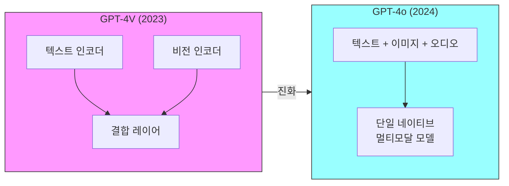
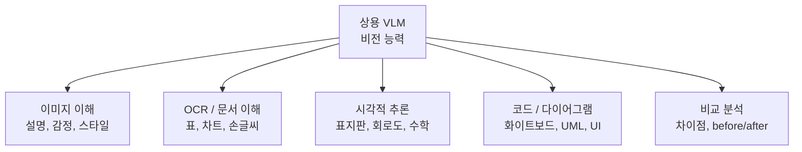
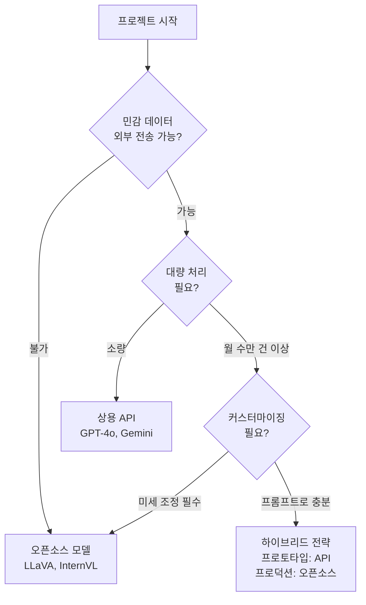
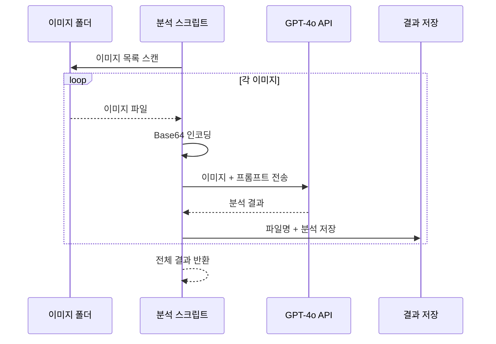

# GPT-4V와 Gemini Vision

> 상용 멀티모달 LLM 활용

## 개요

이 섹션에서는 실제로 **API를 호출하여 사용할 수 있는** 상용 멀티모달 LLM을 다룹니다. OpenAI의 GPT-4o, Google의 Gemini, Anthropic의 Claude 등 주요 모델의 비전 능력을 비교하고, 각 API를 코드로 활용하는 방법을 실습합니다.

**선수 지식**: [멀티모달 학습 개론](./01-multimodal-learning.md), [CLIP](./02-clip.md), [LLaVA](./04-llava.md)의 기본 아키텍처 이해
**학습 목표**:
- GPT-4o, Gemini, Claude의 비전 능력과 차이점을 비교할 수 있다
- 각 모델의 API를 사용하여 이미지 분석을 수행할 수 있다
- 상용 VLM의 활용 사례와 한계를 파악한다
- 오픈소스 vs 상용 모델의 장단점을 판단할 수 있다

## 왜 알아야 할까?

앞서 배운 CLIP, BLIP-2, LLaVA는 원리를 이해하고 직접 모델을 돌려볼 수 있는 오픈소스 모델들이었습니다. 하지만 실무에서는 **API 한 줄로 강력한 비전 AI를 사용**하는 것이 훨씬 현실적인 경우가 많죠.

2024~2025년 현재, GPT-4o, Gemini, Claude 같은 상용 멀티모달 LLM은 이미지를 보고 대화하는 것은 물론, 차트 분석, 문서 OCR, 코드 이해, 의료 영상 해석까지 가능한 수준에 도달했습니다. 앞서 배운 [객체 탐지](../07-object-detection/01-detection-basics.md)나 [세그멘테이션](../08-segmentation/01-semantic-segmentation.md) 같은 전통적인 CV 태스크도 이제 VLM API 한 줄로 수행할 수 있는 시대가 되었습니다. CV 엔지니어라면 이 도구들의 능력과 한계를 정확히 아는 것이 중요합니다.

## 핵심 개념

### 개념 1: 상용 멀티모달 LLM 비교

> 📊 **그림 1**: 상용 멀티모달 LLM의 아키텍처 접근 방식 비교




> 💡 **비유**: 세 모델을 음식점에 비유하면, GPT-4o는 "뭐든 잘하는 올라운더 셰프", Gemini는 "최신 트렌드에 밝고 초대형 연회도 소화하는 파티 전문점", Claude는 "정교하고 꼼꼼한 분석력의 프렌치 레스토랑"과 같습니다.

2025년 기준 주요 상용 멀티모달 LLM을 비교해 봅시다:

| 특성 | GPT-4o (OpenAI) | Gemini 2.0 (Google) | Claude 3.5 Sonnet (Anthropic) |
|------|----------------|-------------------|--------------------------|
| **출시** | 2024.05 | 2024.12 | 2024.06 |
| **비전 입력** | 이미지, 비디오(제한적) | 이미지, 비디오, 오디오 | 이미지 |
| **컨텍스트** | 128K 토큰 | 1M+ 토큰 | 200K 토큰 |
| **강점** | 범용성, 추론, 창의적 설명 | 멀티모달 통합, 긴 컨텍스트, 검색 연동 | 코딩, 정밀 분석, 안전성 |
| **API 가격** | $2.50/1M 입력 토큰 | $1.25/1M 입력 토큰 (Flash) | $3.00/1M 입력 토큰 |

"omni"를 뜻하는 GPT-4o의 'o'가 말해주듯, 이 모델은 텍스트, 이미지, 오디오를 **단일 신경망**에서 처리하도록 설계되었습니다. 기존 GPT-4V가 별도의 비전 모듈을 연결한 것과 달리, GPT-4o는 처음부터 모든 모달리티를 통합하여 학습했다는 점이 큰 차이입니다.

### 개념 2: 무엇을 할 수 있나?

> 📊 **그림 2**: 상용 VLM의 5대 비전 능력 카테고리




상용 VLM의 비전 능력은 크게 다섯 가지 카테고리로 나눌 수 있습니다:

**1. 이미지 이해와 설명**
- 사진/그림의 내용을 자연어로 상세히 설명
- 감정, 분위기, 스타일 분석

**2. OCR과 문서 이해**
- 이미지 속 텍스트 인식 (간판, 메뉴, 문서)
- 표, 차트, 그래프의 데이터 추출 및 해석
- 손글씨 인식

**3. 시각적 추론**
- "이 교통표지판이 의미하는 바는?"
- "이 회로도에서 잘못된 연결은?"
- 수학 문제의 풀이 과정 해석

**4. 코드와 다이어그램 이해**
- 화이트보드 사진을 코드로 변환
- UML, 플로우차트 해석
- UI 스크린샷 분석

**5. 비교와 분석**
- 여러 이미지의 차이점 분석
- before/after 비교
- 제품 비교 분석

> ⚠️ **흔한 오해**: "상용 VLM은 정확도가 100%에 가깝다" — 전혀 아닙니다! 여전히 환각(hallucination) 문제가 있습니다. 이미지에 없는 내용을 그럴듯하게 만들어내거나, 숫자를 잘못 읽거나, 공간 관계를 혼동하는 경우가 빈번합니다. 특히 의료, 법률 같은 고위험 영역에서는 반드시 사람의 검증이 필요합니다.

### 개념 3: 오픈소스 vs 상용 모델

> 📊 **그림 3**: 오픈소스 vs 상용 모델 선택 의사결정 흐름




어떤 상황에서 어떤 모델을 선택해야 할까요?

| 기준 | 오픈소스 (LLaVA 등) | 상용 (GPT-4o 등) |
|------|-------------------|-----------------|
| **비용** | GPU 비용만 (자체 운영) | API 호출당 과금 |
| **성능** | 특정 태스크 튜닝 시 경쟁력 | 범용 태스크에서 일반적으로 우세 |
| **커스터마이징** | 완전한 미세 조정 가능 | 제한적 (프롬프트 엔지니어링 위주) |
| **프라이버시** | 데이터가 외부로 나가지 않음 | 외부 서버로 전송 (민감 데이터 주의) |
| **속도** | 하드웨어에 따라 다름 | 일반적으로 빠름 (서버 최적화) |
| **유지보수** | 직접 관리 필요 | 제공사가 관리 |

> 🔥 **실무 팁**: 프로토타입은 상용 API로 빠르게 만들고, 프로덕션에서 비용이나 프라이버시가 중요하면 오픈소스 모델로 전환하는 전략이 일반적입니다. 먼저 GPT-4o API로 가능성을 검증한 뒤, LLaVA나 InternVL로 마이그레이션하는 식이죠.

## 실습: 직접 해보기

### OpenAI GPT-4o Vision API

```python
from openai import OpenAI
import base64

client = OpenAI(api_key="your-api-key")

# 방법 1: URL로 이미지 전달
response = client.chat.completions.create(
    model="gpt-4o",
    messages=[
        {
            "role": "user",
            "content": [
                {"type": "text", "text": "이 이미지를 자세히 분석해 주세요."},
                {
                    "type": "image_url",
                    "image_url": {
                        "url": "https://example.com/image.jpg",
                        "detail": "high"  # "low", "high", "auto" 중 선택
                    }
                }
            ]
        }
    ],
    max_tokens=500
)
print(response.choices[0].message.content)

# 방법 2: 로컬 이미지를 base64로 인코딩하여 전달
def encode_image(image_path):
    with open(image_path, "rb") as f:
        return base64.b64encode(f.read()).decode("utf-8")

base64_image = encode_image("local_image.jpg")
response = client.chat.completions.create(
    model="gpt-4o",
    messages=[
        {
            "role": "user",
            "content": [
                {"type": "text", "text": "이 차트의 데이터를 표로 정리해 주세요."},
                {
                    "type": "image_url",
                    "image_url": {
                        "url": f"data:image/jpeg;base64,{base64_image}"
                    }
                }
            ]
        }
    ],
    max_tokens=1000
)
print(response.choices[0].message.content)
```

### Google Gemini Vision API

```python
import google.generativeai as genai
from PIL import Image

genai.configure(api_key="your-api-key")

# Gemini 모델 생성
model = genai.GenerativeModel("gemini-2.0-flash")

# 이미지 로드
image = Image.open("example.jpg")

# 이미지 분석 요청
response = model.generate_content(
    ["이 이미지에서 보이는 모든 객체를 나열하고, 각각의 위치를 설명해 주세요.", image]
)
print(response.text)

# 여러 이미지 비교 분석
image1 = Image.open("before.jpg")
image2 = Image.open("after.jpg")

response = model.generate_content(
    ["이 두 이미지의 차이점을 분석해 주세요.", image1, image2]
)
print(response.text)
```

### Anthropic Claude Vision API

```python
import anthropic
import base64

client = anthropic.Anthropic(api_key="your-api-key")

# 로컬 이미지를 base64로 인코딩
def encode_image(image_path):
    with open(image_path, "rb") as f:
        return base64.b64encode(f.read()).decode("utf-8")

base64_image = encode_image("screenshot.png")

# Claude에 이미지 분석 요청
message = client.messages.create(
    model="claude-sonnet-4-20250514",
    max_tokens=1024,
    messages=[
        {
            "role": "user",
            "content": [
                {
                    "type": "image",
                    "source": {
                        "type": "base64",
                        "media_type": "image/png",
                        "data": base64_image,
                    },
                },
                {
                    "type": "text",
                    "text": "이 UI 스크린샷을 분석하고, HTML/CSS로 재현할 수 있는 코드를 작성해 주세요."
                }
            ],
        }
    ],
)
print(message.content[0].text)
```

### 실전: 비전 API 활용 패턴

> 📊 **그림 4**: 이미지 배치 분석 파이프라인 흐름




```python
# 실전에서 자주 사용하는 패턴: 이미지 배치 분석
from openai import OpenAI
import base64
import os

client = OpenAI(api_key="your-api-key")

def analyze_images(image_dir, prompt):
    """폴더 내 모든 이미지를 분석하는 유틸리티 함수"""
    results = []

    for filename in sorted(os.listdir(image_dir)):
        if not filename.lower().endswith(('.png', '.jpg', '.jpeg')):
            continue

        filepath = os.path.join(image_dir, filename)
        with open(filepath, "rb") as f:
            base64_img = base64.b64encode(f.read()).decode("utf-8")

        response = client.chat.completions.create(
            model="gpt-4o",
            messages=[{
                "role": "user",
                "content": [
                    {"type": "text", "text": prompt},
                    {"type": "image_url", "image_url": {
                        "url": f"data:image/jpeg;base64,{base64_img}"
                    }}
                ]
            }],
            max_tokens=500
        )

        results.append({
            "file": filename,
            "analysis": response.choices[0].message.content
        })
        print(f"✅ {filename} 분석 완료")

    return results

# 사용 예시: 제품 이미지 품질 검사
results = analyze_images(
    "product_images/",
    "이 제품 이미지의 품질을 평가해 주세요. 조명, 구도, 배경, 선명도를 각각 1-10점으로 채점하고 개선 사항을 제안해 주세요."
)
```

## 더 깊이 알아보기

### GPT-4V에서 GPT-4o까지의 여정

GPT-4V(Vision)은 2023년 9월에 공개되었는데, 사실 이것은 GPT-4에 비전 모듈을 "붙인" 것에 가까웠습니다. 이미지를 처리하는 별도의 인코더가 GPT-4의 텍스트 처리 파이프라인에 연결된 구조였죠.

2024년 5월에 출시된 GPT-4o는 근본적으로 다릅니다. 'omni(모든 것)'라는 이름처럼, 텍스트, 이미지, 오디오를 **처음부터 하나의 모델**로 학습했습니다. 이 네이티브 멀티모달 접근법 덕분에 GPT-4V보다 2배 빠르고, 50% 저렴하면서도 성능은 오히려 향상되었습니다.

Google의 Gemini도 비슷한 철학을 따릅니다. Gemini는 처음부터 멀티모달로 설계되어, 텍스트와 이미지를 "같은 언어"로 이해합니다. 특히 Gemini 2.0의 100만 토큰 이상의 컨텍스트 윈도우는 긴 문서나 비디오를 통째로 분석하는 데 큰 장점입니다.

### 2025년의 최전선

2025년 현재, 멀티모달 AI는 빠르게 진화 중입니다:

- **GPT-4.5**: 더 강력한 멀티모달 추론, 하지만 가격이 30배 상승
- **Gemini 2.5 Pro**: 자체 팩트체킹 기능, 수학/과학 분야 최고 성능
- **Claude 3.5 Sonnet**: 코딩 태스크 최강, 200K 컨텍스트로 긴 문서 분석
- **오픈소스 경쟁**: InternVL2, Qwen-VL 등이 상용 모델에 근접한 성능 달성

> 💡 **알고 계셨나요?**: GPT-4o의 2024년 5월 발표 당시, 가장 큰 화제는 이미지 이해가 아니라 **실시간 음성 대화** 능력이었습니다. 영화 "Her"에서처럼 자연스러운 음성으로 대화하면서 카메라를 통해 주변을 인식하는 시연이 큰 반향을 일으켰죠. 이것이 가능해진 것도 네이티브 멀티모달 아키텍처 덕분입니다.

## 흔한 오해와 팁

> ⚠️ **흔한 오해**: "API 가격이 비싸서 실무에서 못 쓴다" — GPT-4o의 경우 이미지 1장 분석에 약 $0.01~0.03 수준입니다. 대량 처리가 아니라면 충분히 합리적이며, Gemini Flash 같은 경량 모델은 더 저렴합니다. 프로토타입에서는 투자 대비 생산성 향상이 큽니다.

> 🔥 **실무 팁**: Vision API 사용 시 `detail` 파라미터가 비용에 큰 영향을 줍니다. OpenAI의 경우 `"low"`는 85토큰, `"high"`는 최대 1,105토큰까지 소비합니다. 단순한 분류는 `"low"`, OCR이나 세밀한 분석은 `"high"`를 사용하세요. 또한 이미지를 미리 리사이즈하면 토큰과 비용을 절약할 수 있습니다.

> 💡 **알고 계셨나요?**: Anthropic(Claude를 만든 회사)의 이름은 "인간 중심"을 뜻하는 그리스어에서 유래했습니다. 회사의 핵심 철학은 "안전하고 도움이 되는 AI"인데, 이 때문에 Claude의 비전 기능은 다른 모델에 비해 유해 콘텐츠에 대한 안전장치가 더 강력합니다.

## 핵심 정리

| 개념 | 설명 |
|------|------|
| GPT-4o | 네이티브 멀티모달 모델, 텍스트/이미지/오디오 통합 처리, 범용성 최강 |
| Gemini 2.0 | 100만+ 토큰 컨텍스트, Google 생태계 통합, 멀티모달 통합 우수 |
| Claude 3.5 | 정밀 분석과 코딩 특화, 200K 컨텍스트, 안전성 강조 |
| detail 파라미터 | 이미지 분석 해상도 설정, low/high로 비용-성능 트레이드오프 |
| 네이티브 멀티모달 | 처음부터 여러 모달리티를 통합 학습 (vs. 별도 모듈 연결) |
| 환각 (Hallucination) | 이미지에 없는 내용을 생성하는 문제, 모든 VLM의 공통 한계 |

## 다음 섹션 미리보기

여기까지 Vision-Language 모델의 세계를 훑어보았습니다. 시각과 언어를 연결하는 기술은 이제 이미지를 **생성**하는 방향으로도 확장됩니다. 다음 챕터 [생성 모델 기초](11-generative-basics/01-generative-intro.md)에서는 VAE와 GAN부터 시작하여, AI가 사진처럼 사실적인 이미지를 "상상"해서 만들어내는 원리를 알아봅니다.

## 참고 자료

- [GPT-4o 공식 가이드 (OpenAI)](https://platform.openai.com/docs/guides/vision) - OpenAI의 Vision API 공식 문서
- [Gemini API Documentation (Google)](https://ai.google.dev/docs) - Gemini API 사용법과 예제
- [Claude Vision Documentation (Anthropic)](https://docs.anthropic.com/en/docs/build-with-claude/vision) - Claude의 이미지 분석 기능 가이드
- [GPT-4o vs Claude 3.5 vs Gemini 2.0 - 어떤 LLM을 사용해야 할까 (Analytics Vidhya, 2025)](https://www.analyticsvidhya.com/blog/2025/01/gpt-4o-claude-3-5-gemini-2-0-which-llm-to-use-and-when/) - 상용 모델 비교 분석
- [How Well Does GPT-4o Understand Vision? (2025)](https://arxiv.org/abs/2507.01955) - GPT-4o의 CV 태스크 성능 평가 논문
