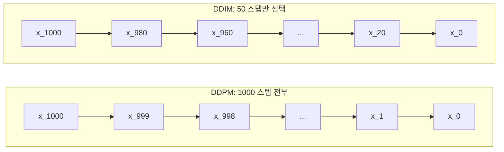
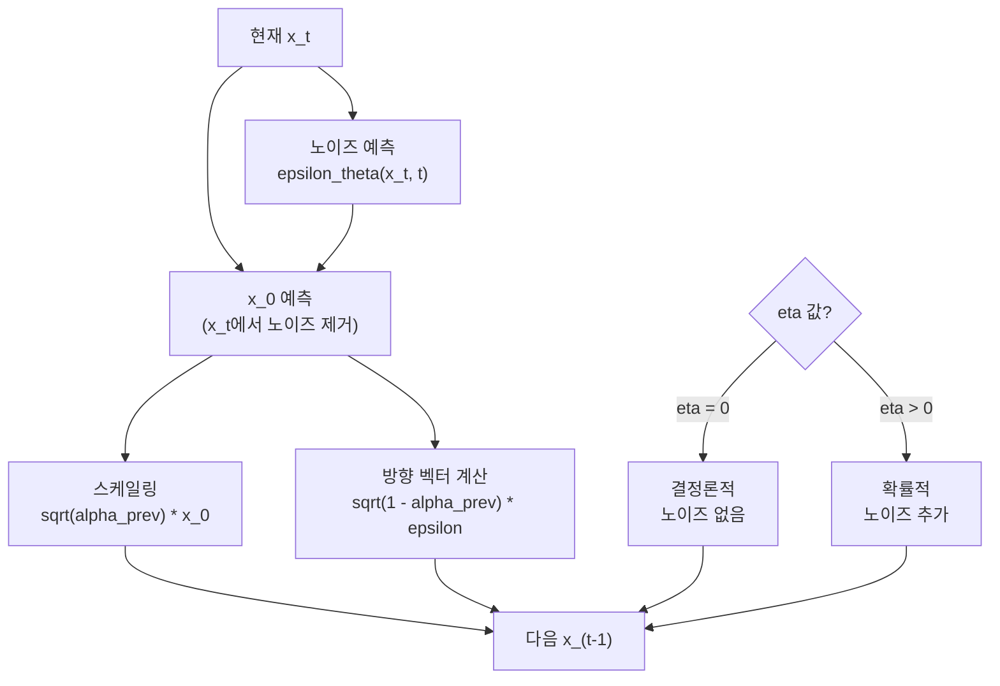
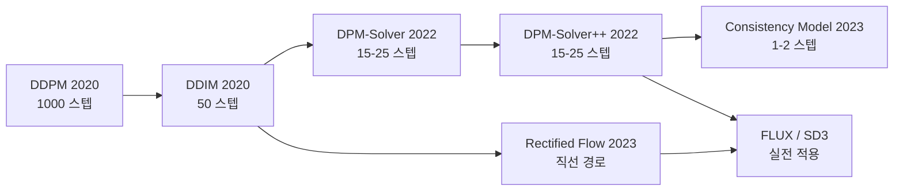
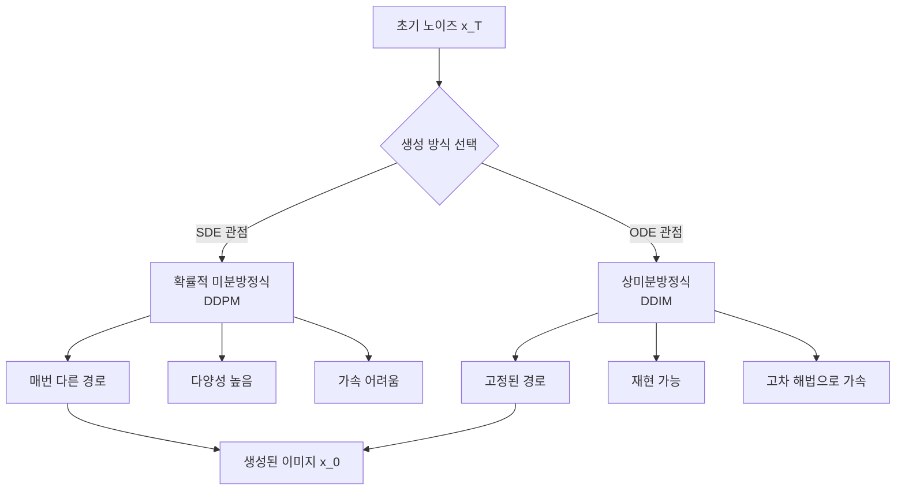

# DDIM과 샘플링 가속

> 빠른 샘플링 기법들

## 개요

[DDPM](./02-ddpm.md)은 훌륭한 이미지를 생성하지만, 1000 스텝의 순차적 디노이징이 필요해서 매우 느립니다. DDIM(Denoising Diffusion Implicit Models)은 이 문제를 **재학습 없이** 해결한 획기적인 방법입니다. 이번 섹션에서는 DDIM의 원리와 DPM-Solver 등 최신 샘플링 가속 기법을 다룹니다.

**선수 지식**: [Diffusion 이론](./01-diffusion-theory.md), [DDPM](./02-ddpm.md)
**학습 목표**:
- DDPM과 DDIM의 핵심 차이(확률적 vs 결정론적)를 이해한다
- DDIM이 어떻게 스텝 수를 줄이는지 파악한다
- DPM-Solver, Consistency Model 등 최신 가속 기법을 안다
- 샘플러 선택이 생성 품질에 미치는 영향을 이해한다

## 왜 알아야 할까?

Stable Diffusion에서 이미지를 생성할 때 "Euler", "DPM++ 2M Karras" 같은 **샘플러**를 선택하게 되죠. 이 샘플러들이 바로 이번 섹션에서 다루는 기법들입니다. 어떤 샘플러를 선택하느냐에 따라 생성 속도와 품질이 크게 달라지기 때문에, 원리를 이해하는 것이 실전에서 매우 중요합니다.

## 핵심 개념

### 개념 1: DDPM의 속도 문제

> 💡 **비유**: DDPM으로 이미지를 생성하는 것은 **1000층 계단을 한 칸씩 내려가는 것**과 같습니다. 안전하지만 느리죠. DDIM은 **엘리베이터**를 설치하여 50층에서 시작해서 10층씩 건너뛸 수 있게 만든 겁니다.

DDPM의 생성 과정은 마르코프 체인이기 때문에, 각 단계가 **바로 직전 단계에만 의존**합니다. 즉, $x_{999}$를 거치지 않고 $x_{1000}$에서 $x_{998}$로 직접 갈 수 없죠. 이것이 1000 스텝을 모두 거쳐야 하는 근본적인 이유입니다.

> 📊 **그림 1**: DDPM vs DDIM 샘플링 경로 비교




### 개념 2: DDIM — 결정론적 샘플링

Song et al.(2020)의 핵심 통찰: **전방 프로세스를 비마르코프(Non-Markovian)로 일반화하면, 더 적은 스텝으로 동일한 결과를 얻을 수 있다!**

DDIM의 업데이트 규칙:

$$x_{t-1} = \sqrt{\bar{\alpha}_{t-1}} \cdot \underbrace{\frac{x_t - \sqrt{1-\bar{\alpha}_t} \cdot \epsilon_\theta(x_t, t)}{\sqrt{\bar{\alpha}_t}}}_{\text{예측된 } x_0} + \sqrt{1 - \bar{\alpha}_{t-1} - \sigma_t^2} \cdot \epsilon_\theta(x_t, t) + \sigma_t \cdot z$$

여기서 $\sigma_t$가 핵심입니다:
- $\sigma_t = \sqrt{\beta_t}$이면 → **DDPM** (확률적, 원래와 동일)
- $\sigma_t = 0$이면 → **DDIM** (결정론적, 랜덤성 없음)

DDIM은 $\sigma_t = 0$으로 설정하여 **결정론적(deterministic)**으로 만듭니다. 결정론적이라는 것은 같은 초기 노이즈에서 항상 같은 이미지가 생성된다는 뜻이에요.

**왜 이것이 스텝을 줄이는 데 도움이 될까요?**

결정론적 과정은 **ODE(상미분방정식)**로 해석할 수 있고, ODE를 푸는 수치적 기법(Euler method 등)은 큰 스텝 사이즈에서도 합리적인 결과를 줍니다. 그래서 1000 스텝을 50 스텝으로 건너뛰어도 괜찮은 거죠.

> 📊 **그림 2**: DDIM 단일 스텝 업데이트 흐름




> ⚠️ **흔한 오해**: "DDIM은 DDPM과 다른 모델이다" — 아닙니다! DDIM은 **DDPM으로 학습한 모델을 그대로 사용**합니다. 달라지는 것은 생성(샘플링) 방법뿐입니다. 학습은 동일하고, 추론만 바뀌는 거예요.

### 개념 3: 서브시퀀스 샘플링 — 스텝 건너뛰기

DDIM은 전체 1000 스텝 중 일부만 선택하여 사용할 수 있습니다:

- **원래 DDPM**: [999, 998, 997, ..., 2, 1, 0] → 1000 스텝
- **DDIM 50 스텝**: [999, 979, 959, ..., 39, 19, 0] → 50 스텝
- **DDIM 20 스텝**: [999, 949, 899, ..., 99, 49, 0] → 20 스텝

이 "서브시퀀스(subsequence)"를 어떻게 선택하느냐에 따라 성능이 달라집니다. 균등 간격이 기본이지만, 초반(높은 노이즈)에 더 많은 스텝을 할당하는 것이 효과적인 경우도 있어요.

### 개념 4: DPM-Solver — ODE를 정확하게 풀기

DPM-Solver(2022)는 Diffusion ODE를 **고차 수치해법**으로 정확하게 푸는 방법입니다:

| 샘플러 | 차수 | 스텝 수 | 특징 |
|--------|------|---------|------|
| **DDIM** | 1차 (Euler) | 50~100 | 기본적, 안정적 |
| **DPM-Solver** | 2~3차 | 15~25 | 빠르고 고품질 |
| **DPM-Solver++** | 2~3차 | 15~25 | 가이던스에 강건 |
| **UniPC** | 다차 | 10~20 | 예측-교정 기법 |

> 🔥 **실무 팁**: Stable Diffusion 실전에서는 **DPM++ 2M Karras**가 품질과 속도의 균형이 가장 좋다는 것이 커뮤니티의 공통된 의견입니다. 20 스텝이면 충분히 좋은 결과를 얻을 수 있어요. [Stable Diffusion 샘플러 가이드](../13-stable-diffusion/04-samplers.md)에서 더 자세히 다룰 예정입니다.

### 개념 5: 최신 가속 기법들

> 📊 **그림 3**: 샘플링 가속 기법의 발전 흐름




**Consistency Models (2023)**: Song et al.이 제안한 모델로, Diffusion ODE의 궤적 위 임의의 두 점이 동일한 시작점으로 매핑된다는 "일관성(consistency)" 성질을 학습합니다. 이론적으로 **1~2 스텝**만으로 이미지를 생성할 수 있어요.

**Rectified Flow (2023~2024)**: 전방 프로세스를 곡선이 아닌 **직선**으로 만들어, 더 적은 스텝으로 정확한 결과를 내는 방법입니다. FLUX와 Stable Diffusion 3에서 이 아이디어를 채택했죠.

## 실습: DDIM 샘플러 구현

```python
import torch

class DDIMSampler:
    """DDIM 샘플러 — DDPM 모델을 그대로 사용하면서 스텝만 줄임"""
    def __init__(self, model, num_train_timesteps=1000,
                 beta_start=1e-4, beta_end=0.02, device='cpu'):
        self.model = model
        self.device = device

        # DDPM과 동일한 노이즈 스케줄
        betas = torch.linspace(beta_start, beta_end, num_train_timesteps)
        alphas = 1.0 - betas
        self.alpha_cumprod = torch.cumprod(alphas, dim=0).to(device)

    @torch.no_grad()
    def sample(self, shape, num_inference_steps=50, eta=0.0):
        """
        DDIM 샘플링
        - num_inference_steps: 실제 사용할 스텝 수 (50이면 50 스텝)
        - eta: 0이면 결정론적(DDIM), 1이면 확률적(DDPM)
        """
        # 서브시퀀스 생성 (균등 간격)
        step_size = 1000 // num_inference_steps
        timesteps = list(range(999, -1, -step_size))[:num_inference_steps]

        # 순수 노이즈에서 시작
        x = torch.randn(shape, device=self.device)

        for i, t in enumerate(timesteps):
            t_batch = torch.full((shape[0],), t, device=self.device, dtype=torch.long)

            # 노이즈 예측 (DDPM과 동일한 모델!)
            noise_pred = self.model(x, t_batch)

            # 현재/이전 시점의 ᾱ
            alpha_bar_t = self.alpha_cumprod[t]
            alpha_bar_prev = (self.alpha_cumprod[timesteps[i+1]]
                              if i + 1 < len(timesteps)
                              else torch.tensor(1.0, device=self.device))

            # 예측된 x_0
            x0_pred = (x - torch.sqrt(1 - alpha_bar_t) * noise_pred) / torch.sqrt(alpha_bar_t)

            # DDIM 업데이트
            sigma_t = eta * torch.sqrt(
                (1 - alpha_bar_prev) / (1 - alpha_bar_t) * (1 - alpha_bar_t / alpha_bar_prev)
            )
            direction = torch.sqrt(1 - alpha_bar_prev - sigma_t**2) * noise_pred
            x = torch.sqrt(alpha_bar_prev) * x0_pred + direction

            # eta > 0이면 확률적 노이즈 추가
            if sigma_t > 0 and i + 1 < len(timesteps):
                x = x + sigma_t * torch.randn_like(x)

        return x


# 사용 예시 (이전 섹션의 학습된 모델 사용)
# sampler = DDIMSampler(trained_model, device='cuda')
# images = sampler.sample((4, 1, 28, 28), num_inference_steps=50, eta=0.0)

# 스텝 수에 따른 비교
print("DDPM: 1000 스텝 (느림, 고품질)")
print("DDIM  50 스텝: ~20배 가속")
print("DDIM  20 스텝: ~50배 가속")
print("DPM-Solver++ 15 스텝: ~67배 가속 (최적)")
```

## 더 깊이 알아보기

### DDIM의 결정론적 성질과 시드 제어

DDIM이 결정론적이라는 것은 매우 유용한 성질을 만듭니다:

**시드 고정**: 같은 시드(초기 노이즈)로 항상 같은 이미지를 재현할 수 있어요. 이 성질 덕분에 Stable Diffusion에서 "좋은 시드를 공유"하는 문화가 생겼죠.

**잠재 공간 보간**: 두 시드 사이를 보간하면 이미지가 부드럽게 변환됩니다. [VAE의 잠재 공간 보간](../11-generative-basics/02-vae.md)과 개념적으로 비슷하지만, 훨씬 고품질이에요.

### ODE vs SDE — 두 가지 관점

> 📊 **그림 4**: ODE vs SDE 관점의 Diffusion 생성 과정




Diffusion 모델의 생성 과정은 두 가지 관점으로 볼 수 있습니다:

- **SDE 관점 (DDPM)**: 확률적 미분 방정식 → 매번 다른 결과, 다양성 높음
- **ODE 관점 (DDIM)**: 상미분 방정식 → 결정론적, 재현 가능, 가속 용이

Song et al.(2021)의 "Score SDE" 논문이 이 두 관점을 통합적으로 설명했습니다.

## 흔한 오해와 팁

> 💡 **알고 계셨나요?**: DDIM의 저자 Jiaming Song은 DDPM의 저자 Jonathan Ho와 같은 연구실(Stanford) 출신입니다. DDIM 논문은 DDPM 논문이 나온 지 불과 4개월 만에 발표되었죠. 이 두 논문이 Diffusion 모델 연구의 양대 축을 형성했습니다.

> 🔥 **실무 팁**: 생성 속도가 중요하면 DPM-Solver++를 15~20 스텝으로, 품질이 최우선이면 DDPM을 100~200 스텝으로 사용하세요. 대부분의 실전 상황에서는 **DPM++ 2M Karras 20 스텝**이 최적의 선택입니다.

## 핵심 정리

| 개념 | 설명 |
|------|------|
| DDIM | 결정론적 샘플링으로 스텝 수를 대폭 줄이는 기법 |
| eta ($\eta$) | 0이면 결정론적(DDIM), 1이면 확률적(DDPM) |
| 서브시퀀스 | 전체 스텝 중 일부만 선택하여 사용 |
| DPM-Solver | 고차 ODE 해법으로 15~25 스텝에 고품질 생성 |
| Consistency Model | 1~2 스텝 생성을 목표로 하는 최신 기법 |

## 다음 섹션 미리보기

샘플링 가속을 배웠으니, 다음 섹션 [U-Net 아키텍처](./04-unet-architecture.md)에서는 Diffusion 모델의 핵심 신경망인 U-Net을 자세히 알아봅니다. 노이즈를 예측하는 "두뇌" 역할을 하는 이 네트워크가 어떻게 설계되었는지, [세그멘테이션의 U-Net](../08-segmentation/01-semantic-segmentation.md)과 어떻게 다른지 비교해봅니다.

## 참고 자료

- [Song et al., "Denoising Diffusion Implicit Models" (2020)](https://arxiv.org/abs/2010.02502) - DDIM 원논문
- [Lu et al., "DPM-Solver++" (2022)](https://arxiv.org/abs/2211.01095) - DPM-Solver++ 논문
- [Song et al., "Consistency Models" (2023)](https://arxiv.org/abs/2303.01469) - 1~2 스텝 생성
- [How Stable Diffusion Works](https://stable-diffusion-art.com/how-stable-diffusion-work/) - Stable Diffusion 샘플링 과정 시각적 해설
