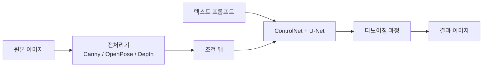
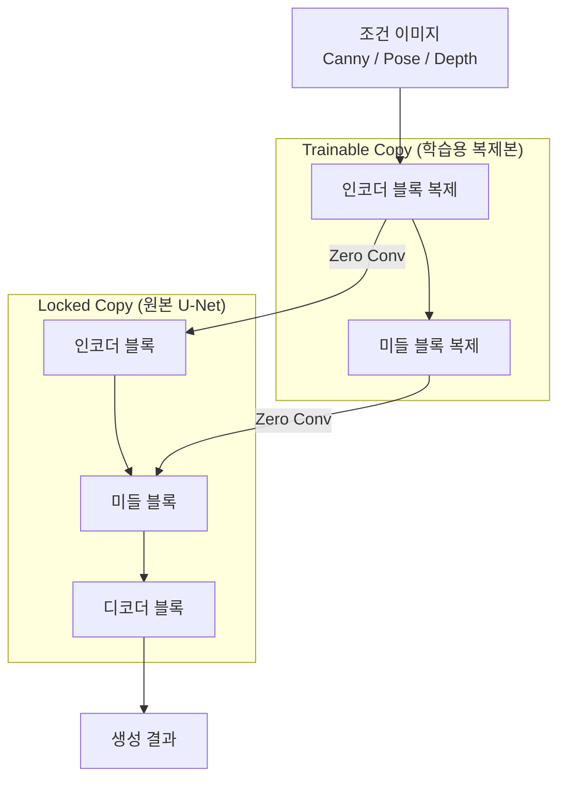
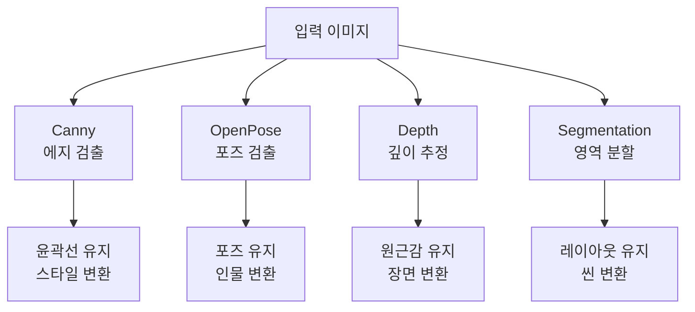

# ControlNet

> 포즈, 에지, 깊이 기반 제어

## 개요

[DreamBooth](./02-dreambooth.md)에서 "무엇을" 생성할지 정하는 기술을 배웠습니다. 이번에는 "**어떻게** 생성할지"를 제어하는 **ControlNet**을 다룹니다. 포즈, 윤곽선, 깊이 맵 등의 조건 이미지를 입력하면, 그 구조를 정확히 따르면서 새로운 이미지를 생성합니다. "이 포즈로 춤추는 사람", "이 건물 스케치를 사실적인 사진으로", "이 깊이감을 유지하면서 다른 스타일로" — 이런 정밀한 제어가 가능해집니다.

**선수 지식**: [SD 아키텍처](../13-stable-diffusion/01-sd-architecture.md), [U-Net 아키텍처](../12-diffusion-models/04-unet-architecture.md)
**학습 목표**:
- ControlNet의 아키텍처(Trainable Copy + Zero Convolution)를 이해한다
- 주요 ControlNet 모델 유형과 용도를 파악한다
- 다양한 제어 조건으로 이미지를 생성할 수 있다
- 여러 ControlNet을 조합하여 사용할 수 있다

## 왜 알아야 할까?

텍스트 프롬프트만으로는 원하는 구도나 포즈를 정확히 표현하기 어렵습니다. "오른손을 들고 있는 사람"이라고 써도 매번 다른 결과가 나오죠. ControlNet은 **참조 이미지의 구조를 추출**하여 그대로 따르게 합니다. 일러스트레이터, 게임 개발자, 영화 제작자 등 **정밀한 제어가 필요한 크리에이터**들에게 필수 도구입니다.

## 핵심 개념

### 개념 1: ControlNet의 핵심 아이디어

> 💡 **비유**: ControlNet은 **투사지(트레이싱 페이퍼)**와 같습니다. 밑그림 위에 투사지를 올려놓고 새 그림을 그리면, 구도와 형태는 유지하면서 스타일만 바꿀 수 있잖아요? ControlNet도 조건 이미지의 **구조만 추출**하여 새 이미지의 뼈대로 사용합니다.

ControlNet은 2023년 2월 스탠포드 대학교의 Lvmin Zhang이 발표한 논문 "Adding Conditional Control to Text-to-Image Diffusion Models"에서 소개되었습니다.

**작동 방식의 핵심:**

1. **조건 이미지 입력**: 포즈, 에지, 깊이 맵 등
2. **구조 추출**: 전처리기(Preprocessor)가 조건 정보를 추출
3. **U-Net과 결합**: 추출된 조건이 디노이징 과정을 가이드
4. **결과 생성**: 조건 구조를 따르는 새 이미지 생성

**ControlNet 파이프라인:**

> 원본 이미지 → **전처리기**(Canny/OpenPose/Depth) → 조건 맵 → **ControlNet** + 텍스트 프롬프트 → 결과 이미지

> 📊 **그림 1**: ControlNet 파이프라인 전체 흐름




### 개념 2: 아키텍처 — Trainable Copy와 Zero Convolution

> 💡 **비유**: ControlNet의 아키텍처는 **쌍둥이 네트워크**와 같습니다. 원본 U-Net(형)은 그대로 두고, 복제본(동생)만 새로운 조건을 학습합니다. 처음에는 동생이 조용히 있다가(zero convolution), 학습이 진행되면서 점점 목소리를 내기 시작합니다.

**핵심 구성 요소:**

| 구성 요소 | 역할 | 특징 |
|-----------|------|------|
| **Locked Copy** | 원본 SD의 U-Net | 가중치 동결, 원본 능력 보존 |
| **Trainable Copy** | 조건을 학습하는 복제본 | 인코더 부분만 복제 |
| **Zero Convolution** | 두 네트워크 연결 | 가중치 0으로 초기화 |

**Zero Convolution의 마법:**

Zero Convolution은 가중치와 편향이 모두 0으로 초기화된 1×1 컨볼루션입니다:

- **학습 전**: 출력이 0 → 원본 SD와 동일하게 작동
- **학습 중**: 점진적으로 가중치 증가 → 조건 정보 반영
- **학습 후**: 조건에 맞는 출력 생성

이 설계 덕분에:

> 📊 **그림 2**: ControlNet 아키텍처 — Trainable Copy와 Zero Convolution



- 원본 모델을 **파괴하지 않음**
- 적은 데이터(~50k 쌍)로도 안정적 학습
- 기존 SD의 모든 능력 유지

**적용 범위:**

ControlNet은 U-Net의 **인코더 블록(12개)과 미들 블록(1개)**에 적용됩니다:

> U-Net 인코더: 64×64 → 32×32 → 16×16 → 8×8
>
> 각 해상도에서 ControlNet이 조건 정보를 주입

### 개념 3: 주요 ControlNet 유형

**1. Canny Edge (에지 검출)**

| 특징 | 설명 |
|------|------|
| **입력** | 에지가 검출된 흑백 이미지 |
| **용도** | 윤곽선 유지, 선화를 사진으로 변환 |
| **장점** | 세밀한 디테일 보존 |
| **적합한 상황** | 로고, 라인아트, 건축 스케치 |

**2. OpenPose (포즈 검출)**

| 특징 | 설명 |
|------|------|
| **입력** | 인체 관절점(스켈레톤) 이미지 |
| **용도** | 특정 포즈로 인물 생성 |
| **변형** | 몸통만 / 손가락 포함 / 얼굴 방향 포함 |
| **적합한 상황** | 댄스, 액션, 패션 포즈 |

**3. Depth (깊이 맵)**

| 특징 | 설명 |
|------|------|
| **입력** | 가까운 곳=밝게, 먼 곳=어둡게 표현한 그레이스케일 |
| **용도** | 3D 구조와 원근감 유지 |
| **전처리기** | MiDaS, Zoe, LeReS 등 |
| **적합한 상황** | 풍경, 실내, 제품 사진 |

**4. Segmentation (세그멘테이션)**

| 특징 | 설명 |
|------|------|
| **입력** | 영역별로 색 구분된 세그멘테이션 맵 |
| **용도** | 각 영역의 위치와 크기 제어 |
| **프로토콜** | ADE20k (150 클래스) |
| **적합한 상황** | 씬 레이아웃, 배경 교체 |

**5. 기타 유형**

| 유형 | 입력 | 용도 |
|------|------|------|
| **HED/Soft Edge** | 부드러운 에지 | Canny보다 유연한 결과 |
| **Scribble** | 손으로 그린 낙서 | 러프 스케치를 완성작으로 |
| **Normal Map** | 표면 법선 맵 | 3D 텍스처링, 조명 제어 |
| **Lineart** | 선화 | 만화/일러스트 컬러링 |
| **MLSD** | 직선 검출 | 건축, 인테리어 |
| **Shuffle** | 색상/텍스처 참조 | 색감 전이 |

> 📊 **그림 3**: 주요 ControlNet 유형과 입출력 관계



| **IP2P** | 편집 지시문 | InstructPix2Pix 스타일 편집 |

> 🔥 **실무 팁**: 가장 많이 사용하는 조합은 **Canny + OpenPose**입니다. Canny로 전체 구도를 잡고, OpenPose로 인물 포즈를 제어하면 대부분의 상황을 커버할 수 있어요.

### 개념 4: ControlNet 강도와 조합

**Conditioning Scale (제어 강도)**

ControlNet의 영향력을 조절하는 파라미터입니다:

| 값 | 효과 |
|----|------|
| 0.0 | ControlNet 무시 (일반 SD) |
| 0.5~0.7 | 조건을 참고하되 자유도 유지 |
| 1.0 | 조건을 정확히 따름 (기본값) |
| 1.5+ | 과도한 제어, 아티팩트 가능 |

**다중 ControlNet 조합**

여러 ControlNet을 동시에 사용할 수 있습니다:

```
Canny (0.7) + OpenPose (1.0) + Depth (0.5)
= 윤곽선 참고 + 포즈 엄격 준수 + 깊이감 약하게 반영
```

> ⚠️ **흔한 오해**: "여러 ControlNet을 쓰면 무조건 좋다" — 오히려 충돌할 수 있습니다. 예를 들어, Canny와 Scribble은 둘 다 윤곽선을 제어하므로 동시 사용 시 결과가 불안정할 수 있어요.

### 개념 5: ControlNet for SDXL, SD3, FLUX

**모델별 ControlNet 지원:**

| 기본 모델 | ControlNet 지원 | 특징 |
|-----------|----------------|------|
| **SD 1.5** | 가장 풍부한 생태계 | 모든 유형 사용 가능 |
| **SDXL** | 주요 유형 지원 | 고해상도(1024) 지원 |
| **SD 3.5** | 2024년 11월 공개 | Blur, Canny, Depth |
| **FLUX** | 커뮤니티 개발 중 | xlabs-ai 등에서 제공 |

> 💡 **알고 계셨나요?** ControlNet의 저자 Lvmin Zhang은 스탠포드 대학원생 시절 이 연구를 수행했습니다. 논문 공개 후 불과 몇 달 만에 커뮤니티 표준이 되었고, 이미지 생성 AI의 활용 범위를 크게 넓혔습니다.

## 실습: ControlNet 사용하기

### 방법 1: Canny Edge ControlNet

```python
# Canny ControlNet으로 이미지 생성
from diffusers import (
    StableDiffusionControlNetPipeline,
    ControlNetModel,
    UniPCMultistepScheduler
)
from diffusers.utils import load_image
import torch
import cv2
import numpy as np
from PIL import Image

# 1. Canny 에지 추출
def get_canny_edge(image, low_threshold=100, high_threshold=200):
    """PIL Image에서 Canny 에지 추출"""
    image_np = np.array(image)
    edges = cv2.Canny(image_np, low_threshold, high_threshold)
    edges = edges[:, :, None]
    edges = np.concatenate([edges, edges, edges], axis=2)
    return Image.fromarray(edges)

# 2. 입력 이미지 로드 및 에지 추출
input_image = load_image("https://example.com/room.jpg")
input_image = input_image.resize((512, 512))
canny_image = get_canny_edge(input_image)

# 3. ControlNet 및 파이프라인 로드
controlnet = ControlNetModel.from_pretrained(
    "lllyasviel/sd-controlnet-canny",
    torch_dtype=torch.float16
)

pipe = StableDiffusionControlNetPipeline.from_pretrained(
    "runwayml/stable-diffusion-v1-5",
    controlnet=controlnet,
    torch_dtype=torch.float16
)
pipe.scheduler = UniPCMultistepScheduler.from_config(pipe.scheduler.config)
pipe.to("cuda")

# 4. 이미지 생성
prompt = "a futuristic cyberpunk room, neon lights, highly detailed"
negative_prompt = "low quality, blurry"

output = pipe(
    prompt=prompt,
    negative_prompt=negative_prompt,
    image=canny_image,             # Canny 에지 조건
    num_inference_steps=30,
    guidance_scale=7.5,
    controlnet_conditioning_scale=1.0,  # ControlNet 강도
).images[0]

output.save("canny_result.png")
print("Canny ControlNet 결과 저장 완료!")
```

### 방법 2: OpenPose ControlNet

```python
# OpenPose ControlNet으로 포즈 제어
from diffusers import StableDiffusionControlNetPipeline, ControlNetModel
from controlnet_aux import OpenposeDetector
import torch

# 1. OpenPose 전처리기 로드
openpose = OpenposeDetector.from_pretrained("lllyasviel/ControlNet")

# 2. 입력 이미지에서 포즈 추출
input_image = load_image("https://example.com/dancer.jpg")
input_image = input_image.resize((512, 768))
pose_image = openpose(input_image)

# 3. OpenPose ControlNet 로드
controlnet = ControlNetModel.from_pretrained(
    "lllyasviel/sd-controlnet-openpose",
    torch_dtype=torch.float16
)

pipe = StableDiffusionControlNetPipeline.from_pretrained(
    "runwayml/stable-diffusion-v1-5",
    controlnet=controlnet,
    torch_dtype=torch.float16
)
pipe.to("cuda")

# 4. 같은 포즈로 다른 인물 생성
prompt = "a robot dancing, metallic body, studio lighting"
output = pipe(
    prompt=prompt,
    image=pose_image,
    num_inference_steps=30,
    controlnet_conditioning_scale=1.0,
).images[0]

output.save("openpose_result.png")
```

### 방법 3: 다중 ControlNet 조합

```python
# Canny + Depth 다중 ControlNet
from diffusers import StableDiffusionControlNetPipeline, ControlNetModel
from controlnet_aux import MidasDetector
import torch

# 1. 두 ControlNet 로드
controlnet_canny = ControlNetModel.from_pretrained(
    "lllyasviel/sd-controlnet-canny",
    torch_dtype=torch.float16
)
controlnet_depth = ControlNetModel.from_pretrained(
    "lllyasviel/sd-controlnet-depth",
    torch_dtype=torch.float16
)

# 2. 다중 ControlNet 파이프라인
pipe = StableDiffusionControlNetPipeline.from_pretrained(
    "runwayml/stable-diffusion-v1-5",
    controlnet=[controlnet_canny, controlnet_depth],  # 리스트로 전달
    torch_dtype=torch.float16
)
pipe.to("cuda")

# 3. 조건 이미지 준비
midas = MidasDetector.from_pretrained("lllyasviel/ControlNet")
depth_image = midas(input_image)

# Canny 이미지는 앞서 정의한 함수 사용
canny_image = get_canny_edge(input_image)

# 4. 다중 조건으로 생성
prompt = "a beautiful garden, flowers, sunlight"
output = pipe(
    prompt=prompt,
    image=[canny_image, depth_image],  # 순서대로 전달
    num_inference_steps=30,
    controlnet_conditioning_scale=[0.7, 0.5],  # 각각 다른 강도
).images[0]

output.save("multi_controlnet_result.png")
print("다중 ControlNet 결과 저장 완료!")
```

### 방법 4: SDXL ControlNet

```python
# SDXL용 ControlNet
from diffusers import (
    StableDiffusionXLControlNetPipeline,
    ControlNetModel,
    AutoencoderKL
)
import torch

# SDXL Canny ControlNet 로드
controlnet = ControlNetModel.from_pretrained(
    "diffusers/controlnet-canny-sdxl-1.0",
    torch_dtype=torch.float16
)

# SDXL VAE (권장)
vae = AutoencoderKL.from_pretrained(
    "madebyollin/sdxl-vae-fp16-fix",
    torch_dtype=torch.float16
)

# SDXL 파이프라인
pipe = StableDiffusionXLControlNetPipeline.from_pretrained(
    "stabilityai/stable-diffusion-xl-base-1.0",
    controlnet=controlnet,
    vae=vae,
    torch_dtype=torch.float16
)
pipe.to("cuda")

# 고해상도 Canny 이미지 준비
canny_image = get_canny_edge(input_image.resize((1024, 1024)))

# SDXL 품질로 생성
prompt = "a masterpiece painting, oil on canvas, highly detailed"
output = pipe(
    prompt=prompt,
    image=canny_image,
    num_inference_steps=30,
    controlnet_conditioning_scale=0.8,
).images[0]

output.save("sdxl_controlnet_result.png")
```

## 더 깊이 알아보기

### ControlNet의 탄생 스토리

ControlNet의 저자 Lvmin Zhang은 흥미로운 배경을 가지고 있습니다. 그는 원래 **애니메이션 제작 도구**를 연구하던 중, "어떻게 하면 AI가 그린 이미지를 더 정밀하게 제어할 수 있을까?"라는 질문에서 ControlNet 아이디어를 얻었습니다.

논문에서 특히 강조한 점은 **"파괴 없는 학습"**입니다. Zero Convolution 덕분에 학습 초기에는 원본 SD와 완전히 동일하게 작동하고, 점진적으로 새 조건을 학습합니다. 이 아이디어가 ControlNet의 성공 비결입니다.

### 전처리기(Preprocessor) 선택 가이드

같은 유형의 ControlNet이라도 **전처리기**에 따라 결과가 달라집니다:

**Depth 전처리기 비교:**

| 전처리기 | 특징 | 권장 상황 |
|---------|------|-----------|
| **MiDaS** | 표준, 안정적 | 일반 용도 |
| **Zoe** | 더 정밀한 깊이 | 실내, 제품 |
| **LeReS** | 절대 깊이 추정 | 야외 풍경 |
| **DepthAnything** | 2024년 최신, 범용 | 모든 상황 |

**Edge 전처리기 비교:**

| 전처리기 | 특징 | 권장 상황 |
|---------|------|-----------|
| **Canny** | 날카로운 에지 | 선명한 윤곽선 필요 시 |
| **HED** | 부드러운 에지 | 자연스러운 결과 원할 때 |
| **MLSD** | 직선만 검출 | 건축, 인테리어 |
| **PiDiNet** | Soft Edge | HED와 유사, 약간 다른 결과 |

## 흔한 오해와 팁

> ⚠️ **흔한 오해**: "ControlNet 강도는 항상 1.0이 좋다" — 상황에 따라 다릅니다. 스케치를 참고만 하려면 0.5~0.7, 정확히 따르려면 1.0, 하지만 너무 높으면(1.5+) 아티팩트가 생길 수 있어요.

> 🔥 **실무 팁**: **ControlNet + LoRA 조합**이 매우 효과적입니다. ControlNet으로 구조를 제어하고, LoRA로 스타일을 적용하면 원하는 결과를 정밀하게 만들 수 있어요.

> 💡 **알고 계셨나요?** ControlNet 논문은 arXiv에 공개된 지 한 달 만에 GitHub 스타 1만 개를 돌파했습니다. 오픈소스 AI 도구 중에서도 가장 빠르게 채택된 사례 중 하나입니다.

## 핵심 정리

| 개념 | 설명 |
|------|------|
| **ControlNet 원리** | 조건 이미지의 구조를 따라 새 이미지 생성 |
| **Zero Convolution** | 0 초기화로 원본 모델 보존하며 점진적 학습 |
| **주요 유형** | Canny(에지), OpenPose(포즈), Depth(깊이), Seg(분할) |
| **Conditioning Scale** | 0.0~1.5, ControlNet 영향력 조절 |
| **다중 ControlNet** | 여러 조건을 동시에 적용 가능 |
| **전처리기** | 입력 이미지에서 조건 맵 추출 |

## 다음 섹션 미리보기

다음 [IP-Adapter](./04-ip-adapter.md)에서는 **이미지를 프롬프트로 사용**하는 기술을 배웁니다. ControlNet이 "구조"를 따른다면, IP-Adapter는 참조 이미지의 "스타일"이나 "분위기"를 전이합니다. "이 사진 느낌으로 새 이미지 만들어줘"가 가능해집니다.

## 참고 자료

- [Adding Conditional Control to Text-to-Image Diffusion Models (arXiv)](https://arxiv.org/abs/2302.05543) - ControlNet 원논문
- [ControlNet GitHub](https://github.com/lllyasviel/ControlNet) - 공식 저장소
- [ControlNet in Diffusers](https://huggingface.co/blog/controlnet) - HuggingFace 공식 가이드
- [ControlNet: A Complete Guide - Stable Diffusion Art](https://stable-diffusion-art.com/controlnet/) - 종합 가이드
- [The Ultimate Guide to ControlNet - Civitai](https://education.civitai.com/civitai-guide-to-controlnet/) - 실전 활용 가이드
- [ControlNet - LearnOpenCV](https://learnopencv.com/controlnet/) - 기술적 상세 설명
