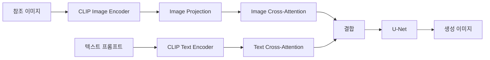
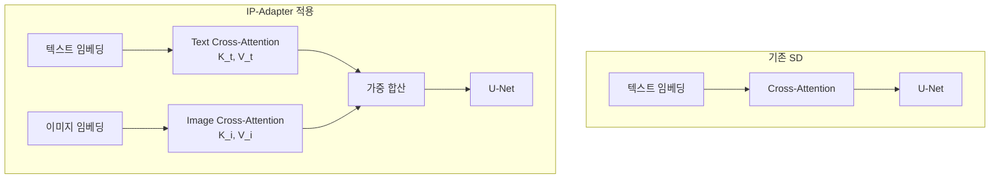
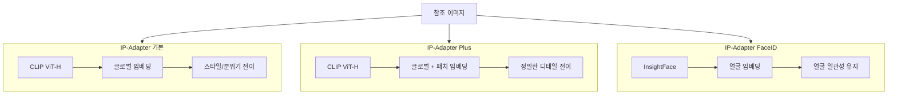
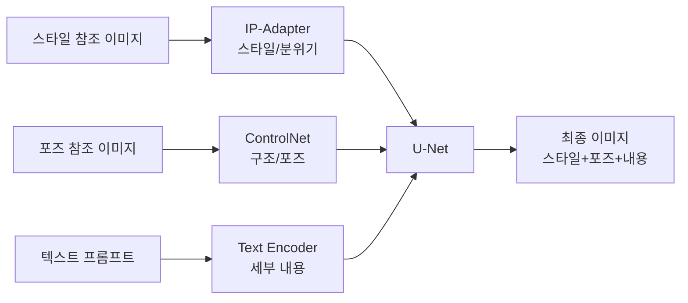

# IP-Adapter

> 이미지 프롬프트 활용

## 개요

[ControlNet](./03-controlnet.md)에서 이미지의 **구조**(포즈, 에지, 깊이)를 따라 생성하는 방법을 배웠습니다. 이번에는 **IP-Adapter** — 이미지 자체를 프롬프트로 사용하여 **스타일, 분위기, 심지어 얼굴**까지 전이하는 기술을 다룹니다. "이 그림 스타일로 새 이미지 만들어줘", "이 사람 얼굴로 다른 상황 생성해줘"가 가능해집니다.

**선수 지식**: [SD 아키텍처](../13-stable-diffusion/01-sd-architecture.md), [CLIP](../10-vision-language/02-clip.md)
**학습 목표**:
- IP-Adapter의 Decoupled Cross-Attention 아키텍처를 이해한다
- IP-Adapter 변형들(Plus, FaceID)의 차이를 파악한다
- 스타일 전이와 얼굴 일관성 생성을 실습한다
- ControlNet과 IP-Adapter를 조합할 수 있다

## 왜 알아야 할까?

Midjourney나 DALL-E 3에서 "이미지 참조" 기능을 사용해보셨나요? IP-Adapter는 Stable Diffusion에서 같은 기능을 구현합니다. 단 **22M(2200만) 파라미터**의 경량 어댑터로, 참조 이미지의 스타일이나 주제를 새 이미지에 반영할 수 있습니다. [LoRA](./01-lora.md)가 학습이 필요하다면, IP-Adapter는 **학습 없이 즉시** 참조 이미지를 활용할 수 있다는 게 큰 장점입니다.

## 핵심 개념

### 개념 1: IP-Adapter의 핵심 아이디어

> 📊 **그림 1**: IP-Adapter의 전체 처리 흐름




> 💡 **비유**: IP-Adapter는 **통역사**와 같습니다. 텍스트 프롬프트라는 "영어"와 이미지 프롬프트라는 "중국어"를 모두 이해해서, 두 언어의 의미를 합쳐 결과물을 만들어냅니다. 기존 SD는 텍스트만 이해했지만, IP-Adapter를 붙이면 이미지도 "읽을 수" 있게 되죠.

IP-Adapter(Image Prompt Adapter)는 2023년 8월 Tencent AI Lab에서 발표한 논문 "IP-Adapter: Text Compatible Image Prompt Adapter for Text-to-Image Diffusion Models"에서 소개되었습니다.

**핵심 아이디어:**

1. **이미지 인코더**: 참조 이미지에서 특징(feature) 추출
2. **분리된 Cross-Attention**: 텍스트와 이미지를 별도로 처리
3. **결합**: 두 조건을 합쳐 최종 이미지 생성

**기존 방식과의 차이:**

| 방식 | 텍스트 조건 | 이미지 조건 | 학습 필요 |
|------|------------|------------|-----------|
| **텍스트 프롬프트** | ✅ | ❌ | 없음 |
| **LoRA/DreamBooth** | ✅ | 간접 | **필요** |
| **ControlNet** | ✅ | 구조만 | 없음 |
| **IP-Adapter** | ✅ | **스타일/내용** | 없음 |

### 개념 2: Decoupled Cross-Attention — 분리된 어텐션

> 📊 **그림 2**: 기존 SD vs IP-Adapter의 Cross-Attention 구조 비교




> 💡 **비유**: 기존 SD의 Cross-Attention이 **한 귀로만 듣는** 것이라면, IP-Adapter는 **양쪽 귀로 따로 듣는** 것과 같습니다. 오른쪽 귀(텍스트)와 왼쪽 귀(이미지)가 각자 정보를 받아들이고, 뇌에서 합쳐서 이해하죠.

기존 SD의 Cross-Attention:
> 텍스트 임베딩 → Cross-Attention → U-Net

IP-Adapter의 Decoupled Cross-Attention:
> 텍스트 임베딩 → Cross-Attention (Text) ─┐
>                                          ├→ 결합 → U-Net
> 이미지 임베딩 → Cross-Attention (Image) ─┘

**구체적인 아키텍처:**

| 구성 요소 | 역할 | 파라미터 |
|-----------|------|---------|
| **CLIP Image Encoder** | 참조 이미지를 벡터로 변환 | 동결 (학습 안 함) |
| **Image Projection** | CLIP 특징을 U-Net 호환 형태로 변환 | **학습 대상** |
| **Image Cross-Attention** | 이미지 조건을 U-Net에 주입 | **학습 대상** |

전체 파라미터: 약 22M (SD 1.5의 경우), 매우 가벼움!

> ⚠️ **흔한 오해**: "IP-Adapter는 이미지를 복사한다" — IP-Adapter는 이미지를 **복사**하는 게 아니라 **스타일과 의미**를 추출합니다. CLIP 임베딩을 거치면서 이미지의 "본질"만 남고 세부 디테일은 사라집니다.

### 개념 3: IP-Adapter 변형들

> 📊 **그림 3**: IP-Adapter 변형별 인코딩 경로




**1. IP-Adapter (기본)**

| 특징 | 설명 |
|------|------|
| **인코더** | OpenCLIP ViT-H/14 (SD 1.5), ViT-bigG/14 (SDXL) |
| **출력** | 글로벌 이미지 임베딩 |
| **용도** | 전체적인 스타일/분위기 전이 |
| **강점** | 가볍고 빠름 |

**2. IP-Adapter Plus**

| 특징 | 설명 |
|------|------|
| **인코더** | 동일 + **패치 임베딩** 사용 |
| **출력** | 세부 영역별 특징 포함 |
| **용도** | 더 정밀한 스타일 전이 |
| **강점** | 세밀한 디테일 보존 |

**3. IP-Adapter FaceID**

| 특징 | 설명 |
|------|------|
| **인코더** | **InsightFace** 얼굴 인식 모델 |
| **출력** | 얼굴 임베딩 (신원 정보) |
| **용도** | 동일 인물의 다른 이미지 생성 |
| **강점** | 얼굴 일관성 유지 |

**IP-Adapter FaceID 변형:**

| 변형 | 특징 | 사용 상황 |
|------|------|----------|
| **FaceID** | 기본, 얼굴 임베딩만 | 간단한 얼굴 전이 |
| **FaceID-Plus** | 얼굴 + CLIP 임베딩 | 스타일도 함께 전이 |
| **FaceID-PlusV2** | 개선된 품질 | 권장 버전 |
| **FaceID-Portrait** | 초상화 특화 | 초상화/프로필 생성 |

> 💡 **알고 계셨나요?** IP-Adapter FaceID는 2023년 12월에 추가되었습니다. InsightFace라는 얼굴 인식 AI를 통합해서, [DreamBooth](./02-dreambooth.md)처럼 학습하지 않고도 특정 인물의 얼굴을 유지한 채 다양한 이미지를 생성할 수 있게 되었죠.

### 개념 4: IP-Adapter 강도와 조합

**Scale (강도 조절)**

| 값 | 효과 |
|----|------|
| 0.0 | IP-Adapter 비활성화 |
| 0.3~0.5 | 참조 이미지를 약하게 반영 |
| 0.7~1.0 | 참조 이미지를 강하게 반영 |
| 1.0+ | 과도한 영향, 텍스트 무시될 수 있음 |

**텍스트 프롬프트와의 조합**

IP-Adapter의 큰 장점은 **텍스트 프롬프트와 함께** 작동한다는 것입니다:

```
참조 이미지: 고흐의 별이 빛나는 밤
텍스트 프롬프트: "a cat sitting on a chair"
결과: 고흐 스타일로 그려진 의자 위의 고양이
```

**ControlNet과의 조합**

> 📊 **그림 4**: IP-Adapter + ControlNet + 텍스트 3중 조합 파이프라인




IP-Adapter + ControlNet은 매우 강력한 조합입니다:

| 도구 | 역할 |
|------|------|
| **IP-Adapter** | 스타일/분위기 결정 |
| **ControlNet** | 구조/포즈 결정 |
| **텍스트 프롬프트** | 세부 내용 결정 |

> 🔥 **실무 팁**: IP-Adapter(스타일) + OpenPose(포즈) + 텍스트(내용)를 조합하면, "이 스타일로, 이 포즈로, 이런 내용의 이미지"를 정밀하게 제어할 수 있습니다.

### 개념 5: 언제 IP-Adapter vs LoRA vs DreamBooth?

| 상황 | 추천 도구 | 이유 |
|------|-----------|------|
| **즉시 스타일 전이** | **IP-Adapter** | 학습 불필요, 즉시 사용 |
| **반복적으로 같은 스타일** | **LoRA** | 한 번 학습하면 계속 사용 |
| **특정 인물 (학습 가능)** | **DreamBooth LoRA** | 가장 높은 충실도 |
| **특정 인물 (학습 불가)** | **IP-Adapter FaceID** | 학습 없이 얼굴 유지 |
| **일회성 참조** | **IP-Adapter** | 간단하고 빠름 |
| **프로덕션 용** | **LoRA** | 안정적, 재현 가능 |

## 실습: IP-Adapter 사용하기

### 방법 1: 기본 IP-Adapter로 스타일 전이

```python
# IP-Adapter로 스타일 전이
from diffusers import StableDiffusionPipeline
from diffusers.utils import load_image
import torch

# 1. 파이프라인 로드
pipe = StableDiffusionPipeline.from_pretrained(
    "runwayml/stable-diffusion-v1-5",
    torch_dtype=torch.float16
)
pipe.to("cuda")

# 2. IP-Adapter 로드
pipe.load_ip_adapter(
    "h94/IP-Adapter",
    subfolder="models",
    weight_name="ip-adapter_sd15.bin"
)

# 3. 참조 이미지 로드 (스타일 원본)
style_image = load_image("https://example.com/van_gogh.jpg")

# 4. IP-Adapter 강도 설정
pipe.set_ip_adapter_scale(0.7)  # 0~1 사이

# 5. 이미지 생성
prompt = "a beautiful landscape with mountains and river"
output = pipe(
    prompt=prompt,
    ip_adapter_image=style_image,
    num_inference_steps=30,
    guidance_scale=7.5,
).images[0]

output.save("ip_adapter_style_result.png")
print("스타일 전이 완료!")
```

### 방법 2: IP-Adapter Plus로 더 정밀한 전이

```python
# IP-Adapter Plus 사용
from diffusers import StableDiffusionPipeline
from transformers import CLIPVisionModelWithProjection
import torch

# 1. CLIP 이미지 인코더 로드
image_encoder = CLIPVisionModelWithProjection.from_pretrained(
    "h94/IP-Adapter",
    subfolder="models/image_encoder",
    torch_dtype=torch.float16
)

# 2. 파이프라인에 이미지 인코더 추가
pipe = StableDiffusionPipeline.from_pretrained(
    "runwayml/stable-diffusion-v1-5",
    image_encoder=image_encoder,
    torch_dtype=torch.float16
)
pipe.to("cuda")

# 3. IP-Adapter Plus 로드
pipe.load_ip_adapter(
    "h94/IP-Adapter",
    subfolder="models",
    weight_name="ip-adapter-plus_sd15.bin"
)

# 4. 참조 이미지와 프롬프트로 생성
reference_image = load_image("reference_artwork.jpg")
pipe.set_ip_adapter_scale(0.8)

output = pipe(
    prompt="a portrait of a woman in a garden",
    ip_adapter_image=reference_image,
    num_inference_steps=30,
).images[0]

output.save("ip_adapter_plus_result.png")
```

### 방법 3: IP-Adapter FaceID로 얼굴 일관성

```python
# IP-Adapter FaceID 사용 (얼굴 전이)
from diffusers import StableDiffusionPipeline
from insightface.app import FaceAnalysis
import torch
import cv2
import numpy as np

# 1. InsightFace 초기화 (얼굴 인식)
app = FaceAnalysis(
    name="buffalo_l",
    providers=['CUDAExecutionProvider', 'CPUExecutionProvider']
)
app.prepare(ctx_id=0, det_size=(640, 640))

# 2. 참조 이미지에서 얼굴 임베딩 추출
ref_image = cv2.imread("person_photo.jpg")
faces = app.get(ref_image)
faceid_embeds = torch.from_numpy(faces[0].normed_embedding).unsqueeze(0)

# 3. 파이프라인 로드 및 FaceID 어댑터 설정
pipe = StableDiffusionPipeline.from_pretrained(
    "runwayml/stable-diffusion-v1-5",
    torch_dtype=torch.float16
)
pipe.to("cuda")

pipe.load_ip_adapter(
    "h94/IP-Adapter-FaceID",
    subfolder="",
    weight_name="ip-adapter-faceid_sd15.bin"
)

pipe.set_ip_adapter_scale(0.8)

# 4. 같은 얼굴로 다양한 상황 생성
prompts = [
    "a person as an astronaut on the moon",
    "a person as a medieval knight",
    "a person in a futuristic city"
]

for i, prompt in enumerate(prompts):
    output = pipe(
        prompt=prompt,
        ip_adapter_image_embeds=faceid_embeds,
        num_inference_steps=30,
    ).images[0]
    output.save(f"faceid_result_{i}.png")
    print(f"생성 완료: {prompt}")
```

### 방법 4: IP-Adapter + ControlNet 조합

```python
# IP-Adapter(스타일) + ControlNet(포즈) 조합
from diffusers import (
    StableDiffusionControlNetPipeline,
    ControlNetModel
)
from controlnet_aux import OpenposeDetector
import torch

# 1. ControlNet 로드
controlnet = ControlNetModel.from_pretrained(
    "lllyasviel/sd-controlnet-openpose",
    torch_dtype=torch.float16
)

# 2. 파이프라인 로드
pipe = StableDiffusionControlNetPipeline.from_pretrained(
    "runwayml/stable-diffusion-v1-5",
    controlnet=controlnet,
    torch_dtype=torch.float16
)
pipe.to("cuda")

# 3. IP-Adapter 로드
pipe.load_ip_adapter(
    "h94/IP-Adapter",
    subfolder="models",
    weight_name="ip-adapter_sd15.bin"
)

# 4. 조건 이미지 준비
# 스타일 참조
style_image = load_image("anime_style_reference.jpg")

# 포즈 참조
openpose = OpenposeDetector.from_pretrained("lllyasviel/ControlNet")
pose_image = openpose(load_image("dancer_pose.jpg"))

# 5. 두 조건을 조합하여 생성
pipe.set_ip_adapter_scale(0.6)  # 스타일 강도

output = pipe(
    prompt="a girl dancing, detailed, high quality",
    image=pose_image,              # ControlNet: 포즈
    ip_adapter_image=style_image,  # IP-Adapter: 스타일
    num_inference_steps=30,
    controlnet_conditioning_scale=1.0,
).images[0]

output.save("style_pose_combined.png")
print("스타일 + 포즈 조합 생성 완료!")
```

## 더 깊이 알아보기

### CLIP 임베딩의 역할

IP-Adapter가 작동하는 핵심에는 [CLIP](../10-vision-language/02-clip.md)이 있습니다. CLIP은 이미지와 텍스트를 **같은 공간**에 임베딩하도록 학습되었기 때문에, 이미지 임베딩을 텍스트 임베딩 자리에 넣어도 SD가 이해할 수 있습니다.

**IP-Adapter가 사용하는 CLIP 모델:**

| 기본 모델 | CLIP 인코더 | 파라미터 |
|-----------|------------|---------|
| SD 1.5 | OpenCLIP ViT-H/14 | 632M |
| SDXL | OpenCLIP ViT-bigG/14 | 1.85B |

IP-Adapter Plus는 CLIP의 **글로벌 임베딩**뿐 아니라 **패치 임베딩**도 사용합니다. 패치 임베딩은 이미지를 격자로 나눠 각 영역의 특징을 담고 있어서, 더 세밀한 정보를 전달할 수 있습니다.

### IP-Adapter vs 기존 접근법

IP-Adapter 이전에도 이미지를 조건으로 사용하려는 시도가 있었습니다:

| 접근법 | 방식 | 문제점 |
|--------|------|--------|
| **CLIP Interrogator** | 이미지→텍스트 변환 | 정보 손실 심함 |
| **Image2Image** | 노이즈 시작점 변경 | 구조만 유지, 스타일 약함 |
| **Textual Inversion** | 새 토큰 학습 | 학습 필요, 느림 |
| **IP-Adapter** | 분리된 Cross-Attention | 학습 불필요, 효과적 |

IP-Adapter의 핵심 혁신은 **텍스트와 이미지를 분리된 경로로 처리**한다는 것입니다. 이렇게 하면 두 조건이 서로 간섭하지 않고 각자의 역할을 수행할 수 있습니다.

## 흔한 오해와 팁

> ⚠️ **흔한 오해**: "IP-Adapter 강도를 높이면 무조건 좋다" — 강도가 너무 높으면(1.0+) 텍스트 프롬프트가 무시되고, 참조 이미지만 영향을 미칩니다. 보통 0.5~0.8이 적절합니다.

> 🔥 **실무 팁**: **IP-Adapter + LoRA**를 함께 사용할 수 있습니다. IP-Adapter로 참조 이미지의 분위기를 잡고, LoRA로 학습된 스타일을 더하면 더욱 정교한 결과를 얻을 수 있어요.

> 💡 **알고 계셨나요?** IP-Adapter는 Tencent AI Lab에서 개발했는데, 논문 공개 후 커뮤니티가 빠르게 채택하여 ComfyUI, AUTOMATIC1111 등 주요 UI에 모두 통합되었습니다. 22M 파라미터라는 가벼움이 채택을 가속화한 요인이었죠.

## 핵심 정리

| 개념 | 설명 |
|------|------|
| **IP-Adapter 원리** | 이미지를 CLIP으로 인코딩하여 프롬프트처럼 사용 |
| **Decoupled Cross-Attention** | 텍스트와 이미지 조건을 분리된 어텐션으로 처리 |
| **기본 vs Plus** | 기본=글로벌 임베딩, Plus=패치 임베딩 추가 |
| **FaceID** | InsightFace로 얼굴 임베딩 추출, 얼굴 일관성 유지 |
| **Scale** | 0~1 사이, IP-Adapter 영향력 조절 |
| **조합** | ControlNet, LoRA와 함께 사용 가능 |

## 다음 섹션 미리보기

다음 [ComfyUI 워크플로우](./05-comfyui.md)에서는 지금까지 배운 LoRA, ControlNet, IP-Adapter를 **노드 기반 UI**에서 자유롭게 조합하는 방법을 배웁니다. 코드 없이도 복잡한 파이프라인을 시각적으로 구성할 수 있어요.

## 참고 자료

- [IP-Adapter: Text Compatible Image Prompt Adapter (arXiv)](https://arxiv.org/abs/2308.06721) - IP-Adapter 원논문
- [IP-Adapter GitHub](https://github.com/tencent-ailab/IP-Adapter) - Tencent AI Lab 공식 저장소
- [IP-Adapter Project Page](https://ip-adapter.github.io/) - 공식 프로젝트 페이지
- [h94/IP-Adapter on HuggingFace](https://huggingface.co/h94/IP-Adapter) - 모델 다운로드
- [IP-Adapters: All you need to know - Stable Diffusion Art](https://stable-diffusion-art.com/ip-adapter/) - 종합 가이드
- [IP-Adapter in Diffusers](https://huggingface.co/docs/diffusers/en/using-diffusers/ip_adapter) - HuggingFace 공식 문서
