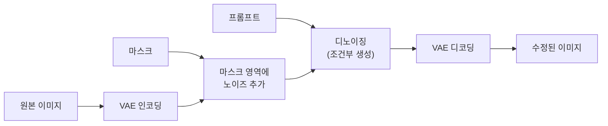
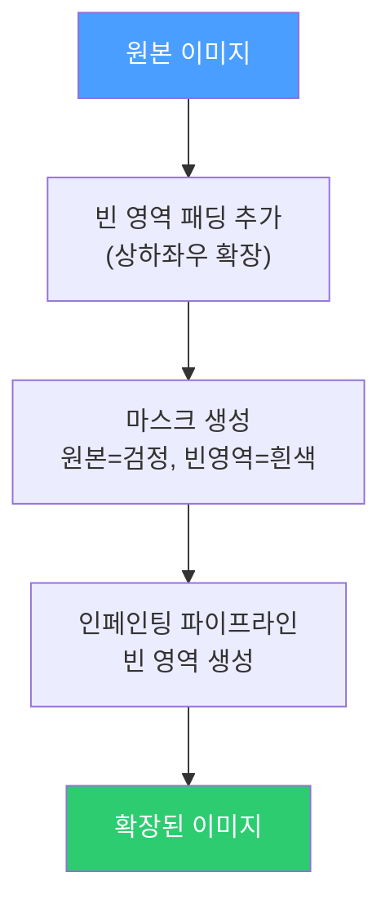
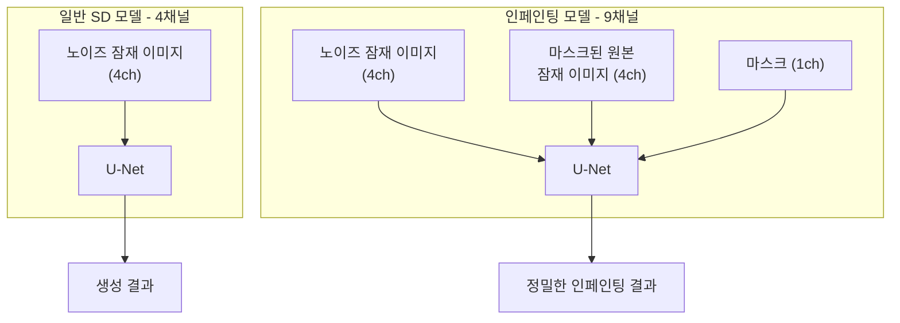
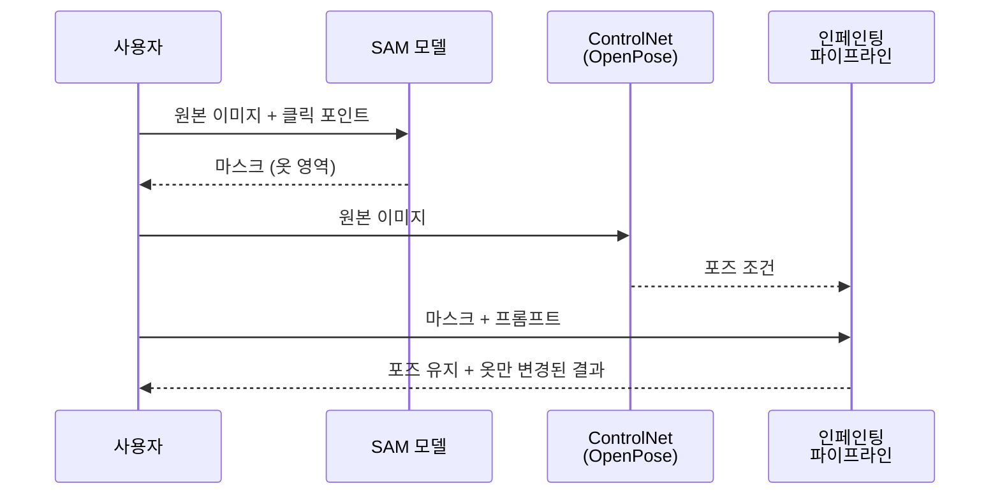

# 인페인팅과 아웃페인팅

> 이미지 부분 수정과 확장

## 개요

[ComfyUI 워크플로우](./05-comfyui.md)에서 이미지 생성 파이프라인을 시각적으로 구성하는 방법을 배웠습니다. 이번 마지막 섹션에서는 **기존 이미지를 수정하는 기술**인 **인페인팅(Inpainting)**과 **아웃페인팅(Outpainting)**을 다룹니다. 이미지의 일부를 다시 그리거나, 이미지 밖의 영역을 상상으로 채우는 기술이죠.

**선수 지식**: [SD 아키텍처](../13-stable-diffusion/01-sd-architecture.md), [샘플러 가이드](../13-stable-diffusion/04-samplers.md)
**학습 목표**:
- 인페인팅과 아웃페인팅의 원리를 이해한다
- 마스크와 Denoising Strength의 관계를 파악한다
- 인페인팅 전용 모델의 특징을 안다
- Diffusers로 인페인팅/아웃페인팅을 구현할 수 있다

## 왜 알아야 할까?

완벽한 이미지를 한 번에 생성하기는 어렵습니다. 손가락이 이상하거나, 배경의 일부가 마음에 안 들거나, 이미지를 더 넓게 확장하고 싶을 때가 있죠. 인페인팅은 **문제 부분만 다시 그리고**, 아웃페인팅은 **이미지를 확장**합니다. 포토샵의 생성형 채우기, 광고 이미지 편집, 파노라마 확장 등 실무에서 광범위하게 사용됩니다.

## 핵심 개념

### 개념 1: 인페인팅 — 이미지 일부 재생성

> 💡 **비유**: 인페인팅은 **벽의 일부를 다시 칠하는** 것과 같습니다. 벽 전체를 다시 칠하지 않고, 얼룩이 생긴 부분만 덮어 칠하죠. AI가 주변 맥락을 보고 그 부분에 어울리는 내용을 채워넣습니다.

**인페인팅의 핵심 요소:**

| 요소 | 역할 |
|------|------|
| **원본 이미지** | 수정할 대상 이미지 |
| **마스크(Mask)** | 수정할 영역 지정 (흰색=수정, 검정=유지) |
| **프롬프트** | 마스크 영역에 무엇을 생성할지 지시 |
| **Denoising Strength** | 원본과 생성물의 혼합 비율 |

**작동 방식:**

> 📊 **그림 1**: 인페인팅 처리 파이프라인




> 원본 이미지 → VAE 인코딩 → 마스크 영역에 노이즈 추가 → 디노이징 (프롬프트 조건) → VAE 디코딩 → 수정된 이미지

마스크 영역만 새로 생성되고, 나머지는 원본이 유지됩니다.

### 개념 2: 아웃페인팅 — 이미지 영역 확장

> 💡 **비유**: 아웃페인팅은 **액자 밖의 풍경을 상상하는** 것과 같습니다. 그림 속 풍경이 액자 밖으로 이어진다면 어떤 모습일까요? AI가 기존 이미지의 맥락을 파악해서 자연스럽게 확장합니다.

**아웃페인팅의 원리:**

> 📊 **그림 2**: 아웃페인팅 3단계 프로세스




1. 원본 이미지 주변에 **빈 영역(패딩)** 추가
2. 원본 부분을 마스크로 **보존**
3. 빈 영역을 인페인팅으로 **채우기**

| 방향 | 용도 |
|------|------|
| **수평 확장** | 파노라마, 배너 이미지 |
| **수직 확장** | 세로 포스터, 전신 사진 |
| **전체 확장** | 배경 확대, 컨텍스트 추가 |

### 개념 3: Denoising Strength의 역할

**Denoising Strength**는 인페인팅에서 가장 중요한 파라미터입니다:

| 값 | 효과 | 사용 상황 |
|----|------|----------|
| **0.0** | 원본 유지 (변화 없음) | — |
| **0.2~0.4** | 미세한 수정 | 색상 보정, 톤 조절 |
| **0.5~0.7** | 중간 수준 수정 | 표정 변경, 옷 색상 |
| **0.8~1.0** | 완전히 새로 생성 | 객체 교체, 배경 변경 |

> ⚠️ **흔한 오해**: "Denoising Strength는 항상 1.0이 좋다" — 너무 높으면 주변 이미지와 어울리지 않는 결과가 나올 수 있습니다. 일반적으로 **0.7~0.85** 정도가 균형점이에요.

### 개념 4: 마스크 옵션 이해하기

**Masked Content (마스크 영역 초기화 방식):**

| 옵션 | 초기 상태 | 용도 |
|------|----------|------|
| **Fill** | 원본을 흐리게 처리 | 색상/질감 유지 원할 때 |
| **Original** | 원본 그대로 | 미세 수정 시 |
| **Latent Noise** | 흐림 + 노이즈 | 일반적인 인페인팅 |
| **Latent Nothing** | 노이즈만 | 완전히 새로운 내용 |

**Inpaint Area (인페인트 영역):**

| 옵션 | 동작 | 장단점 |
|------|------|--------|
| **Whole Picture** | 전체 이미지 처리 후 마스크 적용 | 일관성 좋음, 느림 |
| **Only Masked** | 마스크 영역만 처리 | 빠름, 경계 문제 가능 |

> 🔥 **실무 팁**: **Only Masked + Padding** 옵션을 사용하면 속도와 품질을 모두 잡을 수 있습니다. 마스크 주변에 여유 공간(32~64 픽셀)을 두어 자연스러운 경계를 만드세요.

### 개념 5: 인페인팅 전용 모델

일반 SD 모델로도 인페인팅이 가능하지만, **전용 모델**을 사용하면 더 좋은 결과를 얻을 수 있습니다.

**인페인팅 모델의 특징:**

일반 SD 모델의 U-Net은 4채널(잠재 이미지)을 입력받지만, 인페인팅 모델은 **9채널**을 입력받습니다:
- 4채널: 노이즈가 추가된 잠재 이미지
- 4채널: 마스크로 가려진 원본 잠재 이미지
- 1채널: 마스크 자체

이 추가 정보 덕분에 마스크 경계 처리와 맥락 이해가 더 정확합니다.

> 📊 **그림 3**: 일반 모델 vs 인페인팅 전용 모델 입력 구조




**대표적인 인페인팅 모델:**

| 모델 | 기반 | 특징 |
|------|------|------|
| **stable-diffusion-inpainting** | SD 1.5 | 공식 인페인팅 모델 |
| **stable-diffusion-2-inpainting** | SD 2.1 | 개선된 버전 |
| **stable-diffusion-xl-1.0-inpainting** | SDXL | 고해상도 인페인팅 |

> 💡 **알고 계셨나요?** 인페인팅 전용 모델이 없었던 초기에는 일반 모델 + img2img 방식으로 인페인팅을 흉내냈습니다. 2022년 Runway가 인페인팅 전용 체크포인트를 공개하면서 품질이 크게 향상되었죠.

## 실습: 인페인팅과 아웃페인팅

### 방법 1: Diffusers로 기본 인페인팅

```python
# 인페인팅 기본 예제
from diffusers import StableDiffusionInpaintPipeline
from diffusers.utils import load_image
import torch

# 1. 인페인팅 파이프라인 로드
pipe = StableDiffusionInpaintPipeline.from_pretrained(
    "runwayml/stable-diffusion-inpainting",
    torch_dtype=torch.float16
)
pipe.to("cuda")

# 2. 원본 이미지와 마스크 로드
# 마스크: 흰색(255) = 수정할 영역, 검정(0) = 유지할 영역
image = load_image("original_image.png").resize((512, 512))
mask = load_image("mask.png").resize((512, 512))

# 3. 인페인팅 실행
prompt = "a fluffy white cat, sitting on a couch"
negative_prompt = "low quality, blurry"

result = pipe(
    prompt=prompt,
    negative_prompt=negative_prompt,
    image=image,
    mask_image=mask,
    num_inference_steps=50,
    guidance_scale=7.5,
).images[0]

result.save("inpainted_result.png")
print("인페인팅 완료!")
```

### 방법 2: 마스크 자동 생성 (SAM 활용)

```python
# Segment Anything으로 마스크 자동 생성 후 인페인팅
from diffusers import StableDiffusionInpaintPipeline
from segment_anything import SamPredictor, sam_model_registry
import numpy as np
from PIL import Image
import torch

# 1. SAM 모델 로드 (마스크 생성용)
sam = sam_model_registry["vit_h"](checkpoint="sam_vit_h.pth")
sam.to("cuda")
predictor = SamPredictor(sam)

# 2. 이미지 로드 및 마스크 생성
image = np.array(Image.open("photo.png"))
predictor.set_image(image)

# 클릭 포인트로 객체 선택 (예: 이미지 중앙의 객체)
input_point = np.array([[256, 256]])  # 클릭 좌표
input_label = np.array([1])  # 1 = 전경

masks, scores, _ = predictor.predict(
    point_coords=input_point,
    point_labels=input_label,
    multimask_output=False
)

# 마스크를 PIL Image로 변환
mask_image = Image.fromarray((masks[0] * 255).astype(np.uint8))

# 3. 인페인팅 파이프라인
pipe = StableDiffusionInpaintPipeline.from_pretrained(
    "runwayml/stable-diffusion-inpainting",
    torch_dtype=torch.float16
)
pipe.to("cuda")

# 4. 선택한 객체를 다른 것으로 교체
result = pipe(
    prompt="a golden retriever dog",
    image=Image.fromarray(image),
    mask_image=mask_image,
    num_inference_steps=50,
).images[0]

result.save("object_replaced.png")
print("객체 교체 완료!")
```

### 방법 3: 아웃페인팅 구현

```python
# 아웃페인팅: 이미지 확장
from diffusers import StableDiffusionInpaintPipeline
from PIL import Image
import torch

def outpaint(
    image,
    pipe,
    prompt,
    direction="right",
    extend_pixels=256
):
    """이미지를 지정 방향으로 확장"""
    w, h = image.size

    # 새 캔버스 크기 계산
    if direction == "right":
        new_w, new_h = w + extend_pixels, h
        paste_pos = (0, 0)
        mask_area = (w, 0, new_w, h)
    elif direction == "left":
        new_w, new_h = w + extend_pixels, h
        paste_pos = (extend_pixels, 0)
        mask_area = (0, 0, extend_pixels, h)
    elif direction == "down":
        new_w, new_h = w, h + extend_pixels
        paste_pos = (0, 0)
        mask_area = (0, h, w, new_h)
    elif direction == "up":
        new_w, new_h = w, h + extend_pixels
        paste_pos = (0, extend_pixels)
        mask_area = (0, 0, w, extend_pixels)

    # 새 캔버스 생성 (빈 영역 = 검정)
    extended = Image.new("RGB", (new_w, new_h), (0, 0, 0))
    extended.paste(image, paste_pos)

    # 마스크 생성 (확장 영역 = 흰색)
    mask = Image.new("L", (new_w, new_h), 0)
    for x in range(mask_area[0], mask_area[2]):
        for y in range(mask_area[1], mask_area[3]):
            mask.putpixel((x, y), 255)

    # 인페인팅으로 빈 영역 채우기
    result = pipe(
        prompt=prompt,
        image=extended,
        mask_image=mask,
        num_inference_steps=50,
        guidance_scale=7.5,
    ).images[0]

    return result

# 사용 예시
pipe = StableDiffusionInpaintPipeline.from_pretrained(
    "runwayml/stable-diffusion-inpainting",
    torch_dtype=torch.float16
)
pipe.to("cuda")

original = Image.open("landscape.png").resize((512, 512))
prompt = "a beautiful landscape with mountains and forest, seamless"

# 오른쪽으로 256픽셀 확장
expanded = outpaint(original, pipe, prompt, direction="right", extend_pixels=256)
expanded.save("outpainted_right.png")
print("아웃페인팅 완료!")
```

### 방법 4: SDXL 인페인팅

```python
# SDXL 인페인팅 (고해상도)
from diffusers import AutoPipelineForInpainting
import torch

# SDXL 인페인팅 파이프라인 (자동으로 최적 파이프라인 선택)
pipe = AutoPipelineForInpainting.from_pretrained(
    "diffusers/stable-diffusion-xl-1.0-inpainting-0.1",
    torch_dtype=torch.float16
)
pipe.to("cuda")

# 고해상도 이미지 준비 (1024x1024)
image = load_image("high_res_image.png").resize((1024, 1024))
mask = load_image("mask.png").resize((1024, 1024))

# SDXL 품질로 인페인팅
result = pipe(
    prompt="a majestic lion with a golden mane, photorealistic",
    negative_prompt="cartoon, anime, low quality",
    image=image,
    mask_image=mask,
    num_inference_steps=30,
    guidance_scale=7.5,
    strength=0.85,  # Denoising strength
).images[0]

result.save("sdxl_inpainted.png")
print("SDXL 인페인팅 완료!")
```

## 더 깊이 알아보기

### 인페인팅의 역사

인페인팅은 이미지 처리 분야에서 오랜 역사를 가지고 있습니다:

| 시기 | 기술 | 특징 |
|------|------|------|
| 2000년대 | **텍스처 합성** | 주변 텍스처를 복사하여 채움 |
| 2010년대 | **CNN 기반** | Context Encoder, DeepFill |
| 2022년 | **Diffusion 기반** | SD Inpainting, 고품질 생성 |
| 2024년 | **멀티모달 인페인팅** | 텍스트+이미지 조건 조합 |

Stable Diffusion 이전의 인페인팅은 "주변을 복사해서 붙이기" 수준이었지만, 디퓨전 모델은 **맥락을 이해하고 새로운 내용을 생성**할 수 있습니다.

### 마스크 경계 처리 팁

인페인팅에서 가장 흔한 문제는 **마스크 경계가 티나는 것**입니다. 해결 방법:

1. **마스크 블러링**: 마스크 경계를 부드럽게 (가우시안 블러)
2. **마스크 확장**: 마스크를 약간 더 크게 (수정 영역 넉넉히)
3. **여러 번 인페인팅**: 점진적으로 경계 다듬기
4. **Only Masked + Padding**: 주변 컨텍스트 함께 고려

### ControlNet과 인페인팅 조합

> 📊 **그림 4**: ControlNet + 인페인팅 조합 워크플로우




[ControlNet](./03-controlnet.md)과 인페인팅을 함께 사용하면 더 정밀한 제어가 가능합니다:

```
예: 인물 사진에서 옷만 바꾸기
1. SAM으로 옷 영역 마스크 생성
2. OpenPose ControlNet으로 포즈 유지
3. 인페인팅으로 옷 스타일 변경

결과: 포즈와 인물은 유지, 옷만 변경
```

## 흔한 오해와 팁

> ⚠️ **흔한 오해**: "마스크는 정확하게 그려야 한다" — 오히려 **약간 넉넉하게** 그리는 게 좋습니다. 너무 꼭 맞게 그리면 경계가 부자연스러워질 수 있어요.

> 🔥 **실무 팁**: 얼굴 수정 시 **ADetailer**(AUTOMATIC1111) 또는 **Face Detailer**(ComfyUI) 같은 자동화 도구를 사용하면 얼굴을 자동으로 감지하고 고품질로 다시 생성해줍니다.

> 💡 **알고 계셨나요?** 아웃페인팅은 원래 OpenAI의 DALL-E 2에서 "uncrop" 기능으로 처음 대중에게 소개되었습니다. Stable Diffusion 커뮤니티가 이를 빠르게 구현하면서 오픈소스로도 가능해졌죠.

## 핵심 정리

| 개념 | 설명 |
|------|------|
| **인페인팅** | 마스크 영역만 새로 생성하여 이미지 일부 수정 |
| **아웃페인팅** | 이미지 테두리를 확장하여 영역 추가 |
| **마스크** | 수정할 영역 지정 (흰색=수정, 검정=유지) |
| **Denoising Strength** | 원본과 생성물의 혼합 비율 (0.7~0.85 권장) |
| **인페인팅 모델** | 마스크 정보를 추가 입력받는 전용 모델 (9채널) |
| **Masked Content** | 마스크 영역 초기화 방식 (Fill, Original, Latent) |

## Chapter 마무리

축하합니다! **Chapter 14 생성 AI 실전**을 모두 완료했습니다.

이번 챕터에서 배운 내용을 정리하면:

| 기술 | 핵심 기능 | 주요 용도 |
|------|----------|-----------|
| **LoRA** | 저랭크 분해로 효율적 파인튜닝 | 스타일 학습 |
| **DreamBooth** | 특정 주체를 모델에 각인 | 인물/캐릭터 생성 |
| **ControlNet** | 구조(포즈, 에지, 깊이) 제어 | 정밀한 구도 |
| **IP-Adapter** | 이미지를 프롬프트로 사용 | 스타일/얼굴 전이 |
| **ComfyUI** | 노드 기반 워크플로우 | 복잡한 파이프라인 |
| **인페인팅** | 이미지 일부 수정 | 객체 교체, 수정 |

다음 [Ch15. 비디오 생성](../15-video-generation/01-video-diffusion.md)에서는 이미지 생성의 다음 단계인 **동영상 생성**으로 넘어갑니다. 시간 축으로 확장된 디퓨전 모델, AnimateDiff, Stable Video Diffusion 등을 배웁니다.

## 참고 자료

- [Beginner's guide to inpainting - Stable Diffusion Art](https://stable-diffusion-art.com/inpainting_basics/) - 인페인팅 종합 가이드
- [runwayml/stable-diffusion-inpainting](https://huggingface.co/runwayml/stable-diffusion-inpainting) - 공식 인페인팅 모델
- [Inpainting and Outpainting with Diffusers](https://machinelearningmastery.com/inpainting-and-outpainting-with-diffusers/) - Diffusers 튜토리얼
- [Basic Inpainting Guide - Civitai](https://civitai.com/articles/161/basic-inpainting-guide) - 실전 인페인팅 가이드
- [ComfyUI Outpainting Workflow](https://comfyui-wiki.com/en/tutorial/basic/how-to-outpaint-an-image-in-comfyui) - ComfyUI 아웃페인팅
- [Stable Diffusion Denoising Strength Guide](https://www.aiarty.com/stable-diffusion-guide/denoising-strength-stable-diffusion.htm) - Denoising Strength 상세 설명
