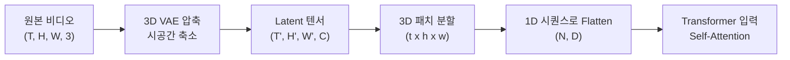
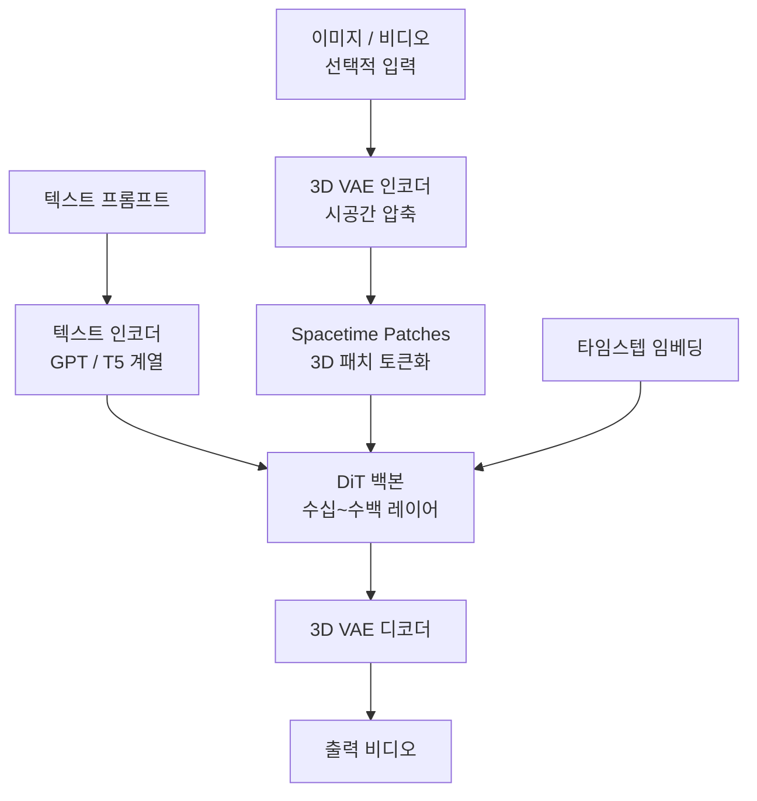
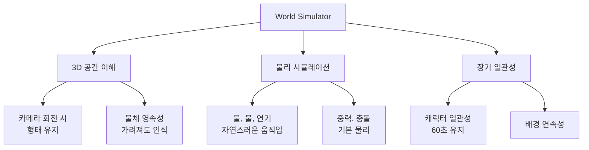
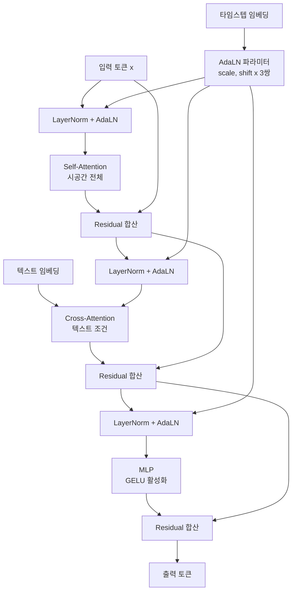
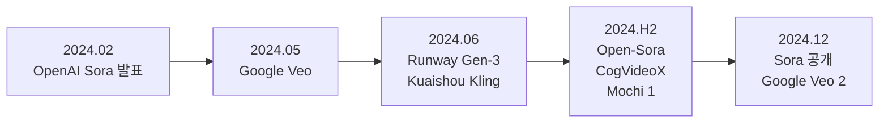

# Sora와 대규모 비디오 모델

> Diffusion Transformer 기반 비디오

## 개요

[Stable Video Diffusion](./03-svd.md)에서 이미지를 비디오로 변환하는 방법을 배웠습니다. 하지만 몇 초 분량의 단순한 움직임이 한계였죠. 2024년 2월, OpenAI가 공개한 **Sora**는 비디오 생성의 판도를 완전히 바꿨습니다. **1분 길이의 고해상도 영상**, 복잡한 카메라 움직임, 여러 캐릭터의 상호작용까지 가능해졌습니다. 이 섹션에서는 Sora를 중심으로 **대규모 비디오 생성 모델**의 핵심 기술을 살펴봅니다.

**선수 지식**: [비디오 Diffusion 기초](./01-video-diffusion.md), [FLUX와 SD3](../13-stable-diffusion/05-flux.md), [Transformer 아키텍처](../09-vision-transformer/02-transformer-basics.md)
**학습 목표**:
- U-Net에서 DiT로의 패러다임 전환을 이해한다
- Spacetime Patches와 3D VAE의 원리를 파악한다
- Sora의 아키텍처와 훈련 전략을 이해한다
- 주요 비디오 생성 모델(Runway, Kling, Veo)을 비교할 수 있다

## 왜 알아야 할까?

비디오 생성 AI는 2024년부터 **산업의 핵심 기술**이 되었습니다. 영화 프리비즈, 광고 제작, 게임 시네마틱, 교육 콘텐츠, SNS 마케팅 등 모든 영상 산업이 변화하고 있죠. Sora의 등장은 "**AI가 영화를 만들 수 있다**"는 가능성을 보여줬고, 이후 Google Veo, Runway Gen-3, Kuaishou Kling 등이 경쟁적으로 발표되었습니다. 이 기술의 원리를 이해하면 미래의 크리에이티브 도구를 더 잘 활용할 수 있습니다.

## 핵심 개념

### 개념 1: U-Net에서 DiT로 — 패러다임의 전환

> 💡 **비유**: U-Net 기반 모델이 **숙련된 장인의 손작업**이라면, DiT 기반 모델은 **거대한 공장의 자동화 시스템**입니다. 장인은 섬세하지만 규모 확장이 어렵고, 자동화 공장은 크기만 키우면 생산량이 늘어나죠.

[FLUX와 SD3](../13-stable-diffusion/05-flux.md)에서 배운 것처럼, 이미지 생성에서도 U-Net → Transformer 전환이 일어나고 있습니다. 비디오에서는 이 전환이 **더욱 극적**입니다.

**U-Net의 한계:**

| 문제 | 설명 |
|------|------|
| **스케일링 비효율** | 모델 크기 2배 ≠ 성능 2배 |
| **구조적 제약** | 인코더-디코더 대칭 구조 필수 |
| **시퀀스 길이 한계** | 긴 비디오 처리 어려움 |
| **학습 불안정** | 대규모에서 수렴 어려움 |

**DiT(Diffusion Transformer)의 장점:**

| 장점 | 설명 |
|------|------|
| **스케일링 법칙** | 파라미터 증가 → 성능 예측 가능한 향상 |
| **유연한 구조** | 다양한 해상도, 길이 처리 가능 |
| **긴 컨텍스트** | 어텐션으로 전체 비디오 관계 학습 |
| **검증된 레시피** | LLM에서 검증된 훈련 기법 활용 |

### 개념 2: Spacetime Patches — 비디오를 토큰으로

> 📊 **그림 1**: 비디오의 Spacetime 패치화 과정




> 💡 **비유**: 영화 필름을 잘라서 **퍼즐 조각**으로 만드는 것과 같습니다. 각 조각에는 특정 위치의 짧은 시간 동안 정보가 담겨 있죠. 이 조각들을 Transformer가 이해하고 재조합해서 완성된 영화를 만듭니다.

**기존 이미지 패치 vs Spacetime 패치:**

[ViT](../09-vision-transformer/03-vit.md)에서 이미지를 패치로 나눠 토큰화했습니다. Sora는 이를 **시공간으로 확장**합니다:

> 이미지 패치: (H, W) → 16×16 패치
>
> Spacetime 패치: (T, H, W) → 1×16×16 또는 2×8×8 등의 3D 패치

**패치화 과정:**

1. 비디오를 **3D VAE**로 압축 (시공간 모두 축소)
2. 압축된 latent를 **3D 패치**로 분할
3. 각 패치를 **1D 시퀀스로 펼침** (flatten)
4. Transformer가 **전체 시퀀스에 어텐션** 적용

**예시: 1분 1080p 비디오**

| 단계 | 차원 | 토큰 수 (대략) |
|------|------|----------------|
| 원본 | (1800, 1920, 1080, 3) | - |
| VAE 압축 | (450, 240, 135, 4) | - |
| 패치화 (4×16×16) | - | ~28,000 토큰 |

이 28,000개 토큰이 **GPT처럼** Transformer에 입력됩니다.

### 개념 3: Sora 아키텍처 분석

> 📊 **그림 2**: Sora 추정 아키텍처 흐름




OpenAI는 Sora의 세부 사항을 공개하지 않았지만, 기술 보고서와 분석을 통해 핵심 구조를 추론할 수 있습니다.

**추정 아키텍처:**

> **Sora 구조 (추정)**
>
> 입력: 텍스트 + (선택적) 이미지/비디오
> ↓
> 텍스트 인코더 (GPT 또는 T5 계열)
> ↓
> 3D VAE 인코더 (시공간 압축)
> ↓
> **DiT 백본** (수십~수백 레이어)
> - Bidirectional Self-Attention
> - Cross-Attention (텍스트 조건)
> - AdaLN-Zero (조건 주입)
> ↓
> 3D VAE 디코더
> ↓
> 출력: 비디오

**핵심 설계 결정:**

| 요소 | 선택 | 이유 |
|------|------|------|
| **백본** | Transformer (DiT) | 스케일링 법칙 |
| **토큰화** | Spacetime 패치 | 가변 해상도/길이 |
| **어텐션** | 양방향 Full Attention | 전체 맥락 이해 |
| **조건 주입** | Cross-Attention + AdaLN | 강력한 텍스트 제어 |
| **압축** | 3D VAE | 계산 효율 |

**가변 해상도와 길이:**

Sora의 혁신 중 하나는 **고정 해상도/길이가 아닌** 유연한 생성입니다:

- 16:9, 9:16, 1:1 등 다양한 비율
- 몇 초에서 1분까지 가변 길이
- 720p, 1080p 다양한 해상도

이는 **패치 그리드의 크기**를 조절해서 구현합니다. 학습 시 다양한 크기의 비디오를 사용하고, 추론 시 원하는 크기의 패치 그리드를 초기화하면 됩니다.

### 개념 4: "World Simulator" — 물리 세계 시뮬레이션

> 📊 **그림 3**: Sora의 World Simulator 능력 계층




> 💡 **비유**: Sora는 단순한 "비디오 생성기"가 아니라 **머릿속으로 물리 세계를 상상하는 두뇌**에 가깝습니다. "공을 던지면 어디로 날아갈까?"를 예측할 수 있어야 자연스러운 비디오가 되죠.

OpenAI는 Sora를 "**Video generation models as world simulators**"라고 소개했습니다. 단순히 픽셀을 생성하는 게 아니라, **3D 공간과 물리 법칙을 이해**한다는 의미입니다.

**Sora가 학습한 것들:**

| 영역 | 예시 |
|------|------|
| **3D 일관성** | 카메라가 회전해도 물체 형태 유지 |
| **물체 영속성** | 물체가 가려져도 존재 인식 |
| **물리 시뮬레이션** | 물, 불, 연기의 자연스러운 움직임 |
| **상호작용** | 캐릭터 간 대화, 접촉 |
| **장기 일관성** | 60초 동안 캐릭터/배경 유지 |

물론 완벽하지는 않습니다. 복잡한 물리 시뮬레이션(유리 깨짐, 유체 역학)이나 인과관계(원인-결과)는 여전히 한계가 있죠.

### 개념 5: 주요 비디오 생성 모델 비교

2024년 이후 여러 대규모 비디오 모델이 공개되었습니다:

**OpenAI Sora (2024.02~12)**

| 항목 | 사양 |
|------|------|
| 최대 길이 | 1분 (공개 당시) |
| 해상도 | 최대 1080p |
| 아키텍처 | DiT 기반 |
| 특징 | 물리 시뮬레이션, 장기 일관성 |
| 접근성 | ChatGPT Plus 구독자 |

**Google Veo / Veo 2 (2024.05~12)**

| 항목 | 사양 |
|------|------|
| 최대 길이 | 1분+ |
| 해상도 | 최대 4K (Veo 2) |
| 아키텍처 | DiT 기반 추정 |
| 특징 | 시네마틱 효과, 빠른 생성 |
| 접근성 | Google Labs, Vertex AI |

**Runway Gen-3 Alpha (2024.06)**

| 항목 | 사양 |
|------|------|
| 최대 길이 | 10초 |
| 해상도 | 1080p |
| 아키텍처 | 공개되지 않음 |
| 특징 | 빠른 생성, 프로 도구 |
| 접근성 | Runway 구독 |

**Kuaishou Kling (2024.06)**

| 항목 | 사양 |
|------|------|
| 최대 길이 | 2분 |
| 해상도 | 1080p |
| 아키텍처 | DiT 기반 |
| 특징 | 긴 영상, 중국 시장 최적화 |
| 접근성 | Kling 앱 |

**MiniMax / Hailuo AI (2024)**

| 항목 | 사양 |
|------|------|
| 최대 길이 | 6초 |
| 해상도 | 720p |
| 아키텍처 | DiT 기반 |
| 특징 | 무료 사용, 빠른 생성 |
| 접근성 | 웹/앱 무료 |

## 실습: 오픈소스 비디오 생성 모델

Sora는 공개되지 않았지만, 비슷한 접근법을 사용하는 오픈소스 모델들이 있습니다.

### Open-Sora로 비디오 생성

```python
# Open-Sora는 Sora의 아키텍처를 재현하려는 오픈소스 프로젝트입니다
# 설치: pip install opensora

from opensora.models import OpenSoraT2V
from opensora.utils import export_to_video
import torch

# 모델 로드 (DiT 기반)
model = OpenSoraT2V.from_pretrained(
    "hpcaitech/Open-Sora-v1.2",
    torch_dtype=torch.float16
)
model = model.to("cuda")

# 텍스트-투-비디오 생성
prompt = "A golden retriever running on the beach, waves crashing, \
         sunset lighting, cinematic, slow motion"

# 2초 비디오 생성 (16프레임)
video = model.generate(
    prompt=prompt,
    num_frames=16,
    height=480,
    width=854,  # 16:9
    num_inference_steps=50,
    guidance_scale=7.0,
)

export_to_video(video, "beach_dog.mp4", fps=8)
print("✅ Open-Sora 비디오 생성 완료!")
```

### CogVideoX로 텍스트-투-비디오

```python
import torch
from diffusers import CogVideoXPipeline
from diffusers.utils import export_to_video

# CogVideoX: 칭화대학의 비디오 생성 모델
pipe = CogVideoXPipeline.from_pretrained(
    "THUDM/CogVideoX-2b",  # 2B 파라미터
    torch_dtype=torch.float16
)
pipe.enable_model_cpu_offload()
pipe.vae.enable_slicing()

prompt = "A panda playing guitar in a bamboo forest, \
         soft lighting, peaceful atmosphere"

# 6초 비디오 생성
video = pipe(
    prompt=prompt,
    num_videos_per_prompt=1,
    num_inference_steps=50,
    num_frames=49,  # 약 6초
    guidance_scale=6.0,
).frames[0]

export_to_video(video, "panda_guitar.mp4", fps=8)
print("✅ CogVideoX 비디오 생성 완료!")
```

### LTX-Video: 빠른 비디오 생성

```python
import torch
from diffusers import LTXPipeline
from diffusers.utils import export_to_video

# LTX-Video: Lightricks의 실시간 비디오 모델
pipe = LTXPipeline.from_pretrained(
    "Lightricks/LTX-Video",
    torch_dtype=torch.bfloat16
)
pipe.to("cuda")

# 빠른 생성 (수 초 내)
prompt = "A timelapse of a flower blooming, macro shot"

video = pipe(
    prompt=prompt,
    negative_prompt="worst quality, blurry",
    num_frames=121,  # 5초 @ 24fps
    height=480,
    width=704,
    num_inference_steps=30,
    guidance_scale=3.0,
).frames[0]

export_to_video(video, "flower_bloom.mp4", fps=24)
print("✅ LTX-Video 생성 완료!")
```

### DiT 기반 비디오 모델 구조 이해

> 📊 **그림 4**: VideoDiTBlock 내부 처리 흐름




```python
import torch
import torch.nn as nn
from einops import rearrange

class VideoSpacetimePatch(nn.Module):
    """비디오를 시공간 패치로 변환하는 레이어"""
    def __init__(self, in_channels, embed_dim, patch_size=(2, 16, 16)):
        super().__init__()
        self.patch_size = patch_size  # (t, h, w)
        pt, ph, pw = patch_size

        # 3D 컨볼루션으로 패치 임베딩
        self.proj = nn.Conv3d(
            in_channels,
            embed_dim,
            kernel_size=patch_size,
            stride=patch_size
        )

    def forward(self, x):
        """
        x: (B, C, T, H, W) - 비디오 텐서
        출력: (B, N, D) - 토큰 시퀀스
        """
        # 패치 임베딩
        x = self.proj(x)  # (B, D, T', H', W')

        # 시퀀스로 변환
        x = rearrange(x, 'b d t h w -> b (t h w) d')

        return x


class VideoDiTBlock(nn.Module):
    """비디오 DiT 블록 (Sora 스타일 추정)"""
    def __init__(self, dim, num_heads=16, mlp_ratio=4.0):
        super().__init__()

        # Layer Norms
        self.norm1 = nn.LayerNorm(dim)
        self.norm2 = nn.LayerNorm(dim)
        self.norm3 = nn.LayerNorm(dim)

        # Self-Attention (전체 시공간)
        self.attn = nn.MultiheadAttention(dim, num_heads, batch_first=True)

        # Cross-Attention (텍스트 조건)
        self.cross_attn = nn.MultiheadAttention(dim, num_heads, batch_first=True)

        # MLP
        hidden_dim = int(dim * mlp_ratio)
        self.mlp = nn.Sequential(
            nn.Linear(dim, hidden_dim),
            nn.GELU(),
            nn.Linear(hidden_dim, dim)
        )

        # AdaLN-Zero를 위한 scale/shift
        self.adaLN = nn.Linear(dim, 6 * dim)

    def forward(self, x, text_emb, time_emb):
        """
        x: (B, N, D) - 비디오 토큰
        text_emb: (B, L, D) - 텍스트 임베딩
        time_emb: (B, D) - 타임스텝 임베딩
        """
        # AdaLN 파라미터 계산
        ada_params = self.adaLN(time_emb)  # (B, 6*D)
        shift1, scale1, shift2, scale2, shift3, scale3 = ada_params.chunk(6, dim=-1)

        # Self-Attention + AdaLN
        h = self.norm1(x) * (1 + scale1.unsqueeze(1)) + shift1.unsqueeze(1)
        h = self.attn(h, h, h)[0]
        x = x + h

        # Cross-Attention (텍스트)
        h = self.norm2(x) * (1 + scale2.unsqueeze(1)) + shift2.unsqueeze(1)
        h = self.cross_attn(h, text_emb, text_emb)[0]
        x = x + h

        # MLP
        h = self.norm3(x) * (1 + scale3.unsqueeze(1)) + shift3.unsqueeze(1)
        h = self.mlp(h)
        x = x + h

        return x


# 간단한 테스트
if __name__ == "__main__":
    # 480p, 16프레임 비디오
    video = torch.randn(2, 4, 16, 60, 80)  # (B, C, T, H, W) - latent

    # 패치 임베딩
    patch_embed = VideoSpacetimePatch(
        in_channels=4,
        embed_dim=1024,
        patch_size=(2, 8, 8)
    )

    tokens = patch_embed(video)
    print(f"비디오 → 토큰: {video.shape} → {tokens.shape}")
    # [2, 4, 16, 60, 80] → [2, 600, 1024]

    # DiT 블록
    block = VideoDiTBlock(dim=1024)

    text_emb = torch.randn(2, 77, 1024)   # 텍스트 임베딩
    time_emb = torch.randn(2, 1024)       # 타임스텝 임베딩

    output = block(tokens, text_emb, time_emb)
    print(f"DiT 출력: {output.shape}")  # [2, 600, 1024]
```

## 더 깊이 알아보기: 비디오 AI의 미래

**2024년 — 비디오 생성 폭발의 해**

2024년은 비디오 생성 AI의 폭발적 성장의 해였습니다. Sora 발표 이후 불과 10개월 만에:

> 📊 **그림 5**: 2024년 비디오 생성 모델 타임라인




- **Google Veo/Veo 2**: Sora에 필적하는 품질
- **Runway Gen-3**: 프로 크리에이터용 도구
- **Kling**: 2분 영상 가능
- **Open-Sora**: 오픈소스 재현
- **CogVideoX**: 학계 공개 모델
- **Mochi 1**: Genmo의 오픈소스 모델

**핵심 트렌드:**

1. **DiT가 표준이 됨**: 거의 모든 SOTA 모델이 Transformer 기반
2. **시공간 통합 처리**: 공간/시간 분리 → 통합 어텐션
3. **스케일링이 답**: 더 큰 모델 = 더 좋은 품질
4. **데이터가 핵심**: 고품질 비디오 데이터셋 확보 경쟁

**남은 과제:**

| 과제 | 현재 상태 |
|------|-----------|
| **물리 정확성** | 단순한 물리는 OK, 복잡한 상호작용은 부정확 |
| **긴 영상** | 1분 이상은 일관성 저하 |
| **제어 가능성** | 세밀한 동작 제어 어려움 |
| **생성 속도** | 1분 영상에 수십 분 소요 |
| **윤리적 문제** | 딥페이크, 저작권 |

## 흔한 오해와 팁

> ⚠️ **흔한 오해**: "Sora가 공개되면 누구나 할리우드 영화를 만들 수 있다"
>
> 현실은 다릅니다. 현재 비디오 AI는 **몇 초~1분 클립**을 잘 만들지만, 영화는 **수천 개 클립의 일관된 연결**입니다. 캐릭터 일관성, 스토리 연속성, 오디오 싱크 등 해결해야 할 문제가 많습니다.

> 💡 **알고 계셨나요?**: Sora 훈련에는 추정 **수천억~조 단위 토큰**의 비디오 데이터가 사용되었을 것입니다. GPT-4 훈련 데이터와 맞먹는 규모죠. 비디오는 이미지보다 데이터 밀도가 낮기 때문에, 더 많은 데이터가 필요합니다.

> 🔥 **실무 팁**: 현재 비디오 AI를 실무에 활용하려면 **생성 후 편집** 워크플로우가 필수입니다. AI가 생성한 여러 클립 중 좋은 것을 선별하고, 편집 소프트웨어에서 조합하세요.

> 🔥 **실무 팁**: 오픈소스 모델(CogVideoX, Open-Sora, LTX-Video)은 로컬에서 실행 가능하지만, **상용 서비스(Runway, Pika)**가 품질과 속도 면에서 앞서는 경우가 많습니다. 용도에 맞게 선택하세요.

## 핵심 정리

| 개념 | 설명 |
|------|------|
| **DiT (Diffusion Transformer)** | U-Net 대신 Transformer 사용, 스케일링 효율적 |
| **Spacetime Patches** | 비디오를 3D 패치로 나눠 토큰화 |
| **3D VAE** | 시공간 동시 압축으로 계산량 감소 |
| **양방향 어텐션** | 전체 비디오에 Full Attention 적용 |
| **World Simulator** | 물리 법칙과 3D 공간 이해 목표 |
| **스케일링 법칙** | 모델/데이터 크기 ↑ → 품질 ↑ |

## 다음 챕터 미리보기

이로써 비디오 생성의 세계를 살펴봤습니다! 다음 챕터 [3D 컴퓨터 비전](../16-3d-vision/01-depth-estimation.md)에서는 **2D 이미지에서 3D 세계를 이해하는 기술**을 배웁니다. 깊이 추정, 포인트 클라우드, 카메라 기하학 등 비디오를 넘어 **공간을 이해하는 AI**의 세계로 들어갑니다. Sora가 "World Simulator"를 목표로 한다면, 3D 비전은 그 기반이 되는 기술이죠!

## 참고 자료

- [Video generation models as world simulators - OpenAI](https://openai.com/index/video-generation-models-as-world-simulators/) - Sora 기술 보고서
- [Sora System Card - OpenAI](https://openai.com/index/sora-system-card/) - 안전 및 한계 문서
- [Explaining Sora's Spacetime Patches - TDS](https://towardsdatascience.com/explaining-openai-soras-spacetime-patches-the-key-ingredient-e14e0703ec5b/) - 시공간 패치 해설
- [Open-Sora GitHub](https://github.com/hpcaitech/Open-Sora) - 오픈소스 재현 프로젝트
- [Video Generation Models Explosion 2024](https://yenchenlin.me/blog/2025/01/08/video-generation-models-explosion-2024/) - 2024 비디오 모델 총정리
- [Sora Technical Review - Medium](https://j-qi.medium.com/openai-soras-technical-review-a8f85b44cb7f) - 기술 분석
