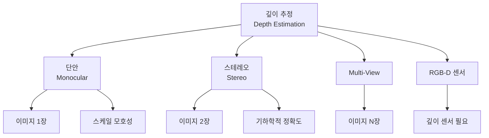
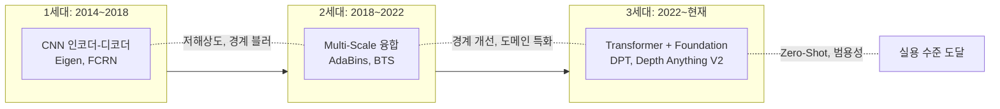
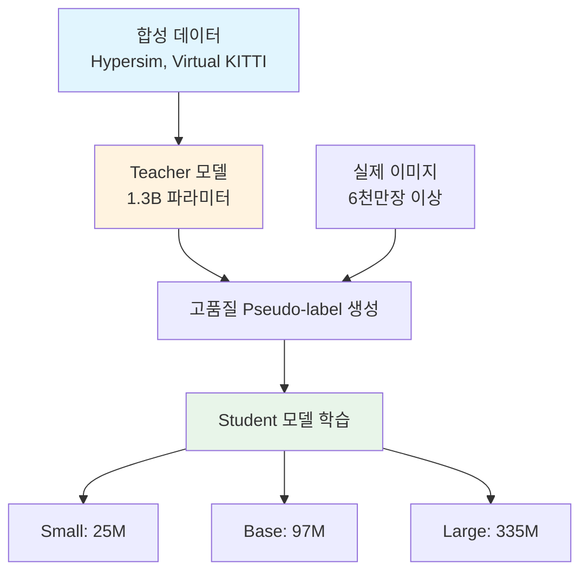
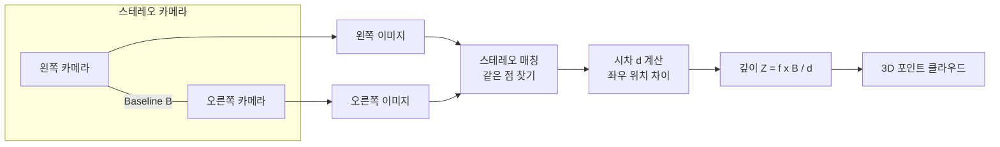
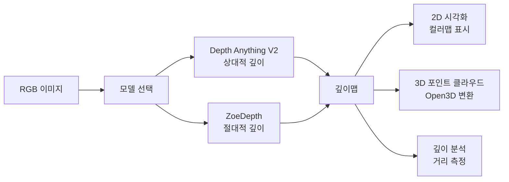

# 깊이 추정

> 단안/스테레오 깊이 추정

## 개요

[Sora와 대규모 비디오 모델](../15-video-generation/04-sora.md)에서 "World Simulator"라는 개념을 배웠습니다. AI가 세상을 시뮬레이션하려면 **3차원 공간**을 이해해야 합니다. 이번 챕터에서는 2D 이미지에서 3D 세계를 이해하는 **3D 컴퓨터 비전**의 세계로 들어갑니다. 첫 번째 주제는 **깊이 추정(Depth Estimation)** — 이미지의 각 픽셀이 카메라로부터 얼마나 떨어져 있는지 예측하는 기술입니다.

**선수 지식**: [CNN 아키텍처](../05-cnn-architectures/03-resnet.md), [Vision Transformer](../09-vision-transformer/03-vit.md)
**학습 목표**:
- 깊이 추정의 원리와 종류(단안/스테레오)를 이해한다
- 상대적 깊이 vs 절대적 깊이(Metric Depth)의 차이를 안다
- Depth Anything V2, MiDaS, ZoeDepth 등 주요 모델을 파악한다
- 실제 코드로 깊이 추정을 수행할 수 있다

## 왜 알아야 할까?

깊이 정보는 **3D 인식의 기초**입니다. 자율주행차가 앞 차와의 거리를 판단하고, AR 앱이 가상 객체를 현실에 정확히 배치하고, 로봇이 장애물을 피해 이동하려면 깊이를 알아야 합니다. LiDAR 같은 센서 없이 **일반 카메라 한 대**로 깊이를 추정할 수 있다면, 비용과 복잡성을 크게 줄일 수 있죠. 2024년 이후 Depth Anything V2, Depth Pro 등의 등장으로 단안 깊이 추정이 실용 수준에 도달했습니다.

## 핵심 개념

### 개념 1: 깊이 추정이란?

> 💡 **비유**: 사진을 보고 **"이 물체가 저 물체보다 가깝다"**를 판단하는 것은 쉽습니다. 하지만 **"정확히 3미터 떨어져 있다"**를 알아내는 것은 어렵죠. 인간은 두 눈의 시차로 거리를 판단하지만, 사진 한 장으로는 경험과 맥락에 의존해야 합니다.

**깊이 추정의 종류:**

| 방식 | 입력 | 장점 | 단점 |
|------|------|------|------|
| **단안 (Monocular)** | 이미지 1장 | 단순한 하드웨어 | 스케일 모호성 |
| **스테레오 (Stereo)** | 이미지 2장 | 기하학적 정확도 | 캘리브레이션 필요 |
| **Multi-View** | 이미지 여러 장 | 높은 정확도 | 복잡한 처리 |
| **RGB-D 센서** | 이미지 + 깊이 센서 | 직접 측정 | 비용, 야외 한계 |

이 섹션에서는 주로 **단안 깊이 추정(Monocular Depth Estimation)**에 집중합니다. 카메라 한 대로 깊이를 예측하는 가장 도전적이면서도 실용적인 문제입니다.

> 📊 **그림 1**: 깊이 추정 방식의 분류




### 개념 2: 상대적 깊이 vs 절대적 깊이

> 💡 **비유**: 상대적 깊이는 **"A가 B보다 가깝다"**를 아는 것이고, 절대적 깊이(Metric Depth)는 **"A는 2.5m, B는 5.0m 떨어져 있다"**를 아는 것입니다. 전자는 순서만 알고, 후자는 실제 거리를 압니다.

**두 가지 깊이의 차이:**

| 구분 | 상대적 깊이 (Relative) | 절대적 깊이 (Metric) |
|------|------------------------|----------------------|
| **출력** | 순서/비율 (0~1 정규화) | 실제 미터 단위 |
| **스케일** | 알 수 없음 | 알려진 스케일 |
| **용도** | 이미지 편집, 보케 효과 | 자율주행, 로봇, AR |
| **난이도** | 상대적으로 쉬움 | 어려움 (실제 거리 필요) |
| **대표 모델** | MiDaS, DPT | ZoeDepth, Depth Pro |

**Metric Depth의 어려움:**

단일 이미지에서 절대적 거리를 알아내는 것은 본질적으로 **불량 정의 문제(ill-posed problem)**입니다. 작은 물체가 가까이 있는 것과 큰 물체가 멀리 있는 것을 구분하기 어렵죠. 이를 해결하려면:

1. **사전 지식**: 사람 키는 보통 1.7m, 자동차는 4m 등
2. **맥락 정보**: 실내/실외, 도시/자연 등 장면 이해
3. **학습 데이터**: 실제 깊이가 측정된 대규모 데이터셋

### 개념 3: 깊이 추정 아키텍처의 진화

> 📊 **그림 2**: 깊이 추정 아키텍처의 세대별 진화




**1세대: CNN 기반 (2014~2018)**

> 인코더-디코더 구조로 깊이맵 직접 회귀

- **Eigen et al. (2014)**: 최초의 딥러닝 깊이 추정
- **FCRN**: ResNet 인코더 + Up-projection 디코더
- **특징**: 비교적 저해상도, 경계 블러

**2세대: Multi-Scale + 정제 (2018~2022)**

> 다중 스케일 특징 융합, 경계 개선

- **AdaBins (2021)**: 깊이를 빈(bin)으로 분류
- **BTS**: 다중 스케일 특징, Local Planar Guidance
- **특징**: 경계 선명도 향상, 실내/실외 특화

**3세대: Transformer + Foundation Model (2022~현재)**

> 대규모 사전학습, Zero-Shot 일반화

- **MiDaS**: 다양한 데이터셋 혼합 학습
- **DPT**: Vision Transformer 기반
- **Depth Anything V2**: Foundation Model 수준
- **특징**: Zero-Shot 성능, 범용성

**아키텍처 비교:**

| 모델 | 백본 | 출력 | 특징 |
|------|------|------|------|
| **MiDaS** | ResNet/EfficientNet/ViT | 상대적 | 다양한 데이터 혼합 학습 |
| **DPT** | ViT | 상대적 | Dense Prediction Transformer |
| **ZoeDepth** | BEiT/MiDaS | 절대적 | Metric Bins + 도메인 적응 |
| **Depth Anything V2** | DINOv2 | 상대적/절대적 | Synthetic → Real 전이 |
| **Depth Pro** | ViT | 절대적 | 0.3초 내 4K 처리 |

### 개념 4: Depth Anything V2 — 2024년의 표준

> 💡 **비유**: Depth Anything V2는 깊이 추정의 **"GPT-4 모멘트"**입니다. 이전 모델들이 특정 환경에서만 잘 동작했다면, 이 모델은 **거의 모든 이미지**에서 뛰어난 깊이를 예측합니다.

**Depth Anything V2의 3가지 혁신:**

**1. 합성 데이터 우선 학습**

기존 방식은 실제 RGB-D 데이터로 학습했는데, 실제 데이터는 노이즈가 많고 라벨 품질이 불균일합니다. V2는 **합성 데이터(Synthetic Data)**로 먼저 학습합니다:

- Hypersim, Virtual KITTI 등 완벽한 깊이 라벨
- 노이즈 없는 고품질 학습
- 다양한 시나리오 커버

**2. 대형 Teacher 모델 → 경량 Student 전이**

> Teacher (1.3B) → 합성 데이터로 학습 → Pseudo-label 생성 → Student (25M~300M) 학습

거대한 Teacher 모델이 생성한 깊이 라벨을 사용해 작은 Student 모델을 학습합니다. [지식 증류(Knowledge Distillation)](../06-image-classification/03-transfer-learning.md)의 고급 버전이죠.

> 📊 **그림 3**: Depth Anything V2의 Teacher-Student 학습 파이프라인




**3. 다양한 모델 크기 제공**

| 모델 | 파라미터 | 속도 | 용도 |
|------|----------|------|------|
| **Depth-Anything-V2-S** | 25M | 매우 빠름 | 모바일, 엣지 |
| **Depth-Anything-V2-B** | 97M | 빠름 | 일반 용도 |
| **Depth-Anything-V2-L** | 335M | 보통 | 고품질 |
| **Depth-Anything-V2-G** | 1.3B | 느림 | 최고 품질 |

### 개념 5: 스테레오 깊이 추정

단안 깊이 추정이 어려운 이유는 **기하학적 제약이 없기** 때문입니다. 스테레오 비전은 두 카메라의 **시차(Disparity)**를 이용해 기하학적으로 깊이를 계산합니다.

> 💡 **비유**: 손가락을 코 앞에 두고 한쪽 눈씩 번갈아 감아보세요. 손가락 위치가 **좌우로 움직이죠**? 이게 시차입니다. 가까운 물체일수록 많이 움직이고, 먼 물체는 거의 안 움직입니다.

> 📊 **그림 4**: 스테레오 깊이 추정 원리 — 시차와 깊이의 관계




**스테레오 깊이 계산:**

> **깊이(Z) = (f × B) / d**
>
> - f: 초점 거리 (focal length)
> - B: 카메라 간 거리 (baseline)
> - d: 시차 (disparity, 픽셀 단위)

**딥러닝 기반 스테레오 매칭:**

| 모델 | 방식 | 특징 |
|------|------|------|
| **PSMNet** | 3D Conv Cost Volume | 피라미드 구조 |
| **RAFT-Stereo** | 반복적 업데이트 | 옵티컬 플로우 기반 |
| **AANet** | Adaptive Aggregation | 실시간 가능 |
| **LEAStereo** | NAS 기반 | 자동 아키텍처 탐색 |

## 실습: 깊이 추정 모델 사용하기

> 📊 **그림 5**: 깊이 추정 실습 파이프라인




### Depth Anything V2로 깊이 추정

```python
import torch
from PIL import Image
import numpy as np
import matplotlib.pyplot as plt

# Depth Anything V2 로드 (Transformers 라이브러리)
from transformers import AutoImageProcessor, AutoModelForDepthEstimation

# 모델 로드 (Base 버전)
processor = AutoImageProcessor.from_pretrained(
    "depth-anything/Depth-Anything-V2-Base-hf"
)
model = AutoModelForDepthEstimation.from_pretrained(
    "depth-anything/Depth-Anything-V2-Base-hf"
)
model = model.to("cuda" if torch.cuda.is_available() else "cpu")
model.eval()

# 이미지 로드
image = Image.open("street_scene.jpg")

# 전처리
inputs = processor(images=image, return_tensors="pt")
inputs = {k: v.to(model.device) for k, v in inputs.items()}

# 깊이 추정
with torch.no_grad():
    outputs = model(**inputs)
    predicted_depth = outputs.predicted_depth

# 원본 크기로 리사이즈
prediction = torch.nn.functional.interpolate(
    predicted_depth.unsqueeze(1),
    size=image.size[::-1],  # (H, W)
    mode="bicubic",
    align_corners=False,
).squeeze()

# NumPy 변환 및 정규화
depth_map = prediction.cpu().numpy()
depth_map = (depth_map - depth_map.min()) / (depth_map.max() - depth_map.min())

# 시각화
fig, axes = plt.subplots(1, 2, figsize=(12, 5))

axes[0].imshow(image)
axes[0].set_title("원본 이미지")
axes[0].axis("off")

# 깊이맵: 가까울수록 밝게 (반전)
axes[1].imshow(depth_map, cmap="inferno")
axes[1].set_title("깊이 추정 (밝을수록 가까움)")
axes[1].axis("off")

plt.tight_layout()
plt.savefig("depth_estimation_result.png")
plt.show()

print(f"깊이 범위: {depth_map.min():.3f} ~ {depth_map.max():.3f}")
```

### ZoeDepth로 절대적 깊이 추정

```python
import torch
from PIL import Image
import numpy as np

# ZoeDepth 로드 (torch.hub 사용)
model = torch.hub.load(
    "isl-org/ZoeDepth",
    "ZoeD_NK",  # NYU + KITTI 혼합 모델
    pretrained=True
)
model = model.to("cuda").eval()

# 이미지 로드
image = Image.open("indoor_scene.jpg").convert("RGB")

# Metric Depth 추정 (미터 단위!)
with torch.no_grad():
    depth_meters = model.infer_pil(image)

# 결과 분석
print(f"깊이 범위: {depth_meters.min():.2f}m ~ {depth_meters.max():.2f}m")
print(f"평균 깊이: {depth_meters.mean():.2f}m")

# 특정 지점의 깊이 확인
h, w = depth_meters.shape
center_depth = depth_meters[h//2, w//2]
print(f"이미지 중앙 깊이: {center_depth:.2f}m")

# 깊이맵 저장
import matplotlib.pyplot as plt

plt.figure(figsize=(10, 8))
plt.imshow(depth_meters, cmap="turbo")
plt.colorbar(label="깊이 (미터)")
plt.title("ZoeDepth - 절대적 깊이 추정")
plt.savefig("metric_depth.png")
```

### 깊이 기반 3D 포인트 클라우드 생성

```python
import torch
import numpy as np
import open3d as o3d
from PIL import Image
from transformers import AutoImageProcessor, AutoModelForDepthEstimation

def depth_to_pointcloud(image, depth_map, fx=500, fy=500):
    """
    깊이맵을 3D 포인트 클라우드로 변환

    Args:
        image: RGB 이미지 (H, W, 3)
        depth_map: 깊이맵 (H, W), 미터 단위
        fx, fy: 초점 거리 (픽셀 단위)
    """
    h, w = depth_map.shape
    cx, cy = w / 2, h / 2  # 주점 (Principal Point)

    # 픽셀 좌표 그리드 생성
    u, v = np.meshgrid(np.arange(w), np.arange(h))

    # 3D 좌표 계산 (핀홀 카메라 모델)
    z = depth_map
    x = (u - cx) * z / fx
    y = (v - cy) * z / fy

    # 포인트와 색상 추출
    points = np.stack([x, y, z], axis=-1).reshape(-1, 3)
    colors = np.array(image).reshape(-1, 3) / 255.0

    # 유효한 깊이만 필터링
    valid_mask = (z.flatten() > 0.1) & (z.flatten() < 100)
    points = points[valid_mask]
    colors = colors[valid_mask]

    return points, colors


# 깊이 추정
processor = AutoImageProcessor.from_pretrained(
    "depth-anything/Depth-Anything-V2-Base-hf"
)
model = AutoModelForDepthEstimation.from_pretrained(
    "depth-anything/Depth-Anything-V2-Base-hf"
)

image = Image.open("scene.jpg")
inputs = processor(images=image, return_tensors="pt")

with torch.no_grad():
    outputs = model(**inputs)
    depth = outputs.predicted_depth.squeeze().cpu().numpy()

# 깊이 스케일 조정 (상대적 → 가상 미터)
depth_scaled = depth * 10  # 스케일 조정

# 포인트 클라우드 생성
points, colors = depth_to_pointcloud(
    np.array(image.resize((depth.shape[1], depth.shape[0]))),
    depth_scaled
)

# Open3D로 시각화
pcd = o3d.geometry.PointCloud()
pcd.points = o3d.utility.Vector3dVector(points)
pcd.colors = o3d.utility.Vector3dVector(colors)

# 저장 및 시각화
o3d.io.write_point_cloud("scene_pointcloud.ply", pcd)
o3d.visualization.draw_geometries([pcd])

print(f"포인트 수: {len(points):,}")
```

### 스테레오 깊이 추정

```python
import torch
import numpy as np
import cv2

# OpenCV의 스테레오 매칭 (전통적 방법)
def stereo_depth_opencv(left_img, right_img, num_disparities=128, block_size=11):
    """
    스테레오 이미지에서 깊이 추정 (OpenCV SGBM)
    """
    # 그레이스케일 변환
    left_gray = cv2.cvtColor(left_img, cv2.COLOR_BGR2GRAY)
    right_gray = cv2.cvtColor(right_img, cv2.COLOR_BGR2GRAY)

    # Semi-Global Block Matching
    stereo = cv2.StereoSGBM_create(
        minDisparity=0,
        numDisparities=num_disparities,  # 16의 배수
        blockSize=block_size,
        P1=8 * 3 * block_size ** 2,
        P2=32 * 3 * block_size ** 2,
        disp12MaxDiff=1,
        uniquenessRatio=10,
        speckleWindowSize=100,
        speckleRange=32,
        mode=cv2.STEREO_SGBM_MODE_SGBM_3WAY
    )

    # 시차(Disparity) 계산
    disparity = stereo.compute(left_gray, right_gray).astype(np.float32) / 16.0

    return disparity


def disparity_to_depth(disparity, focal_length, baseline):
    """
    시차를 깊이로 변환
    depth = (focal_length * baseline) / disparity
    """
    # 0이나 음수 시차 처리
    disparity[disparity <= 0] = 0.1

    depth = (focal_length * baseline) / disparity
    depth[depth > 100] = 100  # 최대 깊이 제한

    return depth


# 스테레오 이미지 로드 (예: KITTI 데이터셋)
left_img = cv2.imread("left.png")
right_img = cv2.imread("right.png")

# 시차 계산
disparity = stereo_depth_opencv(left_img, right_img)

# 깊이 변환 (KITTI 카메라 파라미터 예시)
focal_length = 721.5  # 픽셀 단위
baseline = 0.54  # 미터 단위

depth = disparity_to_depth(disparity, focal_length, baseline)

print(f"시차 범위: {disparity.min():.1f} ~ {disparity.max():.1f} 픽셀")
print(f"깊이 범위: {depth.min():.1f} ~ {depth.max():.1f} 미터")

# 시각화
import matplotlib.pyplot as plt

fig, axes = plt.subplots(1, 3, figsize=(15, 5))

axes[0].imshow(cv2.cvtColor(left_img, cv2.COLOR_BGR2RGB))
axes[0].set_title("왼쪽 이미지")

axes[1].imshow(disparity, cmap="jet")
axes[1].set_title("시차 (Disparity)")

axes[2].imshow(depth, cmap="plasma", vmax=50)
axes[2].set_title("깊이 (미터)")

for ax in axes:
    ax.axis("off")

plt.tight_layout()
plt.savefig("stereo_depth.png")
```

## 더 깊이 알아보기: 깊이 추정의 역사

**2014년 — 딥러닝 깊이 추정의 시작**

NYU의 David Eigen이 최초로 CNN 기반 단안 깊이 추정을 발표했습니다. 당시에는 "이미지 한 장으로 깊이를 추정한다"는 개념 자체가 혁신이었죠. 결과는 지금 기준으로 보면 블러하고 부정확했지만, **학습으로 깊이를 추론할 수 있다**는 가능성을 열었습니다.

**2019년 — MiDaS와 범용성의 시대**

Intel ISL의 MiDaS(Mixing Datasets)는 **여러 데이터셋을 섞어 학습**하면 개별 데이터셋에서 학습한 것보다 더 범용적인 모델이 된다는 것을 보여줬습니다. NYU (실내), KITTI (자율주행), ETH3D (다양) 등을 혼합해서, 어떤 이미지에도 합리적인 깊이를 예측하는 모델이 탄생했죠.

**2024년 — Foundation Model의 등장**

Depth Anything은 **6천만 개 이상의 이미지**로 사전학습하고, 합성 데이터의 완벽한 라벨을 활용해 이전 모델들을 압도했습니다. V2에서는 Teacher-Student 구조와 합성 데이터 우선 학습으로 더욱 개선되었죠. Apple의 Depth Pro는 0.3초 만에 4K 이미지의 Metric Depth를 예측하며 **실시간 응용**의 문을 열었습니다.

## 흔한 오해와 팁

> ⚠️ **흔한 오해**: "깊이 추정 모델은 정확한 거리를 알려준다"
>
> 대부분의 깊이 추정 모델(MiDaS, Depth Anything 등)은 **상대적 깊이**만 예측합니다. "A가 B보다 가깝다"는 알지만, "A가 3.5m 떨어져 있다"는 모릅니다. 절대적 거리가 필요하면 ZoeDepth, Depth Pro 같은 Metric Depth 모델을 사용하세요.

> 💡 **알고 계셨나요?**: 인간의 깊이 지각도 완벽하지 않습니다. 아메스 방(Ames Room) 착시에서 사람들은 크기와 거리를 혼동합니다. AI 모델도 비슷한 한계가 있어서, 익숙하지 않은 물체의 크기가 학습 데이터와 다르면 깊이를 잘못 예측할 수 있습니다.

> 🔥 **실무 팁**: 깊이 추정 결과를 **3D 포인트 클라우드**로 변환하면 직관적으로 품질을 확인할 수 있습니다. 경계가 깔끔한지, 평면이 평평한지 보면 모델 성능을 빠르게 파악할 수 있죠.

> 🔥 **실무 팁**: 하늘, 반사 표면, 투명한 물체는 깊이 추정의 **약점**입니다. 하늘은 무한대로 처리하고, 유리창이나 거울은 후처리로 보정하는 것이 좋습니다.

## 핵심 정리

| 개념 | 설명 |
|------|------|
| **단안 깊이 추정** | 이미지 1장에서 깊이 예측 |
| **스테레오 깊이 추정** | 시차를 이용해 기하학적 깊이 계산 |
| **상대적 깊이** | 순서/비율만 예측 (0~1 정규화) |
| **절대적 깊이 (Metric)** | 실제 미터 단위 거리 예측 |
| **Depth Anything V2** | 합성 데이터 + Teacher-Student, SOTA |
| **시차 (Disparity)** | 스테레오 이미지에서 같은 점의 위치 차이 |

## 다음 섹션 미리보기

깊이 추정으로 각 픽셀의 거리를 알게 되었습니다. 다음 섹션 [포인트 클라우드](./02-point-clouds.md)에서는 이 깊이 정보를 **3D 점들의 집합**으로 표현하고, **PointNet**과 **PointNet++**로 점들을 직접 처리하는 딥러닝 방법을 배웁니다. 2D 이미지에서 3D 표현으로 완전히 넘어가는 거죠!

## 참고 자료

- [Depth Anything V2 (NeurIPS 2024)](https://arxiv.org/abs/2406.09414) - 최신 Foundation Model
- [Depth Anything 프로젝트 페이지](https://depth-anything.github.io/) - 공식 페이지
- [Depth Pro - Apple (2024)](https://learnopencv.com/depth-pro-monocular-metric-depth/) - Metric Depth 해설
- [Survey on Monocular Metric Depth Estimation](https://arxiv.org/html/2501.11841v3) - 2025년 최신 서베이
- [MiDaS 논문](https://arxiv.org/abs/1907.01341) - 범용 깊이 추정의 시초
