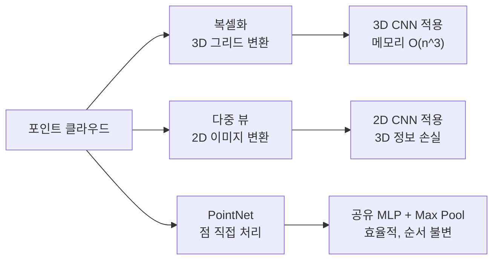
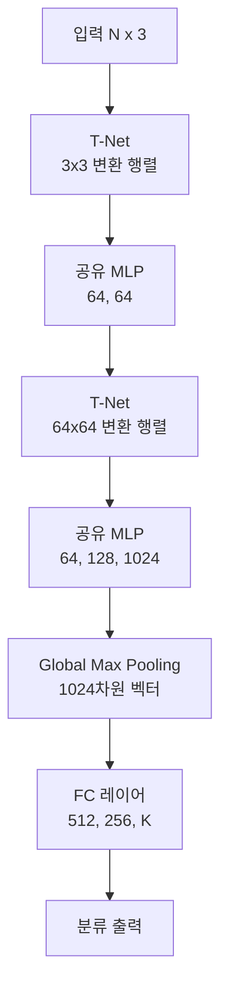
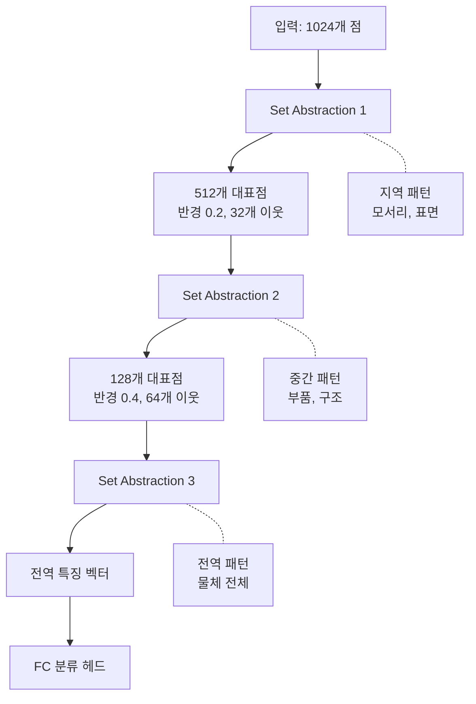

# 포인트 클라우드

> PointNet, PointNet++ 이해

## 개요

[깊이 추정](./01-depth-estimation.md)에서 2D 이미지로부터 각 픽셀의 깊이를 예측했습니다. 이 깊이 정보를 3D 좌표로 변환하면 **포인트 클라우드(Point Cloud)**가 됩니다. 포인트 클라우드는 3D 공간의 점들 집합으로, LiDAR 센서나 RGB-D 카메라에서 직접 얻을 수도 있죠. 이 섹션에서는 포인트 클라우드를 **딥러닝으로 직접 처리**하는 혁신적인 방법, **PointNet**과 **PointNet++**를 배웁니다.

**선수 지식**: [깊이 추정](./01-depth-estimation.md), [CNN 아키텍처](../05-cnn-architectures/03-resnet.md)
**학습 목표**:
- 포인트 클라우드의 특성과 기존 처리 방식의 한계를 이해한다
- PointNet의 핵심 아이디어(순서 불변성, 대칭 함수)를 파악한다
- PointNet++의 계층적 특징 학습 방식을 이해한다
- PyTorch로 포인트 클라우드 분류/분할 모델을 구현할 수 있다

## 왜 알아야 할까?

자율주행차의 LiDAR는 초당 수십만 개의 3D 점을 생성합니다. 로봇 팔이 물건을 집으려면 물체의 3D 형태를 인식해야 하죠. AR/VR 기기는 실시간으로 공간을 스캔합니다. 이 모든 응용에서 **포인트 클라우드를 이해하는 AI**가 필요합니다. PointNet은 2017년 등장 이후 3D 딥러닝의 기초가 되었고, 자율주행, 로봇, 3D 스캐닝 등 산업 전반에 적용되고 있습니다.

## 핵심 개념

### 개념 1: 포인트 클라우드란?

> 💡 **비유**: 포인트 클라우드는 **별이 빼곡한 밤하늘**과 같습니다. 각 별(점)은 3D 공간의 위치(x, y, z)를 가지고, 추가로 색상이나 밝기 정보를 담을 수 있죠. 하지만 별들 사이에는 그리드나 순서가 없습니다. 이게 이미지와의 핵심 차이입니다.

**포인트 클라우드의 특성:**

| 특성 | 설명 |
|------|------|
| **비정형 구조** | 규칙적인 그리드가 없음 (이미지와 다름) |
| **순서 불변** | 점의 순서를 바꿔도 같은 물체 |
| **크기 가변** | 물체마다 점 개수가 다름 |
| **희소성** | 대부분의 3D 공간이 비어있음 |

**포인트 표현:**

| 정보 | 차원 | 설명 |
|------|------|------|
| **위치** | (x, y, z) | 3D 좌표 |
| **색상** | (r, g, b) | RGB 색상 (선택) |
| **법선** | (nx, ny, nz) | 표면 법선 벡터 (선택) |
| **강도** | intensity | LiDAR 반사 강도 (선택) |

### 개념 2: 기존 접근법의 한계

**방법 1: 복셀화 (Voxelization)**

> 💡 **비유**: 3D 공간을 레고 블록처럼 작은 정육면체로 나누고, 각 블록에 점이 있는지 체크

- **장점**: 3D CNN 적용 가능
- **단점**: 해상도 ↑ → 메모리/계산량 $O(n^3)$ 폭발

**방법 2: 다중 뷰 (Multi-View)**

> 💡 **비유**: 3D 물체를 여러 각도에서 사진 찍어 2D CNN으로 처리

- **장점**: 검증된 2D CNN 활용
- **단점**: 뷰 선택 문제, 3D 정보 손실

**방법 3: 포인트 직접 처리 (PointNet의 혁신!)**

> 💡 **비유**: 별 하나하나를 직접 분석하고, 전체 패턴을 이해

- **장점**: 순서/해상도 문제 해결, 효율적
- **단점**: 지역 구조 학습이 어려움 (PointNet++ 해결)

> 📊 **그림 1**: 포인트 클라우드 처리 접근법 비교




### 개념 3: PointNet — 점을 직접 처리하는 최초의 신경망

> 💡 **비유**: 반 친구들의 키를 조사한다고 생각해보세요. 친구들이 **어떤 순서로 줄 서든** 평균 키는 같습니다. PointNet은 이런 **순서 불변성**을 활용해서, 점들의 순서와 관계없이 같은 결과를 내는 신경망을 설계했습니다.

**핵심 아이디어 1: 대칭 함수 (Symmetric Function)**

점들의 순서에 영향받지 않는 함수가 필요합니다. **Max Pooling**이 바로 그런 함수입니다:

> max({1, 2, 3}) = max({3, 1, 2}) = max({2, 3, 1}) = 3

PointNet은 각 점을 독립적으로 처리한 후, **Global Max Pooling**으로 전체 특징을 추출합니다.

**핵심 아이디어 2: 공유 MLP (Shared MLP)**

> 모든 점에 **동일한 네트워크**를 적용

각 점 (x, y, z)에 동일한 MLP를 적용해서 고차원 특징으로 변환합니다. 가중치를 공유하므로 점 개수에 관계없이 동작합니다.

**PointNet 아키텍처:**

> **입력**: N×3 (N개 점, 각 3차원)
> ↓
> **T-Net**: 입력 변환 (3×3 행렬 예측)
> ↓
> **MLP(64, 64)**: 점별 특징 추출
> ↓
> **T-Net**: 특징 변환 (64×64 행렬 예측)
> ↓
> **MLP(64, 128, 1024)**: 점별 고차원 특징
> ↓
> **Global Max Pooling**: 1024차원 글로벌 특징
> ↓
> **FC(512, 256, K)**: 분류 출력

> 📊 **그림 2**: PointNet 아키텍처 흐름




**T-Net (Transformation Network):**

입력 점들이 회전되어 있어도 같은 결과를 내도록, **정규화 변환 행렬**을 학습합니다. 작은 PointNet 구조로 3×3 (또는 64×64) 행렬을 예측해서 입력에 곱합니다.

### 개념 4: PointNet의 한계와 PointNet++

**PointNet의 문제: 지역 구조 무시**

PointNet은 각 점을 **독립적으로** 처리하고 Global Max Pooling으로 합칩니다. 가까운 점들 사이의 **지역적 패턴**을 학습하지 못하죠.

> 💡 **비유**: 숲 전체 사진에서 **"나무가 있다"**는 알 수 있지만, **"나뭇잎 → 가지 → 나무 → 숲"** 같은 계층적 구조를 이해하지 못하는 것과 같습니다.

**PointNet++의 해결책: 계층적 구조**

> 💡 **비유**: CNN이 작은 패턴 → 중간 패턴 → 큰 패턴을 계층적으로 학습하듯, PointNet++는 **근처 점들 → 영역 → 전체 물체**를 계층적으로 학습합니다.

**Set Abstraction 레이어:**

| 단계 | 역할 |
|------|------|
| **Sampling** | FPS(Farthest Point Sampling)로 대표점 선택 |
| **Grouping** | 각 대표점 주변의 이웃점들 수집 |
| **PointNet** | 각 그룹에 PointNet 적용 → 지역 특징 추출 |

> 📊 **그림 3**: Set Abstraction 레이어의 3단계 처리


**FPS (Farthest Point Sampling):**

점들 중에서 **가장 멀리 떨어진 점**을 반복적으로 선택합니다. 균일하게 분포된 대표점을 얻을 수 있죠.

**PointNet++ 아키텍처:**

> **입력**: N×3
> ↓
> **Set Abstraction 1**: N → N₁ (512개 대표점)
> - 각 대표점 주변 32개 점에 PointNet 적용
> ↓
> **Set Abstraction 2**: N₁ → N₂ (128개 대표점)
> - 각 대표점 주변 64개 점에 PointNet 적용
> ↓
> **Set Abstraction 3**: N₂ → 전역 특징
> ↓
> **FC layers**: 분류 출력

**Multi-Scale Grouping (MSG):**

다양한 반경으로 그룹을 만들어 **여러 스케일의 특징**을 함께 학습합니다. 점 밀도가 균일하지 않은 실제 데이터에 강건합니다.

> 📊 **그림 4**: PointNet++ 계층적 특징 학습




### 개념 5: 포인트 클라우드 작업 유형

**1. 분류 (Classification)**

전체 포인트 클라우드가 어떤 물체인지 예측 (의자, 테이블, 자동차...)

**2. 파트 분할 (Part Segmentation)**

각 점이 물체의 어느 부분인지 예측 (의자의 다리, 등받이, 좌석...)

> 분류와 달리 **점별 예측**이 필요 → 글로벌 특징 + 점별 특징 결합

**3. 시맨틱 분할 (Semantic Segmentation)**

실내/실외 장면에서 각 점의 클래스 예측 (바닥, 벽, 가구...)

**4. 객체 탐지 (3D Object Detection)**

3D 바운딩 박스로 물체 위치와 클래스 예측

| 모델 | 방식 |
|------|------|
| **PointPillars** | 수직 기둥으로 복셀화 후 2D CNN |
| **VoxelNet** | 3D 복셀 + 3D CNN |
| **PointRCNN** | PointNet++ 백본 + RoI |
| **CenterPoint** | 중심점 기반 탐지 |

## 실습: PointNet 구현

### 기본 PointNet 분류기

```python
import torch
import torch.nn as nn
import torch.nn.functional as F

class TNet(nn.Module):
    """입력/특징 변환 네트워크"""
    def __init__(self, k=3):
        super().__init__()
        self.k = k

        # 점별 MLP
        self.conv1 = nn.Conv1d(k, 64, 1)
        self.conv2 = nn.Conv1d(64, 128, 1)
        self.conv3 = nn.Conv1d(128, 1024, 1)

        # 변환 행렬 예측
        self.fc1 = nn.Linear(1024, 512)
        self.fc2 = nn.Linear(512, 256)
        self.fc3 = nn.Linear(256, k * k)

        self.bn1 = nn.BatchNorm1d(64)
        self.bn2 = nn.BatchNorm1d(128)
        self.bn3 = nn.BatchNorm1d(1024)
        self.bn4 = nn.BatchNorm1d(512)
        self.bn5 = nn.BatchNorm1d(256)

    def forward(self, x):
        """
        x: (B, k, N) - 배치, 차원, 점 개수
        출력: (B, k, k) - 변환 행렬
        """
        B = x.size(0)

        # 점별 특징 추출
        x = F.relu(self.bn1(self.conv1(x)))
        x = F.relu(self.bn2(self.conv2(x)))
        x = F.relu(self.bn3(self.conv3(x)))

        # Global Max Pooling
        x = torch.max(x, dim=2)[0]  # (B, 1024)

        # 변환 행렬 예측
        x = F.relu(self.bn4(self.fc1(x)))
        x = F.relu(self.bn5(self.fc2(x)))
        x = self.fc3(x)

        # 항등 행렬 추가 (안정적인 학습)
        identity = torch.eye(self.k, device=x.device).view(1, -1).repeat(B, 1)
        x = x + identity

        x = x.view(B, self.k, self.k)
        return x


class PointNetEncoder(nn.Module):
    """PointNet 인코더 (글로벌 특징 추출)"""
    def __init__(self):
        super().__init__()

        # 입력 변환
        self.tnet_input = TNet(k=3)

        # 점별 MLP
        self.conv1 = nn.Conv1d(3, 64, 1)
        self.conv2 = nn.Conv1d(64, 64, 1)

        # 특징 변환
        self.tnet_feat = TNet(k=64)

        # 더 깊은 MLP
        self.conv3 = nn.Conv1d(64, 64, 1)
        self.conv4 = nn.Conv1d(64, 128, 1)
        self.conv5 = nn.Conv1d(128, 1024, 1)

        self.bn1 = nn.BatchNorm1d(64)
        self.bn2 = nn.BatchNorm1d(64)
        self.bn3 = nn.BatchNorm1d(64)
        self.bn4 = nn.BatchNorm1d(128)
        self.bn5 = nn.BatchNorm1d(1024)

    def forward(self, x):
        """
        x: (B, N, 3) - 배치, 점 개수, 좌표
        출력: (B, 1024) - 글로벌 특징
        """
        B, N, _ = x.shape
        x = x.transpose(1, 2)  # (B, 3, N)

        # 입력 변환
        trans_input = self.tnet_input(x)
        x = torch.bmm(trans_input, x)  # (B, 3, N)

        # 첫 번째 MLP
        x = F.relu(self.bn1(self.conv1(x)))
        x = F.relu(self.bn2(self.conv2(x)))

        # 특징 변환
        trans_feat = self.tnet_feat(x)
        x = torch.bmm(trans_feat, x)  # (B, 64, N)

        # 점별 특징 저장 (세그멘테이션용)
        point_features = x

        # 두 번째 MLP
        x = F.relu(self.bn3(self.conv3(x)))
        x = F.relu(self.bn4(self.conv4(x)))
        x = F.relu(self.bn5(self.conv5(x)))

        # Global Max Pooling
        global_features = torch.max(x, dim=2)[0]  # (B, 1024)

        return global_features, point_features, trans_feat


class PointNetClassifier(nn.Module):
    """PointNet 분류 모델"""
    def __init__(self, num_classes=40):
        super().__init__()
        self.encoder = PointNetEncoder()

        # 분류 헤드
        self.fc1 = nn.Linear(1024, 512)
        self.fc2 = nn.Linear(512, 256)
        self.fc3 = nn.Linear(256, num_classes)

        self.bn1 = nn.BatchNorm1d(512)
        self.bn2 = nn.BatchNorm1d(256)
        self.dropout = nn.Dropout(0.4)

    def forward(self, x):
        """
        x: (B, N, 3)
        출력: (B, num_classes)
        """
        global_feat, _, trans_feat = self.encoder(x)

        x = F.relu(self.bn1(self.fc1(global_feat)))
        x = self.dropout(x)
        x = F.relu(self.bn2(self.fc2(x)))
        x = self.dropout(x)
        x = self.fc3(x)

        return x, trans_feat


# 테스트
if __name__ == "__main__":
    # 임의의 포인트 클라우드 (배치 4, 점 1024개, 좌표 3)
    points = torch.randn(4, 1024, 3)

    model = PointNetClassifier(num_classes=40)
    logits, trans = model(points)

    print(f"입력: {points.shape}")        # [4, 1024, 3]
    print(f"출력 logits: {logits.shape}") # [4, 40]
    print(f"변환 행렬: {trans.shape}")    # [4, 64, 64]
```

### PointNet++ Set Abstraction

```python
import torch
import torch.nn as nn
import torch.nn.functional as F


def farthest_point_sample(xyz, npoint):
    """
    FPS(Farthest Point Sampling) 구현

    Args:
        xyz: (B, N, 3) - 입력 점들
        npoint: 샘플링할 점 개수

    Returns:
        centroids: (B, npoint) - 선택된 점들의 인덱스
    """
    device = xyz.device
    B, N, C = xyz.shape

    centroids = torch.zeros(B, npoint, dtype=torch.long, device=device)
    distance = torch.ones(B, N, device=device) * 1e10

    # 첫 점은 랜덤 선택
    farthest = torch.randint(0, N, (B,), dtype=torch.long, device=device)

    for i in range(npoint):
        centroids[:, i] = farthest

        # 현재 점의 좌표
        centroid = xyz[torch.arange(B), farthest, :].view(B, 1, 3)

        # 모든 점까지의 거리 계산
        dist = torch.sum((xyz - centroid) ** 2, dim=-1)

        # 가장 가까운 centroid까지의 거리 업데이트
        distance = torch.min(distance, dist)

        # 가장 먼 점 선택
        farthest = torch.argmax(distance, dim=-1)

    return centroids


def query_ball_point(radius, nsample, xyz, new_xyz):
    """
    반경 내 점 쿼리

    Args:
        radius: 검색 반경
        nsample: 그룹당 최대 점 개수
        xyz: (B, N, 3) - 전체 점
        new_xyz: (B, S, 3) - 중심점

    Returns:
        group_idx: (B, S, nsample) - 그룹 인덱스
    """
    device = xyz.device
    B, N, _ = xyz.shape
    _, S, _ = new_xyz.shape

    # 거리 계산
    sqrdists = torch.cdist(new_xyz, xyz) ** 2  # (B, S, N)

    # 반경 내 점들만 선택
    group_idx = torch.arange(N, device=device).view(1, 1, N).repeat(B, S, 1)
    group_idx[sqrdists > radius ** 2] = N  # 범위 밖은 N으로 설정

    # 가까운 순으로 정렬하고 상위 nsample개 선택
    group_idx = group_idx.sort(dim=-1)[0][:, :, :nsample]

    # 부족한 점은 첫 번째 점으로 채우기
    group_first = group_idx[:, :, 0].view(B, S, 1).repeat(1, 1, nsample)
    mask = group_idx == N
    group_idx[mask] = group_first[mask]

    return group_idx


class SetAbstraction(nn.Module):
    """PointNet++ Set Abstraction 레이어"""
    def __init__(self, npoint, radius, nsample, in_channel, mlp_channels):
        super().__init__()
        self.npoint = npoint
        self.radius = radius
        self.nsample = nsample

        # 그룹 내 PointNet
        self.mlp = nn.ModuleList()
        last_channel = in_channel + 3  # xyz 좌표 포함

        for out_channel in mlp_channels:
            self.mlp.append(nn.Conv2d(last_channel, out_channel, 1))
            self.mlp.append(nn.BatchNorm2d(out_channel))
            self.mlp.append(nn.ReLU())
            last_channel = out_channel

    def forward(self, xyz, points):
        """
        xyz: (B, N, 3) - 점 좌표
        points: (B, N, D) - 점 특징 (없으면 None)

        Returns:
            new_xyz: (B, npoint, 3) - 새 중심점
            new_points: (B, npoint, D') - 새 특징
        """
        B, N, C = xyz.shape

        # FPS로 중심점 샘플링
        fps_idx = farthest_point_sample(xyz, self.npoint)  # (B, npoint)

        # 인덱스로 좌표 추출
        new_xyz = torch.gather(
            xyz, 1,
            fps_idx.unsqueeze(-1).repeat(1, 1, 3)
        )  # (B, npoint, 3)

        # Ball Query로 이웃 점 그룹화
        group_idx = query_ball_point(
            self.radius, self.nsample, xyz, new_xyz
        )  # (B, npoint, nsample)

        # 그룹 좌표 추출
        grouped_xyz = torch.gather(
            xyz.unsqueeze(2).repeat(1, 1, self.nsample, 1),
            1,
            group_idx.unsqueeze(-1).repeat(1, 1, 1, 3)
        )  # (B, npoint, nsample, 3)

        # 중심점 기준 상대 좌표
        grouped_xyz -= new_xyz.unsqueeze(2)

        # 특징 그룹화
        if points is not None:
            grouped_points = torch.gather(
                points.unsqueeze(2).repeat(1, 1, self.nsample, 1),
                1,
                group_idx.unsqueeze(-1).repeat(1, 1, 1, points.size(-1))
            )
            grouped_points = torch.cat([grouped_xyz, grouped_points], dim=-1)
        else:
            grouped_points = grouped_xyz

        # (B, npoint, nsample, C) → (B, C, npoint, nsample)
        grouped_points = grouped_points.permute(0, 3, 1, 2)

        # MLP 적용
        for layer in self.mlp:
            grouped_points = layer(grouped_points)

        # Max Pooling (그룹 내)
        new_points = torch.max(grouped_points, dim=-1)[0]  # (B, C', npoint)
        new_points = new_points.permute(0, 2, 1)  # (B, npoint, C')

        return new_xyz, new_points


# 간단한 PointNet++ 테스트
if __name__ == "__main__":
    xyz = torch.randn(2, 1024, 3)

    sa1 = SetAbstraction(
        npoint=512, radius=0.2, nsample=32,
        in_channel=0, mlp_channels=[64, 64, 128]
    )

    new_xyz, new_points = sa1(xyz, None)
    print(f"SA1: {xyz.shape} → xyz: {new_xyz.shape}, points: {new_points.shape}")
    # [2, 1024, 3] → [2, 512, 3], [2, 512, 128]
```

### Open3D로 포인트 클라우드 시각화

```python
import numpy as np
import open3d as o3d

def visualize_pointcloud_classification(points, pred_class, class_names):
    """
    포인트 클라우드 분류 결과 시각화

    Args:
        points: (N, 3) numpy array
        pred_class: 예측 클래스 인덱스
        class_names: 클래스 이름 리스트
    """
    # 포인트 클라우드 생성
    pcd = o3d.geometry.PointCloud()
    pcd.points = o3d.utility.Vector3dVector(points)

    # 단색으로 칠하기 (예측 클래스에 따라)
    color = np.random.rand(3)  # 클래스별 랜덤 색상
    pcd.colors = o3d.utility.Vector3dVector(
        np.tile(color, (len(points), 1))
    )

    print(f"예측: {class_names[pred_class]}")
    o3d.visualization.draw_geometries([pcd])


def visualize_part_segmentation(points, labels, num_parts):
    """
    파트 분할 결과 시각화

    Args:
        points: (N, 3) numpy array
        labels: (N,) 파트 라벨
        num_parts: 파트 개수
    """
    pcd = o3d.geometry.PointCloud()
    pcd.points = o3d.utility.Vector3dVector(points)

    # 파트별 색상 할당
    cmap = plt.cm.get_cmap("tab20")
    colors = np.array([cmap(label / num_parts)[:3] for label in labels])
    pcd.colors = o3d.utility.Vector3dVector(colors)

    o3d.visualization.draw_geometries([pcd])


# ModelNet40 데이터셋 로드 예시
def load_modelnet40_sample():
    """ModelNet40 샘플 로드 (간단한 예시)"""
    # 실제로는 h5 또는 numpy 파일에서 로드
    # 여기서는 임의의 의자 형태 생성

    # 좌석 (평면)
    seat = np.random.randn(256, 3) * [0.4, 0.05, 0.4]
    seat[:, 1] += 0.5

    # 등받이 (수직 평면)
    back = np.random.randn(128, 3) * [0.4, 0.3, 0.05]
    back[:, 1] += 0.8
    back[:, 2] -= 0.2

    # 다리 4개
    legs = []
    for dx, dz in [(-0.3, -0.3), (0.3, -0.3), (-0.3, 0.3), (0.3, 0.3)]:
        leg = np.random.randn(64, 3) * [0.05, 0.25, 0.05]
        leg[:, 0] += dx
        leg[:, 2] += dz
        legs.append(leg)

    points = np.concatenate([seat, back] + legs, axis=0)
    return points.astype(np.float32)


if __name__ == "__main__":
    import matplotlib.pyplot as plt

    # 샘플 포인트 클라우드 시각화
    points = load_modelnet40_sample()

    pcd = o3d.geometry.PointCloud()
    pcd.points = o3d.utility.Vector3dVector(points)
    pcd.paint_uniform_color([0.3, 0.6, 0.9])

    print(f"포인트 수: {len(points)}")
    o3d.visualization.draw_geometries([pcd])
```

## 더 깊이 알아보기: PointNet의 탄생

**2016년 — Stanford 대학원생의 혁신**

Charles R. Qi는 Stanford에서 박사 과정 중 3D 데이터 처리 문제에 직면했습니다. 당시 방법들(복셀화, 멀티뷰)은 모두 비효율적이거나 정보 손실이 있었죠. 그는 **"점 집합을 직접 처리할 수 없을까?"**라는 질문에서 출발했습니다.

핵심 통찰은 **대칭 함수**였습니다. 점들의 순서는 의미가 없으니, 순서에 영향받지 않는 함수(예: max, sum)를 사용하면 됩니다. 이 간단한 아이디어로 복잡한 복셀화 없이도 3D 인식이 가능해졌습니다.

**2017년 — PointNet++ 발표**

PointNet의 한계(지역 구조 무시)를 해결하기 위해 **계층적 구조**를 도입했습니다. CNN이 이미지에서 계층적 특징을 학습하듯, PointNet++는 포인트 클라우드에서 **근처 점 → 영역 → 전체**의 계층을 학습합니다.

**이후 발전:**

| 모델 | 핵심 아이디어 |
|------|---------------|
| **DGCNN** | 동적 그래프 CNN, EdgeConv |
| **PointTransformer** | Transformer를 점에 적용 |
| **PointNeXt** | 현대적 학습 기법 + PointNet++ |
| **Point-BERT** | BERT 스타일 사전학습 |

## 흔한 오해와 팁

> ⚠️ **흔한 오해**: "점이 많을수록 무조건 좋다"
>
> 그렇지 않습니다. 점이 너무 많으면 메모리/계산량이 폭발하고, 노이즈도 증가합니다. 보통 **1024~4096점**으로 다운샘플링해서 사용합니다. FPS(Farthest Point Sampling)로 균일하게 샘플링하는 것이 중요합니다.

> 💡 **알고 계셨나요?**: PointNet의 Global Max Pooling은 **Critical Points**라는 개념을 만들어냅니다. 전체 특징을 결정하는 핵심 점들만 남고, 나머지는 무시됩니다. 놀랍게도 이 Critical Points만으로도 물체의 윤곽이 드러납니다!

> 🔥 **실무 팁**: 포인트 클라우드 전처리에서 **정규화**가 중요합니다. 중심을 원점으로 이동하고, 가장 먼 점까지의 거리를 1로 스케일링하면 학습이 안정됩니다.

> 🔥 **실무 팁**: 실제 LiDAR 데이터는 **점 밀도가 불균일**합니다. 가까운 물체는 점이 많고, 먼 물체는 희소합니다. PointNet++의 MSG(Multi-Scale Grouping)가 이 문제에 효과적입니다.

## 핵심 정리

| 개념 | 설명 |
|------|------|
| **포인트 클라우드** | 3D 점들의 비정형 집합, 순서 없음 |
| **PointNet** | 대칭 함수(Max Pooling)로 점 직접 처리 |
| **T-Net** | 입력/특징 정규화 변환 학습 |
| **PointNet++** | 계층적 Set Abstraction으로 지역 특징 학습 |
| **FPS** | Farthest Point Sampling, 균일한 대표점 선택 |
| **Set Abstraction** | Sampling + Grouping + PointNet |

## 다음 섹션 미리보기

포인트 클라우드를 딥러닝으로 처리하는 방법을 배웠습니다. 하지만 RGB 이미지에서 3D 정보를 추출하려면 **카메라가 어떻게 작동하는지** 이해해야 합니다. 다음 섹션 [카메라 기하학](./03-camera-geometry.md)에서는 **카메라 내부/외부 파라미터**, **에피폴라 기하학**, **기본 행렬(Fundamental Matrix)** 등 3D 컴퓨터 비전의 수학적 기초를 배웁니다.

## 참고 자료

- [PointNet 논문 (CVPR 2017)](https://arxiv.org/abs/1612.00593) - 원조 논문
- [PointNet++ 논문 (NeurIPS 2017)](https://arxiv.org/abs/1706.02413) - 계층적 확장
- [PointNet 공식 페이지](https://stanford.edu/~rqi/pointnet/) - Stanford
- [Keras PointNet 튜토리얼](https://keras.io/examples/vision/pointnet/) - 실습 가이드
- [Open3D 문서](http://www.open3d.org/docs/) - 포인트 클라우드 시각화/처리
