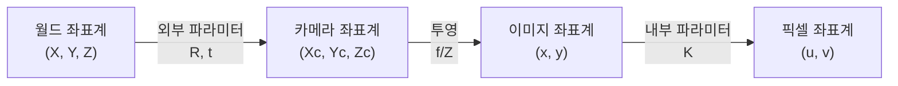
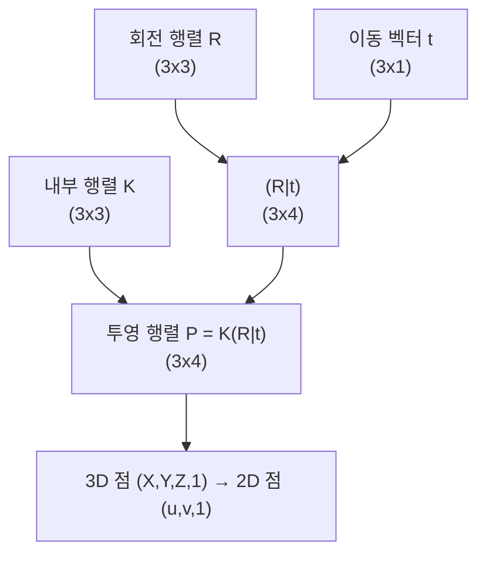
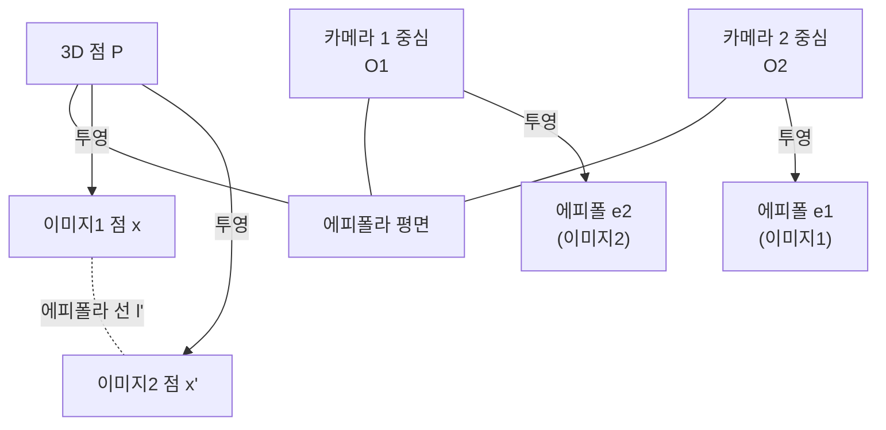
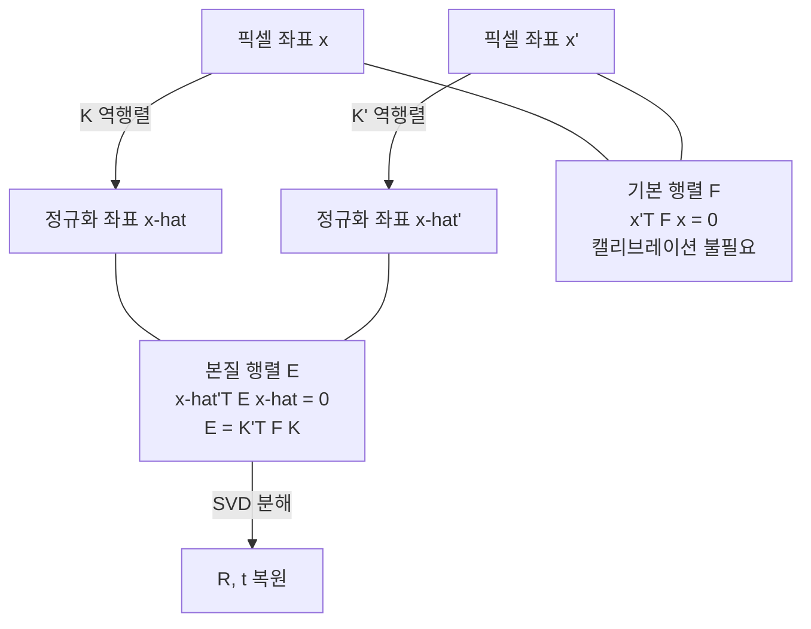

# 카메라 기하학

> 내부/외부 파라미터, 에피폴라 기하

## 개요

[포인트 클라우드](./02-point-clouds.md)에서 3D 점들을 직접 처리하는 방법을 배웠습니다. 하지만 실제로 3D 정보를 얻으려면 **카메라가 3D 세계를 2D 이미지로 변환하는 원리**를 이해해야 합니다. 이 섹션에서는 **핀홀 카메라 모델**, **내부/외부 파라미터**, 그리고 두 카메라 사이의 기하학적 관계인 **에피폴라 기하학**을 배웁니다. 이 지식은 3D 복원, SLAM, AR의 수학적 기초입니다.

**선수 지식**: [깊이 추정](./01-depth-estimation.md), 기초 선형대수
**학습 목표**:
- 핀홀 카메라 모델과 투영 방정식을 이해한다
- 내부 파라미터(K)와 외부 파라미터(R, t)의 역할을 파악한다
- 에피폴라 기하학과 기본 행렬(F), 본질 행렬(E)을 이해한다
- OpenCV로 카메라 캘리브레이션을 수행할 수 있다

## 왜 알아야 할까?

AR 앱이 책상 위에 가상 컵을 올바른 위치에 렌더링하려면, 카메라의 위치와 방향을 정확히 알아야 합니다. 자율주행차가 스테레오 카메라로 거리를 측정하려면, 두 카메라의 기하학적 관계를 알아야 합니다. Structure from Motion으로 사진에서 3D 모델을 만들려면, 각 사진이 어디서 찍혔는지 계산해야 합니다. **카메라 기하학**은 이 모든 것의 수학적 기반입니다.

## 핵심 개념

### 개념 1: 핀홀 카메라 모델

> 📊 **그림 1**: 3D 점이 2D 이미지로 투영되는 좌표 변환 흐름




> 💡 **비유**: 핀홀 카메라는 **어두운 방에 작은 구멍을 뚫은 것**입니다. 구멍을 통과한 빛이 반대편 벽에 거꾸로 된 상을 맺죠. 카메라 렌즈도 본질적으로 같은 원리이며, 수학적으로 단순화하면 핀홀 모델이 됩니다.

**3D → 2D 투영:**

3D 공간의 점 $P = (X, Y, Z)$가 이미지 평면의 점 $p = (u, v)$로 투영되는 과정:

> **투영 공식** (이상적 핀홀):
>
> $u = f \cdot \frac{X}{Z}, \quad v = f \cdot \frac{Y}{Z}$
>
> - $f$: 초점 거리 (focal length)
> - $Z$: 깊이 (카메라로부터의 거리)

**좌표계 정리:**

| 좌표계 | 설명 | 단위 |
|--------|------|------|
| **월드 좌표계** | 실제 3D 공간 | 미터 |
| **카메라 좌표계** | 카메라 중심 기준 | 미터 |
| **이미지 좌표계** | 이미지 평면 (연속) | 미터 |
| **픽셀 좌표계** | 디지털 이미지 | 픽셀 |

### 개념 2: 내부 파라미터 (Intrinsic Parameters)

> 💡 **비유**: 내부 파라미터는 **카메라의 "눈" 특성**입니다. 렌즈의 초점 거리, 센서의 중심 위치 등 카메라 자체의 고유한 성질을 나타냅니다. 같은 카메라는 어디서 찍든 내부 파라미터가 같습니다.

**내부 행렬 K (Camera Matrix):**

$$K = \begin{bmatrix} f_x & s & c_x \\ 0 & f_y & c_y \\ 0 & 0 & 1 \end{bmatrix}$$

| 파라미터 | 설명 |
|----------|------|
| $f_x, f_y$ | 초점 거리 (픽셀 단위) |
| $c_x, c_y$ | 주점 (Principal Point) - 이미지 중심 |
| $s$ | 비대칭 계수 (Skew) - 보통 0 |

**왜 $f_x \neq f_y$일 수 있나요?**

센서의 픽셀이 정사각형이 아닐 수 있습니다. 또한 렌즈 왜곡이나 제조 오차로 가로/세로 배율이 다를 수 있죠.

**왜곡 계수 (Distortion Coefficients):**

실제 렌즈는 이상적이지 않아서 **왜곡**이 발생합니다:

| 종류 | 설명 | 효과 |
|------|------|------|
| **방사 왜곡** | 렌즈 중심에서의 거리에 따른 왜곡 | 배럴/핀쿠션 |
| **접선 왜곡** | 렌즈가 센서와 평행하지 않음 | 기울어진 상 |

> **왜곡 모델**:
>
> $k_1, k_2, k_3$: 방사 왜곡 계수
> $p_1, p_2$: 접선 왜곡 계수

### 개념 3: 외부 파라미터 (Extrinsic Parameters)

> 📊 **그림 2**: 투영 행렬 P의 구성 — 내부/외부 파라미터의 결합




> 💡 **비유**: 외부 파라미터는 **카메라가 세상 어디에, 어느 방향을 보고 있는지**입니다. 같은 카메라도 위치와 방향을 바꾸면 외부 파라미터가 달라집니다. 마치 "눈의 위치와 시선 방향"과 같죠.

**외부 파라미터:**

| 파라미터 | 차원 | 설명 |
|----------|------|------|
| **회전 (R)** | 3×3 | 월드 → 카메라 좌표 회전 |
| **이동 (t)** | 3×1 | 월드 → 카메라 좌표 이동 |

**변환 방정식:**

$$P_{camera} = R \cdot P_{world} + t$$

**동차 좌표로 표현:**

$$\begin{bmatrix} u \\ v \\ 1 \end{bmatrix} = K \begin{bmatrix} R | t \end{bmatrix} \begin{bmatrix} X \\ Y \\ Z \\ 1 \end{bmatrix}$$

**투영 행렬 P:**

$$P = K [R | t]$$

3×4 행렬로, 3D 점을 2D 이미지 좌표로 직접 변환합니다.

### 개념 4: 에피폴라 기하학

> 📊 **그림 3**: 에피폴라 기하학의 핵심 요소 — 두 카메라와 3D 점의 관계




> 💡 **비유**: 두 눈으로 물체를 볼 때, 왼쪽 눈에서 보이는 점이 오른쪽 눈에서는 **특정 선 위**에 있어야 합니다. 마치 빛이 왼쪽 눈을 통과하는 광선이 오른쪽 눈에서 선으로 보이는 것처럼요. 이게 **에피폴라 선**입니다.

**핵심 요소:**

| 용어 | 설명 |
|------|------|
| **에피폴 (Epipole)** | 다른 카메라의 중심이 이미지에 투영된 점 |
| **에피폴라 선 (Epipolar Line)** | 한 이미지의 점에 대응하는 다른 이미지의 선 |
| **에피폴라 평면** | 3D 점과 두 카메라 중심을 포함하는 평면 |

**에피폴라 제약:**

> 왼쪽 이미지의 점 $x$에 대응하는 오른쪽 이미지의 점 $x'$는 반드시 **에피폴라 선 위**에 있습니다.

이 제약 덕분에 스테레오 매칭에서 **2D 검색을 1D 검색**으로 줄일 수 있습니다!

### 개념 5: 기본 행렬 (Fundamental Matrix)과 본질 행렬 (Essential Matrix)

> 📊 **그림 4**: 기본 행렬(F)과 본질 행렬(E)의 관계




**기본 행렬 F:**

> 💡 **비유**: 기본 행렬은 **두 이미지 사이의 번역기**입니다. 한 이미지의 점을 넣으면, 다른 이미지에서 그 점이 있어야 할 **에피폴라 선**을 알려줍니다.

$$x'^T F x = 0$$

- $x$: 첫 번째 이미지의 점 (동차 좌표)
- $x'$: 두 번째 이미지의 대응점
- $F$: 3×3 기본 행렬 (rank 2)

**기본 행렬의 특성:**

| 특성 | 설명 |
|------|------|
| **크기** | 3×3 |
| **랭크** | 2 (특이값 하나가 0) |
| **자유도** | 7 (스케일 제외 8개 파라미터, det=0 제약 -1) |
| **추정** | 최소 7~8 대응점 필요 |

**에피폴라 선 계산:**

- 오른쪽 이미지의 에피폴라 선: $l' = Fx$
- 왼쪽 이미지의 에피폴라 선: $l = F^T x'$

**본질 행렬 E:**

본질 행렬은 **캘리브레이션된 좌표**에서의 기본 행렬입니다:

$$E = K'^T F K$$

$$\hat{x}'^T E \hat{x} = 0$$

- $\hat{x} = K^{-1}x$: 정규화된 카메라 좌표

**본질 행렬과 외부 파라미터:**

$$E = [t]_\times R$$

- $[t]_\times$: 이동 벡터의 반대칭 행렬 (Skew-symmetric)
- $R$: 회전 행렬

SVD로 $E$를 분해하면 $R$과 $t$를 복원할 수 있습니다!

## 실습: 카메라 캘리브레이션

### 체스보드를 이용한 캘리브레이션

> 📊 **그림 5**: 스테레오 비전 3D 복원 파이프라인


```python
import cv2
import numpy as np
import glob

def calibrate_camera(image_folder, pattern_size=(9, 6), square_size=0.025):
    """
    체스보드 패턴으로 카메라 캘리브레이션

    Args:
        image_folder: 체스보드 이미지 폴더 경로
        pattern_size: 내부 코너 개수 (가로, 세로)
        square_size: 정사각형 한 변 크기 (미터)

    Returns:
        ret: 재투영 오차
        K: 내부 행렬
        dist: 왜곡 계수
        rvecs, tvecs: 각 이미지의 회전/이동 벡터
    """
    # 3D 점 좌표 (체스보드 평면, Z=0)
    objp = np.zeros((pattern_size[0] * pattern_size[1], 3), np.float32)
    objp[:, :2] = np.mgrid[0:pattern_size[0], 0:pattern_size[1]].T.reshape(-1, 2)
    objp *= square_size

    # 점 저장 리스트
    obj_points = []  # 3D 점
    img_points = []  # 2D 점

    # 이미지 로드 및 코너 검출
    images = glob.glob(f"{image_folder}/*.jpg")
    print(f"발견된 이미지: {len(images)}개")

    for fname in images:
        img = cv2.imread(fname)
        gray = cv2.cvtColor(img, cv2.COLOR_BGR2GRAY)

        # 체스보드 코너 찾기
        ret, corners = cv2.findChessboardCorners(gray, pattern_size, None)

        if ret:
            obj_points.append(objp)

            # 서브픽셀 정확도로 코너 정제
            criteria = (cv2.TERM_CRITERIA_EPS + cv2.TERM_CRITERIA_MAX_ITER, 30, 0.001)
            corners_refined = cv2.cornerSubPix(gray, corners, (11, 11), (-1, -1), criteria)
            img_points.append(corners_refined)

            # 시각화 (선택)
            cv2.drawChessboardCorners(img, pattern_size, corners_refined, ret)
            cv2.imshow('Corners', img)
            cv2.waitKey(100)

    cv2.destroyAllWindows()

    # 캘리브레이션 수행
    ret, K, dist, rvecs, tvecs = cv2.calibrateCamera(
        obj_points, img_points, gray.shape[::-1], None, None
    )

    print(f"\n캘리브레이션 완료!")
    print(f"재투영 오차: {ret:.4f} 픽셀")
    print(f"\n내부 행렬 K:\n{K}")
    print(f"\n왜곡 계수: {dist.ravel()}")

    return ret, K, dist, rvecs, tvecs


def undistort_image(img, K, dist):
    """왜곡 보정"""
    h, w = img.shape[:2]

    # 최적의 새 카메라 행렬 계산
    new_K, roi = cv2.getOptimalNewCameraMatrix(K, dist, (w, h), 1, (w, h))

    # 왜곡 보정
    undistorted = cv2.undistort(img, K, dist, None, new_K)

    # ROI로 자르기
    x, y, w, h = roi
    undistorted = undistorted[y:y+h, x:x+w]

    return undistorted


# 사용 예시
if __name__ == "__main__":
    # 캘리브레이션 수행
    ret, K, dist, rvecs, tvecs = calibrate_camera(
        "calibration_images/",
        pattern_size=(9, 6),
        square_size=0.025  # 2.5cm
    )

    # 캘리브레이션 결과 저장
    np.savez("camera_calibration.npz", K=K, dist=dist)

    # 새 이미지 왜곡 보정
    test_img = cv2.imread("test.jpg")
    undistorted = undistort_image(test_img, K, dist)

    cv2.imwrite("undistorted.jpg", undistorted)
```

### 기본 행렬과 에피폴라 선 계산

```python
import cv2
import numpy as np
import matplotlib.pyplot as plt

def compute_fundamental_matrix(pts1, pts2, method=cv2.FM_RANSAC):
    """
    대응점으로 기본 행렬 계산

    Args:
        pts1: 첫 번째 이미지의 점들 (N, 2)
        pts2: 두 번째 이미지의 점들 (N, 2)

    Returns:
        F: 기본 행렬 (3, 3)
        mask: 인라이어 마스크
    """
    pts1 = pts1.astype(np.float32)
    pts2 = pts2.astype(np.float32)

    F, mask = cv2.findFundamentalMat(pts1, pts2, method, ransacReprojThreshold=3.0)

    print(f"기본 행렬 F:\n{F}")
    print(f"인라이어: {mask.sum()}/{len(mask)}")

    return F, mask


def draw_epipolar_lines(img1, img2, pts1, pts2, F):
    """
    에피폴라 선 시각화

    Args:
        img1, img2: 두 이미지
        pts1, pts2: 대응점
        F: 기본 행렬
    """
    def draw_lines(img, lines, pts):
        """이미지에 에피폴라 선 그리기"""
        h, w = img.shape[:2]
        img_color = cv2.cvtColor(img, cv2.COLOR_GRAY2BGR)

        for line, pt in zip(lines, pts):
            color = tuple(np.random.randint(0, 255, 3).tolist())

            # 선 시작/끝점 계산
            a, b, c = line
            x0, y0 = 0, int(-c / b)
            x1, y1 = w, int(-(c + a * w) / b)

            cv2.line(img_color, (x0, y0), (x1, y1), color, 1)
            cv2.circle(img_color, tuple(pt.astype(int)), 5, color, -1)

        return img_color

    # 오른쪽 이미지의 에피폴라 선 (Fx)
    lines2 = cv2.computeCorrespondEpilines(pts1.reshape(-1, 1, 2), 1, F)
    lines2 = lines2.reshape(-1, 3)
    img2_lines = draw_lines(img2, lines2, pts2)

    # 왼쪽 이미지의 에피폴라 선 (F^T x')
    lines1 = cv2.computeCorrespondEpilines(pts2.reshape(-1, 1, 2), 2, F)
    lines1 = lines1.reshape(-1, 3)
    img1_lines = draw_lines(img1, lines1, pts1)

    # 시각화
    fig, axes = plt.subplots(1, 2, figsize=(14, 7))
    axes[0].imshow(img1_lines)
    axes[0].set_title("이미지 1 + 에피폴라 선")
    axes[0].axis("off")

    axes[1].imshow(img2_lines)
    axes[1].set_title("이미지 2 + 에피폴라 선")
    axes[1].axis("off")

    plt.tight_layout()
    plt.savefig("epipolar_lines.png")
    plt.show()


def compute_essential_matrix(F, K1, K2):
    """
    기본 행렬에서 본질 행렬 계산

    E = K2^T * F * K1
    """
    E = K2.T @ F @ K1
    return E


def decompose_essential_matrix(E, K, pts1, pts2):
    """
    본질 행렬에서 R, t 복원

    Args:
        E: 본질 행렬
        K: 카메라 내부 행렬
        pts1, pts2: 대응점

    Returns:
        R: 회전 행렬
        t: 이동 벡터
    """
    # OpenCV의 recoverPose 사용
    _, R, t, mask = cv2.recoverPose(E, pts1, pts2, K)

    print(f"회전 행렬 R:\n{R}")
    print(f"이동 벡터 t:\n{t.flatten()}")

    return R, t


# 사용 예시
if __name__ == "__main__":
    # 두 이미지 로드
    img1 = cv2.imread("view1.jpg", cv2.IMREAD_GRAYSCALE)
    img2 = cv2.imread("view2.jpg", cv2.IMREAD_GRAYSCALE)

    # 특징점 매칭 (SIFT)
    sift = cv2.SIFT_create()
    kp1, desc1 = sift.detectAndCompute(img1, None)
    kp2, desc2 = sift.detectAndCompute(img2, None)

    # BF 매칭
    bf = cv2.BFMatcher()
    matches = bf.knnMatch(desc1, desc2, k=2)

    # 좋은 매칭 필터링 (Lowe's ratio test)
    good_matches = []
    for m, n in matches:
        if m.distance < 0.7 * n.distance:
            good_matches.append(m)

    print(f"좋은 매칭: {len(good_matches)}")

    # 대응점 추출
    pts1 = np.float32([kp1[m.queryIdx].pt for m in good_matches])
    pts2 = np.float32([kp2[m.trainIdx].pt for m in good_matches])

    # 기본 행렬 계산
    F, mask = compute_fundamental_matrix(pts1, pts2)

    # 인라이어만 사용
    pts1_inlier = pts1[mask.ravel() == 1]
    pts2_inlier = pts2[mask.ravel() == 1]

    # 에피폴라 선 시각화
    draw_epipolar_lines(img1, img2, pts1_inlier[:20], pts2_inlier[:20], F)

    # 카메라 행렬이 있다면 본질 행렬 계산
    K = np.array([[800, 0, 320], [0, 800, 240], [0, 0, 1]], dtype=np.float32)
    E = compute_essential_matrix(F, K, K)

    # R, t 복원
    R, t = decompose_essential_matrix(E, K, pts1_inlier, pts2_inlier)
```

### 3D 점 삼각화

```python
import cv2
import numpy as np

def triangulate_points(K, R1, t1, R2, t2, pts1, pts2):
    """
    두 뷰에서 3D 점 삼각화

    Args:
        K: 카메라 내부 행렬
        R1, t1: 첫 번째 카메라 외부 파라미터
        R2, t2: 두 번째 카메라 외부 파라미터
        pts1, pts2: 대응점 (N, 2)

    Returns:
        points_3d: 삼각화된 3D 점 (N, 3)
    """
    # 투영 행렬 계산
    P1 = K @ np.hstack([R1, t1])
    P2 = K @ np.hstack([R2, t2])

    # 삼각화
    pts1_h = pts1.T  # (2, N)
    pts2_h = pts2.T

    points_4d = cv2.triangulatePoints(P1, P2, pts1_h, pts2_h)

    # 동차 좌표 → 3D 좌표
    points_3d = points_4d[:3] / points_4d[3]
    points_3d = points_3d.T  # (N, 3)

    return points_3d


# 사용 예시
if __name__ == "__main__":
    # 카메라 1: 원점
    R1 = np.eye(3)
    t1 = np.zeros((3, 1))

    # 카메라 2: x 방향으로 0.5m 이동, 약간 회전
    R2 = cv2.Rodrigues(np.array([0, 0.1, 0]))[0]  # y축 회전
    t2 = np.array([[0.5], [0], [0]])

    # 예시 대응점
    K = np.array([[800, 0, 320], [0, 800, 240], [0, 0, 1]], dtype=np.float32)
    pts1 = np.array([[100, 150], [200, 180], [300, 200]], dtype=np.float32)
    pts2 = np.array([[80, 150], [180, 180], [280, 200]], dtype=np.float32)

    # 삼각화
    points_3d = triangulate_points(K, R1, t1, R2, t2, pts1, pts2)
    print(f"3D 점:\n{points_3d}")
```

## 더 깊이 알아보기: 멀티뷰 기하학의 역사

**1980년대 — 에피폴라 기하학의 정립**

컴퓨터 비전의 초기에 Longuet-Higgins(1981)가 **본질 행렬(Essential Matrix)**을 도입했습니다. 두 캘리브레이션된 카메라 사이의 관계를 8개 대응점으로 계산할 수 있다는 것을 보였죠.

**1992년 — 기본 행렬과 실용화**

Hartley와 Zisserman의 연구로 **기본 행렬(Fundamental Matrix)**이 정립되었습니다. 캘리브레이션 없이도 두 이미지 사이의 기하학적 관계를 알 수 있게 되었죠. 이 연구는 "Multiple View Geometry in Computer Vision" 책으로 집대성되어, 3D 비전의 교과서가 되었습니다.

**2000년대 — RANSAC과 강건한 추정**

실제 데이터에는 노이즈와 아웃라이어가 있습니다. Fischler와 Bolles의 **RANSAC**(Random Sample Consensus)이 표준 방법이 되어, 잘못된 대응점이 있어도 안정적으로 행렬을 추정할 수 있게 되었습니다.

**2010년대 이후 — 딥러닝과의 만남**

SuperPoint, SuperGlue 같은 딥러닝 기반 특징 매칭이 등장하면서, 더 정확한 대응점을 얻게 되었습니다. 하지만 기하학적 관계를 계산하는 과정은 여전히 전통적인 방법이 사용됩니다.

## 흔한 오해와 팁

> ⚠️ **흔한 오해**: "기본 행렬과 본질 행렬은 같다"
>
> 다릅니다. **본질 행렬(E)**은 캘리브레이션된 정규화 좌표에서 정의되고, **기본 행렬(F)**은 픽셀 좌표에서 정의됩니다. 관계는 $E = K'^T F K$입니다.

> 💡 **알고 계셨나요?**: 에피폴라 제약은 **스테레오 매칭의 핵심**입니다. 전체 이미지에서 대응점을 찾는 대신, 에피폴라 선 위에서만 찾으면 됩니다. 검색 공간이 O(n²)에서 O(n)으로 줄어드는 거죠!

> 🔥 **실무 팁**: 캘리브레이션 품질은 **체스보드 이미지 수와 다양성**에 달려있습니다. 최소 15~20장, 다양한 각도와 위치에서 촬영하세요. 코너가 이미지 가장자리까지 분포하면 더 좋습니다.

> 🔥 **실무 팁**: 기본 행렬 추정에서 **RANSAC**을 반드시 사용하세요. 특징 매칭에는 항상 잘못된 대응점(아웃라이어)이 있고, 이것들이 결과를 크게 왜곡합니다.

## 핵심 정리

| 개념 | 설명 |
|------|------|
| **내부 파라미터 K** | 초점 거리, 주점 등 카메라 고유 특성 |
| **외부 파라미터 R, t** | 월드에서 카메라로의 변환 (위치, 방향) |
| **투영 행렬 P** | P = K[R\|t], 3D→2D 직접 변환 |
| **에피폴라 선** | 한 이미지 점에 대응하는 다른 이미지의 선 |
| **기본 행렬 F** | 픽셀 좌표 기반, 캘리브레이션 불필요 |
| **본질 행렬 E** | 정규화 좌표 기반, R/t 복원 가능 |

## 다음 섹션 미리보기

카메라 기하학의 수학적 기초를 다졌습니다. 다음 섹션 [SLAM 기초](./04-slam.md)에서는 이 지식을 활용해 **로봇이 이동하면서 동시에 지도를 만드는 SLAM(Simultaneous Localization and Mapping)**을 배웁니다. 카메라가 움직이면서 자기 위치를 추정하고, 환경의 3D 구조를 실시간으로 복원하는 기술이죠!

## 참고 자료

- [Multiple View Geometry in Computer Vision](https://www.robots.ox.ac.uk/~vgg/hzbook/) - Hartley & Zisserman의 교과서
- [에피폴라 기하학 해설](https://homepages.inf.ed.ac.uk/rbf/CVonline/LOCAL_COPIES/OWENS/LECT10/node3.html) - 에든버러 대학
- [OpenCV 카메라 캘리브레이션](https://docs.opencv.org/4.x/dc/dbb/tutorial_py_calibration.html) - 공식 튜토리얼
- [Fundamental Matrix 해설](https://en.wikipedia.org/wiki/Fundamental_matrix_(computer_vision)) - Wikipedia
- [에피폴라 기하학 Medium](https://medium.com/@sarcas0705/computer-vision-epipolar-geometry-36b032d697a3) - 시각적 설명
