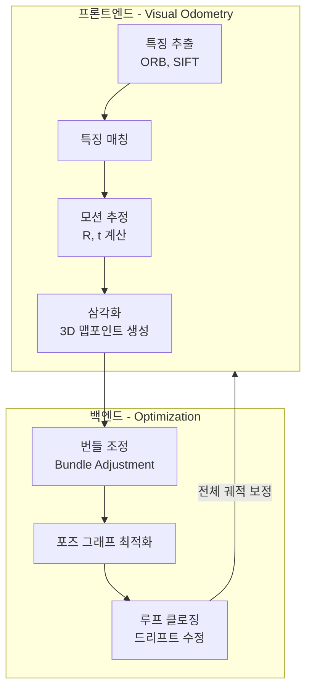
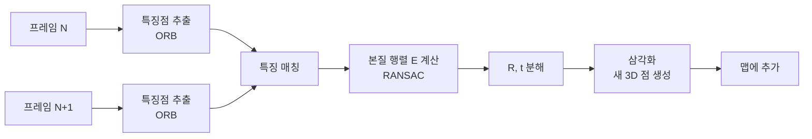
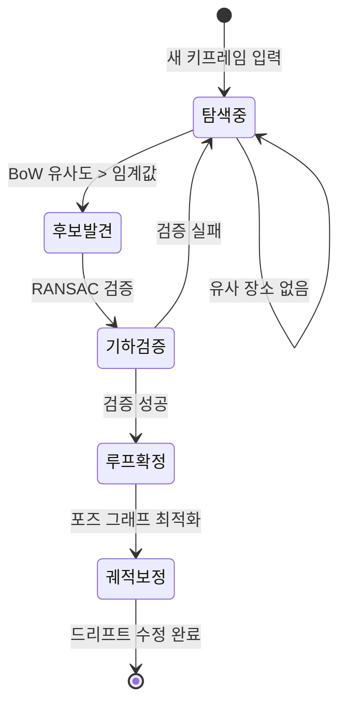
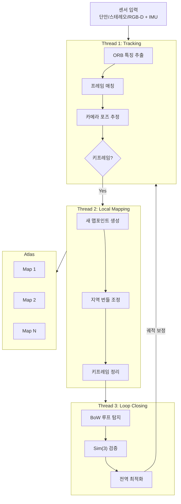
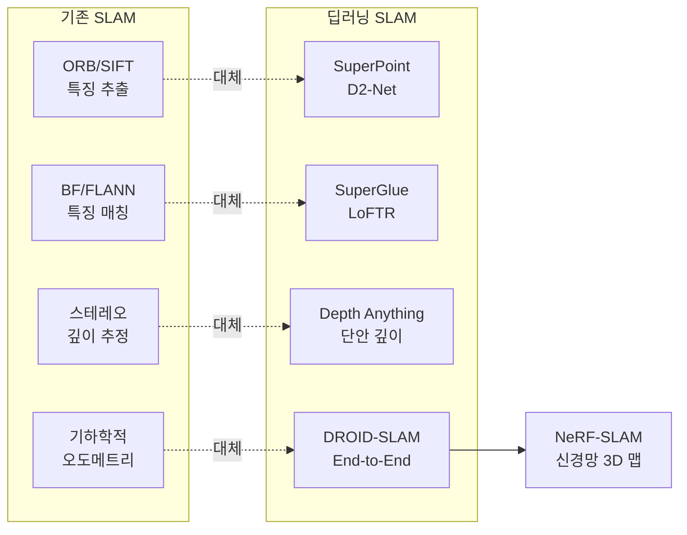

# SLAM 기초

> 동시적 위치추정 및 지도작성

## 개요

[카메라 기하학](./03-camera-geometry.md)에서 두 이미지 사이의 기하학적 관계를 배웠습니다. 이제 카메라가 **움직이면서 연속으로 촬영**한다면 어떨까요? **SLAM(Simultaneous Localization and Mapping)**은 로봇이나 카메라가 **자신의 위치를 추정하면서 동시에 환경 지도를 생성**하는 기술입니다. 자율주행, AR/VR, 드론 네비게이션의 핵심 기술이죠.

**선수 지식**: [카메라 기하학](./03-camera-geometry.md), [특징점 검출](../02-classical-cv/04-feature-detection.md)
**학습 목표**:
- SLAM의 기본 개념과 "닭과 달걀" 문제를 이해한다
- Visual SLAM의 프론트엔드/백엔드 구조를 파악한다
- ORB-SLAM3의 아키텍처를 이해한다
- 루프 클로징과 번들 조정의 역할을 안다

## 왜 알아야 할까?

스마트폰으로 실내를 스캔해서 3D 모델을 만드는 앱, AR 글라스가 현실 공간에 가상 객체를 고정하는 기능, 로봇 청소기가 집 안을 돌아다니며 지도를 만드는 것 — 모두 **SLAM**에 기반합니다. 특히 GPS가 안 되는 실내 환경에서 위치를 파악하는 거의 유일한 방법이죠. 자율주행 로봇, AR 기기, 드론 등 **움직이는 모든 스마트 기기**에 필수적인 기술입니다.

## 핵심 개념

### 개념 1: SLAM이란?

> 💡 **비유**: 눈을 가리고 처음 가보는 건물에 들어갔다고 상상해보세요. 손으로 더듬으며 **"내가 어디에 있지?"**와 **"이 건물은 어떤 구조지?"**를 동시에 알아내야 합니다. 지도가 있으면 위치를 알 수 있고, 위치를 알면 지도를 만들 수 있는데 — 둘 다 없는 상황에서 시작해야 하죠.

**SLAM의 핵심 문제: 닭과 달걀**

| 필요한 것 | 알려면 필요한 것 |
|-----------|------------------|
| 위치 추정 | 지도가 필요 |
| 지도 생성 | 위치가 필요 |

SLAM은 이 **순환 의존성**을 점진적으로 해결합니다. 초기에는 불확실하지만, 관측이 쌓이면서 점점 정확해지죠.

**SLAM의 종류:**

| 종류 | 센서 | 특징 |
|------|------|------|
| **Visual SLAM** | 카메라 (단안/스테레오) | 저렴, 풍부한 정보 |
| **LiDAR SLAM** | LiDAR | 정확한 깊이, 비쌈 |
| **Visual-Inertial** | 카메라 + IMU | 빠른 움직임에 강건 |
| **RGB-D SLAM** | RGB-D 카메라 | 직접적 깊이, 실내 전용 |

이 섹션에서는 **Visual SLAM**에 집중합니다.

### 개념 2: Visual SLAM의 구조

> 📊 **그림 1**: Visual SLAM의 프론트엔드/백엔드 구조




Visual SLAM은 크게 **프론트엔드**와 **백엔드**로 나뉩니다:

**프론트엔드 (Visual Odometry):**

> 💡 **비유**: 운전할 때 앞을 보고 **"방금 10m 직진하고 오른쪽으로 15도 돌았다"**를 판단하는 것. 연속된 프레임 사이의 상대적 움직임을 추정합니다.

| 단계 | 역할 |
|------|------|
| **특징 추출** | ORB, SIFT 등으로 키포인트 검출 |
| **특징 매칭** | 연속 프레임 간 대응점 찾기 |
| **모션 추정** | 에피폴라 기하학으로 R, t 계산 |
| **삼각화** | 3D 맵포인트 생성 |

**백엔드 (Optimization):**

> 💡 **비유**: 여행 후 **"내가 그린 약도가 맞나?"** 검토하고 수정하는 것. 누적된 오차를 줄이고 전체 궤적과 지도를 최적화합니다.

| 기법 | 설명 |
|------|------|
| **번들 조정 (Bundle Adjustment)** | 카메라 포즈와 3D 점을 동시 최적화 |
| **포즈 그래프 최적화** | 카메라 포즈들 간의 관계 최적화 |
| **루프 클로징** | 이전에 방문한 곳 인식 → 드리프트 수정 |

### 개념 3: Visual Odometry — 프레임 간 움직임 추정

> 📊 **그림 2**: 특징 기반 Visual Odometry 파이프라인




**Direct Method vs Feature-based Method:**

| 방식 | 원리 | 장단점 |
|------|------|--------|
| **특징 기반** | 키포인트 매칭 → 기하학적 계산 | 강건, 계산 효율적 |
| **직접법** | 픽셀 밝기 변화 최소화 | 모든 픽셀 활용, 조명에 민감 |
| **하이브리드** | 둘의 장점 결합 | 최신 트렌드 |

**특징 기반 VO 파이프라인:**

> 1. 프레임 N에서 특징점 추출 (ORB)
> 2. 프레임 N과 N+1 사이 특징 매칭
> 3. 기본 행렬/본질 행렬 계산
> 4. R, t 분해 (상대적 포즈)
> 5. 새 3D 점 삼각화
> 6. 맵에 추가

**키프레임 (Keyframe):**

모든 프레임을 처리하면 비효율적입니다. **키프레임**만 선택해서 지도를 관리합니다:

- 충분히 움직였을 때
- 새로운 영역이 보일 때
- 일정 시간이 지났을 때

### 개념 4: 루프 클로징 — 드리프트 수정

> 📊 **그림 3**: 루프 클로징에 의한 드리프트 수정 과정




> 💡 **비유**: 동네를 한 바퀴 돌았는데, 출발점으로 돌아왔을 때 **"어? 여기 아까 출발한 곳이잖아!"**라고 인식하는 것. 그럼 지금까지 쌓인 오차를 한꺼번에 수정할 수 있습니다.

**드리프트 문제:**

Visual Odometry는 프레임마다 작은 오차가 생기고, 이게 **누적**됩니다. 긴 거리를 이동하면 실제 위치와 추정 위치가 크게 어긋나죠.

**루프 클로징 과정:**

1. **루프 탐지**: 현재 이미지와 과거 키프레임 비교 (Bag of Words 등)
2. **검증**: 기하학적 일관성 확인 (RANSAC)
3. **포즈 그래프 최적화**: 루프 제약 추가 → 전체 궤적 수정

**Bag of Words (BoW):**

이미지를 **시각 단어들의 집합**으로 표현합니다. 같은 장소는 비슷한 시각 단어를 가지므로, 빠르게 유사 장소를 찾을 수 있죠.

### 개념 5: ORB-SLAM3 — 현재의 표준

> 📊 **그림 4**: ORB-SLAM3의 3-스레드 아키텍처




ORB-SLAM3(2021)는 가장 완성도 높은 오픈소스 Visual SLAM 시스템입니다.

**ORB-SLAM 발전 과정:**

| 버전 | 연도 | 특징 |
|------|------|------|
| **ORB-SLAM** | 2015 | 단안 Visual SLAM |
| **ORB-SLAM2** | 2017 | 스테레오, RGB-D 지원 |
| **ORB-SLAM3** | 2021 | Visual-Inertial, Multi-map |

**ORB-SLAM3 아키텍처:**

> **3개의 병렬 스레드:**
>
> 1. **Tracking**: 실시간 카메라 포즈 추정
> 2. **Local Mapping**: 지역 맵 최적화, 키프레임 관리
> 3. **Loop Closing**: 루프 탐지 및 전역 최적화

**핵심 모듈:**

| 모듈 | 역할 |
|------|------|
| **ORB 추출** | 빠르고 강건한 특징점 |
| **Covisibility Graph** | 공통 맵포인트를 공유하는 키프레임 연결 |
| **Essential Graph** | 포즈 그래프 최적화용 스패닝 트리 |
| **Atlas** | 다중 맵 관리 (연결되지 않은 영역 처리) |
| **IMU 통합** | 빠른 움직임에서도 안정적 추적 |

**ORB-SLAM3가 강력한 이유:**

1. **ORB 특징점**: 빠르고, 회전/스케일 불변
2. **Covisibility 기반 최적화**: 효율적인 번들 조정
3. **3가지 센서 지원**: 단안, 스테레오, RGB-D
4. **IMU 융합**: Visual-Inertial Odometry
5. **Multi-Map**: 추적 실패 후 복구 가능

### 개념 6: 딥러닝과 SLAM

> 📊 **그림 5**: SLAM 구성 요소별 딥러닝 적용 현황




**기존 SLAM의 한계:**

- 특징 추출/매칭이 조명, 텍스처에 민감
- 동적 객체(움직이는 사람, 차) 처리 어려움
- 사전 지식 활용 부족

**딥러닝 기반 개선:**

| 구성 요소 | 딥러닝 적용 |
|-----------|-------------|
| **특징 추출** | SuperPoint, D2-Net |
| **특징 매칭** | SuperGlue, LoFTR |
| **깊이 추정** | Depth Anything → Dense 맵 생성 |
| **오도메트리** | DROID-SLAM (end-to-end) |
| **동적 객체** | 세그멘테이션으로 제외 |

**DROID-SLAM (2021):**

End-to-end 미분 가능 SLAM. 반복적으로 깊이와 포즈를 업데이트하며, 번들 조정까지 미분 가능하게 구현했습니다.

**NeRF-SLAM (2023~):**

[NeRF](../17-neural-rendering/01-nerf-basics.md)를 SLAM에 통합해서 **포토리얼리스틱 3D 맵**을 생성합니다. 기존의 포인트 클라우드 맵 대신 렌더링 가능한 신경망 표현을 만드는 거죠.

## 실습: 간단한 Visual Odometry 구현

### 단안 Visual Odometry

```python
import cv2
import numpy as np

class SimpleVisualOdometry:
    """간단한 단안 Visual Odometry"""

    def __init__(self, K, feature_detector='orb'):
        """
        Args:
            K: 카메라 내부 행렬 (3x3)
            feature_detector: 'orb' 또는 'sift'
        """
        self.K = K
        self.focal = K[0, 0]
        self.pp = (K[0, 2], K[1, 2])

        # 특징 검출기
        if feature_detector == 'orb':
            self.detector = cv2.ORB_create(nfeatures=2000)
        else:
            self.detector = cv2.SIFT_create()

        # BF 매처
        self.bf = cv2.BFMatcher(cv2.NORM_HAMMING if feature_detector == 'orb'
                                 else cv2.NORM_L2, crossCheck=True)

        # 이전 프레임 저장
        self.prev_frame = None
        self.prev_kp = None
        self.prev_desc = None

        # 누적 포즈
        self.R = np.eye(3)
        self.t = np.zeros((3, 1))

        # 궤적 저장
        self.trajectory = [self.t.copy()]

    def process_frame(self, frame):
        """
        새 프레임 처리, 포즈 업데이트

        Args:
            frame: 그레이스케일 이미지

        Returns:
            R, t: 현재까지의 누적 회전/이동
        """
        # 특징 추출
        kp, desc = self.detector.detectAndCompute(frame, None)

        if self.prev_frame is None:
            # 첫 프레임
            self.prev_frame = frame
            self.prev_kp = kp
            self.prev_desc = desc
            return self.R, self.t

        # 특징 매칭
        matches = self.bf.match(self.prev_desc, desc)
        matches = sorted(matches, key=lambda x: x.distance)

        # 상위 매칭 선택
        good_matches = matches[:min(100, len(matches))]

        if len(good_matches) < 8:
            print("매칭 부족")
            return self.R, self.t

        # 대응점 추출
        pts1 = np.float32([self.prev_kp[m.queryIdx].pt for m in good_matches])
        pts2 = np.float32([kp[m.trainIdx].pt for m in good_matches])

        # 본질 행렬 계산
        E, mask = cv2.findEssentialMat(
            pts2, pts1, self.K,
            method=cv2.RANSAC, prob=0.999, threshold=1.0
        )

        # R, t 복원
        _, R, t, mask = cv2.recoverPose(E, pts2, pts1, self.K)

        # 스케일 (단안은 스케일을 알 수 없어서 1로 가정)
        scale = 1.0

        # 누적 포즈 업데이트
        self.t = self.t + scale * self.R @ t
        self.R = R @ self.R

        # 궤적 저장
        self.trajectory.append(self.t.copy())

        # 다음 프레임을 위해 저장
        self.prev_frame = frame
        self.prev_kp = kp
        self.prev_desc = desc

        return self.R, self.t

    def get_trajectory(self):
        """궤적 반환 (N, 3)"""
        return np.array([t.flatten() for t in self.trajectory])


def visualize_trajectory(trajectory):
    """2D 궤적 시각화 (위에서 본 시점)"""
    import matplotlib.pyplot as plt

    plt.figure(figsize=(10, 10))
    plt.plot(trajectory[:, 0], trajectory[:, 2], 'b-', linewidth=1)
    plt.scatter(trajectory[0, 0], trajectory[0, 2], c='g', s=100, label='시작')
    plt.scatter(trajectory[-1, 0], trajectory[-1, 2], c='r', s=100, label='끝')
    plt.xlabel('X (m)')
    plt.ylabel('Z (m)')
    plt.title('카메라 궤적 (Top View)')
    plt.legend()
    plt.axis('equal')
    plt.grid(True)
    plt.savefig('trajectory.png')
    plt.show()


# 사용 예시
if __name__ == "__main__":
    # 카메라 행렬 (예: KITTI 데이터셋)
    K = np.array([
        [718.856, 0, 607.193],
        [0, 718.856, 185.216],
        [0, 0, 1]
    ])

    vo = SimpleVisualOdometry(K, feature_detector='orb')

    # 비디오 또는 이미지 시퀀스 로드
    cap = cv2.VideoCapture('driving_video.mp4')

    frame_count = 0
    while cap.isOpened():
        ret, frame = cap.read()
        if not ret:
            break

        gray = cv2.cvtColor(frame, cv2.COLOR_BGR2GRAY)

        R, t = vo.process_frame(gray)

        # 100프레임마다 출력
        if frame_count % 100 == 0:
            print(f"Frame {frame_count}: t = {t.flatten()}")

        frame_count += 1

    cap.release()

    # 궤적 시각화
    trajectory = vo.get_trajectory()
    visualize_trajectory(trajectory)
    print(f"총 {len(trajectory)} 포즈 추정 완료")
```

### ORB-SLAM3 사용 예시

```python
# ORB-SLAM3는 C++로 구현되어 있어 Python 래퍼가 필요합니다.
# 여기서는 개념적인 사용법을 보여줍니다.

"""
ORB-SLAM3 설치 및 실행 (Linux):

1. 의존성 설치:
   sudo apt install cmake libopencv-dev libeigen3-dev \
                    libpangolin-dev libboost-all-dev

2. ORB-SLAM3 빌드:
   git clone https://github.com/UZ-SLAMLab/ORB_SLAM3.git
   cd ORB_SLAM3
   chmod +x build.sh
   ./build.sh

3. 실행 예시 (EuRoC 데이터셋, 단안):
   ./Examples/Monocular/mono_euroc \
       Vocabulary/ORBvoc.txt \
       Examples/Monocular/EuRoC.yaml \
       /path/to/MH_01_easy \
       Examples/Monocular/EuRoC_TimeStamps/MH01.txt
"""

# Python에서 궤적 결과 로드 및 분석
import numpy as np
import matplotlib.pyplot as plt

def load_orbslam_trajectory(file_path):
    """
    ORB-SLAM3 궤적 파일 로드

    포맷: timestamp tx ty tz qx qy qz qw
    """
    data = np.loadtxt(file_path)

    timestamps = data[:, 0]
    positions = data[:, 1:4]   # tx, ty, tz
    quaternions = data[:, 4:]  # qx, qy, qz, qw

    return timestamps, positions, quaternions


def plot_trajectory_comparison(gt_path, est_path):
    """Ground Truth와 추정 궤적 비교"""

    ts_gt, pos_gt, _ = load_orbslam_trajectory(gt_path)
    ts_est, pos_est, _ = load_orbslam_trajectory(est_path)

    fig = plt.figure(figsize=(12, 5))

    # 3D 궤적
    ax1 = fig.add_subplot(121, projection='3d')
    ax1.plot(pos_gt[:, 0], pos_gt[:, 1], pos_gt[:, 2], 'g-', label='GT')
    ax1.plot(pos_est[:, 0], pos_est[:, 1], pos_est[:, 2], 'r-', label='Estimated')
    ax1.set_xlabel('X')
    ax1.set_ylabel('Y')
    ax1.set_zlabel('Z')
    ax1.legend()
    ax1.set_title('3D 궤적')

    # Top view
    ax2 = fig.add_subplot(122)
    ax2.plot(pos_gt[:, 0], pos_gt[:, 2], 'g-', label='GT')
    ax2.plot(pos_est[:, 0], pos_est[:, 2], 'r-', label='Estimated')
    ax2.set_xlabel('X')
    ax2.set_ylabel('Z')
    ax2.legend()
    ax2.set_title('Top View')
    ax2.axis('equal')

    plt.tight_layout()
    plt.savefig('trajectory_comparison.png')
    plt.show()


# 사용 예시
# plot_trajectory_comparison('gt_trajectory.txt', 'estimated_trajectory.txt')
```

### 간단한 루프 클로징 개념

```python
import cv2
import numpy as np
from collections import defaultdict

class SimpleBagOfWords:
    """간단한 Bag of Words 구현"""

    def __init__(self, vocab_size=100):
        self.vocab_size = vocab_size
        self.vocabulary = None
        self.orb = cv2.ORB_create(nfeatures=500)

    def build_vocabulary(self, images):
        """이미지들에서 시각 단어 사전 구축"""
        all_descriptors = []

        for img in images:
            kp, desc = self.orb.detectAndCompute(img, None)
            if desc is not None:
                all_descriptors.append(desc)

        all_descriptors = np.vstack(all_descriptors).astype(np.float32)

        # K-Means 클러스터링
        criteria = (cv2.TERM_CRITERIA_EPS + cv2.TERM_CRITERIA_MAX_ITER, 100, 0.1)
        _, labels, centers = cv2.kmeans(
            all_descriptors, self.vocab_size, None, criteria, 10,
            cv2.KMEANS_PP_CENTERS
        )

        self.vocabulary = centers
        print(f"Vocabulary 구축 완료: {self.vocab_size} words")

    def image_to_bow(self, img):
        """이미지를 BoW 히스토그램으로 변환"""
        kp, desc = self.orb.detectAndCompute(img, None)

        if desc is None or self.vocabulary is None:
            return np.zeros(self.vocab_size)

        # 각 디스크립터를 가장 가까운 시각 단어에 할당
        bf = cv2.BFMatcher(cv2.NORM_HAMMING)
        matches = bf.match(desc, self.vocabulary.astype(np.uint8))

        # 히스토그램 생성
        bow = np.zeros(self.vocab_size)
        for m in matches:
            bow[m.trainIdx] += 1

        # 정규화
        if bow.sum() > 0:
            bow = bow / bow.sum()

        return bow

    def similarity(self, bow1, bow2):
        """두 BoW 히스토그램의 유사도 (코사인 유사도)"""
        dot = np.dot(bow1, bow2)
        norm1 = np.linalg.norm(bow1)
        norm2 = np.linalg.norm(bow2)

        if norm1 == 0 or norm2 == 0:
            return 0

        return dot / (norm1 * norm2)


class SimpleLoopDetector:
    """간단한 루프 탐지기"""

    def __init__(self, similarity_threshold=0.8, min_interval=50):
        self.bow = SimpleBagOfWords(vocab_size=100)
        self.keyframe_bows = []  # 키프레임 BoW 저장
        self.similarity_threshold = similarity_threshold
        self.min_interval = min_interval  # 최소 프레임 간격

    def add_keyframe(self, img):
        """키프레임 추가, 루프 탐지"""
        bow = self.bow.image_to_bow(img)
        current_idx = len(self.keyframe_bows)

        loop_candidate = None
        best_similarity = 0

        # 이전 키프레임들과 비교 (최근 것은 제외)
        for i, prev_bow in enumerate(self.keyframe_bows):
            if current_idx - i < self.min_interval:
                continue  # 너무 가까운 프레임은 무시

            sim = self.bow.similarity(bow, prev_bow)

            if sim > best_similarity and sim > self.similarity_threshold:
                best_similarity = sim
                loop_candidate = i

        self.keyframe_bows.append(bow)

        if loop_candidate is not None:
            print(f"🔄 루프 탐지! Frame {current_idx} ↔ Frame {loop_candidate} "
                  f"(similarity: {best_similarity:.3f})")

        return loop_candidate


# 사용 예시
if __name__ == "__main__":
    # 비디오에서 프레임 추출
    cap = cv2.VideoCapture('indoor_walk.mp4')

    # 먼저 일부 프레임으로 vocabulary 구축
    sample_frames = []
    for i in range(100):
        ret, frame = cap.read()
        if ret and i % 10 == 0:
            gray = cv2.cvtColor(frame, cv2.COLOR_BGR2GRAY)
            sample_frames.append(gray)

    loop_detector = SimpleLoopDetector()
    loop_detector.bow.build_vocabulary(sample_frames)

    # 처음부터 다시 시작
    cap.set(cv2.CAP_PROP_POS_FRAMES, 0)

    frame_idx = 0
    while cap.isOpened():
        ret, frame = cap.read()
        if not ret:
            break

        gray = cv2.cvtColor(frame, cv2.COLOR_BGR2GRAY)

        # 10프레임마다 키프레임으로 추가
        if frame_idx % 10 == 0:
            loop_candidate = loop_detector.add_keyframe(gray)

        frame_idx += 1

    cap.release()
    print(f"총 {len(loop_detector.keyframe_bows)} 키프레임 처리")
```

## 더 깊이 알아보기: SLAM의 역사

**1986년 — SLAM 용어의 탄생**

"SLAM"이라는 용어는 1986년 IEEE 로보틱스 및 자동화 학회에서 처음 등장했습니다. 당시에는 로봇에 달린 소나나 레이저 센서를 사용했죠. 확률적 접근법(칼만 필터, 파티클 필터)이 주를 이뤘습니다.

**2007년 — MonoSLAM**

최초의 실시간 단안 Visual SLAM. 카메라 한 대로 SLAM이 가능함을 보였습니다. 하지만 초기화가 어렵고, 드리프트가 심했죠.

**2015년 — ORB-SLAM**

스페인 사라고사 대학의 Raúl Mur-Artal이 발표한 ORB-SLAM은 **게임 체인저**였습니다. ORB 특징점의 빠른 속도, Covisibility Graph의 효율적인 최적화, 강력한 루프 클로징이 결합되어, 처음으로 **실용적인** Visual SLAM이 되었습니다.

**2021년 — ORB-SLAM3와 DROID-SLAM**

ORB-SLAM3는 Visual-Inertial 융합과 다중 맵 관리를 추가했습니다. 같은 해 DROID-SLAM이 end-to-end 딥러닝 SLAM의 가능성을 보여줬죠.

## 흔한 오해와 팁

> ⚠️ **흔한 오해**: "SLAM은 GPS를 대체한다"
>
> SLAM은 **상대적 위치**를 추정합니다. 절대 위치(위도, 경도)를 알려면 외부 참조(GPS, 기지국 등)가 필요합니다. SLAM은 GPS가 안 되는 환경에서 **로컬 위치**를 추정하거나, GPS와 **보완적으로** 사용됩니다.

> 💡 **알고 계셨나요?**: 단안 SLAM의 가장 큰 문제는 **스케일 모호성**입니다. 카메라 한 대로는 물체가 작고 가까운지, 크고 먼지 구분할 수 없죠. IMU를 추가하면 가속도로 스케일을 추정할 수 있습니다.

> 🔥 **실무 팁**: Visual SLAM은 **텍스처가 없는 환경**(흰 벽, 빈 복도)에서 실패합니다. 이런 환경에서는 IMU 융합이나 LiDAR 보조가 필수입니다.

> 🔥 **실무 팁**: 루프 클로징은 **긴 경로에서 필수**입니다. 100m만 이동해도 드리프트가 미터 단위로 쌓입니다. 출발점으로 돌아오는 경로를 계획하면 자동으로 오차가 수정됩니다.

## 핵심 정리

| 개념 | 설명 |
|------|------|
| **SLAM** | 위치 추정과 지도 생성을 동시에 수행 |
| **Visual Odometry** | 연속 프레임 간 상대적 움직임 추정 |
| **키프레임** | 중요 프레임만 선택해서 효율적 관리 |
| **루프 클로징** | 재방문 인식으로 누적 오차 수정 |
| **번들 조정** | 포즈와 맵포인트 동시 최적화 |
| **ORB-SLAM3** | 현재 가장 완성도 높은 오픈소스 SLAM |

## 다음 섹션 미리보기

SLAM으로 카메라의 궤적과 희소한 3D 맵을 얻었습니다. 다음 섹션 [3D 복원](./05-3d-reconstruction.md)에서는 여러 이미지로부터 **밀집한(Dense) 3D 모델**을 생성하는 방법을 배웁니다. Structure from Motion(SfM)과 Multi-View Stereo(MVS)로 사진에서 완전한 3D 메시를 만드는 과정을 살펴봅니다.

## 참고 자료

- [ORB-SLAM3 GitHub](https://github.com/UZ-SLAMLab/ORB_SLAM3) - 공식 구현체
- [A Review of Visual SLAM (2024)](https://www.frontiersin.org/articles/10.3389/frobt.2024.1347985/full) - 최신 서베이
- [SLAM Tutorial (Berkeley)](https://people.eecs.berkeley.edu/~pabbeel/cs287-fa09/readings/Durrant-Whyte_Bailey_SLAM-tutorial-I.pdf) - 기초 튜토리얼
- [Visual SLAM: Why Bundle Adjust?](https://arxiv.org/abs/1902.03747) - 번들 조정 해설
- [DROID-SLAM 논문](https://arxiv.org/abs/2108.10869) - 딥러닝 SLAM
