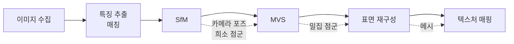
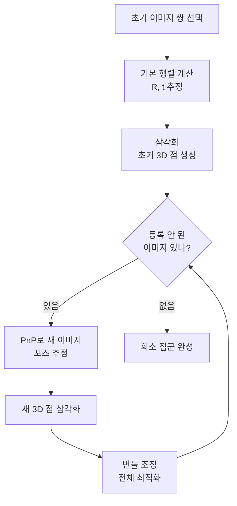
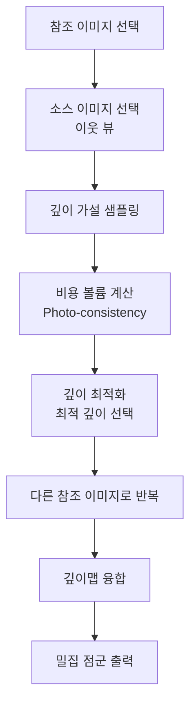
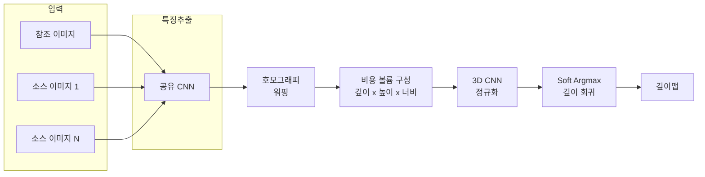
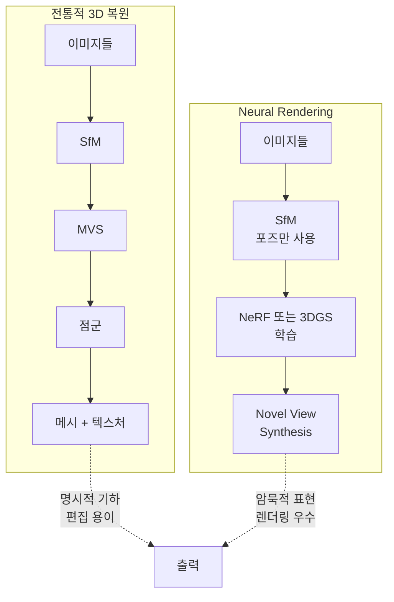

# 3D 복원

> Structure from Motion, MVS

## 개요

[SLAM 기초](./04-slam.md)에서 카메라가 움직이면서 희소한 3D 맵을 만드는 방법을 배웠습니다. 하지만 SLAM의 맵은 **점(point)**들의 집합일 뿐, 물체의 표면이나 디테일은 없습니다. **3D 복원(3D Reconstruction)**은 여러 장의 사진으로부터 **완전한 3D 모델**(메시, 텍스처)을 생성합니다. Structure from Motion(SfM)으로 카메라 위치와 희소 점을 구하고, Multi-View Stereo(MVS)로 밀집 복원을 수행합니다.

**선수 지식**: [SLAM 기초](./04-slam.md), [카메라 기하학](./03-camera-geometry.md)
**학습 목표**:
- Structure from Motion의 파이프라인을 이해한다
- Multi-View Stereo의 원리를 파악한다
- COLMAP을 사용해 실제 3D 복원을 수행할 수 있다
- 딥러닝 기반 MVS의 발전 방향을 안다

## 왜 알아야 할까?

스마트폰으로 물건을 360도 찍으면 3D 모델이 되는 앱, 드론으로 건물을 촬영해서 디지털 트윈을 만드는 기술, 영화 VFX에서 배우를 스캔하는 과정 — 모두 **포토그래메트리(Photogrammetry)**에 기반합니다. 3D 프린팅, 게임 에셋, 문화재 보존, 부동산 가상 투어 등 응용 분야가 무궁무진합니다. 최근에는 [NeRF](../17-neural-rendering/01-nerf-basics.md)와 [3D Gaussian Splatting](../17-neural-rendering/03-3dgs-basics.md)과 결합되어 더욱 발전하고 있죠.

## 핵심 개념

### 개념 1: 3D 복원 파이프라인

> 📊 **그림 1**: 3D 복원 전체 파이프라인




> 💡 **비유**: 3D 복원은 **탐정이 사진들로 현장을 재구성하는 것**과 같습니다. 여러 각도에서 찍힌 사진을 모아서, **"이 사진은 여기서 찍혔고, 저 사진은 저기서 찍혔다"**를 알아내고, 모든 정보를 합쳐서 현장의 3D 모델을 만듭니다.

**전체 파이프라인:**

> 1. **이미지 수집**: 다양한 각도에서 촬영
> 2. **특징 추출/매칭**: SIFT, SuperPoint 등
> 3. **SfM (Structure from Motion)**: 카메라 포즈 + 희소 점
> 4. **MVS (Multi-View Stereo)**: 밀집 깊이/점 추정
> 5. **표면 재구성**: 점 → 메시 변환
> 6. **텍스처 매핑**: 메시에 이미지 색상 입히기

### 개념 2: Structure from Motion (SfM)

**SfM의 목표:**

정렬되지 않은 이미지들로부터:
1. 각 이미지의 **카메라 포즈**(위치, 방향)
2. 장면의 **희소 3D 점들**(Sparse Point Cloud)

**Incremental SfM (점진적 방식):**

> 📊 **그림 2**: Incremental SfM 과정




> 💡 **비유**: 퍼즐을 맞추듯, **두 조각**부터 시작해서 하나씩 붙여나가는 방식입니다.

| 단계 | 설명 |
|------|------|
| **초기화** | 좋은 이미지 쌍으로 시작 (충분한 시차) |
| **2-View 복원** | 기본 행렬 → R, t 계산 → 삼각화 |
| **이미지 등록** | 새 이미지와 기존 3D 점 매칭 → PnP로 포즈 추정 |
| **삼각화** | 새 이미지에서 보이는 점 추가 |
| **번들 조정** | 모든 카메라와 점 동시 최적화 |
| **반복** | 모든 이미지가 등록될 때까지 |

**Global SfM (전역 방식):**

모든 이미지 쌍의 상대 포즈를 먼저 계산하고, **한 번에** 전역 포즈를 최적화합니다. 속도가 빠르지만 아웃라이어에 민감합니다.

**PnP (Perspective-n-Point):**

이미 알려진 3D 점들과 이미지 좌표의 대응으로 카메라 포즈를 추정합니다:

> 3D 점 (X, Y, Z)와 2D 점 (u, v) 쌍이 n개 → 카메라 R, t 계산

최소 4개 대응점이 필요 (P3P + RANSAC 권장).

### 개념 3: Multi-View Stereo (MVS)

> 💡 **비유**: SfM이 **건물의 뼈대(골조)**를 세우는 것이라면, MVS는 **벽과 지붕(표면)**을 채우는 것입니다. 희소한 점들 사이를 밀집하게 채워서 완전한 형태를 만듭니다.

**MVS의 입력과 출력:**

| 입력 | 출력 |
|------|------|
| 이미지들 | 밀집 점군 또는 |
| 카메라 포즈 (SfM 결과) | 깊이맵 (각 이미지마다) |
| 내부 파라미터 | |

**MVS 접근법:**

| 방식 | 설명 | 예시 |
|------|------|------|
| **깊이맵 기반** | 각 이미지에 깊이 추정 → 융합 | COLMAP, MVSNet |
| **점 기반** | 3D 점 직접 확장/정제 | PMVS |
| **볼륨 기반** | 3D 그리드에서 표면 추출 | Voxel Carving |

**깊이맵 기반 MVS 과정:**

> 📊 **그림 3**: 깊이맵 기반 MVS 처리 흐름




1. **참조 이미지 선택**: 복원할 뷰
2. **소스 이미지 선택**: 참조 이미지와 공통 영역이 많은 이웃 뷰
3. **깊이 가설 샘플링**: 가능한 깊이 값들
4. **비용 볼륨 계산**: 각 깊이에서의 일치도
5. **깊이 최적화**: 최적 깊이 선택 + 정제
6. **깊이맵 융합**: 여러 뷰의 깊이맵 병합 → 밀집 점군

**Photo-consistency:**

두 이미지에서 같은 3D 점을 보면, 해당 픽셀의 색상이 비슷해야 합니다. 이 **광학적 일관성**을 기준으로 올바른 깊이를 찾습니다.

### 개념 4: COLMAP — 표준 도구

COLMAP은 **가장 널리 사용되는** 오픈소스 SfM/MVS 소프트웨어입니다.

**COLMAP 파이프라인:**

> **SfM 단계:**
> 1. 특징 추출 (SIFT)
> 2. 특징 매칭 (exhaustive 또는 spatial)
> 3. Incremental SfM (번들 조정 포함)
>
> **MVS 단계:**
> 4. 이미지 왜곡 보정
> 5. 스테레오 깊이 추정 (PatchMatch)
> 6. 깊이맵 융합 → 밀집 점군

**COLMAP 출력:**

| 파일 | 내용 |
|------|------|
| `cameras.txt` | 카메라 내부 파라미터 |
| `images.txt` | 각 이미지의 포즈 (회전 쿼터니언 + 이동) |
| `points3D.txt` | 희소 3D 점 (위치, 색상, 관측 정보) |
| `fused.ply` | 밀집 점군 (MVS 결과) |

### 개념 5: 표면 재구성과 텍스처링

밀집 점군만으로는 렌더링이나 편집이 어렵습니다. **메시(Mesh)**로 변환해야 합니다.

**점군 → 메시 변환:**

| 방법 | 원리 | 특징 |
|------|------|------|
| **Poisson Reconstruction** | 점의 법선으로 표면 추정 | 물 샐 틈 없는 메시 |
| **Delaunay Triangulation** | 점들을 삼각형으로 연결 | 빠르지만 구멍 있음 |
| **Marching Cubes** | 볼륨에서 등위면 추출 | SDF 기반 |
| **Ball Pivoting** | 구를 굴려 표면 생성 | 희소한 점에 적합 |

**텍스처 매핑:**

메시 표면에 원본 이미지의 색상을 입힙니다:

1. 각 메시 면이 가장 잘 보이는 이미지 선택
2. UV 좌표 계산
3. 경계 블렌딩으로 이음매 제거
4. 텍스처 아틀라스 생성

### 개념 6: 딥러닝 기반 MVS

**전통 MVS의 한계:**

- 텍스처 없는 영역에서 실패
- 반사/투명 표면 처리 어려움
- 파라미터 튜닝 필요

**딥러닝 MVS 모델:**

| 모델 | 특징 |
|------|------|
| **MVSNet (2018)** | 최초의 end-to-end 학습 MVS |
| **Vis-MVSNet** | 가시성 예측으로 폐색 처리 |
| **CasMVSNet** | 코스-투-파인 깊이 추정 |
| **TransMVSNet** | Transformer 기반 특징 매칭 |
| **UniMVSNet** | 통합 비용 볼륨 |

**MVSNet 아키텍처:**

> 📊 **그림 4**: MVSNet 아키텍처




> 1. **특징 추출**: 공유 CNN으로 각 이미지 인코딩
> 2. **호모그래피 워핑**: 참조 뷰에 소스 뷰 정렬
> 3. **비용 볼륨 구성**: 3D (깊이×높이×너비) 볼륨
> 4. **비용 볼륨 정규화**: 3D CNN으로 처리
> 5. **깊이 회귀**: Soft Argmax로 연속 깊이 추정

**NeRF/3DGS와의 관계:**

> 📊 **그림 5**: 전통 3D 복원 vs Neural Rendering 비교




전통적 3D 복원:
> 이미지 → SfM → MVS → 점군 → 메시

Neural Rendering:
> 이미지 → SfM(포즈만) → **NeRF/3DGS 학습** → Novel View Synthesis

NeRF와 3DGS는 명시적 기하(메시) 대신 **암묵적/반명시적 표현**을 학습합니다. 더 사실적인 렌더링이 가능하지만, 편집이 어렵습니다.

## 실습: COLMAP으로 3D 복원

### COLMAP 설치 및 실행

```bash
# Ubuntu에서 COLMAP 설치
sudo apt-get install colmap

# macOS (Homebrew)
brew install colmap

# 또는 소스에서 빌드
git clone https://github.com/colmap/colmap.git
cd colmap
mkdir build && cd build
cmake ..
make -j
sudo make install
```

### Python으로 COLMAP 자동화

```python
import subprocess
import os
from pathlib import Path

def run_colmap_sfm(image_folder, workspace_folder, use_gpu=True):
    """
    COLMAP으로 Structure from Motion 실행

    Args:
        image_folder: 입력 이미지 폴더
        workspace_folder: 작업 폴더 (출력 저장)
        use_gpu: GPU 사용 여부
    """
    workspace = Path(workspace_folder)
    workspace.mkdir(parents=True, exist_ok=True)

    database_path = workspace / "database.db"
    sparse_path = workspace / "sparse"
    sparse_path.mkdir(exist_ok=True)

    gpu_flag = "1" if use_gpu else "0"

    # 1. 특징 추출
    print("1. 특징 추출 중...")
    subprocess.run([
        "colmap", "feature_extractor",
        "--database_path", str(database_path),
        "--image_path", str(image_folder),
        "--ImageReader.single_camera", "1",
        "--SiftExtraction.use_gpu", gpu_flag,
    ], check=True)

    # 2. 특징 매칭
    print("2. 특징 매칭 중...")
    subprocess.run([
        "colmap", "exhaustive_matcher",
        "--database_path", str(database_path),
        "--SiftMatching.use_gpu", gpu_flag,
    ], check=True)

    # 3. Incremental SfM
    print("3. Structure from Motion 중...")
    subprocess.run([
        "colmap", "mapper",
        "--database_path", str(database_path),
        "--image_path", str(image_folder),
        "--output_path", str(sparse_path),
    ], check=True)

    print(f"✅ SfM 완료! 결과: {sparse_path}")
    return sparse_path / "0"  # 첫 번째 모델


def run_colmap_mvs(sparse_folder, image_folder, workspace_folder, use_gpu=True):
    """
    COLMAP으로 Multi-View Stereo 실행

    Args:
        sparse_folder: SfM 결과 폴더
        image_folder: 입력 이미지 폴더
        workspace_folder: 작업 폴더
    """
    workspace = Path(workspace_folder)
    dense_path = workspace / "dense"
    dense_path.mkdir(exist_ok=True)

    gpu_flag = "1" if use_gpu else "0"

    # 1. 이미지 왜곡 보정
    print("4. 이미지 왜곡 보정 중...")
    subprocess.run([
        "colmap", "image_undistorter",
        "--image_path", str(image_folder),
        "--input_path", str(sparse_folder),
        "--output_path", str(dense_path),
        "--output_type", "COLMAP",
    ], check=True)

    # 2. 스테레오 깊이 추정
    print("5. 스테레오 깊이 추정 중...")
    subprocess.run([
        "colmap", "patch_match_stereo",
        "--workspace_path", str(dense_path),
        "--workspace_format", "COLMAP",
        "--PatchMatchStereo.geom_consistency", "1",
        "--PatchMatchStereo.gpu_index", "0" if use_gpu else "-1",
    ], check=True)

    # 3. 깊이맵 융합
    print("6. 깊이맵 융합 중...")
    subprocess.run([
        "colmap", "stereo_fusion",
        "--workspace_path", str(dense_path),
        "--workspace_format", "COLMAP",
        "--input_type", "geometric",
        "--output_path", str(dense_path / "fused.ply"),
    ], check=True)

    print(f"✅ MVS 완료! 밀집 점군: {dense_path / 'fused.ply'}")
    return dense_path / "fused.ply"


def run_poisson_reconstruction(ply_path, output_mesh_path, depth=10):
    """
    점군에서 메시 재구성 (Open3D 사용)
    """
    import open3d as o3d

    print("7. Poisson 표면 재구성 중...")

    # 점군 로드
    pcd = o3d.io.read_point_cloud(str(ply_path))
    print(f"   점 개수: {len(pcd.points):,}")

    # 법선 추정 (없는 경우)
    if not pcd.has_normals():
        pcd.estimate_normals(
            search_param=o3d.geometry.KDTreeSearchParamHybrid(radius=0.1, max_nn=30)
        )
        pcd.orient_normals_consistent_tangent_plane(k=30)

    # Poisson 재구성
    mesh, densities = o3d.geometry.TriangleMesh.create_from_point_cloud_poisson(
        pcd, depth=depth
    )

    # 저밀도 영역 제거
    import numpy as np
    vertices_to_remove = densities < np.quantile(densities, 0.01)
    mesh.remove_vertices_by_mask(vertices_to_remove)

    # 저장
    o3d.io.write_triangle_mesh(str(output_mesh_path), mesh)
    print(f"✅ 메시 저장: {output_mesh_path}")
    print(f"   정점: {len(mesh.vertices):,}, 면: {len(mesh.triangles):,}")

    return mesh


# 전체 파이프라인 실행
if __name__ == "__main__":
    IMAGE_FOLDER = "my_photos/"        # 입력 이미지
    WORKSPACE = "reconstruction/"      # 작업 폴더

    # 1. SfM
    sparse_folder = run_colmap_sfm(IMAGE_FOLDER, WORKSPACE)

    # 2. MVS
    ply_path = run_colmap_mvs(sparse_folder, IMAGE_FOLDER, WORKSPACE)

    # 3. 메시 재구성
    mesh_path = Path(WORKSPACE) / "mesh.ply"
    run_poisson_reconstruction(ply_path, mesh_path, depth=10)

    print("\n🎉 3D 복원 완료!")
```

### COLMAP 결과 파싱

```python
import numpy as np
from pathlib import Path
from dataclasses import dataclass
from typing import Dict, List, Tuple
import struct

@dataclass
class Camera:
    """카메라 내부 파라미터"""
    id: int
    model: str
    width: int
    height: int
    params: np.ndarray  # fx, fy, cx, cy, ...


@dataclass
class Image:
    """이미지 정보 (포즈 포함)"""
    id: int
    qw: float
    qx: float
    qy: float
    qz: float
    tx: float
    ty: float
    tz: float
    camera_id: int
    name: str

    def get_rotation_matrix(self) -> np.ndarray:
        """쿼터니언 → 회전 행렬"""
        qw, qx, qy, qz = self.qw, self.qx, self.qy, self.qz
        return np.array([
            [1 - 2*(qy**2 + qz**2), 2*(qx*qy - qz*qw), 2*(qx*qz + qy*qw)],
            [2*(qx*qy + qz*qw), 1 - 2*(qx**2 + qz**2), 2*(qy*qz - qx*qw)],
            [2*(qx*qz - qy*qw), 2*(qy*qz + qx*qw), 1 - 2*(qx**2 + qy**2)]
        ])

    def get_translation(self) -> np.ndarray:
        return np.array([self.tx, self.ty, self.tz])

    def get_camera_center(self) -> np.ndarray:
        """월드 좌표계에서의 카메라 중심"""
        R = self.get_rotation_matrix()
        t = self.get_translation()
        return -R.T @ t


def read_cameras_text(path: str) -> Dict[int, Camera]:
    """cameras.txt 파일 읽기"""
    cameras = {}

    with open(path, 'r') as f:
        for line in f:
            if line.startswith('#') or not line.strip():
                continue

            parts = line.strip().split()
            cam_id = int(parts[0])
            model = parts[1]
            width = int(parts[2])
            height = int(parts[3])
            params = np.array([float(p) for p in parts[4:]])

            cameras[cam_id] = Camera(cam_id, model, width, height, params)

    return cameras


def read_images_text(path: str) -> Dict[int, Image]:
    """images.txt 파일 읽기"""
    images = {}

    with open(path, 'r') as f:
        lines = [l.strip() for l in f if not l.startswith('#') and l.strip()]

    # 두 줄씩 묶여있음 (이미지 정보 + 2D 점)
    for i in range(0, len(lines), 2):
        parts = lines[i].split()

        img_id = int(parts[0])
        qw, qx, qy, qz = map(float, parts[1:5])
        tx, ty, tz = map(float, parts[5:8])
        camera_id = int(parts[8])
        name = parts[9]

        images[img_id] = Image(
            img_id, qw, qx, qy, qz, tx, ty, tz, camera_id, name
        )

    return images


def read_points3d_text(path: str) -> np.ndarray:
    """points3D.txt 파일 읽기 → 점군"""
    points = []
    colors = []

    with open(path, 'r') as f:
        for line in f:
            if line.startswith('#') or not line.strip():
                continue

            parts = line.strip().split()
            x, y, z = map(float, parts[1:4])
            r, g, b = map(int, parts[4:7])

            points.append([x, y, z])
            colors.append([r, g, b])

    return np.array(points), np.array(colors)


def visualize_reconstruction(sparse_folder: str):
    """COLMAP 결과 시각화"""
    import open3d as o3d

    sparse_path = Path(sparse_folder)

    # 데이터 로드
    cameras = read_cameras_text(sparse_path / "cameras.txt")
    images = read_images_text(sparse_path / "images.txt")
    points, colors = read_points3d_text(sparse_path / "points3D.txt")

    print(f"카메라: {len(cameras)}")
    print(f"이미지: {len(images)}")
    print(f"3D 점: {len(points):,}")

    # 점군 생성
    pcd = o3d.geometry.PointCloud()
    pcd.points = o3d.utility.Vector3dVector(points)
    pcd.colors = o3d.utility.Vector3dVector(colors / 255.0)

    # 카메라 프러스텀 생성
    geometries = [pcd]

    for img in images.values():
        cam = cameras[img.camera_id]

        # 카메라 중심
        center = img.get_camera_center()

        # 간단한 카메라 마커 (작은 구)
        sphere = o3d.geometry.TriangleMesh.create_sphere(radius=0.05)
        sphere.translate(center)
        sphere.paint_uniform_color([1, 0, 0])  # 빨간색
        geometries.append(sphere)

    # 시각화
    o3d.visualization.draw_geometries(geometries)


# 사용 예시
# visualize_reconstruction("reconstruction/sparse/0")
```

## 더 깊이 알아보기: SfM의 역사와 COLMAP의 탄생

**1990년대 — SfM 알고리즘의 정립**

Structure from Motion의 이론적 기반은 1990년대에 확립되었습니다. Tomasi-Kanade Factorization(1992), Bundle Adjustment(Triggs, 2000) 등이 핵심이었죠. 하지만 당시에는 **소규모 데이터셋**에서만 동작했습니다.

**2006년 — Photo Tourism (Bundler)**

UW의 Noah Snavely가 "Photo Tourism" 논문에서 **인터넷 사진**들로 3D 복원이 가능함을 보였습니다. 수천 명이 찍은 로마 콜로세움 사진으로 3D 모델을 만든 것이죠. 이 연구는 Bing Maps의 Photosynth가 되었습니다.

**2016년 — COLMAP의 등장**

ETH Zürich의 Johannes L. Schönberger가 박사 과정에서 개발한 **COLMAP**은 이전 도구들의 장점을 결합하고, 사용성을 크게 개선했습니다:

- **완전한 파이프라인**: SfM + MVS + 융합
- **GUI와 CLI 모두 지원**
- **강건한 매칭**: RANSAC, 기하학적 검증
- **GPU 가속**: 빠른 처리

COLMAP은 현재 **학계와 산업계의 표준**이 되었고, NeRF 연구에서도 카메라 포즈를 얻는 데 필수적으로 사용됩니다.

## 흔한 오해와 팁

> ⚠️ **흔한 오해**: "사진을 많이 찍을수록 좋다"
>
> 무조건 그렇지는 않습니다. **중복이 적절**해야 합니다. 같은 장면을 너무 비슷한 각도로 찍으면 삼각화가 부정확해지고, 너무 다른 각도로 찍으면 매칭이 실패합니다. 인접 사진 간 **60-80% 오버랩**이 이상적입니다.

> 💡 **알고 계셨나요?**: COLMAP의 이름은 **"COLMAP = COLlection of MAPping"**에서 왔습니다. 처음에는 단순한 연구 도구였지만, 지금은 수천 개의 프로젝트에서 사용되고 있죠.

> 🔥 **실무 팁**: **일정한 조명**이 중요합니다. 그림자가 이동하면 매칭이 실패합니다. 실외 촬영은 흐린 날이 좋고, 실내는 균일한 조명을 사용하세요.

> 🔥 **실무 팁**: 텍스처 없는 영역(흰 벽, 하늘)은 **복원이 안 됩니다**. 스티커를 붙이거나, 나중에 그 영역을 마스킹하세요.

> 🔥 **실무 팁**: COLMAP 실패 시 체크리스트:
> 1. 이미지가 너무 적지 않은가? (최소 30장 권장)
> 2. 블러된 이미지가 있는가?
> 3. 노출이 너무 다른 이미지가 있는가?
> 4. 움직이는 물체가 많지 않은가?

## 핵심 정리

| 개념 | 설명 |
|------|------|
| **SfM** | 이미지들에서 카메라 포즈 + 희소 점군 추정 |
| **MVS** | 밀집한 깊이/점군 추정 |
| **Incremental SfM** | 두 이미지부터 시작해 점진적 확장 |
| **PnP** | 3D-2D 대응으로 카메라 포즈 추정 |
| **번들 조정** | 포즈와 3D 점 동시 최적화 |
| **COLMAP** | SfM+MVS 표준 도구 |

## 다음 챕터 미리보기

이로써 3D 컴퓨터 비전의 기초를 마쳤습니다! 다음 챕터 [Neural Rendering](../17-neural-rendering/01-nerf-basics.md)에서는 **NeRF(Neural Radiance Fields)**와 **3D Gaussian Splatting**을 배웁니다. 전통적 3D 복원이 점이나 메시를 만든다면, Neural Rendering은 **신경망이 장면을 암묵적으로 학습**해서 **포토리얼리스틱한 새로운 시점**을 합성합니다. 3D 비전의 최첨단 기술이죠!

## 참고 자료

- [COLMAP 공식 문서](https://colmap.github.io/) - 튜토리얼, API
- [Photogrammetry Explained - PyImageSearch](https://pyimagesearch.com/2024/10/14/photogrammetry-explained-from-multi-view-stereo-to-structure-from-motion/) - 원리 해설
- [MVSNet 논문](https://arxiv.org/abs/1804.02505) - 최초 딥러닝 MVS
- [Learning-based MVS Survey](https://arxiv.org/html/2408.15235v1) - 2024 서베이
- [A Survey of 3D Reconstruction](https://pmc.ncbi.nlm.nih.gov/articles/PMC12473764/) - SfM부터 NeRF까지
