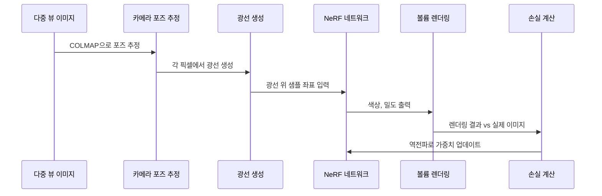
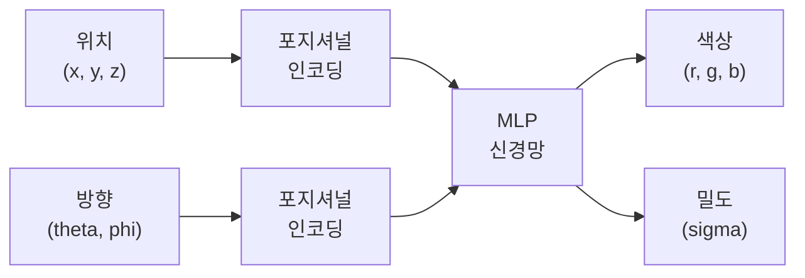
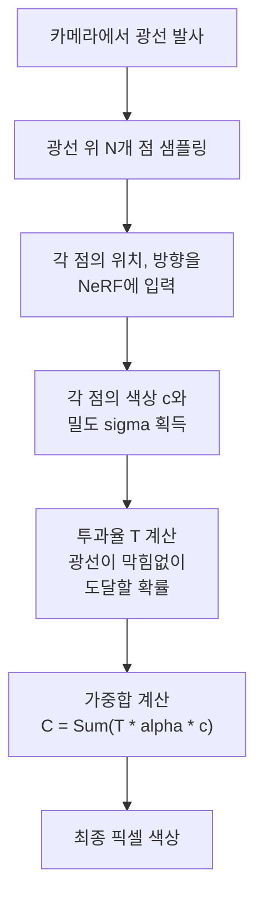
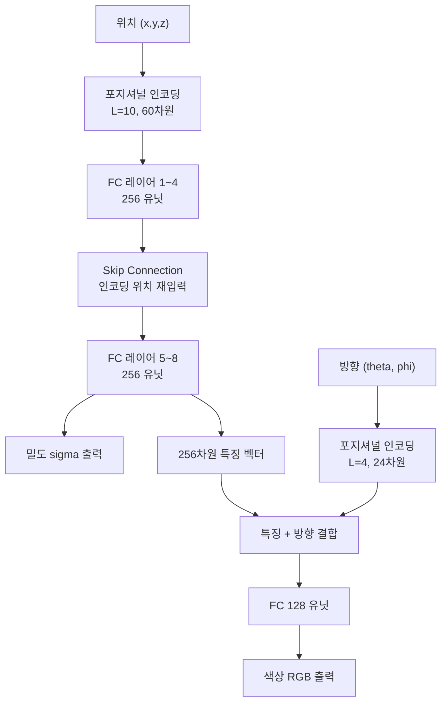

# NeRF 기초

> Neural Radiance Fields의 원리

## 개요

이 섹션에서는 2020년 컴퓨터 그래픽스와 비전 분야를 뒤흔든 **NeRF(Neural Radiance Fields)**의 핵심 원리를 배웁니다. 몇 장의 2D 사진만으로 3D 공간을 완벽하게 재구성하고, 어떤 각도에서든 새로운 뷰를 렌더링할 수 있는 마법 같은 기술이죠.

**선수 지식**:
- [MLP와 신경망 기초](../03-deep-learning-basics/01-neural-network.md)
- [카메라 기하학](../16-3d-vision/03-camera-geometry.md)의 내/외부 파라미터
- [3D 복원](../16-3d-vision/05-3d-reconstruction.md)의 기본 개념

**학습 목표**:
- NeRF가 3D 장면을 어떻게 표현하는지 이해하기
- 5D 입력과 4D 출력의 의미 파악하기
- 볼륨 렌더링과 포지셔널 인코딩의 역할 이해하기

## 왜 알아야 할까?

> 📊 **그림 5**: NeRF 전체 학습 및 렌더링 파이프라인




앞서 [3D 복원](../16-3d-vision/05-3d-reconstruction.md)에서 Structure from Motion과 Multi-View Stereo를 배웠습니다. 이 방법들은 포인트 클라우드나 메쉬 형태로 3D를 복원하는데요, 여기에는 한계가 있었습니다:

| 전통적 3D 복원 | NeRF |
|---------------|------|
| 명시적 기하학 (점, 면) | 암시적 표현 (신경망) |
| 텍스처 품질 한계 | 포토리얼리스틱 렌더링 |
| 반사, 투명 물체 어려움 | 뷰 의존적 효과 자연스럽게 표현 |
| 복잡한 파이프라인 | End-to-End 학습 |

NeRF는 VR/AR 콘텐츠 제작, 영화 특수효과, 부동산 가상 투어, 문화재 디지털 보존 등 다양한 분야에서 혁신을 일으키고 있습니다.

## 핵심 개념

### 개념 1: NeRF의 기본 아이디어

> 📊 **그림 1**: NeRF의 핵심 아이디어 — 5D 입력에서 색상과 밀도 출력까지




> 💡 **비유**: NeRF를 "3D 공간의 마법 사전"이라고 생각해보세요. 이 사전에 "이 위치에서 이 방향으로 보면 뭐가 보여?"라고 물으면, 사전이 "이 색깔이 보이고, 이 정도로 불투명해"라고 대답합니다. 신경망이 바로 이 마법 사전 역할을 하는 거죠.

NeRF는 3D 장면을 **연속적인 5D 함수**로 표현합니다:

$$F_\theta: (\mathbf{x}, \mathbf{d}) \rightarrow (\mathbf{c}, \sigma)$$

여기서:
- $\mathbf{x} = (x, y, z)$: 3D 공간의 위치
- $\mathbf{d} = (\theta, \phi)$: 시선 방향 (구면 좌표)
- $\mathbf{c} = (r, g, b)$: 해당 지점에서 보이는 색상
- $\sigma$: 볼륨 밀도 (불투명도)

**왜 5D 입력일까요?** 같은 위치라도 보는 방향에 따라 색이 다르게 보이기 때문입니다. 유리컵의 반사광, 금속의 광택 같은 뷰 의존적(view-dependent) 효과를 표현하려면 방향 정보가 필요하죠.

### 개념 2: 볼륨 렌더링 (Volume Rendering)

> 📊 **그림 2**: 볼륨 렌더링 과정 — 광선을 따라 색상과 밀도를 적분




> 💡 **비유**: 안개 낀 숲을 상상해보세요. 우리 눈에 보이는 색은 가까운 나무의 색, 멀리 있는 나무의 색, 그리고 안개의 색이 섞인 결과입니다. 볼륨 렌더링은 이처럼 광선이 지나가는 모든 지점의 색과 밀도를 합쳐서 최종 픽셀 색을 계산합니다.

카메라에서 발사된 광선(ray)을 따라 적분하면 최종 색상을 얻습니다:

$$C(\mathbf{r}) = \int_{t_n}^{t_f} T(t) \cdot \sigma(\mathbf{r}(t)) \cdot \mathbf{c}(\mathbf{r}(t), \mathbf{d}) \, dt$$

각 기호의 의미:
- $\mathbf{r}(t) = \mathbf{o} + t\mathbf{d}$: 광선의 매개변수 방정식 (원점 $\mathbf{o}$에서 방향 $\mathbf{d}$)
- $t_n, t_f$: near와 far 경계
- $\sigma(\mathbf{r}(t))$: 위치 $t$에서의 밀도
- $\mathbf{c}(\mathbf{r}(t), \mathbf{d})$: 해당 지점의 색상
- $T(t) = \exp\left(-\int_{t_n}^{t} \sigma(\mathbf{r}(s)) ds\right)$: **투과율** (광선이 $t$까지 막힘 없이 도달할 확률)

실제로는 연속 적분 대신 **이산 샘플링**으로 근사합니다:

$$\hat{C}(\mathbf{r}) = \sum_{i=1}^{N} T_i \cdot (1 - \exp(-\sigma_i \delta_i)) \cdot \mathbf{c}_i$$

여기서 $T_i = \exp\left(-\sum_{j=1}^{i-1} \sigma_j \delta_j\right)$이고 $\delta_i$는 인접 샘플 간 거리입니다.

### 개념 3: 포지셔널 인코딩 (Positional Encoding)

> 💡 **비유**: 신경망에게 "이 위치"라고 말하면 작은 차이를 잘 구분 못합니다. 마치 사람에게 "좌표 (1.001, 2.003)"과 "(1.002, 2.001)"의 차이를 말로 설명하기 어려운 것처럼요. 하지만 이 좌표를 음파처럼 다양한 주파수의 파동으로 바꿔주면, 아주 미세한 위치 차이도 확연히 다른 패턴이 됩니다.

NeRF의 핵심 트릭 중 하나가 바로 포지셔널 인코딩입니다. 저차원 입력 $p$를 고차원으로 매핑합니다:

$$\gamma(p) = \left(\sin(2^0\pi p), \cos(2^0\pi p), \sin(2^1\pi p), \cos(2^1\pi p), \ldots, \sin(2^{L-1}\pi p), \cos(2^{L-1}\pi p)\right)$$

논문에서는:
- 위치 $\mathbf{x}$: $L=10$ (60차원으로 확장)
- 방향 $\mathbf{d}$: $L=4$ (24차원으로 확장)

**왜 필요한가요?** MLP는 본질적으로 저주파 함수를 학습하려는 경향(spectral bias)이 있습니다. 포지셔널 인코딩은 고주파 정보를 명시적으로 제공하여 날카로운 디테일을 표현할 수 있게 합니다.

### 개념 4: NeRF 네트워크 구조

> 📊 **그림 3**: NeRF MLP 아키텍처 — 위치와 방향의 분리 처리




NeRF의 MLP 아키텍처는 영리하게 설계되어 있습니다:

**전체 흐름:**

1. **위치 인코딩**: $(x, y, z)$ → 60차원
2. **첫 번째 MLP** (8개 FC 레이어, 256 유닛)
   - 5번째 레이어에서 skip connection으로 인코딩된 위치 다시 입력
   - 출력: 밀도 $\sigma$ + 256차원 특징 벡터
3. **방향 인코딩**: $(\theta, \phi)$ → 24차원
4. **두 번째 MLP** (특징 + 방향 인코딩 → 128 유닛 → RGB)
   - 출력: 색상 $\mathbf{c}$

**설계 의도:**
- 밀도 $\sigma$는 위치에만 의존 (물체는 어디서 보든 같은 위치에 있음)
- 색상 $\mathbf{c}$는 위치와 방향 모두에 의존 (반사광 등 뷰 의존적 효과)

### 개념 5: 계층적 샘플링 (Hierarchical Sampling)

> 📊 **그림 4**: 계층적 샘플링 — Coarse에서 Fine으로 샘플 집중


볼륨 렌더링에서 광선 위의 모든 점을 균등하게 샘플링하면 비효율적입니다. 빈 공간이나 물체 뒤쪽에도 불필요한 계산을 하게 되니까요.

NeRF는 **두 단계 샘플링**을 사용합니다:

1. **Coarse 네트워크**: 균등하게 $N_c$개 샘플 → 대략적인 밀도 분포 파악
2. **Fine 네트워크**: 밀도가 높은 영역에 $N_f$개 추가 샘플 집중

이 방식으로 64+128=192개 샘플만으로도 수천 개 균등 샘플과 비슷한 품질을 얻습니다.

## 실습: NeRF 핵심 코드 구현

```python
import torch
import torch.nn as nn
import torch.nn.functional as F
import numpy as np

class PositionalEncoding(nn.Module):
    """포지셔널 인코딩: 저차원 입력을 고차원 푸리에 특징으로 변환"""
    def __init__(self, num_freqs, include_input=True):
        super().__init__()
        self.num_freqs = num_freqs
        self.include_input = include_input

        # 주파수 밴드: 2^0, 2^1, ..., 2^(L-1)
        freq_bands = 2.0 ** torch.linspace(0, num_freqs - 1, num_freqs)
        self.register_buffer('freq_bands', freq_bands)

    def forward(self, x):
        """
        Args:
            x: (batch, D) 입력 좌표
        Returns:
            (batch, D * 2 * num_freqs [+ D]) 인코딩된 특징
        """
        # x를 각 주파수로 스케일링
        # (batch, D, 1) * (num_freqs,) → (batch, D, num_freqs)
        x_freq = x.unsqueeze(-1) * self.freq_bands * np.pi

        # sin, cos 적용
        encoded = torch.cat([torch.sin(x_freq), torch.cos(x_freq)], dim=-1)
        encoded = encoded.reshape(x.shape[0], -1)  # (batch, D * 2 * num_freqs)

        if self.include_input:
            encoded = torch.cat([x, encoded], dim=-1)

        return encoded

    def output_dim(self, input_dim):
        """출력 차원 계산"""
        dim = input_dim * 2 * self.num_freqs
        if self.include_input:
            dim += input_dim
        return dim


class NeRF(nn.Module):
    """
    Neural Radiance Field 네트워크

    입력: 위치 (x, y, z), 방향 (θ, φ)
    출력: 색상 (r, g, b), 밀도 (σ)
    """
    def __init__(
        self,
        pos_enc_freqs=10,   # 위치 인코딩 주파수 수
        dir_enc_freqs=4,    # 방향 인코딩 주파수 수
        hidden_dim=256,     # 은닉 레이어 차원
        num_layers=8        # MLP 레이어 수
    ):
        super().__init__()

        # 포지셔널 인코딩
        self.pos_encoding = PositionalEncoding(pos_enc_freqs)
        self.dir_encoding = PositionalEncoding(dir_enc_freqs)

        pos_enc_dim = self.pos_encoding.output_dim(3)  # 3D 위치 → 63차원
        dir_enc_dim = self.dir_encoding.output_dim(3)  # 3D 방향 → 27차원

        # 첫 번째 MLP: 위치 → 밀도 + 특징
        self.layers_xyz = nn.ModuleList()
        self.layers_xyz.append(nn.Linear(pos_enc_dim, hidden_dim))

        for i in range(1, num_layers):
            if i == 4:  # 5번째 레이어에서 skip connection
                self.layers_xyz.append(nn.Linear(hidden_dim + pos_enc_dim, hidden_dim))
            else:
                self.layers_xyz.append(nn.Linear(hidden_dim, hidden_dim))

        # 밀도 출력 (위치에만 의존)
        self.sigma_layer = nn.Linear(hidden_dim, 1)

        # 특징 → 색상 (방향 정보 추가)
        self.feature_layer = nn.Linear(hidden_dim, hidden_dim)
        self.rgb_layers = nn.Sequential(
            nn.Linear(hidden_dim + dir_enc_dim, hidden_dim // 2),
            nn.ReLU(),
            nn.Linear(hidden_dim // 2, 3),
            nn.Sigmoid()  # RGB를 [0, 1] 범위로
        )

    def forward(self, positions, directions):
        """
        Args:
            positions: (batch, 3) 3D 위치 좌표
            directions: (batch, 3) 시선 방향 (단위 벡터)
        Returns:
            rgb: (batch, 3) 색상
            sigma: (batch, 1) 밀도
        """
        # 포지셔널 인코딩 적용
        pos_encoded = self.pos_encoding(positions)
        dir_encoded = self.dir_encoding(directions)

        # 위치 MLP 통과
        h = pos_encoded
        for i, layer in enumerate(self.layers_xyz):
            if i == 4:  # Skip connection
                h = torch.cat([h, pos_encoded], dim=-1)
            h = F.relu(layer(h))

        # 밀도 출력 (ReLU로 양수 보장)
        sigma = F.relu(self.sigma_layer(h))

        # 색상 출력 (방향 정보 결합)
        feature = self.feature_layer(h)
        rgb_input = torch.cat([feature, dir_encoded], dim=-1)
        rgb = self.rgb_layers(rgb_input)

        return rgb, sigma


def volume_rendering(rgb, sigma, z_vals, rays_d):
    """
    볼륨 렌더링으로 최종 픽셀 색상 계산

    Args:
        rgb: (batch, num_samples, 3) 각 샘플의 색상
        sigma: (batch, num_samples) 각 샘플의 밀도
        z_vals: (batch, num_samples) 각 샘플의 깊이 값
        rays_d: (batch, 3) 광선 방향
    Returns:
        rgb_map: (batch, 3) 렌더링된 색상
        depth_map: (batch,) 추정된 깊이
        weights: (batch, num_samples) 각 샘플의 가중치
    """
    # 인접 샘플 간 거리 계산
    dists = z_vals[..., 1:] - z_vals[..., :-1]
    # 마지막 샘플은 무한대까지로 가정
    dists = torch.cat([dists, torch.full_like(dists[..., :1], 1e10)], dim=-1)

    # 광선 방향 크기로 스케일 (실제 3D 거리)
    dists = dists * torch.norm(rays_d, dim=-1, keepdim=True)

    # 알파 값 계산: α = 1 - exp(-σ * Δt)
    alpha = 1.0 - torch.exp(-sigma * dists)

    # 누적 투과율: T_i = Π_{j<i}(1 - α_j)
    transmittance = torch.cumprod(
        torch.cat([torch.ones_like(alpha[..., :1]), 1.0 - alpha + 1e-10], dim=-1),
        dim=-1
    )[..., :-1]

    # 가중치: w_i = T_i * α_i
    weights = alpha * transmittance

    # 최종 색상: C = Σ w_i * c_i
    rgb_map = torch.sum(weights.unsqueeze(-1) * rgb, dim=-2)

    # 깊이 맵: d = Σ w_i * z_i
    depth_map = torch.sum(weights * z_vals, dim=-1)

    return rgb_map, depth_map, weights


# 사용 예시
if __name__ == "__main__":
    device = torch.device("cuda" if torch.cuda.is_available() else "cpu")

    # 모델 생성
    model = NeRF().to(device)
    print(f"NeRF 파라미터 수: {sum(p.numel() for p in model.parameters()):,}")

    # 테스트 입력
    batch_size = 1024
    num_samples = 64

    positions = torch.randn(batch_size, num_samples, 3).to(device)
    directions = F.normalize(torch.randn(batch_size, 3), dim=-1).to(device)

    # 배치 처리를 위해 reshape
    pos_flat = positions.reshape(-1, 3)
    dir_flat = directions.unsqueeze(1).expand(-1, num_samples, -1).reshape(-1, 3)

    # Forward pass
    rgb, sigma = model(pos_flat, dir_flat)
    rgb = rgb.reshape(batch_size, num_samples, 3)
    sigma = sigma.reshape(batch_size, num_samples)

    # 볼륨 렌더링
    z_vals = torch.linspace(2.0, 6.0, num_samples).expand(batch_size, -1).to(device)
    rgb_map, depth_map, weights = volume_rendering(rgb, sigma, z_vals, directions)

    print(f"입력 위치: {positions.shape}")
    print(f"렌더링된 색상: {rgb_map.shape}")
    print(f"추정 깊이: {depth_map.shape}")
```

```python
# 광선 생성 유틸리티
def get_rays(H, W, focal, c2w):
    """
    카메라에서 각 픽셀로 향하는 광선 생성

    Args:
        H, W: 이미지 높이, 너비
        focal: 초점 거리
        c2w: (4, 4) 카메라-투-월드 변환 행렬
    Returns:
        rays_o: (H, W, 3) 광선 원점
        rays_d: (H, W, 3) 광선 방향
    """
    # 픽셀 좌표 생성
    i, j = torch.meshgrid(
        torch.arange(W, dtype=torch.float32),
        torch.arange(H, dtype=torch.float32),
        indexing='xy'
    )

    # 카메라 좌표계에서 광선 방향 (핀홀 모델)
    # 이미지 중심을 원점으로, z축이 카메라 방향
    dirs = torch.stack([
        (i - W * 0.5) / focal,
        -(j - H * 0.5) / focal,  # y축 반전 (이미지 좌표계)
        -torch.ones_like(i)       # z축 방향 (카메라가 -z를 바라봄)
    ], dim=-1)

    # 월드 좌표계로 변환
    rays_d = torch.sum(dirs[..., None, :] * c2w[:3, :3], dim=-1)
    rays_o = c2w[:3, 3].expand(rays_d.shape)

    return rays_o, rays_d


# 학습 루프 예시 (간략화)
def train_step(model, optimizer, images, poses, H, W, focal):
    """
    한 스텝 학습

    Args:
        model: NeRF 모델
        optimizer: 옵티마이저
        images: (N, H, W, 3) 학습 이미지들
        poses: (N, 4, 4) 각 이미지의 카메라 포즈
    """
    # 랜덤 이미지 선택
    img_idx = np.random.randint(len(images))
    target = images[img_idx]
    pose = poses[img_idx]

    # 광선 생성
    rays_o, rays_d = get_rays(H, W, focal, pose)

    # 랜덤 픽셀 샘플링 (메모리 효율)
    coords = torch.stack(
        torch.meshgrid(torch.arange(H), torch.arange(W), indexing='ij'),
        dim=-1
    ).reshape(-1, 2)

    select_idx = np.random.choice(len(coords), size=1024, replace=False)
    select_coords = coords[select_idx]

    rays_o = rays_o[select_coords[:, 0], select_coords[:, 1]]
    rays_d = rays_d[select_coords[:, 0], select_coords[:, 1]]
    target_rgb = target[select_coords[:, 0], select_coords[:, 1]]

    # ... 렌더링 및 손실 계산 ...
    # loss = F.mse_loss(rendered_rgb, target_rgb)

    return None  # 실제로는 loss 반환
```

## 더 깊이 알아보기

### NeRF의 탄생 스토리

NeRF는 2020년 ECCV에서 **Best Paper Honorable Mention**을 수상하며 등장했습니다. UC Berkeley의 Ben Mildenhall을 필두로 한 연구팀이 만들었는데요, 흥미로운 점은 이 논문이 처음부터 엄청난 주목을 받은 건 아니었다는 겁니다.

실제로 NeRF 이전에도 비슷한 시도들이 있었습니다. DeepSDF(2019)는 signed distance function을 신경망으로 표현했고, Neural Volumes(2019)는 볼륨 렌더링을 학습에 사용했죠. NeRF의 진짜 혁신은 이 모든 아이디어를 **포지셔널 인코딩**이라는 간단하지만 강력한 트릭과 결합해 놀라운 품질을 달성한 것입니다.

> 💡 **알고 계셨나요?** NeRF라는 이름은 "Nerf gun"(스펀지 총)과 발음이 같아서, 논문 저자들이 일부러 친근한 이름을 선택했다는 후문이 있습니다. 덕분에 기억하기 쉬운 이름이 되었죠!

### 포지셔널 인코딩의 수학적 배경

포지셔널 인코딩은 Transformer의 그것과 같은 아이디어입니다. 신경망의 **spectral bias** 문제를 해결하는 건데요, 이건 Neural Tangent Kernel(NTK) 이론으로 설명됩니다.

일반적인 MLP는 저주파 함수를 먼저 학습하고 고주파 디테일은 잘 학습하지 못합니다. 포지셔널 인코딩은 입력을 다양한 주파수의 sin/cos 함수로 변환하여 네트워크가 고주파 정보에 직접 접근할 수 있게 합니다.

### NeRF의 한계

원본 NeRF에는 몇 가지 한계가 있습니다:

1. **학습 시간**: 한 장면당 1~2일 소요
2. **렌더링 속도**: 한 이미지에 30초 이상
3. **장면 의존적**: 장면마다 새로 학습 필요
4. **정적 장면만**: 움직이는 물체 처리 불가

이런 한계들을 극복한 후속 연구들을 [다음 섹션](./02-nerf-variants.md)에서 살펴보겠습니다.

## 흔한 오해와 팁

> ⚠️ **흔한 오해**: "NeRF는 3D 모델을 생성한다" — NeRF는 명시적인 3D 모델(메쉬, 포인트 클라우드)을 만들지 않습니다. 신경망 가중치 자체가 3D 표현이며, 새로운 뷰를 "렌더링"하는 방식으로만 3D를 볼 수 있습니다.

> 💡 **알고 계셨나요?**: NeRF 학습에는 보통 100~300장의 이미지가 필요하지만, 최근 few-shot NeRF 연구들은 3~10장만으로도 가능하게 만들고 있습니다.

> 🔥 **실무 팁**: NeRF 학습 데이터를 촬영할 때는 COLMAP으로 카메라 포즈를 먼저 추정합니다. [3D 복원](../16-3d-vision/05-3d-reconstruction.md)에서 배운 SfM 파이프라인이 바로 여기서 쓰입니다!

## 핵심 정리

| 개념 | 설명 |
|------|------|
| Neural Radiance Field | 3D 장면을 (위치, 방향) → (색상, 밀도) 함수로 표현하는 신경망 |
| 5D 입력 | 위치 (x, y, z) + 시선 방향 (θ, φ) |
| 볼륨 렌더링 | 광선 위 모든 점의 색상과 밀도를 적분하여 픽셀 색 계산 |
| 포지셔널 인코딩 | 좌표를 sin/cos 함수로 고차원 매핑하여 고주파 디테일 학습 |
| 계층적 샘플링 | Coarse→Fine 2단계로 중요 영역에 샘플 집중 |

## 다음 섹션 미리보기

NeRF의 원리를 이해했으니, 이제 그 한계를 극복한 다양한 변형들을 살펴볼 차례입니다. [NeRF 변형들](./02-nerf-variants.md)에서는 **1000배 빠른 학습**을 달성한 Instant-NGP, **앨리어싱 문제를 해결한** Mip-NeRF, 그리고 실용적인 **Nerfacto**까지 알아보겠습니다.

## 참고 자료

- [NeRF 공식 프로젝트 페이지](https://www.matthewtancik.com/nerf) - 원본 논문과 데모
- [NeRF PyTorch 구현 (yenchenlin)](https://github.com/yenchenlin/nerf-pytorch) - 공식보다 1.3배 빠른 PyTorch 구현
- [Hugging Face NeRF 코스](https://huggingface.co/learn/computer-vision-course/en/unit8/nerf) - 단계별 튜토리얼
- [NeRF Explosion 2020](https://dellaert.github.io/NeRF/) - Frank Dellaert의 NeRF 관련 연구 정리
- [A Survey on Neural Radiance Fields (2025)](https://dl.acm.org/doi/10.1145/3758085) - ACM Computing Surveys 최신 서베이
