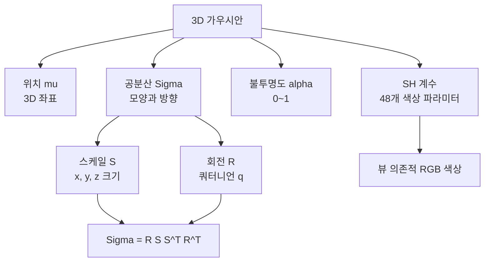
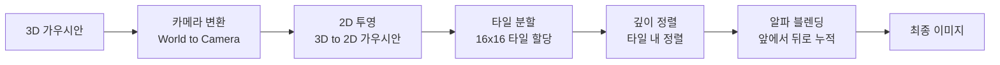
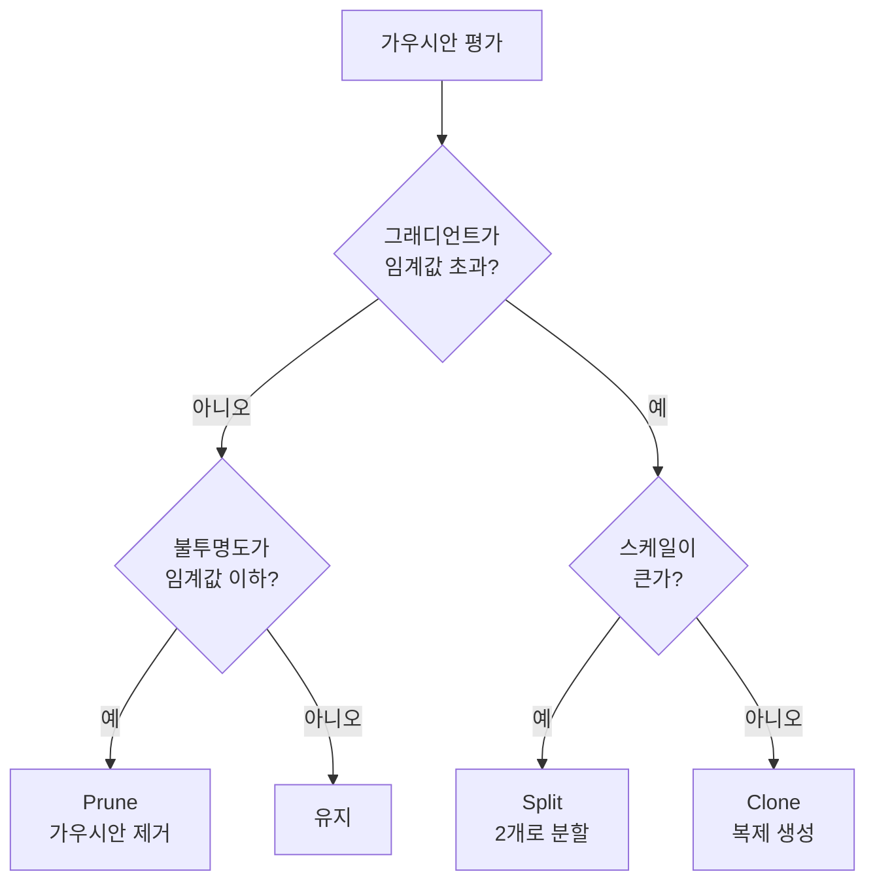
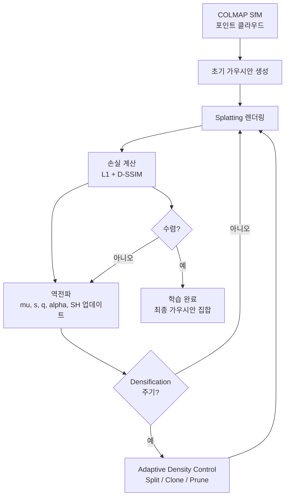
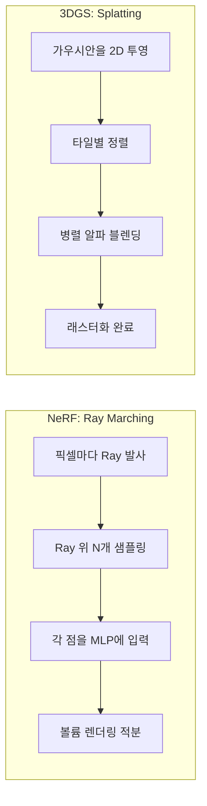

# 3D Gaussian Splatting 기초

> 가우시안 기반 실시간 렌더링

## 개요

이 섹션에서는 2023년 Neural Rendering 분야를 뒤흔든 **3D Gaussian Splatting(3DGS)**을 배웁니다. NeRF와 달리 **명시적인 3D 가우시안**으로 장면을 표현하여 **100+ FPS 실시간 렌더링**을 달성하는 혁신적인 방법입니다. 학습도 빠르고 렌더링도 빠른, 그야말로 게임 체인저죠.

**선수 지식**:
- [NeRF 기초](./01-nerf-basics.md)의 볼륨 렌더링 개념
- [포인트 클라우드](../16-3d-vision/02-point-clouds.md) 기본 이해
- 가우시안 분포의 기본 개념

**학습 목표**:
- 3D 가우시안으로 장면을 표현하는 방법 이해하기
- Splatting 기반 래스터화의 원리 파악하기
- Adaptive Density Control로 가우시안을 관리하는 방법 배우기

## 왜 알아야 할까?

NeRF는 놀라운 품질을 보여주지만, 근본적인 한계가 있었습니다:

| NeRF의 한계 | 3D Gaussian Splatting 해결책 |
|------------|---------------------------|
| 느린 렌더링 (초당 ~0.1 프레임) | 실시간 렌더링 (100+ FPS) |
| 암시적 표현 (신경망 내부) | 명시적 표현 (편집 가능) |
| GPU 렌더링 필수 | 일반 그래픽 파이프라인 활용 가능 |
| 장면 편집 어려움 | 개별 가우시안 조작 가능 |

3DGS는 VR/AR, 게임, 방송, 웹 3D 등 **실시간성이 필요한 모든 분야**에서 NeRF를 대체하고 있습니다.

## 핵심 개념

### 개념 1: 3D 가우시안 표현

> 📊 **그림 1**: 3D 가우시안의 구성 요소와 렌더링 관계




> 💡 **비유**: 3D 장면을 표현한다고 할 때, NeRF는 "이 위치에서 이 방향으로 보면 이 색이야"라고 대답하는 **마법의 오라클**이었습니다. 3DGS는 다릅니다. 공간에 **수백만 개의 반투명한 컬러 솜뭉치(가우시안)**를 배치해서 장면을 만듭니다. 각 솜뭉치의 위치, 크기, 방향, 색을 조절하면 원하는 장면이 완성되죠.

3D Gaussian Splatting은 장면을 **수십만~수백만 개의 3D 가우시안**으로 표현합니다. 각 가우시안은 다음 속성을 가집니다:

**가우시안의 구성요소:**

| 속성 | 기호 | 차원 | 설명 |
|------|------|------|------|
| 위치 | $\mu$ | 3 | 가우시안 중심의 3D 좌표 |
| 공분산 | $\Sigma$ | 6 | 3D 타원체 모양과 방향 (대칭 행렬) |
| 불투명도 | $\alpha$ | 1 | 투명도 (0: 투명, 1: 불투명) |
| 색상 (SH) | $c$ | 48 | Spherical Harmonics 계수 |

**3D 가우시안 수식:**

$$G(\mathbf{x}) = e^{-\frac{1}{2}(\mathbf{x}-\mu)^T \Sigma^{-1} (\mathbf{x}-\mu)}$$

**공분산 행렬의 분해:**

공분산 행렬은 항상 양의 준정부호(positive semi-definite)여야 합니다. 이를 보장하기 위해 스케일(S)과 회전(R)으로 분해합니다:

$$\Sigma = RSS^TR^T$$

여기서:
- $S$: 3x3 대각 스케일 행렬 (x, y, z 축 크기)
- $R$: 3x3 회전 행렬 (쿼터니언 $q$로 표현)

### 개념 2: Spherical Harmonics로 뷰 의존적 색상

> 💡 **비유**: 사과를 보면 조명 방향에 따라 밝은 부분과 어두운 부분이 다르죠. 이런 효과를 표현하려면 "어느 방향에서 보느냐"에 따라 색이 바뀌어야 합니다. Spherical Harmonics는 구 표면의 색 변화를 몇 개의 숫자로 효율적으로 표현하는 수학적 도구입니다.

**Spherical Harmonics (SH)**는 구면 함수를 표현하는 직교 기저 함수입니다.

3DGS에서는 보통 0~3차(degree) SH를 사용합니다:
- 0차: 1개 계수 (방향 무관 색상)
- 1차: 4개 계수 (기본 방향성)
- 2차: 9개 계수 (더 세밀한 변화)
- 3차: 16개 계수 (복잡한 반사)

**RGB 각각에 16개씩, 총 48개 계수**로 다양한 뷰 의존적 효과를 표현합니다.

$$c(\mathbf{d}) = \sum_{l=0}^{L} \sum_{m=-l}^{l} c_{lm} Y_l^m(\mathbf{d})$$

### 개념 3: Splatting 기반 래스터화

> 💡 **비유**: 화가가 캔버스에 물감을 뿌리는 것을 상상해보세요. 각 물감 방울(가우시안)이 캔버스(이미지)에 떨어지면서 퍼집니다. 뒤에 있는 물감은 앞의 물감에 가려지고, 반투명한 물감들은 섞입니다. 이게 바로 Splatting입니다.

**Splatting**은 3D 프리미티브를 2D 이미지로 투영하는 렌더링 기법입니다.

**렌더링 파이프라인:**

> 📊 **그림 2**: Splatting 기반 래스터화 파이프라인




1. **카메라 변환**: 3D 가우시안을 카메라 좌표계로 변환
2. **2D 투영**: 3D 가우시안을 2D 가우시안으로 투영
3. **타일 기반 정렬**: 이미지를 16x16 타일로 나누고 관련 가우시안 할당
4. **깊이 정렬**: 각 타일 내에서 가우시안을 깊이순 정렬
5. **알파 블렌딩**: 앞에서 뒤로 누적 렌더링

**2D 투영 수식:**

3D 공분산 $\Sigma$를 카메라 뷰로 투영하면 2D 공분산 $\Sigma'$가 됩니다:

$$\Sigma' = JW\Sigma W^TJ^T$$

여기서:
- $W$: World-to-Camera 변환
- $J$: 투영의 야코비안 (근사적 선형화)

**알파 블렌딩:**

최종 픽셀 색상은 깊이순으로 정렬된 가우시안들의 블렌딩입니다:

$$C = \sum_{i=1}^{N} c_i \alpha_i \prod_{j=1}^{i-1}(1 - \alpha_j)$$

이는 NeRF의 볼륨 렌더링과 동일한 원리입니다!

### 개념 4: Adaptive Density Control

> 💡 **비유**: 정원을 가꾸는 것과 비슷합니다. 빽빽한 곳의 나무는 솎아내고(pruning), 드문 곳에는 새로 심습니다(splitting/cloning). 3DGS도 가우시안이 너무 많거나 적은 영역을 자동으로 조절합니다.

학습 중에 가우시안의 수와 분포를 동적으로 조절합니다:

> 📊 **그림 3**: Adaptive Density Control 의사결정 흐름




**Densification (밀도 증가):**

1. **Split**: 큰 가우시안을 두 개로 분할
   - 조건: 그래디언트 크고 + 스케일 큼
   - 세밀한 디테일이 필요한 영역

2. **Clone**: 가우시안 복제
   - 조건: 그래디언트 크고 + 스케일 작음
   - 아직 커버되지 않은 영역

**Pruning (가지치기):**

불필요한 가우시안 제거:
- 불투명도 $\alpha$가 임계값 이하
- 너무 크거나 화면 밖으로 벗어난 경우
- 일정 주기로 불투명도 리셋

### 개념 5: 학습 과정

> 📊 **그림 4**: 3DGS 전체 학습 과정




**초기화:**
- COLMAP의 SfM 포인트 클라우드에서 시작
- 또는 랜덤 초기화 (품질 낮음)

**손실 함수:**

$$\mathcal{L} = (1-\lambda)\mathcal{L}_1 + \lambda\mathcal{L}_{D-SSIM}$$

- $\mathcal{L}_1$: 픽셀별 절대 오차
- $\mathcal{L}_{D-SSIM}$: 구조적 유사도 (디테일 보존)
- $\lambda$: 보통 0.2

**최적화 대상:**
- 위치 $\mu$, 스케일 $s$, 회전 $q$, 불투명도 $\alpha$, SH 계수 $c$
- 모두 미분 가능하여 역전파로 학습

## 실습: 3D Gaussian Splatting 코드 구현

```python
import torch
import torch.nn as nn
import torch.nn.functional as F
import numpy as np
from dataclasses import dataclass
from typing import Tuple

@dataclass
class GaussianParams:
    """3D 가우시안 파라미터 컨테이너"""
    means: torch.Tensor       # (N, 3) 위치
    scales: torch.Tensor      # (N, 3) 스케일 (log space)
    rotations: torch.Tensor   # (N, 4) 쿼터니언
    opacities: torch.Tensor   # (N, 1) 불투명도 (sigmoid 전)
    sh_coeffs: torch.Tensor   # (N, 48) SH 계수 (RGB * 16)


class GaussianModel(nn.Module):
    """3D Gaussian Splatting 모델"""

    def __init__(self, num_gaussians: int = 100000, sh_degree: int = 3):
        super().__init__()
        self.sh_degree = sh_degree
        self.num_sh_coeffs = (sh_degree + 1) ** 2  # 0~3차: 16개

        # 학습 가능한 파라미터 초기화
        self.means = nn.Parameter(torch.randn(num_gaussians, 3) * 0.1)
        self.scales = nn.Parameter(torch.zeros(num_gaussians, 3))  # log scale
        self.rotations = nn.Parameter(self._init_quaternions(num_gaussians))
        self.opacities = nn.Parameter(torch.zeros(num_gaussians, 1))

        # SH 계수 (RGB 각각)
        self.sh_dc = nn.Parameter(torch.randn(num_gaussians, 3) * 0.1)  # 0차
        self.sh_rest = nn.Parameter(torch.zeros(num_gaussians, 3, self.num_sh_coeffs - 1))

    def _init_quaternions(self, n: int) -> torch.Tensor:
        """단위 쿼터니언으로 초기화 (회전 없음)"""
        quats = torch.zeros(n, 4)
        quats[:, 0] = 1.0  # w = 1, x = y = z = 0
        return quats

    def get_scales(self) -> torch.Tensor:
        """스케일 활성화 (양수 보장)"""
        return torch.exp(self.scales)

    def get_rotations(self) -> torch.Tensor:
        """쿼터니언 정규화"""
        return F.normalize(self.rotations, dim=-1)

    def get_opacities(self) -> torch.Tensor:
        """불투명도 활성화 (0~1)"""
        return torch.sigmoid(self.opacities)

    def get_covariances(self) -> torch.Tensor:
        """
        스케일과 회전에서 공분산 행렬 계산

        Returns:
            (N, 3, 3) 공분산 행렬
        """
        scales = self.get_scales()
        rotations = self.get_rotations()

        # 스케일 행렬 S (대각)
        S = torch.diag_embed(scales)  # (N, 3, 3)

        # 쿼터니언에서 회전 행렬
        R = quaternion_to_rotation_matrix(rotations)  # (N, 3, 3)

        # 공분산: RSS^TR^T
        RS = torch.bmm(R, S)
        cov = torch.bmm(RS, RS.transpose(1, 2))

        return cov

    def forward(self, camera) -> dict:
        """
        렌더링에 필요한 모든 파라미터 반환
        """
        return {
            'means': self.means,
            'covariances': self.get_covariances(),
            'opacities': self.get_opacities(),
            'sh_dc': self.sh_dc,
            'sh_rest': self.sh_rest,
        }


def quaternion_to_rotation_matrix(q: torch.Tensor) -> torch.Tensor:
    """
    쿼터니언을 3x3 회전 행렬로 변환

    Args:
        q: (N, 4) 쿼터니언 [w, x, y, z]
    Returns:
        (N, 3, 3) 회전 행렬
    """
    w, x, y, z = q.unbind(-1)

    R = torch.stack([
        1 - 2*y*y - 2*z*z,     2*x*y - 2*w*z,         2*x*z + 2*w*y,
        2*x*y + 2*w*z,         1 - 2*x*x - 2*z*z,     2*y*z - 2*w*x,
        2*x*z - 2*w*y,         2*y*z + 2*w*x,         1 - 2*x*x - 2*y*y
    ], dim=-1).reshape(-1, 3, 3)

    return R


def project_gaussians_2d(
    means: torch.Tensor,
    covariances: torch.Tensor,
    viewmatrix: torch.Tensor,
    projmatrix: torch.Tensor,
    focal: Tuple[float, float],
    image_size: Tuple[int, int]
) -> Tuple[torch.Tensor, torch.Tensor]:
    """
    3D 가우시안을 2D로 투영

    Args:
        means: (N, 3) 3D 위치
        covariances: (N, 3, 3) 3D 공분산
        viewmatrix: (4, 4) World-to-Camera 변환
        projmatrix: (4, 4) 투영 행렬
        focal: (fx, fy) 초점 거리
        image_size: (H, W)

    Returns:
        means_2d: (N, 2) 2D 투영 위치
        covs_2d: (N, 2, 2) 2D 공분산
    """
    # 카메라 좌표계로 변환
    means_hom = torch.cat([means, torch.ones_like(means[:, :1])], dim=-1)
    means_cam = (viewmatrix @ means_hom.T).T[:, :3]  # (N, 3)

    # 깊이 (z > 0 필터링 필요)
    z = means_cam[:, 2:3]

    # 2D 투영
    fx, fy = focal
    means_2d = torch.stack([
        means_cam[:, 0] * fx / z.squeeze() + image_size[1] / 2,
        means_cam[:, 1] * fy / z.squeeze() + image_size[0] / 2,
    ], dim=-1)

    # 야코비안 (투영의 선형 근사)
    J = torch.zeros(means.shape[0], 2, 3, device=means.device)
    J[:, 0, 0] = fx / z.squeeze()
    J[:, 0, 2] = -fx * means_cam[:, 0] / (z.squeeze() ** 2)
    J[:, 1, 1] = fy / z.squeeze()
    J[:, 1, 2] = -fy * means_cam[:, 1] / (z.squeeze() ** 2)

    # 뷰 변환의 회전 부분
    W = viewmatrix[:3, :3]

    # 2D 공분산: J @ W @ Σ @ W^T @ J^T
    cov_cam = W @ covariances @ W.T  # (N, 3, 3) - 브로드캐스팅
    covs_2d = J @ cov_cam @ J.transpose(1, 2)

    return means_2d, covs_2d


# Spherical Harmonics 평가
def eval_sh(sh_coeffs: torch.Tensor, dirs: torch.Tensor, degree: int = 3) -> torch.Tensor:
    """
    Spherical Harmonics를 평가하여 뷰 의존적 색상 계산

    Args:
        sh_coeffs: (N, 3, num_coeffs) SH 계수
        dirs: (N, 3) 정규화된 뷰 방향
        degree: SH 차수

    Returns:
        (N, 3) RGB 색상
    """
    # SH 기저 함수 상수
    C0 = 0.28209479177387814
    C1 = 0.4886025119029199
    C2 = [1.0925484305920792, -1.0925484305920792, 0.31539156525252005,
          -1.0925484305920792, 0.5462742152960396]
    C3 = [-0.5900435899266435, 2.890611442640554, -0.4570457994644658,
          0.3731763325901154, -0.4570457994644658, 1.445305721320277,
          -0.5900435899266435]

    x, y, z = dirs.unbind(-1)

    # 0차 (DC)
    result = C0 * sh_coeffs[:, :, 0]

    if degree > 0:
        # 1차
        result = result + C1 * (-y * sh_coeffs[:, :, 1] +
                                 z * sh_coeffs[:, :, 2] +
                                -x * sh_coeffs[:, :, 3])

    if degree > 1:
        # 2차
        xx, yy, zz = x*x, y*y, z*z
        xy, yz, xz = x*y, y*z, x*z
        result = result + (C2[0] * xy * sh_coeffs[:, :, 4] +
                          C2[1] * yz * sh_coeffs[:, :, 5] +
                          C2[2] * (2*zz - xx - yy) * sh_coeffs[:, :, 6] +
                          C2[3] * xz * sh_coeffs[:, :, 7] +
                          C2[4] * (xx - yy) * sh_coeffs[:, :, 8])

    # 3차는 생략 (패턴 동일)

    return torch.clamp(result + 0.5, 0, 1)  # 0.5 offset for DC


# 테스트
if __name__ == "__main__":
    device = torch.device("cuda" if torch.cuda.is_available() else "cpu")

    # 모델 생성
    model = GaussianModel(num_gaussians=10000).to(device)

    print(f"가우시안 개수: {model.means.shape[0]:,}")
    print(f"파라미터 수: {sum(p.numel() for p in model.parameters()):,}")

    # 파라미터 확인
    print(f"\n스케일 범위: {model.get_scales().min():.3f} ~ {model.get_scales().max():.3f}")
    print(f"불투명도 범위: {model.get_opacities().min():.3f} ~ {model.get_opacities().max():.3f}")
```

```python
# 간단한 타일 기반 래스터라이저 (개념 이해용)
import torch
from typing import Tuple

def tile_based_rasterize(
    means_2d: torch.Tensor,
    covs_2d: torch.Tensor,
    colors: torch.Tensor,
    opacities: torch.Tensor,
    depths: torch.Tensor,
    image_size: Tuple[int, int],
    tile_size: int = 16
) -> torch.Tensor:
    """
    타일 기반 가우시안 래스터화 (간략화 버전)

    실제 3DGS는 CUDA로 최적화되어 있지만,
    여기서는 개념 이해를 위해 순수 PyTorch로 구현

    Args:
        means_2d: (N, 2) 2D 가우시안 중심
        covs_2d: (N, 2, 2) 2D 공분산
        colors: (N, 3) RGB 색상
        opacities: (N, 1) 불투명도
        depths: (N,) 깊이 값
        image_size: (H, W)
        tile_size: 타일 크기

    Returns:
        (H, W, 3) 렌더링된 이미지
    """
    H, W = image_size
    device = means_2d.device

    # 출력 이미지 초기화
    image = torch.zeros(H, W, 3, device=device)
    accumulated_alpha = torch.zeros(H, W, 1, device=device)

    # 깊이순 정렬
    sorted_indices = torch.argsort(depths)

    # 타일 개수
    num_tiles_h = (H + tile_size - 1) // tile_size
    num_tiles_w = (W + tile_size - 1) // tile_size

    # 각 타일 처리 (실제로는 GPU 병렬화)
    for tile_y in range(num_tiles_h):
        for tile_x in range(num_tiles_w):
            # 타일 경계
            y_start = tile_y * tile_size
            y_end = min(y_start + tile_size, H)
            x_start = tile_x * tile_size
            x_end = min(x_start + tile_size, W)

            # 타일 내 픽셀 좌표
            ys = torch.arange(y_start, y_end, device=device).float()
            xs = torch.arange(x_start, x_end, device=device).float()
            yy, xx = torch.meshgrid(ys, xs, indexing='ij')
            pixels = torch.stack([xx, yy], dim=-1)  # (tile_h, tile_w, 2)

            # 이 타일과 겹치는 가우시안 찾기 (간략화: 전체 순회)
            for idx in sorted_indices:
                mean = means_2d[idx]
                cov = covs_2d[idx]
                color = colors[idx]
                opacity = opacities[idx]

                # 타일 범위 체크 (대략적)
                radius = torch.sqrt(torch.max(torch.diag(cov))) * 3
                if (mean[0] + radius < x_start or mean[0] - radius > x_end or
                    mean[1] + radius < y_start or mean[1] - radius > y_end):
                    continue

                # 2D 가우시안 평가
                diff = pixels - mean  # (tile_h, tile_w, 2)
                cov_inv = torch.inverse(cov + 1e-6 * torch.eye(2, device=device))

                # (diff @ cov_inv @ diff^T) for each pixel
                exponent = torch.einsum('...i,ij,...j->...', diff, cov_inv, diff)
                gaussian = torch.exp(-0.5 * exponent)  # (tile_h, tile_w)

                # 알파 계산
                alpha = opacity.squeeze() * gaussian

                # 알파 블렌딩
                tile_acc = accumulated_alpha[y_start:y_end, x_start:x_end]
                weight = alpha.unsqueeze(-1) * (1 - tile_acc)

                image[y_start:y_end, x_start:x_end] += weight * color
                accumulated_alpha[y_start:y_end, x_start:x_end] += weight

    return image


# 실제 사용 시에는 gsplat 또는 diff-gaussian-rasterization 라이브러리 사용
# pip install gsplat
"""
from gsplat import rasterization

# 더 효율적인 CUDA 래스터화
rendered = rasterization(
    means=model.means,
    quats=model.get_rotations(),
    scales=model.get_scales(),
    opacities=model.get_opacities(),
    colors=colors,
    viewmats=viewmats,
    Ks=intrinsics,
    width=width,
    height=height,
)
"""
```

```bash
# 공식 3DGS 학습 실행 방법

# 1. 저장소 클론
git clone https://github.com/graphdeco-inria/gaussian-splatting --recursive
cd gaussian-splatting

# 2. 환경 설정
conda env create --file environment.yml
conda activate gaussian_splatting

# 3. COLMAP 데이터 준비 (또는 제공된 데이터 사용)
# 데이터 구조:
# <dataset>/
#   images/       # 입력 이미지들
#   sparse/0/     # COLMAP 출력 (cameras.bin, images.bin, points3D.bin)

# 4. 학습
python train.py -s <path_to_dataset>

# 옵션 예시:
python train.py \
    -s ./data/my_scene \
    --iterations 30000 \
    --densify_until_iter 15000 \
    --densification_interval 100

# 5. 렌더링
python render.py -m <path_to_trained_model>

# 6. 뷰어 실행 (SIBR viewer)
./SIBR_viewers/install/bin/SIBR_gaussianViewer_app -m <path_to_trained_model>
```

## 더 깊이 알아보기

### 3DGS의 탄생 스토리

3D Gaussian Splatting은 2023년 SIGGRAPH에서 발표되어 **Best Paper Award**를 수상했습니다. 프랑스 INRIA의 George Drettakis 교수팀이 개발했는데요, 흥미롭게도 Splatting이라는 렌더링 기법은 1990년대부터 있었습니다.

> 💡 **알고 계셨나요?**: "Splatting"이라는 용어는 1991년 Lee Westover의 논문에서 처음 사용되었습니다. 당시에는 의료 영상의 볼륨 데이터를 렌더링하는 데 사용되었죠. 30년이 지나 신경망 시대에 다시 각광받게 된 겁니다!

### NeRF vs 3DGS: 무엇이 다른가

| 측면 | NeRF | 3DGS |
|------|------|------|
| **표현** | 암시적 (MLP 가중치) | 명시적 (가우시안 집합) |
| **렌더링** | Ray Marching | Splatting (래스터화) |
| **속도** | ~0.1 FPS | 100+ FPS |
| **편집** | 어려움 | 직접 조작 가능 |
| **메모리** | 작음 (수 MB) | 큼 (수백 MB~GB) |
| **학습** | 수 시간~일 | 수십 분 |

### 왜 3DGS가 빠른가?

> 📊 **그림 5**: NeRF vs 3DGS 렌더링 방식 비교




1. **래스터화 활용**: GPU의 하드웨어 가속 래스터화 파이프라인 활용
2. **정렬 최적화**: 타일 기반 정렬로 캐시 효율 극대화
3. **사전 계산**: 공분산 등 변하지 않는 값은 미리 계산
4. **병렬 처리**: 각 타일이 독립적으로 처리 가능

### 3DGS의 한계

1. **메모리 사용량**: 수십만~수백만 가우시안 저장 필요
2. **편집의 어려움**: 의미적 편집(특정 물체만 제거 등)은 여전히 어려움
3. **동적 장면**: 원본은 정적 장면만 지원 (확장 연구 필요)

## 흔한 오해와 팁

> ⚠️ **흔한 오해**: "3DGS는 NeRF의 후속작이다" — 3DGS는 NeRF의 '개선'이 아니라 완전히 다른 접근법입니다. 각자 장단점이 있어서 상황에 따라 선택해야 합니다.

> 💡 **알고 계셨나요?**: 3DGS 논문의 첫 번째 저자 Bernhard Kerbl은 발표 당시 박사과정 학생이었습니다. 이 연구로 여러 상을 수상하며 Neural Rendering 분야의 스타가 되었죠!

> 🔥 **실무 팁**: 3DGS 학습 시 COLMAP 초기화가 매우 중요합니다. SfM 포인트가 부실하면 가우시안 위치가 엉뚱한 곳에서 시작해 수렴이 어렵습니다. 고품질 결과를 원하면 COLMAP에 시간을 투자하세요!

## 핵심 정리

| 개념 | 설명 |
|------|------|
| 3D 가우시안 | 위치, 공분산, 불투명도, SH 색상을 가진 3D 프리미티브 |
| Spherical Harmonics | 뷰 의존적 색상을 표현하는 구면 함수 |
| Splatting | 3D 가우시안을 2D로 투영하여 래스터화 |
| Adaptive Density | Split, Clone, Prune으로 가우시안 수 동적 조절 |
| 타일 기반 렌더링 | 이미지를 타일로 나눠 병렬 처리, 깊이순 블렌딩 |

## 다음 섹션 미리보기

3DGS의 기초를 배웠으니, 이제 더 발전된 주제로 넘어갈 차례입니다. [3DGS 심화](./04-3dgs-advanced.md)에서는 **동적 장면 처리**, **아바타 생성**, **4D Gaussian Splatting** 등 최신 연구 동향을 살펴봅니다.

## 참고 자료

- [3DGS 공식 프로젝트](https://repo-sam.inria.fr/fungraph/3d-gaussian-splatting/) - INRIA 연구팀의 공식 페이지
- [3DGS GitHub 저장소](https://github.com/graphdeco-inria/gaussian-splatting) - 공식 구현 코드
- [3DGS 논문 (arXiv)](https://arxiv.org/abs/2308.04079) - 원본 논문
- [gsplat 라이브러리](https://github.com/nerfstudio-project/gsplat) - Nerfstudio의 최적화된 3DGS
- [LearnOpenCV 3DGS 튜토리얼](https://learnopencv.com/3d-gaussian-splatting/) - 단계별 설명
- [KIRI Engine 기술 가이드](https://www.kiriengine.app/blog/3d-gaussian-splatting-a-technical-guide-to-real-time-neural-rendering) - 실시간 렌더링 기술 해설
