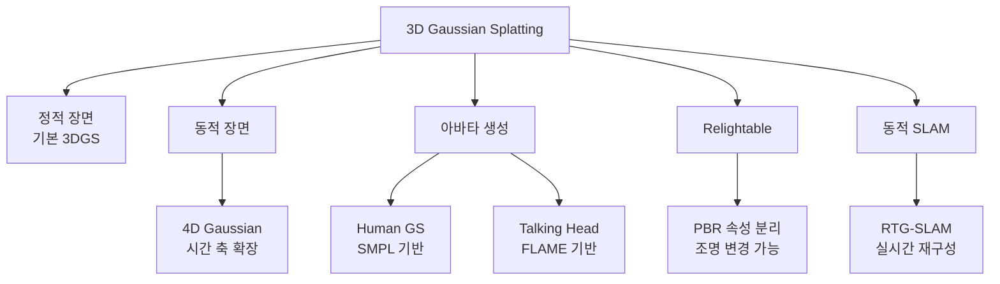
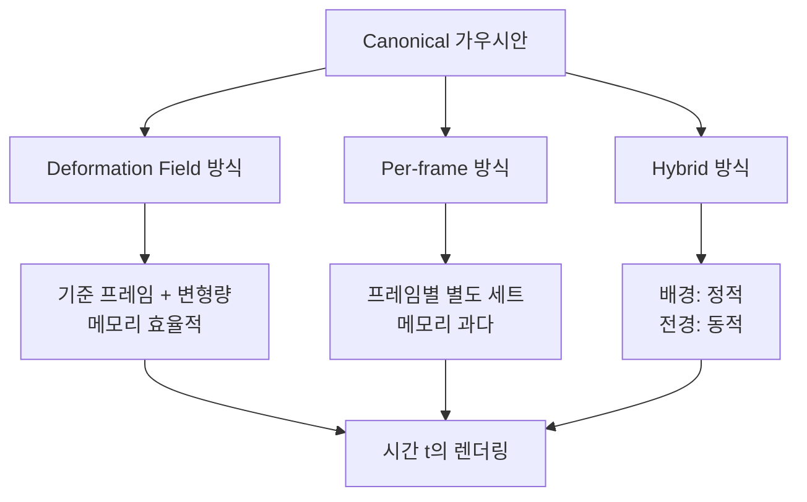
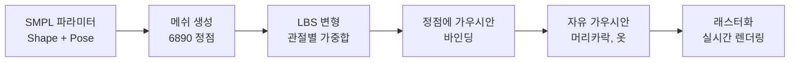
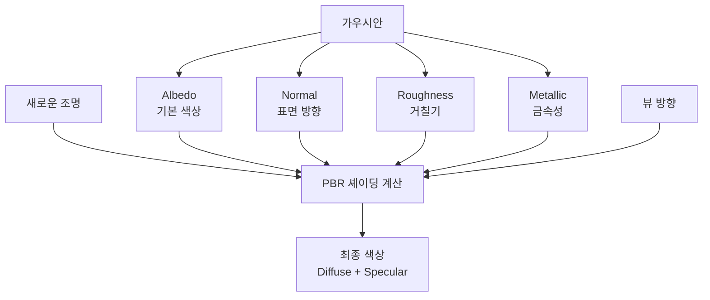
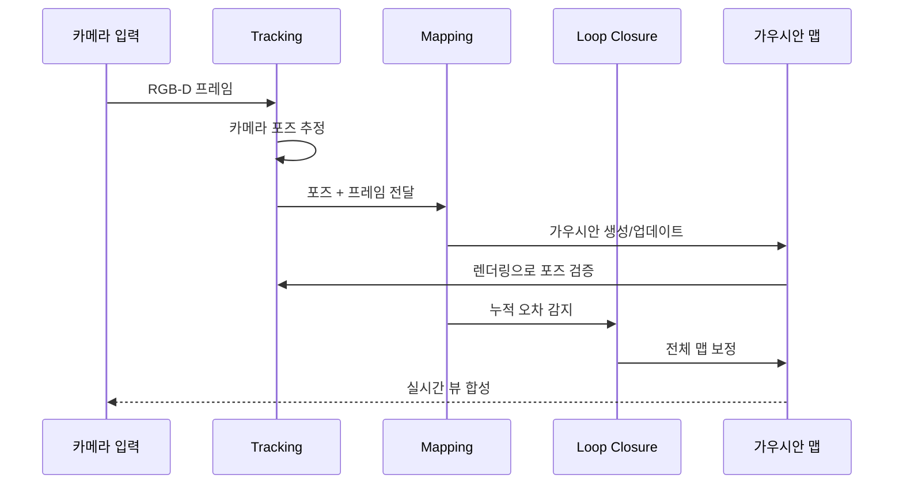

# 3DGS 심화

> 동적 장면, 아바타 생성

## 개요

이 섹션에서는 3D Gaussian Splatting의 **고급 응용**을 다룹니다. 정적 장면을 넘어 **시간에 따라 변화하는 동적 장면**, **움직이는 아바타 생성**, 그리고 최신 연구 동향인 **4D Gaussian Splatting**과 **Relightable 모델**까지 살펴봅니다. 2024-2025년 가장 뜨거운 연구 분야 중 하나죠.

**선수 지식**:
- [3D Gaussian Splatting 기초](./03-3dgs-basics.md)의 가우시안 표현과 래스터화
- [비디오 Diffusion](../15-video-generation/01-video-diffusion.md)의 시간적 확장 개념 (선택)

**학습 목표**:
- 4D Gaussian Splatting으로 동적 장면을 표현하는 방법 이해하기
- 인체 아바타 생성의 핵심 기술 파악하기
- Relightable 3DGS의 개념과 응용 알아보기

## 왜 알아야 할까?

> 📊 **그림 5**: 3DGS 심화 기술의 전체 구조




기본 3DGS는 **정적 장면만** 다룹니다. 하지만 실제 세계는 움직입니다:

| 응용 분야 | 필요한 기술 | 관련 연구 |
|----------|-----------|----------|
| 영화 VFX | 배우의 동적 캡처 | 4D Gaussian |
| 가상 아바타 | 표정, 몸 움직임 | 3DGS-Avatar |
| AR/VR | 실시간 조명 변화 | Relightable GS |
| 게임 | NPC 애니메이션 | Animatable Avatars |
| 메타버스 | 실시간 인터랙션 | Dynamic 3DGS |

이 기술들을 이해하면 **차세대 실감형 콘텐츠 제작**의 핵심을 파악할 수 있습니다.

## 핵심 개념

### 개념 1: 4D Gaussian Splatting - 시간의 확장

> 📊 **그림 1**: 4D Gaussian Splatting의 Deformation 방식 비교




> 💡 **비유**: 사진첩을 생각해보세요. 기본 3DGS는 한 순간의 사진 한 장입니다. 4D Gaussian은 **플립북(flipbook)**처럼 여러 순간을 담아서, 페이지를 넘기면 움직임이 보입니다. 각 가우시안이 시간에 따라 위치와 모양이 바뀌는 거죠.

**4D Gaussian Splatting(2024, CVPR)**은 시간 축을 추가하여 동적 장면을 표현합니다.

**핵심 아이디어:**

기존 3D 가우시안의 속성들이 시간 $t$의 함수가 됩니다:

$$\mu(t), \Sigma(t), \alpha(t), c(t, \mathbf{d})$$

**접근 방식들:**

1. **Deformation Field 방식**: 기준 프레임(canonical frame)에서 변형으로 표현
   $$\mu(t) = \mu_0 + \Delta\mu(t)$$

2. **Per-frame 방식**: 각 프레임마다 별도의 가우시안 세트
   - 메모리 많이 소모
   - 프레임 간 일관성 유지 어려움

3. **Hybrid 방식**: 시간 불변 + 시간 의존 분리
   - 배경: 정적 가우시안
   - 전경: 동적 가우시안

**4D-GS의 Deformation Network:**

```
입력: (μ₀, t) → MLP → (Δμ, Δr, Δs) → 변형된 가우시안
```

- $\Delta\mu$: 위치 변화
- $\Delta r$: 회전 변화 (쿼터니언)
- $\Delta s$: 스케일 변화

### 개념 2: Human Gaussian Splatting - 아바타 생성

> 📊 **그림 2**: SMPL 기반 Human Gaussian Avatar 파이프라인




> 💡 **비유**: 인형극의 꼭두각시를 생각해보세요. 줄(뼈대)을 당기면 인형(가우시안)이 움직입니다. Human Gaussian은 **SMPL이라는 인체 뼈대 모델**을 줄로 사용해서, 그 위에 가우시안 솜뭉치들을 붙여놓은 것과 같습니다.

**인체 아바타 생성**은 3DGS의 가장 활발한 응용 분야입니다.

**SMPL 기반 아바타:**

SMPL(Skinned Multi-Person Linear Model)은 인체 형상과 포즈를 파라미터화한 모델입니다:
- **Shape 파라미터** β: 체형 (키, 뚱뚱함 등)
- **Pose 파라미터** θ: 관절 각도 (24개 관절)

**Gaussian-on-Mesh 접근법:**

1. **메쉬 표면에 가우시안 배치**: 각 삼각형 면에 가우시안 anchor
2. **LBS(Linear Blend Skinning)**: 뼈대 움직임에 따라 가우시안 변형
3. **세부 표현**: 메쉬로 못 잡는 머리카락, 옷 등은 자유 가우시안으로

**주요 연구들 (2024-2025):**

| 연구 | 핵심 기법 | 특징 |
|------|----------|------|
| 3DGS-Avatar | Deformable 3DGS | SMPL 기반, 30분 학습 |
| SplattingAvatar | Mesh embedding | 메쉬+가우시안 joint 최적화 |
| GoMAvatar | Gaussians-on-Mesh | 메쉬 변형과 호환 |
| Human-GS | Real-time animatable | 50+ FPS 렌더링 |

### 개념 3: Talking Head와 얼굴 아바타

> 💡 **비유**: 립싱크 인형처럼 입 모양만 바꾸는 게 아니라, 표정 전체가 자연스럽게 변하는 **디지털 배우**를 만드는 기술입니다.

**얼굴 아바타**는 더 세밀한 표현이 필요합니다:

**FLAME 모델 기반:**
- FLAME: 얼굴 전용 parametric 모델
- 표정 파라미터 (50차원)
- 턱 포즈, 눈 움직임 등

**GaussianAvatars (2024):**

1. **Rigging**: FLAME 메쉬에 가우시안 바인딩
2. **Expression Blendshapes**: 표정별 가우시안 변형 학습
3. **Hair & Accessories**: 추가 자유 가우시안으로 처리

**TalkingGaussian:**
- 오디오 입력 → 입 모양 예측
- 감정 조건부 생성
- 실시간 립싱크

### 개념 4: Relightable Gaussian Splatting

> 📊 **그림 3**: Relightable GS의 PBR 속성 분리와 렌더링




> 💡 **비유**: 일반 3DGS 모델은 촬영 당시의 조명이 "구워진(baked)" 상태입니다. Relightable 모델은 **가상 조명**을 비춰서 그림자와 반사를 실시간으로 바꿀 수 있습니다.

**문제:**
- 기본 SH는 원래 조명에서의 appearance만 표현
- 조명이 바뀌면 완전히 다른 렌더링 필요

**해결책: PBR(Physically-Based Rendering) 속성 분리**

각 가우시안에 물리 기반 속성 추가:
- **Albedo** (기본 색상): 조명 없는 순수 색상
- **Normal** (법선): 표면 방향
- **Roughness** (거칠기): 반사 특성
- **Metallic** (금속성): 금속/비금속 특성

**렌더링 방정식 근사:**

$$L_o = \int_\Omega f_r(\mathbf{d}_i, \mathbf{d}_o) L_i(\mathbf{d}_i) (\mathbf{n} \cdot \mathbf{d}_i) d\mathbf{d}_i$$

- $L_o$: 출력 radiance
- $f_r$: BRDF (재질 특성)
- $L_i$: 입사 조명
- $\mathbf{n}$: 법선

**GS-IR (2024):**
- Gaussian에 normal 필드 추가
- Deferred rendering으로 조명 계산 분리
- IBL(Image-Based Lighting) 지원

### 개념 5: 동적 장면 SLAM

> 📊 **그림 4**: RTG-SLAM 실시간 3D 재구성 루프




**RTG-SLAM (SIGGRAPH 2024)**은 3DGS를 SLAM에 통합했습니다:

**실시간 3D 재구성:**
1. **Tracking**: 카메라 포즈 추정
2. **Mapping**: 가우시안 동적 생성/업데이트
3. **Loop Closure**: 누적 오차 보정

**장점:**
- 기존 NeRF SLAM보다 10배 이상 빠름
- 실시간 뷰 합성 가능
- Large-scale 환경 지원

## 실습: 4D Gaussian Splatting 구현

```python
import torch
import torch.nn as nn
import torch.nn.functional as F

class DeformationNetwork(nn.Module):
    """
    시간에 따른 가우시안 변형을 예측하는 네트워크

    4D Gaussian Splatting의 핵심 컴포넌트
    """
    def __init__(
        self,
        input_dim: int = 3,      # 위치 차원
        hidden_dim: int = 128,
        num_layers: int = 4,
        time_embed_dim: int = 64
    ):
        super().__init__()

        # 시간 임베딩 (positional encoding 스타일)
        self.time_embed_dim = time_embed_dim

        # 위치 + 시간 임베딩을 입력으로 받는 MLP
        self.layers = nn.ModuleList()
        in_dim = input_dim + time_embed_dim

        for i in range(num_layers):
            out_dim = hidden_dim if i < num_layers - 1 else hidden_dim
            self.layers.append(nn.Linear(in_dim, out_dim))
            in_dim = out_dim

        # 출력 헤드
        self.position_head = nn.Linear(hidden_dim, 3)    # Δμ
        self.rotation_head = nn.Linear(hidden_dim, 4)    # Δ쿼터니언
        self.scale_head = nn.Linear(hidden_dim, 3)       # Δs (log space)

    def time_embedding(self, t: torch.Tensor) -> torch.Tensor:
        """
        시간 값을 고차원 임베딩으로 변환

        Args:
            t: (batch,) 또는 (batch, 1) 정규화된 시간 [0, 1]
        """
        if t.dim() == 1:
            t = t.unsqueeze(-1)

        # Sinusoidal embedding
        freqs = torch.pow(2, torch.linspace(0, self.time_embed_dim // 2 - 1,
                                            self.time_embed_dim // 2, device=t.device))
        angles = t * freqs * 3.14159
        embedding = torch.cat([torch.sin(angles), torch.cos(angles)], dim=-1)
        return embedding

    def forward(
        self,
        positions: torch.Tensor,  # (N, 3) canonical 위치
        timestamps: torch.Tensor  # (N,) 또는 스칼라 시간
    ) -> dict:
        """
        변형 예측

        Returns:
            delta_pos: (N, 3) 위치 변화
            delta_rot: (N, 4) 회전 변화 (쿼터니언)
            delta_scale: (N, 3) 스케일 변화
        """
        # 시간 임베딩
        if timestamps.dim() == 0:
            timestamps = timestamps.expand(positions.shape[0])
        time_embed = self.time_embedding(timestamps)

        # 입력 결합
        x = torch.cat([positions, time_embed], dim=-1)

        # MLP 통과
        for layer in self.layers:
            x = F.relu(layer(x))

        # 각 출력 예측
        delta_pos = self.position_head(x) * 0.1  # 작은 변형으로 시작
        delta_rot = self.rotation_head(x)
        delta_scale = self.scale_head(x) * 0.01

        return {
            'delta_position': delta_pos,
            'delta_rotation': delta_rot,
            'delta_scale': delta_scale
        }


class Dynamic4DGaussian(nn.Module):
    """
    4D Gaussian Splatting 모델

    정적 canonical 가우시안 + 시간 변형 네트워크
    """
    def __init__(self, num_gaussians: int = 50000, num_frames: int = 100):
        super().__init__()
        self.num_frames = num_frames

        # Canonical (기준) 가우시안 파라미터
        self.canonical_means = nn.Parameter(torch.randn(num_gaussians, 3) * 0.5)
        self.canonical_scales = nn.Parameter(torch.zeros(num_gaussians, 3) - 2)
        self.canonical_rotations = nn.Parameter(self._init_quaternions(num_gaussians))
        self.canonical_opacities = nn.Parameter(torch.zeros(num_gaussians, 1))
        self.sh_coeffs = nn.Parameter(torch.randn(num_gaussians, 48) * 0.1)

        # 변형 네트워크
        self.deformation_net = DeformationNetwork()

    def _init_quaternions(self, n: int) -> torch.Tensor:
        quats = torch.zeros(n, 4)
        quats[:, 0] = 1.0
        return quats

    def get_deformed_gaussians(self, t: float) -> dict:
        """
        특정 시간 t에서의 변형된 가우시안 반환

        Args:
            t: 정규화된 시간 [0, 1]
        """
        t_tensor = torch.tensor(t, device=self.canonical_means.device)

        # 변형 예측
        deform = self.deformation_net(self.canonical_means, t_tensor)

        # 변형 적용
        means = self.canonical_means + deform['delta_position']

        # 회전은 쿼터니언 곱셈 (간략화: 덧셈으로 근사)
        rotations = F.normalize(
            self.canonical_rotations + deform['delta_rotation'] * 0.1,
            dim=-1
        )

        # 스케일
        scales = torch.exp(self.canonical_scales + deform['delta_scale'])

        # 불투명도, SH는 시간 불변 (또는 별도 처리)
        opacities = torch.sigmoid(self.canonical_opacities)

        return {
            'means': means,
            'scales': scales,
            'rotations': rotations,
            'opacities': opacities,
            'sh_coeffs': self.sh_coeffs
        }

    def render_frame(self, t: float, camera):
        """특정 시간의 프레임 렌더링 (실제로는 래스터라이저 호출)"""
        gaussians = self.get_deformed_gaussians(t)
        # ... 렌더링 코드 ...
        return gaussians


# 테스트
if __name__ == "__main__":
    model = Dynamic4DGaussian(num_gaussians=10000, num_frames=50)

    print(f"4D Gaussian 파라미터: {sum(p.numel() for p in model.parameters()):,}")

    # 시간 변화에 따른 위치 확인
    for t in [0.0, 0.5, 1.0]:
        gaussians = model.get_deformed_gaussians(t)
        print(f"t={t:.1f}: 평균 위치 = {gaussians['means'].mean(dim=0).tolist()}")
```

```python
# SMPL 기반 Human Gaussian Avatar (개념 코드)
import torch
import torch.nn as nn

class SMPLGaussianAvatar(nn.Module):
    """
    SMPL 메쉬 기반 인체 가우시안 아바타

    각 메쉬 정점/면에 가우시안을 바인딩
    """
    def __init__(
        self,
        num_vertices: int = 6890,  # SMPL 정점 수
        gaussians_per_vertex: int = 4,
        sh_degree: int = 3
    ):
        super().__init__()

        num_gaussians = num_vertices * gaussians_per_vertex
        self.gaussians_per_vertex = gaussians_per_vertex

        # 정점 기준 상대 위치 (local offset)
        self.local_offsets = nn.Parameter(
            torch.randn(num_gaussians, 3) * 0.01
        )

        # 가우시안 속성들
        self.scales = nn.Parameter(torch.zeros(num_gaussians, 3) - 3)
        self.rotations = nn.Parameter(self._init_quats(num_gaussians))
        self.opacities = nn.Parameter(torch.zeros(num_gaussians, 1))
        self.sh_coeffs = nn.Parameter(torch.randn(num_gaussians, 3, (sh_degree+1)**2) * 0.1)

    def _init_quats(self, n):
        q = torch.zeros(n, 4)
        q[:, 0] = 1.0
        return q

    def forward(self, smpl_vertices: torch.Tensor, vertex_normals: torch.Tensor):
        """
        SMPL 포즈에 따라 가우시안 위치/방향 계산

        Args:
            smpl_vertices: (V, 3) SMPL 정점 위치
            vertex_normals: (V, 3) 정점 법선
        """
        V = smpl_vertices.shape[0]

        # 각 정점을 gaussians_per_vertex번 복제
        base_positions = smpl_vertices.repeat_interleave(
            self.gaussians_per_vertex, dim=0
        )  # (N, 3)

        base_normals = vertex_normals.repeat_interleave(
            self.gaussians_per_vertex, dim=0
        )

        # Local 좌표계 구성 (법선 기반)
        # 실제로는 tangent, bitangent도 필요
        local_z = F.normalize(base_normals, dim=-1)

        # 월드 좌표로 변환된 가우시안 위치
        # (간략화: 법선 방향으로만 offset 적용)
        means = base_positions + self.local_offsets * 0.1

        return {
            'means': means,
            'scales': torch.exp(self.scales),
            'rotations': F.normalize(self.rotations, dim=-1),
            'opacities': torch.sigmoid(self.opacities),
            'sh_coeffs': self.sh_coeffs
        }


class LinearBlendSkinning(nn.Module):
    """
    Linear Blend Skinning: 뼈대 움직임을 정점에 전파

    SMPL의 핵심 컴포넌트
    """
    def __init__(self, num_joints: int = 24):
        super().__init__()
        self.num_joints = num_joints

    def forward(
        self,
        vertices: torch.Tensor,      # (V, 3) rest pose 정점
        joint_transforms: torch.Tensor,  # (J, 4, 4) 관절 변환
        skinning_weights: torch.Tensor   # (V, J) 스키닝 가중치
    ):
        """
        정점을 관절 변환에 따라 변형

        Returns:
            (V, 3) 변형된 정점
        """
        V = vertices.shape[0]
        J = joint_transforms.shape[0]

        # 동차 좌표로 변환
        vertices_hom = torch.cat([
            vertices,
            torch.ones(V, 1, device=vertices.device)
        ], dim=-1)  # (V, 4)

        # 각 관절의 변환 적용 후 가중 합
        # (V, J) @ (J, 4, 4) @ (V, 4, 1) -> weighted sum
        transformed = torch.zeros(V, 3, device=vertices.device)

        for j in range(J):
            # j번째 관절의 변환 적용
            v_j = (joint_transforms[j] @ vertices_hom.T).T[:, :3]  # (V, 3)
            transformed += skinning_weights[:, j:j+1] * v_j

        return transformed


# 실제 사용 시에는 smplx 라이브러리 사용
"""
import smplx

# SMPL 모델 로드
smpl = smplx.create(
    model_path='./models',
    model_type='smpl',
    gender='neutral'
)

# 포즈 적용
output = smpl(
    betas=shape_params,  # (1, 10)
    body_pose=pose_params  # (1, 69)
)

vertices = output.vertices  # (1, 6890, 3)
"""
```

```python
# Relightable Gaussian Splatting 개념
import torch
import torch.nn as nn

class RelightableGaussian(nn.Module):
    """
    조명 변경이 가능한 가우시안 표현

    PBR 속성 (albedo, normal, roughness, metallic) 포함
    """
    def __init__(self, num_gaussians: int = 100000):
        super().__init__()

        # 기본 가우시안 속성
        self.means = nn.Parameter(torch.randn(num_gaussians, 3) * 0.5)
        self.scales = nn.Parameter(torch.zeros(num_gaussians, 3) - 2)
        self.rotations = nn.Parameter(self._init_quats(num_gaussians))
        self.opacities = nn.Parameter(torch.zeros(num_gaussians, 1))

        # PBR 속성 (뷰 독립적)
        self.albedo = nn.Parameter(torch.rand(num_gaussians, 3) * 0.5 + 0.25)
        self.normals = nn.Parameter(torch.randn(num_gaussians, 3))
        self.roughness = nn.Parameter(torch.zeros(num_gaussians, 1) + 0.5)
        self.metallic = nn.Parameter(torch.zeros(num_gaussians, 1))

    def _init_quats(self, n):
        q = torch.zeros(n, 4)
        q[:, 0] = 1.0
        return q

    def get_normals(self):
        """정규화된 법선 반환"""
        return torch.nn.functional.normalize(self.normals, dim=-1)

    def compute_shading(
        self,
        view_dirs: torch.Tensor,    # (N, 3) 뷰 방향
        light_dirs: torch.Tensor,   # (N, 3) 또는 (1, 3) 조명 방향
        light_color: torch.Tensor   # (3,) 조명 색상
    ):
        """
        간단한 PBR 셰이딩 계산

        실제로는 환경맵, 다중 광원 등 더 복잡한 처리 필요
        """
        normals = self.get_normals()
        roughness = torch.sigmoid(self.roughness)
        metallic = torch.sigmoid(self.metallic)
        albedo = torch.sigmoid(self.albedo)

        # Diffuse (Lambertian)
        NdotL = torch.clamp((normals * light_dirs).sum(dim=-1, keepdim=True), 0, 1)
        diffuse = albedo * NdotL * (1 - metallic)

        # Specular (간략화된 Blinn-Phong)
        half_vec = torch.nn.functional.normalize(view_dirs + light_dirs, dim=-1)
        NdotH = torch.clamp((normals * half_vec).sum(dim=-1, keepdim=True), 0, 1)
        spec_power = 2.0 / (roughness + 0.001) ** 2
        specular = torch.pow(NdotH, spec_power) * (1 - roughness)

        # 최종 색상
        color = (diffuse + specular) * light_color
        return torch.clamp(color, 0, 1)


# 환경맵 조명 예시
def sample_environment_light(directions: torch.Tensor, env_map: torch.Tensor):
    """
    환경맵에서 조명 샘플링

    Args:
        directions: (N, 3) 샘플링 방향
        env_map: (H, W, 3) 등장방형(equirectangular) 환경맵
    """
    # 방향을 구면 좌표로 변환
    x, y, z = directions.unbind(-1)
    theta = torch.atan2(x, z)  # [-π, π]
    phi = torch.asin(torch.clamp(y, -1, 1))  # [-π/2, π/2]

    # 환경맵 UV 좌표로 변환
    u = (theta / 3.14159 + 1) / 2  # [0, 1]
    v = (phi / 3.14159 * 2 + 1) / 2  # [0, 1]

    # 그리드 샘플링
    uv = torch.stack([u * 2 - 1, v * 2 - 1], dim=-1).unsqueeze(0).unsqueeze(0)
    sampled = torch.nn.functional.grid_sample(
        env_map.permute(2, 0, 1).unsqueeze(0),
        uv,
        mode='bilinear',
        align_corners=True
    )

    return sampled.squeeze().permute(1, 0)


print("Relightable Gaussian 예시 실행 완료")
```

## 더 깊이 알아보기

### 4D Gaussian의 도전 과제

4D 표현은 여러 기술적 도전을 안고 있습니다:

1. **Temporal Consistency**: 프레임 간 가우시안 대응 관계 유지
2. **Motion Blur**: 빠른 움직임에서의 흐림 효과 표현
3. **Topology Change**: 물체가 나타나거나 사라지는 경우
4. **Long Sequences**: 긴 영상에서의 drift 누적

> 💡 **알고 계셨나요?**: 4D Gaussian Splatting 논문은 2023년 말에 arXiv에 공개되어 2024년 CVPR에 채택되었습니다. 1년 만에 100개 이상의 후속 연구가 쏟아질 정도로 뜨거운 분야가 되었죠!

### 아바타 생성의 발전 방향

**2024-2025년 트렌드:**

1. **One-Shot Avatar**: 단일 이미지에서 아바타 생성
2. **Expressiveness**: 미세한 표정과 주름 표현
3. **Clothing Simulation**: 옷의 물리적 움직임
4. **Hair Modeling**: 머리카락의 섬세한 표현

> 🔥 **실무 팁**: 아바타 생성 시 학습 데이터의 **조명 다양성**이 중요합니다. 단일 조명에서 촬영하면 albedo와 shading이 섞여서 relighting이 어려워집니다.

### 3DGS의 미래: Neural Rendering의 새 표준

3DGS는 빠르게 **산업 표준**으로 자리잡고 있습니다:

- **Unity, Unreal**: 3DGS 플러그인 개발 중
- **Apple Vision Pro**: 공간 컴퓨팅에 활용 가능성
- **Google/Meta**: 자체 3DGS 연구 활발

## 흔한 오해와 팁

> ⚠️ **흔한 오해**: "4D Gaussian은 4차원 가우시안이다" — 4D는 시공간(3D 공간 + 시간)을 의미합니다. 가우시안 자체는 여전히 3차원이고, 그 속성이 시간에 따라 변하는 것입니다.

> 💡 **알고 계셨나요?**: Human Gaussian 연구의 상당수가 SMPL 라이센스 문제로 상용화에 제약이 있습니다. 최근에는 SMPL-free 접근법 연구도 활발합니다.

> 🔥 **실무 팁**: 아바타 품질은 **학습 데이터 퀄리티**에 크게 좌우됩니다. 다양한 포즈, 표정, 조명에서 촬영한 멀티뷰 데이터가 핵심입니다. 최소 50개 이상의 카메라 뷰를 권장합니다.

## 핵심 정리

| 개념 | 설명 |
|------|------|
| 4D Gaussian | 시간 축 추가, Deformation Network로 동적 장면 표현 |
| Human GS Avatar | SMPL 기반 뼈대에 가우시안 바인딩, LBS로 애니메이션 |
| Gaussian-on-Mesh | 메쉬 표면에 가우시안 배치, 변형 안정성 확보 |
| Relightable GS | PBR 속성 분리 (albedo, normal, roughness), 조명 변경 가능 |
| RTG-SLAM | 3DGS 기반 실시간 SLAM, 동적 장면 매핑 |

## 다음 섹션 미리보기

지금까지 이미지나 영상에서 3D를 복원하는 방법을 배웠습니다. 다음은 더 혁신적인 접근입니다. [Text-to-3D](./05-text-to-3d.md)에서는 **텍스트 프롬프트만으로 3D 콘텐츠를 생성**하는 DreamFusion, Zero-1-to-3 등을 살펴봅니다. "A cute corgi sitting on a cloud"라고 입력하면 3D 모델이 나오는 마법 같은 기술이죠!

## 참고 자료

- [4D Gaussian Splatting (CVPR 2024)](https://github.com/hustvl/4DGaussians) - 공식 구현
- [Human Gaussian Splatting Survey (2025)](https://www.frontiersin.org/journals/artificial-intelligence/articles/10.3389/frai.2025.1709229/full) - 최신 서베이
- [3DGS-Avatar (CVPR 2024)](https://openaccess.thecvf.com/content/CVPR2024/papers/Qian_3DGS-Avatar_Animatable_Avatars_via_Deformable_3D_Gaussian_Splatting_CVPR_2024_paper.pdf) - 애니메이션 가능한 아바타
- [RTG-SLAM (SIGGRAPH 2024)](https://dl.acm.org/doi/10.1145/3641519.3657455) - 실시간 3D 재구성
- [SMPL 모델 공식](https://smpl.is.tue.mpg.de/) - 인체 파라메트릭 모델
- [HeadStudio (ECCV 2024)](https://link.springer.com/chapter/10.1007/978-3-031-73411-3_9) - Text-to-Avatar 생성
