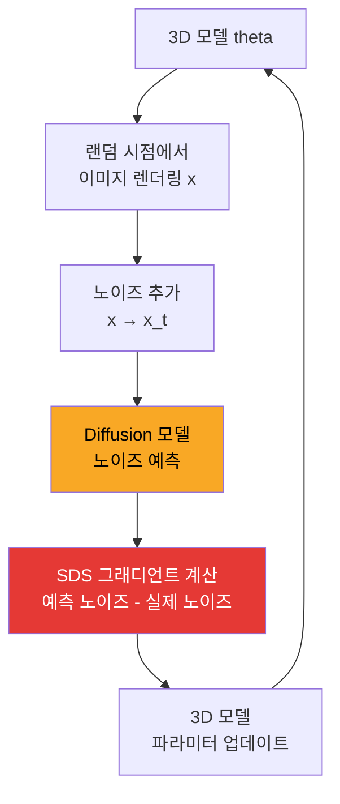
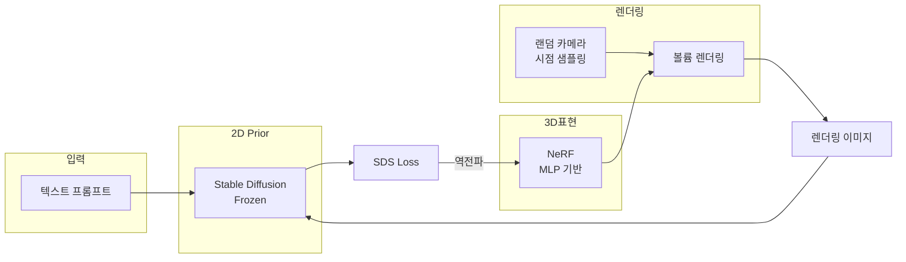
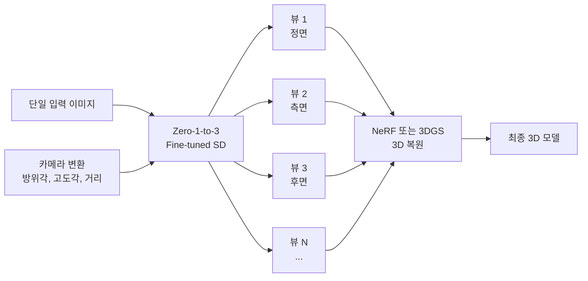
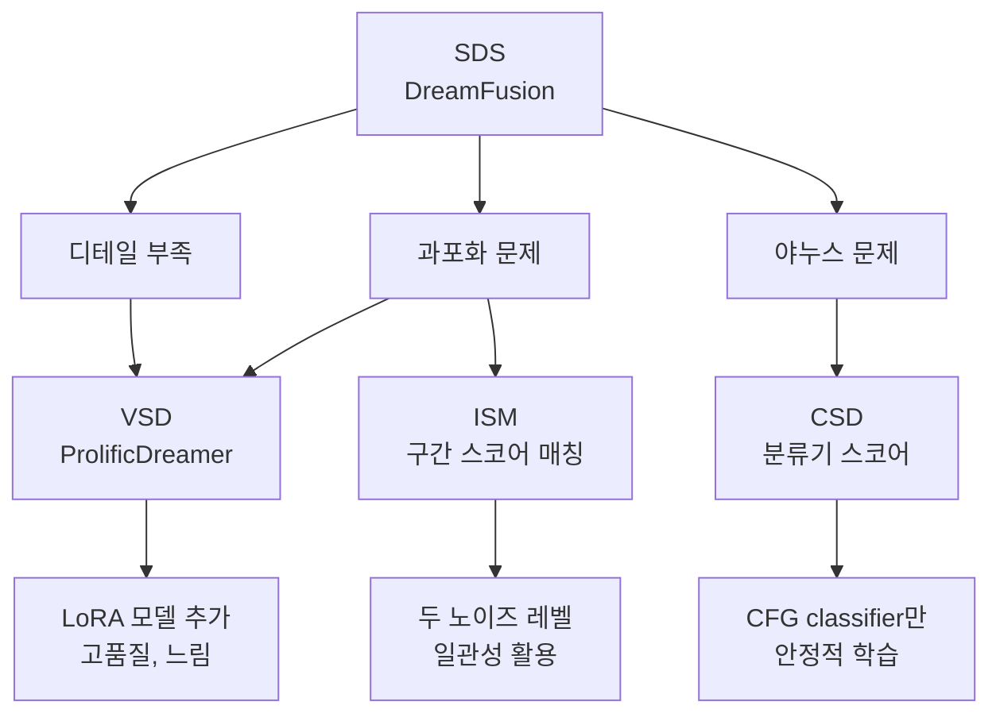
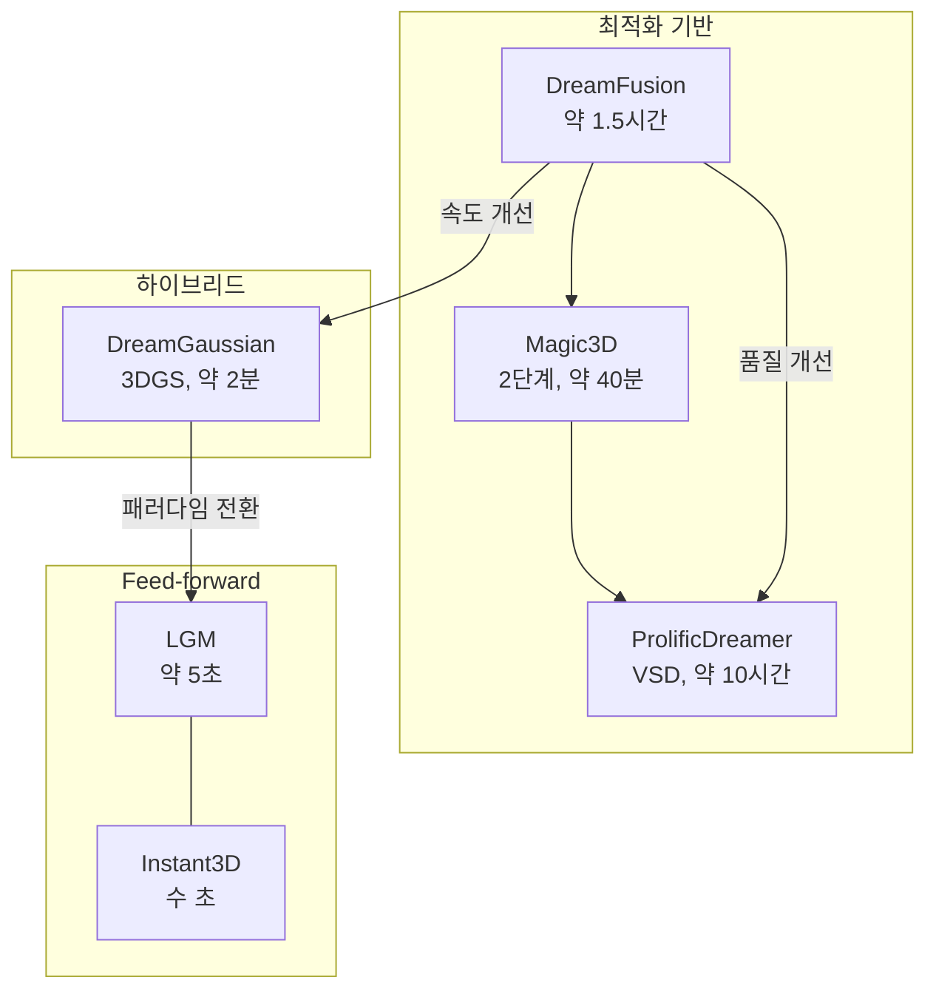

# Text-to-3D

> DreamFusion, Zero-1-to-3

## 개요

이 섹션에서는 **텍스트 프롬프트만으로 3D 콘텐츠를 생성**하는 혁신적인 기술을 다룹니다. "A cute corgi wearing a party hat"이라고 입력하면 실제 3D 모델이 만들어지는 마법 같은 기술이죠. **DreamFusion**의 핵심인 **Score Distillation Sampling(SDS)**부터 **Zero-1-to-3**의 이미지 기반 접근까지, Text-to-3D의 원리와 최신 동향을 살펴봅니다.

**선수 지식**:
- [NeRF 기초](./01-nerf-basics.md)의 신경망 3D 표현
- [Diffusion 이론](../12-diffusion-models/01-diffusion-theory.md)의 스코어 함수 개념
- [CFG](../12-diffusion-models/05-cfg.md)의 Classifier-Free Guidance

**학습 목표**:
- Score Distillation Sampling의 원리 이해하기
- DreamFusion의 학습 과정 파악하기
- Image-to-3D 기법들의 차이점 알아보기

## 왜 알아야 할까?

기존 3D 콘텐츠 제작의 한계:

| 기존 방식 | Text-to-3D |
|----------|-----------|
| 3D 모델링 기술 필요 | 텍스트 입력만으로 생성 |
| 제작에 수일~수주 | 수 분~수 시간 |
| 전문 소프트웨어 필요 | 프롬프트 작성 능력만 |
| 제한된 상상력 | 무한한 창의적 표현 |

Text-to-3D는 게임 에셋 제작, VR/AR 콘텐츠, 제품 프로토타이핑, 건축 시각화 등 **3D 콘텐츠 민주화**를 이끌고 있습니다.

## 핵심 개념

### 개념 1: Score Distillation Sampling (SDS)

> 📊 **그림 1**: SDS의 핵심 루프 — 3D 모델을 Diffusion 모델의 피드백으로 반복 개선




> 💡 **비유**: 조각가가 대리석을 조각한다고 상상해보세요. 하지만 이 조각가는 눈이 가려져 있고, 곁에 있는 **비평가(Diffusion 모델)**가 "위쪽을 더 깎아" "여기는 좀 더 세밀하게"라고 피드백을 줍니다. SDS는 이 비평가의 피드백을 수학적으로 표현한 것입니다.

**DreamFusion(2022)**의 핵심 혁신인 SDS는 2D Diffusion 모델의 지식을 3D 생성에 활용합니다.

**문제 상황:**
- 3D 데이터셋은 2D에 비해 매우 적음
- 하지만 강력한 2D Diffusion 모델(Stable Diffusion 등)은 이미 존재
- 어떻게 2D 지식을 3D 생성에 활용할까?

**핵심 아이디어:**

3D 모델 $\theta$에서 렌더링한 이미지 $x$가 텍스트 프롬프트 $y$에 맞는 "자연스러운" 이미지가 되도록 최적화합니다.

**SDS 손실 함수:**

$$\nabla_\theta \mathcal{L}_{SDS} = \mathbb{E}_{t, \epsilon}\left[ w(t) \left( \hat{\epsilon}_\phi(x_t; y, t) - \epsilon \right) \frac{\partial x}{\partial \theta} \right]$$

각 기호의 의미:
- $x = g(\theta)$: 3D 모델 $\theta$에서 렌더링한 이미지
- $x_t$: 노이즈 레벨 $t$에서의 노이즈 추가된 이미지
- $\hat{\epsilon}_\phi$: 사전 학습된 Diffusion 모델의 노이즈 예측
- $\epsilon$: 실제 추가된 노이즈
- $w(t)$: 시간에 따른 가중치

**직관적 이해:**

1. 3D 모델에서 이미지 렌더링
2. 이미지에 랜덤 노이즈 추가
3. Diffusion 모델에게 "이 이미지가 프롬프트에 맞나요?" 물어봄
4. 모델의 피드백(노이즈 예측 차이)을 3D 모델로 역전파
5. 반복하여 3D 모델 개선

### 개념 2: DreamFusion 파이프라인

> 📊 **그림 2**: DreamFusion 아키텍처 — NeRF + SDS + Diffusion Prior의 결합




> 💡 **비유**: DreamFusion은 **360도 회전하는 조각 심사**와 같습니다. 무작위 각도에서 사진을 찍고, 각 사진이 프롬프트에 맞는지 평가받아 조각을 수정합니다. 모든 각도에서 좋은 평가를 받으면 완성입니다.

**DreamFusion 구조:**

1. **3D 표현**: NeRF (MLP로 암시적 표현)
2. **렌더러**: 볼륨 렌더링
3. **2D Prior**: Imagen (Google) 또는 Stable Diffusion
4. **최적화**: SDS 손실로 NeRF 파라미터 업데이트

**학습 과정:**

```
반복:
    1. 랜덤 카메라 시점 샘플링
    2. 해당 시점에서 NeRF 렌더링 → 이미지 x
    3. 랜덤 노이즈 레벨 t 선택
    4. x에 노이즈 추가 → x_t
    5. Diffusion 모델로 노이즈 예측
    6. SDS 그래디언트 계산
    7. NeRF 파라미터 업데이트
```

**추가 기법들:**

- **Shading**: 조명 효과로 기하학 학습 개선
- **View-dependent prompting**: "front view of...", "side view of..." 등
- **Coarse-to-fine**: 저해상도에서 고해상도로 점진적 학습

### 개념 3: Zero-1-to-3 - 이미지에서 3D로

> 📊 **그림 3**: Zero-1-to-3 파이프라인 — 단일 이미지에서 멀티뷰 생성 후 3D 복원




> 💡 **비유**: 사진 한 장만 보고 뒷모습을 상상해보세요. 사람은 경험을 바탕으로 뒷모습을 추측합니다. Zero-1-to-3는 수백만 장의 3D 데이터로 학습해서 **단일 이미지의 다른 각도를 상상**합니다.

**Zero-1-to-3(2023)**는 단일 이미지에서 다른 시점의 이미지를 생성합니다.

**핵심 아이디어:**

Stable Diffusion을 fine-tune하여:
- **입력**: 참조 이미지 + 원하는 카메라 변환
- **출력**: 변환된 시점에서의 이미지

**카메라 조건화:**

상대적 카메라 변환 $(\Delta\theta, \Delta\phi, \Delta r)$을 조건으로 제공:
- $\Delta\theta$: 방위각 변화
- $\Delta\phi$: 고도각 변화
- $\Delta r$: 거리 변화 (줌)

**3D 재구성:**

Zero-1-to-3로 여러 각도 이미지 생성 → NeRF/3DGS로 3D 복원

### 개념 4: SDS의 변형들

> 📊 **그림 4**: SDS 변형들의 개선 방향 비교




원본 SDS에는 몇 가지 문제가 있습니다:

**문제점:**
1. **Over-saturation**: 색이 과포화됨
2. **Over-smoothing**: 디테일이 뭉개짐
3. **Janus problem**: 여러 얼굴이 생기는 현상

**개선된 변형들:**

**VSD (Variational Score Distillation, ProlificDreamer):**

NeRF를 분포로 모델링하여 더 다양하고 디테일한 결과:

$$\nabla_\theta \mathcal{L}_{VSD} = \mathbb{E}\left[ w(t) \left( \hat{\epsilon}_\phi(x_t; y, t) - \hat{\epsilon}_\psi(x_t; y, t) \right) \frac{\partial x}{\partial \theta} \right]$$

여기서 $\hat{\epsilon}_\psi$는 NeRF에 맞춰 fine-tune된 LoRA Diffusion 모델입니다.

**ISM (Interval Score Matching):**

두 노이즈 레벨 사이의 일관성 활용:

$$\mathcal{L}_{ISM} = \|D(x_{t_1}) - D(x_{t_2})\|$$

**CSD (Classifier Score Distillation):**

CFG의 classifier 부분만 사용하여 더 안정적인 학습.

### 개념 5: 최신 Text-to-3D 모델들

> 📊 **그림 5**: Text-to-3D 패러다임의 진화 — 최적화 기반에서 Feed-forward로




**2024-2025년 주요 발전:**

| 모델 | 특징 | 생성 시간 |
|------|------|----------|
| DreamFusion | 원조 SDS | ~1.5시간 |
| Magic3D | 2단계 (coarse→fine) | ~40분 |
| Fantasia3D | 분리된 geometry/appearance | ~30분 |
| ProlificDreamer | VSD로 고품질 | ~10시간 |
| DreamGaussian | 3DGS 기반 | ~2분! |
| LGM (2024) | Feed-forward 생성 | ~5초! |
| Instant3D | Triplane + feed-forward | 수 초 |

**Feed-forward 방식의 등장:**

최근에는 최적화 없이 단일 forward pass로 3D 생성:
- **입력**: 이미지 또는 텍스트
- **출력**: 3D 표현 (triplane, 3DGS 등)
- **장점**: 초고속 (수 초), 일관된 품질

### 개념 6: Threestudio - 통합 프레임워크

**Threestudio**는 다양한 Text-to-3D 방법을 통합한 프레임워크입니다:

**지원하는 방법들:**
- DreamFusion (SDS)
- Magic3D
- ProlificDreamer (VSD)
- Zero-1-to-3
- DreamGaussian

**지원하는 3D 표현:**
- NeRF
- DMTet (메쉬)
- 3D Gaussian Splatting

## 실습: Text-to-3D 코드 구현

```python
import torch
import torch.nn as nn
import torch.nn.functional as F
from diffusers import StableDiffusionPipeline
import numpy as np

class ScoreDistillationSampling:
    """
    Score Distillation Sampling (SDS) 구현

    사전 학습된 Diffusion 모델을 사용하여 3D 모델 최적화
    """
    def __init__(
        self,
        model_id: str = "stabilityai/stable-diffusion-2-1-base",
        device: str = "cuda",
        guidance_scale: float = 100.0,
        grad_scale: float = 1.0
    ):
        self.device = device
        self.guidance_scale = guidance_scale
        self.grad_scale = grad_scale

        # Stable Diffusion 로드
        self.pipe = StableDiffusionPipeline.from_pretrained(
            model_id,
            torch_dtype=torch.float16
        ).to(device)

        # 필요한 컴포넌트 추출
        self.unet = self.pipe.unet
        self.vae = self.pipe.vae
        self.text_encoder = self.pipe.text_encoder
        self.tokenizer = self.pipe.tokenizer
        self.scheduler = self.pipe.scheduler

        # Freeze 모델
        for param in self.unet.parameters():
            param.requires_grad = False
        for param in self.vae.parameters():
            param.requires_grad = False

        # 노이즈 스케줄
        self.num_train_timesteps = self.scheduler.config.num_train_timesteps
        self.min_step = int(self.num_train_timesteps * 0.02)  # t_min
        self.max_step = int(self.num_train_timesteps * 0.98)  # t_max

    def encode_text(self, prompt: str):
        """텍스트 프롬프트를 임베딩으로 변환"""
        # Tokenize
        tokens = self.tokenizer(
            prompt,
            padding="max_length",
            max_length=self.tokenizer.model_max_length,
            truncation=True,
            return_tensors="pt"
        )

        # Encode
        with torch.no_grad():
            text_embeddings = self.text_encoder(tokens.input_ids.to(self.device))[0]

        # Unconditional embedding (CFG용)
        uncond_tokens = self.tokenizer(
            "",
            padding="max_length",
            max_length=self.tokenizer.model_max_length,
            return_tensors="pt"
        )
        with torch.no_grad():
            uncond_embeddings = self.text_encoder(uncond_tokens.input_ids.to(self.device))[0]

        # [uncond, cond] 결합
        text_embeddings = torch.cat([uncond_embeddings, text_embeddings])
        return text_embeddings

    def compute_sds_loss(
        self,
        rendered_images: torch.Tensor,  # (B, 3, H, W) [0, 1] 범위
        text_embeddings: torch.Tensor
    ):
        """
        SDS 손실 계산

        Args:
            rendered_images: 3D 모델에서 렌더링된 이미지
            text_embeddings: 인코딩된 텍스트 프롬프트

        Returns:
            SDS 그래디언트
        """
        batch_size = rendered_images.shape[0]

        # 이미지를 latent space로 인코딩
        # [0, 1] → [-1, 1]
        images = 2 * rendered_images - 1
        images = images.half()

        with torch.no_grad():
            latents = self.vae.encode(images).latent_dist.sample()
            latents = latents * self.vae.config.scaling_factor

        # 랜덤 타임스텝 샘플링
        t = torch.randint(
            self.min_step, self.max_step,
            (batch_size,),
            device=self.device
        )

        # 노이즈 추가
        noise = torch.randn_like(latents)
        noisy_latents = self.scheduler.add_noise(latents, noise, t)

        # CFG를 위해 latent 복제
        latent_model_input = torch.cat([noisy_latents] * 2)
        t_input = torch.cat([t] * 2)

        # U-Net으로 노이즈 예측
        with torch.no_grad():
            noise_pred = self.unet(
                latent_model_input,
                t_input,
                encoder_hidden_states=text_embeddings
            ).sample

        # CFG 적용
        noise_pred_uncond, noise_pred_text = noise_pred.chunk(2)
        noise_pred = noise_pred_uncond + self.guidance_scale * (
            noise_pred_text - noise_pred_uncond
        )

        # SDS 그래디언트: (예측 노이즈 - 실제 노이즈)
        # 이것을 latent에 대한 그래디언트로 사용
        w = (1 - self.scheduler.alphas_cumprod[t]).view(-1, 1, 1, 1)
        grad = w * (noise_pred - noise)

        # 그래디언트를 이미지에 역전파하기 위해 타깃 설정
        target = (latents - grad).detach()

        # MSE 손실 (그래디언트 흐름용)
        loss = 0.5 * F.mse_loss(latents, target, reduction='sum') / batch_size
        loss = loss * self.grad_scale

        return loss


# 간단한 NeRF + SDS 학습 예시
class SimpleNeRF(nn.Module):
    """간략화된 NeRF 모델 (DreamFusion 스타일)"""
    def __init__(self, hidden_dim=64):
        super().__init__()
        # Hash encoding 대신 간단한 MLP
        self.mlp = nn.Sequential(
            nn.Linear(63, hidden_dim),  # 포지셔널 인코딩된 입력
            nn.ReLU(),
            nn.Linear(hidden_dim, hidden_dim),
            nn.ReLU(),
            nn.Linear(hidden_dim, hidden_dim),
            nn.ReLU(),
        )
        self.density_head = nn.Linear(hidden_dim, 1)
        self.color_head = nn.Sequential(
            nn.Linear(hidden_dim + 27, hidden_dim),  # + 방향 인코딩
            nn.ReLU(),
            nn.Linear(hidden_dim, 3),
            nn.Sigmoid()
        )

    def forward(self, pos_encoded, dir_encoded):
        h = self.mlp(pos_encoded)
        density = F.softplus(self.density_head(h))
        color = self.color_head(torch.cat([h, dir_encoded], dim=-1))
        return color, density


# 학습 루프 예시 (의사 코드)
"""
# 초기화
sds = ScoreDistillationSampling()
nerf = SimpleNeRF().cuda()
optimizer = torch.optim.Adam(nerf.parameters(), lr=1e-3)

prompt = "a DSLR photo of a cute corgi puppy"
text_embeddings = sds.encode_text(prompt)

# 학습 루프
for step in range(10000):
    # 랜덤 카메라 시점
    camera = sample_random_camera()

    # NeRF 렌더링
    rendered = render_nerf(nerf, camera)  # (1, 3, 64, 64)

    # SDS 손실 계산
    loss = sds.compute_sds_loss(rendered, text_embeddings)

    # 역전파
    optimizer.zero_grad()
    loss.backward()
    optimizer.step()

    if step % 100 == 0:
        print(f"Step {step}, Loss: {loss.item():.4f}")
"""
```

```bash
# Threestudio를 사용한 Text-to-3D

# 1. 설치
git clone https://github.com/threestudio-project/threestudio.git
cd threestudio
pip install -r requirements.txt

# 2. DreamFusion 스타일 학습
python launch.py --config configs/dreamfusion-sd.yaml \
    --train \
    system.prompt_processor.prompt="a zoomed out DSLR photo of a baby bunny sitting on top of a stack of pancakes"

# 3. Magic3D 스타일 (2단계)
# Coarse stage (NeRF)
python launch.py --config configs/magic3d-coarse-sd.yaml \
    --train \
    system.prompt_processor.prompt="a DSLR photo of an ice cream sundae"

# Fine stage (DMTet mesh)
python launch.py --config configs/magic3d-refine-sd.yaml \
    --train \
    system.prompt_processor.prompt="a DSLR photo of an ice cream sundae" \
    system.geometry_convert_from=path/to/coarse/ckpt

# 4. Zero-1-to-3 (이미지 → 3D)
python launch.py --config configs/zero123.yaml \
    --train \
    data.image_path=./your_image.png

# 5. DreamGaussian (빠른 3DGS 기반)
# 별도 저장소 사용
git clone https://github.com/dreamgaussian/dreamgaussian.git
cd dreamgaussian
python main.py --config configs/text.yaml prompt="a hamburger"
```

```python
# Zero-1-to-3 스타일 Novel View Synthesis
import torch
from diffusers import DiffusionPipeline
from PIL import Image
import numpy as np

def generate_novel_view(
    image_path: str,
    delta_azimuth: float = 30.0,  # 방위각 변화 (도)
    delta_elevation: float = 0.0,  # 고도각 변화
    delta_radius: float = 0.0      # 거리 변화
):
    """
    Zero-1-to-3를 사용하여 새로운 시점 이미지 생성

    Args:
        image_path: 입력 이미지 경로
        delta_azimuth: 방위각 변화 (-180 ~ 180)
        delta_elevation: 고도각 변화 (-90 ~ 90)
        delta_radius: 거리 변화 (음수: 가까이, 양수: 멀리)
    """
    # 모델 로드 (실제로는 Zero123 모델)
    # 여기서는 개념 설명용 의사 코드
    """
    pipe = DiffusionPipeline.from_pretrained(
        "bennyguo/zero123-xl-diffusers",
        torch_dtype=torch.float16
    ).to("cuda")

    # 입력 이미지 로드
    input_image = Image.open(image_path).convert("RGB")
    input_image = input_image.resize((256, 256))

    # 카메라 변환 조건
    # 실제 Zero123는 라디안 단위 사용
    azimuth_rad = np.deg2rad(delta_azimuth)
    elevation_rad = np.deg2rad(delta_elevation)

    # 생성
    output = pipe(
        input_image,
        azimuth=azimuth_rad,
        elevation=elevation_rad,
        radius=delta_radius,
        num_inference_steps=50,
        guidance_scale=3.0
    ).images[0]

    return output
    """
    pass


# Multi-view 생성 후 3D 복원 파이프라인
def text_to_3d_via_multiview(prompt: str, num_views: int = 8):
    """
    Text → Multi-view images → 3D 복원 파이프라인

    1. Text-to-Image로 정면 이미지 생성
    2. Zero-1-to-3로 여러 각도 이미지 생성
    3. 3DGS 또는 NeRF로 3D 복원
    """
    pass  # 구현 생략


# LGM (Large Gaussian Model) 스타일 Feed-forward 3D 생성
class FeedForward3DGenerator(nn.Module):
    """
    이미지에서 직접 3DGS 파라미터를 예측하는 모델

    최적화 없이 단일 forward pass로 3D 생성
    """
    def __init__(self, num_gaussians: int = 10000):
        super().__init__()
        self.num_gaussians = num_gaussians

        # 이미지 인코더 (예: DINOv2)
        self.encoder = nn.Sequential(
            nn.Conv2d(3, 64, 7, stride=2, padding=3),
            nn.ReLU(),
            nn.Conv2d(64, 128, 3, stride=2, padding=1),
            nn.ReLU(),
            nn.Conv2d(128, 256, 3, stride=2, padding=1),
            nn.ReLU(),
            nn.AdaptiveAvgPool2d((8, 8))
        )

        # Transformer로 가우시안 파라미터 예측
        self.gaussian_decoder = nn.Sequential(
            nn.Linear(256 * 64, 1024),
            nn.ReLU(),
            nn.Linear(1024, num_gaussians * 14)  # 3(pos) + 3(scale) + 4(rot) + 1(opacity) + 3(color)
        )

    def forward(self, images: torch.Tensor):
        """
        Args:
            images: (B, V, 3, H, W) 멀티뷰 이미지

        Returns:
            가우시안 파라미터들
        """
        B, V = images.shape[:2]

        # 각 뷰 인코딩
        features = []
        for v in range(V):
            feat = self.encoder(images[:, v])
            features.append(feat.flatten(1))

        # 뷰 특징 결합
        combined = torch.stack(features, dim=1).mean(dim=1)

        # 가우시안 파라미터 예측
        params = self.gaussian_decoder(combined)
        params = params.view(B, self.num_gaussians, 14)

        return {
            'positions': params[..., :3],
            'scales': torch.exp(params[..., 3:6]),
            'rotations': F.normalize(params[..., 6:10], dim=-1),
            'opacities': torch.sigmoid(params[..., 10:11]),
            'colors': torch.sigmoid(params[..., 11:14])
        }


print("Text-to-3D 예시 코드 로드 완료")
```

## 더 깊이 알아보기

### DreamFusion의 탄생 스토리

DreamFusion은 2022년 Google Research에서 발표되었습니다. 핵심 아이디어인 **Score Distillation Sampling**은 사실 기존의 **classifier guidance**와 **knowledge distillation**을 창의적으로 결합한 것입니다.

> 💡 **알고 계셨나요?**: DreamFusion 논문은 처음에 arXiv에 공개되었을 때 코드 공개 없이 결과물만 보여줬는데, 불과 며칠 만에 커뮤니티에서 재현 코드들이 쏟아졌습니다. stable-dreamfusion, threestudio 등이 그 결과물이죠!

### Janus Problem (야누스 문제)

Text-to-3D의 대표적인 실패 모드입니다:

**증상:**
- "a dog"를 생성하면 앞/뒤 모두 얼굴이 있음
- 여러 방향에서 봐도 정면처럼 보이는 기형적인 결과

**원인:**
- 2D Diffusion 모델은 대부분 정면 이미지로 학습됨
- SDS가 모든 방향에서 "좋아 보이는" 이미지를 만들려다 보니 발생

**해결책:**
1. **View-dependent prompting**: "back view of a dog", "side view of a dog" 사용
2. **3D-aware prior**: 3D 데이터로 fine-tune된 모델 사용
3. **Geometry regularization**: 합리적인 기하학 제약 추가

### 최근 연구 트렌드 (2024-2025)

**속도 혁신:**
- **LGM, Instant3D**: 초 단위 생성
- **Feed-forward 방식**: 최적화 없이 직접 예측

**품질 개선:**
- **Multi-view Diffusion**: MVDream, Wonder3D
- **3D-native generation**: 3D 데이터로 직접 학습

**응용 확장:**
- **Text-to-4D**: 동적 3D 콘텐츠 생성
- **Text-to-Scene**: 전체 장면 생성
- **Controllable 3D**: ControlNet + 3D

## 흔한 오해와 팁

> ⚠️ **흔한 오해**: "Text-to-3D는 Text-to-Image처럼 빠르다" — 기본 DreamFusion은 1-2시간, ProlificDreamer는 10시간 이상 걸립니다. 빠른 방법들(DreamGaussian, LGM)은 품질 트레이드오프가 있습니다.

> 💡 **알고 계셨나요?**: SDS의 높은 guidance scale(100+)은 Text-to-Image에서 사용하는 값(7.5)보다 훨씬 높습니다. 이는 3D 일관성을 위해 더 강한 조건 부여가 필요하기 때문입니다.

> 🔥 **실무 팁**: 프롬프트에 "a DSLR photo of...", "highly detailed", "8K" 같은 품질 키워드를 추가하면 결과가 크게 개선됩니다. 또한 "floating in the air", "isolated on white background" 같이 배경을 단순화하는 프롬프트도 효과적입니다.

## 핵심 정리

| 개념 | 설명 |
|------|------|
| Score Distillation Sampling | 2D Diffusion 모델의 스코어로 3D 최적화 유도 |
| DreamFusion | SDS + NeRF로 텍스트에서 3D 생성 |
| Zero-1-to-3 | 단일 이미지에서 다른 시점 이미지 생성 |
| Janus Problem | 모든 방향에서 정면처럼 보이는 실패 모드 |
| Feed-forward 3D | 최적화 없이 직접 3D 파라미터 예측, 초고속 |

## 다음으로

Chapter 17 Neural Rendering을 마쳤습니다! NeRF에서 시작해 3D Gaussian Splatting, 그리고 Text-to-3D까지 최신 Neural Rendering 기술의 핵심을 배웠습니다.

다음 [Chapter 18: 멀티모달 AI 최전선](../18-multimodal-frontier/01-unified-models.md)에서는 이미지-텍스트-오디오를 통합하는 **Unified Multimodal Models**, **World Models**, **Embodied AI** 등 AI의 최전선을 탐험합니다.

## 참고 자료

- [DreamFusion 프로젝트](https://dreamfusion3d.github.io/) - Google Research 공식 페이지
- [DreamFusion 논문](https://arxiv.org/abs/2209.14988) - 원본 논문
- [Threestudio GitHub](https://github.com/threestudio-project/threestudio) - 통합 Text-to-3D 프레임워크
- [stable-dreamfusion](https://github.com/ashawkey/stable-dreamfusion) - Stable Diffusion 기반 구현
- [DreamGaussian](https://dreamgaussian.github.io/) - 빠른 3DGS 기반 Text-to-3D
- [Zero-1-to-3](https://zero123.cs.columbia.edu/) - 이미지 기반 novel view synthesis
- [ProlificDreamer](https://ml.cs.tsinghua.edu.cn/prolificdreamer/) - VSD로 고품질 생성
