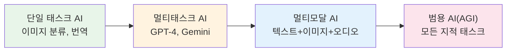
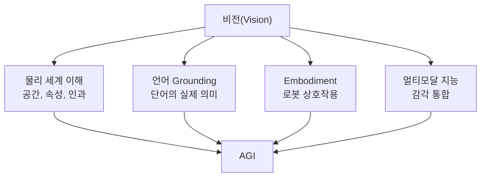
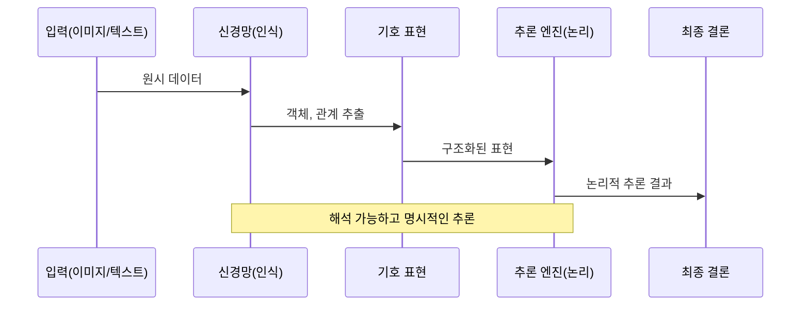
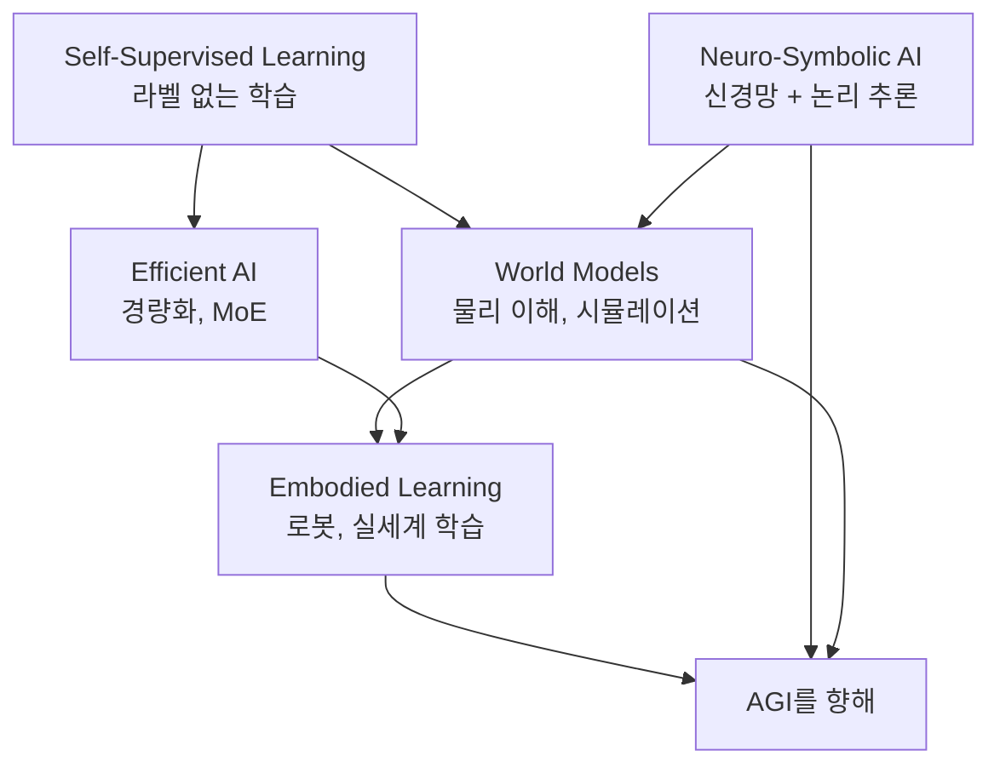
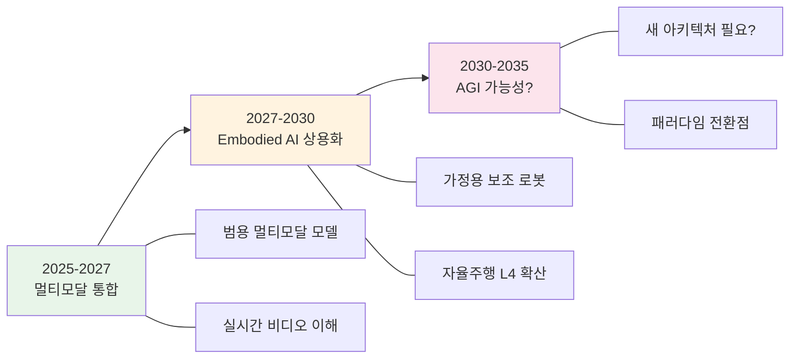

# 미래 연구 방향

> AGI를 향한 비전 기술

## 개요

이 섹션에서는 컴퓨터 비전과 멀티모달 AI의 **미래 방향**을 탐색합니다. AGI(Artificial General Intelligence)로 가는 길에서 비전 기술이 어떤 역할을 하는지, 현재의 한계는 무엇이고 어떻게 극복해 나갈지, 그리고 여러분이 이 여정에 어떻게 참여할 수 있는지 이야기합니다.

**선수 지식**:
- 이 튜토리얼의 전반적인 내용
- AI/ML의 기본 동향에 대한 관심

**학습 목표**:
- 컴퓨터 비전의 현재 한계와 미해결 문제 파악하기
- AGI 연구에서 비전의 역할 이해하기
- 앞으로 주목해야 할 연구 방향 알아보기

## 현재 AI의 위치

> 💡 **비유**: 현재 AI는 **전문 분야에서 뛰어난 전문가**와 같습니다. 바둑 AI는 세계 챔피언을 이기고, GPT는 글을 잘 쓰고, DALL-E는 그림을 잘 그립니다. 하지만 "바둑도 두고 요리도 하고 대화도 나누는" **팔방미인 일반인**은 아직 없습니다.

**2025년 현재 AI 능력 스펙트럼:**

| 태스크 | AI 수준 | 비고 |
|--------|---------|------|
| 이미지 분류 | 인간 초월 | ImageNet 99%+ |
| 객체 탐지 | 인간 수준 | 특정 도메인 |
| 이미지 생성 | 인간 수준 | 창의성은 논쟁 |
| 시각적 추론 | 인간 이하 | 70-80% 수준 |
| 상식 추론 | 인간 이하 | 환각 문제 |
| 물리 이해 | 인간 이하 | 근사적 이해 |
| 범용 문제 해결 | 아직 없음 | AGI 영역 |

> 📊 **그림 1**: Narrow AI에서 AGI로의 발전 스펙트럼




## 핵심 개념

### 개념 1: AGI란 무엇인가?

**AGI (Artificial General Intelligence)**의 정의는 연구자마다 다르지만, 대체로 다음을 의미합니다:

> 인간이 할 수 있는 **모든 지적 태스크**를 수행할 수 있는 AI 시스템

**Narrow AI vs AGI:**

| Narrow AI (현재) | AGI (목표) |
|------------------|-----------|
| 단일 태스크 전문 | 범용 문제 해결 |
| 학습 데이터 필요 | 적은 데이터로 학습 |
| 전이 어려움 | 지식 전이 용이 |
| 환경 변화에 취약 | 새 환경 적응 |

**AGI 타임라인 예측 (2025년 기준):**

전문가들의 예측은 극명하게 갈립니다:
- **낙관론**: 2026-2030 (일부 기업 CEO)
- **중립**: 2030-2040 (다수 연구자)
- **비관론**: 2050+ 또는 불가능

> ⚠️ **주의**: AGI 타임라인 예측은 **극도로 불확실**합니다. 2020년에는 2030년 이후로 예측했던 것이 2024년에는 5년 내로 앞당겨지기도 했습니다.

### 개념 2: 비전이 AGI에서 중요한 이유

> 💡 **비유**: 인간 뇌의 약 30%가 시각 정보 처리에 관여합니다. 눈이 없는 지능을 상상하기 어렵듯, AGI도 시각 없이는 불완전합니다.

**비전이 필수적인 이유:**

1. **물리 세계 이해의 기반**
   - 공간 관계, 물체 속성 파악
   - 인과 관계 추론의 단서

2. **언어의 grounding**
   - "사과"라는 단어의 실제 의미
   - 추상 개념의 구체화

3. **Embodiment의 필수 요소**
   - 로봇이 세상과 상호작용하려면 먼저 "봐야" 함
   - 행동의 결과를 인식

4. **멀티모달 지능의 핵심**
   - 인간 지능은 본질적으로 멀티모달
   - 시각은 가장 정보량이 많은 감각

> 📊 **그림 2**: AGI에서 비전의 역할 — 네 가지 핵심 축




### 개념 3: 현재의 주요 한계

**1. Visual Reasoning의 한계**

현재 VLM도 간단한 시각적 추론에서 실패합니다:

```
Q: 이 그림에서 빨간 공이 파란 상자 위에 있나요?
A: (잘못된 대답 빈번)
```

**원인:**
- 관계 추론 능력 부족
- 공간 이해의 한계
- 속성 바인딩 실패 (어떤 색이 어떤 물체인지)

**2. Compositionality 문제**

"빨간 사과를 들고 있는 파란 셔츠의 사람" 같은 복합 개념 처리 어려움:
- 속성 조합의 폭발적 증가
- 학습 데이터의 편향

**3. Out-of-Distribution 일반화**

학습 분포 밖의 상황에서 급격한 성능 저하:
- 새로운 스타일의 이미지
- 비일상적 구도
- 희귀한 조합

**4. 환각(Hallucination)**

존재하지 않는 객체를 "보거나" 잘못된 설명 생성:
- VLM의 고질적 문제
- 신뢰성 저하

**5. 효율성**

- 현재 모델들은 인간 뇌 대비 **1000배 이상 에너지** 소모
- 학습에 막대한 데이터와 컴퓨팅 필요

### 개념 4: 유망한 연구 방향

**1. World Models의 발전**

[앞서 배운](./02-world-models.md) World Models의 다음 단계:
- **물리 법칙 내재화**: 통계적 패턴 → 진정한 물리 이해
- **상호작용 가능한 시뮬레이션**: 행동→결과 예측
- **장기 계획**: 수백 스텝 앞 예측

**2. Neuro-Symbolic AI**

신경망 + 기호적 추론의 결합:

```
입력 → [신경망: 인식] → 기호 표현 → [추론 엔진: 논리] → 결론
```

- **장점**: 해석 가능성, 명시적 추론
- **과제**: 두 패러다임 통합

> 📊 **그림 4**: Neuro-Symbolic AI 처리 파이프라인




**3. Self-Supervised Learning의 진화**

라벨 없이 학습하는 방법의 발전:
- **V-JEPA (Meta)**: 예측 기반 표현 학습
- **DINOv2**: 자기 지도 비전 백본
- **다음 단계**: 멀티모달 자기 지도 학습

**4. Efficient AI**

더 작고 빠른 모델:
- **지식 증류**: 대형→소형 모델 전이
- **혼합 전문가(MoE)**: 필요한 부분만 활성화
- **뉴로모픽 칩**: 뇌 모방 하드웨어

**5. Embodied Learning**

실제 세계에서 학습:
- **로봇 사전학습**: 시뮬레이션 + 실제 데이터
- **Human-in-the-loop**: 사람 피드백 통합
- **Continual Learning**: 배포 후에도 계속 학습

> 📊 **그림 3**: 5대 유망 연구 방향과 상호 관계




### 개념 5: 미해결 근본 문제

**1. Consciousness(의식) 문제**

AI가 진짜 "이해"하는가, 아니면 패턴 매칭인가?
- 철학적 문제이지만 실용적 함의
- "중국어 방" 논쟁의 현대 버전

**2. Alignment(정렬) 문제**

AI의 목표를 인간의 의도와 일치시키기:
- 강력해질수록 중요해지는 문제
- 비전 분야: 생성 AI의 유해 콘텐츠 방지

**3. 일반화의 본질**

왜 어떤 모델은 잘 일반화하고 어떤 것은 못 하는가?
- 이론적 이해 부족
- 스케일링 법칙의 한계

**4. 데이터 효율성**

인간은 몇 번 보면 학습, AI는 수백만 샘플 필요:
- Few-shot/Zero-shot의 한계
- 메타 학습의 가능성

### 개념 6: CV 실무자를 위한 조언

**1. 기초를 튼튼히**

이 튜토리얼에서 배운 내용이 여전히 핵심:
- CNN, Transformer 이해
- 손실 함수, 최적화
- 평가 메트릭

**2. 최신 트렌드 따라가기**

빠르게 변하는 분야에서 생존하려면:
- arXiv, Papers with Code 주기적 확인
- 주요 컨퍼런스: CVPR, ICCV, NeurIPS, ICML
- 커뮤니티: Hugging Face, X(Twitter), Reddit r/MachineLearning

**3. 실습 중심**

논문만 읽지 말고 직접 구현:
- 오픈소스 모델 fine-tuning
- 개인 프로젝트로 포트폴리오 구축
- Kaggle 등 경진대회 참가

**4. 다학제적 시야**

CV만 알아서는 부족:
- NLP, RL, 로보틱스 기초
- 인지과학, 신경과학 관심
- 윤리, 사회적 영향 고려

## 앞으로 10년의 예측

> ⚠️ **면책**: 이 예측은 개인적 견해이며, AI 분야의 급변으로 언제든 틀릴 수 있습니다.

**2025-2027: 멀티모달 통합 시대**
- GPT-5/6 수준의 범용 멀티모달 모델 등장
- 실시간 비디오 이해 및 생성 보편화
- 가정용 AI 비서 초기 형태

**2027-2030: Embodied AI 상용화**
- 가정용 보조 로봇 초기 시장
- 자율주행 Level 4 광범위 배포
- World Models 기반 시뮬레이터 표준화

**2030-2035: AGI?**
- 가장 불확실한 구간
- 현재 패러다임의 한계 도달 가능성
- 새로운 아키텍처 돌파구 필요할 수 있음

> 📊 **그림 5**: 앞으로 10년의 AI 로드맵




## 이 튜토리얼을 마치며

**축하합니다!**

19개 챕터, 93개 섹션에 걸쳐 **픽셀의 이해부터 멀티모달 AI의 최전선**까지 함께 여행했습니다.

**배운 것들:**
- 이미지가 무엇인지, 어떻게 처리하는지
- CNN에서 Transformer로의 진화
- 객체 탐지, 세그멘테이션의 원리
- 생성 AI: VAE, GAN, Diffusion
- Stable Diffusion과 실전 활용
- 3D 비전: NeRF, 3D Gaussian Splatting
- 멀티모달 AI와 미래 방향

**다음 단계:**

1. **실전 프로젝트** 진행하기
2. **논문 읽기** 습관 들이기
3. **오픈소스 기여** 시작하기
4. **커뮤니티** 참여하기

> 💡 "배움의 끝은 없고, 실천의 시작만 있을 뿐입니다."

## 핵심 정리

| 개념 | 설명 |
|------|------|
| AGI | 인간 수준의 범용 지능을 가진 AI |
| Visual Reasoning | 시각 정보 기반 논리적 추론 능력 |
| Compositionality | 복합 개념을 이해하고 생성하는 능력 |
| Neuro-Symbolic | 신경망 + 기호적 추론의 융합 |
| Alignment | AI 목표를 인간 의도와 일치시키기 |

## 앞으로의 여정

이 튜토리얼은 끝이지만, 여러분의 CV/AI 여정은 이제 시작입니다.

**다음 Chapter 19**에서는 [배포와 최적화](../19-deployment/01-model-optimization.md)를 다룹니다. 모델을 실제 서비스로 만들기 위한 **양자화, TensorRT, 엣지 배포, MLOps**까지 실무 기술을 배웁니다.

**계속 배우고, 만들고, 공유하세요!**

## 참고 자료

- [AGI Timeline Predictions](https://research.aimultiple.com/artificial-general-intelligence-singularity-timing/) - 전문가 예측 종합
- [80,000 Hours AGI Analysis](https://80000hours.org/2025/03/when-do-experts-expect-agi-to-arrive/) - 심층 분석
- [Levels of AGI (DeepMind)](https://arxiv.org/abs/2311.02462) - AGI 수준 정의 시도
- [Nature: AI Intelligence Assessment](https://www.nature.com/articles/d41586-026-00285-6) - AI 능력 평가
- [CVPR 2024/2025 Best Papers](https://cvpr.thecvf.com/) - 최신 연구 동향
- [Papers with Code](https://paperswithcode.com/) - 최신 벤치마크와 코드
- [Anthropic: Core Views on AI Safety](https://www.anthropic.com/research) - AI 안전 연구
