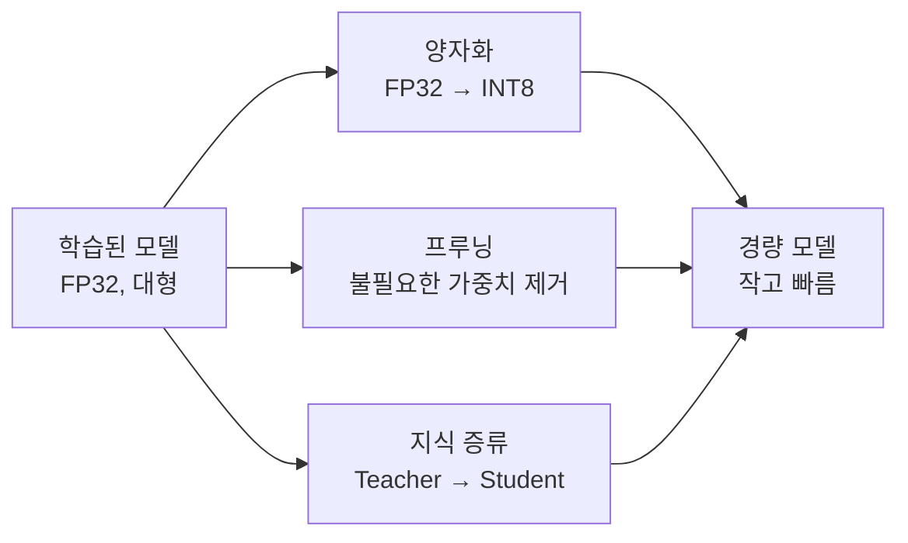
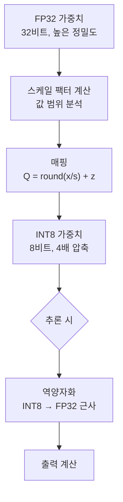
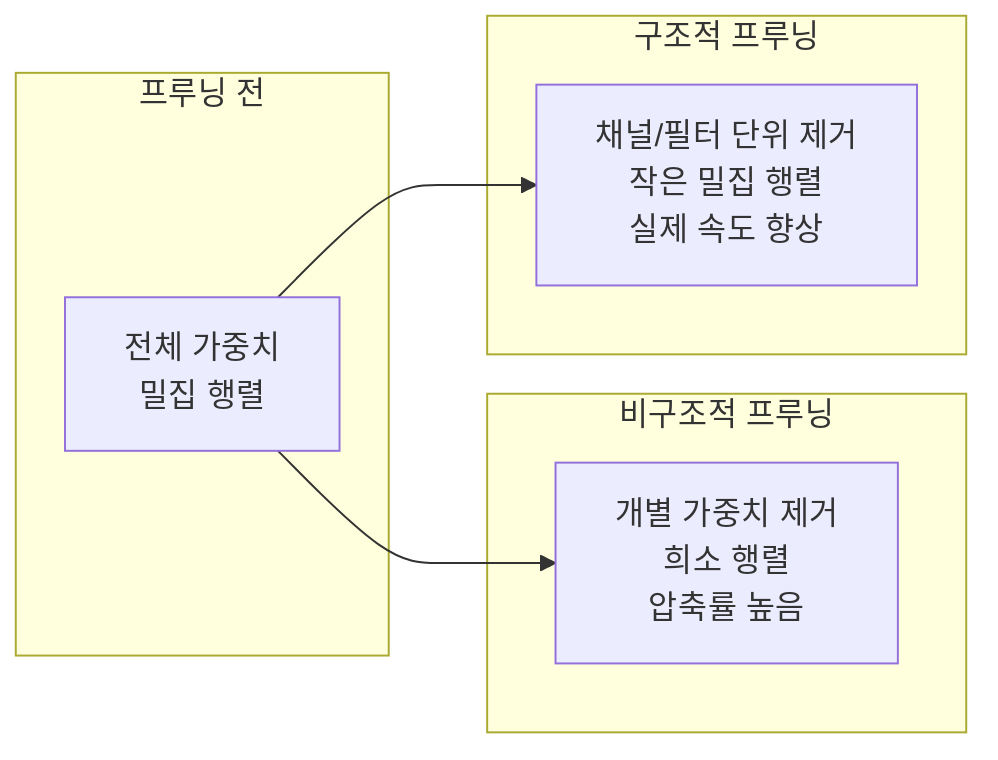
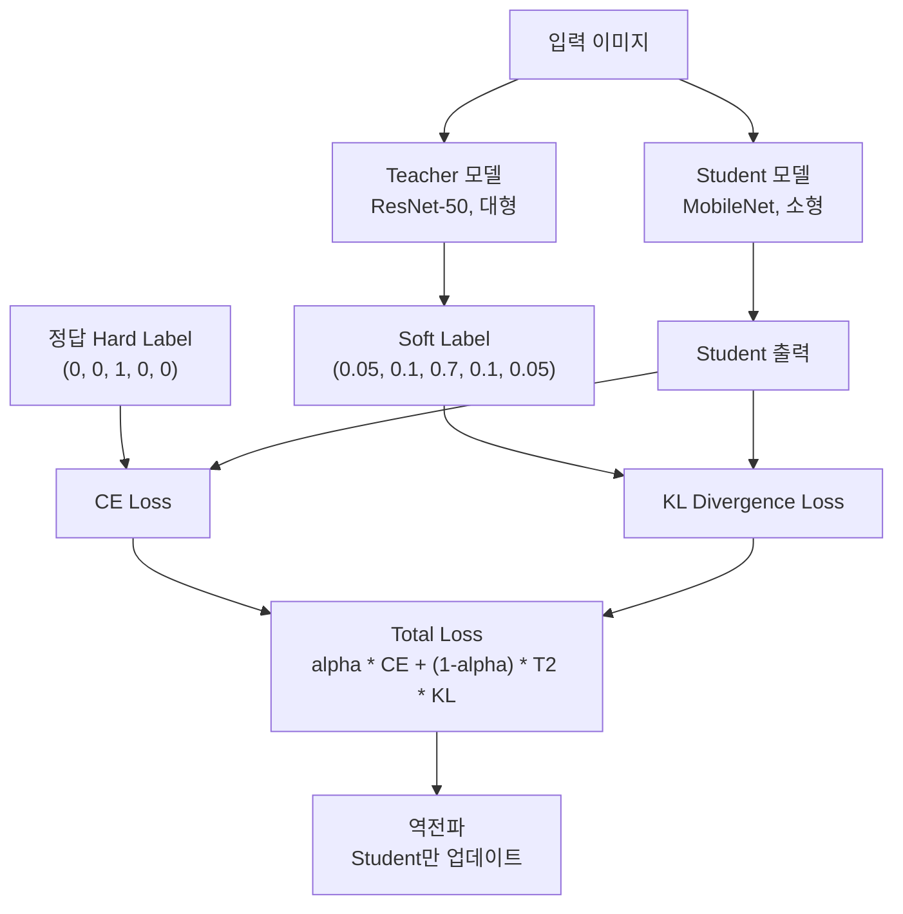
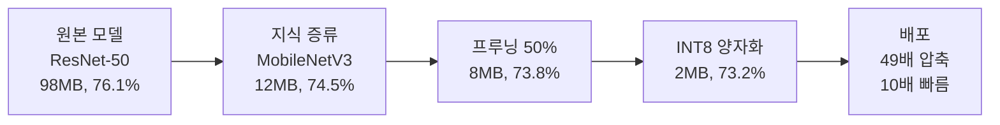

# 모델 최적화

> 양자화, 프루닝, 지식 증류

## 개요

지금까지 우리는 강력한 비전 모델들을 학습하고 평가하는 방법을 배웠습니다. 하지만 실제 서비스에서는 **정확도만큼 속도와 비용도 중요**합니다. 이 섹션에서는 학습된 모델을 더 작고, 더 빠르게 만드는 세 가지 핵심 기술—**양자화(Quantization)**, **프루닝(Pruning)**, **지식 증류(Knowledge Distillation)**—을 배웁니다.

**선수 지식**:
- [CNN 기초](../04-cnn-fundamentals/01-convolution.md)
- [모델 학습과 평가](../06-image-classification/03-training.md)

**학습 목표**:
- 모델 압축의 필요성과 세 가지 주요 기법 이해하기
- PyTorch에서 양자화, 프루닝 직접 구현하기
- 지식 증류로 작은 모델 학습시키기

## 왜 알아야 할까?

> 💡 **비유**: 여행 가방을 싸는 것과 같습니다. 큰 캐리어에 모든 짐을 넣으면 편하지만, 기내 수하물만 들고 가야 한다면? 꼭 필요한 것만 **압축해서 포장**해야 합니다. 모델도 마찬가지로, 서버에서는 큰 모델을 돌릴 수 있지만 스마트폰이나 IoT 기기에서는 **작고 가벼운 모델**이 필수입니다.

실제 현업에서 모델 최적화가 필수인 이유:

| 배포 환경 | 제약 조건 | 최적화 필요성 |
|-----------|-----------|---------------|
| 모바일 앱 | 앱 크기 100MB 제한, 배터리 | 모델 크기 ↓, 연산량 ↓ |
| 엣지 디바이스 | RAM 2-8GB, GPU 없음 | INT8 양자화 필수 |
| 클라우드 서버 | GPU 비용 $2-4/시간 | 처리량 ↑, 비용 ↓ |
| 실시간 서비스 | 지연 시간 < 50ms | 추론 속도 최적화 |

ResNet-50 하나를 예로 들면:
- **원본**: 98MB, FP32, 4.1G FLOPs
- **최적화 후**: 24MB, INT8, 1.0G FLOPs (4배 작고, 2-4배 빠름)

## 핵심 개념

> 📊 **그림 1**: 모델 최적화 세 가지 기법 개관




### 개념 1: 양자화(Quantization)

> 💡 **비유**: 사진의 색상 수를 줄이는 것과 같습니다. 24비트 컬러(1600만 색)를 8비트(256색)로 줄이면 파일 크기가 확 줄지만, 눈에는 비슷해 보이죠. 마찬가지로 32비트 부동소수점 가중치를 8비트 정수로 바꾸면 모델이 4배 작아집니다.

**양자화의 핵심 아이디어:**

> 📊 **그림 2**: 양자화 과정 — FP32에서 INT8로의 변환 흐름




일반적인 딥러닝 모델은 가중치를 **FP32(32비트 부동소수점)**로 저장합니다. 하지만 대부분의 가중치는 -1~1 사이의 작은 값이므로, 이를 **INT8(8비트 정수)**로 표현해도 정확도 손실이 미미합니다.

**수식**:
$$Q(x) = \text{round}\left(\frac{x}{s}\right) + z$$

- $x$: 원본 FP32 값
- $s$: 스케일 팩터 (값의 범위를 조절)
- $z$: 제로 포인트 (0의 위치 조정)
- $Q(x)$: 양자화된 정수 값

**양자화의 종류:**

| 방식 | 설명 | 정확도 손실 | 구현 난이도 |
|------|------|------------|------------|
| **Post-Training Quantization (PTQ)** | 학습 후 바로 양자화 | 중간 | 쉬움 |
| **Quantization-Aware Training (QAT)** | 학습 중 양자화 시뮬레이션 | 낮음 | 중간 |
| **Dynamic Quantization** | 추론 시 동적으로 양자화 | 중간 | 매우 쉬움 |

```python
import torch
import torch.nn as nn
from torchvision import models

# 1. 동적 양자화 (가장 간단)
# 추론 시 가중치만 양자화, 입력은 FP32 유지
model = models.resnet18(pretrained=True)
model.eval()

# Linear 레이어에 동적 양자화 적용
quantized_model = torch.quantization.quantize_dynamic(
    model,
    {nn.Linear},  # 양자화할 레이어 타입
    dtype=torch.qint8  # INT8로 변환
)

# 모델 크기 비교
import os
torch.save(model.state_dict(), 'original.pth')
torch.save(quantized_model.state_dict(), 'quantized.pth')
print(f"원본 크기: {os.path.getsize('original.pth') / 1e6:.1f} MB")
print(f"양자화 후: {os.path.getsize('quantized.pth') / 1e6:.1f} MB")
# 원본 크기: 44.7 MB
# 양자화 후: 11.3 MB (약 4배 감소!)
```

```python
# 2. 정적 양자화 (PTQ) - 더 정교한 방법
import torch.quantization as quant

# 양자화 설정
model = models.resnet18(pretrained=True)
model.eval()

# 퓨즈: Conv-BN-ReLU를 하나로 합침 (속도 향상)
model_fused = torch.quantization.fuse_modules(
    model,
    [['conv1', 'bn1', 'relu']],
    inplace=False
)

# 양자화 준비
model_fused.qconfig = quant.get_default_qconfig('x86')  # CPU용
model_prepared = quant.prepare(model_fused)

# 캘리브레이션: 대표 데이터로 스케일 결정
calibration_data = torch.randn(100, 3, 224, 224)  # 실제로는 validation 데이터 사용
with torch.no_grad():
    for i in range(10):
        model_prepared(calibration_data[i*10:(i+1)*10])

# 양자화 수행
model_quantized = quant.convert(model_prepared)
print("정적 양자화 완료!")
```

> ⚠️ **흔한 오해**: "양자화하면 정확도가 크게 떨어진다" — 실제로 잘 된 양자화는 **1% 미만**의 정확도 손실만 발생합니다. 특히 QAT를 사용하면 거의 손실 없이 4배 압축이 가능합니다.

### 개념 2: 프루닝(Pruning)

> 💡 **비유**: 나무 가지치기와 같습니다. 건강한 나무는 모든 가지가 필요하지 않아요. 죽은 가지나 약한 가지를 잘라내면 나무가 더 건강해지고, 남은 가지로 더 많은 열매를 맺습니다. 신경망도 **쓸모없는 연결(작은 가중치)**을 잘라내면 더 효율적으로 동작합니다.

> 📊 **그림 3**: 비구조적 프루닝 vs 구조적 프루닝 비교




**프루닝의 핵심 아이디어:**

신경망의 많은 가중치는 0에 가까운 값으로, 출력에 거의 기여하지 않습니다. 이런 **"게으른" 가중치**를 0으로 만들거나 아예 제거하면 모델이 가벼워집니다.

**프루닝의 종류:**

| 방식 | 설명 | 압축률 | 하드웨어 효율 |
|------|------|--------|-------------|
| **비구조적(Unstructured)** | 개별 가중치 제거 | 높음 (90%+) | 낮음 |
| **구조적(Structured)** | 필터/채널 단위 제거 | 중간 (50-70%) | 높음 |

```python
import torch
import torch.nn.utils.prune as prune
from torchvision import models

# 모델 준비
model = models.resnet18(pretrained=True)

# 1. 비구조적 프루닝: 가장 작은 가중치 30% 제거
conv1 = model.conv1
prune.l1_unstructured(conv1, name='weight', amount=0.3)

# 프루닝 결과 확인
print(f"프루닝 마스크 모양: {conv1.weight_mask.shape}")
print(f"0인 가중치 비율: {(conv1.weight_mask == 0).float().mean():.1%}")
# 0인 가중치 비율: 30.0%

# 프루닝을 영구적으로 적용
prune.remove(conv1, 'weight')
```

```python
# 2. 전체 모델에 글로벌 프루닝 적용
model = models.resnet18(pretrained=True)

# 프루닝할 레이어와 파라미터 지정
parameters_to_prune = [
    (model.layer1[0].conv1, 'weight'),
    (model.layer1[0].conv2, 'weight'),
    (model.layer2[0].conv1, 'weight'),
    (model.layer2[0].conv2, 'weight'),
]

# 글로벌 L1 프루닝: 전체에서 가장 작은 50% 제거
prune.global_unstructured(
    parameters_to_prune,
    pruning_method=prune.L1Unstructured,
    amount=0.5,  # 50% 프루닝
)

# 희소성(Sparsity) 확인
def compute_sparsity(model):
    total_zeros = 0
    total_params = 0
    for name, param in model.named_parameters():
        if 'weight' in name:
            total_zeros += (param == 0).sum().item()
            total_params += param.numel()
    return total_zeros / total_params

print(f"모델 희소성: {compute_sparsity(model):.1%}")
# 모델 희소성: 약 50%
```

```python
# 3. 구조적 프루닝: 채널 단위 제거 (실제 속도 향상)
def structured_pruning(model, amount=0.3):
    """Ln 노름 기반 채널 프루닝"""
    for name, module in model.named_modules():
        if isinstance(module, torch.nn.Conv2d):
            prune.ln_structured(
                module,
                name='weight',
                amount=amount,
                n=2,  # L2 노름 사용
                dim=0  # 출력 채널 방향으로 프루닝
            )
    return model

model_pruned = structured_pruning(model, amount=0.3)
print("구조적 프루닝 완료!")
```

> 🔥 **실무 팁**: 비구조적 프루닝은 90%까지 압축해도 정확도가 유지되지만, **실제 속도 향상**을 위해서는 구조적 프루닝이 필요합니다. 대부분의 하드웨어는 희소 연산을 효율적으로 처리하지 못하기 때문입니다.

### 개념 3: 지식 증류(Knowledge Distillation)

> 💡 **비유**: 숙련된 **장인(Teacher)**이 **견습생(Student)**에게 기술을 전수하는 것과 같습니다. 견습생은 장인의 모든 경험을 가질 수 없지만, 핵심 노하우를 배워 80%의 실력을 빠르게 얻을 수 있죠. 작은 모델(Student)이 큰 모델(Teacher)의 "지식"을 배워 비슷한 성능을 내는 것입니다.

> 📊 **그림 4**: 지식 증류 아키텍처 — Teacher에서 Student로의 지식 전달




**지식 증류의 핵심 아이디어:**

일반적인 학습은 **하드 라벨(hard label)** — [0, 0, 1, 0, 0] 같은 원-핫 벡터 — 을 사용합니다. 하지만 Teacher 모델의 **소프트 라벨(soft label)** — [0.05, 0.1, 0.7, 0.1, 0.05] — 에는 클래스 간 관계 정보가 담겨 있습니다. "고양이"와 "강아지"가 비슷하고 "자동차"와는 다르다는 정보죠.

**손실 함수**:
$$L = \alpha \cdot L_{CE}(y_{student}, y_{true}) + (1-\alpha) \cdot T^2 \cdot L_{KL}(y_{student}^{(T)}, y_{teacher}^{(T)})$$

- $L_{CE}$: 정답과의 Cross-Entropy Loss
- $L_{KL}$: Teacher와의 KL Divergence Loss
- $T$: Temperature (소프트닝 정도, 보통 3-20)
- $\alpha$: 두 손실의 균형 (보통 0.1-0.5)

```python
import torch
import torch.nn as nn
import torch.nn.functional as F
from torchvision import models

class KnowledgeDistillation:
    def __init__(self, teacher, student, temperature=4.0, alpha=0.3):
        """
        Args:
            teacher: 큰 사전학습 모델 (예: ResNet-50)
            student: 작은 모델 (예: ResNet-18 또는 MobileNet)
            temperature: 소프트 라벨 온도 (높을수록 부드러움)
            alpha: hard label 손실 비중 (1-alpha가 soft label 비중)
        """
        self.teacher = teacher.eval()  # Teacher는 고정
        self.student = student
        self.temperature = temperature
        self.alpha = alpha

    def distillation_loss(self, student_logits, teacher_logits, labels):
        """증류 손실 계산"""
        # 1. Hard Label Loss: 정답과의 CE Loss
        hard_loss = F.cross_entropy(student_logits, labels)

        # 2. Soft Label Loss: Teacher의 소프트 출력과의 KL Divergence
        # Temperature로 나눠서 분포를 부드럽게 만듦
        soft_student = F.log_softmax(student_logits / self.temperature, dim=1)
        soft_teacher = F.softmax(teacher_logits / self.temperature, dim=1)
        soft_loss = F.kl_div(soft_student, soft_teacher, reduction='batchmean')

        # Temperature^2를 곱해서 그래디언트 스케일 보정
        soft_loss = soft_loss * (self.temperature ** 2)

        # 최종 손실: 두 손실의 가중 합
        total_loss = self.alpha * hard_loss + (1 - self.alpha) * soft_loss
        return total_loss, hard_loss.item(), soft_loss.item()

# 사용 예시
teacher = models.resnet50(pretrained=True)  # 큰 모델
student = models.resnet18(pretrained=False)  # 작은 모델

# 분류 헤드 맞추기 (예: CIFAR-10)
num_classes = 10
teacher.fc = nn.Linear(teacher.fc.in_features, num_classes)
student.fc = nn.Linear(student.fc.in_features, num_classes)

kd = KnowledgeDistillation(teacher, student, temperature=4.0, alpha=0.3)
```

```python
# 전체 학습 루프
def train_with_distillation(kd, train_loader, epochs=10, lr=0.001):
    """지식 증류로 Student 모델 학습"""
    optimizer = torch.optim.Adam(kd.student.parameters(), lr=lr)
    device = torch.device('cuda' if torch.cuda.is_available() else 'cpu')

    kd.teacher.to(device)
    kd.student.to(device)

    for epoch in range(epochs):
        kd.student.train()
        total_loss = 0
        correct = 0
        total = 0

        for images, labels in train_loader:
            images, labels = images.to(device), labels.to(device)

            # Teacher의 예측 (그래디언트 계산 X)
            with torch.no_grad():
                teacher_logits = kd.teacher(images)

            # Student의 예측
            student_logits = kd.student(images)

            # 증류 손실 계산
            loss, hard_l, soft_l = kd.distillation_loss(
                student_logits, teacher_logits, labels
            )

            # 역전파
            optimizer.zero_grad()
            loss.backward()
            optimizer.step()

            total_loss += loss.item()
            _, predicted = student_logits.max(1)
            total += labels.size(0)
            correct += predicted.eq(labels).sum().item()

        acc = 100. * correct / total
        print(f"Epoch {epoch+1}: Loss={total_loss/len(train_loader):.4f}, Acc={acc:.2f}%")

    return kd.student

# 학습 실행 (데이터로더 필요)
# trained_student = train_with_distillation(kd, train_loader)
```

> 💡 **알고 계셨나요?**: 지식 증류는 2015년 Hinton의 논문 "Distilling the Knowledge in a Neural Network"에서 처음 제안되었습니다. 재미있게도, 이 아이디어는 Hinton이 "dark knowledge(암묵지)"라고 부른 Teacher의 소프트 출력에서 학습 가능한 정보가 훨씬 많다는 통찰에서 시작되었습니다.

### 개념 4: 세 기법의 조합

실무에서는 세 기법을 **함께 사용**하는 경우가 많습니다.

> 📊 **그림 5**: 세 기법 조합 최적화 파이프라인




**최적화 파이프라인 예시:**

1. **지식 증류**: ResNet-50 → MobileNetV3 (모델 축소)
2. **프루닝**: 50% 구조적 프루닝 (연산량 감소)
3. **양자화**: INT8 변환 (메모리 4배 감소)

| 단계 | 모델 크기 | 정확도 | 추론 시간 |
|------|-----------|--------|-----------|
| 원본 (ResNet-50) | 98 MB | 76.1% | 50 ms |
| 증류 (MobileNetV3) | 12 MB | 74.5% | 15 ms |
| +프루닝 (50%) | 8 MB | 73.8% | 10 ms |
| +양자화 (INT8) | 2 MB | 73.2% | 5 ms |

**최종 결과**: 98 MB → 2 MB (49배 압축), 50 ms → 5 ms (10배 빠름), 정확도 손실 3% 미만

```python
# 세 기법 조합 파이프라인
def full_optimization_pipeline(teacher_model, calibration_loader):
    """
    1. 지식 증류
    2. 프루닝
    3. 양자화
    """
    from torchvision import models
    import torch.nn.utils.prune as prune
    import torch.quantization as quant

    # 1단계: 지식 증류 (Student 모델 학습)
    print("1단계: 지식 증류 시작...")
    student = models.mobilenet_v3_small(pretrained=False)
    # ... 증류 학습 수행 (위의 코드 참조)

    # 2단계: 구조적 프루닝
    print("2단계: 프루닝 적용...")
    for name, module in student.named_modules():
        if isinstance(module, nn.Conv2d):
            prune.ln_structured(module, 'weight', amount=0.3, n=2, dim=0)
            prune.remove(module, 'weight')

    # 3단계: 양자화
    print("3단계: 양자화 적용...")
    student.eval()
    student.qconfig = quant.get_default_qconfig('qnnpack')  # 모바일용
    student_prepared = quant.prepare(student)

    # 캘리브레이션
    with torch.no_grad():
        for images, _ in calibration_loader:
            student_prepared(images)

    optimized_model = quant.convert(student_prepared)
    print("최적화 완료!")

    return optimized_model
```

## 더 깊이 알아보기: NVIDIA Model Optimizer

2025년 12월, NVIDIA는 **TensorRT Model Optimizer**를 **NVIDIA Model Optimizer**로 확장 리브랜딩했습니다. 이 도구는 양자화, 프루닝, 지식 증류를 통합하여 TensorRT, TensorRT-LLM, vLLM 등 다양한 배포 프레임워크를 위한 최적화를 지원합니다.

```python
# NVIDIA Model Optimizer 사용 예시 (개념적)
# pip install nvidia-modelopt

# import modelopt as mo
#
# # PTQ 양자화
# quantized_model = mo.torch.quantize(
#     model,
#     config=mo.torch.QuantConfig(precision="int8"),
#     calibration_data=calibration_loader
# )
#
# # 스파시티 적용
# sparse_model = mo.torch.sparsify(
#     model,
#     config=mo.torch.SparseConfig(sparsity=0.5)
# )
```

## 핵심 정리

| 기법 | 원리 | 압축률 | 정확도 손실 | 난이도 |
|------|------|--------|------------|--------|
| **양자화** | FP32 → INT8 변환 | 4배 | 0.5-1% | 쉬움 |
| **프루닝** | 작은 가중치 제거 | 2-10배 | 1-3% | 중간 |
| **지식 증류** | 큰 모델 → 작은 모델 | 가변 | 1-5% | 중간 |
| **조합** | 세 기법 통합 | 10-50배 | 2-5% | 높음 |

## 다음 섹션 미리보기

모델을 최적화했다면, 이제 **더 빠른 추론 엔진**으로 변환할 차례입니다. 다음 섹션 [ONNX와 TensorRT](./02-onnx-tensorrt.md)에서는 PyTorch 모델을 ONNX 포맷으로 변환하고, NVIDIA TensorRT로 최적화하여 **2-5배 추가 속도 향상**을 얻는 방법을 배웁니다.

## 참고 자료

- [PyTorch Knowledge Distillation Tutorial](https://docs.pytorch.org/tutorials/beginner/knowledge_distillation_tutorial.html) - 공식 지식 증류 튜토리얼
- [Model Compression: Quantization, Pruning, Distillation](https://towardsdatascience.com/model-compression-make-your-machine-learning-models-lighter-and-faster/) - 세 기법 종합 설명
- [NVIDIA Model Optimizer](https://github.com/NVIDIA/Model-Optimizer) - NVIDIA 공식 최적화 도구
- [Deepgram: Model Pruning, Distillation, and Quantization](https://deepgram.com/learn/model-pruning-distillation-and-quantization-part-1) - 실무 관점 해설
- [AI Model Optimization 2025](https://aether-nexus.vercel.app/blog/ai-model-optimization-2025) - 최신 트렌드
