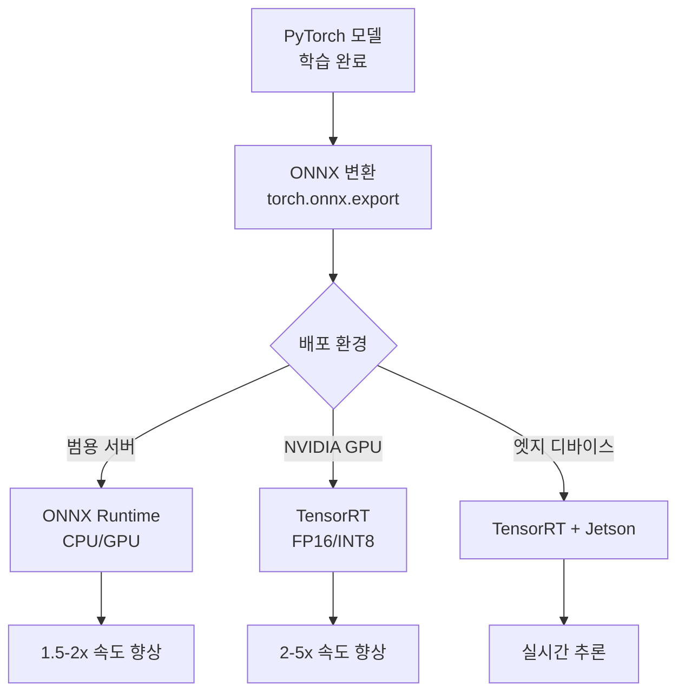
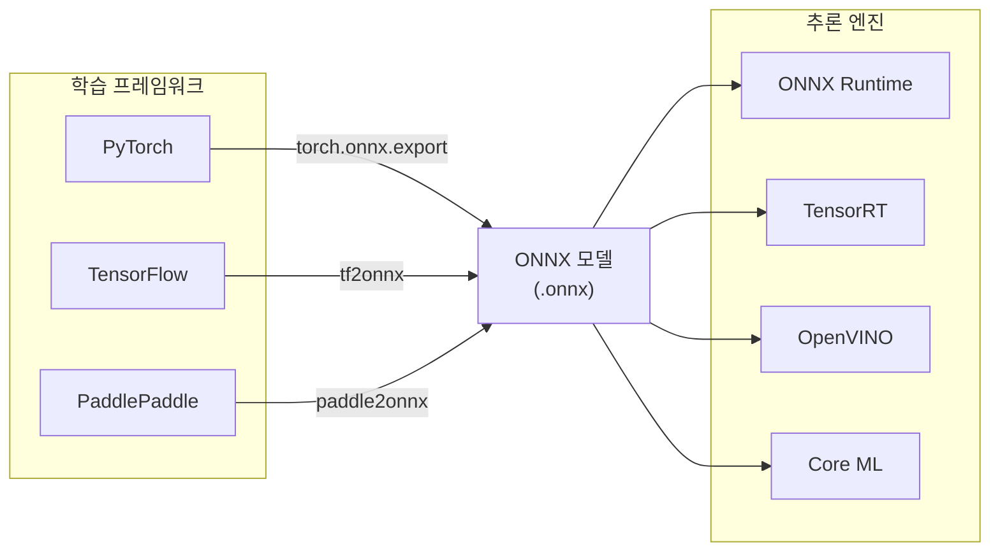
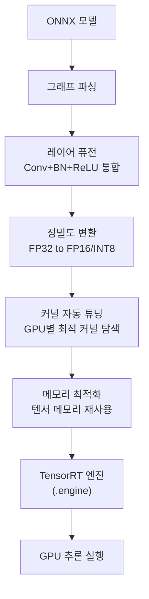
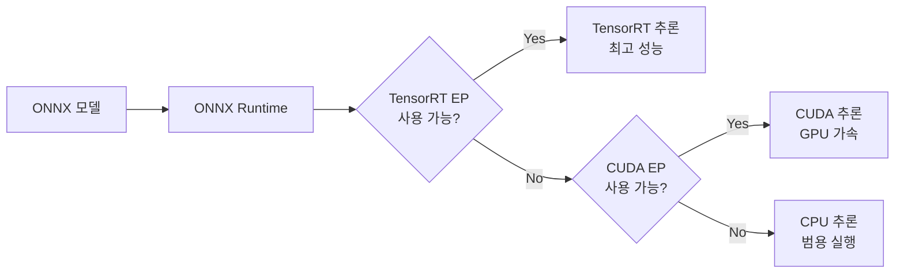
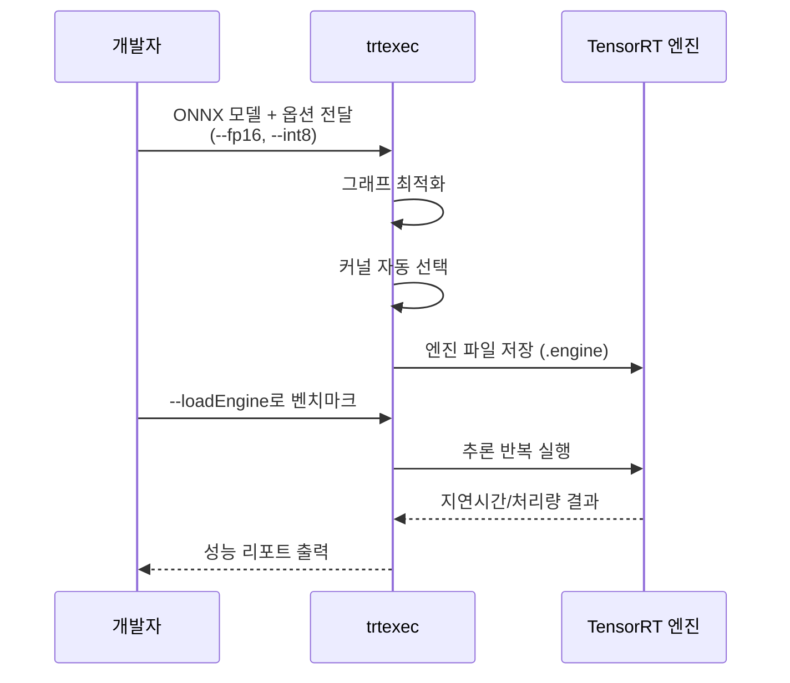

# ONNX와 TensorRT

> 추론 가속화

## 개요

[이전 섹션](./01-model-optimization.md)에서 모델을 압축하는 방법을 배웠습니다. 하지만 PyTorch로 학습한 모델은 **PyTorch 런타임**에서만 실행됩니다. 실제 배포 환경에서는 더 빠르고 효율적인 **추론 전용 엔진**이 필요합니다. 이 섹션에서는 **ONNX**로 프레임워크 간 호환성을 확보하고, **TensorRT**로 NVIDIA GPU에서 최대 성능을 끌어내는 방법을 배웁니다.

**선수 지식**:
- [모델 최적화](./01-model-optimization.md)
- PyTorch 기본 사용법

**학습 목표**:
- ONNX 포맷의 역할과 모델 변환 방법 이해하기
- TensorRT 최적화 원리와 적용 방법 익히기
- ONNX Runtime과 TensorRT 추론 구현하기

## 왜 알아야 할까?

> 📊 **그림 2**: PyTorch 모델의 배포 최적화 파이프라인




> 💡 **비유**: 영화를 만들 때 **촬영(학습)**과 **상영(추론)**은 다른 장비가 필요합니다. 촬영에는 대형 카메라와 조명 장비가, 상영에는 프로젝터와 스크린이 필요하죠. PyTorch는 촬영 장비(학습), TensorRT는 상영 장비(추론)입니다. 상영관에서 촬영 장비를 쓸 필요가 없듯, 추론에는 **추론 전용 엔진**이 훨씬 효율적입니다.

**PyTorch vs 추론 엔진 비교:**

| 항목 | PyTorch | ONNX Runtime | TensorRT |
|------|---------|--------------|----------|
| **주 용도** | 학습 + 연구 | 범용 추론 | GPU 최적화 추론 |
| **속도** | 기준 (1x) | 1.5-2x | 2-5x |
| **메모리** | 높음 | 중간 | 낮음 |
| **플랫폼** | Python 중심 | 다양 (C++, C#, Java) | NVIDIA GPU 전용 |
| **동적 그래프** | 지원 | 제한적 | 미지원 |

실제 사례: ResNet-50 추론 성능 (NVIDIA V100 GPU)
- PyTorch: 5.2 ms/이미지
- ONNX Runtime: 3.1 ms (1.7배 빠름)
- TensorRT FP16: 1.4 ms (3.7배 빠름)
- TensorRT INT8: 0.8 ms (6.5배 빠름)

## 핵심 개념

### 개념 1: ONNX란?

> 💡 **비유**: ONNX는 **세계 공통어(영어)**와 같습니다. 한국어로 쓴 소설을 일본에서 읽으려면 번역이 필요하죠. 마찬가지로 PyTorch 모델을 TensorFlow나 다른 환경에서 쓰려면 공통 형식이 필요합니다. ONNX가 바로 그 **신경망의 공통어**입니다.

> 📊 **그림 1**: ONNX를 통한 프레임워크 간 모델 호환 구조




**ONNX (Open Neural Network Exchange)**는 Facebook(Meta)과 Microsoft가 2017년에 발표한 오픈 포맷입니다. 다양한 딥러닝 프레임워크 간의 모델 호환성을 제공합니다.

**ONNX 생태계:**

| 구성요소 | 설명 |
|----------|------|
| **ONNX 포맷** | 모델 구조와 가중치를 저장하는 표준 형식 (.onnx) |
| **ONNX Runtime** | Microsoft의 크로스 플랫폼 추론 엔진 |
| **ONNX 연산자** | 150+ 표준 연산자 정의 (Conv, MatMul, ReLU 등) |
| **ONNX 변환기** | 각 프레임워크 → ONNX 변환 도구 |

```python
import torch
import torch.onnx
from torchvision import models

# 1. PyTorch 모델 준비
model = models.resnet18(pretrained=True)
model.eval()

# 더미 입력 (ONNX 변환에 필요)
dummy_input = torch.randn(1, 3, 224, 224)

# 2. ONNX로 내보내기
torch.onnx.export(
    model,                           # 모델
    dummy_input,                     # 예시 입력
    "resnet18.onnx",                 # 저장 경로
    export_params=True,              # 가중치 포함
    opset_version=17,                # ONNX 버전 (최신 권장)
    do_constant_folding=True,        # 상수 폴딩 최적화
    input_names=['input'],           # 입력 이름
    output_names=['output'],         # 출력 이름
    dynamic_axes={                   # 동적 배치 크기 지원
        'input': {0: 'batch_size'},
        'output': {0: 'batch_size'}
    }
)

print("ONNX 모델 저장 완료: resnet18.onnx")
```

```python
# 3. ONNX 모델 검증
import onnx

# 모델 로드
onnx_model = onnx.load("resnet18.onnx")

# 모델 구조 검증
onnx.checker.check_model(onnx_model)
print("ONNX 모델 검증 통과!")

# 모델 정보 확인
print(f"ONNX opset 버전: {onnx_model.opset_import[0].version}")
print(f"입력: {onnx_model.graph.input[0].name}")
print(f"출력: {onnx_model.graph.output[0].name}")
```

> 💡 **알고 계셨나요?**: ONNX의 탄생 배경은 흥미롭습니다. 2017년 당시 PyTorch, TensorFlow, Caffe2 등 프레임워크 간 모델 공유가 불가능해 연구자들이 불편을 겪었습니다. Facebook과 Microsoft가 의기투합해 만든 ONNX는 이제 사실상 업계 표준이 되었고, AWS, Google, NVIDIA 등 모든 주요 기업이 지원합니다.

### 개념 2: ONNX Runtime으로 추론하기

ONNX Runtime은 Microsoft가 개발한 **고성능 추론 엔진**입니다. CPU, GPU, 엣지 디바이스 등 다양한 환경에서 ONNX 모델을 실행할 수 있습니다.

```python
# pip install onnxruntime-gpu  # GPU용
# pip install onnxruntime      # CPU용

import onnxruntime as ort
import numpy as np
from PIL import Image
import torchvision.transforms as transforms

# 1. ONNX Runtime 세션 생성
# GPU 사용 시 CUDAExecutionProvider, CPU는 CPUExecutionProvider
providers = ['CUDAExecutionProvider', 'CPUExecutionProvider']
session = ort.InferenceSession("resnet18.onnx", providers=providers)

# 현재 사용 중인 프로바이더 확인
print(f"사용 중인 프로바이더: {session.get_providers()}")

# 2. 입력/출력 정보 확인
input_info = session.get_inputs()[0]
output_info = session.get_outputs()[0]
print(f"입력: {input_info.name}, 형태: {input_info.shape}, 타입: {input_info.type}")
print(f"출력: {output_info.name}, 형태: {output_info.shape}")
```

```python
# 3. 이미지 전처리 및 추론
def preprocess_image(image_path):
    """ImageNet 전처리"""
    transform = transforms.Compose([
        transforms.Resize(256),
        transforms.CenterCrop(224),
        transforms.ToTensor(),
        transforms.Normalize(
            mean=[0.485, 0.456, 0.406],
            std=[0.229, 0.224, 0.225]
        )
    ])
    image = Image.open(image_path).convert('RGB')
    return transform(image).unsqueeze(0).numpy()  # numpy로 변환

# 추론 실행
input_data = preprocess_image("test_image.jpg")
# 또는 더미 데이터로 테스트
input_data = np.random.randn(1, 3, 224, 224).astype(np.float32)

# ONNX Runtime 추론
outputs = session.run(
    None,  # 모든 출력 반환
    {input_info.name: input_data}
)

# 결과 확인
predictions = outputs[0]
predicted_class = np.argmax(predictions[0])
confidence = np.max(outputs[0][0])
print(f"예측 클래스: {predicted_class}, 신뢰도: {confidence:.4f}")
```

```python
# 4. 배치 추론 및 성능 측정
import time

def benchmark_onnx(session, input_shape, num_iterations=100):
    """ONNX Runtime 성능 벤치마크"""
    input_data = np.random.randn(*input_shape).astype(np.float32)
    input_name = session.get_inputs()[0].name

    # 워밍업
    for _ in range(10):
        session.run(None, {input_name: input_data})

    # 벤치마크
    start = time.time()
    for _ in range(num_iterations):
        session.run(None, {input_name: input_data})
    elapsed = time.time() - start

    avg_time = (elapsed / num_iterations) * 1000  # ms
    throughput = num_iterations / elapsed
    print(f"평균 추론 시간: {avg_time:.2f} ms")
    print(f"처리량: {throughput:.1f} images/sec")
    return avg_time

# 배치 크기별 성능 테스트
for batch_size in [1, 4, 8, 16]:
    print(f"\n배치 크기: {batch_size}")
    benchmark_onnx(session, (batch_size, 3, 224, 224))
```

### 개념 3: TensorRT 최적화

> 💡 **비유**: TensorRT는 **F1 레이싱카 튜닝**과 같습니다. 일반 자동차도 달릴 수 있지만, F1 팀은 엔진, 공기역학, 타이어 모든 부분을 **극한까지 최적화**합니다. TensorRT도 NVIDIA GPU의 모든 기능을 활용해 추론 성능을 극대화합니다.

> 📊 **그림 3**: TensorRT 최적화 과정 — ONNX 모델이 엔진으로 변환되는 단계




**TensorRT 최적화 기법:**

| 기법 | 설명 | 효과 |
|------|------|------|
| **레이어 퓨전** | Conv+BN+ReLU를 하나로 합침 | 메모리 대역폭 ↓ |
| **정밀도 변환** | FP32 → FP16/INT8 | 2-4배 속도 ↑ |
| **커널 자동 튜닝** | GPU에 맞는 최적 커널 선택 | 최적 성능 |
| **동적 텐서 메모리** | 메모리 재사용 | 메모리 ↓ |
| **다중 스트림** | 병렬 실행 | 처리량 ↑ |

```python
# TensorRT 설치: pip install tensorrt
# 또는 NVIDIA에서 직접 다운로드

import tensorrt as trt
import numpy as np

# TensorRT 로거 설정
TRT_LOGGER = trt.Logger(trt.Logger.WARNING)

def build_engine_from_onnx(onnx_path, engine_path, fp16=True, int8=False):
    """ONNX → TensorRT 엔진 변환"""

    # 빌더 생성
    builder = trt.Builder(TRT_LOGGER)
    network_flags = 1 << int(trt.NetworkDefinitionCreationFlag.EXPLICIT_BATCH)
    network = builder.create_network(network_flags)

    # ONNX 파서로 모델 로드
    parser = trt.OnnxParser(network, TRT_LOGGER)
    with open(onnx_path, 'rb') as f:
        if not parser.parse(f.read()):
            for error in range(parser.num_errors):
                print(parser.get_error(error))
            return None

    # 빌더 설정
    config = builder.create_builder_config()
    config.set_memory_pool_limit(trt.MemoryPoolType.WORKSPACE, 1 << 30)  # 1GB

    # FP16 모드 활성화 (2배 속도 향상)
    if fp16:
        config.set_flag(trt.BuilderFlag.FP16)
        print("FP16 모드 활성화")

    # INT8 모드 (캘리브레이션 필요)
    if int8:
        config.set_flag(trt.BuilderFlag.INT8)
        # config.int8_calibrator = MyCalibrator(...)  # 캘리브레이터 필요
        print("INT8 모드 활성화")

    # 동적 입력 크기 설정
    profile = builder.create_optimization_profile()
    profile.set_shape(
        "input",
        min=(1, 3, 224, 224),   # 최소 배치
        opt=(8, 3, 224, 224),   # 최적 배치
        max=(32, 3, 224, 224)   # 최대 배치
    )
    config.add_optimization_profile(profile)

    # 엔진 빌드 (시간이 걸림)
    print("TensorRT 엔진 빌드 중... (몇 분 소요)")
    serialized_engine = builder.build_serialized_network(network, config)

    # 엔진 저장
    with open(engine_path, 'wb') as f:
        f.write(serialized_engine)
    print(f"엔진 저장 완료: {engine_path}")

    return serialized_engine

# 사용 예시
# build_engine_from_onnx("resnet18.onnx", "resnet18.engine", fp16=True)
```

```python
# TensorRT 엔진으로 추론
import pycuda.driver as cuda
import pycuda.autoinit

class TensorRTInference:
    def __init__(self, engine_path):
        """TensorRT 엔진 로드 및 추론 준비"""
        # 엔진 로드
        with open(engine_path, 'rb') as f:
            engine_data = f.read()

        runtime = trt.Runtime(TRT_LOGGER)
        self.engine = runtime.deserialize_cuda_engine(engine_data)
        self.context = self.engine.create_execution_context()

        # 입출력 버퍼 준비
        self.inputs = []
        self.outputs = []
        self.bindings = []

        for i in range(self.engine.num_io_tensors):
            name = self.engine.get_tensor_name(i)
            dtype = trt.nptype(self.engine.get_tensor_dtype(name))
            shape = self.context.get_tensor_shape(name)

            size = trt.volume(shape)
            host_mem = cuda.pagelocked_empty(size, dtype)
            device_mem = cuda.mem_alloc(host_mem.nbytes)

            self.bindings.append(int(device_mem))

            if self.engine.get_tensor_mode(name) == trt.TensorIOMode.INPUT:
                self.inputs.append({'host': host_mem, 'device': device_mem, 'shape': shape})
            else:
                self.outputs.append({'host': host_mem, 'device': device_mem, 'shape': shape})

        self.stream = cuda.Stream()

    def infer(self, input_data):
        """추론 실행"""
        # 입력 데이터 복사
        np.copyto(self.inputs[0]['host'], input_data.ravel())
        cuda.memcpy_htod_async(
            self.inputs[0]['device'],
            self.inputs[0]['host'],
            self.stream
        )

        # 추론 실행
        self.context.execute_async_v2(
            bindings=self.bindings,
            stream_handle=self.stream.handle
        )

        # 출력 복사
        cuda.memcpy_dtoh_async(
            self.outputs[0]['host'],
            self.outputs[0]['device'],
            self.stream
        )
        self.stream.synchronize()

        return self.outputs[0]['host'].reshape(self.outputs[0]['shape'])

# 사용 예시
# trt_infer = TensorRTInference("resnet18.engine")
# output = trt_infer.infer(input_data)
```

> ⚠️ **흔한 오해**: "TensorRT는 어렵고 복잡하다" — 실제로 ONNX를 통한 변환은 10줄 이내 코드로 가능합니다. 또한 **trtexec** 커맨드라인 도구를 사용하면 코드 없이도 변환할 수 있습니다.

### 개념 4: ONNX Runtime + TensorRT 통합

가장 실용적인 방법은 **ONNX Runtime의 TensorRT Execution Provider**를 사용하는 것입니다. ONNX Runtime의 간편한 API와 TensorRT의 성능을 동시에 얻을 수 있습니다.

> 📊 **그림 4**: ONNX Runtime의 Execution Provider 폴백 체인




```python
import onnxruntime as ort
import numpy as np

def create_tensorrt_session(onnx_path, fp16=True):
    """ONNX Runtime + TensorRT 세션 생성"""

    # TensorRT 프로바이더 옵션
    trt_options = {
        'device_id': 0,  # GPU 번호
        'trt_max_workspace_size': 2 << 30,  # 2GB
        'trt_fp16_enable': fp16,
        'trt_engine_cache_enable': True,  # 엔진 캐시 (재사용)
        'trt_engine_cache_path': './trt_cache',
    }

    # 프로바이더 순서: TensorRT → CUDA → CPU
    providers = [
        ('TensorrtExecutionProvider', trt_options),
        'CUDAExecutionProvider',
        'CPUExecutionProvider'
    ]

    session = ort.InferenceSession(onnx_path, providers=providers)
    print(f"사용 프로바이더: {session.get_providers()}")
    return session

# 세션 생성
session = create_tensorrt_session("resnet18.onnx", fp16=True)

# 추론 (ONNX Runtime API 동일)
input_data = np.random.randn(1, 3, 224, 224).astype(np.float32)
outputs = session.run(None, {'input': input_data})
print(f"출력 형태: {outputs[0].shape}")
```

```python
# 성능 비교: CPU vs CUDA vs TensorRT
import time

def compare_providers(onnx_path, input_shape, iterations=100):
    """각 프로바이더별 성능 비교"""
    results = {}

    providers_list = [
        ('CPU', ['CPUExecutionProvider']),
        ('CUDA', ['CUDAExecutionProvider']),
        ('TensorRT', [
            ('TensorrtExecutionProvider', {
                'trt_fp16_enable': True,
                'trt_engine_cache_enable': True,
                'trt_engine_cache_path': './trt_cache'
            }),
            'CUDAExecutionProvider'
        ])
    ]

    input_data = np.random.randn(*input_shape).astype(np.float32)

    for name, providers in providers_list:
        try:
            session = ort.InferenceSession(onnx_path, providers=providers)
            input_name = session.get_inputs()[0].name

            # 워밍업
            for _ in range(10):
                session.run(None, {input_name: input_data})

            # 벤치마크
            start = time.time()
            for _ in range(iterations):
                session.run(None, {input_name: input_data})
            elapsed = time.time() - start

            avg_ms = (elapsed / iterations) * 1000
            results[name] = avg_ms
            print(f"{name}: {avg_ms:.2f} ms")
        except Exception as e:
            print(f"{name}: 사용 불가 - {e}")

    return results

# 비교 실행
# results = compare_providers("resnet18.onnx", (1, 3, 224, 224))
```

> 🔥 **실무 팁**: 첫 실행 시 TensorRT 엔진 빌드에 시간이 걸립니다. `trt_engine_cache_enable=True`로 캐시를 활성화하면 두 번째 실행부터는 즉시 시작됩니다. 배포 시에는 미리 빌드한 엔진 파일을 함께 배포하는 것이 좋습니다.

### 개념 5: trtexec 커맨드라인 도구

> 📊 **그림 5**: trtexec 활용 워크플로




코드 없이 빠르게 ONNX → TensorRT 변환과 벤치마크가 가능합니다.

```bash
# ONNX → TensorRT 엔진 변환
trtexec --onnx=resnet18.onnx \
        --saveEngine=resnet18.engine \
        --fp16 \
        --workspace=1024

# 동적 배치 크기 설정
trtexec --onnx=resnet18.onnx \
        --saveEngine=resnet18_dynamic.engine \
        --minShapes=input:1x3x224x224 \
        --optShapes=input:8x3x224x224 \
        --maxShapes=input:32x3x224x224 \
        --fp16

# 벤치마크 실행
trtexec --loadEngine=resnet18.engine \
        --iterations=1000 \
        --avgRuns=10

# INT8 양자화 (캘리브레이션 데이터 필요)
trtexec --onnx=resnet18.onnx \
        --saveEngine=resnet18_int8.engine \
        --int8 \
        --calib=calibration_cache.txt
```

## 더 깊이 알아보기: 최신 동향

**2025년 TensorRT 10.x 주요 업데이트:**

1. **TensorRT-LLM 통합**: LLM 추론 최적화 통합
2. **Transformer 최적화**: Flash Attention, KV 캐시 자동 최적화
3. **NVIDIA Model Optimizer 연동**: 양자화-TensorRT 원활한 파이프라인
4. **Hopper/Blackwell 지원**: FP8 연산, Transformer Engine

**비전 모델별 속도 향상 (A100 GPU):**

| 모델 | PyTorch | TensorRT FP16 | 속도 향상 |
|------|---------|---------------|----------|
| ResNet-50 | 4.2 ms | 1.1 ms | 3.8x |
| EfficientNet-B0 | 2.8 ms | 0.9 ms | 3.1x |
| ViT-B/16 | 6.5 ms | 2.1 ms | 3.1x |
| YOLO v8-n | 3.2 ms | 0.8 ms | 4.0x |
| SAM (encoder) | 45 ms | 12 ms | 3.8x |

## 핵심 정리

| 개념 | 설명 |
|------|------|
| **ONNX** | 딥러닝 모델의 표준 교환 포맷, 프레임워크 간 호환성 제공 |
| **ONNX Runtime** | Microsoft의 범용 추론 엔진, 다양한 플랫폼 지원 |
| **TensorRT** | NVIDIA GPU 전용 추론 최적화 엔진, 최고 성능 |
| **Execution Provider** | ONNX Runtime의 백엔드, TensorRT/CUDA/CPU 선택 가능 |
| **레이어 퓨전** | 여러 연산을 하나로 합쳐 메모리 대역폭 절약 |
| **trtexec** | TensorRT CLI 도구, 변환/벤치마크/프로파일링 |

## 다음 섹션 미리보기

서버에서 최적화된 모델을 만들었다면, 이제 **엣지 디바이스**로 배포할 차례입니다. 다음 섹션 [엣지 배포](./03-edge-deployment.md)에서는 NVIDIA Jetson, 라즈베리파이, 모바일 기기에서 비전 모델을 실행하는 방법을 배웁니다.

## 참고 자료

- [ONNX Runtime - TensorRT Execution Provider](https://onnxruntime.ai/docs/execution-providers/TensorRT-ExecutionProvider.html) - 공식 통합 문서
- [TensorRT Architecture Overview](https://docs.nvidia.com/deeplearning/tensorrt/latest/architecture/architecture-overview.html) - NVIDIA 공식 문서
- [NVIDIA Model Optimizer](https://github.com/NVIDIA/Model-Optimizer) - 통합 최적화 도구
- [Accelerating AI Inference with ONNX and TensorRT](https://medium.com/@bskkim2022/accelerating-ai-inference-with-onnx-and-tensorrt-f9f43bd26854) - 실전 가이드
- [ONNX Runtime + TensorRT Performance Guide](https://www.gurustartups.com/reports/onnx-runtime-tensorrt-execution-provider-performance-guide) - 성능 튜닝 가이드
