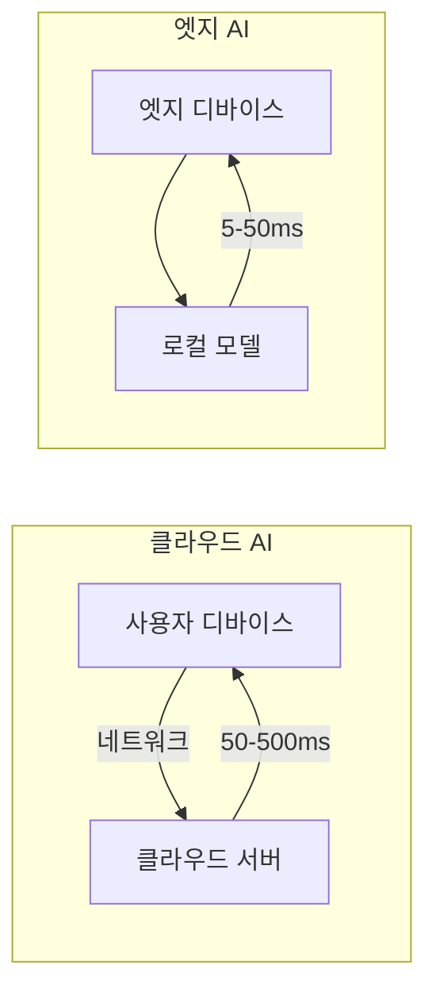
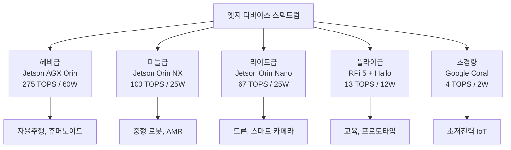
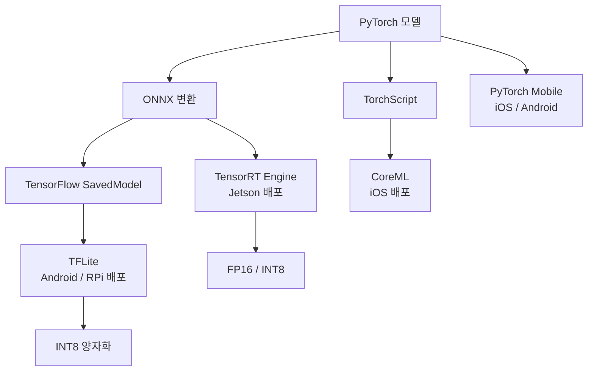
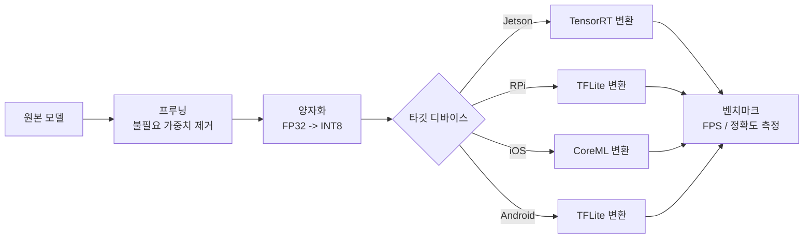

# 엣지 배포

> Jetson, 라즈베리파이, 모바일

## 개요

지금까지 서버에서 모델을 최적화하고 가속화하는 방법을 배웠습니다. 하지만 모든 AI가 클라우드에서 돌아갈 필요는 없습니다. **자율주행차, 드론, 스마트 카메라, 스마트폰**은 인터넷 없이도 실시간 AI를 실행해야 합니다. 이 섹션에서는 **엣지 디바이스**에서 비전 모델을 배포하는 방법을 배웁니다.

**선수 지식**:
- [ONNX와 TensorRT](./02-onnx-tensorrt.md)
- 기본적인 Linux 명령어

**학습 목표**:
- 엣지 AI의 개념과 장점 이해하기
- NVIDIA Jetson에서 비전 모델 실행하기
- 라즈베리파이와 모바일 배포 방법 익히기

## 왜 알아야 할까?

> 📊 **그림 1**: 클라우드 AI vs 엣지 AI 아키텍처 비교




> 💡 **비유**: 클라우드 AI는 **중앙 발전소**와 같고, 엣지 AI는 **태양광 패널**과 같습니다. 발전소는 대규모 전력을 생산하지만 송전선이 필요합니다. 태양광 패널은 작지만 현장에서 바로 전기를 만들죠. 자율주행차가 "잠깐, 서버에 물어볼게요"라고 할 수는 없겠죠?

**클라우드 vs 엣지 비교:**

| 항목 | 클라우드 AI | 엣지 AI |
|------|-------------|---------|
| **지연 시간** | 50-500ms (네트워크) | 5-50ms (로컬) |
| **연결 필요** | 필수 | 불필요 |
| **프라이버시** | 데이터 전송 | 로컬 처리 |
| **비용** | 사용량 과금 | 초기 하드웨어 |
| **확장성** | 무제한 | 디바이스 한계 |
| **전력** | 무제한 | 배터리/제한적 |

**엣지 AI 시장 규모 (2025년 기준):**
- 자율주행: $50B+
- 스마트 카메라/보안: $20B+
- 드론/로봇: $15B+
- 스마트폰 AI: $30B+

## 핵심 개념

### 개념 1: 엣지 디바이스 스펙트럼

> 📊 **그림 2**: 엣지 디바이스 성능-전력 스펙트럼




> 💡 **비유**: 엣지 디바이스는 **운동선수의 체급**과 같습니다. 헤비급(Jetson AGX), 미들급(Jetson Orin Nano), 라이트급(라즈베리파이), 플라이급(마이크로컨트롤러)이 있고, 각각 다른 경기에 적합합니다.

**2025년 주요 엣지 플랫폼:**

| 플랫폼 | AI 성능 | 전력 | 가격 | 용도 |
|--------|---------|------|------|------|
| **Jetson AGX Orin** | 275 TOPS | 15-60W | $1,999 | 자율주행, 대형 로봇 |
| **Jetson Orin Nano Super** | 67 TOPS | 7-25W | $249 | 드론, 스마트 카메라 |
| **Jetson Orin NX** | 100 TOPS | 10-25W | $699 | 중형 로봇, AMR |
| **Jetson Thor** | 2,070 TOPS | 40-130W | TBD | 휴머노이드 로봇 |
| **Raspberry Pi 5** | 13 TOPS* | 5-12W | $80 | 교육, 프로토타입 |
| **Google Coral** | 4 TOPS | 2W | $150 | 초저전력 추론 |

*라즈베리파이 5 + Hailo-8L 가속기 사용 시

### 개념 2: NVIDIA Jetson 배포

Jetson은 NVIDIA GPU를 탑재한 **가장 강력한 엣지 플랫폼**입니다. TensorRT, CUDA가 네이티브로 지원됩니다.

**Jetson 개발 환경 설정:**

```bash
# JetPack SDK 설치 확인
cat /etc/nv_tegra_release
# R35 (release), REVISION: 3.1

# CUDA, TensorRT 버전 확인
nvcc --version  # CUDA 11.4+
dpkg -l | grep TensorRT  # TensorRT 8.5+

# Python 환경 설정
python3 -m pip install --upgrade pip
pip3 install torch torchvision  # Jetson용 wheel

# ONNX Runtime (Jetson 전용 빌드)
pip3 install onnxruntime-gpu
```

```python
# Jetson에서 YOLOv8 실행 예시
from ultralytics import YOLO
import cv2

# 모델 로드 (자동으로 Jetson 최적화)
model = YOLO('yolov8n.pt')

# TensorRT로 변환 (Jetson GPU 최적화)
model.export(format='engine', device=0, half=True)

# 변환된 엔진으로 추론
model_trt = YOLO('yolov8n.engine')

# 웹캠 실시간 추론
cap = cv2.VideoCapture(0)
cap.set(cv2.CAP_PROP_FRAME_WIDTH, 640)
cap.set(cv2.CAP_PROP_FRAME_HEIGHT, 480)

while True:
    ret, frame = cap.read()
    if not ret:
        break

    # 추론
    results = model_trt(frame)

    # 결과 시각화
    annotated = results[0].plot()
    cv2.imshow('YOLOv8 on Jetson', annotated)

    # FPS 계산
    fps = 1000 / results[0].speed['inference']
    print(f"FPS: {fps:.1f}")

    if cv2.waitKey(1) & 0xFF == ord('q'):
        break

cap.release()
cv2.destroyAllWindows()
```

```python
# Jetson 전용 최적화: DeepStream SDK
# GStreamer 기반 고성능 비디오 파이프라인

import gi
gi.require_version('Gst', '1.0')
from gi.repository import Gst, GLib

# DeepStream 파이프라인 예시 (개념적)
# 실제 사용시 NVIDIA DeepStream SDK 설치 필요

DEEPSTREAM_PIPELINE = """
    filesrc location=video.mp4 !
    decodebin !
    nvstreammux batch-size=1 !
    nvinfer config-file-path=yolo_config.txt !
    nvvideoconvert !
    nvdsosd !
    nvegltransform !
    nveglglessink
"""

# 파이프라인 장점:
# - 하드웨어 디코딩 (NVDEC)
# - 배치 추론
# - 멀티 스트림 지원
# - GPU 메모리 직접 전달 (zero-copy)
```

> 💡 **알고 계셨나요?**: 2025년 NVIDIA Jetson Thor는 **2,070 TOPS**의 연산 성능을 자랑합니다. 이는 불과 5년 전 데이터센터 GPU 수준의 성능을 손바닥 크기 보드에서 구현한 것입니다. 휴머노이드 로봇의 실시간 추론을 목표로 개발되었습니다.

### 개념 3: 라즈베리파이 배포

라즈베리파이는 **저렴한 가격과 풍부한 생태계**로 프로토타이핑과 교육에 적합합니다. AI 가속기를 추가하면 실용적인 추론도 가능합니다.

**라즈베리파이 5 + AI HAT 설정:**

```bash
# 라즈베리파이 5 기본 설정
sudo apt update && sudo apt upgrade -y
sudo apt install python3-opencv python3-pip

# Hailo AI HAT 설치 (13 TOPS 가속기)
# https://hailo.ai/products/hailo-rpi5-hat/
pip3 install hailort

# 또는 Google Coral USB 가속기
pip3 install pycoral
```

```python
# 라즈베리파이 + TFLite 추론
import numpy as np
from PIL import Image

try:
    # TFLite Runtime (경량 버전)
    import tflite_runtime.interpreter as tflite
except ImportError:
    import tensorflow.lite as tflite

class RaspberryPiInference:
    def __init__(self, model_path, num_threads=4):
        """라즈베리파이 최적화 추론"""
        # TFLite 인터프리터 생성
        self.interpreter = tflite.Interpreter(
            model_path=model_path,
            num_threads=num_threads  # 멀티코어 활용
        )
        self.interpreter.allocate_tensors()

        # 입출력 정보
        self.input_details = self.interpreter.get_input_details()
        self.output_details = self.interpreter.get_output_details()

        # 입력 형태
        self.input_shape = self.input_details[0]['shape']
        print(f"입력 형태: {self.input_shape}")

    def preprocess(self, image_path):
        """이미지 전처리"""
        img = Image.open(image_path).convert('RGB')
        img = img.resize((self.input_shape[2], self.input_shape[1]))
        img_array = np.array(img, dtype=np.float32)

        # 정규화 (모델에 따라 조정)
        img_array = img_array / 255.0
        img_array = np.expand_dims(img_array, axis=0)
        return img_array

    def infer(self, input_data):
        """추론 실행"""
        self.interpreter.set_tensor(
            self.input_details[0]['index'],
            input_data
        )
        self.interpreter.invoke()

        output = self.interpreter.get_tensor(
            self.output_details[0]['index']
        )
        return output

# 사용 예시
# rpi_model = RaspberryPiInference('mobilenet_v2.tflite')
# result = rpi_model.infer(rpi_model.preprocess('cat.jpg'))
```

```python
# Coral USB 가속기 사용 (4 TOPS Edge TPU)
from pycoral.utils import edgetpu
from pycoral.adapters import common, classify

def coral_inference(model_path, image_path):
    """Google Coral Edge TPU 추론"""

    # Edge TPU 인터프리터 생성
    interpreter = edgetpu.make_interpreter(model_path)
    interpreter.allocate_tensors()

    # 이미지 로드 및 전처리
    image = Image.open(image_path).convert('RGB')
    _, scale = common.set_resized_input(
        interpreter,
        image.size,
        lambda size: image.resize(size, Image.LANCZOS)
    )

    # 추론
    interpreter.invoke()

    # 결과 (분류 예시)
    classes = classify.get_classes(interpreter, top_k=5)
    for c in classes:
        print(f"클래스 {c.id}: {c.score:.3f}")

    return classes

# 사용 예시 (Edge TPU 컴파일된 모델 필요)
# coral_inference('mobilenet_edgetpu.tflite', 'cat.jpg')
```

> ⚠️ **흔한 오해**: "라즈베리파이에서는 딥러닝을 못 돌린다" — 틀렸습니다! 라즈베리파이 5는 **CPU만으로도** MobileNet 수준 모델을 10-20 FPS로 돌릴 수 있고, AI 가속기를 추가하면 **30+ FPS**도 가능합니다.

### 개념 4: 모바일 배포 (iOS/Android)

> 📊 **그림 3**: PyTorch 모델의 엣지 변환 경로




스마트폰은 가장 널리 보급된 엣지 디바이스입니다. **Neural Engine(iOS)**, **NPU(Android)**가 탑재되어 있습니다.

**모바일 배포 옵션:**

| 프레임워크 | iOS | Android | 장점 |
|------------|-----|---------|------|
| **CoreML** | ✅ | ❌ | Apple 최적화, Swift 통합 |
| **TFLite** | ✅ | ✅ | 크로스 플랫폼, 경량 |
| **PyTorch Mobile** | ✅ | ✅ | PyTorch 생태계 |
| **ONNX Runtime Mobile** | ✅ | ✅ | 범용성 |
| **MediaPipe** | ✅ | ✅ | 사전 훈련 솔루션 |

```python
# PyTorch → CoreML 변환 (iOS)
import torch
import coremltools as ct
from torchvision import models

# 모델 준비
model = models.mobilenet_v2(pretrained=True)
model.eval()

# TorchScript로 변환
example_input = torch.rand(1, 3, 224, 224)
traced_model = torch.jit.trace(model, example_input)

# CoreML로 변환
mlmodel = ct.convert(
    traced_model,
    inputs=[ct.ImageType(
        name="image",
        shape=example_input.shape,
        scale=1/255.0,
        bias=[-0.485/0.229, -0.456/0.224, -0.406/0.225]
    )],
    minimum_deployment_target=ct.target.iOS15
)

# 메타데이터 추가
mlmodel.author = 'CV Tutorial'
mlmodel.short_description = 'MobileNetV2 이미지 분류'

# 저장
mlmodel.save('MobileNetV2.mlpackage')
print("CoreML 모델 저장 완료!")
```

```python
# PyTorch → TFLite 변환 (Android/iOS)
import torch
import tensorflow as tf

# 1단계: PyTorch → ONNX
model = models.mobilenet_v2(pretrained=True)
model.eval()

dummy_input = torch.randn(1, 3, 224, 224)
torch.onnx.export(model, dummy_input, "mobilenet.onnx")

# 2단계: ONNX → TensorFlow (onnx-tf 사용)
# pip install onnx-tf
import onnx
from onnx_tf.backend import prepare

onnx_model = onnx.load("mobilenet.onnx")
tf_rep = prepare(onnx_model)
tf_rep.export_graph("mobilenet_tf")

# 3단계: TensorFlow → TFLite
converter = tf.lite.TFLiteConverter.from_saved_model("mobilenet_tf")

# 최적화 옵션
converter.optimizations = [tf.lite.Optimize.DEFAULT]  # 기본 양자화

# 선택: 전체 정수 양자화 (더 빠름)
# converter.target_spec.supported_types = [tf.int8]

tflite_model = converter.convert()

# 저장
with open('mobilenet.tflite', 'wb') as f:
    f.write(tflite_model)
print("TFLite 모델 저장 완료!")
```

```kotlin
// Android에서 TFLite 추론 (Kotlin 예시)
import org.tensorflow.lite.Interpreter

class ImageClassifier(context: Context) {
    private val interpreter: Interpreter

    init {
        // 모델 로드
        val model = loadModelFile(context, "mobilenet.tflite")
        val options = Interpreter.Options().apply {
            setNumThreads(4)
            // GPU 델리게이트 (선택)
            // addDelegate(GpuDelegate())
        }
        interpreter = Interpreter(model, options)
    }

    fun classify(bitmap: Bitmap): FloatArray {
        // 전처리
        val input = preprocessImage(bitmap)

        // 출력 버퍼
        val output = Array(1) { FloatArray(1000) }

        // 추론
        interpreter.run(input, output)

        return output[0]
    }
}
```

> 🔥 **실무 팁**: 모바일 배포 시 **모델 크기**가 중요합니다. 앱 스토어는 100MB 이상 앱은 Wi-Fi에서만 다운로드를 허용합니다. MobileNet(14MB), EfficientNet-Lite(20MB) 같은 경량 모델을 선택하거나, 모델을 앱 번들이 아닌 서버에서 다운로드하는 방식을 고려하세요.

### 개념 5: 엣지 배포 최적화 전략

> 📊 **그림 4**: 엣지 배포 최적화 파이프라인




```python
# 엣지 최적화 체크리스트
class EdgeOptimizationPipeline:
    """엣지 배포를 위한 최적화 파이프라인"""

    def __init__(self, model, target_device):
        self.model = model
        self.target = target_device  # 'jetson', 'rpi', 'mobile'

    def optimize(self):
        """디바이스별 최적화 수행"""
        steps = []

        # 1. 공통: 모델 경량화
        steps.append(('프루닝', self.apply_pruning))
        steps.append(('양자화', self.apply_quantization))

        # 2. 디바이스별 변환
        if self.target == 'jetson':
            steps.append(('TensorRT 변환', self.convert_tensorrt))
        elif self.target == 'rpi':
            steps.append(('TFLite 변환', self.convert_tflite))
        elif self.target == 'mobile':
            steps.append(('CoreML/TFLite 변환', self.convert_mobile))

        # 3. 벤치마크
        steps.append(('성능 측정', self.benchmark))

        for name, func in steps:
            print(f"[{name}] 시작...")
            func()
            print(f"[{name}] 완료!")

        return self.model

    def apply_pruning(self):
        """30% 구조적 프루닝"""
        import torch.nn.utils.prune as prune
        for module in self.model.modules():
            if isinstance(module, torch.nn.Conv2d):
                prune.ln_structured(module, 'weight', 0.3, n=2, dim=0)

    def apply_quantization(self):
        """INT8 양자화"""
        self.model = torch.quantization.quantize_dynamic(
            self.model, {torch.nn.Conv2d, torch.nn.Linear}, torch.qint8
        )

    def convert_tensorrt(self):
        """TensorRT 엔진 생성"""
        # ONNX → TensorRT (이전 섹션 참조)
        pass

    def convert_tflite(self):
        """TFLite 변환"""
        # PyTorch → ONNX → TF → TFLite
        pass

    def convert_mobile(self):
        """모바일 포맷 변환"""
        # CoreML (iOS) 또는 TFLite (Android)
        pass

    def benchmark(self):
        """성능 벤치마크"""
        import time
        dummy = torch.randn(1, 3, 224, 224)

        # 워밍업
        for _ in range(10):
            self.model(dummy)

        # 측정
        start = time.time()
        for _ in range(100):
            self.model(dummy)
        elapsed = (time.time() - start) / 100 * 1000

        print(f"평균 추론 시간: {elapsed:.2f} ms")
        print(f"FPS: {1000/elapsed:.1f}")
```

**디바이스별 권장 모델:**

| 디바이스 | 권장 모델 | 예상 FPS | 정확도 |
|----------|-----------|----------|--------|
| Jetson Orin Nano | YOLOv8-s | 60+ | 높음 |
| Jetson Orin Nano | ResNet-50 | 100+ | 높음 |
| 라즈베리파이 5 | MobileNetV3 | 30+ | 중간 |
| 라즈베리파이 5 + Hailo | YOLOv8-n | 50+ | 중간 |
| 스마트폰 (2024+) | EfficientNet-Lite | 60+ | 중간 |

## 더 깊이 알아보기: Jetson과 라즈베리파이의 융합

흥미롭게도, 2025년에는 **라즈베리파이 + Jetson의 융합 프로젝트**가 인기입니다. 라즈베리파이의 저렴한 주변장치 연결과 Jetson의 AI 성능을 조합하는 것이죠.

예: 라즈베리파이로 카메라, 센서, 모터를 제어하고, Jetson Orin Nano Super($249)로 실시간 객체 탐지를 수행하는 AI 로버. 전체 비용 $400 미만으로 자율주행 프로토타입을 만들 수 있습니다.

## 핵심 정리

| 개념 | 설명 |
|------|------|
| **엣지 AI** | 로컬 디바이스에서 실행되는 AI, 저지연/프라이버시 장점 |
| **Jetson** | NVIDIA의 엣지 AI 플랫폼, TensorRT 네이티브 지원 |
| **라즈베리파이** | 저렴한 프로토타이핑 플랫폼, AI HAT로 성능 보완 |
| **TFLite** | Google의 경량 추론 런타임, 모바일/임베디드 최적화 |
| **CoreML** | Apple의 ML 프레임워크, Neural Engine 활용 |
| **DeepStream** | NVIDIA의 비디오 분석 SDK, 멀티 스트림 지원 |

## 다음 섹션 미리보기

모델을 배포했다면, 이제 **지속적인 관리**가 필요합니다. 다음 섹션 [CV MLOps](./04-mlops.md)에서는 학습 파이프라인 자동화, 모델 버전 관리, 성능 모니터링, 드리프트 감지 등 **프로덕션 ML 시스템 운영** 방법을 배웁니다.

## 참고 자료

- [NVIDIA Jetson in 2025](https://tannatechbiz.com/blog/post/nvidia-jetson) - 최신 Jetson 가이드
- [Getting Started with Edge AI on Jetson](https://developer.nvidia.com/blog/getting-started-with-edge-ai-on-nvidia-jetson-llms-vlms-and-foundation-models-for-robotics/) - NVIDIA 공식 튜토리얼
- [How to Choose Edge AI Platform 2025](https://promwad.com/news/choose-edge-ai-platform-jetson-kria-coral-2025) - 플랫폼 비교 가이드
- [Computer Vision on the Edge](https://www.amazon.com/Computer-Vision-Edge-Deploying-detection/dp/B0G4DP3ZHX) - 엣지 CV 배포 서적
- [Edge AI: Real-Time Inference](https://dev.to/vaib/edge-ai-revolutionizing-real-time-inference-on-resource-constrained-devices-58mf) - 엣지 AI 개요
