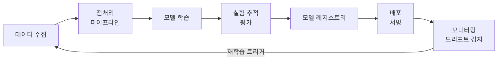
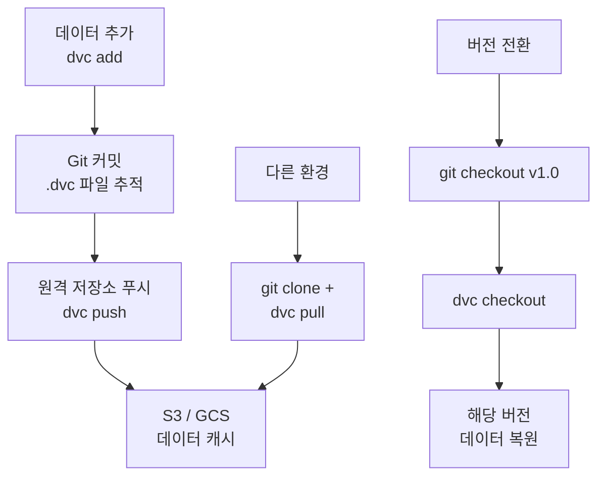
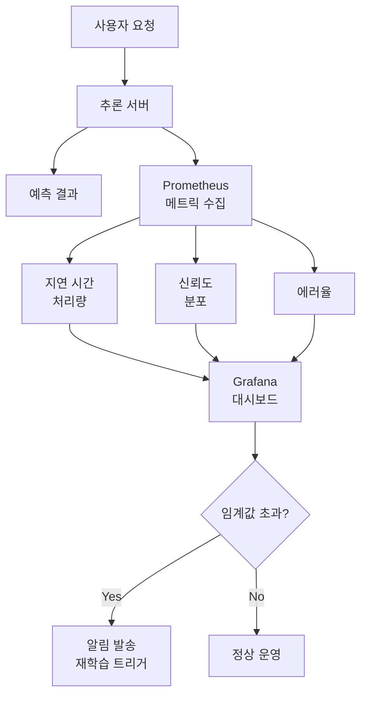

# CV MLOps

> 학습 파이프라인과 모니터링

## 개요

모델을 한 번 배포하면 끝일까요? 아닙니다! 실제 서비스에서는 **데이터가 변하고, 성능이 저하되고, 새 버전을 배포**해야 합니다. 이 섹션에서는 컴퓨터 비전 모델의 **전체 생애주기**를 관리하는 MLOps(Machine Learning Operations)를 배웁니다. 데이터 파이프라인, 실험 추적, 모델 레지스트리, 모니터링까지 프로덕션 ML 시스템 운영 방법을 익힙니다.

**선수 지식**:
- [엣지 배포](./03-edge-deployment.md)
- 기본적인 CI/CD 개념

**학습 목표**:
- MLOps의 개념과 CV 특화 요구사항 이해하기
- 실험 추적과 모델 버전 관리 구현하기
- 프로덕션 모니터링과 드리프트 감지 설정하기

## 왜 알아야 할까?

> 📊 **그림 5**: ML 프로젝트 단계별 실패율 — 실제 가치 창출까지의 병목


> 💡 **비유**: 자동차를 만드는 것과 **운영하는 것**은 다릅니다. 공장에서 차를 만들면 끝이 아니라, 정비소, 주유소, 보험, 리콜 시스템이 필요하죠. ML 모델도 학습(공장)만으로는 부족합니다. **배포, 모니터링, 재학습의 순환**이 필요합니다.

**ML 프로젝트 실패의 현실:**

| 단계 | 실패율 | 주요 원인 |
|------|--------|----------|
| 연구 → 프로토타입 | 30% | 기술적 한계 |
| 프로토타입 → 배포 | 50% | 인프라/통합 문제 |
| 배포 → 지속 운영 | 40% | 성능 저하, 드리프트 |

**결론**: 연구에서 시작한 ML 프로젝트 중 **실제 가치를 창출하는 비율은 20% 미만**입니다. MLOps는 이 격차를 줄이는 핵심 역량입니다.

## 핵심 개념

### 개념 1: MLOps란?

> 💡 **비유**: MLOps는 **DevOps의 ML 버전**입니다. DevOps가 코드의 개발→테스트→배포를 자동화했다면, MLOps는 **데이터→학습→배포→모니터링**의 전체 사이클을 자동화합니다.

> 📊 **그림 1**: MLOps 전체 생애주기 — 데이터에서 모니터링까지의 순환 구조




**MLOps 성숙도 레벨:**

| 레벨 | 설명 | 특징 |
|------|------|------|
| **Level 0** | 수동 ML | Jupyter 노트북, 수동 배포 |
| **Level 1** | ML 파이프라인 | 자동화된 학습, 수동 배포 |
| **Level 2** | CI/CD for ML | 자동 학습 + 자동 배포 |
| **Level 3** | 완전 자동화 | 자동 재학습 + 롤백 + 모니터링 |

**CV MLOps의 특수한 요구사항:**

| 일반 MLOps | CV 특화 |
|------------|---------|
| 표 형태 데이터 | 대용량 이미지/비디오 |
| GB 단위 데이터 | TB-PB 단위 데이터 |
| 단순 통계 드리프트 | 시각적 드리프트 감지 |
| CPU 학습 가능 | GPU 클러스터 필수 |
| 빠른 추론 | 복잡한 전처리 파이프라인 |

### 개념 2: 데이터 파이프라인

CV 프로젝트에서 **데이터 관리**는 가장 중요하면서도 어려운 부분입니다.

> 📊 **그림 2**: DVC 기반 데이터 버전 관리 워크플로우




```python
# 데이터 버전 관리: DVC (Data Version Control)
# pip install dvc dvc-s3

"""
DVC 기본 워크플로우:

1. 초기화
$ dvc init
$ dvc remote add -d storage s3://my-bucket/dvc-cache

2. 데이터 추적
$ dvc add data/images/
$ git add data/images.dvc .gitignore
$ git commit -m "Add training images v1"

3. 데이터 푸시/풀
$ dvc push
$ dvc pull

4. 버전 전환
$ git checkout v1.0
$ dvc checkout
"""

# Python에서 DVC 사용
import dvc.api

# 특정 버전의 데이터 경로 가져오기
data_url = dvc.api.get_url(
    path='data/images',
    repo='https://github.com/user/cv-project',
    rev='v1.0'  # Git 태그 또는 커밋
)

# 데이터 직접 읽기
with dvc.api.open(
    'data/annotations.json',
    repo='https://github.com/user/cv-project',
    rev='v2.0'
) as f:
    annotations = json.load(f)
```

```python
# 대규모 이미지 데이터 파이프라인
from torch.utils.data import Dataset, DataLoader
from torchvision import transforms
import albumentations as A
from albumentations.pytorch import ToTensorV2

class CVDataPipeline:
    """프로덕션 수준 CV 데이터 파이프라인"""

    def __init__(self, data_root, split='train'):
        self.data_root = data_root
        self.split = split

        # 학습/검증 augmentation 분리
        if split == 'train':
            self.transform = A.Compose([
                A.RandomResizedCrop(224, 224),
                A.HorizontalFlip(p=0.5),
                A.ColorJitter(brightness=0.2, contrast=0.2),
                A.Normalize(mean=[0.485, 0.456, 0.406],
                           std=[0.229, 0.224, 0.225]),
                ToTensorV2()
            ])
        else:
            self.transform = A.Compose([
                A.Resize(256, 256),
                A.CenterCrop(224, 224),
                A.Normalize(mean=[0.485, 0.456, 0.406],
                           std=[0.229, 0.224, 0.225]),
                ToTensorV2()
            ])

    def get_dataloader(self, batch_size=32, num_workers=8):
        """데이터로더 생성"""
        dataset = ImageDataset(
            root=f"{self.data_root}/{self.split}",
            transform=self.transform
        )

        loader = DataLoader(
            dataset,
            batch_size=batch_size,
            shuffle=(self.split == 'train'),
            num_workers=num_workers,
            pin_memory=True,  # GPU 전송 최적화
            prefetch_factor=2,  # 미리 로드
            persistent_workers=True  # 워커 재사용
        )
        return loader
```

### 개념 3: 실험 추적

> 💡 **비유**: 실험 추적은 **연구 노트**와 같습니다. 과학자가 실험할 때마다 조건과 결과를 기록하듯, ML 엔지니어도 하이퍼파라미터, 메트릭, 아티팩트를 기록해야 합니다.

**주요 실험 추적 도구:**

| 도구 | 특징 | 가격 |
|------|------|------|
| **MLflow** | 오픈소스, 자체 호스팅 | 무료 |
| **Weights & Biases** | 강력한 시각화, 협업 | 무료~유료 |
| **Neptune.ai** | 대규모 팀 최적화 | 유료 |
| **ClearML** | 오픈소스, 올인원 | 무료~유료 |

```python
# MLflow로 실험 추적
import mlflow
import mlflow.pytorch
from torchvision import models

# MLflow 서버 설정
mlflow.set_tracking_uri("http://localhost:5000")
mlflow.set_experiment("image-classification")

def train_with_tracking(config):
    """MLflow로 학습 추적"""

    with mlflow.start_run(run_name=config['run_name']):
        # 하이퍼파라미터 로깅
        mlflow.log_params({
            'model': config['model_name'],
            'learning_rate': config['lr'],
            'batch_size': config['batch_size'],
            'epochs': config['epochs'],
            'optimizer': config['optimizer'],
        })

        # 모델 생성
        model = models.resnet18(pretrained=True)
        model.fc = nn.Linear(512, config['num_classes'])

        # 학습 루프
        for epoch in range(config['epochs']):
            train_loss, train_acc = train_epoch(model, train_loader)
            val_loss, val_acc = validate(model, val_loader)

            # 메트릭 로깅
            mlflow.log_metrics({
                'train_loss': train_loss,
                'train_acc': train_acc,
                'val_loss': val_loss,
                'val_acc': val_acc,
            }, step=epoch)

            print(f"Epoch {epoch}: val_acc={val_acc:.4f}")

        # 모델 저장
        mlflow.pytorch.log_model(model, "model")

        # 추가 아티팩트 (혼동 행렬 등)
        cm_fig = plot_confusion_matrix(model, val_loader)
        mlflow.log_figure(cm_fig, "confusion_matrix.png")

        return model

# 실행
config = {
    'run_name': 'resnet18-lr001',
    'model_name': 'resnet18',
    'lr': 0.001,
    'batch_size': 32,
    'epochs': 10,
    'optimizer': 'Adam',
    'num_classes': 10
}
model = train_with_tracking(config)
```

```python
# Weights & Biases 사용
import wandb

def train_with_wandb(config):
    """W&B로 실험 추적 (더 강력한 시각화)"""

    # 실험 초기화
    wandb.init(
        project="cv-classification",
        name=config['run_name'],
        config=config
    )

    model = models.resnet18(pretrained=True)

    # 모델 구조 시각화
    wandb.watch(model, log='all', log_freq=100)

    for epoch in range(config['epochs']):
        train_loss, train_acc = train_epoch(model, train_loader)
        val_loss, val_acc = validate(model, val_loader)

        # 메트릭 로깅
        wandb.log({
            'epoch': epoch,
            'train/loss': train_loss,
            'train/acc': train_acc,
            'val/loss': val_loss,
            'val/acc': val_acc,
        })

        # 샘플 예측 시각화
        if epoch % 5 == 0:
            log_predictions(model, val_loader)

    # 모델 저장 (W&B Artifacts)
    artifact = wandb.Artifact('model', type='model')
    torch.save(model.state_dict(), 'model.pth')
    artifact.add_file('model.pth')
    wandb.log_artifact(artifact)

    wandb.finish()

def log_predictions(model, dataloader, num_samples=16):
    """예측 결과 시각화"""
    images, labels = next(iter(dataloader))
    preds = model(images[:num_samples]).argmax(dim=1)

    wandb.log({
        "predictions": [
            wandb.Image(img, caption=f"Pred: {p}, True: {l}")
            for img, p, l in zip(images[:num_samples], preds, labels[:num_samples])
        ]
    })
```

### 개념 4: 모델 레지스트리

> 💡 **비유**: 모델 레지스트리는 **와인 저장고**와 같습니다. 각 빈티지(버전)를 라벨링하고, 숙성 상태(스테이지)를 관리하며, 최상의 와인(프로덕션 모델)을 선별합니다.

```python
# MLflow 모델 레지스트리
import mlflow
from mlflow.tracking import MlflowClient

client = MlflowClient()

# 1. 모델 등록
model_uri = "runs:/<run_id>/model"
mv = mlflow.register_model(model_uri, "image-classifier")
print(f"모델 버전: {mv.version}")

# 2. 모델 스테이지 관리
# 스테이지: None → Staging → Production → Archived

# Staging으로 승격
client.transition_model_version_stage(
    name="image-classifier",
    version=1,
    stage="Staging"
)

# Production으로 승격 (자동 테스트 통과 후)
client.transition_model_version_stage(
    name="image-classifier",
    version=1,
    stage="Production",
    archive_existing_versions=True  # 기존 버전 아카이브
)

# 3. 프로덕션 모델 로드
production_model = mlflow.pyfunc.load_model(
    model_uri="models:/image-classifier/Production"
)

# 특정 버전 로드
specific_model = mlflow.pyfunc.load_model(
    model_uri="models:/image-classifier/3"
)
```

```python
# 모델 배포 자동화 (GitHub Actions 예시)
"""
# .github/workflows/model-deploy.yml

name: Model Deployment

on:
  workflow_dispatch:
    inputs:
      model_version:
        description: 'Model version to deploy'
        required: true

jobs:
  test:
    runs-on: ubuntu-latest
    steps:
      - uses: actions/checkout@v3

      - name: Load model from registry
        run: |
          python scripts/load_model.py --version ${{ inputs.model_version }}

      - name: Run integration tests
        run: |
          pytest tests/integration/ -v

  deploy:
    needs: test
    runs-on: ubuntu-latest
    steps:
      - name: Deploy to production
        run: |
          python scripts/deploy.py --version ${{ inputs.model_version }}

      - name: Update model stage
        run: |
          python scripts/promote_model.py --version ${{ inputs.model_version }} --stage Production
"""
```

### 개념 5: 프로덕션 모니터링

> ⚠️ **흔한 오해**: "모델 배포하면 끝" — 실제로는 **시작**입니다. 데이터 분포가 변하고(드리프트), 성능이 저하되고, 예상치 못한 입력이 들어옵니다.

**모니터링해야 할 지표:**

> 📊 **그림 4**: 프로덕션 모니터링 아키텍처




| 범주 | 지표 | 설명 |
|------|------|------|
| **시스템** | 지연 시간, 처리량, 에러율 | 인프라 건강 상태 |
| **모델** | 정확도, 신뢰도 분포 | 예측 품질 |
| **데이터** | 입력 분포, 드리프트 점수 | 데이터 변화 감지 |
| **비즈니스** | 사용자 피드백, 전환율 | 실제 가치 |

```python
# 프로덕션 모니터링 시스템
from prometheus_client import Counter, Histogram, start_http_server
import numpy as np
from scipy import stats

# Prometheus 메트릭 정의
PREDICTION_COUNT = Counter('predictions_total', 'Total predictions', ['class'])
PREDICTION_LATENCY = Histogram('prediction_latency_seconds', 'Prediction latency')
CONFIDENCE_HISTOGRAM = Histogram('prediction_confidence', 'Prediction confidence',
                                  buckets=[0.5, 0.6, 0.7, 0.8, 0.9, 0.95, 0.99])

class ProductionMonitor:
    """프로덕션 모델 모니터링"""

    def __init__(self, model, reference_data=None):
        self.model = model
        self.reference_data = reference_data  # 학습 데이터 통계
        self.predictions_buffer = []
        self.confidence_buffer = []

    def predict_with_monitoring(self, input_data):
        """모니터링이 포함된 예측"""
        import time

        # 지연 시간 측정
        start = time.time()
        output = self.model(input_data)
        latency = time.time() - start

        # 메트릭 기록
        PREDICTION_LATENCY.observe(latency)

        # 예측 결과 분석
        probs = torch.softmax(output, dim=1)
        confidence, predicted_class = probs.max(dim=1)

        for conf, cls in zip(confidence, predicted_class):
            CONFIDENCE_HISTOGRAM.observe(conf.item())
            PREDICTION_COUNT.labels(class=str(cls.item())).inc()

        # 버퍼에 저장 (드리프트 감지용)
        self.confidence_buffer.extend(confidence.tolist())
        self.predictions_buffer.extend(predicted_class.tolist())

        return output

    def check_data_drift(self, current_features):
        """데이터 드리프트 감지"""
        if self.reference_data is None:
            return None

        # KS 테스트로 분포 변화 감지
        drift_scores = {}
        for i in range(current_features.shape[1]):
            stat, pvalue = stats.ks_2samp(
                self.reference_data[:, i],
                current_features[:, i]
            )
            drift_scores[f'feature_{i}'] = {
                'statistic': stat,
                'pvalue': pvalue,
                'drift_detected': pvalue < 0.05
            }

        return drift_scores

    def check_model_performance(self, window_size=1000):
        """모델 성능 저하 감지"""
        if len(self.confidence_buffer) < window_size:
            return None

        recent_conf = self.confidence_buffer[-window_size:]
        historical_conf = self.confidence_buffer[:-window_size]

        if len(historical_conf) < window_size:
            return None

        # 신뢰도 분포 변화 감지
        stat, pvalue = stats.ks_2samp(historical_conf[-window_size:], recent_conf)

        return {
            'mean_confidence': np.mean(recent_conf),
            'drift_statistic': stat,
            'pvalue': pvalue,
            'alert': pvalue < 0.01  # 유의수준 1%
        }

# 사용 예시
# start_http_server(8000)  # Prometheus 메트릭 엔드포인트
# monitor = ProductionMonitor(model, reference_data)
# output = monitor.predict_with_monitoring(input_data)
```

```python
# 이미지 드리프트 감지 (CV 특화)
from sklearn.decomposition import PCA
import numpy as np

class ImageDriftDetector:
    """이미지 데이터 드리프트 감지"""

    def __init__(self, feature_extractor, reference_features):
        """
        Args:
            feature_extractor: 이미지 → 특징 벡터 추출 모델
            reference_features: 학습 데이터의 특징 벡터
        """
        self.extractor = feature_extractor
        self.reference = reference_features

        # PCA로 차원 축소 (비교 용이)
        self.pca = PCA(n_components=50)
        self.ref_reduced = self.pca.fit_transform(reference_features)

        # 기준 통계
        self.ref_mean = self.ref_reduced.mean(axis=0)
        self.ref_std = self.ref_reduced.std(axis=0)

    def detect_drift(self, new_images, threshold=3.0):
        """새 이미지의 드리프트 감지"""
        # 특징 추출
        with torch.no_grad():
            new_features = self.extractor(new_images).numpy()

        # 차원 축소
        new_reduced = self.pca.transform(new_features)

        # Z-score 계산 (기준 분포에서 얼마나 벗어났는지)
        z_scores = np.abs((new_reduced - self.ref_mean) / (self.ref_std + 1e-8))
        max_z = z_scores.max(axis=1)

        # 드리프트 감지 결과
        drift_detected = max_z > threshold
        drift_ratio = drift_detected.mean()

        return {
            'drift_ratio': drift_ratio,
            'max_z_scores': max_z,
            'alert': drift_ratio > 0.1  # 10% 이상 드리프트
        }
```

> 🔥 **실무 팁**: CV 모델의 드리프트는 **시각적으로 확인**하는 것이 가장 효과적입니다. 예측 신뢰도가 낮은 샘플, 드리프트 점수가 높은 샘플을 주기적으로 시각화하여 모니터링 대시보드에 추가하세요.

## 더 깊이 알아보기: CV MLOps 도구 생태계

**2025년 권장 스택:**

| 역할 | 도구 | 대안 |
|------|------|------|
| **데이터 버전 관리** | DVC | LakeFS, Pachyderm |
| **실험 추적** | W&B, MLflow | Neptune, ClearML |
| **파이프라인 오케스트레이션** | Kubeflow, Airflow | Prefect, Dagster |
| **모델 레지스트리** | MLflow | Vertex AI, SageMaker |
| **서빙** | Triton, TorchServe | BentoML, Seldon |
| **모니터링** | Prometheus + Grafana | Evidently, Whylogs |

## 핵심 정리

| 개념 | 설명 |
|------|------|
| **MLOps** | ML 모델의 개발-배포-운영 전체 사이클 자동화 |
| **데이터 파이프라인** | 대용량 이미지/비디오 처리 및 버전 관리 |
| **실험 추적** | 하이퍼파라미터, 메트릭, 아티팩트 기록 |
| **모델 레지스트리** | 모델 버전 관리 및 스테이지 승격 |
| **드리프트 감지** | 데이터/모델 성능 변화 자동 감지 |
| **프로덕션 모니터링** | 실시간 지연 시간, 처리량, 에러율 추적 |

## 다음 섹션 미리보기

MLOps 인프라가 갖춰졌다면, 마지막으로 **모델 서빙**을 구현할 차례입니다. 다음 섹션 [모델 서빙](./05-serving.md)에서는 Triton Inference Server, TorchServe, FastAPI를 사용해 **프로덕션 수준의 추론 API**를 구축하는 방법을 배웁니다.

## 참고 자료

- [Google Cloud MLOps Guide](https://docs.cloud.google.com/architecture/mlops-continuous-delivery-and-automation-pipelines-in-machine-learning) - MLOps 개념 정리
- [MLOps for Computer Vision](https://dac.digital/mlops-for-computer-vision-key-components-challenges-and-best-practices/) - CV 특화 MLOps
- [Building MLOps Pipeline for CV](https://neptune.ai/blog/mlops-pipeline-for-computer-vision-image-classification) - Neptune.ai 튜토리얼
- [Mastering MLOps for CV 2025](https://easyflow.tech/mlops-for-computer-vision/) - 2025년 최신 트렌드
- [MLOps Best Practices](https://www.clarifai.com/blog/mlops-best-practices) - 실무 베스트 프랙티스
