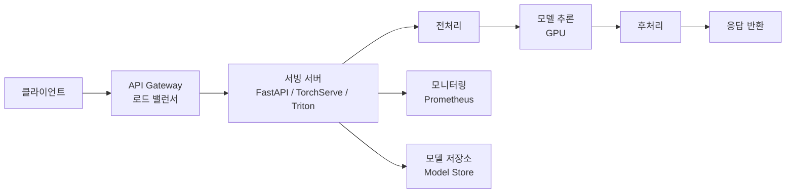
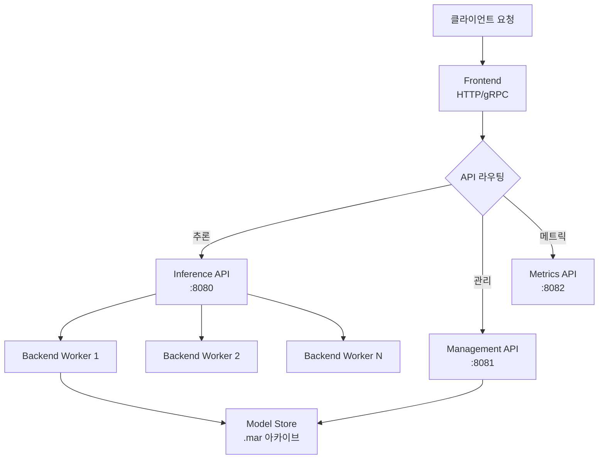
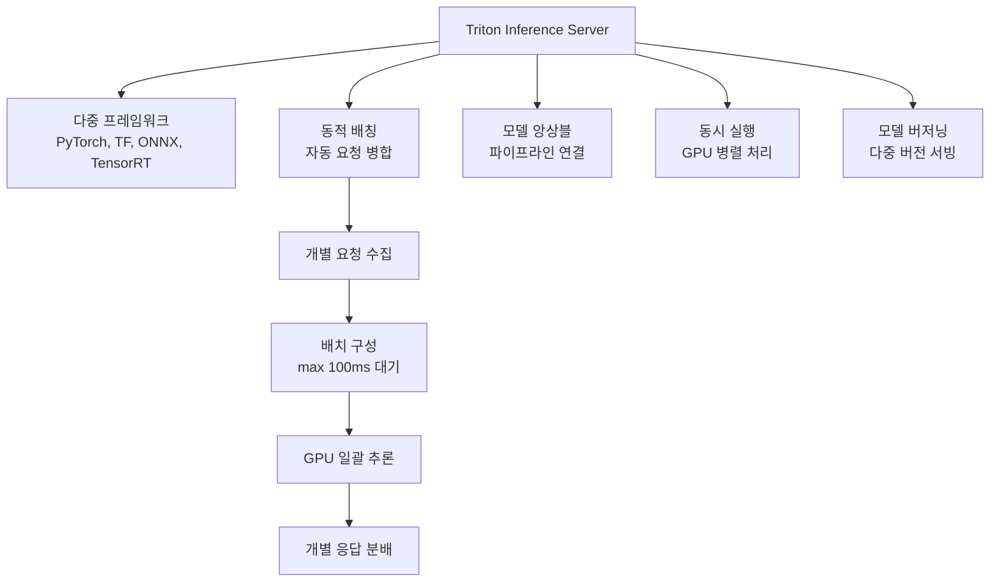
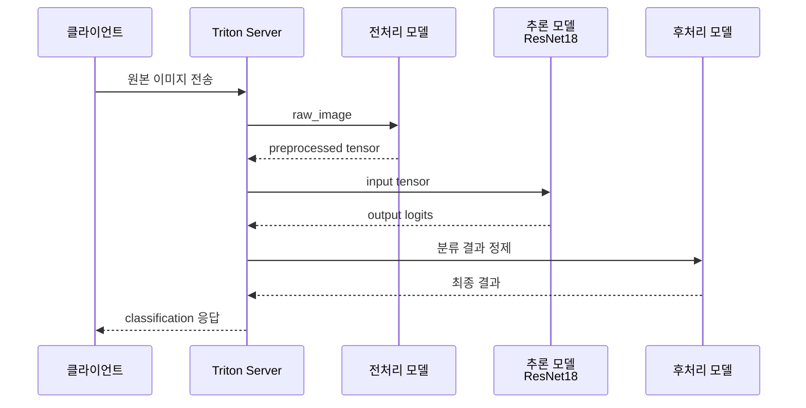
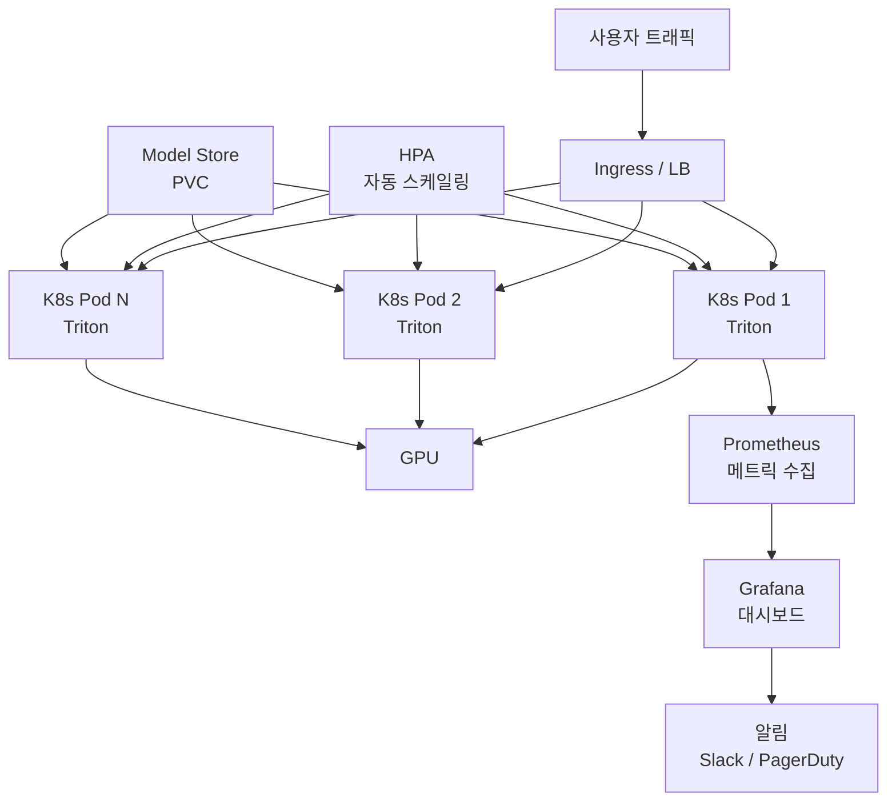

# 모델 서빙

> Triton, TorchServe, FastAPI

## 개요

MLOps 인프라를 갖추었다면, 이제 **사용자에게 모델을 제공**할 차례입니다. 이 섹션에서는 비전 모델을 **REST API나 gRPC 서비스**로 배포하는 방법을 배웁니다. 간단한 FastAPI 서버부터 대규모 트래픽을 처리하는 Triton Inference Server까지, 프로덕션 수준의 모델 서빙을 구현합니다.

**선수 지식**:
- [CV MLOps](./04-mlops.md)
- [ONNX와 TensorRT](./02-onnx-tensorrt.md)
- 기본적인 웹 API 개념

**학습 목표**:
- 모델 서빙 아키텍처의 핵심 개념 이해하기
- FastAPI로 간단한 추론 API 구축하기
- TorchServe와 Triton으로 프로덕션 서빙 구현하기

## 왜 알아야 할까?

> 💡 **비유**: 최고의 셰프가 있어도 **레스토랑**이 없으면 손님에게 요리를 제공할 수 없습니다. 주방(모델)만으로는 부족하고, 홀 서비스(서빙 시스템), 주문 시스템(API), 웨이터(로드 밸런서)가 필요합니다. 모델 서빙은 **ML 레스토랑**을 운영하는 것입니다.

> 📊 **그림 1**: 모델 서빙 시스템의 전체 구조




**서빙 방식 비교:**

| 방식 | 장점 | 단점 | 적합한 경우 |
|------|------|------|-------------|
| **FastAPI** | 간단, 유연 | 최적화 수동 | 프로토타입, 소규모 |
| **TorchServe** | PyTorch 특화 | 러닝 커브 | PyTorch 모델 |
| **Triton** | 고성능, 다중 모델 | 복잡한 설정 | 대규모 프로덕션 |
| **BentoML** | 패키징 편리 | 성능 제한 | 빠른 배포 |

**서빙 시스템의 핵심 지표:**

| 지표 | 설명 | 목표 |
|------|------|------|
| **Latency (P50/P99)** | 응답 시간 | < 100ms |
| **Throughput** | 초당 요청 수 | 높을수록 좋음 |
| **Availability** | 가용성 | 99.9%+ |
| **Scalability** | 확장성 | 수평 확장 가능 |

## 핵심 개념

### 개념 1: FastAPI로 빠른 프로토타이핑

> 💡 **비유**: FastAPI는 **포장마차**와 같습니다. 빠르게 열고, 간단한 메뉴로 손님을 맞을 수 있습니다. 대규모 레스토랑은 아니지만, 시작하기엔 완벽합니다.

```python
# pip install fastapi uvicorn python-multipart pillow torch torchvision

from fastapi import FastAPI, File, UploadFile, HTTPException
from fastapi.responses import JSONResponse
from PIL import Image
import torch
from torchvision import models, transforms
import io
import time

app = FastAPI(
    title="Image Classification API",
    description="ResNet-18 기반 이미지 분류 서비스",
    version="1.0.0"
)

# 모델 로드 (시작 시 한 번만)
model = models.resnet18(pretrained=True)
model.eval()

# ImageNet 클래스 (일부)
IMAGENET_CLASSES = {0: 'tench', 1: 'goldfish', ...}  # 실제로는 1000개

# 전처리 파이프라인
preprocess = transforms.Compose([
    transforms.Resize(256),
    transforms.CenterCrop(224),
    transforms.ToTensor(),
    transforms.Normalize(
        mean=[0.485, 0.456, 0.406],
        std=[0.229, 0.224, 0.225]
    )
])

@app.post("/predict")
async def predict(file: UploadFile = File(...)):
    """
    이미지 분류 예측

    - **file**: 이미지 파일 (JPEG, PNG)
    - **returns**: 예측 클래스와 신뢰도
    """
    # 파일 검증
    if not file.content_type.startswith('image/'):
        raise HTTPException(status_code=400, detail="이미지 파일만 업로드 가능합니다")

    try:
        # 이미지 로드
        contents = await file.read()
        image = Image.open(io.BytesIO(contents)).convert('RGB')

        # 전처리
        input_tensor = preprocess(image).unsqueeze(0)

        # 추론
        start_time = time.time()
        with torch.no_grad():
            output = model(input_tensor)
        inference_time = (time.time() - start_time) * 1000  # ms

        # 결과 처리
        probabilities = torch.nn.functional.softmax(output[0], dim=0)
        top5_prob, top5_idx = torch.topk(probabilities, 5)

        results = [
            {"class_id": idx.item(), "confidence": prob.item()}
            for prob, idx in zip(top5_prob, top5_idx)
        ]

        return JSONResponse({
            "success": True,
            "predictions": results,
            "inference_time_ms": round(inference_time, 2)
        })

    except Exception as e:
        raise HTTPException(status_code=500, detail=str(e))

@app.get("/health")
async def health_check():
    """헬스 체크 엔드포인트"""
    return {"status": "healthy", "model": "resnet18"}

# 실행: uvicorn main:app --host 0.0.0.0 --port 8000
```

```python
# 배치 추론 지원 (성능 향상)
from fastapi import BackgroundTasks
from asyncio import Queue, create_task
import asyncio

class BatchInferenceServer:
    """배치 추론으로 처리량 향상"""

    def __init__(self, model, batch_size=8, timeout=0.1):
        self.model = model
        self.batch_size = batch_size
        self.timeout = timeout  # 초
        self.queue = Queue()
        self.results = {}

    async def start_batch_processor(self):
        """백그라운드 배치 처리"""
        while True:
            batch = []
            request_ids = []

            # 배치 수집 (timeout 또는 batch_size까지)
            try:
                while len(batch) < self.batch_size:
                    item = await asyncio.wait_for(
                        self.queue.get(),
                        timeout=self.timeout
                    )
                    batch.append(item['tensor'])
                    request_ids.append(item['id'])
            except asyncio.TimeoutError:
                pass

            if batch:
                # 배치 추론
                batch_tensor = torch.stack(batch)
                with torch.no_grad():
                    outputs = self.model(batch_tensor)

                # 결과 저장
                for req_id, output in zip(request_ids, outputs):
                    self.results[req_id] = output

    async def predict(self, tensor, request_id):
        """개별 예측 요청"""
        await self.queue.put({'tensor': tensor, 'id': request_id})

        # 결과 대기
        while request_id not in self.results:
            await asyncio.sleep(0.01)

        result = self.results.pop(request_id)
        return result
```

> 🔥 **실무 팁**: FastAPI는 개발과 프로토타이핑에 완벽하지만, 대규모 트래픽(1000 RPS+)에는 TorchServe나 Triton을 권장합니다. 단, GPU 메모리 관리와 배치 처리는 직접 구현해야 합니다.

### 개념 2: TorchServe로 PyTorch 모델 서빙

TorchServe는 **PyTorch 공식 서빙 솔루션**입니다. 모델 패키징, 버전 관리, A/B 테스팅을 지원합니다.

> 📊 **그림 2**: TorchServe 아키텍처




**TorchServe 아키텍처:**

| 구성요소 | 역할 |
|----------|------|
| **Frontend** | HTTP/gRPC 요청 처리 |
| **Backend Worker** | 모델 추론 수행 |
| **Model Store** | 모델 아카이브(.mar) 저장 |
| **Inference API** | 예측 요청 처리 |
| **Management API** | 모델 등록/삭제/스케일링 |

```bash
# TorchServe 설치
pip install torchserve torch-model-archiver torch-workflow-archiver

# 모델 핸들러 작성 (handler.py)
```

```python
# handler.py - 커스텀 핸들러
from ts.torch_handler.base_handler import BaseHandler
import torch
from torchvision import transforms
from PIL import Image
import io
import json

class ImageClassificationHandler(BaseHandler):
    """이미지 분류 커스텀 핸들러"""

    def initialize(self, context):
        """모델 초기화 (서버 시작 시 호출)"""
        super().initialize(context)

        # 전처리 파이프라인
        self.transform = transforms.Compose([
            transforms.Resize(256),
            transforms.CenterCrop(224),
            transforms.ToTensor(),
            transforms.Normalize(
                mean=[0.485, 0.456, 0.406],
                std=[0.229, 0.224, 0.225]
            )
        ])

        # 클래스 라벨 로드
        mapping_file = context.manifest.get('model', {}).get('mapping')
        if mapping_file:
            with open(mapping_file, 'r') as f:
                self.mapping = json.load(f)
        else:
            self.mapping = {str(i): f"class_{i}" for i in range(1000)}

    def preprocess(self, data):
        """요청 데이터 전처리"""
        images = []
        for row in data:
            # 바이너리 → 이미지
            image_data = row.get('data') or row.get('body')
            image = Image.open(io.BytesIO(image_data)).convert('RGB')

            # 변환
            tensor = self.transform(image)
            images.append(tensor)

        return torch.stack(images)

    def inference(self, data):
        """모델 추론"""
        with torch.no_grad():
            outputs = self.model(data)
        return outputs

    def postprocess(self, data):
        """결과 후처리"""
        results = []
        probs = torch.nn.functional.softmax(data, dim=1)

        for prob in probs:
            top5_prob, top5_idx = torch.topk(prob, 5)
            result = [
                {
                    "class": self.mapping.get(str(idx.item()), f"class_{idx.item()}"),
                    "confidence": round(p.item(), 4)
                }
                for p, idx in zip(top5_prob, top5_idx)
            ]
            results.append(result)

        return results
```

```bash
# 모델 아카이브 생성
torch-model-archiver --model-name resnet18 \
                     --version 1.0 \
                     --serialized-file model.pt \
                     --handler handler.py \
                     --extra-files index_to_name.json \
                     --export-path model_store

# TorchServe 시작
torchserve --start --model-store model_store \
           --models resnet18=resnet18.mar \
           --ts-config config.properties

# 추론 요청
curl -X POST http://localhost:8080/predictions/resnet18 \
     -T cat.jpg

# 관리 API
curl http://localhost:8081/models  # 모델 목록
curl -X PUT "http://localhost:8081/models/resnet18?min_worker=2"  # 워커 스케일링
```

```properties
# config.properties - TorchServe 설정
inference_address=http://0.0.0.0:8080
management_address=http://0.0.0.0:8081
metrics_address=http://0.0.0.0:8082

# GPU 설정
number_of_gpu=1

# 워커 설정
default_workers_per_model=4

# 배치 설정
batch_size=8
max_batch_delay=100

# 메모리 설정
max_request_size=10485760  # 10MB
```

### 개념 3: Triton Inference Server

> 💡 **비유**: Triton은 **대형 호텔 뷔페**와 같습니다. 다양한 요리(다중 모델)를 동시에 서빙하고, 많은 손님(고 트래픽)을 효율적으로 처리합니다. 주방(GPU)을 최대한 활용하는 전문 운영 시스템입니다.

> 📊 **그림 3**: Triton Inference Server 핵심 기능 구조




**Triton의 핵심 기능:**

| 기능 | 설명 |
|------|------|
| **다중 프레임워크** | PyTorch, TensorFlow, ONNX, TensorRT 지원 |
| **동적 배칭** | 요청을 자동으로 배치 처리 |
| **모델 앙상블** | 여러 모델을 파이프라인으로 연결 |
| **동시 실행** | GPU에서 여러 모델 병렬 실행 |
| **모델 버저닝** | 여러 버전 동시 서빙 |

```bash
# Triton 모델 저장소 구조
model_repository/
├── resnet18/
│   ├── config.pbtxt          # 모델 설정
│   └── 1/                    # 버전 1
│       └── model.onnx        # ONNX 모델
├── yolov8/
│   ├── config.pbtxt
│   └── 1/
│       └── model.plan        # TensorRT 엔진
└── ensemble/
    ├── config.pbtxt
    └── 1/                    # 빈 디렉토리 (앙상블)
```

```protobuf
# config.pbtxt - ResNet18 설정
name: "resnet18"
platform: "onnxruntime_onnx"
max_batch_size: 32

input [
  {
    name: "input"
    data_type: TYPE_FP32
    dims: [ 3, 224, 224 ]
  }
]

output [
  {
    name: "output"
    data_type: TYPE_FP32
    dims: [ 1000 ]
  }
]

# 동적 배칭 설정
dynamic_batching {
  preferred_batch_size: [ 8, 16, 32 ]
  max_queue_delay_microseconds: 100000  # 100ms
}

# 인스턴스 설정
instance_group [
  {
    count: 2                    # GPU당 2개 인스턴스
    kind: KIND_GPU
    gpus: [ 0 ]
  }
]

# 최적화 설정
optimization {
  input_pinned_memory { enable: true }
  output_pinned_memory { enable: true }
}
```

```python
# Triton Python 클라이언트
# pip install tritonclient[all]

import tritonclient.grpc as grpcclient
import tritonclient.http as httpclient
import numpy as np
from PIL import Image

class TritonClient:
    """Triton Inference Server 클라이언트"""

    def __init__(self, url="localhost:8001", protocol="grpc"):
        if protocol == "grpc":
            self.client = grpcclient.InferenceServerClient(url)
        else:
            self.client = httpclient.InferenceServerClient(url)
        self.protocol = protocol

    def preprocess(self, image_path):
        """이미지 전처리"""
        image = Image.open(image_path).convert('RGB')
        image = image.resize((224, 224))
        img_array = np.array(image).astype(np.float32)

        # 정규화
        mean = np.array([0.485, 0.456, 0.406])
        std = np.array([0.229, 0.224, 0.225])
        img_array = (img_array / 255.0 - mean) / std

        # CHW 형식으로 변환
        img_array = img_array.transpose(2, 0, 1)
        return img_array

    def predict(self, image_path, model_name="resnet18"):
        """추론 요청"""
        # 전처리
        input_data = self.preprocess(image_path)
        input_data = np.expand_dims(input_data, axis=0)  # 배치 차원 추가

        if self.protocol == "grpc":
            # gRPC 요청
            inputs = [
                grpcclient.InferInput("input", input_data.shape, "FP32")
            ]
            inputs[0].set_data_from_numpy(input_data)

            outputs = [grpcclient.InferRequestedOutput("output")]

            result = self.client.infer(
                model_name=model_name,
                inputs=inputs,
                outputs=outputs
            )

            output = result.as_numpy("output")
        else:
            # HTTP 요청
            inputs = [
                httpclient.InferInput("input", input_data.shape, "FP32")
            ]
            inputs[0].set_data_from_numpy(input_data)

            outputs = [httpclient.InferRequestedOutput("output")]

            result = self.client.infer(
                model_name=model_name,
                inputs=inputs,
                outputs=outputs
            )

            output = result.as_numpy("output")

        # 결과 처리
        probs = self.softmax(output[0])
        top5_idx = np.argsort(probs)[-5:][::-1]
        top5_probs = probs[top5_idx]

        return list(zip(top5_idx.tolist(), top5_probs.tolist()))

    @staticmethod
    def softmax(x):
        exp_x = np.exp(x - np.max(x))
        return exp_x / exp_x.sum()

# 사용 예시
client = TritonClient("localhost:8001", protocol="grpc")
results = client.predict("cat.jpg", "resnet18")
for class_id, confidence in results:
    print(f"Class {class_id}: {confidence:.4f}")
```

```bash
# Docker로 Triton 실행
docker run --gpus=all -it --rm \
  -p 8000:8000 -p 8001:8001 -p 8002:8002 \
  -v $(pwd)/model_repository:/models \
  nvcr.io/nvidia/tritonserver:24.01-py3 \
  tritonserver --model-repository=/models

# 상태 확인
curl localhost:8000/v2/health/ready
curl localhost:8000/v2/models/resnet18
```

> 💡 **알고 계셨나요?**: Triton의 **동적 배칭**은 마법처럼 작동합니다. 개별 요청이 들어와도 잠깐(최대 100ms) 기다렸다가 여러 요청을 한 번에 처리합니다. 이 덕분에 GPU 활용률이 크게 올라가고, 처리량이 2-5배 향상됩니다.

### 개념 4: 서빙 패턴과 최적화

> 📊 **그림 4**: 모델 앙상블 파이프라인 (전처리 - 추론 - 후처리)




```python
# 모델 앙상블 패턴 (전처리 → 추론 → 후처리)
"""
Triton Model Ensemble 설정 (config.pbtxt)

name: "image_pipeline"
platform: "ensemble"
max_batch_size: 32

input [
  { name: "raw_image" data_type: TYPE_UINT8 dims: [ -1, -1, 3 ] }
]
output [
  { name: "classification" data_type: TYPE_FP32 dims: [ 1000 ] }
]

ensemble_scheduling {
  step [
    {
      model_name: "preprocess"
      model_version: -1
      input_map { key: "raw_image" value: "raw_image" }
      output_map { key: "processed_image" value: "preprocessed" }
    },
    {
      model_name: "resnet18"
      model_version: -1
      input_map { key: "input" value: "preprocessed" }
      output_map { key: "output" value: "classification" }
    }
  ]
}
"""
```

```python
# A/B 테스팅 패턴
from fastapi import FastAPI, Header
import random

app = FastAPI()

# 두 버전의 모델
model_v1 = load_model("v1")
model_v2 = load_model("v2")

@app.post("/predict")
async def predict(file: UploadFile, x_experiment: str = Header(None)):
    """A/B 테스팅 지원 추론"""

    # 실험 그룹 결정
    if x_experiment:
        variant = x_experiment
    else:
        variant = "v1" if random.random() < 0.9 else "v2"  # 90% v1, 10% v2

    # 해당 모델로 추론
    if variant == "v1":
        result = model_v1.predict(file)
    else:
        result = model_v2.predict(file)

    # 메트릭 로깅
    log_experiment_result(variant, result)

    return {"variant": variant, "prediction": result}
```

```python
# 캐싱 패턴 (동일 입력 빠른 응답)
from functools import lru_cache
import hashlib
from redis import Redis

redis = Redis(host='localhost', port=6379)

def get_image_hash(image_bytes):
    """이미지 해시 생성"""
    return hashlib.sha256(image_bytes).hexdigest()

@app.post("/predict_cached")
async def predict_cached(file: UploadFile):
    """캐시 지원 추론"""
    contents = await file.read()
    image_hash = get_image_hash(contents)

    # 캐시 확인
    cached = redis.get(f"prediction:{image_hash}")
    if cached:
        return {"cached": True, "prediction": json.loads(cached)}

    # 추론
    result = model.predict(contents)

    # 캐시 저장 (1시간 TTL)
    redis.setex(
        f"prediction:{image_hash}",
        3600,
        json.dumps(result)
    )

    return {"cached": False, "prediction": result}
```

> ⚠️ **흔한 오해**: "GPU가 항상 100% 활용된다" — 실제로 배치 크기가 작거나, 전처리/후처리가 CPU 바운드면 GPU는 놀고 있습니다. 동적 배칭과 비동기 처리로 최적화해야 합니다.

### 개념 5: 프로덕션 체크리스트

> 📊 **그림 5**: 프로덕션 서빙 인프라 구성




```python
# 프로덕션 배포 체크리스트
PRODUCTION_CHECKLIST = {
    "성능": [
        "지연 시간 P99 < 100ms",
        "처리량 목표 달성",
        "GPU 활용률 > 70%",
        "메모리 누수 없음",
    ],
    "안정성": [
        "헬스 체크 엔드포인트",
        "그레이스풀 셧다운",
        "재시작 정책 설정",
        "자동 복구 (Kubernetes)",
    ],
    "보안": [
        "입력 검증 (크기, 타입)",
        "Rate limiting",
        "인증/인가 (API 키, OAuth)",
        "HTTPS/TLS",
    ],
    "모니터링": [
        "Prometheus 메트릭",
        "로그 수집 (ELK, Loki)",
        "알림 설정 (PagerDuty, Slack)",
        "트레이싱 (Jaeger, Zipkin)",
    ],
    "운영": [
        "자동 스케일링 (HPA)",
        "롤링 업데이트",
        "롤백 절차",
        "백업/복구 계획",
    ],
}
```

```yaml
# Kubernetes 배포 예시 (deployment.yaml)
apiVersion: apps/v1
kind: Deployment
metadata:
  name: cv-inference-server
spec:
  replicas: 3
  selector:
    matchLabels:
      app: cv-inference
  template:
    metadata:
      labels:
        app: cv-inference
    spec:
      containers:
      - name: triton
        image: nvcr.io/nvidia/tritonserver:24.01-py3
        args: ["tritonserver", "--model-repository=/models"]
        ports:
        - containerPort: 8000
        - containerPort: 8001
        - containerPort: 8002
        resources:
          limits:
            nvidia.com/gpu: 1
            memory: "16Gi"
          requests:
            memory: "8Gi"
        livenessProbe:
          httpGet:
            path: /v2/health/live
            port: 8000
          initialDelaySeconds: 30
          periodSeconds: 10
        readinessProbe:
          httpGet:
            path: /v2/health/ready
            port: 8000
          initialDelaySeconds: 30
          periodSeconds: 10
        volumeMounts:
        - name: model-volume
          mountPath: /models
      volumes:
      - name: model-volume
        persistentVolumeClaim:
          claimName: model-pvc
---
apiVersion: autoscaling/v2
kind: HorizontalPodAutoscaler
metadata:
  name: cv-inference-hpa
spec:
  scaleTargetRef:
    apiVersion: apps/v1
    kind: Deployment
    name: cv-inference-server
  minReplicas: 2
  maxReplicas: 10
  metrics:
  - type: Resource
    resource:
      name: cpu
      target:
        type: Utilization
        averageUtilization: 70
```

## 핵심 정리

| 개념 | 설명 |
|------|------|
| **FastAPI** | Python 웹 프레임워크, 빠른 프로토타이핑에 적합 |
| **TorchServe** | PyTorch 공식 서빙 도구, 모델 버저닝 지원 |
| **Triton** | NVIDIA 고성능 서버, 다중 프레임워크/모델 지원 |
| **동적 배칭** | 요청을 모아 한 번에 처리, GPU 효율 ↑ |
| **모델 앙상블** | 전처리→추론→후처리 파이프라인 |
| **gRPC** | HTTP/2 기반 고성능 RPC, 바이너리 프로토콜 |

## 튜토리얼을 마치며

**축하합니다!** 🎉

19개 챕터, 93개 섹션에 걸쳐 **"픽셀의 이해부터 멀티모달 AI까지"** 완전 정복하셨습니다.

**이 튜토리얼에서 배운 것들:**
- **기초**: 이미지, 색상, 필터, 에지 검출
- **딥러닝**: CNN, 분류, 객체 탐지, 세그멘테이션
- **트랜스포머**: ViT, Swin, 어텐션 메커니즘
- **멀티모달**: CLIP, VLM, 통합 모델
- **생성 AI**: VAE, GAN, Diffusion, Stable Diffusion
- **비디오/3D**: 비디오 생성, NeRF, 3D Gaussian Splatting
- **배포**: 최적화, TensorRT, 엣지, MLOps, 서빙

**다음 단계:**
1. **프로젝트 시작**: 배운 것을 실제 프로젝트에 적용
2. **논문 읽기**: arXiv, CVPR, NeurIPS 최신 연구 팔로우
3. **오픈소스 기여**: Hugging Face, PyTorch 생태계 참여
4. **커뮤니티 참여**: 밋업, 컨퍼런스, 온라인 포럼

> 💡 "배움의 끝은 없고, 실천의 시작만 있을 뿐입니다."

**계속 배우고, 만들고, 공유하세요!**

## 참고 자료

- [NVIDIA Triton Documentation](https://docs.nvidia.com/deeplearning/triton-inference-server/user-guide/docs/) - 공식 문서
- [TorchServe Guide](https://pytorch.org/serve/) - PyTorch 공식 서빙 가이드
- [Model Serving Frameworks Comparison](https://apxml.com/courses/how-to-build-a-large-language-model/chapter-29-serving-llms-at-scale/model-serving-frameworks) - 프레임워크 비교
- [PyTriton](https://triton-inference-server.github.io/pytriton/latest/) - Python-friendly Triton 인터페이스
- [Best Tools for ML Model Serving](https://neptune.ai/blog/ml-model-serving-best-tools) - 서빙 도구 가이드
