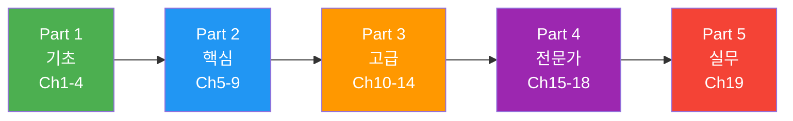

# 컴퓨터 비전 마스터 가이드

> 픽셀의 이해부터 멀티모달 AI까지 — **19챕터 93섹션** A-to-Z 튜토리얼

## 학습 로드맵

---

## Part 1: 기초 (Ch1-4)

**Ch1. 이미지의 이해** — 픽셀, 색상 공간, 이미지 포맷
- [01. 이미지란 무엇인가](01-foundations/01-what-is-image.md) · [02. 색상 공간](01-foundations/02-color-spaces.md) · [03. 이미지 형식과 압축](01-foundations/03-image-formats.md)

**Ch2. 전통적 컴퓨터 비전** — OpenCV, 필터, 에지/특징점 검출
- [01. OpenCV 시작하기](02-classical-cv/01-opencv-basics.md) · [02. 필터와 커널](02-classical-cv/02-filters-kernels.md) · [03. 에지 검출](02-classical-cv/03-edge-detection.md) · [04. 특징점 검출](02-classical-cv/04-feature-detection.md) · [05. 형태학적 연산](02-classical-cv/05-morphology.md)

**Ch3. 딥러닝 기초** — 신경망, 활성화 함수, 역전파, PyTorch
- [01. 신경망의 구조](03-deep-learning-basics/01-neural-network.md) · [02. 활성화 함수](03-deep-learning-basics/02-activation-functions.md) · [03. 역전파](03-deep-learning-basics/03-backpropagation.md) · [04. 손실 함수와 옵티마이저](03-deep-learning-basics/04-loss-optimizer.md) · [05. PyTorch 기초](03-deep-learning-basics/05-pytorch-fundamentals.md)

**Ch4. CNN 핵심 개념** — 합성곱, 풀링, 정규화
- [01. 합성곱 연산](04-cnn-fundamentals/01-convolution.md) · [02. 풀링](04-cnn-fundamentals/02-pooling.md) · [03. 배치 정규화](04-cnn-fundamentals/03-batch-normalization.md) · [04. 정규화 기법](04-cnn-fundamentals/04-regularization.md)

## Part 2: 핵심 (Ch5-9)

**Ch5. CNN 아키텍처의 진화** — LeNet → ResNet → EfficientNet → ConvNeXt
- [01. LeNet과 AlexNet](05-cnn-architectures/01-lenet-alexnet.md) · [02. VGG와 GoogLeNet](05-cnn-architectures/02-vgg-googlenet.md) · [03. ResNet](05-cnn-architectures/03-resnet.md) · [04. DenseNet과 SENet](05-cnn-architectures/04-densenet-senet.md) · [05. EfficientNet](05-cnn-architectures/05-efficientnet.md) · [06. ConvNeXt](05-cnn-architectures/06-convnext.md)

**Ch6. 이미지 분류 실전** — MNIST, CIFAR-10, 전이 학습
- [01. MNIST](06-image-classification/01-mnist.md) · [02. CIFAR-10](06-image-classification/02-cifar10.md) · [03. 전이 학습](06-image-classification/03-transfer-learning.md) · [04. 파인 튜닝](06-image-classification/04-fine-tuning.md) · [05. 데이터 증강](06-image-classification/05-data-augmentation.md)

**Ch7. 객체 탐지** — R-CNN, YOLO, DETR
- [01. 탐지 기초](07-object-detection/01-detection-basics.md) · [02. R-CNN 계열](07-object-detection/02-rcnn-family.md) · [03. YOLO](07-object-detection/03-yolo.md) · [04. Anchor-Free](07-object-detection/04-anchor-free.md) · [05. DETR](07-object-detection/05-detr.md)

**Ch8. 이미지 분할** — FCN, U-Net, Mask R-CNN, SAM
- [01. 시맨틱 세그멘테이션](08-segmentation/01-semantic-segmentation.md) · [02. 인스턴스 세그멘테이션](08-segmentation/02-instance-segmentation.md) · [03. 파놉틱 세그멘테이션](08-segmentation/03-panoptic-segmentation.md) · [04. SAM](08-segmentation/04-sam.md)

**Ch9. Vision Transformer** — Attention, ViT, Swin Transformer
- [01. 어텐션 메커니즘](09-vision-transformer/01-attention-mechanism.md) · [02. Transformer 아키텍처](09-vision-transformer/02-transformer-basics.md) · [03. ViT](09-vision-transformer/03-vit.md) · [04. Swin Transformer](09-vision-transformer/04-swin-transformer.md) · [05. 하이브리드 모델](09-vision-transformer/05-hybrid-models.md)

## Part 3: 고급 (Ch10-14)

**Ch10. Vision-Language 모델** — CLIP, BLIP, LLaVA, GPT-4V
- [01. 멀티모달 학습](10-vision-language/01-multimodal-learning.md) · [02. CLIP](10-vision-language/02-clip.md) · [03. BLIP](10-vision-language/03-blip.md) · [04. LLaVA](10-vision-language/04-llava.md) · [05. GPT-4V와 Gemini](10-vision-language/05-gpt4v-gemini.md)

**Ch11. 생성 모델 기초** — VAE, GAN
- [01. 생성 모델 개론](11-generative-basics/01-generative-intro.md) · [02. VAE](11-generative-basics/02-vae.md) · [03. GAN 기초](11-generative-basics/03-gan-basics.md) · [04. GAN 변형](11-generative-basics/04-gan-variants.md) · [05. GAN 응용](11-generative-basics/05-gan-applications.md)

**Ch12. Diffusion 모델** — DDPM, DDIM, Latent Diffusion
- [01. Diffusion 이론](12-diffusion-models/01-diffusion-theory.md) · [02. DDPM](12-diffusion-models/02-ddpm.md) · [03. DDIM](12-diffusion-models/03-ddim.md) · [04. U-Net](12-diffusion-models/04-unet-architecture.md) · [05. CFG](12-diffusion-models/05-cfg.md) · [06. Latent Diffusion](12-diffusion-models/06-latent-diffusion.md)

**Ch13. Stable Diffusion 심화** — SD 아키텍처, SDXL, FLUX
- [01. SD 아키텍처](13-stable-diffusion/01-sd-architecture.md) · [02. SD 1.5 vs SDXL](13-stable-diffusion/02-sd15-vs-sdxl.md) · [03. 프롬프트 엔지니어링](13-stable-diffusion/03-prompting.md) · [04. 샘플러](13-stable-diffusion/04-samplers.md) · [05. FLUX](13-stable-diffusion/05-flux.md) · [06. SD3](13-stable-diffusion/06-sd3-future.md)

**Ch14. 생성 AI 실전** — LoRA, ControlNet, ComfyUI
- [01. LoRA](14-generative-practice/01-lora.md) · [02. DreamBooth](14-generative-practice/02-dreambooth.md) · [03. ControlNet](14-generative-practice/03-controlnet.md) · [04. IP-Adapter](14-generative-practice/04-ip-adapter.md) · [05. ComfyUI](14-generative-practice/05-comfyui.md) · [06. 인페인팅](14-generative-practice/06-inpainting-outpainting.md)

## Part 4: 전문가 (Ch15-18)

**Ch15. 비디오 생성** — AnimateDiff, SVD, Sora
- [01. 비디오 Diffusion](15-video-generation/01-video-diffusion.md) · [02. AnimateDiff](15-video-generation/02-animatediff.md) · [03. SVD](15-video-generation/03-svd.md) · [04. Sora](15-video-generation/04-sora.md)

**Ch16. 3D 컴퓨터 비전** — 깊이 추정, 포인트 클라우드, SLAM
- [01. 깊이 추정](16-3d-vision/01-depth-estimation.md) · [02. 포인트 클라우드](16-3d-vision/02-point-clouds.md) · [03. 카메라 기하학](16-3d-vision/03-camera-geometry.md) · [04. SLAM](16-3d-vision/04-slam.md) · [05. 3D 복원](16-3d-vision/05-3d-reconstruction.md)

**Ch17. Neural Rendering** — NeRF, 3D Gaussian Splatting
- [01. NeRF 기초](17-neural-rendering/01-nerf-basics.md) · [02. NeRF 변형](17-neural-rendering/02-nerf-variants.md) · [03. 3DGS 기초](17-neural-rendering/03-3dgs-basics.md) · [04. 3DGS 심화](17-neural-rendering/04-3dgs-advanced.md) · [05. Text-to-3D](17-neural-rendering/05-text-to-3d.md)

**Ch18. 멀티모달 AI 최전선** — World Models, Embodied AI
- [01. 통합 멀티모달](18-multimodal-frontier/01-unified-models.md) · [02. World Models](18-multimodal-frontier/02-world-models.md) · [03. Embodied AI](18-multimodal-frontier/03-embodied-ai.md) · [04. 미래 연구 방향](18-multimodal-frontier/04-future-directions.md)

## Part 5: 실무 (Ch19)

**Ch19. 배포와 최적화** — 양자화, ONNX, 엣지 배포
- [01. 모델 최적화](19-deployment/01-model-optimization.md) · [02. ONNX와 TensorRT](19-deployment/02-onnx-tensorrt.md) · [03. 엣지 배포](19-deployment/03-edge-deployment.md) · [04. CV MLOps](19-deployment/04-mlops.md) · [05. 모델 서빙](19-deployment/05-serving.md)

---

**Resources**: [필수 논문](resources/essential-papers.md) · [주요 데이터셋](resources/datasets.md) · [개발 도구](resources/tools.md)

**기술 스택**: PyTorch · OpenCV · torchvision · HuggingFace Transformers/Diffusers · ONNX · TensorRT

## 라이선스

MIT License
